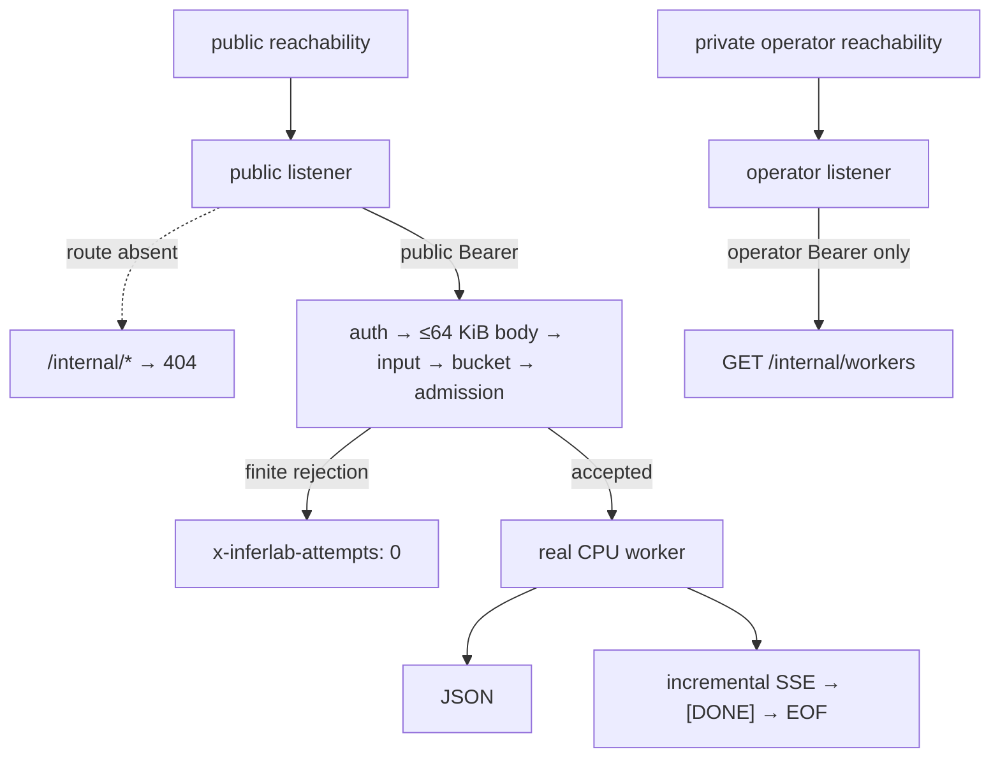

# InferLab

InferLab is one evolving system for learning how production LLM inference works—from an HTTP request entering a distributed gateway to a token leaving an optimized kernel.

The project has two equally important outputs:

1. a working distributed inference platform; and
2. reproducible evidence that explains why it works, where it fails, and what each design choice buys us.

Start with the [product requirements](docs/PRD.md), then read [RFC 0001](docs/rfcs/0001-serving-path.md) alongside the first implementation.

## Current milestone: v0.28 public edge isolation and bounded abuse budgets



v0.28 separates public and operator capabilities in hosted mode without adding
a second gateway process. The public router never registers `/internal/*`;
the private operator listener exposes only `/internal/workers` behind a
distinct credential. Public completions authenticate before reading a bounded
body, validate only the edge-owned JSON fields, charge a per-credential
monotonic token bucket, enter the existing admission system, and only then
start a worker attempt. Local mode remains an explicit compatibility path.

The zero-cost exact-process proof passes **29/29 assertions** in an exact
**27-file / 26-hash** manifest-last bundle. Public `/internal/workers` returns
the same empty `404` surface under missing, public, and operator credentials;
the operator listener accepts only its own key. Exact authentication, body,
message, prompt, token, rate, and admission rejections expose zero attempts.
A 65,536-byte body succeeds while fixed and chunked 65,537-byte bodies fail.

With a two-request burst, credential A receives `429` on request three,
credential B remains independent, and A succeeds after an observed
**1,317.514 ms** refill. Real CPU JSON completes in **824.449 ms**; SSE
completes in **825.350 ms**, delivers seven content pieces across
**616.046 ms**, reaches `[DONE]`, and drains through EOF. A separate deliberate
disconnect returns admission and worker ownership to idle. Final accounting is
18 finite edge rejections, 9 gateway attempts = 9 worker accepts, 8 successful
completion bodies, and 1 intentional cancellation.

This is an application boundary, not internet security. Buckets are in-memory
per credential/process; authenticated slow uploads and aggregate pre-gate
buffering are not bounded by them. HTTPS, reverse-proxy/network controls,
DDoS/WAF protection, secret storage, cost controls, and a public hosting
provider remain separate deployment responsibilities.


## Interview showcase

The local showcase packages three persistent Raft controls, two real CPU
workers, a signed committed route, and the public gateway into one isolated
Docker Compose topology:

```bash
./deploy/interview/start.sh
```

Open `http://127.0.0.1:8080/` and use the local-only demo key printed by the
script. Open `http://127.0.0.1:9090/targets` for the private service scrapes.
The page streams tokens from the actual gateway and displays the
request's worker, attempts, cluster, committed revision, Raft term, route
signing key, and routing policy. Prometheus history is intentionally ephemeral.

To rehearse the v0.28 split-listener contract, copy the hosted environment
template outside the repository, replace every placeholder, load it into the
current shell, and run:

```bash
./deploy/interview/start.sh --hosted-edge
```

The public listener remains loopback-only in this rehearsal; the operator
listener stays inside the private Compose network. Follow the exact secret-file
steps in the [interview topology guide](deploy/interview/README.md). Stop this
mode explicitly with `./deploy/interview/stop.sh --hosted-edge`.

Stop while retaining InferLab state with:

```bash
./deploy/interview/stop.sh
```

Use `./deploy/interview/stop.sh --purge-data` only when intentionally resetting
the dedicated demo volumes. The Compose topology publishes ports on loopback
only; neither mode is an internet deployment template. Before public hosting,
use provider-managed HTTPS and network controls, a secret store, provider-level
abuse/cost limits, and an emergency-disable path; keep controls, workers,
storage, metrics, and operator diagnostics private. If those requirements
cannot be met for `$0`, show the recorded local run and retained evidence
rather than exposing an unsafe endpoint.

The complete four-minute narrative, rehearsal checklist, supported claims, and
recording evidence bundle are in the
[interview demo guide](docs/interview-demo.md).

## Run it

Prerequisites: stable Rust, a C++20 compiler, Python 3, and `curl`. The v0.28
proof additionally uses Perl's core `Time::HiRes` monotonic-clock binding. The
v0.7 through v0.13 oracle/environment proofs additionally need PyTorch 2.2.2
or a compatible CPU build.

```bash
cargo test --workspace
./scripts/proof-v0.1.sh
./scripts/proof-v0.0.2.sh
./scripts/proof-v0.0.3.sh
./scripts/proof-v0.0.4.sh
./scripts/proof-v0.0.5.sh
./scripts/proof-v0.0.6.sh
./scripts/proof-v0.0.7.sh
./scripts/proof-v0.0.8.sh
./scripts/proof-v0.0.9.sh
./scripts/proof-v0.5.sh
./scripts/proof-v0.6.sh
INFERLAB_ORACLE_PYTHON=.tools/v0.7-python/bin/python ./scripts/proof-v0.7.sh
INFERLAB_ORACLE_PYTHON=.tools/v0.7-python/bin/python ./scripts/proof-v0.8.sh
INFERLAB_ORACLE_PYTHON=.tools/v0.7-python/bin/python ./scripts/proof-v0.9.sh
INFERLAB_ORACLE_PYTHON=.tools/v0.7-python/bin/python ./scripts/proof-v0.10.sh
INFERLAB_ORACLE_PYTHON=.tools/v0.7-python/bin/python ./scripts/proof-v0.11.sh
INFERLAB_ORACLE_PYTHON=.tools/v0.7-python/bin/python ./scripts/proof-v0.12.sh
INFERLAB_ORACLE_PYTHON=.tools/v0.7-python/bin/python ./scripts/proof-v0.13.sh
./scripts/proof-v0.14.sh
./scripts/proof-v0.15.sh
./scripts/proof-v0.16.sh
./scripts/proof-v0.17.sh
./scripts/proof-v0.18.sh
./scripts/proof-v0.19.sh
./scripts/proof-v0.20.sh
./scripts/proof-v0.21.sh
./scripts/proof-v0.22.sh
./scripts/proof-v0.23.sh
./scripts/proof-v0.24.sh
./scripts/proof-v0.25.sh
./scripts/proof-v0.26.sh
./scripts/proof-v0.27.sh
./scripts/proof-v0.28.sh
```

Earlier routing and resilience experiments still use deterministic fake workers:

```bash
FAKE_WORKER_ID=worker-a FAKE_WORKER_BIND=127.0.0.1:9001 cargo run -p fake-worker
FAKE_WORKER_ID=worker-b FAKE_WORKER_BIND=127.0.0.1:9002 cargo run -p fake-worker
FAKE_WORKER_ID=worker-c FAKE_WORKER_BIND=127.0.0.1:9003 cargo run -p fake-worker
INFERLAB_ROUTING_POLICY=least-in-flight \
INFERLAB_WORKER_CONCURRENCY=2 \
INFERLAB_ADMISSION_QUEUE_CAPACITY=4 \
INFERLAB_REQUEST_DEADLINE_MS=30000 \
INFERLAB_ATTEMPT_TIMEOUT_MS=5000 \
INFERLAB_MAX_RETRIES=2 \
INFERLAB_RETRY_BUDGET_PERCENT=10 \
INFERLAB_CIRCUIT_WINDOW_SIZE=10 \
INFERLAB_CIRCUIT_MIN_REQUESTS=5 \
INFERLAB_CIRCUIT_FAILURE_RATE_PERCENT=50 \
INFERLAB_CIRCUIT_OPEN_MS=5000 \
INFERLAB_WORKERS='worker-a=http://127.0.0.1:9001,worker-b=http://127.0.0.1:9002,worker-c=http://127.0.0.1:9003' \
  cargo run -p gateway
```

Then stream a completion:

```bash
curl -iN http://127.0.0.1:8080/v1/chat/completions \
  -H 'content-type: application/json' \
  -d '{"model":"inferlab-fake","stream":true,"messages":[{"role":"user","content":"teach me streaming"}]}'
```

The `x-inferlab-worker` response header proves which worker served the request. The SSE body ends with `data: [DONE]`.

To serve real CPU decoder tokens instead:

```bash
INFERLAB_CPU_WORKER_ID=cpu-worker-a \
INFERLAB_CPU_BIND=127.0.0.1:9101 \
INFERLAB_MODEL_PATH=models/tiny-inferlab-v2.bin \
INFERLAB_CPU_DECODER_MODE=paged-kv-cache \
INFERLAB_CPU_QUANTIZATION=fp32 \
INFERLAB_CPU_SPECULATIVE_DRAFT_QUANTIZATION=int8 \
INFERLAB_CPU_ATTENTION_KERNEL=online-tiled \
INFERLAB_CPU_ATTENTION_PRECISION=fp32 \
INFERLAB_CPU_ATTENTION_TILE_TOKENS=32 \
INFERLAB_CPU_KV_PAGE_TOKENS=4 \
INFERLAB_CPU_KV_PAGE_COUNT=64 \
INFERLAB_CPU_PREFIX_CACHE_CAPACITY=32 \
INFERLAB_CPU_MAX_BATCH_SIZE=4 \
  cargo run -p cpu-worker

INFERLAB_WORKERS='cpu-worker-a=http://127.0.0.1:9101' \
  cargo run -p gateway

curl -N http://127.0.0.1:8080/v1/chat/completions \
  -H 'content-type: application/json' \
  -d '{"model":"inferlab-tiny","stream":true,"temperature":0,"speculative_tokens":3,"max_tokens":8,"messages":[{"role":"user","content":"teach me streaming"}]}'
```

Set `INFERLAB_CPU_QUANTIZATION` to `int8` or `int4` to serve a quantized target.
Set `INFERLAB_CPU_SPECULATIVE_DRAFT_QUANTIZATION` to `int8`, `int4`, or `off`.
Speculation currently supports text responses only and accepts windows up to
eight; omitting `speculative_tokens` or setting it to zero uses the ordinary
target path.

Set `INFERLAB_CPU_ATTENTION_KERNEL` to `materialized` or `online-tiled`.
`INFERLAB_CPU_ATTENTION_PRECISION` accepts `fp32`, `fp16`, or `bf16`; the latter
two are CPU storage-rounding simulations with FP32 accumulation. Tile size is
selected by `INFERLAB_CPU_ATTENTION_TILE_TOKENS`.

To exercise the current structured path, add `temperature`, `seed`, and the
supported strict response format:

```bash
curl -N http://127.0.0.1:8080/v1/chat/completions \
  -H 'content-type: application/json' \
  -d '{"model":"inferlab-tiny","stream":true,"temperature":1,"seed":7007,"max_tokens":6,"messages":[{"role":"user","content":"teach me streaming"}],"response_format":{"type":"json_schema","json_schema":{"name":"inference_summary","strict":true,"schema":{"type":"object","properties":{"answer":{"type":"string","enum":["InferLab","systems","tokens"]},"confidence":{"type":"string","enum":["high","medium","low"]}},"required":["answer","confidence"],"additionalProperties":false}}}}'
```

The circuit defaults use a 10-outcome window, at least 5 samples, a 50%
transient-failure threshold, and a 5-second open period. `/internal/workers`
exposes each state, recent error rate, rejected routes, probes, openings, and
recoveries.

Run the batch service separately:

```bash
INFERLAB_BATCH_WAL=./data/inferlab-batch.wal \
  cargo run -p batch-queue
```

It listens on `127.0.0.1:8081` by default.

To bound cold-start disk fallback, configure the durable path and a positive
maximum age. Future skew defaults to 1,000 ms when omitted:

```bash
INFERLAB_ROUTING_SNAPSHOT_PATH=./data/gateway-routing.json \
INFERLAB_ROUTING_SNAPSHOT_MAX_AGE_MS=300000 \
INFERLAB_ROUTING_SNAPSHOT_MAX_FUTURE_SKEW_MS=1000 \
INFERLAB_CONTROL_PLANE_URLS='http://127.0.0.1:7001,http://127.0.0.1:7002,http://127.0.0.1:7003' \
  cargo run -p gateway
```

The cold-start age gate still applies only when a new process considers disk.
To govern a running process, add a positive lease duration and choose the
expiry action:

```bash
INFERLAB_ROUTING_LEASE_MS=30000 \
INFERLAB_ROUTING_LEASE_EXPIRY_ACTION=reject-new \
INFERLAB_CONTROL_CLUSTER_ID=prod-inference-eu1 \
INFERLAB_CONTROL_TRUSTED_KEYS='route-2026-a=<base64-public-key>,route-2026-b=<base64-public-key>' \
INFERLAB_CONTROL_REVOKED_KEY_IDS='' \
INFERLAB_ROUTING_SNAPSHOT_PATH=./data/gateway-routing.json \
INFERLAB_ROUTING_SNAPSHOT_MAX_AGE_MS=300000 \
INFERLAB_CONTROL_PLANE_URLS='http://127.0.0.1:7001,http://127.0.0.1:7002,http://127.0.0.1:7003' \
  cargo run -p gateway
```

Use `serve-stale` only when continuing new traffic after loss of recent control
verification is the intended availability policy. Every control node serving
this gateway must use the matching
`INFERLAB_RAFT_CLUSTER_ID=prod-inference-eu1`. Set explicit, unique values in
real deployments; `inferlab-default` is only a compatibility/teaching default.
To authenticate route bytes, every control process also uses the matching active
`INFERLAB_CONTROL_SIGNING_KEY_ID` and
`INFERLAB_CONTROL_SIGNING_PRIVATE_KEY_B64`. Provision public key B before
switching controls to B, confirm gateways persist B, then revoke A. List trusted
keys oldest to newest; the gateway refuses a later downgrade after B is active.

To require authorized route creation, configure the same writer trust policy on
every control node:

```bash
INFERLAB_CONTROL_WRITER_KEYS='deploy-bot=<base64-public-key>,break-glass=<base64-public-key>' \
INFERLAB_CONTROL_REVOKED_WRITER_IDS='' \
INFERLAB_CONTROL_WRITE_MAX_AGE_MS=30000 \
INFERLAB_CONTROL_WRITE_MAX_FUTURE_SKEW_MS=5000
```

To require service identity on Raft RPCs and gateway route reads, give every
control node its matching ID/private seed and the same public trust/scope
policy:

```bash
INFERLAB_SERVICE_ID=node-a
INFERLAB_SERVICE_CREDENTIAL_ID=key-b
INFERLAB_SERVICE_PRIVATE_KEY_B64='<node-a-private-seed>'
INFERLAB_SERVICE_TRUSTED_KEYS='node-a/key-a=<old-public>,node-a/key-b=<new-public>,node-b/key-a=<old-public>,node-b/key-b=<new-public>,node-c/key-a=<old-public>,node-c/key-b=<new-public>,gateway-primary/key-a=<old-public>,gateway-primary/key-b=<new-public>'
INFERLAB_SERVICE_REVOKED_IDS=''
INFERLAB_SERVICE_REVOKED_CREDENTIALS='node-a/key-a,node-b/key-a,node-c/key-a,gateway-primary/key-a'
INFERLAB_GATEWAY_SERVICE_IDS='gateway-primary'
INFERLAB_SERVICE_AUTH_MAX_AGE_MS=5000
INFERLAB_SERVICE_AUTH_MAX_FUTURE_SKEW_MS=1000
```

For a public or shared gateway, select hosted mode and configure distinct
public and operator listeners plus credentials. Public keys are a bounded
comma-separated set; keys are never emitted in diagnostics:

```bash
INFERLAB_PUBLIC_EDGE_MODE=hosted \
INFERLAB_BIND='127.0.0.1:8080' \
INFERLAB_PUBLIC_API_KEYS='<public-key-a>,<public-key-b>' \
INFERLAB_OPERATOR_BIND='127.0.0.1:8081' \
INFERLAB_OPERATOR_API_KEY='<distinct-operator-key>' \
INFERLAB_PUBLIC_MAX_MESSAGES=32 \
INFERLAB_PUBLIC_MAX_PROMPT_BYTES=16384 \
INFERLAB_PUBLIC_MAX_OUTPUT_TOKENS=256 \
INFERLAB_PUBLIC_RATE_REQUESTS_PER_MINUTE=60 \
INFERLAB_PUBLIC_RATE_BURST=4 \
  cargo run -p gateway
```

The public listener serves only the showcase, static asset, health/readiness,
public-key `/showcase/status`, and public-key completion routes; every
`/internal/*` path is absent and returns `404` regardless of credentials. The
operator listener serves only public-key-inaccessible, operator-key-protected
`GET /internal/workers`. Hosted completions apply authentication, a 65,536-byte
decoded-body cap, edge-owned message/prompt/output-token bounds, a per-public-
credential token bucket, then existing admission before the first worker
attempt. See the [hosted rehearsal guide](deploy/interview/README.md) before
using Compose. Default `local` mode intentionally preserves the historical
single-listener behavior and does not enforce the new hosted-only limits.

To load receiver trust online from a root-signed snapshot instead, replace the
static trusted/revoked/gateway policy variables with:

```bash
INFERLAB_SERVICE_TRUST_SNAPSHOT_PATH='/run/inferlab/node-a-service-trust.json'
INFERLAB_SERVICE_TRUST_STATE_PATH='/var/lib/inferlab/node-a-service-trust-floor.json'
INFERLAB_SERVICE_TRUST_ROOT_KEYS='service-trust-root-a=<root-public-key>'
INFERLAB_SERVICE_TRUST_REVOKED_ROOT_KEY_IDS=''
INFERLAB_SERVICE_TRUST_POLL_MS=100
```

The snapshot must still trust the node's configured local service credential.
Each control polls its own file, persists a rollback floor, and applies only a
valid higher generation.

To use the remote distributor instead of a per-node local snapshot, start
`trust-distributor` with a public root ring and expected receiver set:

```bash
INFERLAB_TRUST_DISTRIBUTOR_CLUSTER_ID='inferlab-primary' \
INFERLAB_SERVICE_TRUST_ROOT_KEYS='service-trust-root-a=<root-public-key>' \
INFERLAB_TRUST_DISTRIBUTOR_STATE_PATH='/var/lib/inferlab/distributor.json' \
INFERLAB_TRUST_DISTRIBUTOR_EXPECTED_RECEIVERS='node-a/key-a,node-b/key-a,node-c/key-a' \
  cargo run -p trust-distributor
```

Configure each control with the remote URL and its own durable cache:

```bash
INFERLAB_SERVICE_TRUST_DISTRIBUTOR_URL='http://127.0.0.1:8090'
INFERLAB_SERVICE_TRUST_CACHE_PATH='/var/lib/inferlab/node-a-trust-cache.json'
INFERLAB_SERVICE_TRUST_STATE_PATH='/var/lib/inferlab/node-a-trust-floor.json'
INFERLAB_SERVICE_TRUST_ROOT_KEYS='service-trust-root-a=<root-public-key>'
INFERLAB_SERVICE_TRUST_POLL_MS=100
INFERLAB_SERVICE_TRUST_REQUEST_TIMEOUT_MS=2000
INFERLAB_SERVICE_TRUST_MAX_BACKOFF_MS=10000
```

Remote and local-file snapshot variables are mutually exclusive. A receiver
caches and persists a candidate before it atomically activates the compiled
policy and posts a service-signed receipt. Policy v2 adds one root-signed,
exclusive validity deadline. Bound issue skew and maximum lifetime on every
receiver:

```bash
INFERLAB_SERVICE_TRUST_MAX_POLICY_LIFETIME_MS=86400000
INFERLAB_SERVICE_TRUST_POLICY_MAX_FUTURE_SKEW_MS=5000
```

The lifetime defaults to 24 hours and may be configured only from 250 ms
through seven days; future skew defaults to five seconds and is bounded from
zero through five minutes. At `now >= expires_at_ms`, new protected service
requests fail with the same redacted authentication surface regardless of
whether their request signature is present. Conditional `304` responses,
receipt retries, cache reloads, and late downloads never renew the signed
deadline. Historical policy v1 has no deadline and is rejected by signed
receivers by default. `INFERLAB_SERVICE_TRUST_ALLOW_LEGACY_V1=1` is a temporary
compatibility switch whose status is explicitly `legacy-unbounded`; do not use
it as a renewal mechanism.

For v0.24 TLS 1.3 mutual authentication, add the complete server path group to
the distributor:

```bash
INFERLAB_TRUST_DISTRIBUTOR_TLS_CERT_PATH='/run/secrets/distributor-chain.pem'
INFERLAB_TRUST_DISTRIBUTOR_TLS_KEY_PATH='/run/secrets/distributor-key.pem'
INFERLAB_TRUST_DISTRIBUTOR_TLS_CLIENT_CA_PATH='/run/secrets/client-ca.pem'
```

Then use an `https://` URL and the complete client path group on each control:

```bash
INFERLAB_SERVICE_TRUST_DISTRIBUTOR_URL='https://trust-distributor.internal:8090'
INFERLAB_SERVICE_TRUST_TLS_CA_CERT_PATH='/run/secrets/server-ca.pem'
INFERLAB_SERVICE_TRUST_TLS_CLIENT_CERT_PATH='/run/secrets/node-a-chain.pem'
INFERLAB_SERVICE_TRUST_TLS_CLIENT_KEY_PATH='/run/secrets/node-a-key.pem'
```

TLS groups are all-or-none. `https://` requires client TLS paths, while
`http://` rejects any TLS path instead of silently pretending authentication
is enabled. v0.24 loads certificates once at startup; protect the files and
plan a restart because automated certificate rotation is not implemented.

The gateway uses its own identity plus an exact URL-to-control-node map:

```bash
INFERLAB_GATEWAY_SERVICE_ID=gateway-primary
INFERLAB_GATEWAY_SERVICE_CREDENTIAL_ID=key-b
INFERLAB_GATEWAY_SERVICE_PRIVATE_KEY_B64='<gateway-private-seed>'
INFERLAB_CONTROL_SERVICE_TARGETS='node-a=http://127.0.0.1:7001,node-b=http://127.0.0.1:7002,node-c=http://127.0.0.1:7003'
```

For the current public-edge milestone, see
[RFC 0033](docs/rfcs/0033-public-edge-isolation-bounded-abuse-budgets.md),
the [phase 33 learning guide](docs/learning/phase-33-public-edge-isolation-bounded-abuse-budgets.md),
and the [retained v0.28 evidence](docs/results/v0.28/README.md).
[RFC 0032](docs/rfcs/0032-signed-service-trust-validity-expiry.md),
the [phase 32 learning guide](docs/learning/phase-32-signed-service-trust-validity-expiry.md),
and the [retained v0.27 evidence](docs/results/v0.27/README.md) remain the
signed-validity and request-time-expiry reference.
[RFC 0031](docs/rfcs/0031-bounded-cardinality-prometheus-observability.md),
the [phase 31 learning guide](docs/learning/phase-31-bounded-cardinality-prometheus-observability.md),
and the [retained v0.26 evidence](docs/results/v0.26/README.md) remain the
bounded-observability and request-correlation reference.
[RFC 0030](docs/rfcs/0030-directed-raft-partitions-and-figure-eight-safety.md),
the [phase 30 learning guide](docs/learning/phase-30-directed-raft-partitions-and-figure-eight.md),
and the [retained v0.25 evidence](docs/results/v0.25/README.md) remain the
directed-partition and Figure-8 safety reference.
[RFC 0029](docs/rfcs/0029-mutual-tls-trust-distribution.md), the
[phase 29 learning guide](docs/learning/phase-29-mutual-tls-trust-distribution.md),
and the [retained v0.24 evidence](docs/results/v0.24/README.md) remain the
trust-distribution channel-security reference.
[RFC 0028](docs/rfcs/0028-distributed-service-trust.md), the
[phase 28 learning guide](docs/learning/phase-28-distributed-service-trust.md),
and the [retained v0.23 evidence](docs/results/v0.23/README.md) remain the
distributed delivery/receipt reference.
RFC 0027, the
[phase 27 learning guide](docs/learning/phase-27-signed-online-service-trust.md),
and the [retained v0.22 evidence](docs/results/v0.22/README.md) remain the
signed local-snapshot reference. RFC 0026 and the
[phase 26 learning guide](docs/learning/phase-26-overlap-safe-service-credential-rotation.md)
remain the overlap-safe credential-lifecycle reference; RFC 0025 and the
[phase 25 learning guide](docs/learning/phase-25-cryptographic-service-identities.md)
remain the service-request identity reference; RFC 0024 and the
[phase 24 learning guide](docs/learning/phase-24-authorized-control-writers.md)
remain the administrative creation reference; RFC 0023 and the
[phase 23 learning guide](docs/learning/phase-23-signed-control-configurations.md)
remain the signed route-delivery and key-rotation reference; RFC 0022 and the
[phase 22 guide](docs/learning/phase-22-control-cluster-identity-fencing.md)
remain the cluster-namespace reference; RFC 0021 and the
[phase 21 guide](docs/learning/phase-21-runtime-routing-lease.md) remain the
runtime admission reference; RFC 0020 and the
[phase 20 guide](docs/learning/phase-20-bounded-age-routing-fallback.md) remain
the cold-start time-policy reference; RFC 0019 and the
[phase 19 guide](docs/learning/phase-19-restart-safe-routing-snapshots.md)
remain the durable routing snapshot reference; RFC 0018 and the
[phase 18 guide](docs/learning/phase-18-real-worker-full-stack-integration.md)
remain the integrated request-snapshot reference; RFC 0017 and the
[phase 17 guide](docs/learning/phase-17-tiled-online-softmax-attention.md)
remain the online-attention reference; RFC 0016 and the
[phase 16 guide](docs/learning/phase-16-quantization-and-speculative-decoding.md)
remain the quantization and speculative-decoding reference; RFC 0015 and the
[phase 15 guide](docs/learning/phase-15-sampling-and-structured-decoding.md)
remain the sampling and structured-decoding reference; RFC 0014 and the
[phase 14 guide](docs/learning/phase-14-paged-kv-cache-and-prefix-ownership.md)
remain the physical-memory and prefix-ownership reference; RFC 0013 and the
[phase 13 guide](docs/learning/phase-13-kv-cache-and-continuous-batching.md)
remain the contiguous-cache and scheduler reference.

## Repository map

```text
gateway/          Rust data-plane gateway
control-auth/     canonical route payload, Ed25519 signatures, trust, revocation
service-auth/     signed service requests, audience binding, trust, revocation
fake-worker/      deterministic inference simulator used for tests
batch-queue/      Rust durable batch API, WAL replay, leases, fencing, and DLQ
control-plane/    persistent three-node Raft election, log, commit, and config API
worker/           C++ CPU decoder, Rust transport adapter, CLI, and tests
models/           explicit tiny checkpoint and reproducibility metadata
oracle/           checkpoint generator and independent PyTorch reference
kernels/          CPU attention algorithms and future CUDA kernels
benchmarks/       load clients, analyzers, evidence checkers, SVG renderers
scripts/          reproducible proof and safe orchestration entry points
deploy/           local interview topology and deployment preparation
.github/          release-quality CI gates
docs/rfcs/        decisions, invariants, and trade-offs
docs/learning/    milestone explanations and experiments
docs/results/     benchmark evidence and conclusions
```

## Learning loop

Every milestone follows the same loop:

1. **Predict:** write the mental model and expected result.
2. **Build:** implement the smallest vertical behavior.
3. **Break:** inject the failure the design claims to handle.
4. **Measure:** save raw data and latency/throughput summaries.
5. **Explain:** compare prediction with evidence and record surprises.

This is the scientific method applied to systems engineering. A green test proves a specified behavior; a benchmark tests a performance hypothesis; a failure test validates a recovery claim. None is interchangeable with the others.
