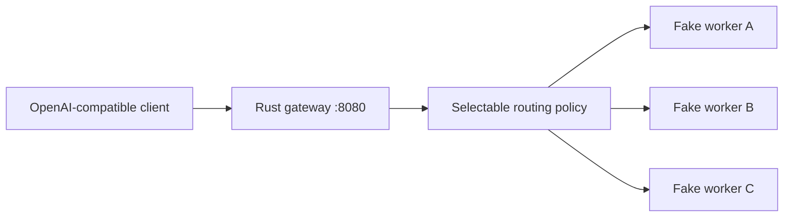

# InferLab

InferLab is one evolving system for learning how production LLM inference works—from an HTTP request entering a distributed gateway to a token leaving an optimized kernel.

The project has two equally important outputs:

1. a working distributed inference platform; and
2. reproducible evidence that explains why it works, where it fails, and what each design choice buys us.

Start with the [product requirements](docs/PRD.md), then read [RFC 0001](docs/rfcs/0001-serving-path.md) alongside the first implementation.

## Current milestone: v0.0.3 weighted routing



The gateway forwards `POST /v1/chat/completions` and streams the upstream bytes immediately. Routing is selectable between round-robin, least-in-flight, and smooth weighted round-robin. The workers deliberately simulate inference latency and deterministic failures. They are test doubles; the real model runtime will be C++.

Analogy: the gateway is a restaurant host, and workers are cooks. The host should assign a cook and relay dishes as they become ready. Waiting for the entire meal before serving anything would destroy time-to-first-token.

## Run it

Prerequisites: stable Rust, Python 3, and `curl`.

```bash
cargo test --workspace
./scripts/proof-v0.1.sh
./scripts/proof-v0.0.2.sh
./scripts/proof-v0.0.3.sh
```

Or run each process manually:

```bash
FAKE_WORKER_ID=worker-a FAKE_WORKER_BIND=127.0.0.1:9001 cargo run -p fake-worker
FAKE_WORKER_ID=worker-b FAKE_WORKER_BIND=127.0.0.1:9002 cargo run -p fake-worker
FAKE_WORKER_ID=worker-c FAKE_WORKER_BIND=127.0.0.1:9003 cargo run -p fake-worker
INFERLAB_ROUTING_POLICY=weighted \
INFERLAB_WORKERS='worker-a:3=http://127.0.0.1:9001,worker-b:1=http://127.0.0.1:9002' \
  cargo run -p gateway
```

Then stream a completion:

```bash
curl -iN http://127.0.0.1:8080/v1/chat/completions \
  -H 'content-type: application/json' \
  -d '{"model":"inferlab-fake","stream":true,"messages":[{"role":"user","content":"teach me streaming"}]}'
```

The `x-inferlab-worker` response header proves which worker served the request. The SSE body ends with `data: [DONE]`.

Available policies are `round-robin`, `least-in-flight`, and `weighted`. Worker registration uses `id[:weight]=url`; omitted weights default to 1. See [RFC 0003](docs/rfcs/0003-weighted-routing.md) and the [phase 3 learning guide](docs/learning/phase-03-weighted-routing.md).

## Repository map

```text
gateway/          Rust data-plane gateway
fake-worker/      deterministic inference simulator used for tests
worker/           future C++ model runtime
kernels/          future CPU and CUDA kernels
control-plane/    future Raft cluster configuration
queue/            future durable batch inference
benchmarks/       reproducible clients and raw-result conventions
chaos/            future failure-injection scenarios
docs/rfcs/        decisions, invariants, and trade-offs
docs/learning/    milestone explanations and experiments
docs/results/     benchmark evidence and conclusions
```

## Learning loop

Every milestone follows the same loop:

1. **Predict:** write the mental model and expected result.
2. **Build:** implement the smallest vertical behavior.
3. **Break:** inject the failure the design claims to handle.
4. **Measure:** save raw data and latency/throughput summaries.
5. **Explain:** compare prediction with evidence and record surprises.

This is the scientific method applied to systems engineering. A green test proves a specified behavior; a benchmark tests a performance hypothesis; a failure test validates a recovery claim. None is interchangeable with the others.
