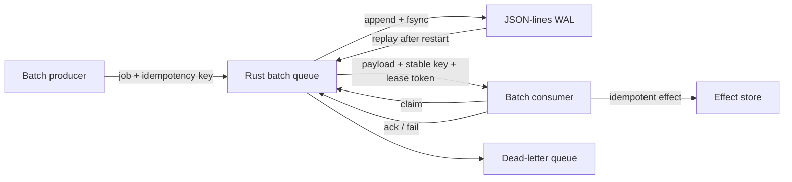
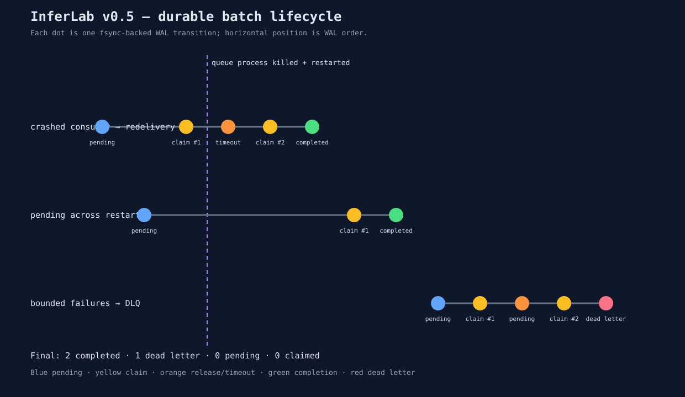

# InferLab

InferLab is one evolving system for learning how production LLM inference works—from an HTTP request entering a distributed gateway to a token leaving an optimized kernel.

The project has two equally important outputs:

1. a working distributed inference platform; and
2. reproducible evidence that explains why it works, where it fails, and what each design choice buys us.

Start with the [product requirements](docs/PRD.md), then read [RFC 0001](docs/rfcs/0001-serving-path.md) alongside the first implementation.

## Current milestone: v0.5 durable batch queue



v0.5 adds a separate durable service for unattended work. It accepts a job only
after its WAL event is synced, rebuilds state by replaying that log, leases jobs
to consumers, redelivers expired claims, fences stale acknowledgements, and
moves exhausted jobs to a dead-letter queue.

Analogy: it is a courier ledger. A parcel is written down before the sender gets
a receipt; a courier signs it out temporarily; a missing courier does not erase
the parcel; and repeated failures move it to an inspection shelf.

The retained proof kills and restarts the queue after a consumer has performed
an effect but before acknowledgement. The same job returns as attempt 2, its
stable key suppresses a duplicate effect, the old claim token is rejected, and
a poison job stops after two attempts.



## Run it

Prerequisites: stable Rust, Python 3, and `curl`.

```bash
cargo test --workspace
./scripts/proof-v0.1.sh
./scripts/proof-v0.0.2.sh
./scripts/proof-v0.0.3.sh
./scripts/proof-v0.0.4.sh
./scripts/proof-v0.0.5.sh
./scripts/proof-v0.0.6.sh
./scripts/proof-v0.0.7.sh
./scripts/proof-v0.0.8.sh
./scripts/proof-v0.0.9.sh
./scripts/proof-v0.5.sh
```

Or run each process manually:

```bash
FAKE_WORKER_ID=worker-a FAKE_WORKER_BIND=127.0.0.1:9001 cargo run -p fake-worker
FAKE_WORKER_ID=worker-b FAKE_WORKER_BIND=127.0.0.1:9002 cargo run -p fake-worker
FAKE_WORKER_ID=worker-c FAKE_WORKER_BIND=127.0.0.1:9003 cargo run -p fake-worker
INFERLAB_ROUTING_POLICY=least-in-flight \
INFERLAB_WORKER_CONCURRENCY=2 \
INFERLAB_ADMISSION_QUEUE_CAPACITY=4 \
INFERLAB_REQUEST_DEADLINE_MS=30000 \
INFERLAB_ATTEMPT_TIMEOUT_MS=5000 \
INFERLAB_MAX_RETRIES=2 \
INFERLAB_RETRY_BUDGET_PERCENT=10 \
INFERLAB_CIRCUIT_WINDOW_SIZE=10 \
INFERLAB_CIRCUIT_MIN_REQUESTS=5 \
INFERLAB_CIRCUIT_FAILURE_RATE_PERCENT=50 \
INFERLAB_CIRCUIT_OPEN_MS=5000 \
INFERLAB_WORKERS='worker-a=http://127.0.0.1:9001,worker-b=http://127.0.0.1:9002,worker-c=http://127.0.0.1:9003' \
  cargo run -p gateway
```

Then stream a completion:

```bash
curl -iN http://127.0.0.1:8080/v1/chat/completions \
  -H 'content-type: application/json' \
  -d '{"model":"inferlab-fake","stream":true,"messages":[{"role":"user","content":"teach me streaming"}]}'
```

The `x-inferlab-worker` response header proves which worker served the request. The SSE body ends with `data: [DONE]`.

The circuit defaults use a 10-outcome window, at least 5 samples, a 50%
transient-failure threshold, and a 5-second open period. `/internal/workers`
exposes each state, recent error rate, rejected routes, probes, openings, and
recoveries.

Run the batch service separately:

```bash
INFERLAB_BATCH_WAL=./data/inferlab-batch.wal \
  cargo run -p batch-queue
```

It listens on `127.0.0.1:8081` by default. See
[RFC 0010](docs/rfcs/0010-durable-batch-queue.md), the
[phase 10 learning guide](docs/learning/phase-10-durable-batch-queue.md), and
the [retained evidence](docs/results/v0.5/README.md). RFC 0009 and the
[phase 9 guide](docs/learning/phase-09-resilience-chaos.md) remain the
explanation of continuous resilience testing for the interactive path.

## Repository map

```text
gateway/          Rust data-plane gateway
fake-worker/      deterministic inference simulator used for tests
batch-queue/      Rust durable batch API, WAL replay, leases, fencing, and DLQ
worker/           future C++ model runtime
kernels/          future CPU and CUDA kernels
control-plane/    future Raft cluster configuration
benchmarks/       load clients, analyzers, evidence checkers, SVG renderers
scripts/          reproducible proof and safe orchestration entry points
docs/rfcs/        decisions, invariants, and trade-offs
docs/learning/    milestone explanations and experiments
docs/results/     benchmark evidence and conclusions
```

## Learning loop

Every milestone follows the same loop:

1. **Predict:** write the mental model and expected result.
2. **Build:** implement the smallest vertical behavior.
3. **Break:** inject the failure the design claims to handle.
4. **Measure:** save raw data and latency/throughput summaries.
5. **Explain:** compare prediction with evidence and record surprises.

This is the scientific method applied to systems engineering. A green test proves a specified behavior; a benchmark tests a performance hypothesis; a failure test validates a recovery claim. None is interchangeable with the others.
