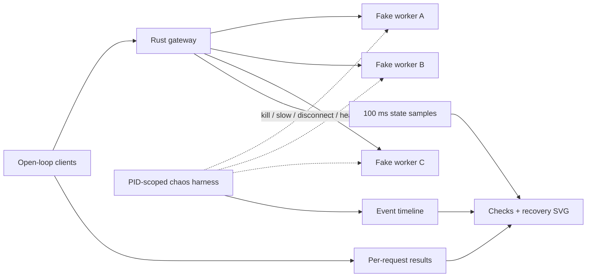

# InferLab

InferLab is one evolving system for learning how production LLM inference works—from an HTTP request entering a distributed gateway to a token leaving an optimized kernel.

The project has two equally important outputs:

1. a working distributed inference platform; and
2. reproducible evidence that explains why it works, where it fails, and what each design choice buys us.

Start with the [product requirements](docs/PRD.md), then read [RFC 0001](docs/rfcs/0001-serving-path.md) alongside the first implementation.

## Current milestone: v0.0.9 scripted resilience chaos



The serving path remains the v0.0.8 gateway: bounded admission, selectable
routing, deadline-aware retries, per-worker execution limits, and sliding-window
circuit breakers. v0.0.9 adds an external experiment system that keeps
open-loop traffic flowing while A is killed, B becomes slower than its attempt
timeout, and C is disconnected. It records requests, circuit states, resource
bounds, and exact fault timestamps before deterministically reconstructing the
recovery curve.

Analogy: earlier failure proofs checked one smoke detector at a time. The chaos
harness is a controlled fire drill with a flight recorder: people keep moving,
the blast radius is explicit, and recovery is measured rather than inferred
from one healthy response at the end.

The retained run scheduled 324 requests at 18 requests/second. All 324
succeeded, all three circuits opened and recovered, and retry accounting stayed
bounded:

```text
336 upstream attempts = 324 original requests + 12 retries
```


## Run it

Prerequisites: stable Rust, Python 3, and `curl`.

```bash
cargo test --workspace
./scripts/proof-v0.1.sh
./scripts/proof-v0.0.2.sh
./scripts/proof-v0.0.3.sh
./scripts/proof-v0.0.4.sh
./scripts/proof-v0.0.5.sh
./scripts/proof-v0.0.6.sh
./scripts/proof-v0.0.7.sh
./scripts/proof-v0.0.8.sh
./scripts/proof-v0.0.9.sh
```

Or run each process manually:

```bash
FAKE_WORKER_ID=worker-a FAKE_WORKER_BIND=127.0.0.1:9001 cargo run -p fake-worker
FAKE_WORKER_ID=worker-b FAKE_WORKER_BIND=127.0.0.1:9002 cargo run -p fake-worker
FAKE_WORKER_ID=worker-c FAKE_WORKER_BIND=127.0.0.1:9003 cargo run -p fake-worker
INFERLAB_ROUTING_POLICY=least-in-flight \
INFERLAB_WORKER_CONCURRENCY=2 \
INFERLAB_ADMISSION_QUEUE_CAPACITY=4 \
INFERLAB_REQUEST_DEADLINE_MS=30000 \
INFERLAB_ATTEMPT_TIMEOUT_MS=5000 \
INFERLAB_MAX_RETRIES=2 \
INFERLAB_RETRY_BUDGET_PERCENT=10 \
INFERLAB_CIRCUIT_WINDOW_SIZE=10 \
INFERLAB_CIRCUIT_MIN_REQUESTS=5 \
INFERLAB_CIRCUIT_FAILURE_RATE_PERCENT=50 \
INFERLAB_CIRCUIT_OPEN_MS=5000 \
INFERLAB_WORKERS='worker-a=http://127.0.0.1:9001,worker-b=http://127.0.0.1:9002,worker-c=http://127.0.0.1:9003' \
  cargo run -p gateway
```

Then stream a completion:

```bash
curl -iN http://127.0.0.1:8080/v1/chat/completions \
  -H 'content-type: application/json' \
  -d '{"model":"inferlab-fake","stream":true,"messages":[{"role":"user","content":"teach me streaming"}]}'
```

The `x-inferlab-worker` response header proves which worker served the request. The SSE body ends with `data: [DONE]`.

The circuit defaults use a 10-outcome window, at least 5 samples, a 50%
transient-failure threshold, and a 5-second open period. `/internal/workers`
exposes each state, recent error rate, rejected routes, probes, openings, and
recoveries.

For the continuous failure experiment, see
[RFC 0009](docs/rfcs/0009-scripted-resilience-chaos.md), the
[phase 9 learning guide](docs/learning/phase-09-resilience-chaos.md), and the
[retained evidence](docs/results/v0.0.9/README.md). RFC 0008 and the
[phase 8 guide](docs/learning/phase-08-circuit-breakers.md) remain the focused
explanations of the breaker state machine itself.

## Repository map

```text
gateway/          Rust data-plane gateway
fake-worker/      deterministic inference simulator used for tests
worker/           future C++ model runtime
kernels/          future CPU and CUDA kernels
control-plane/    future Raft cluster configuration
queue/            future durable batch inference
benchmarks/       load clients, analyzers, evidence checkers, SVG renderers
scripts/          reproducible proof and safe orchestration entry points
docs/rfcs/        decisions, invariants, and trade-offs
docs/learning/    milestone explanations and experiments
docs/results/     benchmark evidence and conclusions
```

## Learning loop

Every milestone follows the same loop:

1. **Predict:** write the mental model and expected result.
2. **Build:** implement the smallest vertical behavior.
3. **Break:** inject the failure the design claims to handle.
4. **Measure:** save raw data and latency/throughput summaries.
5. **Explain:** compare prediction with evidence and record surprises.

This is the scientific method applied to systems engineering. A green test proves a specified behavior; a benchmark tests a performance hypothesis; a failure test validates a recovery claim. None is interchangeable with the others.
