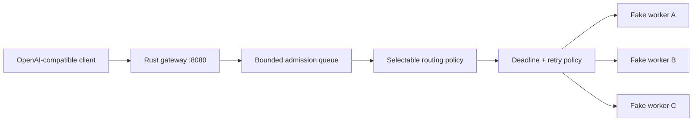

# InferLab

InferLab is one evolving system for learning how production LLM inference works—from an HTTP request entering a distributed gateway to a token leaving an optimized kernel.

The project has two equally important outputs:

1. a working distributed inference platform; and
2. reproducible evidence that explains why it works, where it fails, and what each design choice buys us.

Start with the [product requirements](docs/PRD.md), then read [RFC 0001](docs/rfcs/0001-serving-path.md) alongside the first implementation.

## Current milestone: v0.0.7 deadline-aware bounded retries



The gateway forwards `POST /v1/chat/completions` and streams the upstream bytes immediately. Every admitted request now has one end-to-end deadline covering queue wait, attempts, backoff, and streaming. Transient failures may retry on an untried worker only before downstream streaming begins, using exponential backoff with full jitter and a cumulative retry budget. Admission control and all routing policies remain intact.

Analogy: the gateway is a restaurant host, and workers are cooks. The host should assign a cook and relay dishes as they become ready. Waiting for the entire meal before serving anything would destroy time-to-first-token.

## Run it

Prerequisites: stable Rust, Python 3, and `curl`.

```bash
cargo test --workspace
./scripts/proof-v0.1.sh
./scripts/proof-v0.0.2.sh
./scripts/proof-v0.0.3.sh
./scripts/proof-v0.0.4.sh
./scripts/proof-v0.0.5.sh
./scripts/proof-v0.0.6.sh
./scripts/proof-v0.0.7.sh
```

Or run each process manually:

```bash
FAKE_WORKER_ID=worker-a FAKE_WORKER_BIND=127.0.0.1:9001 cargo run -p fake-worker
FAKE_WORKER_ID=worker-b FAKE_WORKER_BIND=127.0.0.1:9002 cargo run -p fake-worker
FAKE_WORKER_ID=worker-c FAKE_WORKER_BIND=127.0.0.1:9003 cargo run -p fake-worker
INFERLAB_ROUTING_POLICY=least-in-flight \
INFERLAB_WORKER_CONCURRENCY=2 \
INFERLAB_ADMISSION_QUEUE_CAPACITY=4 \
INFERLAB_REQUEST_DEADLINE_MS=30000 \
INFERLAB_ATTEMPT_TIMEOUT_MS=5000 \
INFERLAB_MAX_RETRIES=2 \
INFERLAB_RETRY_BUDGET_PERCENT=10 \
INFERLAB_WORKERS='worker-a=http://127.0.0.1:9001,worker-b=http://127.0.0.1:9002,worker-c=http://127.0.0.1:9003' \
  cargo run -p gateway
```

Then stream a completion:

```bash
curl -iN http://127.0.0.1:8080/v1/chat/completions \
  -H 'content-type: application/json' \
  -d '{"model":"inferlab-fake","stream":true,"messages":[{"role":"user","content":"teach me streaming"}]}'
```

The `x-inferlab-worker` response header proves which worker served the request. The SSE body ends with `data: [DONE]`.

The defaults provide a 30-second request deadline, 5-second attempt timeout, at most 2 retries, a 10% retry budget, and full-jitter backoff capped at 500 ms. `/internal/workers` exposes attempt, failure, retry, and deadline counts. See [RFC 0007](docs/rfcs/0007-deadlines-and-retries.md) and the [phase 7 learning guide](docs/learning/phase-07-deadlines-and-retries.md).

## Repository map

```text
gateway/          Rust data-plane gateway
fake-worker/      deterministic inference simulator used for tests
worker/           future C++ model runtime
kernels/          future CPU and CUDA kernels
control-plane/    future Raft cluster configuration
queue/            future durable batch inference
benchmarks/       reproducible clients and raw-result conventions
chaos/            future failure-injection scenarios
docs/rfcs/        decisions, invariants, and trade-offs
docs/learning/    milestone explanations and experiments
docs/results/     benchmark evidence and conclusions
```

## Learning loop

Every milestone follows the same loop:

1. **Predict:** write the mental model and expected result.
2. **Build:** implement the smallest vertical behavior.
3. **Break:** inject the failure the design claims to handle.
4. **Measure:** save raw data and latency/throughput summaries.
5. **Explain:** compare prediction with evidence and record surprises.

This is the scientific method applied to systems engineering. A green test proves a specified behavior; a benchmark tests a performance hypothesis; a failure test validates a recovery claim. None is interchangeable with the others.
