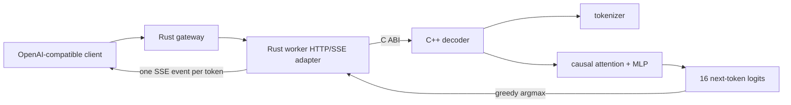

# InferLab

InferLab is one evolving system for learning how production LLM inference works—from an HTTP request entering a distributed gateway to a token leaving an optimized kernel.

The project has two equally important outputs:

1. a working distributed inference platform; and
2. reproducible evidence that explains why it works, where it fails, and what each design choice buys us.

Start with the [product requirements](docs/PRD.md), then read [RFC 0001](docs/rfcs/0001-serving-path.md) alongside the first implementation.

## Current milestone: v0.7 tiny C++ CPU decoder



v0.7 replaces simulated text with a real, deliberately tiny C++ decoder. It
loads a deterministic 13,111-byte FP32 checkpoint, tokenizes a prompt, executes
one pre-layer-normalized transformer block with four causal-attention heads,
runs an MLP, produces 16 next-token logits, greedily appends one token, and
repeats until `<eos>`.

The Rust worker adapter owns JSON, SSE, and safe lifecycle wrappers; C++ owns
every operation that affects model output. The gateway contract is unchanged.
An independent PyTorch implementation parses the same checkpoint and compares
all logits and token IDs at every generation step.

The retained proof compares 384 logit values over three prompts. Greedy tokens
match exactly and maximum absolute logit error is `4.1975708e-06`, about 24×
inside the `1e-4` limit. A real gateway request receives seven distinct content
events over 83.462 ms of deliberate pacing and reconstructs
`InferLab turns prompts into real tokens.`.


## Run it

Prerequisites: stable Rust, a C++20 compiler, Python 3, and `curl`. The v0.7
oracle proof additionally needs PyTorch 2.2.2 or a compatible CPU build.

```bash
cargo test --workspace
./scripts/proof-v0.1.sh
./scripts/proof-v0.0.2.sh
./scripts/proof-v0.0.3.sh
./scripts/proof-v0.0.4.sh
./scripts/proof-v0.0.5.sh
./scripts/proof-v0.0.6.sh
./scripts/proof-v0.0.7.sh
./scripts/proof-v0.0.8.sh
./scripts/proof-v0.0.9.sh
./scripts/proof-v0.5.sh
./scripts/proof-v0.6.sh
INFERLAB_ORACLE_PYTHON=.tools/v0.7-python/bin/python ./scripts/proof-v0.7.sh
```

Earlier routing and resilience experiments still use deterministic fake workers:

```bash
FAKE_WORKER_ID=worker-a FAKE_WORKER_BIND=127.0.0.1:9001 cargo run -p fake-worker
FAKE_WORKER_ID=worker-b FAKE_WORKER_BIND=127.0.0.1:9002 cargo run -p fake-worker
FAKE_WORKER_ID=worker-c FAKE_WORKER_BIND=127.0.0.1:9003 cargo run -p fake-worker
INFERLAB_ROUTING_POLICY=least-in-flight \
INFERLAB_WORKER_CONCURRENCY=2 \
INFERLAB_ADMISSION_QUEUE_CAPACITY=4 \
INFERLAB_REQUEST_DEADLINE_MS=30000 \
INFERLAB_ATTEMPT_TIMEOUT_MS=5000 \
INFERLAB_MAX_RETRIES=2 \
INFERLAB_RETRY_BUDGET_PERCENT=10 \
INFERLAB_CIRCUIT_WINDOW_SIZE=10 \
INFERLAB_CIRCUIT_MIN_REQUESTS=5 \
INFERLAB_CIRCUIT_FAILURE_RATE_PERCENT=50 \
INFERLAB_CIRCUIT_OPEN_MS=5000 \
INFERLAB_WORKERS='worker-a=http://127.0.0.1:9001,worker-b=http://127.0.0.1:9002,worker-c=http://127.0.0.1:9003' \
  cargo run -p gateway
```

Then stream a completion:

```bash
curl -iN http://127.0.0.1:8080/v1/chat/completions \
  -H 'content-type: application/json' \
  -d '{"model":"inferlab-fake","stream":true,"messages":[{"role":"user","content":"teach me streaming"}]}'
```

The `x-inferlab-worker` response header proves which worker served the request. The SSE body ends with `data: [DONE]`.

To serve real CPU decoder tokens instead:

```bash
INFERLAB_CPU_WORKER_ID=cpu-worker-a \
INFERLAB_CPU_BIND=127.0.0.1:9101 \
INFERLAB_MODEL_PATH=models/tiny-inferlab-v1.bin \
  cargo run -p cpu-worker

INFERLAB_WORKERS='cpu-worker-a=http://127.0.0.1:9101' \
  cargo run -p gateway

curl -N http://127.0.0.1:8080/v1/chat/completions \
  -H 'content-type: application/json' \
  -d '{"model":"inferlab-tiny","stream":true,"temperature":0,"max_tokens":8,"messages":[{"role":"user","content":"teach me streaming"}]}'
```

The circuit defaults use a 10-outcome window, at least 5 samples, a 50%
transient-failure threshold, and a 5-second open period. `/internal/workers`
exposes each state, recent error rate, rejected routes, probes, openings, and
recoveries.

Run the batch service separately:

```bash
INFERLAB_BATCH_WAL=./data/inferlab-batch.wal \
  cargo run -p batch-queue
```

It listens on `127.0.0.1:8081` by default.

For the decoder milestone, see
[RFC 0012](docs/rfcs/0012-tiny-cpu-decoder.md), the
[phase 12 learning guide](docs/learning/phase-12-tiny-cpu-decoder.md), and the
[retained v0.7 evidence](docs/results/v0.7/README.md). RFC 0011 and the
[phase 11 guide](docs/learning/phase-11-raft-control-plane.md) remain the Raft
control-plane reference.

## Repository map

```text
gateway/          Rust data-plane gateway
fake-worker/      deterministic inference simulator used for tests
batch-queue/      Rust durable batch API, WAL replay, leases, fencing, and DLQ
control-plane/    persistent three-node Raft election, log, commit, and config API
worker/           C++ CPU decoder, Rust transport adapter, CLI, and tests
models/           explicit tiny checkpoint and reproducibility metadata
oracle/           checkpoint generator and independent PyTorch reference
kernels/          future CPU and CUDA kernels
benchmarks/       load clients, analyzers, evidence checkers, SVG renderers
scripts/          reproducible proof and safe orchestration entry points
docs/rfcs/        decisions, invariants, and trade-offs
docs/learning/    milestone explanations and experiments
docs/results/     benchmark evidence and conclusions
```

## Learning loop

Every milestone follows the same loop:

1. **Predict:** write the mental model and expected result.
2. **Build:** implement the smallest vertical behavior.
3. **Break:** inject the failure the design claims to handle.
4. **Measure:** save raw data and latency/throughput summaries.
5. **Explain:** compare prediction with evidence and record surprises.

This is the scientific method applied to systems engineering. A green test proves a specified behavior; a benchmark tests a performance hypothesis; a failure test validates a recovery claim. None is interchangeable with the others.
