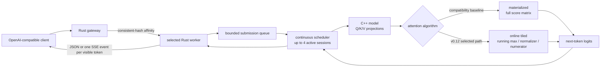

# InferLab

InferLab is one evolving system for learning how production LLM inference works—from an HTTP request entering a distributed gateway to a token leaving an optimized kernel.

The project has two equally important outputs:

1. a working distributed inference platform; and
2. reproducible evidence that explains why it works, where it fails, and what each design choice buys us.

Start with the [product requirements](docs/PRD.md), then read [RFC 0001](docs/rfcs/0001-serving-path.md) alongside the first implementation.

## Current milestone: v0.12 tiled online-softmax CPU attention



v0.12 retains the full-score materialized implementation and adds exact causal
attention that processes query and key/value tiles while carrying a running
softmax maximum, denominator, and value numerator. The online path never
allocates the complete score matrix. Algorithm, storage precision, and tile
size are selectable in the CLI and real worker; `/health` exposes the active
configuration.

Two algorithms across FP32, simulated FP16, and simulated BF16 storage match an
independent precision-aligned PyTorch oracle within `1.1553e-7`. The full model
preserves every token and text with at most `1.0e-7` logit difference. At 256
tokens and four heads, score scratch falls from 1 MiB to 128 bytes and the
declared external-traffic model falls from 4.50 to 2.25 MiB. The retained scalar
Apple M4 Pro observation is about `2.2x` faster, but it is host-specific.

This milestone does not claim CUDA or FlashAttention execution. The retained
environment has no CUDA compiler or NVIDIA runtime. FP16/BF16 modes simulate
storage rounding and use FP32 accumulation; modeled bytes are not hardware
counters. All 21 release assertions pass through standalone arithmetic, full
model, direct workers, gateway JSON, and gateway SSE paths.


## Run it

Prerequisites: stable Rust, a C++20 compiler, Python 3, and `curl`. The v0.7
through v0.12 oracle proofs additionally need PyTorch 2.2.2 or a compatible
CPU build.

```bash
cargo test --workspace
./scripts/proof-v0.1.sh
./scripts/proof-v0.0.2.sh
./scripts/proof-v0.0.3.sh
./scripts/proof-v0.0.4.sh
./scripts/proof-v0.0.5.sh
./scripts/proof-v0.0.6.sh
./scripts/proof-v0.0.7.sh
./scripts/proof-v0.0.8.sh
./scripts/proof-v0.0.9.sh
./scripts/proof-v0.5.sh
./scripts/proof-v0.6.sh
INFERLAB_ORACLE_PYTHON=.tools/v0.7-python/bin/python ./scripts/proof-v0.7.sh
INFERLAB_ORACLE_PYTHON=.tools/v0.7-python/bin/python ./scripts/proof-v0.8.sh
INFERLAB_ORACLE_PYTHON=.tools/v0.7-python/bin/python ./scripts/proof-v0.9.sh
INFERLAB_ORACLE_PYTHON=.tools/v0.7-python/bin/python ./scripts/proof-v0.10.sh
INFERLAB_ORACLE_PYTHON=.tools/v0.7-python/bin/python ./scripts/proof-v0.11.sh
INFERLAB_ORACLE_PYTHON=.tools/v0.7-python/bin/python ./scripts/proof-v0.12.sh
```

Earlier routing and resilience experiments still use deterministic fake workers:

```bash
FAKE_WORKER_ID=worker-a FAKE_WORKER_BIND=127.0.0.1:9001 cargo run -p fake-worker
FAKE_WORKER_ID=worker-b FAKE_WORKER_BIND=127.0.0.1:9002 cargo run -p fake-worker
FAKE_WORKER_ID=worker-c FAKE_WORKER_BIND=127.0.0.1:9003 cargo run -p fake-worker
INFERLAB_ROUTING_POLICY=least-in-flight \
INFERLAB_WORKER_CONCURRENCY=2 \
INFERLAB_ADMISSION_QUEUE_CAPACITY=4 \
INFERLAB_REQUEST_DEADLINE_MS=30000 \
INFERLAB_ATTEMPT_TIMEOUT_MS=5000 \
INFERLAB_MAX_RETRIES=2 \
INFERLAB_RETRY_BUDGET_PERCENT=10 \
INFERLAB_CIRCUIT_WINDOW_SIZE=10 \
INFERLAB_CIRCUIT_MIN_REQUESTS=5 \
INFERLAB_CIRCUIT_FAILURE_RATE_PERCENT=50 \
INFERLAB_CIRCUIT_OPEN_MS=5000 \
INFERLAB_WORKERS='worker-a=http://127.0.0.1:9001,worker-b=http://127.0.0.1:9002,worker-c=http://127.0.0.1:9003' \
  cargo run -p gateway
```

Then stream a completion:

```bash
curl -iN http://127.0.0.1:8080/v1/chat/completions \
  -H 'content-type: application/json' \
  -d '{"model":"inferlab-fake","stream":true,"messages":[{"role":"user","content":"teach me streaming"}]}'
```

The `x-inferlab-worker` response header proves which worker served the request. The SSE body ends with `data: [DONE]`.

To serve real CPU decoder tokens instead:

```bash
INFERLAB_CPU_WORKER_ID=cpu-worker-a \
INFERLAB_CPU_BIND=127.0.0.1:9101 \
INFERLAB_MODEL_PATH=models/tiny-inferlab-v2.bin \
INFERLAB_CPU_DECODER_MODE=paged-kv-cache \
INFERLAB_CPU_QUANTIZATION=fp32 \
INFERLAB_CPU_SPECULATIVE_DRAFT_QUANTIZATION=int8 \
INFERLAB_CPU_ATTENTION_KERNEL=online-tiled \
INFERLAB_CPU_ATTENTION_PRECISION=fp32 \
INFERLAB_CPU_ATTENTION_TILE_TOKENS=32 \
INFERLAB_CPU_KV_PAGE_TOKENS=4 \
INFERLAB_CPU_KV_PAGE_COUNT=64 \
INFERLAB_CPU_PREFIX_CACHE_CAPACITY=32 \
INFERLAB_CPU_MAX_BATCH_SIZE=4 \
  cargo run -p cpu-worker

INFERLAB_WORKERS='cpu-worker-a=http://127.0.0.1:9101' \
  cargo run -p gateway

curl -N http://127.0.0.1:8080/v1/chat/completions \
  -H 'content-type: application/json' \
  -d '{"model":"inferlab-tiny","stream":true,"temperature":0,"speculative_tokens":3,"max_tokens":8,"messages":[{"role":"user","content":"teach me streaming"}]}'
```

Set `INFERLAB_CPU_QUANTIZATION` to `int8` or `int4` to serve a quantized target.
Set `INFERLAB_CPU_SPECULATIVE_DRAFT_QUANTIZATION` to `int8`, `int4`, or `off`.
Speculation currently supports text responses only and accepts windows up to
eight; omitting `speculative_tokens` or setting it to zero uses the ordinary
target path.

Set `INFERLAB_CPU_ATTENTION_KERNEL` to `materialized` or `online-tiled`.
`INFERLAB_CPU_ATTENTION_PRECISION` accepts `fp32`, `fp16`, or `bf16`; the latter
two are CPU storage-rounding simulations with FP32 accumulation. Tile size is
selected by `INFERLAB_CPU_ATTENTION_TILE_TOKENS`.

To exercise the current structured path, add `temperature`, `seed`, and the
supported strict response format:

```bash
curl -N http://127.0.0.1:8080/v1/chat/completions \
  -H 'content-type: application/json' \
  -d '{"model":"inferlab-tiny","stream":true,"temperature":1,"seed":7007,"max_tokens":6,"messages":[{"role":"user","content":"teach me streaming"}],"response_format":{"type":"json_schema","json_schema":{"name":"inference_summary","strict":true,"schema":{"type":"object","properties":{"answer":{"type":"string","enum":["InferLab","systems","tokens"]},"confidence":{"type":"string","enum":["high","medium","low"]}},"required":["answer","confidence"],"additionalProperties":false}}}}'
```

The circuit defaults use a 10-outcome window, at least 5 samples, a 50%
transient-failure threshold, and a 5-second open period. `/internal/workers`
exposes each state, recent error rate, rejected routes, probes, openings, and
recoveries.

Run the batch service separately:

```bash
INFERLAB_BATCH_WAL=./data/inferlab-batch.wal \
  cargo run -p batch-queue
```

It listens on `127.0.0.1:8081` by default.

For the current runtime milestone, see
[RFC 0017](docs/rfcs/0017-tiled-online-softmax-attention.md), the
[phase 17 learning guide](docs/learning/phase-17-tiled-online-softmax-attention.md), and the
[retained v0.12 evidence](docs/results/v0.12/README.md). RFC 0016 and the
[phase 16 guide](docs/learning/phase-16-quantization-and-speculative-decoding.md)
remain the quantization and speculative-decoding reference; RFC 0015 and the
[phase 15 guide](docs/learning/phase-15-sampling-and-structured-decoding.md)
remain the sampling and structured-decoding reference; RFC 0014 and the
[phase 14 guide](docs/learning/phase-14-paged-kv-cache-and-prefix-ownership.md)
remain the physical-memory and prefix-ownership reference; RFC 0013 and the
[phase 13 guide](docs/learning/phase-13-kv-cache-and-continuous-batching.md)
remain the contiguous-cache and scheduler reference.

## Repository map

```text
gateway/          Rust data-plane gateway
fake-worker/      deterministic inference simulator used for tests
batch-queue/      Rust durable batch API, WAL replay, leases, fencing, and DLQ
control-plane/    persistent three-node Raft election, log, commit, and config API
worker/           C++ CPU decoder, Rust transport adapter, CLI, and tests
models/           explicit tiny checkpoint and reproducibility metadata
oracle/           checkpoint generator and independent PyTorch reference
kernels/          CPU attention algorithms and future CUDA kernels
benchmarks/       load clients, analyzers, evidence checkers, SVG renderers
scripts/          reproducible proof and safe orchestration entry points
docs/rfcs/        decisions, invariants, and trade-offs
docs/learning/    milestone explanations and experiments
docs/results/     benchmark evidence and conclusions
```

## Learning loop

Every milestone follows the same loop:

1. **Predict:** write the mental model and expected result.
2. **Build:** implement the smallest vertical behavior.
3. **Break:** inject the failure the design claims to handle.
4. **Measure:** save raw data and latency/throughput summaries.
5. **Explain:** compare prediction with evidence and record surprises.

This is the scientific method applied to systems engineering. A green test proves a specified behavior; a benchmark tests a performance hypothesis; a failure test validates a recovery claim. None is interchangeable with the others.
