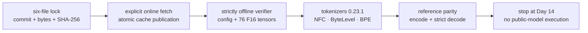
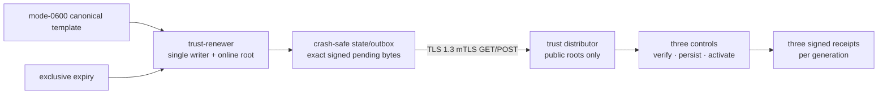
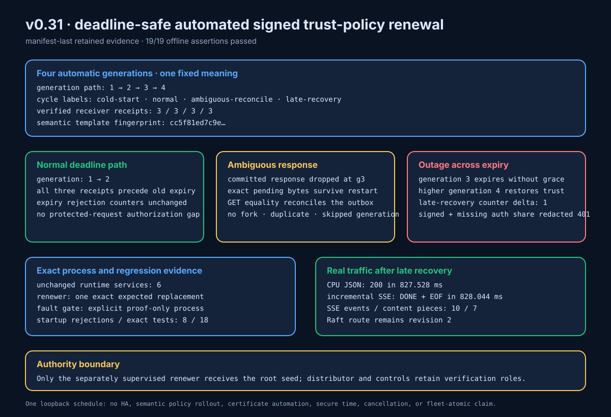
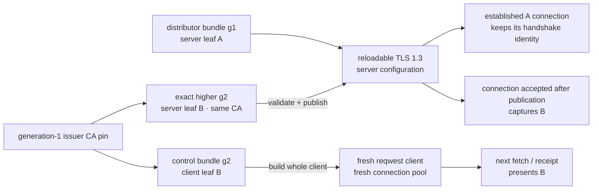
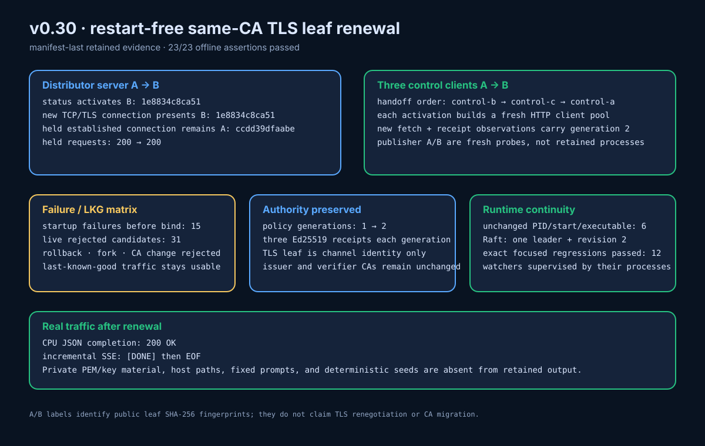
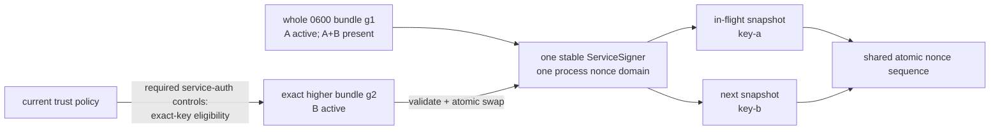
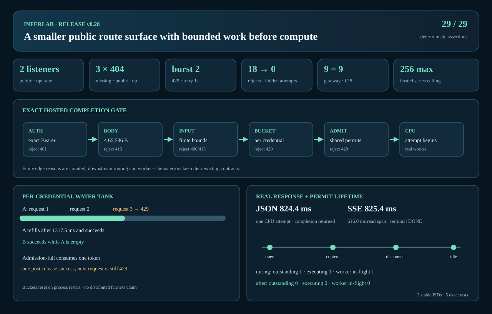

# InferLab

InferLab is one evolving system for learning how production LLM inference works—from an HTTP request entering a distributed gateway to a token leaving an optimized kernel...

The project has two equally important outputs:

1. a working distributed inference platform; and
2. reproducible evidence that explains why it works, where it fails, and what each design choice buys us.

Start with the [product requirements](docs/PRD.md), then read [RFC 0001](docs/rfcs/0001-serving-path.md) alongside the first implementation.

## Current milestone: v0.32 pinned public checkpoint and production tokenizer



v0.32 adds one deliberately narrow bridge from InferLab's deterministic tiny
teaching checkpoint to a real public artifact. The committed lock names
`EleutherAI/pythia-14m` at the complete revision
`cf967c0a9a04383db6f7b1108d86b2962634b4ac`, records its Apache-2.0
model-card declaration, and fixes the size and SHA-256 of exactly six files.
The optional acquisition script is the only online component: it stages and
verifies all 30,274,495 bytes before atomically publishing one complete cache
generation. The Rust library and `inferlab-model-inspect` never fetch.

`model-artifacts` reopens that local generation without following symlinks,
authenticates every byte, validates the exact GPT-NeoX configuration, and
accounts for all 76 finite F16 tensors: 14,067,712 elements and 28,135,424
payload bytes. Its production tokenizer consumes the already verified
`tokenizer.json` bytes through Rust `tokenizers` 0.23.1 with only the required
`fancy-regex` feature. It enforces the pinned NFC, ByteLevel, and BPE pipeline,
explicit literal-special and decode-special policies, a 2,048-token context
limit without truncation, and strict UTF-8 reconstruction rather than lossy
replacement.

The tokenizer defines a contiguous decodable domain of 50,277 IDs
(`0..=50276`); the checkpoint has 50,304 embedding/output rows. Rows
`50277..=50303` are 27 alignment-only model rows, not pad tokens and not text.
The proof compares production encode/decode results with an independently
generated pinned reference while running the Rust consumer offline.

<!-- V0.32_CANONICAL_PROOF: replace this paragraph after commit 4 lands. -->
Canonical retained assertion, corpus, bundle, timing, and manifest values are
pending the final manifest-last v0.32 proof run. The release claim is already
fixed at **zero public-model forward passes, zero generations, zero public-model
runtime services added or started, and zero retained public weight bytes**.
Ordinary workspace regressions may start ephemeral fixture listeners or child
binaries; those are outside the public-model topology and continuity scope.
The public checkpoint is not committed, copied into the runtime image, or
connected to the worker, gateway, HTTP, SSE, KV-cache, sampling, or generation
paths. The interview image still boots the existing tiny CPU model by default.
See [RFC 0037](docs/rfcs/0037-pinned-public-checkpoint-production-tokenizer.md)
and [Phase 37](docs/learning/phase-37-pinned-public-checkpoint-production-tokenizer.md).

### Previous milestone: v0.31 deadline-safe automated signed trust renewal



v0.31 closes the operational gap created by expiring signed service-trust
policies. One persistent, separately supervised `trust-renewer` owns the
configured root seed and may refresh only generation, issue time, expiry, and
signature around one canonical policy-v2 meaning. The distributor remains
signer-free. The renewer validates a bounded mode-`0600` template, holds an
exclusive mode-`0600` state lock, advances a process-monotonic effective clock,
and durably installs the exact signed pending JSON before any POST attempt.

Every cycle reconciles the existing distributor GET/POST endpoint over static
TLS 1.3 mTLS. A lost response or restart reuses the byte-identical pending
candidate; an exact remote match commits it, a compatible higher manual floor
is adopted, and rollback, fork, root, cluster, schema, lifetime, future-time,
or semantic drift fails closed. Health, readiness, redacted finite status, and
bounded OpenMetrics expose progress without revealing policy bytes,
credentials, signatures, keys, paths, or raw transport errors.

Implementation and retained proof are complete. The checker passes **19/19
assertions** against **22 total files / 21 manifest-hashed files** totaling
123,292 bytes. The run records four automatic generations and **12 verified
receipts**—three per generation—plus eight startup rejection cases and 18
exact production tests. Its initial, post-renewer-restart, and final captures
each contain seven runtime services plus one proof-only gate; the six other
runtime services and gate retain identity, while only the renewer is replaced
once for exact-pending ambiguous-outcome recovery. The expiry/outage path moves
`late_recoveries` from zero to one. Real CPU JSON completes in **827.528 ms**;
SSE completes in **828.044 ms** with ten events and seven content pieces, then
`[DONE]` and EOF. The 3,379-byte manifest SHA-256 is
`fc404a84196f36b25dd6635bd41ad960416732ed1842046bbc07e6a141c86c27`.
See [RFC 0036](docs/rfcs/0036-deadline-safe-automated-signed-service-trust-renewal.md),
[Phase 36](docs/learning/phase-36-deadline-safe-automated-signed-service-trust-renewal.md),
and the [v0.31 evidence bundle](docs/results/v0.31/README.md).



The root seed remains an online local secret in one renewer. This is neither
semantic policy automation nor HA/quorum signing. There is no burned-generation
ledger: if an ambiguous pending candidate reaches its own signed expiry, the
renewer refuses to publish it and requires explicit operator reconciliation.
v0.31 also adds no HSM/KMS custody, root or certificate automation, emergency
cancellation, secure time, fleet-atomic activation, multi-host proof, or global
service mTLS.

### Earlier milestone: v0.30 restart-free same-CA mTLS leaf renewal



v0.30 lets the running trust distributor and its three running control clients
replace their TLS leaf certificate and matching private key without replacing
the process or changing either configured verification CA. Watched mode loads
one bounded, generation-numbered, mode-`0600` identity bundle, pins the
generation-1 issuer CA, and publishes only an exact higher identity that passes
cluster/identity/purpose binding, key matching, chain, time, EKU, server-name,
same-CA, ordering, and complete runtime-construction checks. Every rejection
retains the last-known-good runtime object. Bounded status exposes the active
leaf's SHA-256 DER fingerprint for A/B observation, never its subject, serial,
PEM, CA, private key, or path.

The server config is captured when the TCP connection is accepted: a connection
accepted after publication uses distributor leaf B, while a pre-accepted
handshake future or an established A connection may finish as A. Each control
swaps the complete `reqwest::Client`,
not certificate bytes inside an existing pool. A fetch or receipt already in
flight keeps its captured client; an operation beginning after activation
captures B and a fresh connection pool. This is ordinary overlap renewal, not
TLS renegotiation or emergency termination of old connections.

The proof uses fresh publisher client connection A and a separately constructed
fresh publisher client connection B. There is no persistent publisher process,
publisher watcher, or publisher-process handoff claim. The persistent identity
continuity claim applies only to the distributor, three controls, and the other
explicitly proof-owned long-running services.

Implementation and retained proof are complete. The dependency-free checker
passes **23/23 assertions** against an exact **24-file bundle / 23
manifest-hashed non-manifest files**. The run retains 15 startup rejections, 19
live server rejections, 12 live client rejections, 12 exact production tests,
six unchanged long-running processes, and three verified receipts at each of
policy generations 1 and 2. Real CPU JSON completes in **819.971 ms**; SSE
completes in **825.317 ms** with ten events, seven content pieces, and an
**817.285 ms** first-to-last event-offset span, then `[DONE]` and EOF. The
3,710-byte manifest SHA-256 is
`697562f9f10016bae043fa763ff752e16b89013e998c89192e4521e2c1c52506`, and
the checker and SVG renderer replay byte-identically. See
[RFC 0035](docs/rfcs/0035-restart-free-same-ca-mtls-leaf-renewal.md),
[Phase 35](docs/learning/phase-35-restart-free-same-ca-mtls-leaf-renewal.md),
and the [v0.30 evidence bundle](docs/results/v0.30/README.md).



This remains local-file/process-memory key custody. Old server configurations,
established connections, and outstanding client clones can retain A after B
activates; immediate erasure and memory zeroization are not claimed. The
generation floor and issuer-CA pin are process-local, and renewal is sequential rather
than fleet-atomic. v0.30 adds no CA migration, CRL/OCSP, ACME, automated
issuance or scheduling, HSM/KMS, distributor HA, global service mTLS, or
emergency cancellation.

### Earlier milestone: v0.29 restart-free service-signing handoff



v0.29 lets the gateway and all three Raft controls change their outbound
Ed25519 service credential without process replacement. Each process validates
one complete, bounded, mode-`0600` signer bundle before listening, watches for
an exact higher generation, and swaps the whole credential state atomically.
Every outbound operation captures one immutable signer snapshot; operations
already on A finish on A, operations starting afterward use B, and both draw
from one process-lifetime nonce sequence. Its atomic sequence suffix is unique
and increasing across the handoff (`n`, then some `m > n`); eligibility checks
may consume intervening values, and the wall-clock prefix is not claimed to be
monotonic.

Invalid, stale, forked, or ineligible live candidates retain last-known-good
state. Same-generation equality compares decoded signer semantics, so JSON
formatting or credential ordering alone can be `Unchanged`; different decoded
semantics fork. When service authentication is required—as in the v0.29 proof
topology—controls activate only when the candidate's exact public key is
eligible under the current trust policy, using the documented
signer-before-authorizer lock order. Explicitly disabled compatibility mode has
no authorizer-policy gate. Gateway receiver readiness is an external operator
precondition; the gateway does not claim a fleet-atomic trust check.

The four-sender rollout is follower → follower → leader → gateway. Trust policy
g1 allows A+B, bundle generation 2 selects B, and policy g2 then revokes every
A credential. Only the three controls are receipt participants. Their normal
receipt-v1 signatures remain credential-bound to B while distributor
convergence is counted by stable service ID. Changing the signer alone creates
no handoff receipt.

The retained zero-cost proof passes **28/28 deterministic assertions** in
**28 total files / 27 hashed non-manifest files**. It records nine startup
rejections, eleven live rejections with `rejected_reloads` moving exactly
`0 → 11`, four sequential signing senders, three A receipts followed by three
B receipts, eleven exact single-test production regressions, and all six proof
processes unchanged. After B and route revision 3, real CPU JSON completes in
**831.582 ms**; SSE completes in **833.124 ms** with seven nonempty content
pieces spanning **721.919 ms**, one `[DONE]`, and EOF. The manifest SHA-256 is
`a21b3a8ddf5bd0f1f7e8a64fcfeb8485cd78c7d66d6247b6bbfa828bd94cc5a2`.
See the [retained v0.29 evidence](docs/results/v0.29/README.md),
[RFC 0034](docs/rfcs/0034-restart-free-service-signing-handoff.md), and
[Phase 34](docs/learning/phase-34-restart-free-service-signing-handoff.md).


This is local-file key custody, not managed secret rotation. A+B private keys
remain resident while the accepted bundle contains them. If a later bundle
omits A, outstanding immutable snapshots can still retain A until they drop;
no immediate erasure or memory zeroization is claimed. Restart resets the nonce
counter and in-memory bundle-generation floor; the four senders do not switch
atomically. v0.29 adds no fleet-wide TLS, HSM/KMS, HA, automated renewal,
same-CA leaf renewal, or CA migration.

### Earlier milestone: v0.28 public edge isolation

v0.28 remains the retained interview-facing edge proof: hosted mode separates
public and operator listeners, bounds public request work, and passes 29/29
assertions in an exact 27-file/26-hash manifest-last bundle. It is an
application boundary, not HTTPS, WAF/DDoS protection, billing, or public
hosting...



## Interview showcase

The local showcase packages three persistent Raft controls, two real CPU
workers, a signed committed route, and the public gateway into one isolated
Docker Compose topology:

```bash
./deploy/interview/start.sh
```

Open `http://127.0.0.1:8080/` and use the local-only demo key printed by the
script. Open `http://127.0.0.1:9090/targets` for the private service scrapes.
The page streams tokens from the actual gateway and displays the
request's worker, attempts, cluster, committed revision, Raft term, route
signing key, and routing policy. Prometheus history is intentionally ephemeral.

To rehearse the v0.28 split-listener contract, copy the hosted environment
template outside the repository, replace every placeholder, load it into the
current shell, and run:

```bash
./deploy/interview/start.sh --hosted-edge
```

The public listener remains loopback-only in this rehearsal; the operator
listener stays inside the private Compose network. Follow the exact secret-file
steps in the [interview topology guide](deploy/interview/README.md). Stop this
mode explicitly with `./deploy/interview/stop.sh --hosted-edge`.

Stop while retaining InferLab state with:

```bash
./deploy/interview/stop.sh
```

Use `./deploy/interview/stop.sh --purge-data` only when intentionally resetting
the dedicated demo volumes. The Compose topology publishes ports on loopback
only; neither mode is an internet deployment template. Before public hosting,
use provider-managed HTTPS and network controls, a secret store, provider-level
abuse/cost limits, and an emergency-disable path; keep controls, workers,
storage, metrics, and operator diagnostics private. If those requirements
cannot be met for `$0`, show the recorded local run and retained evidence
rather than exposing an unsafe endpoint.

The complete five-minute narrative, rehearsal checklist, supported claims, and
recording evidence bundle are in the
[interview demo guide](docs/interview-demo.md).

## Run it

Prerequisites: stable Rust, a C++20 compiler, Python 3, and `curl`. The v0.32
reference generator pins Python `tokenizers==0.23.1`; its clean proof fetches
the six locked public artifacts once, then runs every Rust inspection and
tokenizer operation offline. The v0.31, v0.30, and v0.29 proofs additionally
use OpenSSL and Python with TLS 1.3 support; the v0.28 proof uses Perl's core
`Time::HiRes` monotonic-clock binding. The v0.7
through v0.13 oracle/environment proofs additionally need PyTorch 2.2.2 or a
compatible CPU build.

Create the isolated v0.32 reference environment once. The pinned Python
package reads the already verified local tokenizer JSON; it does not discover,
download, or initialize a Hub model/cache:

```bash
python3 -m venv .tools/v0.32-python
.tools/v0.32-python/bin/python -m pip install --no-deps tokenizers==0.23.1
cargo fetch --locked
```

That dependency prefetch is intentionally outside the evidence run. The v0.32
proof then forces every resolving Cargo command to `--locked --offline` and
keeps Hub/model-file network authority disabled after explicit acquisition.

```bash
cargo test --workspace
./scripts/proof-v0.1.sh
./scripts/proof-v0.0.2.sh
./scripts/proof-v0.0.3.sh
./scripts/proof-v0.0.4.sh
./scripts/proof-v0.0.5.sh
./scripts/proof-v0.0.6.sh
./scripts/proof-v0.0.7.sh
./scripts/proof-v0.0.8.sh
./scripts/proof-v0.0.9.sh
./scripts/proof-v0.5.sh
./scripts/proof-v0.6.sh
INFERLAB_ORACLE_PYTHON=.tools/v0.7-python/bin/python ./scripts/proof-v0.7.sh
INFERLAB_ORACLE_PYTHON=.tools/v0.7-python/bin/python ./scripts/proof-v0.8.sh
INFERLAB_ORACLE_PYTHON=.tools/v0.7-python/bin/python ./scripts/proof-v0.9.sh
INFERLAB_ORACLE_PYTHON=.tools/v0.7-python/bin/python ./scripts/proof-v0.10.sh
INFERLAB_ORACLE_PYTHON=.tools/v0.7-python/bin/python ./scripts/proof-v0.11.sh
INFERLAB_ORACLE_PYTHON=.tools/v0.7-python/bin/python ./scripts/proof-v0.12.sh
INFERLAB_ORACLE_PYTHON=.tools/v0.7-python/bin/python ./scripts/proof-v0.13.sh
./scripts/proof-v0.14.sh
./scripts/proof-v0.15.sh
./scripts/proof-v0.16.sh
./scripts/proof-v0.17.sh
./scripts/proof-v0.18.sh
./scripts/proof-v0.19.sh
./scripts/proof-v0.20.sh
./scripts/proof-v0.21.sh
./scripts/proof-v0.22.sh
./scripts/proof-v0.23.sh
./scripts/proof-v0.24.sh
./scripts/proof-v0.25.sh
./scripts/proof-v0.26.sh
./scripts/proof-v0.27.sh
./scripts/proof-v0.28.sh
./scripts/proof-v0.29.sh
./scripts/proof-v0.30.sh
./scripts/proof-v0.31.sh
INFERLAB_V32_REFERENCE_PYTHON=.tools/v0.32-python/bin/python ./scripts/proof-v0.32.sh
```

Earlier routing and resilience experiments still use deterministic fake workers:

```bash
FAKE_WORKER_ID=worker-a FAKE_WORKER_BIND=127.0.0.1:9001 cargo run -p fake-worker
FAKE_WORKER_ID=worker-b FAKE_WORKER_BIND=127.0.0.1:9002 cargo run -p fake-worker
FAKE_WORKER_ID=worker-c FAKE_WORKER_BIND=127.0.0.1:9003 cargo run -p fake-worker
INFERLAB_ROUTING_POLICY=least-in-flight \
INFERLAB_WORKER_CONCURRENCY=2 \
INFERLAB_ADMISSION_QUEUE_CAPACITY=4 \
INFERLAB_REQUEST_DEADLINE_MS=30000 \
INFERLAB_ATTEMPT_TIMEOUT_MS=5000 \
INFERLAB_MAX_RETRIES=2 \
INFERLAB_RETRY_BUDGET_PERCENT=10 \
INFERLAB_CIRCUIT_WINDOW_SIZE=10 \
INFERLAB_CIRCUIT_MIN_REQUESTS=5 \
INFERLAB_CIRCUIT_FAILURE_RATE_PERCENT=50 \
INFERLAB_CIRCUIT_OPEN_MS=5000 \
INFERLAB_WORKERS='worker-a=http://127.0.0.1:9001,worker-b=http://127.0.0.1:9002,worker-c=http://127.0.0.1:9003' \
  cargo run -p gateway
```

Then stream a completion:

```bash
curl -iN http://127.0.0.1:8080/v1/chat/completions \
  -H 'content-type: application/json' \
  -d '{"model":"inferlab-fake","stream":true,"messages":[{"role":"user","content":"teach me streaming"}]}'
```

The `x-inferlab-worker` response header proves which worker served the request. The SSE body ends with `data: [DONE]`.

To serve real CPU decoder tokens instead:

```bash
INFERLAB_CPU_WORKER_ID=cpu-worker-a \
INFERLAB_CPU_BIND=127.0.0.1:9101 \
INFERLAB_MODEL_PATH=models/tiny-inferlab-v2.bin \
INFERLAB_CPU_DECODER_MODE=paged-kv-cache \
INFERLAB_CPU_QUANTIZATION=fp32 \
INFERLAB_CPU_SPECULATIVE_DRAFT_QUANTIZATION=int8 \
INFERLAB_CPU_ATTENTION_KERNEL=online-tiled \
INFERLAB_CPU_ATTENTION_PRECISION=fp32 \
INFERLAB_CPU_ATTENTION_TILE_TOKENS=32 \
INFERLAB_CPU_KV_PAGE_TOKENS=4 \
INFERLAB_CPU_KV_PAGE_COUNT=64 \
INFERLAB_CPU_PREFIX_CACHE_CAPACITY=32 \
INFERLAB_CPU_MAX_BATCH_SIZE=4 \
  cargo run -p cpu-worker

INFERLAB_WORKERS='cpu-worker-a=http://127.0.0.1:9101' \
  cargo run -p gateway

curl -N http://127.0.0.1:8080/v1/chat/completions \
  -H 'content-type: application/json' \
  -d '{"model":"inferlab-tiny","stream":true,"temperature":0,"speculative_tokens":3,"max_tokens":8,"messages":[{"role":"user","content":"teach me streaming"}]}'
```

Set `INFERLAB_CPU_QUANTIZATION` to `int8` or `int4` to serve a quantized target.
Set `INFERLAB_CPU_SPECULATIVE_DRAFT_QUANTIZATION` to `int8`, `int4`, or `off`.
Speculation currently supports text responses only and accepts windows up to
eight; omitting `speculative_tokens` or setting it to zero uses the ordinary
target path.

Set `INFERLAB_CPU_ATTENTION_KERNEL` to `materialized` or `online-tiled`.
`INFERLAB_CPU_ATTENTION_PRECISION` accepts `fp32`, `fp16`, or `bf16`; the latter
two are CPU storage-rounding simulations with FP32 accumulation. Tile size is
selected by `INFERLAB_CPU_ATTENTION_TILE_TOKENS`.

To exercise the current structured path, add `temperature`, `seed`, and the
supported strict response format:

```bash
curl -N http://127.0.0.1:8080/v1/chat/completions \
  -H 'content-type: application/json' \
  -d '{"model":"inferlab-tiny","stream":true,"temperature":1,"seed":7007,"max_tokens":6,"messages":[{"role":"user","content":"teach me streaming"}],"response_format":{"type":"json_schema","json_schema":{"name":"inference_summary","strict":true,"schema":{"type":"object","properties":{"answer":{"type":"string","enum":["InferLab","systems","tokens"]},"confidence":{"type":"string","enum":["high","medium","low"]}},"required":["answer","confidence"],"additionalProperties":false}}}}'
```

The circuit defaults use a 10-outcome window, at least 5 samples, a 50%
transient-failure threshold, and a 5-second open period. `/internal/workers`
exposes each state, recent error rate, rejected routes, probes, openings, and
recoveries.

Run the batch service separately:

```bash
INFERLAB_BATCH_WAL=./data/inferlab-batch.wal \
  cargo run -p batch-queue
```

It listens on `127.0.0.1:8081` by default.

To bound cold-start disk fallback, configure the durable path and a positive
maximum age. Future skew defaults to 1,000 ms when omitted:

```bash
INFERLAB_ROUTING_SNAPSHOT_PATH=./data/gateway-routing.json \
INFERLAB_ROUTING_SNAPSHOT_MAX_AGE_MS=300000 \
INFERLAB_ROUTING_SNAPSHOT_MAX_FUTURE_SKEW_MS=1000 \
INFERLAB_CONTROL_PLANE_URLS='http://127.0.0.1:7001,http://127.0.0.1:7002,http://127.0.0.1:7003' \
  cargo run -p gateway
```

The cold-start age gate still applies only when a new process considers disk.
To govern a running process, add a positive lease duration and choose the
expiry action:

```bash
INFERLAB_ROUTING_LEASE_MS=30000 \
INFERLAB_ROUTING_LEASE_EXPIRY_ACTION=reject-new \
INFERLAB_CONTROL_CLUSTER_ID=prod-inference-eu1 \
INFERLAB_CONTROL_TRUSTED_KEYS='route-2026-a=<base64-public-key>,route-2026-b=<base64-public-key>' \
INFERLAB_CONTROL_REVOKED_KEY_IDS='' \
INFERLAB_ROUTING_SNAPSHOT_PATH=./data/gateway-routing.json \
INFERLAB_ROUTING_SNAPSHOT_MAX_AGE_MS=300000 \
INFERLAB_CONTROL_PLANE_URLS='http://127.0.0.1:7001,http://127.0.0.1:7002,http://127.0.0.1:7003' \
  cargo run -p gateway
```

Use `serve-stale` only when continuing new traffic after loss of recent control
verification is the intended availability policy. Every control node serving
this gateway must use the matching
`INFERLAB_RAFT_CLUSTER_ID=prod-inference-eu1`. Set explicit, unique values in
real deployments; `inferlab-default` is only a compatibility/teaching default.
To authenticate route bytes, every control process also uses the matching active
`INFERLAB_CONTROL_SIGNING_KEY_ID` and
`INFERLAB_CONTROL_SIGNING_PRIVATE_KEY_B64`. Provision public key B before
switching controls to B, confirm gateways persist B, then revoke A. List trusted
keys oldest to newest; the gateway refuses a later downgrade after B is active.

To require authorized route creation, configure the same writer trust policy on
every control node:

```bash
INFERLAB_CONTROL_WRITER_KEYS='deploy-bot=<base64-public-key>,break-glass=<base64-public-key>' \
INFERLAB_CONTROL_REVOKED_WRITER_IDS='' \
INFERLAB_CONTROL_WRITE_MAX_AGE_MS=30000 \
INFERLAB_CONTROL_WRITE_MAX_FUTURE_SKEW_MS=5000
```

To require service identity on Raft RPCs and gateway route reads, give every
control node its matching ID/private seed and the same public trust/scope
policy:

```bash
INFERLAB_SERVICE_ID=node-a
INFERLAB_SERVICE_CREDENTIAL_ID=key-b
INFERLAB_SERVICE_PRIVATE_KEY_B64='<node-a-private-seed>'
INFERLAB_SERVICE_TRUSTED_KEYS='node-a/key-a=<old-public>,node-a/key-b=<new-public>,node-b/key-a=<old-public>,node-b/key-b=<new-public>,node-c/key-a=<old-public>,node-c/key-b=<new-public>,gateway-primary/key-a=<old-public>,gateway-primary/key-b=<new-public>'
INFERLAB_SERVICE_REVOKED_IDS=''
INFERLAB_SERVICE_REVOKED_CREDENTIALS='node-a/key-a,node-b/key-a,node-c/key-a,gateway-primary/key-a'
INFERLAB_GATEWAY_SERVICE_IDS='gateway-primary'
INFERLAB_SERVICE_AUTH_MAX_AGE_MS=5000
INFERLAB_SERVICE_AUTH_MAX_FUTURE_SKEW_MS=1000
```

For a public or shared gateway, select hosted mode and configure distinct
public and operator listeners plus credentials. Public keys are a bounded
comma-separated set; keys are never emitted in diagnostics:

```bash
INFERLAB_PUBLIC_EDGE_MODE=hosted \
INFERLAB_BIND='127.0.0.1:8080' \
INFERLAB_PUBLIC_API_KEYS='<public-key-a>,<public-key-b>' \
INFERLAB_OPERATOR_BIND='127.0.0.1:8081' \
INFERLAB_OPERATOR_API_KEY='<distinct-operator-key>' \
INFERLAB_PUBLIC_MAX_MESSAGES=32 \
INFERLAB_PUBLIC_MAX_PROMPT_BYTES=16384 \
INFERLAB_PUBLIC_MAX_OUTPUT_TOKENS=256 \
INFERLAB_PUBLIC_RATE_REQUESTS_PER_MINUTE=60 \
INFERLAB_PUBLIC_RATE_BURST=4 \
  cargo run -p gateway
```

The public listener serves only the showcase, static asset, health/readiness,
public-key `/showcase/status`, and public-key completion routes; every
`/internal/*` path is absent and returns `404` regardless of credentials. The
operator listener serves only public-key-inaccessible, operator-key-protected
`GET /internal/workers`. Hosted completions apply authentication, a 65,536-byte
decoded-body cap, edge-owned message/prompt/output-token bounds, a per-public-
credential token bucket, then existing admission before the first worker
attempt. See the [hosted rehearsal guide](deploy/interview/README.md) before
using Compose. Default `local` mode intentionally preserves the historical
single-listener behavior and does not enforce the new hosted-only limits.

To load receiver trust online from a root-signed snapshot instead, replace the
static trusted/revoked/gateway policy variables with:

```bash
INFERLAB_SERVICE_TRUST_SNAPSHOT_PATH='/run/inferlab/node-a-service-trust.json'
INFERLAB_SERVICE_TRUST_STATE_PATH='/var/lib/inferlab/node-a-service-trust-floor.json'
INFERLAB_SERVICE_TRUST_ROOT_KEYS='service-trust-root-a=<root-public-key>'
INFERLAB_SERVICE_TRUST_REVOKED_ROOT_KEY_IDS=''
INFERLAB_SERVICE_TRUST_POLL_MS=100
```

The snapshot must still trust the node's configured local service credential.
Each control polls its own file, persists a rollback floor, and applies only a
valid higher generation.

To use the remote distributor instead of a per-node local snapshot, start
`trust-distributor` with a public root ring and expected receiver set:

```bash
INFERLAB_TRUST_DISTRIBUTOR_CLUSTER_ID='inferlab-primary' \
INFERLAB_SERVICE_TRUST_ROOT_KEYS='service-trust-root-a=<root-public-key>' \
INFERLAB_TRUST_DISTRIBUTOR_STATE_PATH='/var/lib/inferlab/distributor.json' \
INFERLAB_TRUST_DISTRIBUTOR_EXPECTED_SERVICE_IDS='node-a,node-b,node-c' \
  cargo run -p trust-distributor
```

Configure each control with the remote URL and its own durable cache:

```bash
INFERLAB_SERVICE_TRUST_DISTRIBUTOR_URL='http://127.0.0.1:8090'
INFERLAB_SERVICE_TRUST_CACHE_PATH='/var/lib/inferlab/node-a-trust-cache.json'
INFERLAB_SERVICE_TRUST_STATE_PATH='/var/lib/inferlab/node-a-trust-floor.json'
INFERLAB_SERVICE_TRUST_ROOT_KEYS='service-trust-root-a=<root-public-key>'
INFERLAB_SERVICE_TRUST_POLL_MS=100
INFERLAB_SERVICE_TRUST_REQUEST_TIMEOUT_MS=2000
INFERLAB_SERVICE_TRUST_MAX_BACKOFF_MS=10000
```

Remote and local-file snapshot variables are mutually exclusive. A receiver
caches and persists a candidate before it atomically activates the compiled
policy and posts a service-signed receipt. Policy v2 adds one root-signed,
exclusive validity deadline. Bound issue skew and maximum lifetime on every
receiver:

```bash
INFERLAB_SERVICE_TRUST_MAX_POLICY_LIFETIME_MS=86400000
INFERLAB_SERVICE_TRUST_POLICY_MAX_FUTURE_SKEW_MS=5000
```

The lifetime defaults to 24 hours and may be configured only from 250 ms
through seven days; future skew defaults to five seconds and is bounded from
zero through five minutes. At `now >= expires_at_ms`, new protected service
requests fail with the same redacted authentication surface regardless of
whether their request signature is present. Conditional `304` responses,
receipt retries, cache reloads, and late downloads never renew the signed
deadline. Historical policy v1 has no deadline and is rejected by signed
receivers by default. `INFERLAB_SERVICE_TRUST_ALLOW_LEGACY_V1=1` is a temporary
compatibility switch whose status is explicitly `legacy-unbounded`; do not use
it as a renewal mechanism.

For v0.24 TLS 1.3 mutual authentication, add the complete server path group to
the distributor:

```bash
INFERLAB_TRUST_DISTRIBUTOR_TLS_CERT_PATH='/run/secrets/distributor-chain.pem'
INFERLAB_TRUST_DISTRIBUTOR_TLS_KEY_PATH='/run/secrets/distributor-key.pem'
INFERLAB_TRUST_DISTRIBUTOR_TLS_CLIENT_CA_PATH='/run/secrets/client-ca.pem'
```

Then use an `https://` URL and the complete client path group on each control:

```bash
INFERLAB_SERVICE_TRUST_DISTRIBUTOR_URL='https://trust-distributor.internal:8090'
INFERLAB_SERVICE_TRUST_TLS_CA_CERT_PATH='/run/secrets/server-ca.pem'
INFERLAB_SERVICE_TRUST_TLS_CLIENT_CERT_PATH='/run/secrets/node-a-chain.pem'
INFERLAB_SERVICE_TRUST_TLS_CLIENT_KEY_PATH='/run/secrets/node-a-key.pem'
```

TLS groups are all-or-none. `https://` requires one complete client identity
source, while `http://` rejects TLS paths instead of silently pretending
authentication is enabled. The legacy v0.24 PEM-path mode still loads one
identity at startup. v0.30 adds an explicit watched-bundle mode for same-CA
leaf replacement; it does not schedule or issue certificates automatically.

For a reloadable distributor server identity, retain the static client-
verification CA and replace the legacy server certificate/key paths with:

```bash
INFERLAB_TRUST_DISTRIBUTOR_TLS_IDENTITY_BUNDLE_PATH='/run/secrets/distributor-tls-identity.json'
INFERLAB_TRUST_DISTRIBUTOR_TLS_IDENTITY_BUNDLE_POLL_MS=100
INFERLAB_TRUST_DISTRIBUTOR_TLS_SERVER_NAME='trust-distributor.internal'
INFERLAB_TRUST_DISTRIBUTOR_TLS_CLIENT_CA_PATH='/run/secrets/client-ca.pem'
```

Each control retains its static server-verification CA and replaces the legacy
client certificate/key pair with:

```bash
INFERLAB_SERVICE_TRUST_TLS_CA_CERT_PATH='/run/secrets/server-ca.pem'
INFERLAB_SERVICE_TRUST_TLS_CLIENT_IDENTITY_BUNDLE_PATH='/run/secrets/control-tls-identity.json'
INFERLAB_SERVICE_TRUST_TLS_CLIENT_IDENTITY_BUNDLE_POLL_MS=100
```

Watched and legacy identity sources are mutually exclusive. On Unix, install
each complete bundle as an exact mode-`0600` regular, non-symlink file and
replace it atomically. A higher generation must keep the generation-1 issuer
CA. Distributor activation affects TLS connections accepted after publication;
pre-accepted handshake futures and established connections may retain A.
Control activation builds a whole new HTTP client and pool for new
fetch/receipt operations. In-flight operations may finish on the old leaf.

To renew one fixed policy-v2 meaning automatically, install the canonical
template and renewer state directory under private local custody, keep the
distributor configured with public roots only, and start the separate
`trust-renewer` process with a complete strict configuration:

```bash
INFERLAB_TRUST_RENEWER_STATUS_BIND='127.0.0.1:8091' \
INFERLAB_TRUST_RENEWER_DISTRIBUTOR_URL='https://trust-distributor.internal:8090' \
INFERLAB_TRUST_RENEWER_CLUSTER_ID='inferlab-primary' \
INFERLAB_TRUST_RENEWER_TEMPLATE_PATH='/run/secrets/service-trust-renewal-template.json' \
INFERLAB_TRUST_RENEWER_STATE_PATH='/var/lib/inferlab/trust-renewer-state.json' \
INFERLAB_TRUST_RENEWER_ROOT_KEY_ID='service-trust-root-a' \
INFERLAB_TRUST_RENEWER_ROOT_PRIVATE_KEY_B64='<base64-ed25519-root-seed>' \
INFERLAB_TRUST_RENEWER_TLS_SERVER_CA_PATH='/run/secrets/server-ca.pem' \
INFERLAB_TRUST_RENEWER_TLS_CLIENT_CERT_PATH='/run/secrets/renewer-chain.pem' \
INFERLAB_TRUST_RENEWER_TLS_CLIENT_KEY_PATH='/run/secrets/renewer-key.pem' \
INFERLAB_TRUST_RENEWER_POLICY_LIFETIME_MS=86400000 \
INFERLAB_TRUST_RENEWER_RENEW_BEFORE_MS=3600000 \
INFERLAB_TRUST_RENEWER_POLL_INTERVAL_MS=1000 \
INFERLAB_TRUST_RENEWER_RETRY_INTERVAL_MS=5000 \
INFERLAB_TRUST_RENEWER_REQUEST_TIMEOUT_MS=2000 \
  cargo run -p trust-renewer
```

The status listener is mandatory loopback and serves `/health`, `/readyz`, and
`/v1/service-trust/renewal/status`. Optional OpenMetrics continues to use the
shared `INFERLAB_METRICS_BIND` listener. On Unix, the template, state, lock,
and TLS private-key sources must satisfy their strict file-custody contracts.
The renew-before margin must be strictly greater than one request timeout plus
one retry interval. An expired pending outbox is never POSTed.

Legacy static gateway configuration uses its own identity plus an exact
URL-to-control-node map:

```bash
INFERLAB_GATEWAY_SERVICE_ID=gateway-primary
INFERLAB_GATEWAY_SERVICE_CREDENTIAL_ID=key-b
INFERLAB_GATEWAY_SERVICE_PRIVATE_KEY_B64='<gateway-private-seed>'
INFERLAB_CONTROL_SERVICE_TARGETS='node-a=http://127.0.0.1:7001,node-b=http://127.0.0.1:7002,node-c=http://127.0.0.1:7003'
```

v0.29 watched mode replaces the legacy credential/private-key pair with one
whole local bundle while keeping the stable service ID and targets:

```bash
INFERLAB_GATEWAY_SERVICE_ID=gateway-primary
INFERLAB_GATEWAY_SERVICE_SIGNING_BUNDLE_PATH='/run/secrets/gateway-signing-bundle.json'
INFERLAB_GATEWAY_SERVICE_SIGNING_BUNDLE_POLL_MS=100
INFERLAB_CONTROL_SERVICE_TARGETS='node-a=http://127.0.0.1:7001,node-b=http://127.0.0.1:7002,node-c=http://127.0.0.1:7003'
```

Controls use `INFERLAB_SERVICE_ID`,
`INFERLAB_SERVICE_SIGNING_BUNDLE_PATH`, and optional
`INFERLAB_SERVICE_SIGNING_BUNDLE_POLL_MS`. Watched and legacy private-key
sources are mutually exclusive. On Unix, install each whole bundle as an exact
mode-`0600` regular file and replace it atomically; startup validates it before
listening. Make every candidate gateway key eligible on all intended controls
before selecting it. Controls in required service-auth mode additionally reject
a candidate whose exact key is not eligible under their current trust policy;
explicitly disabled compatibility mode has no policy-eligibility gate.

For the current pinned-public-artifact milestone, see
[RFC 0037](docs/rfcs/0037-pinned-public-checkpoint-production-tokenizer.md) and the
[phase 37 learning guide](docs/learning/phase-37-pinned-public-checkpoint-production-tokenizer.md).
The explicit acquisition entry point is `scripts/fetch-v0.32-assets.sh`; the
library and `inferlab-model-inspect` are offline-only. The release authenticates
and inventories the exact six-file cache and proves production tokenizer parity
without retaining public weights in Git or Docker.

<!-- V0.32_CANONICAL_PROOF_REFERENCE: replace after commit 4 lands. -->
The canonical v0.32 assertion count, corpus count, retained bundle size,
timings, and manifest SHA-256 will be linked here from
`docs/results/v0.32/README.md` after the manifest-last run completes. Its scope
must remain zero public forward passes, generations, public-model runtime
services added/started, and retained weight bytes.

The previous automated signed-policy renewal milestone remains documented in
[RFC 0036](docs/rfcs/0036-deadline-safe-automated-signed-service-trust-renewal.md) and the
[phase 36 learning guide](docs/learning/phase-36-deadline-safe-automated-signed-service-trust-renewal.md).
The [v0.31 evidence bundle](docs/results/v0.31/README.md) passes 19/19
assertions in 22 total / 21 manifest-hashed files totaling 123,292 bytes. It
retains four automatic generations, 12 verified receipts, eight startup
rejections, 18 exact tests, one deliberate renewer replacement, and a late-
recovery increment. Real CPU JSON completes in 827.528 ms; SSE completes in
828.044 ms with ten events and seven content pieces through `[DONE]` plus EOF.
Its 3,379-byte manifest SHA-256 is
`fc404a84196f36b25dd6635bd41ad960416732ed1842046bbc07e6a141c86c27`.

The previous TLS leaf-renewal milestone remains documented in
[RFC 0035](docs/rfcs/0035-restart-free-same-ca-mtls-leaf-renewal.md) and the
[phase 35 learning guide](docs/learning/phase-35-restart-free-same-ca-mtls-leaf-renewal.md).
The exact manifest-bound result is retained in the
[v0.30 evidence bundle](docs/results/v0.30/README.md): 23/23 assertions, 24
total files / 23 manifest-hashed files, 15 startup plus 31 live rejection
cases, 12 exact regressions, six unchanged long-running processes, 819.971 ms
JSON, and 825.317 ms SSE through `[DONE]` and EOF. Its manifest SHA-256 is
`697562f9f10016bae043fa763ff752e16b89013e998c89192e4521e2c1c52506`.
Publisher A/B in that proof are separate fresh client connections, not a
persistent publisher process handoff.

For the previous signer-handoff milestone, see
[RFC 0034](docs/rfcs/0034-restart-free-service-signing-handoff.md) and the
[phase 34 learning guide](docs/learning/phase-34-restart-free-service-signing-handoff.md).
The exact manifest-bound result is retained in the
[v0.29 evidence bundle](docs/results/v0.29/README.md). The previous public-edge
milestone remains documented in
[RFC 0033](docs/rfcs/0033-public-edge-isolation-bounded-abuse-budgets.md),
the [phase 33 learning guide](docs/learning/phase-33-public-edge-isolation-bounded-abuse-budgets.md),
and the [retained v0.28 evidence](docs/results/v0.28/README.md).
[RFC 0032](docs/rfcs/0032-signed-service-trust-validity-expiry.md),
the [phase 32 learning guide](docs/learning/phase-32-signed-service-trust-validity-expiry.md),
and the [retained v0.27 evidence](docs/results/v0.27/README.md) remain the
signed-validity and request-time-expiry reference.
[RFC 0031](docs/rfcs/0031-bounded-cardinality-prometheus-observability.md),
the [phase 31 learning guide](docs/learning/phase-31-bounded-cardinality-prometheus-observability.md),
and the [retained v0.26 evidence](docs/results/v0.26/README.md) remain the
bounded-observability and request-correlation reference.
[RFC 0030](docs/rfcs/0030-directed-raft-partitions-and-figure-eight-safety.md),
the [phase 30 learning guide](docs/learning/phase-30-directed-raft-partitions-and-figure-eight.md),
and the [retained v0.25 evidence](docs/results/v0.25/README.md) remain the
directed-partition and Figure-8 safety reference.
[RFC 0029](docs/rfcs/0029-mutual-tls-trust-distribution.md), the
[phase 29 learning guide](docs/learning/phase-29-mutual-tls-trust-distribution.md),
and the [retained v0.24 evidence](docs/results/v0.24/README.md) remain the
trust-distribution channel-security reference.
[RFC 0028](docs/rfcs/0028-distributed-service-trust.md), the
[phase 28 learning guide](docs/learning/phase-28-distributed-service-trust.md),
and the [retained v0.23 evidence](docs/results/v0.23/README.md) remain the
distributed delivery/receipt reference.
RFC 0027, the
[phase 27 learning guide](docs/learning/phase-27-signed-online-service-trust.md),
and the [retained v0.22 evidence](docs/results/v0.22/README.md) remain the
signed local-snapshot reference. RFC 0026 and the
[phase 26 learning guide](docs/learning/phase-26-overlap-safe-service-credential-rotation.md)
remain the overlap-safe credential-lifecycle reference; RFC 0025 and the
[phase 25 learning guide](docs/learning/phase-25-cryptographic-service-identities.md)
remain the service-request identity reference; RFC 0024 and the
[phase 24 learning guide](docs/learning/phase-24-authorized-control-writers.md)
remain the administrative creation reference; RFC 0023 and the
[phase 23 learning guide](docs/learning/phase-23-signed-control-configurations.md)
remain the signed route-delivery and key-rotation reference; RFC 0022 and the
[phase 22 guide](docs/learning/phase-22-control-cluster-identity-fencing.md)
remain the cluster-namespace reference; RFC 0021 and the
[phase 21 guide](docs/learning/phase-21-runtime-routing-lease.md) remain the
runtime admission reference; RFC 0020 and the
[phase 20 guide](docs/learning/phase-20-bounded-age-routing-fallback.md) remain
the cold-start time-policy reference; RFC 0019 and the
[phase 19 guide](docs/learning/phase-19-restart-safe-routing-snapshots.md)
remain the durable routing snapshot reference; RFC 0018 and the
[phase 18 guide](docs/learning/phase-18-real-worker-full-stack-integration.md)
remain the integrated request-snapshot reference; RFC 0017 and the
[phase 17 guide](docs/learning/phase-17-tiled-online-softmax-attention.md)
remain the online-attention reference; RFC 0016 and the
[phase 16 guide](docs/learning/phase-16-quantization-and-speculative-decoding.md)
remain the quantization and speculative-decoding reference; RFC 0015 and the
[phase 15 guide](docs/learning/phase-15-sampling-and-structured-decoding.md)
remain the sampling and structured-decoding reference; RFC 0014 and the
[phase 14 guide](docs/learning/phase-14-paged-kv-cache-and-prefix-ownership.md)
remain the physical-memory and prefix-ownership reference; RFC 0013 and the
[phase 13 guide](docs/learning/phase-13-kv-cache-and-continuous-batching.md)
remain the contiguous-cache and scheduler reference.

## Repository map

```text
gateway/          Rust data-plane gateway
control-auth/     canonical route payload, Ed25519 signatures, trust, revocation
service-auth/     signed service requests, audience binding, trust, revocation
fake-worker/      deterministic inference simulator used for tests
batch-queue/      Rust durable batch API, WAL replay, leases, fencing, and DLQ
control-plane/    persistent three-node Raft election, log, commit, and config API
worker/           C++ CPU decoder, Rust transport adapter, CLI, and tests
model-artifacts/  offline public-artifact verifier, inventory, and production tokenizer
models/           tiny checkpoint plus public revision locks; no public weights
oracle/           checkpoint generator and independent PyTorch reference
kernels/          CPU attention algorithms and future CUDA kernels
benchmarks/       load clients, analyzers, evidence checkers, SVG renderers
scripts/          reproducible proof and safe orchestration entry points
deploy/           local interview topology and deployment preparation
.github/          release-quality CI gates
docs/rfcs/        decisions, invariants, and trade-offs
docs/learning/    milestone explanations and experiments
docs/results/     benchmark evidence and conclusions
```

## Learning loop

Every milestone follows the same loop:

1. **Predict:** write the mental model and expected result.
2. **Build:** implement the smallest vertical behavior.
3. **Break:** inject the failure the design claims to handle.
4. **Measure:** save raw data and latency/throughput summaries.
5. **Explain:** compare prediction with evidence and record surprises.

This is the scientific method applied to systems engineering. A green test proves a specified behavior; a benchmark tests a performance hypothesis; a failure test validates a recovery claim. None is interchangeable with the others.
