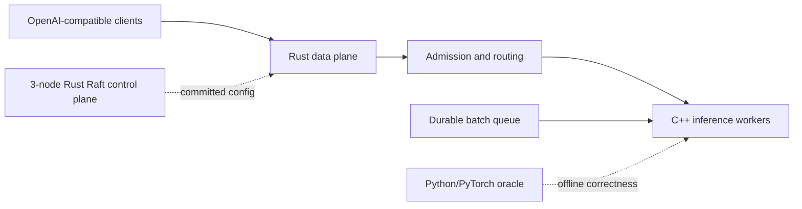

# InferLab Product Requirements Document

**Status:** Working baseline — review and evolve as evidence arrives
**Version:** 0.22
**Updated:** 2026-08-06
**Audience:** a learner-builder who wants systems understanding and credible proof of work

## 1. Product summary

InferLab is a distributed, OpenAI-compatible LLM inference platform built from first principles. It begins as a small streaming service and evolves, one observable production behavior at a time, into a system with routing, overload control, fault tolerance, durable work, consensus, CPU inference, paged KV memory, constrained decoding, quantization, speculative decoding, exact tiled online-softmax CPU attention, request-level control-revision fencing across the integrated real-worker stack, restart-safe committed routing snapshots, bounded-age cold-start fallback, runtime routing leases, control-cluster namespace fencing, signed control configurations with key rotation/revocation, and later authorized control transport plus CUDA attention kernels.

The product is intentionally one evolving system rather than unrelated demonstrations. New concepts must own a real responsibility in the serving path and must come with evidence.

## 2. Problem

Most learning projects land at one of two extremes:

- a thin wrapper around a mature inference library, which hides the important mechanics; or
- isolated algorithm demos, which never reveal how the algorithms interact in a production system.

InferLab must bridge that gap. A learner should be able to answer both “how does online softmax work?” and “why must retries stop after streaming begins?” using executable code and measured results.

## 3. Product goals

### G1 — Systems understanding

Expose networking, concurrency, routing, backpressure, resilience, durable delivery, leader election, and consensus through real responsibilities.

### G2 — Inference understanding

Implement the decoder inference path in dependency order: CPU tensor operations, transformer forward pass, autoregressive generation, KV caching, batching, paged memory, decoding controls, quantization, speculation, tiled online-softmax attention, and CUDA kernels.

### G3 — Evidence, not assertion

Every milestone must be independently reproducible and include design reasoning, correctness tests, failure tests where relevant, raw benchmark data, and an honest conclusion.

### G4 — Production-shaped interfaces

Interactive requests use an OpenAI-compatible HTTP/SSE surface. Asynchronous batch work uses a separate durable queue. Control-plane consensus never enters the per-token hot path.

### G5 — Progressive complexity

At each phase, only one major source of uncertainty should be introduced. Correctness comes before optimization and deterministic behavior before probabilistic behavior.

## 4. Non-goals

- Training or fine-tuning models.
- Matching the feature completeness or throughput of vLLM, TGI, TensorRT-LLM, or managed APIs.
- Inventing cryptographic primitives, TLS, an HTTP stack, or a tokenizer format
  merely for novelty; security boundaries use maintained implementations and
  state their incomplete threat model.
- Claiming exactly-once job execution; batch delivery will be at-least-once with idempotent effects.
- Building Raft or durable queuing into interactive token streaming.
- Starting CUDA, INT4, AWQ, GPTQ, or FlashAttention before the CPU reference is correct.
- Treating screenshots, a single happy-path demo, or synthetic throughput alone as sufficient evidence.

## 5. Users and jobs to be done

### Primary: learner-builder

When studying a systems or inference concept, I want to locate it in a realistic end-to-end platform, change it, break it, and measure it so that I develop transferable intuition rather than memorized definitions.

### Secondary: technical reviewer or interviewer

When evaluating the project, I want a short path from a design claim to its code, test, raw evidence, and limitations so that I can distinguish genuine understanding from feature collection.

### Secondary: benchmark experimenter

When comparing policies or kernels, I want reproducible workloads and stable metrics so that before/after claims are falsifiable.

## 6. Learning experience requirements

Each milestone must answer six questions in `docs/learning/`:

1. **What problem appears without this feature?**
2. **What is the plain-language mental model or analogy?**
3. **What invariants must always remain true?**
4. **What alternatives were considered and why was this one chosen?**
5. **What experiment could disprove the design claim?**
6. **What did the result teach us or force us to revise?**

Source files should explain “why” near non-obvious boundaries. Docs explain the complete idea; code comments do not restate syntax.

## 7. Product principles and analogies

| Principle | Working analogy | Consequence |
|---|---|---|
| Separate data and control planes | Trains keep moving while a signal office updates the timetable | Raft publishes configuration; it does not approve every token |
| Namespace before ordering | Receipt 2 at two banks is not the same receipt | Compare cluster identity before revision or term |
| Authenticate bytes before trusting metadata | Check a wax seal before filing the named manifest | Verify the signed route before cluster/revision/persistence/lease decisions |
| Stream incrementally | A waiter serves courses as they are ready | The gateway forwards chunks without buffering a whole completion |
| Bound finite resources | A venue has a fire-code capacity | Full queues reject or wait; they never grow without limit |
| Retry selectively | Redial only before the other person answers | Retry transient failures only before response bytes reach the client |
| Optimize after a reference | Tune a race car only after its steering works | Every optimized kernel is checked against a simple CPU/PyTorch oracle |
| Prefer at-least-once plus idempotency | A courier may redeliver, so the recipient recognizes the parcel ID | Duplicate batch execution is safe and observable |
| Make ownership stable | Library books have a home shelf even when shelves move | Consistent hashing owns prefix-cache partitions and minimizes remapping |

## 8. Functional requirements

### FR1 — Client API

- Expose `POST /v1/chat/completions` with JSON request bodies.
- Support streaming responses as `text/event-stream` ending in `data: [DONE]`.
- Support non-streaming JSON responses for correctness tests.
- Preserve upstream status and streaming chunks.
- Return structured JSON errors when no healthy worker can accept work.

### FR2 — Worker abstraction

- Register multiple workers with stable IDs and endpoints.
- Expose worker health and in-flight request counts.
- Keep the gateway/worker protocol independent of the worker implementation language.
- Provide deterministic fake workers with configurable latency and failure injection before C++ inference exists.

### FR3 — Routing

- Implement round-robin, least-in-flight, weighted, EWMA-latency, and consistent-hash policies as separate, testable strategies.
- Use consistent hashing specifically for prefix-cache ownership.
- Report selection counts and key remapping percentage during topology changes.

### FR4 — Admission and backpressure

- Bound queued and concurrently executing interactive requests.
- Enforce a request deadline.
- Reject overload with intentional `429` or `503` errors and a machine-readable reason.
- Demonstrate bounded queue depth and memory under offered load above capacity.

### FR5 — Resilience

- Apply per-attempt timeouts, exponential backoff with full jitter, a retry budget, and per-worker circuit breakers.
- Retry only classified transient failures and only before streaming begins.
- Model circuit breakers with closed, open, and half-open states.
- Demonstrate recovery from slow, crashed, and disconnected workers without retry storms.

### FR6 — Durable batch inference

- Persist jobs and unique idempotency keys.
- Support claim/acknowledge, visibility timeouts, redelivery, bounded retries, and a dead-letter queue.
- Recover an unacknowledged job after a consumer crash.

### FR7 — Control plane

- Run a three-node Raft cluster for authoritative routing configuration and selected batch metadata.
- Implement election, log replication, commit, and deterministic state-machine application in that order.
- Continue serving with the last committed configuration during leader election.

### FR8 — CPU inference runtime

- Load one deliberately tiny decoder-only model format.
- Implement tokenizer integration, tensor primitives, transformer forward pass, and autoregressive generation in C++.
- Stream generated tokens through the same worker contract used by fake workers.
- Compare logits and greedy tokens with a Python/PyTorch reference within documented tolerances.

### FR9 — KV cache and batching

- Retain an ordinary per-session KV cache and recomputing oracle before changing
  physical memory layout.
- Continuously re-form bounded active batches, remove terminal sequences, and
  backfill freed slots from a bounded waiting queue.
- Report decoder work, cache bytes, scheduler occupancy, request throughput,
  and latency across concurrency.
- Place K/V rows in a bounded fixed-size page allocator with per-session
  logical-to-physical block tables.
- Reference-count exact prompt-prefix ownership, copy shared partial tails on
  mutation, and evict least-recently-used directory entries without
  invalidating active sessions.
- Measure fragmentation, capacity, sharing, prefix reuse, copy-on-write, and
  stable consistent-hash ownership under topology change.

### FR10 — Decoding

- Preserve raw forward-pass logits while applying temperature, top-k, top-p,
  repetition penalty, token bans, grammar masks, and seeded selection through
  one fixed C++ processor pipeline.
- Compile the supported strict two-property JSON schema into a deterministic
  token automaton in Rust and reject incompatible vocabularies, incomplete
  token budgets, empty supports, and unsupported schema shapes.
- Preserve the v1 checkpoint byte-for-byte while appending six JSON tokens in a
  v2 teaching checkpoint without changing old greedy tokens or logits.
- Demonstrate exact same-seed replay, statistical agreement with softmax, and
  parser- and schema-valid structured output across 10,000 real generations.
- Preserve structured guarantees through both non-streaming and SSE gateway
  paths, while making clear that syntax validity does not imply semantic
  correctness or balanced value probabilities.

### FR11 — Inference optimizations

- Preserve the committed FP32 checkpoint while supporting load-time symmetric
  per-output-row INT8 and asymmetric group-of-eight INT4 for the seven linear
  matrices; keep embeddings, normalization parameters, biases, activations,
  KV state, scales, and accumulation in FP32.
- Report exact FP32 and active tensor/linear payload, quantized values,
  scale/zero-point metadata, compression ratios, full-logit error, greedy-token
  agreement, and a clearly scoped quality-sensitivity metric.
- Add optional greedy and rejection-sampling speculative decoding with an FP32
  target, quantized draft, bounded proposal window, batched target verification,
  verified-token buffering, independent target/draft PRNG state, and explicit
  acceptance, rejection, correction, discard, extra-token, and forward-call
  metrics.
- Preserve target greedy output and target sampled distribution, including a
  synthetic poor-draft experiment that forces rejection correction.
- Preserve non-streaming and SSE integration, and reject unsupported structured
  speculation before streaming.
- Report target-call reduction and measured wall time separately. A lower call
  count is not sufficient evidence of a latency or throughput improvement.

### FR12 — Tiled online-softmax and CUDA attention

- Implement materialized and tiled online-softmax causal CPU attention first;
  compare FP32 plus simulated FP16/BF16 storage with an independent PyTorch
  oracle; report actual score scratch, a clearly labeled traffic model, and
  measured host wall time separately.
- Then implement naive CUDA attention, tiled shared-memory attention, online
  softmax, causal masking, and FP16/BF16 device variants in that order.
- Measure CUDA correctness, device memory traffic, occupancy, and throughput
  before making GPU-performance claims.

### FR13 — Real-worker full-stack integration

- Apply worker pool, committed revision, and Raft term as one atomic gateway
  routing snapshot.
- Capture one immutable snapshot per request and use it for initial selection,
  all retries, response metadata, and stream lifetime.
- Expose request-start revision/term on successful dynamically routed responses
  and expose the current installed snapshot through gateway diagnostics.
- Keep the last committed snapshot available while the control plane elects a
  replacement leader; do not place consensus in the request or token loop.
- Prove real prefix affinity, exact worker failover, committed membership
  removal, request continuity during exact leader failure, a newer weighted
  policy, and speculative SSE through real CPU workers in one reproducible run.

### FR14 — Restart-safe gateway routing

- Optionally persist one versioned local copy of the last validated,
  Raft-committed routing configuration.
- Write and synchronize a temporary file, atomically rename it, synchronize the
  parent directory, and only then publish a newer routing revision to requests.
- Prefer live control at startup, permit validated disk bootstrap after a
  bounded wait, and continue background reconciliation after disk bootstrap.
- Never roll applied or persisted revision backward; reject equal-revision
  content divergence and fail closed when neither live nor disk identity is
  valid.
- Expose bootstrap source, snapshot path, persisted revision/time, source URL,
  refresh time/error, and the current request-routing revision separately.
- Prove restart service through complete control outage, persistence of a newer
  recovered revision, rejection of an intentionally stale live cluster,
  corrupt-state failure, real-model traffic, weighted routing, and SSE.

### FR15 — Bounded-age routing fallback

- Optionally configure a positive maximum age for using the durable route file
  when live control is unavailable during gateway startup.
- Independently bound accepted future-clock skew so a far-future timestamp
  cannot appear permanently fresh through saturating age arithmetic.
- Accept exact age/skew boundaries, reject one millisecond beyond them, and
  expose the policy, observed disk-bootstrap age, persistence time, and
  calculated cold-start expiry in diagnostics.
- Keep freshness separate from revision monotonicity: expired disk state never
  authorizes rollback to an older live revision.
- Permit valid same/newer live control to atomically replace expired or
  future-dated disk state before serving.
- Prove fresh disk service during complete control outage, expired/future
  failure before listener startup, live repair, real CPU traffic, and SSE.

## 9. Non-functional requirements

### Correctness

- Deterministic seeds and fixtures wherever randomness is not itself under study.
- Optimized outputs compared with a named oracle and explicit tolerances.
- Protocol and state-machine invariants covered by automated tests.

### Performance

- Interactive reports include queue time, TTFT, inter-token latency, end-to-end p50/p95/p99, request throughput, and token throughput.
- Inference reports include memory use and KV utilization.
- No performance target is accepted without hardware, workload, warm-up, sample count, and raw results.

### Operability

- Structured logs include request ID, worker ID, attempt number, routing decision, and terminal status.
- Prometheus metrics use bounded-cardinality labels.
- Every service has liveness and readiness endpoints.

### Reproducibility

- Toolchains and dependencies are pinned or lockfile-resolved.
- One command runs correctness checks; one command runs the milestone demonstration.
- Raw benchmark output is retained under `docs/results/<milestone>/raw/` when publishing a milestone.

### Safety and scope

- Local development binds to loopback by default.
- Model artifacts and generated benchmark data are not silently committed.
- Chaos actions target only explicitly started InferLab processes.

## 10. Architecture boundaries

- **Rust:** gateway, routing, queues, resilience, metrics, Raft, the CPU
  worker's HTTP/SSE transport adapter, and continuous request scheduling.
- **C++:** model loading, tokenization, CPU tensor/runtime work, per-session KV
  state, and sampling behind a narrow C ABI.
- **CUDA:** kernels only after the equivalent CPU implementation passes.
- **Python/PyTorch:** oracle, test-vector generation, load clients, and benchmark analysis—not the serving runtime.

## 11. Delivery roadmap and acceptance evidence

| Milestone | Increment | Exit evidence |
|---|---|---|
| v0.0.1 | Rust HTTP/SSE gateway, 3 deterministic fake workers, round-robin | Integration test proves chunks and `[DONE]`; repeated requests cycle worker IDs; smoke benchmark emits raw JSON |
| v0.0.2 | Selectable round-robin and least-in-flight | Unequal-speed benchmark demonstrates assignment, throughput, and latency differences |
| v0.0.3 | Smooth weighted round-robin | Configured 3:1 capacity ratio produces a reproducible 3:1 request distribution |
| v0.0.4 | EWMA TTFT routing with exploration probes | Recent-latency signal adapts after a worker is slowed while probes preserve fresh observations |
| v0.0.5 | Consistent hash ring with virtual nodes and prompt-prefix affinity | Same key repeatedly selects one worker; 20,000-key analysis reports balance and proves only the added/removed worker's share remaps |
| v0.0.6 | Bounded admission queue and per-worker concurrency | Open-loop 5× overload proof shows execution ≤2, queue ≤4, bounded RSS, fast machine-readable 429s, and clean drain |
| v0.0.7 | End-to-end deadlines, per-attempt timeout, exponential backoff with full jitter, and 10% retry budget | Failed worker proof shows bounded failover before streaming; slow worker ends within deadline; simulation demonstrates retry-spike reduction |
| v0.0.8 | Per-worker circuit breaker | Sliding-window state tests and live restart proof show open-worker isolation, one half-open probe, automatic recovery, and no retry amplification |
| v0.0.9 | Scripted resilience chaos harness | 324-request open-loop timeline kills, slows, and disconnects workers; all requests succeed, all circuits recover, retry amplification stays 1.037×, and 24 assertions verify safety and bounds |
| v0.5 | Durable batch queue | 13-event WAL proof restarts the queue after an effect but before ack; the job redelivers with a fenced token, the stable key suppresses a duplicate effect, and a two-attempt poison job enters the DLQ |
| v0.6 | Three-node Raft control plane | Two exact leader kills produce 364.540 ms and 243.314 ms re-elections; writes commit on the remaining majority, restarted nodes repair to the same six-entry log, and gateway traffic continues from monotonic committed snapshots |
| v0.7 | Tiny C++ CPU decoder | A reproducible 13,111-byte FP32 checkpoint runs one complete C++ transformer block; 384 logits across three prompts stay within `4.1975708e-06` of PyTorch with zero greedy-token mismatches; seven real tokens stream through the unchanged gateway over an observable 83.462 ms paced span |
| v0.8 | KV cache and continuous batching | Recompute/cache logits are bit-identical across three prompts and the cached path stays within `4.1975708e-06` of PyTorch; query, K/V, and attention-score work falls 86.7%, 81.7%, and 78.3%; at concurrency 8, a four-slot continuously backfilled worker reaches 135.318 requests/s and 69.003 ms p95 versus 37.843 requests/s and 212.439 ms for one slot under the declared 3 ms batch-tick workload; 16/16 assertions pass |
| v0.9 | Paged KV cache and prefix ownership | Paged/contiguous logits are bit-identical across three prompts and remain within `4.1975708e-06` of PyTorch; a bounded 64-slot pool fits eight actual eight-token sessions versus two declared max-context reservations and rejects the ninth; retained page-size fragmentation is 0.0%/9.1%/23.1%/37.5% for 1/2/4/8-token pages; two warm forks safely copy a shared partial tail; six gateway repeats all hit and reduce K/V projections 24→6; all 256 keys retain ownership before change and all 107 remaps after adding C move only to C; 22/22 assertions pass |
| v0.10 | Sampling and structured decoding | Six production-selector golden cases pass; 30,000 temperature samples remain within 0.581 percentage points of exact softmax and replay exactly; 10,000/10,000 structured generations parse, satisfy the schema, and reach EOS with four replay checks; v2 appends six tokens while preserving v1 greedy output and old logits exactly and stays within `4.1975708e-06` of PyTorch; real non-streaming/SSE gateway paths are valid, unsupported schema and grammar-exhausting bans return 400 before streaming, and 27/27 assertions pass |
| v0.11 | INT8/INT4 and speculation | Active tensor payload falls 13,720→7,056/6,820 bytes for per-row INT8/group-of-eight INT4; maximum FP32 logit error is 0.000182867/0.003354073 with 0/24 greedy mismatches and FP32 remains within `4.1975708e-06` of PyTorch; accepted three-token drafts preserve greedy output and reduce target calls 8→2; two 10,000-sample real-draft distributions and three 10,000-sample synthetic quality profiles remain within one percentage point of the target, with the reversed draft forcing 5,795 corrections; JSON/SSE integration and pre-stream structured rejection pass; 33/33 assertions pass; retained speculation is slower (`0.261x` best), so no speedup is claimed |
| v0.12 | Tiled online-softmax CPU attention | Materialized and online-tiled causal attention match a precision-aligned PyTorch oracle across FP32/simulated FP16/BF16 with maximum error `1.1553e-7`; full-model token IDs and text match with maximum logit difference `1.0e-7`; at 256 tokens the score scratch falls 1,048,576→128 bytes and the declared traffic model falls 4.50→2.25 MiB; direct workers, health, gateway JSON, and SSE agree; 21/21 assertions pass; retained Apple M4 Pro scalar timing is about `2.2x` faster, while CUDA compiler/runtime availability is false and no GPU claim is made |
| v0.13 | Real-worker full-stack integration | A 3-node Raft cluster configures three real online-attention CPU workers through one atomic pool/revision/term snapshot; repeated affinity produces a real prefix hit; killing its exact owner succeeds on attempt two under the original revision; a committed update removes the failed worker; 6/6 real-model requests succeed during exact leader failure; the new term commits 3:1 weights and produces 6:2 routing; all 21 non-stream requests plus speculative SSE succeed; 23/23 assertions pass |
| v0.14 | Restart-safe gateway routing snapshots | Live revision 2 is validated and persisted before service; after the exact gateway and all three exact Raft children stop, the gateway restarts from disk and serves 4/4 real-model requests; recovered control commits weighted revision 4, which is persisted and applied before a 6:2 schedule; a stale live revision 2 cannot roll r4 backward; divergent/corrupt disk failure closes safely; all 14 non-stream requests plus speculative SSE succeed; 19/19 assertions pass |
| v0.15 | Bounded-age routing fallback | A 5,000 ms age limit and 100 ms future-skew allowance are exposed in gateway diagnostics; a fresh revision-2 file serves 3/3 real-model requests while all control nodes are down; synthetic 6,000 ms age and 5,100 ms future delta both fail before listener startup; recovered live control repairs the file; all seven permitted non-stream requests plus speculative SSE succeed; 15/15 assertions pass |
| v0.16 | Runtime routing lease | A 700 ms live-verification lease is exposed in readiness/diagnostics; an admitted real SSE reaches `[DONE]` after total control outage and lease expiry; `reject-new` returns readiness/request 503 with zero worker attempts; recovered equal revision 2 renews without gateway restart; explicit disk-bootstrapped `serve-stale` remains ready and serves real request/SSE traffic; 17/17 assertions pass |
| v0.17 | Control-cluster identity fencing | Two independent persistent three-node clusters both commit revision 2 in term 1 but identify different namespaces and real workers; at least 28 foreign observations by the expiry capture cannot publish or renew a 700 ms lease; an admitted 2,029.448 ms SSE completes while a new request is rejected with zero worker attempts; primary recovery in term 2 renews without gateway restart; foreign-disk-only bootstrap fails and expected live control repairs it; 18/18 assertions pass; the string namespace is explicitly not authentication |
| v0.18 | Signed control configurations and key rotation | Expected and rogue persistent three-node histories both claim the same cluster/revision/term, but the rogue uses an unknown Ed25519 key; at least 25 responses by expiry cannot publish or renew; an admitted 2,026.254 ms SSE completes while a new request causes zero worker attempts; trusted key A→B rotates the unchanged revision-2 route without gateway restart and persists before publication; 24 later valid key-A observations cannot downgrade key B or renew the lease, and restored B renews again; changed signed disk bytes and revoked key A fail, while key-B disk serves real request/SSE traffic; 23/23 assertions pass; writer authorization, peer transport, secret storage, and replay remain explicit limits |
| v1.0 | CUDA attention progression | Map the proved recurrence to naive and shared-memory CUDA kernels; retain CPU/PyTorch parity, then add profiler traffic, occupancy, and throughput comparison for each device kernel |

The order is a dependency graph, not a calendar promise. At 8–12 hours/week, v0.1–v0.6 is a plausible 12-week systems MVP; the complete learning arc is expected to take 5–6 months or more.

## 12. v0.1 detailed acceptance criteria

### User-visible

- A client sends a streaming chat completion to port 8080 and receives multiple SSE events before completion.
- Four sequential requests against three workers produce worker IDs A, B, C, A.
- A non-stream request returns a valid OpenAI-shaped JSON response.
- A configured deterministic worker failure is passed through as a visible upstream error.

### Engineering

- Worker selection is isolated behind a pool abstraction.
- The gateway reuses one HTTP client and does not buffer the upstream body.
- An in-flight lease remains held until the response body completes or the client disconnects.
- Unit tests cover routing; an integration test covers the real HTTP streaming boundary.
- `scripts/proof-v0.1.sh` starts only local InferLab processes, exercises the system, and cleans them up.

### Learning and proof

- RFC 0001 states the streaming and ownership invariants.
- The phase note explains SSE, async concurrency, streaming backpressure, and test doubles using analogies.
- The benchmark client reports worker distribution, TTFT, end-to-end percentiles, and requests/second as machine-readable JSON.
- Known limitation is explicit: v0.1 has no health-aware routing, overload control, retries, or real model.

## 13. Proof-of-work contract

A milestone is complete only when its release folder or tag contains:

- a short RFC with invariants and rejected alternatives;
- unit, integration, and relevant failure tests;
- a reproducible benchmark or experiment command;
- raw results plus environment metadata;
- a concise conclusion including negative or surprising findings;
- a 2–5 minute demo script or recording plan; and
- a version tag after the evidence is reviewed.

Evidence levels:

| Claim | Required evidence |
|---|---|
| “It returns the right result” | oracle/golden/property test |
| “It streams” | timestamps or incremental client observation, not only final body |
| “It survives failure” | controlled fault plus recovery trace |
| “It is faster” | reproducible before/after benchmark with raw data |
| “It scales” | increasing-load/concurrency curve and resource measurement |
| “It is distributed” | separate processes/nodes and a demonstrated partition/crash behavior |

## 14. Risks and mitigations

| Risk | Mitigation |
|---|---|
| Scope becomes an 18-feature checklist | One vertical platform, milestone gates, and explicit non-goals |
| Premature GPU optimization | CPU/PyTorch oracle is a hard dependency for CUDA work |
| Raft consumes the project | Limit its state to routing config and selected job metadata; build it after resilience and queue foundations |
| Benchmarks become marketing | Preserve raw data, environment, hypothesis, limitations, and failed runs |
| Fake worker behavior leaks into runtime design | Keep an HTTP contract boundary and replace the test double with C++ without changing the gateway API |
| Unbounded retries worsen incidents | Retry budget, circuit breaker, deadline, and never retry after streaming begins |

## 15. Open decisions, deferred until evidence is available

- Successor public checkpoint and production tokenizer after the v0.7
  fixed-order tiny format and narrow word tokenizer establish the CPU oracle.
- Durable queue evolution beyond the v0.5 single-writer append-only WAL.
- Raft evolution beyond the v0.6 HTTP RPC transport and atomic JSON state
  persistence: snapshots, compaction, membership changes, and linearizable
  reads.
- CUDA hardware target and supported compute capability.

Deferring these is intentional: deciding them now would create false precision before the relevant constraints are measured.

## 16. Reference shelf

- [Hugging Face TGI architecture](https://huggingface.co/docs/text-generation-inference/en/architecture)
- [Tokio bounded channels](https://tokio.rs/tokio/tutorial/channels)
- [Raft paper and visualization](https://raft.github.io/)
- [Envoy circuit breaking](https://www.envoyproxy.io/docs/envoy/latest/intro/arch_overview/upstream/circuit_breaking)
- [vLLM PagedAttention design](https://docs.vllm.ai/en/latest/design/paged_attention/)
- [Speculative sampling](https://arxiv.org/abs/2302.01318)
- [FlashAttention](https://arxiv.org/abs/2205.14135)
