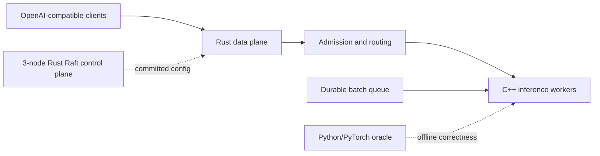

# InferLab Product Requirements Document

**Status:** Working baseline — review and evolve as evidence arrives
**Version:** 0.5
**Updated:** 2026-07-28
**Audience:** a learner-builder who wants systems understanding and credible proof of work

## 1. Product summary

InferLab is a distributed, OpenAI-compatible LLM inference platform built from first principles. It begins as a small streaming service and evolves, one observable production behavior at a time, into a system with routing, overload control, fault tolerance, durable work, consensus, CPU inference, paged KV memory, constrained decoding, quantization, speculative decoding, and CUDA attention kernels.

The product is intentionally one evolving system rather than unrelated demonstrations. New concepts must own a real responsibility in the serving path and must come with evidence.

## 2. Problem

Most learning projects land at one of two extremes:

- a thin wrapper around a mature inference library, which hides the important mechanics; or
- isolated algorithm demos, which never reveal how the algorithms interact in a production system.

InferLab must bridge that gap. A learner should be able to answer both “how does online softmax work?” and “why must retries stop after streaming begins?” using executable code and measured results.

## 3. Product goals

### G1 — Systems understanding

Expose networking, concurrency, routing, backpressure, resilience, durable delivery, leader election, and consensus through real responsibilities.

### G2 — Inference understanding

Implement the decoder inference path in dependency order: CPU tensor operations, transformer forward pass, autoregressive generation, KV caching, batching, paged memory, decoding controls, quantization, speculation, and CUDA kernels.

### G3 — Evidence, not assertion

Every milestone must be independently reproducible and include design reasoning, correctness tests, failure tests where relevant, raw benchmark data, and an honest conclusion.

### G4 — Production-shaped interfaces

Interactive requests use an OpenAI-compatible HTTP/SSE surface. Asynchronous batch work uses a separate durable queue. Control-plane consensus never enters the per-token hot path.

### G5 — Progressive complexity

At each phase, only one major source of uncertainty should be introduced. Correctness comes before optimization and deterministic behavior before probabilistic behavior.

## 4. Non-goals

- Training or fine-tuning models.
- Matching the feature completeness or throughput of vLLM, TGI, TensorRT-LLM, or managed APIs.
- Implementing cryptography, TLS, an HTTP stack, or a tokenizer format merely for novelty.
- Claiming exactly-once job execution; batch delivery will be at-least-once with idempotent effects.
- Building Raft or durable queuing into interactive token streaming.
- Starting CUDA, INT4, AWQ, GPTQ, or FlashAttention before the CPU reference is correct.
- Treating screenshots, a single happy-path demo, or synthetic throughput alone as sufficient evidence.

## 5. Users and jobs to be done

### Primary: learner-builder

When studying a systems or inference concept, I want to locate it in a realistic end-to-end platform, change it, break it, and measure it so that I develop transferable intuition rather than memorized definitions.

### Secondary: technical reviewer or interviewer

When evaluating the project, I want a short path from a design claim to its code, test, raw evidence, and limitations so that I can distinguish genuine understanding from feature collection.

### Secondary: benchmark experimenter

When comparing policies or kernels, I want reproducible workloads and stable metrics so that before/after claims are falsifiable.

## 6. Learning experience requirements

Each milestone must answer six questions in `docs/learning/`:

1. **What problem appears without this feature?**
2. **What is the plain-language mental model or analogy?**
3. **What invariants must always remain true?**
4. **What alternatives were considered and why was this one chosen?**
5. **What experiment could disprove the design claim?**
6. **What did the result teach us or force us to revise?**

Source files should explain “why” near non-obvious boundaries. Docs explain the complete idea; code comments do not restate syntax.

## 7. Product principles and analogies

| Principle | Working analogy | Consequence |
|---|---|---|
| Separate data and control planes | Trains keep moving while a signal office updates the timetable | Raft publishes configuration; it does not approve every token |
| Stream incrementally | A waiter serves courses as they are ready | The gateway forwards chunks without buffering a whole completion |
| Bound finite resources | A venue has a fire-code capacity | Full queues reject or wait; they never grow without limit |
| Retry selectively | Redial only before the other person answers | Retry transient failures only before response bytes reach the client |
| Optimize after a reference | Tune a race car only after its steering works | Every optimized kernel is checked against a simple CPU/PyTorch oracle |
| Prefer at-least-once plus idempotency | A courier may redeliver, so the recipient recognizes the parcel ID | Duplicate batch execution is safe and observable |
| Make ownership stable | Library books have a home shelf even when shelves move | Consistent hashing owns prefix-cache partitions and minimizes remapping |

## 8. Functional requirements

### FR1 — Client API

- Expose `POST /v1/chat/completions` with JSON request bodies.
- Support streaming responses as `text/event-stream` ending in `data: [DONE]`.
- Support non-streaming JSON responses for correctness tests.
- Preserve upstream status and streaming chunks.
- Return structured JSON errors when no healthy worker can accept work.

### FR2 — Worker abstraction

- Register multiple workers with stable IDs and endpoints.
- Expose worker health and in-flight request counts.
- Keep the gateway/worker protocol independent of the worker implementation language.
- Provide deterministic fake workers with configurable latency and failure injection before C++ inference exists.

### FR3 — Routing

- Implement round-robin, least-in-flight, weighted, EWMA-latency, and consistent-hash policies as separate, testable strategies.
- Use consistent hashing specifically for prefix-cache ownership.
- Report selection counts and key remapping percentage during topology changes.

### FR4 — Admission and backpressure

- Bound queued and concurrently executing interactive requests.
- Enforce a request deadline.
- Reject overload with intentional `429` or `503` errors and a machine-readable reason.
- Demonstrate bounded queue depth and memory under offered load above capacity.

### FR5 — Resilience

- Apply per-attempt timeouts, exponential backoff with full jitter, a retry budget, and per-worker circuit breakers.
- Retry only classified transient failures and only before streaming begins.
- Model circuit breakers with closed, open, and half-open states.
- Demonstrate recovery from slow, crashed, and disconnected workers without retry storms.

### FR6 — Durable batch inference

- Persist jobs and unique idempotency keys.
- Support claim/acknowledge, visibility timeouts, redelivery, bounded retries, and a dead-letter queue.
- Recover an unacknowledged job after a consumer crash.

### FR7 — Control plane

- Run a three-node Raft cluster for authoritative routing configuration and selected batch metadata.
- Implement election, log replication, commit, and deterministic state-machine application in that order.
- Continue serving with the last committed configuration during leader election.

### FR8 — CPU inference runtime

- Load one deliberately tiny decoder-only model format.
- Implement tokenizer integration, tensor primitives, transformer forward pass, and autoregressive generation in C++.
- Stream generated tokens through the same worker contract used by fake workers.
- Compare logits and greedy tokens with a Python/PyTorch reference within documented tolerances.

### FR9 — KV cache and batching

- Add ordinary KV caching before continuous batching.
- Add a fixed-size page allocator, logical-to-physical block tables, reference counts, eviction, and copy-on-write.
- Measure fragmentation, capacity, and concurrent sequence behavior.

### FR10 — Decoding

- Implement temperature, top-k, top-p, repetition penalty, and token bans with golden tests.
- Compile a regex or JSON grammar into an automaton and mask invalid tokens.
- Demonstrate parser-valid structured output across a 10,000-sample deterministic test corpus.

### FR11 — Inference optimizations

- Add prefix caching, greedy then rejection-sampling speculative decoding, symmetric per-row INT8, and groupwise INT4.
- Report TTFT, inter-token latency, tokens/second, memory, cache hit rate, acceptance rate, and quality/correctness impact.

### FR12 — CUDA attention

- Implement a PyTorch/CPU reference, naive CUDA attention, tiled shared-memory attention, online softmax, causal masking, and FP16/BF16 variants in that order.
- Measure correctness, device memory traffic, occupancy, and throughput.

## 9. Non-functional requirements

### Correctness

- Deterministic seeds and fixtures wherever randomness is not itself under study.
- Optimized outputs compared with a named oracle and explicit tolerances.
- Protocol and state-machine invariants covered by automated tests.

### Performance

- Interactive reports include queue time, TTFT, inter-token latency, end-to-end p50/p95/p99, request throughput, and token throughput.
- Inference reports include memory use and KV utilization.
- No performance target is accepted without hardware, workload, warm-up, sample count, and raw results.

### Operability

- Structured logs include request ID, worker ID, attempt number, routing decision, and terminal status.
- Prometheus metrics use bounded-cardinality labels.
- Every service has liveness and readiness endpoints.

### Reproducibility

- Toolchains and dependencies are pinned or lockfile-resolved.
- One command runs correctness checks; one command runs the milestone demonstration.
- Raw benchmark output is retained under `docs/results/<milestone>/raw/` when publishing a milestone.

### Safety and scope

- Local development binds to loopback by default.
- Model artifacts and generated benchmark data are not silently committed.
- Chaos actions target only explicitly started InferLab processes.

## 10. Architecture boundaries

- **Rust:** gateway, routing, queues, resilience, metrics, and Raft.
- **C++:** model loading, CPU tensor/runtime work, scheduling boundary, and sampling.
- **CUDA:** kernels only after the equivalent CPU implementation passes.
- **Python/PyTorch:** oracle, test-vector generation, load clients, and benchmark analysis—not the serving runtime.

## 11. Delivery roadmap and acceptance evidence

| Milestone | Increment | Exit evidence |
|---|---|---|
| v0.0.1 | Rust HTTP/SSE gateway, 3 deterministic fake workers, round-robin | Integration test proves chunks and `[DONE]`; repeated requests cycle worker IDs; smoke benchmark emits raw JSON |
| v0.0.2 | Selectable round-robin and least-in-flight | Unequal-speed benchmark demonstrates assignment, throughput, and latency differences |
| v0.0.3 | Smooth weighted round-robin | Configured 3:1 capacity ratio produces a reproducible 3:1 request distribution |
| v0.0.4 | EWMA TTFT routing with exploration probes | Recent-latency signal adapts after a worker is slowed while probes preserve fresh observations |
| v0.0.5 | Consistent hash ring with virtual nodes and prompt-prefix affinity | Same key repeatedly selects one worker; 20,000-key analysis reports balance and proves only the added/removed worker's share remaps |
| v0.3 | Bounded admission and concurrency | Overload graph proves queue and memory stay bounded; intentional 429/503 behavior |
| v0.4 | Deadlines, retry budget, circuit breaker | Slow/crash/disconnect chaos run and recovery timeline without retry amplification |
| v0.5 | Durable batch queue | Consumer crash causes safe redelivery; idempotency prevents duplicate effect; DLQ proof |
| v0.6 | Three-node Raft control plane | Leader kill, election trace, committed configuration remains consistent |
| v0.7 | Tiny C++ CPU decoder | Logit/token parity report against PyTorch and streamed real tokens |
| v0.8 | KV cache and continuous batching | Token parity plus throughput/latency comparison across concurrency |
| v0.9 | Paged KV cache and prefix ownership | Fragmentation, utilization, copy-on-write, and cache hit/remap evidence |
| v0.10 | Sampling and structured decoding | Golden processor tests and 10,000/10,000 parser-valid structured generations |
| v0.11 | INT8/INT4 and speculation | Speed/memory/quality tables; target-distribution correctness tests |
| v1.0 | CUDA attention progression | CPU/PyTorch parity, profiler evidence, and throughput comparison for each kernel |

The order is a dependency graph, not a calendar promise. At 8–12 hours/week, v0.1–v0.6 is a plausible 12-week systems MVP; the complete learning arc is expected to take 5–6 months or more.

## 12. v0.1 detailed acceptance criteria

### User-visible

- A client sends a streaming chat completion to port 8080 and receives multiple SSE events before completion.
- Four sequential requests against three workers produce worker IDs A, B, C, A.
- A non-stream request returns a valid OpenAI-shaped JSON response.
- A configured deterministic worker failure is passed through as a visible upstream error.

### Engineering

- Worker selection is isolated behind a pool abstraction.
- The gateway reuses one HTTP client and does not buffer the upstream body.
- An in-flight lease remains held until the response body completes or the client disconnects.
- Unit tests cover routing; an integration test covers the real HTTP streaming boundary.
- `scripts/proof-v0.1.sh` starts only local InferLab processes, exercises the system, and cleans them up.

### Learning and proof

- RFC 0001 states the streaming and ownership invariants.
- The phase note explains SSE, async concurrency, streaming backpressure, and test doubles using analogies.
- The benchmark client reports worker distribution, TTFT, end-to-end percentiles, and requests/second as machine-readable JSON.
- Known limitation is explicit: v0.1 has no health-aware routing, overload control, retries, or real model.

## 13. Proof-of-work contract

A milestone is complete only when its release folder or tag contains:

- a short RFC with invariants and rejected alternatives;
- unit, integration, and relevant failure tests;
- a reproducible benchmark or experiment command;
- raw results plus environment metadata;
- a concise conclusion including negative or surprising findings;
- a 2–5 minute demo script or recording plan; and
- a version tag after the evidence is reviewed.

Evidence levels:

| Claim | Required evidence |
|---|---|
| “It returns the right result” | oracle/golden/property test |
| “It streams” | timestamps or incremental client observation, not only final body |
| “It survives failure” | controlled fault plus recovery trace |
| “It is faster” | reproducible before/after benchmark with raw data |
| “It scales” | increasing-load/concurrency curve and resource measurement |
| “It is distributed” | separate processes/nodes and a demonstrated partition/crash behavior |

## 14. Risks and mitigations

| Risk | Mitigation |
|---|---|
| Scope becomes an 18-feature checklist | One vertical platform, milestone gates, and explicit non-goals |
| Premature GPU optimization | CPU/PyTorch oracle is a hard dependency for CUDA work |
| Raft consumes the project | Limit its state to routing config and selected job metadata; build it after resilience and queue foundations |
| Benchmarks become marketing | Preserve raw data, environment, hypothesis, limitations, and failed runs |
| Fake worker behavior leaks into runtime design | Keep an HTTP contract boundary and replace the test double with C++ without changing the gateway API |
| Unbounded retries worsen incidents | Retry budget, circuit breaker, deadline, and never retry after streaming begins |

## 15. Open decisions, deferred until evidence is available

- Tiny model and on-disk format for v0.7.
- Tokenizer library versus a narrow educational implementation.
- Durable queue storage engine.
- Raft transport and persistence format.
- First JSON grammar scope.
- CUDA hardware target and supported compute capability.

Deferring these is intentional: deciding them now would create false precision before the relevant constraints are measured.

## 16. Reference shelf

- [Hugging Face TGI architecture](https://huggingface.co/docs/text-generation-inference/en/architecture)
- [Tokio bounded channels](https://tokio.rs/tokio/tutorial/channels)
- [Raft paper and visualization](https://raft.github.io/)
- [Envoy circuit breaking](https://www.envoyproxy.io/docs/envoy/latest/intro/arch_overview/upstream/circuit_breaking)
- [vLLM PagedAttention design](https://docs.vllm.ai/en/latest/design/paged_attention/)
- [Speculative sampling](https://arxiv.org/abs/2302.01318)
- [FlashAttention](https://arxiv.org/abs/2205.14135)
