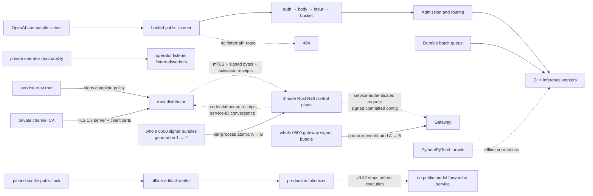

# InferLab Product Requirements Document

**Status:** Working baseline — review and evolve as evidence arrives
**Version:** 0.32
**Updated:** 2026-08-14
**Audience:** a learner-builder who wants systems understanding and credible proof of work

## 1. Product summary

InferLab is a distributed, OpenAI-compatible LLM inference platform built from first principles. It begins as a small streaming service and evolves, one observable production behavior at a time, into a system with routing, overload control, fault tolerance, durable work, consensus, CPU inference, paged KV memory, constrained decoding, quantization, speculative decoding, exact tiled online-softmax CPU attention, request-level control-revision fencing across the integrated real-worker stack, restart-safe committed routing snapshots, bounded-age cold-start fallback, runtime routing leases, control-cluster namespace fencing, signed control configurations with key rotation/revocation, authorized administrative control writers with durable provenance, cryptographically authenticated Raft/gateway control requests with scoped service identities, overlap-safe credential lifecycle, root-signed distributed service trust with signed validity/expiry, TLS 1.3 mutual authentication for that trust-distribution channel, controlled directed-link Raft partition/Figure-8 safety evidence, bounded-cardinality OpenMetrics observability with structured request correlation, a hosted application edge that separates public/operator listeners and bounds per-credential work before compute, restart-free whole-bundle handoff for outbound gateway/control service signers, restart-free same-CA replacement of trust-distribution mTLS leaves, deadline-safe signed-policy renewal, and exact offline identity/inventory plus production-tokenizer parity for one pinned public checkpoint. The edge is not an internet-hosting or network-level DoS boundary; signer and TLS-identity handoffs are not managed key custody or fleet-atomic rotation transactions; public artifact/tokenizer proof is not public-model execution. CA migration, automated certificate issuance/scheduling, revocation services, broader channel security, trust-distributor HA, public-checkpoint forward/generation/serving, packet-level fault testing, persistent monitoring, and CUDA attention kernels remain later work.

The product is intentionally one evolving system rather than unrelated demonstrations. New concepts must own a real responsibility in the serving path and must come with evidence.

## 2. Problem

Most learning projects land at one of two extremes:

- a thin wrapper around a mature inference library, which hides the important mechanics; or
- isolated algorithm demos, which never reveal how the algorithms interact in a production system.

InferLab must bridge that gap. A learner should be able to answer both “how does online softmax work?” and “why must retries stop after streaming begins?” using executable code and measured results.

## 3. Product goals

### G1 — Systems understanding

Expose networking, concurrency, routing, backpressure, resilience, durable delivery, leader election, and consensus through real responsibilities.

### G2 — Inference understanding

Implement the decoder inference path in dependency order: CPU tensor operations, transformer forward pass, autoregressive generation, KV caching, batching, paged memory, decoding controls, quantization, speculation, tiled online-softmax attention, and CUDA kernels.

### G3 — Evidence, not assertion

Every milestone must be independently reproducible and include design reasoning, correctness tests, failure tests where relevant, raw benchmark data, and an honest conclusion.

### G4 — Production-shaped interfaces

Interactive requests use an OpenAI-compatible HTTP/SSE surface. Asynchronous batch work uses a separate durable queue. Control-plane consensus never enters the per-token hot path.

### G5 — Progressive complexity

At each phase, only one major source of uncertainty should be introduced. Correctness comes before optimization and deterministic behavior before probabilistic behavior.

## 4. Non-goals

- Training or fine-tuning models.
- Matching the feature completeness or throughput of vLLM, TGI, TensorRT-LLM, or managed APIs.
- Inventing cryptographic primitives, TLS, an HTTP stack, or a tokenizer format
  merely for novelty; security boundaries use maintained implementations and
  state their incomplete threat model.
- Claiming exactly-once job execution; batch delivery will be at-least-once with idempotent effects.
- Building Raft or durable queuing into interactive token streaming.
- Starting CUDA, INT4, AWQ, GPTQ, or FlashAttention before the CPU reference is correct.
- Treating screenshots, a single happy-path demo, or synthetic throughput alone as sufficient evidence.

## 5. Users and jobs to be done

### Primary: learner-builder

When studying a systems or inference concept, I want to locate it in a realistic end-to-end platform, change it, break it, and measure it so that I develop transferable intuition rather than memorized definitions.

### Secondary: technical reviewer or interviewer

When evaluating the project, I want a short path from a design claim to its code, test, raw evidence, and limitations so that I can distinguish genuine understanding from feature collection.

### Secondary: benchmark experimenter

When comparing policies or kernels, I want reproducible workloads and stable metrics so that before/after claims are falsifiable.

## 6. Learning experience requirements

Each milestone must answer six questions in `docs/learning/`:

1. **What problem appears without this feature?**
2. **What is the plain-language mental model or analogy?**
3. **What invariants must always remain true?**
4. **What alternatives were considered and why was this one chosen?**
5. **What experiment could disprove the design claim?**
6. **What did the result teach us or force us to revise?**

Source files should explain “why” near non-obvious boundaries. Docs explain the complete idea; code comments do not restate syntax.

## 7. Product principles and analogies

| Principle | Working analogy | Consequence |
|---|---|---|
| Separate data and control planes | Trains keep moving while a signal office updates the timetable | Raft publishes configuration; it does not approve every token |
| Namespace before ordering | Receipt 2 at two banks is not the same receipt | Compare cluster identity before revision or term |
| Authenticate bytes before trusting metadata | Check a wax seal before filing the named manifest | Verify the signed route before cluster/revision/persistence/lease decisions |
| Authenticate callers before state transitions | Check the courier and loading-dock permit before opening the parcel | Verify service signature, freshness, replay, and endpoint scope before Raft or route delivery |
| Stream incrementally | A waiter serves courses as they are ready | The gateway forwards chunks without buffering a whole completion |
| Bound finite resources | A venue has a fire-code capacity | Full queues reject or wait; they never grow without limit |
| Retry selectively | Redial only before the other person answers | Retry transient failures only before response bytes reach the client |
| Optimize after a reference | Tune a race car only after its steering works | Every optimized kernel is checked against a simple CPU/PyTorch oracle |
| Prefer at-least-once plus idempotency | A courier may redeliver, so the recipient recognizes the parcel ID | Duplicate batch execution is safe and observable |
| Make ownership stable | Library books have a home shelf even when shelves move | Consistent hashing owns prefix-cache partitions and minimizes remapping |
| Snapshot mutable authority once per operation | A courier copies the approved pen before sealing one parcel | A signer handoff cannot mix A and B inside one request |

## 8. Functional requirements

### FR1 — Client API

- Expose `POST /v1/chat/completions` with JSON request bodies.
- Support streaming responses as `text/event-stream` ending in `data: [DONE]`.
- Support non-streaming JSON responses for correctness tests.
- Preserve upstream status and streaming chunks.
- Return structured JSON errors when no healthy worker can accept work.

### FR2 — Worker abstraction

- Register multiple workers with stable IDs and endpoints.
- Expose worker health and in-flight request counts.
- Keep the gateway/worker protocol independent of the worker implementation language.
- Provide deterministic fake workers with configurable latency and failure injection before C++ inference exists.

### FR3 — Routing

- Implement round-robin, least-in-flight, weighted, EWMA-latency, and consistent-hash policies as separate, testable strategies.
- Use consistent hashing specifically for prefix-cache ownership.
- Report selection counts and key remapping percentage during topology changes.

### FR4 — Admission and backpressure

- Bound queued and concurrently executing interactive requests.
- Enforce a request deadline.
- Reject overload with intentional `429` or `503` errors and a machine-readable reason.
- Demonstrate bounded queue depth and memory under offered load above capacity.

### FR5 — Resilience

- Apply per-attempt timeouts, exponential backoff with full jitter, a retry budget, and per-worker circuit breakers.
- Retry only classified transient failures and only before streaming begins.
- Model circuit breakers with closed, open, and half-open states.
- Demonstrate recovery from slow, crashed, and disconnected workers without retry storms.

### FR6 — Durable batch inference

- Persist jobs and unique idempotency keys.
- Support claim/acknowledge, visibility timeouts, redelivery, bounded retries, and a dead-letter queue.
- Recover an unacknowledged job after a consumer crash.

### FR7 — Control plane

- Run a three-node Raft cluster for authoritative routing configuration and selected batch metadata.
- Implement election, log replication, commit, and deterministic state-machine application in that order.
- Continue serving with the last committed configuration during leader election.

### FR8 — CPU inference runtime

- Load one deliberately tiny decoder-only model format.
- Implement tokenizer integration, tensor primitives, transformer forward pass, and autoregressive generation in C++.
- Stream generated tokens through the same worker contract used by fake workers.
- Compare logits and greedy tokens with a Python/PyTorch reference within documented tolerances.

### FR9 — KV cache and batching

- Retain an ordinary per-session KV cache and recomputing oracle before changing
  physical memory layout.
- Continuously re-form bounded active batches, remove terminal sequences, and
  backfill freed slots from a bounded waiting queue.
- Report decoder work, cache bytes, scheduler occupancy, request throughput,
  and latency across concurrency.
- Place K/V rows in a bounded fixed-size page allocator with per-session
  logical-to-physical block tables.
- Reference-count exact prompt-prefix ownership, copy shared partial tails on
  mutation, and evict least-recently-used directory entries without
  invalidating active sessions.
- Measure fragmentation, capacity, sharing, prefix reuse, copy-on-write, and
  stable consistent-hash ownership under topology change.

### FR10 — Decoding

- Preserve raw forward-pass logits while applying temperature, top-k, top-p,
  repetition penalty, token bans, grammar masks, and seeded selection through
  one fixed C++ processor pipeline.
- Compile the supported strict two-property JSON schema into a deterministic
  token automaton in Rust and reject incompatible vocabularies, incomplete
  token budgets, empty supports, and unsupported schema shapes.
- Preserve the v1 checkpoint byte-for-byte while appending six JSON tokens in a
  v2 teaching checkpoint without changing old greedy tokens or logits.
- Demonstrate exact same-seed replay, statistical agreement with softmax, and
  parser- and schema-valid structured output across 10,000 real generations.
- Preserve structured guarantees through both non-streaming and SSE gateway
  paths, while making clear that syntax validity does not imply semantic
  correctness or balanced value probabilities.

### FR11 — Inference optimizations

- Preserve the committed FP32 checkpoint while supporting load-time symmetric
  per-output-row INT8 and asymmetric group-of-eight INT4 for the seven linear
  matrices; keep embeddings, normalization parameters, biases, activations,
  KV state, scales, and accumulation in FP32.
- Report exact FP32 and active tensor/linear payload, quantized values,
  scale/zero-point metadata, compression ratios, full-logit error, greedy-token
  agreement, and a clearly scoped quality-sensitivity metric.
- Add optional greedy and rejection-sampling speculative decoding with an FP32
  target, quantized draft, bounded proposal window, batched target verification,
  verified-token buffering, independent target/draft PRNG state, and explicit
  acceptance, rejection, correction, discard, extra-token, and forward-call
  metrics.
- Preserve target greedy output and target sampled distribution, including a
  synthetic poor-draft experiment that forces rejection correction.
- Preserve non-streaming and SSE integration, and reject unsupported structured
  speculation before streaming.
- Report target-call reduction and measured wall time separately. A lower call
  count is not sufficient evidence of a latency or throughput improvement.

### FR12 — Tiled online-softmax and CUDA attention

- Implement materialized and tiled online-softmax causal CPU attention first;
  compare FP32 plus simulated FP16/BF16 storage with an independent PyTorch
  oracle; report actual score scratch, a clearly labeled traffic model, and
  measured host wall time separately.
- Then implement naive CUDA attention, tiled shared-memory attention, online
  softmax, causal masking, and FP16/BF16 device variants in that order.
- Measure CUDA correctness, device memory traffic, occupancy, and throughput
  before making GPU-performance claims.

### FR13 — Real-worker full-stack integration

- Apply worker pool, committed revision, and Raft term as one atomic gateway
  routing snapshot.
- Capture one immutable snapshot per request and use it for initial selection,
  all retries, response metadata, and stream lifetime.
- Expose request-start revision/term on successful dynamically routed responses
  and expose the current installed snapshot through gateway diagnostics.
- Keep the last committed snapshot available while the control plane elects a
  replacement leader; do not place consensus in the request or token loop.
- Prove real prefix affinity, exact worker failover, committed membership
  removal, request continuity during exact leader failure, a newer weighted
  policy, and speculative SSE through real CPU workers in one reproducible run.

### FR14 — Restart-safe gateway routing

- Optionally persist one versioned local copy of the last validated,
  Raft-committed routing configuration.
- Write and synchronize a temporary file, atomically rename it, synchronize the
  parent directory, and only then publish a newer routing revision to requests.
- Prefer live control at startup, permit validated disk bootstrap after a
  bounded wait, and continue background reconciliation after disk bootstrap.
- Never roll applied or persisted revision backward; reject equal-revision
  content divergence and fail closed when neither live nor disk identity is
  valid.
- Expose bootstrap source, snapshot path, persisted revision/time, source URL,
  refresh time/error, and the current request-routing revision separately.
- Prove restart service through complete control outage, persistence of a newer
  recovered revision, rejection of an intentionally stale live cluster,
  corrupt-state failure, real-model traffic, weighted routing, and SSE.

### FR15 — Bounded-age routing fallback

- Optionally configure a positive maximum age for using the durable route file
  when live control is unavailable during gateway startup.
- Independently bound accepted future-clock skew so a far-future timestamp
  cannot appear permanently fresh through saturating age arithmetic.
- Accept exact age/skew boundaries, reject one millisecond beyond them, and
  expose the policy, observed disk-bootstrap age, persistence time, and
  calculated cold-start expiry in diagnostics.
- Keep freshness separate from revision monotonicity: expired disk state never
  authorizes rollback to an older live revision.
- Permit valid same/newer live control to atomically replace expired or
  future-dated disk state before serving.
- Prove fresh disk service during complete control outage, expired/future
  failure before listener startup, live repair, real CPU traffic, and SSE.

### FR16 — Cryptographic control-service request identity

- Give every Raft node and gateway deployment a distinct Ed25519 service
  identity and statically provisioned public-key trust/revocation policy.
- Bind service ID, exact audience node, method, path, control-cluster ID, issue
  time, nonce, and canonical request body in every protected signature.
- Verify authentication, bounded freshness, and a bounded process-local replay
  cache before endpoint authorization or state-machine execution.
- Require a Raft caller's authenticated ID to equal its claimed candidate or
  leader ID and name a configured peer.
- Require gateway route readers to use an explicit gateway allow list and an
  exact URL-to-control-node identity map.
- Fail startup on partial identity configuration, missing/extra target maps, or
  a control service ID that differs from its Raft node ID.
- Expose verification, rejection-class, accepted-peer, accepted-gateway, replay
  cache, and exact target diagnostics.
- Preserve the separate writer-intent and route-delivery signatures from prior
  phases; state explicitly that HTTP remains unencrypted and unauthenticated at
  the hostname/channel layer.
- Prove signed consensus, 401 authentication/freshness/replay failure, 403 role
  failure, pre-Raft rejection of high-term requests, separately signed route
  delivery, and real JSON/SSE service in one exact-process run.

### FR17 — Distributed signed service-trust delivery and convergence receipts

- Add a loopback-safe network distributor that accepts only bounded,
  root-signed, cluster-matching complete trust snapshots and never holds the
  trust-root private key.
- Keep policy authority distinct from transport: every receiver must
  independently repeat schema, root, signature, cluster, generation, fork,
  revocation, and local-signer validation.
- Poll with bounded request time, streamed body size, ETag/304 conditional
  reads, and deterministic capped exponential backoff.
- Durably persist the complete accepted snapshot and rollback floor before
  atomically activating the compiled receiver policy.
- Permit startup from a fully validated cached accepted snapshot when the
  distributor is unavailable; fail closed without valid remote or cached
  trust, and continue remote reconciliation after cache bootstrap.
- After each activation, sign a receipt that binds cluster, generation, root,
  exact snapshot signature, receiver service/credential, and applied time.
- Let the distributor verify receipts using the current snapshot, keep them
  idempotent, and expose expected, acknowledged, and pending receivers without
  treating publication as convergence.
- Preserve static and local-file modes, while requiring remote-distributor,
  local-file, and static trust sources to be mutually exclusive.
- Expose redacted distribution mode, bootstrap source, fetch outcome/backoff,
  cache/ETag presence, and receipt success/failure diagnostics.
- Prove remote g1 boot; intentionally incomplete A/B receipts while C is
  withheld followed by convergence; overlap-safe g2/g3 rotation; rollback,
  same-generation fork, and tamper rejection; follower restart from cached g3
  during distributor outage; old gateway-A rejection; and gateway-B real JSON
  plus SSE `[DONE]` in one exact-process run.

### FR18 — Mutual-TLS trust-distribution channel

- Optionally protect the control-to-trust-distributor hop with TLS 1.3-only
  mutual authentication while retaining explicit insecure-HTTP compatibility.
- Require the distributor certificate/key/client-CA paths as one all-or-none
  server group; require server-CA/client-certificate/client-key paths as one
  all-or-none receiver group.
- Require `https://` whenever receiver TLS paths exist and require receiver TLS
  paths for every `https://` distributor URL; reject partial or scheme-
  mismatched configuration before listening.
- Authenticate the distributor CA and URL hostname, require every network
  client certificate to chain to the configured client CA, and encrypt all
  snapshot/receipt HTTP bytes on the protected hop.
- Preserve Ed25519 trust-root snapshot and service receipt signatures as the
  application authority; never infer that a CA-valid channel authorizes JSON.
- Continue bounded fetch/body/backoff behavior, conditional ETag reads,
  crash-safe cache/floor persistence, atomic activation, receipt retry, and
  cache-backed outage restart from FR17.
- Expose only redacted transport mode, client-certificate requirement, minimum
  protocol, and receiver server/client-authentication booleans—never URLs with
  credentials, paths, PEM, certificate bodies, or private keys.
- Prove TLS 1.3 and three g1 activation receipts; pre-HTTP failure for plaintext
  downgrade, no client certificate, rogue client CA, wrong server CA, and wrong
  hostname; unchanged live g1 plus cache/floor hashes; application rejection of
  a tampered snapshot and forged receipt over valid mTLS; valid g2 convergence
  with three receipts; cache restart during distributor outage; and real CPU
  JSON/SSE `[DONE]` in one zero-cost loopback run.
- State explicitly that v0.24 does not add global service mTLS,
  certificate-to-role binding, certificate rotation/revocation, ACME/HSM
  custody, policy expiry, distributor HA, or multi-host hostile-network proof.

### FR19 — Directed Raft partitions and current-term commit safety

- Add six independent rootless loopback link-proxy processes, one for every
  ordered pair in the fixed three-node Raft topology.
- Forward only exact query-free `RequestVote` and `AppendEntries` HTTP routes;
  reject unrelated routes locally, disable ambient proxies and redirect
  following, bound connect/request/body resources, and preserve signed
  end-to-end headers/body without journaling them.
- Expose exact link identity/direction/upstream, allow/drop mode, transition
  reason/time, and forwarded/dropped/upstream-failure counters; write a
  monotonic JSONL event journal to a fresh proof-owned path.
- Model the demonstrated partition by dropping both directions between live old
  leader A and B+C while preserving both B↔C directions.
- Treat the old leader's commit-timeout `503` as ambiguous; prove the exact
  proposal did not commit using unchanged durable commit/applied state and its
  absence after authoritative suffix repair.
- Prove B+C elect in a higher term, commit a current-term no-op, commit a
  different routing configuration, and keep at most one leader in each term.
- Heal links and prove A steps down, the uncommitted conflicting suffix is
  replaced, the committed prefix survives, and all three durable logs/commit
  indexes converge.
- Retain an exact five-server Raft Figure-8(a–e) report driven by the production
  commit-index and vote-freshness predicates, plus an exact unit regression.
- After healed convergence, serve one real CPU JSON response and one SSE stream
  through `[DONE]` from the committed route.
- State explicitly that v0.25 is one single-host whole-Raft-HTTP-RPC schedule,
  not packet loss/delay/reorder, arbitrary asymmetric partitions, independent
  hosts, Jepsen, formal verification, dynamic membership, or a live five-node
  runtime.

### FR20 — Bounded-cardinality metrics and request correlation

- Give gateway, CPU worker, batch queue, control plane, trust distributor, and
  Raft-link proxy one opt-in metrics listener, separate from application/Raft
  traffic and disabled when `INFERLAB_METRICS_BIND` is unset.
- Bind metrics to loopback by default; require an explicit non-loopback
  override for private container-network scraping. Expose only uninstrumented
  `GET /healthz` and `GET /metrics` on that listener.
- Emit strict OpenMetrics 1.0 with one shared request counter, duration
  histogram, and in-flight gauge; use exact service values, route/method pairs,
  bounded status classes, fixed latency buckets, and exact required/absent
  `UNIT` metadata.
- Export only documented bounded domain families. Never label by request ID,
  prompt, worker/job/credential identity, raw URL/path/error, or another value
  whose set can grow with traffic or runtime configuration.
- Keep every service-class design ceiling at or below 256 series and the exact
  proof topology at or below 2,500. Check both theoretical and observed counts.
- Accept or generate `x-inferlab-request-id` using a 1–64-character ASCII
  grammar; assign at the gateway before authentication/admission, echo it on
  every response, keep it stable over retries, forward it to the worker, and
  correlate it in structured logs without treating it as authority.
- Check counter/gauge agreement with service status, exact histogram component
  parity and algebra, exact retry/queue/trust/link failure deltas, and absence
  of request/prompt/worker canaries from every scrape.
- Keep queue gauge collection read-only: gauges mirror durable transitions and
  scraping must not trigger visibility-timeout/lease expiry or mutate state.
- Defer worker paged-cache/prefix-cache families while collecting them would
  lock and scan allocator pages on the inference path.
- Retain a zero-cost exact-process proof with real CPU JSON/SSE through
  `[DONE]`, exact PID/start/command continuity, sanitized evidence,
  deterministic checker/SVG replay, and manifest-last publication.
- Add a pinned local Prometheus collector to the interview Compose topology.
  Publish only its UI on loopback and keep a 24-hour, 128 MiB ephemeral TSDB;
  Grafana, alerting/SLOs, OpenTelemetry, remote write, HA, and cloud monitoring
  remain non-goals for v0.26.

### FR21 — Signed service-trust validity and request-time expiry

- Add policy/authentication schema v2 with one positive root-signed
  `expires_at_ms` after positive `issued_at_ms`; keep the v1 shape and signature
  domain distinct, and require v1 to omit expiry.
- Treat the validity window as absolute and exclusive: a v2 policy is usable
  only while the receiver's effective time is strictly less than expiry.
  Download, cache load, receipt retry, and `304 Not Modified` time must never
  extend it.
- Bound issue time against receiver future-skew policy and bound
  `expires_at_ms - issued_at_ms` against receiver maximum lifetime. Reject
  malformed windows, future issue, excessive lifetime, and expired policy
  with finite diagnostic classes.
- Default signed receivers to rejecting expiry-less v1. Permit only the
  explicit `INFERLAB_SERVICE_TRUST_ALLOW_LEGACY_V1=1` compatibility boundary
  and report it as `legacy-unbounded` rather than implying timed validity.
- Keep authority roles separate: the distributor checks bounded structure,
  cluster, root signature, and generation but reports only signed schema and
  expiry; each receiver decides current wall-clock validity.
- Use a process-local maximum-observed wall clock so a later backward
  observation cannot resurrect an expired in-memory policy. Revalidate cached
  bytes on restart because this clamp is not a persisted secure clock.
- Preserve crash ordering by verifying and pre-validating, persisting the
  complete cache and rollback floor, then re-sampling effective time and
  revalidating inside the atomic authorizer transition before activation.
- If policy expires during persistence, retain the durable candidate and
  advance the rollback floor, but leave the active policy, generation, and
  loaded time unchanged and emit no activation receipt.
- Check active policy validity before request-signature authentication. At or
  after expiry, both signed and missing-authentication protected requests use
  the same redacted `401 unauthorized` expired-policy response and increment
  the expiry-rejection diagnostic.
- Scope the cutoff to **new service-authenticated control requests**. Do not
  cancel already-admitted inference, revoke an independent gateway routing
  lease, kill processes, or claim that every public request stops at the same
  instant.
- Continue polling after expiry so a valid higher generation can recover
  without process replacement. An expired cached policy alone must fail closed
  before a restarted receiver serves.
- Prove g1 activation/receipts; signature tamper, malformed/excessive/future,
  same-generation-deadline fork, and v1 downgrade failures; exact pre/post
  request-time cutoff; `304` non-renewal; withholding and expired-cache restart;
  valid g2 recovery; real CPU JSON/SSE; and one SSE admitted before expiry that
  completes afterward.
- Retain seven hard-coded, non-vacuous exact production regressions covering
  the exclusive/backward-clock boundary, local and remote post-persist races,
  unchanged future-issued retry, local/remote unchanged-policy behavior,
  `304`, and activation-receipt truthfulness.
- Publish one sanitized, manifest-last exact-process bundle with deterministic
  checker/SVG replay and explicit limitations: no secure clock, fleet-atomic
  edge, global service mTLS, automated renewal, certificate lifecycle,
  distributor HA, hostile-clock/multi-host evidence, or formal verification.

### FR22 — Public edge isolation and bounded abuse budgets

- Preserve default `local` mode for historical single-listener compatibility.
  In `hosted` mode, require explicit public credentials, a distinct operator
  credential, and a separate operator bind; fail before listening on missing,
  malformed, overlapping-key, or overlapping-bind configuration.
- Register only the public showcase/static/health/readiness/status/completion
  surface on the public listener. Never register `/internal/*` there, so
  missing, public, and operator credentials all observe the same `404` route
  absence. Register only `GET /internal/workers` on the operator listener and
  require its operator credential.
- Process hosted completions in this exact order: public authentication;
  collect at most 65,536 decoded body bytes; parse JSON and validate message
  list/role/string-content, aggregate prompt bytes, and `max_tokens`; charge a
  per-credential monotonic token bucket; acquire existing bounded admission;
  then begin a worker attempt.
- Bound public-key configuration and all five numeric limits. Report exact
  finite authentication/body/input/rate/admission error surfaces. Every
  enumerated completion-gate rejection must carry zero attempts; rate and
  admission rejections also carry a finite `Retry-After`.
- Do not refund a bucket token after rate admission succeeds, even if later
  admission rejects or an admitted stream disconnects. Keep buckets private,
  in-memory, per credential and per gateway process; do not claim users,
  distributed fairness, billing, or restart persistence.
- Keep the existing SSE admission/worker guards alive until the body completes
  or drops. A disconnect must release local outstanding, executing, queued,
  and worker in-flight ownership, without claiming cancellation of arbitrary
  already-started remote effects.
- Export one hosted-only unlabeled rejection scalar. Put exact bounds,
  aggregate credential count, and the closed detailed-reason counters only in
  private operator status; the public showcase `public_edge` projection exposes
  only mode. Never export credentials, hashes/positions, prompts, request IDs,
  raw input, or worker URLs through the retained projections/metric family.
- Preserve the v0.26 local gateway design ceiling of 255 series; hosted mode
  may add exactly one scalar for a 256-series ceiling. Keep prompts and public
  credential identity out of labels.
- Prove split startup/routes/authentication, exact 65,536/65,537-byte boundary,
  message/prompt/token bounds, two isolated credential buckets and measured
  refill, charged admission-full/no-refund, real CPU JSON/SSE through
  `[DONE]`+EOF, deliberate disconnect cleanup, exact counter reconciliation,
  five named production regressions, process continuity, sanitizer/private
  scans, deterministic checker/SVG replay, and manifest-last retention.
- State the application boundary explicitly: authenticated slow uploads,
  aggregate concurrent pre-gate buffering/parsing, sockets/bandwidth/TLS
  handshakes, stolen/many-key traffic, HTTPS, WAF/DDoS protection, secret
  management, and provider cost controls remain outside v0.28.

### FR23 — Restart-free service-signing handoff

- Give each gateway/control process exactly one stable `ServiceSigner` and one
  process-lifetime atomic nonce domain. Every outbound request, Raft RPC, or
  trust receipt must capture one immutable signer snapshot and use that same
  credential for the complete operation.
- Support one complete `inferlab.service-signing-bundle.v1` file containing
  cluster ID, stable service ID, generation, active credential ID, and a
  bounded private credential set. Limit the file to 16 KiB and 16 credentials;
  on Unix require an exact mode-`0600` regular file.
- Validate the initial bundle before binding a listener. Keep legacy static
  credential/private-key configuration compatible, but reject watched/static
  mixing and fail closed on empty, malformed, out-of-range, or non-Unicode
  identity/security configuration.
- Watch control bundles through `INFERLAB_SERVICE_SIGNING_BUNDLE_PATH` and
  gateway bundles through
  `INFERLAB_GATEWAY_SERVICE_SIGNING_BUNDLE_PATH`. Bound the optional polling
  interval to 25–60,000 ms with a 100 ms default.
- Compare same-generation candidates by decoded signer semantics, not file
  bytes: JSON formatting and credential ordering alone may be unchanged;
  different decoded semantics are a fork. Treat a lower generation as rollback
  and only a validated higher generation as an activation. Replace the whole
  signer state atomically and retain last known good after every live failure.
- Retry transient source-unavailable/open-identity races while deduplicating
  deterministic invalid observations and bounded status/log reporting. A
  watcher that unexpectedly completes, is cancelled, or panics must fail its
  supervised service process rather than silently freeze signer updates.
- When control service authentication is required—as in the v0.29 proof
  topology—require a higher candidate snapshot's exact public key to be
  trusted, unrevoked, and currently valid under its service authorizer before
  activation. Explicitly disabled compatibility mode has no authorizer-policy
  gate. Maintain signer-write-lock → authorizer-read-lock order; no path may
  acquire those locks in reverse.
- Treat gateway receiver readiness as an external operator precondition: the
  operator must make B eligible at every intended control before selecting B.
  Do not claim a local gateway watcher performs a fleet-atomic trust check.
- Let trust-distributor expected receivers use one homogeneous service-ID mode.
  A published policy must retain at least one trusted, unrevoked credential per
  expected service; this distributor configuration check does not evaluate a
  receiver's request-time policy validity. Each uploaded receipt v1 must still
  verify against its exact named credential before filling that service's empty
  slot. A second valid credential for the same service/policy generation is a
  duplicate and preserves the stored receipt; publishing a higher policy
  generation clears all receipt slots before fresh receipts fill them.
- Emit no receipt for signer activation alone. After policy g2 revokes every A
  credential, normal policy-application receipts from the three controls must
  be signed by B; the gateway is a sender but not a receipt participant.
- Retain a follower→follower→leader→gateway generation-1/A to
  generation-2/B proof with exact process/quorum/route continuity;
  same-millisecond nonce uniqueness; no false handoff receipt; service-scoped
  B receipt convergence; old-A request and high-term vote rejection before
  mutation; revoked-A bundle rejection with B LKG; and real CPU JSON/SSE
  through `[DONE]` plus EOF.
- The [manifest-bound v0.29 evidence](results/v0.29/README.md) passes 28/28
  deterministic assertions in 28 total files / 27 hashed non-manifest files.
  It records nine startup rejections, eleven live rejections with the counter
  moving exactly `0 → 11`, four sequential signing senders, three A receipts
  and three B receipts, eleven exact single-test regressions, and all six proof
  processes unchanged. JSON completes in 831.582 ms; SSE completes in
  833.124 ms with seven nonempty content pieces spanning 721.919 ms. The
  manifest SHA-256 is
  `a21b3a8ddf5bd0f1f7e8a64fcfeb8485cd78c7d66d6247b6bbfa828bd94cc5a2`.
- State the boundary explicitly: bundle custody is local; A+B private keys stay
  resident while the accepted bundle contains them. If a later accepted bundle
  omits A, outstanding `Arc`-backed snapshots may retain A until they drop; no
  immediate erasure or zeroization is claimed. Restart resets the nonce counter
  and in-memory generation floor; swaps are per-process, not fleet-atomic; and
  v0.29 adds no TLS expansion, HSM/KMS, HA, automated renewal, same-CA leaf
  renewal, CA migration, or durable signer anti-rollback.

### FR24 — Restart-free same-CA mTLS leaf renewal

- Support one complete `inferlab.tls-identity-bundle.v1` source for the trust
  distributor's TLS server identity and for each control's trust-distribution
  TLS client identity. Bind every bundle to the exact cluster, stable identity
  ID, `server`/`client` purpose, positive generation, and exact configured
  server DNS name where applicable.
- Bound the complete JSON to 512 KiB and each embedded PEM component to
  256 KiB; cap certificate-chain and issuer-CA sets at 32. On Unix require an
  exact mode-`0600` regular, non-symlink source and verify the inspected/opened
  file identity across the bounded read.
- Validate the initial identity before listening or accepting a remote trust
  snapshot. Require a usable chain, one supported matching private key,
  current validity, correct EKU, server DNS SAN where required, and a bounded
  issuer-CA set. Every issuer entry must have Basic Constraints `CA=true` and,
  when Key Usage exists, `keyCertSign`. Generation 1 pins the decoded issuer CA
  for the process lifetime; a later candidate cannot redefine that trust
  boundary.
- Keep legacy static PEM-path mode compatible. Watched and static identities
  are mutually exclusive, polling/name variables require their bundle, HTTPS
  requires the static remote-verification CA and exactly one local identity
  source, and HTTP accepts neither TLS source. Empty, partial, mixed,
  non-Unicode, and out-of-range security configuration fails before service.
- Watch distributor bundles through
  `INFERLAB_TRUST_DISTRIBUTOR_TLS_IDENTITY_BUNDLE_PATH` plus an exact server
  name and the existing static client CA. Watch control bundles through
  `INFERLAB_SERVICE_TRUST_TLS_CLIENT_IDENTITY_BUNDLE_PATH` while retaining the
  existing static server CA. Bound both optional polling intervals to
  25–60,000 ms with a 100 ms default.
- Compare same-generation candidates by decoded identity semantics: harmless
  JSON/PEM formatting and issuer-CA ordering can be unchanged; changed
  certificate, purpose, name, or CA at the same generation is a fork. The
  private key is proved to match the leaf before comparison, so an equivalent
  encoding of that matching key is harmless rather than a fork. Reject
  rollback, fork, wrong-CA, wrong-host, wrong-EKU, expired/not-yet-valid,
  malformed, mismatched, unsafe, and misbound candidates while retaining LKG.
- Build the complete replacement runtime before publication. Distributor
  connections accepted after publication capture B; handshake futures accepted
  before publication and established connections may retain A. Each control
  activation swaps a complete `reqwest::Client`, so a new fetch or receipt
  snapshots a fresh pool and cannot enter the old client's pool; already-
  started operations may finish through their captured client.
- Retry transient source/open races and unchanged not-yet-valid candidates;
  deduplicate the counter/report for identical time-dependent or deterministic
  observations. Keep bounded truthful status and historical counters, clear
  the current error after recovery, and expose only the active watched leaf's
  lowercase SHA-256 DER fingerprint (`leaf_certificate_sha256`) for A/B
  observation without subject, serial, PEM, CA, key, or path disclosure.
  Supervise watcher exit/panic/cancellation rather than silently freezing
  identity updates.
- Preserve TLS 1.3 mTLS, static remote-verification CAs, root-signed policy,
  service-signed receipts, ETag/cache/floor behavior, Raft quorum, process
  identity, and real JSON/SSE service throughout sequential A→B activation.
- Use fresh publisher client connection A and a separately constructed fresh
  publisher client connection B in the proof. The publisher is not a
  persistent process and has
  no watched-state, process-continuity, or handoff claim.
- Retain the exact-process v0.30 proof/checker/SVG as a manifest-last evidence
  bundle. The retained checker passes **23/23 assertions** over 24 total files
  / 23 manifest-hashed non-manifest files. It verifies 15 startup rejections,
  19 live server plus 12 live client rejections, 12 exact production tests,
  six unchanged long-running processes, and three receipts at each policy
  generation. Real CPU JSON completes in 819.971 ms; SSE completes in 825.317
  ms with ten events, seven content pieces, and an 817.285 ms first-to-last
  event-offset span through `[DONE]` plus EOF. The checker and SVG replay
  byte-identically; the 3,710-byte
  manifest SHA-256 is
  `697562f9f10016bae043fa763ff752e16b89013e998c89192e4521e2c1c52506`.
- State the boundary explicitly: local files/process memory retain private
  keys; outstanding server configs, established connections, and client clones
  may retain A; the generation floor and issuer-CA pin reset on restart; rollout is
  sequential rather than fleet-atomic. v0.30 adds no CA migration, CRL/OCSP,
  ACME, automated issuance/scheduling, emergency cancellation, HSM/KMS,
  trust-distributor HA, or global service mTLS.

### FR25 — Deadline-safe automated signed service-trust renewal

- Run one explicitly enabled, persistent, separately supervised renewer that
  owns the configured service-trust root signing identity. Keep the trust
  distributor public-root-only; it must never receive the root private seed.
- Accept one strict bounded mode-`0600` renewal template and derive a canonical
  authority fingerprint bound to the root key ID and public key. Automatic
  cycles may change only generation, `issued_at_ms`, `expires_at_ms`, and the
  derived authentication signature.
  Cluster, v2 schema, ordered credentials, revocations, gateway service IDs,
  and root key ID are immutable renewal meaning; drift fails closed.
- Require positive bounded policy lifetime, renew-before margin, scheduler
  poll, request timeout, and retry interval. Use a process-monotonic effective
  wall clock, schedule before the exclusive signed expiry, and record late
  recovery without adding grace to an expired receiver policy.
- Persist the complete exact signed pending snapshot and authority fingerprint
  before POST. Use crash-safe temporary-file replacement and parent-directory
  durability. Unsafe, corrupt, conflicting, or durability-uncertain state
  fails closed rather than generating another candidate.
- Reconcile every startup and ambiguous POST with the distributor. Exact
  pending/current equality commits the pending cycle; a distributor behind
  receives the byte-identical pending candidate only while it remains inside
  its own signed validity; a compatible externally
  published higher generation advances the local floor; rollback, fork, root,
  cluster, schema, or semantic mismatch stops renewal.
- Publish over the existing TLS 1.3 mTLS endpoint with one fixed publisher
  identity and bounded HTTP behavior. Preserve manual snapshot publication,
  receiver verify→persist→recheck→activate semantics, request-time expiry,
  cache/floor rollback protection, and signed application receipts.
- Expose finite redacted health/readiness/status and bounded metrics for phase,
  authority fingerprint, observed/committed/pending generations, signed
  expiry/renewal deadline, attempts, successes, transient failures, rejected
  states, and late recoveries. Never expose a key, signature, policy bytes,
  credentials, PEM, source path, or raw transport error.
- Treat publication and receipt convergence as separate observations. Missing
  receipts remain ambiguous and cannot silently redefine policy meaning or
  fabricate renewal authority.
- Prove cold g1 plus at least two automatic higher generations, exact semantic
  preservation and signatures, three receiver receipts per generation,
  pre-expiry normal convergence, ambiguous response/restart reconciliation,
  outage through exclusive expiry and later recovery, clock/state/fork/drift
  failures, exact process claims, real CPU JSON/SSE, sanitization, and
  manifest-last deterministic replay.
- Retain the completed v0.31 proof as 19/19 assertions in 22 total files / 21
  manifest-hashed files totaling 123,292 bytes: four automatic generations,
  12 verified receipts (three per generation), eight startup rejections, 18
  exact production tests, and three eight-entry process captures. Six runtime
  services plus the proof-only gate retain identity while `trust-renewer`
  alone is replaced once; the outage/expiry recovery moves `late_recoveries`
  from zero to one. Real CPU JSON completes in 827.528 ms; SSE completes in
  828.044 ms with ten events and seven content pieces through `[DONE]` plus
  EOF. The 3,379-byte manifest SHA-256 is
  `fc404a84196f36b25dd6635bd41ad960416732ed1842046bbc07e6a141c86c27`.
- State the single-writer/online-root boundary explicitly. v0.31 adds no
  semantic credential or revocation rollout, emergency/in-flight cancellation,
  root rotation, HSM/KMS, automatic certificate issuance, ACME, CRL/OCSP, CA
  migration, distributor/renewer HA, secure time, fleet atomicity, hostile
  multi-host proof, or global service mTLS. An ambiguous pending generation
  that reaches its own expiry requires explicit operator reconciliation; a
  semantic manual rollout requires independently verifying the higher remote
  snapshot and archiving/resetting the bound renewal state before restart.

### FR26 — Pinned public checkpoint and production tokenizer

- Bind the milestone to `EleutherAI/pythia-14m` revision
  `cf967c0a9a04383db6f7b1108d86b2962634b4ac`, never a branch or mutable tag.
  Commit an exact six-file lock containing repository, full revision,
  Apache-2.0 model-card declaration, byte length, and SHA-256 for every file.
- Keep acquisition explicit and outside the Rust runtime. The support script
  must use immutable HTTPS URLs, one total bounded acquisition deadline, exact
  inventory and hash verification, private staging, file/directory durability,
  and atomic whole-generation publication. A warm/offline path verifies the
  complete generation without network access; invalid existing caches are not
  repaired in place.
- Make `model-artifacts` and `inferlab-model-inspect` strictly offline. Open the
  selected cache and children without following symlinks, pin opened identity,
  reject special files or mutation, authenticate all six bytesets, and emit
  only finite path-free deterministic errors and reports.
- Validate the exact GPT-NeoX configuration and safetensors anatomy before
  accepting the checkpoint: 76 F16 tensors, 14,067,712 elements, 28,135,424
  tensor-data bytes, exact names/shapes/offset coverage, and finite payload
  values. Never import or execute remote model code or deserialize pickle.
- Construct the production tokenizer only from already authenticated
  `tokenizer.json` bytes with Rust `tokenizers` exactly 0.23.1, default
  features disabled, and `fancy-regex` enabled. Validate the complete pinned
  NFC → ByteLevel → BPE → template/ByteLevel pipeline and its configuration
  rather than accepting a merely parseable tokenizer.
- Require explicit literal-special handling for encode and configured-special
  handling for decode. Enforce 2,048 tokens after complete encoding with no
  truncation, keep padding disabled, and strictly reconstruct UTF-8 so an
  incomplete byte sequence is rejected rather than replaced lossily.
- Keep tokenizer IDs and model rows separate. The tokenizer defines and can
  decode 50,277 contiguous IDs (`0..=50276`); the model has 50,304 rows. Reject
  `50277..=50303` as alignment-only model rows, not pad tokens or text, and
  reject any still larger ID as out of range.
- Compare Rust encode/decode output with an independently generated reference
  corpus containing ASCII, punctuation, whitespace, NFC/NFD, combining marks,
  emoji, CJK, Arabic, NUL, U+FFFD, literal configured specials, context
  boundaries, strict multi-token UTF-8, and deterministic malformed requests.
  Prove repeated and concurrent runtime use without introducing a service.
- Retain only reports, reference vectors, checker output, manifest metadata,
  and sanitized failure evidence. Public checkpoint/tokenizer bytes may exist
  only in the external cache and must contribute zero retained weight bytes.
  The Docker image may contain `inferlab-model-inspect`, but must neither fetch
  nor copy the public artifacts; the interview topology continues to use the
  existing tiny CPU checkpoint by default.
- Stop at the original Day-14 boundary. v0.32 performs zero public-model forward
  passes, zero logit calculations, zero generations, and adds or starts zero
  public-model runtime services; it adds no worker/HTTP/SSE/KV-cache/sampling/
  model-serving integration. Ordinary workspace regressions may use ephemeral
  fixture listeners/children, which are outside topology and continuity scope.
- <!-- V0.32_CANONICAL_PROOF: replace after the manifest-last proof. --> Retain
  the final assertion/corpus counts, bundle size, timings, manifest SHA-256,
  and deterministic replay result only after the canonical proof completes.

## 9. Non-functional requirements

### Correctness

- Deterministic seeds and fixtures wherever randomness is not itself under study.
- Optimized outputs compared with a named oracle and explicit tolerances.
- Protocol and state-machine invariants covered by automated tests.

### Performance

- Interactive reports include queue time, TTFT, inter-token latency, end-to-end p50/p95/p99, request throughput, and token throughput.
- Inference reports include memory use and KV utilization.
- No performance target is accepted without hardware, workload, warm-up, sample count, and raw results.

### Operability

- Structured logs include request ID, worker ID, attempt number, routing
  decision, and terminal status; the same bounded request ID crosses gateway
  retries and the selected worker.
- OpenMetrics families use only documented bounded labels and static route
  templates, with design-time and observed series ceilings checked by proof.
- Metrics listeners are separate, opt-in, and self-uninstrumented.
- Every service has liveness and readiness endpoints.

### Reproducibility

- Toolchains and dependencies are pinned or lockfile-resolved.
- One command runs correctness checks; one command runs the milestone demonstration.
- Raw benchmark output is retained under `docs/results/<milestone>/raw/` when publishing a milestone.

### Safety and scope

- Local development binds to loopback by default.
- Model artifacts and generated benchmark data are not silently committed.
- Chaos actions target only explicitly started InferLab processes.

## 10. Architecture boundaries

- **Rust:** gateway, routing, queues, resilience, metrics, Raft, the CPU
  worker's HTTP/SSE transport adapter, and continuous request scheduling.
- **C++:** model loading, tokenization, CPU tensor/runtime work, per-session KV
  state, and sampling behind a narrow C ABI.
- **CUDA:** kernels only after the equivalent CPU implementation passes.
- **Python/PyTorch:** oracle, test-vector generation, load clients, and benchmark analysis—not the serving runtime.

## 11. Delivery roadmap and acceptance evidence

| Milestone | Increment | Exit evidence |
|---|---|---|
| v0.0.1 | Rust HTTP/SSE gateway, 3 deterministic fake workers, round-robin | Integration test proves chunks and `[DONE]`; repeated requests cycle worker IDs; smoke benchmark emits raw JSON |
| v0.0.2 | Selectable round-robin and least-in-flight | Unequal-speed benchmark demonstrates assignment, throughput, and latency differences |
| v0.0.3 | Smooth weighted round-robin | Configured 3:1 capacity ratio produces a reproducible 3:1 request distribution |
| v0.0.4 | EWMA TTFT routing with exploration probes | Recent-latency signal adapts after a worker is slowed while probes preserve fresh observations |
| v0.0.5 | Consistent hash ring with virtual nodes and prompt-prefix affinity | Same key repeatedly selects one worker; 20,000-key analysis reports balance and proves only the added/removed worker's share remaps |
| v0.0.6 | Bounded admission queue and per-worker concurrency | Open-loop 5× overload proof shows execution ≤2, queue ≤4, bounded RSS, fast machine-readable 429s, and clean drain |
| v0.0.7 | End-to-end deadlines, per-attempt timeout, exponential backoff with full jitter, and 10% retry budget | Failed worker proof shows bounded failover before streaming; slow worker ends within deadline; simulation demonstrates retry-spike reduction |
| v0.0.8 | Per-worker circuit breaker | Sliding-window state tests and live restart proof show open-worker isolation, one half-open probe, automatic recovery, and no retry amplification |
| v0.0.9 | Scripted resilience chaos harness | 324-request open-loop timeline kills, slows, and disconnects workers; all requests succeed, all circuits recover, retry amplification stays 1.037×, and 24 assertions verify safety and bounds |
| v0.5 | Durable batch queue | 13-event WAL proof restarts the queue after an effect but before ack; the job redelivers with a fenced token, the stable key suppresses a duplicate effect, and a two-attempt poison job enters the DLQ |
| v0.6 | Three-node Raft control plane | Two exact leader kills produce 364.540 ms and 243.314 ms re-elections; writes commit on the remaining majority, restarted nodes repair to the same six-entry log, and gateway traffic continues from monotonic committed snapshots |
| v0.7 | Tiny C++ CPU decoder | A reproducible 13,111-byte FP32 checkpoint runs one complete C++ transformer block; 384 logits across three prompts stay within `4.1975708e-06` of PyTorch with zero greedy-token mismatches; seven real tokens stream through the unchanged gateway over an observable 83.462 ms paced span |
| v0.8 | KV cache and continuous batching | Recompute/cache logits are bit-identical across three prompts and the cached path stays within `4.1975708e-06` of PyTorch; query, K/V, and attention-score work falls 86.7%, 81.7%, and 78.3%; at concurrency 8, a four-slot continuously backfilled worker reaches 135.318 requests/s and 69.003 ms p95 versus 37.843 requests/s and 212.439 ms for one slot under the declared 3 ms batch-tick workload; 16/16 assertions pass |
| v0.9 | Paged KV cache and prefix ownership | Paged/contiguous logits are bit-identical across three prompts and remain within `4.1975708e-06` of PyTorch; a bounded 64-slot pool fits eight actual eight-token sessions versus two declared max-context reservations and rejects the ninth; retained page-size fragmentation is 0.0%/9.1%/23.1%/37.5% for 1/2/4/8-token pages; two warm forks safely copy a shared partial tail; six gateway repeats all hit and reduce K/V projections 24→6; all 256 keys retain ownership before change and all 107 remaps after adding C move only to C; 22/22 assertions pass |
| v0.10 | Sampling and structured decoding | Six production-selector golden cases pass; 30,000 temperature samples remain within 0.581 percentage points of exact softmax and replay exactly; 10,000/10,000 structured generations parse, satisfy the schema, and reach EOS with four replay checks; v2 appends six tokens while preserving v1 greedy output and old logits exactly and stays within `4.1975708e-06` of PyTorch; real non-streaming/SSE gateway paths are valid, unsupported schema and grammar-exhausting bans return 400 before streaming, and 27/27 assertions pass |
| v0.11 | INT8/INT4 and speculation | Active tensor payload falls 13,720→7,056/6,820 bytes for per-row INT8/group-of-eight INT4; maximum FP32 logit error is 0.000182867/0.003354073 with 0/24 greedy mismatches and FP32 remains within `4.1975708e-06` of PyTorch; accepted three-token drafts preserve greedy output and reduce target calls 8→2; two 10,000-sample real-draft distributions and three 10,000-sample synthetic quality profiles remain within one percentage point of the target, with the reversed draft forcing 5,795 corrections; JSON/SSE integration and pre-stream structured rejection pass; 33/33 assertions pass; retained speculation is slower (`0.261x` best), so no speedup is claimed |
| v0.12 | Tiled online-softmax CPU attention | Materialized and online-tiled causal attention match a precision-aligned PyTorch oracle across FP32/simulated FP16/BF16 with maximum error `1.1553e-7`; full-model token IDs and text match with maximum logit difference `1.0e-7`; at 256 tokens the score scratch falls 1,048,576→128 bytes and the declared traffic model falls 4.50→2.25 MiB; direct workers, health, gateway JSON, and SSE agree; 21/21 assertions pass; retained Apple M4 Pro scalar timing is about `2.2x` faster, while CUDA compiler/runtime availability is false and no GPU claim is made |
| v0.13 | Real-worker full-stack integration | A 3-node Raft cluster configures three real online-attention CPU workers through one atomic pool/revision/term snapshot; repeated affinity produces a real prefix hit; killing its exact owner succeeds on attempt two under the original revision; a committed update removes the failed worker; 6/6 real-model requests succeed during exact leader failure; the new term commits 3:1 weights and produces 6:2 routing; all 21 non-stream requests plus speculative SSE succeed; 23/23 assertions pass |
| v0.14 | Restart-safe gateway routing snapshots | Live revision 2 is validated and persisted before service; after the exact gateway and all three exact Raft children stop, the gateway restarts from disk and serves 4/4 real-model requests; recovered control commits weighted revision 4, which is persisted and applied before a 6:2 schedule; a stale live revision 2 cannot roll r4 backward; divergent/corrupt disk failure closes safely; all 14 non-stream requests plus speculative SSE succeed; 19/19 assertions pass |
| v0.15 | Bounded-age routing fallback | A 5,000 ms age limit and 100 ms future-skew allowance are exposed in gateway diagnostics; a fresh revision-2 file serves 3/3 real-model requests while all control nodes are down; synthetic 6,000 ms age and 5,100 ms future delta both fail before listener startup; recovered live control repairs the file; all seven permitted non-stream requests plus speculative SSE succeed; 15/15 assertions pass |
| v0.16 | Runtime routing lease | A 700 ms live-verification lease is exposed in readiness/diagnostics; an admitted real SSE reaches `[DONE]` after total control outage and lease expiry; `reject-new` returns readiness/request 503 with zero worker attempts; recovered equal revision 2 renews without gateway restart; explicit disk-bootstrapped `serve-stale` remains ready and serves real request/SSE traffic; 17/17 assertions pass |
| v0.17 | Control-cluster identity fencing | Two independent persistent three-node clusters both commit revision 2 in term 1 but identify different namespaces and real workers; at least 28 foreign observations by the expiry capture cannot publish or renew a 700 ms lease; an admitted 2,029.448 ms SSE completes while a new request is rejected with zero worker attempts; primary recovery in term 2 renews without gateway restart; foreign-disk-only bootstrap fails and expected live control repairs it; 18/18 assertions pass; the string namespace is explicitly not authentication |
| v0.18 | Signed control configurations and key rotation | Expected and rogue persistent three-node histories both claim the same cluster/revision/term, but the rogue uses an unknown Ed25519 key; at least 25 responses by expiry cannot publish or renew; an admitted 2,026.254 ms SSE completes while a new request causes zero worker attempts; trusted key A→B rotates the unchanged revision-2 route without gateway restart and persists before publication; 24 later valid key-A observations cannot downgrade key B or renew the lease, and restored B renews again; changed signed disk bytes and revoked key A fail, while key-B disk serves real request/SSE traffic; 23/23 assertions pass; writer authorization, peer transport, secret storage, and replay remain explicit limits |
| v0.19 | Authorized administrative control writers | Required Ed25519 writer intent binds writer, cluster, method/path, expected revision, time, nonce, policy, and ordered workers; unsigned, unknown, tampered, stale, and revoked writes append nothing; `deploy-bot` commits r2 with durable provenance, exact replay receives revision-conflict 409, and a fresh r2-based intent commits r3; all three nodes retain provenance, the separate route key publishes to the gateway, one real r2 request and a 188.238 ms r3 SSE succeed, and 22/22 assertions pass; mTLS, peer identity, fine-grained RBAC, durable idempotency, protected secrets, and online revocation remain explicit limits |
| v0.20 | Cryptographic service identities | Required Ed25519 request signatures bind service ID, exact audience node, method/path, cluster, time, nonce, and canonical body; three nodes elect/replicate through signed peer RPCs; missing, unknown, stale, replayed, and tampered requests receive 401 while peer-as-gateway and gateway-as-peer receive 403; rejected high terms leave t1/r2 unchanged; the exact-mapped `gateway-primary` request receives a separately route-signed response and serves a 185.707 ms real request plus 186.723 ms SSE; 20/20 assertions pass; HTTP encryption/hostname proof, durable replay history, automatic rotation, protected secrets, and hostile-network evidence remain explicit limits |
| v0.21 | Overlap-safe service credential rotation | One stable service ID accepts bounded A+B credentials while the unchanged v1 request signature mathematically identifies the matching key; six follower-first/leader-last restart checkpoints retain three statuses, exactly one leader, and route revision 2 while controls and gateway move A→B and A is explicitly revoked; A works during overlap, then old gateway/peer A requests receive 401 while B serves a 182.663 ms request and 182.597 ms SSE; 18/18 assertions pass; verification remains bounded-linear, trust/revocation require static rolling restarts, counters reset, and TLS/hostname proof/protected custody remain explicit limits |
| v0.22 | Signed, versioned online service trust | A distinct Ed25519 root signs the complete cluster-bound receiver policy; three unchanged controls load A+B generation 2 and A-revoked generation 3 in 5.001 ms and 4.856 ms observed proof time, persist generation/root/signature rollback floors before atomic activation, retain g3 under a valid signed g2 rollback and tampered higher generation, and refuse a restarted follower on g2 until g3 is restored; route revision 2 and B remain valid, a 189.236 ms request plus 187.796 ms SSE succeed, and 20/20 assertions pass; local-file distribution, fleet atomicity, expiry, protected root/private-key custody, filesystem hardening, TLS/mTLS, and multi-host partition evidence remain explicit limits |
| v0.23 | Distributed signed trust and activation receipts | A root-verifying distributor serves one bounded signed snapshot with ETag/304 and records service-signed post-activation receipts; three controls remotely boot g1, expose incomplete A/B g2 receipts while C is withheld, reach g2 in a 12.547 ms control-status probe after healing with all three receipts subsequently observed, rotate safely through overlap g2 to A-revoked g3 with controls observed at g3 in 22.872 ms and its complete receipt set subsequently observed, retain g3 against valid rollback, same-generation fork, and tampered higher bytes, restart a follower from its durable complete g3 cache while the distributor is unavailable, reject old gateway A, serve a 186.075 ms real gateway-B request plus 187.935 ms SSE through `[DONE]`, and pass 25/25 assertions; transport remains a single availability point, convergence is eventual rather than fleet-atomic, receipt absence is ambiguous, local storage/key custody remain trusted, and TLS/mTLS plus multi-host evidence remain explicit limits |
| v0.24 | TLS 1.3 mutual authentication for trust distribution | An ephemeral private CA issues a localhost-only distributor certificate plus publisher/control client certificates; three controls remotely boot root-signed g1 and emit three receipts over TLS 1.3 mTLS; plaintext, missing client certificate, rogue client CA, wrong server CA, and wrong hostname fail before HTTP while active g1 and every cache/floor hash remain unchanged; valid mTLS still rejects a tampered snapshot and forged receipt; valid g2 reaches all controls and all three receipts; a follower restarts from complete g2 cache during distributor outage while a 194.266 ms real CPU JSON request and 190.227 ms SSE reach `[DONE]`; 31/31 assertions pass and retained evidence excludes every known Ed25519 seed plus all generated PKI private-key payloads; global service mTLS, certificate rotation/revocation, ACME/HSM, policy expiry, and distributor HA remain explicit limits |
| v0.25 | Directed Raft partition, suffix repair, and Figure-8 safety | Six directed Raft-only loopback proxies form an ordered four-link A-vs-{B,C} cut across three live control OS processes; A appends a valid minority command but commit/applied state remains at revision 2 and its `503` is treated as ambiguous; B+C elect in a higher term, commit a no-op plus different revision 4, then heal A, replace its conflicting suffix, and converge all three logs/commit indexes; an exact five-server Figure-8(a–e) report invokes production commit/vote predicates and proves old-term majority rejection/current-term indirect commit; 11 proof-owned processes retain PID/start identity, real CPU JSON completes in 182.498 ms, SSE reaches `[DONE]` in 182.886 ms, 45/45 assertions pass, and the exact 28-file bundle has no known private seed or host path; this remains a single-host whole-HTTP-RPC schedule, not Jepsen, packet-level chaos, arbitrary partitions, formal verification, dynamic membership, or a live five-node runtime |
| v0.26 | Bounded-cardinality OpenMetrics observability and request correlation | Nine real metrics targets cover all six service classes with exact route/method/label/type/unit/bucket contracts; every design ceiling is ≤256 and the topology ceiling is 1,721≤2,500; observed series are 737→957→957→1,047 and 24 unique prompts add no series; 165 histogram label sets satisfy component parity and algebra; exact retry/queue/trust/link deltas and status gauges agree; valid/generated/retry-stable IDs correlate headers and canonical worker fields while invalid input is absent from the response, metrics, and retained worker `request_id` fields; all IDs/prompts/worker identities remain absent from metrics; nine OS processes retain PID/start/command identity; a 156.298 ms real CPU JSON request plus 175.969 ms SSE reach completion; 36/36 assertions pass in an exact 62-file manifest-last bundle with deterministic checker/SVG replay; local Compose pins Prometheus v3.13.1 with a 24h/128 MiB ephemeral TSDB, while dashboards/alerts/traces/remote write/HA and scrape-safe cache stats remain explicit limits |
| v0.27 | Signed service-trust validity and request-time expiry | Root-signed policy v2 gives all three receivers one absolute exclusive g1 deadline; three live tamper/malformed/same-generation attacks leave every g1 cache/floor byte-equal, while future/lifetime/v1 inputs fail in isolated startup before listener or floor creation; `304` does not renew the deadline, signed plus missing-authentication requests beginning 36 ms and 46 ms after expiry receive the same exact redacted 401, and an SSE admitted 1,498 ms before expiry completes 2,538 ms afterward; expired-cache restart fails closed, valid g2 restores three controls/receipts, final real CPU JSON/SSE complete in 4,028.431/4,032.073 ms under the deliberate 500 ms teaching tick, seven exact production regressions run one named test each, and 40/40 assertions pass in an exact 38-file/37-hash manifest-last bundle; expiry gates new protected control requests, not already-admitted inference, fleet-atomic time, a persisted secure clock, automated renewal, certificate lifecycle, or distributor HA |
| v0.28 | Public edge isolation and bounded abuse budgets | Hosted mode splits public and operator listeners/credentials while leaving public `/internal/*` absent; exact authentication/body/input/rate/admission reasons reject before worker attempts, a 65,536-byte body succeeds while fixed/chunked 65,537-byte bodies fail, two public credentials retain isolated two-token buckets, A refills after an observed 1,317.514 ms, and admission-full consumes rather than refunds a token; real CPU JSON completes in 824.449 ms, seven SSE content pieces span 616.046 ms and complete in 825.350 ms through `[DONE]` plus EOF, a separate disconnect releases local ownership, 18 finite rejections equal the unlabeled scalar, 9 gateway attempts equal 9 CPU accepts, five exact regressions pass, and 29/29 assertions replay in an exact 27-file/26-hash manifest-last bundle; this remains a single-process in-memory application budget, not HTTPS, distributed fairness, network-level DoS protection, secret management, billing, or public hosting |
| v0.29 | Restart-free service-signing handoff | One stable signer/nonce domain per gateway/control process watches a whole mode-`0600` bundle, captures one immutable snapshot per operation, atomically activates only exact higher generations, and retains LKG on invalid/fork/rollback/ineligible input; required-service-auth controls enforce exact-key policy eligibility with signer-before-authorizer lock order while disabled compatibility mode has no policy gate, gateway fleet readiness stays an operator precondition, and service-ID convergence preserves credential-bound receipt v1 without a handoff receipt. The retained proof passes 28/28 assertions in 28 total files / 27 hashed non-manifest files: nine startup and eleven live rejections (`0 → 11`), four sequential A→B senders, three A plus three B receipts, eleven exact single-test regressions, six unchanged processes, 831.582 ms JSON, and 833.124 ms SSE with seven pieces spanning 721.919 ms; manifest SHA-256 `a21b3a8ddf5bd0f1f7e8a64fcfeb8485cd78c7d66d6247b6bbfa828bd94cc5a2`. Local file custody, resident A+B keys, restart-reset nonce/generation floor, per-process rather than fleet atomicity, and no TLS/HSM/HA/automated renewal remain explicit limits |
| v0.30 | Restart-free same-CA mTLS leaf renewal | The distributor and three controls optionally watch complete mode-`0600` TLS identity bundles, pin the generation-1 issuer CA, reject unsafe/malformed/misbound/invalid/fork/rollback/wrong-CA candidates with LKG, and build whole replacement runtime objects before activation. Distributor connections accepted after publication capture B while pre-accepted handshake futures and established A connections may retain A; each control swaps a whole HTTP client so new fetch/receipt operations use B with a fresh pool while in-flight operations may finish on A. Publisher A/B are independent fresh client connections, not a persistent publisher process handoff. The retained proof passes 23/23 assertions in 24 total files / 23 manifest-hashed files: 15 startup and 31 live rejections, 12 exact tests, six unchanged processes, three receipts per policy generation, 819.971 ms JSON, and 825.317 ms SSE with ten events, seven pieces, and an 817.285 ms first-to-last event-offset span through `[DONE]` plus EOF; manifest SHA-256 `697562f9f10016bae043fa763ff752e16b89013e998c89192e4521e2c1c52506`. Local custody, restart-reset in-memory floors, sequential activation, and no CA migration/revocation/ACME/HSM/HA/global mTLS remain explicit limits |
| v0.31 | Deadline-safe automated signed service-trust renewal | One separate single-writer `trust-renewer` keeps the distributor signer-free, preserves one canonical v2 policy meaning, durably records exact signed pending bytes before bounded TLS 1.3 mTLS publication, and reconciles ambiguous outcomes without duplicate or fork generations. The retained proof passes 19/19 assertions in 22 total files / 21 manifest-hashed files (123,292 bytes): four automatic generations, 12 verified receipts, eight startup rejections, 18 exact tests, three eight-entry process captures with only the renewer replaced once, one late-recovery increment, 827.528 ms JSON, and 828.044 ms SSE with ten events/seven content pieces through `[DONE]` plus EOF; manifest SHA-256 `fc404a84196f36b25dd6635bd41ad960416732ed1842046bbc07e6a141c86c27`. Online local root custody, one renewer/distributor, operator recovery after pending expiry, and no semantic rollout/cancellation/certificate automation/HSM/HA remain explicit limits |
| v0.32 | Pinned public checkpoint and production tokenizer | Exact six-file identity and atomic explicit acquisition for `EleutherAI/pythia-14m` revision `cf967c0a9a04383db6f7b1108d86b2962634b4ac`; an offline Rust verifier authenticates the complete cache and accounts for 76 finite F16 tensors, while pinned `tokenizers` 0.23.1 matches an independent Unicode/whitespace/special-token reference with strict UTF-8 and separate 50,277-token/50,304-row domains. <!-- V0.32_CANONICAL_PROOF: replace after commit 4. --> Final assertion/corpus counts, retained bundle size, timings, and manifest SHA-256 remain pending the canonical run. Scope is exactly zero public forward passes, generations, public-model runtime services added/started, and retained public weight bytes; ordinary regression fixtures are outside topology/continuity scope, and the public model is not wired into the tiny worker, gateway, Docker assets, or serving path |
| v1.0 | CUDA attention progression | Map the proved recurrence to naive and shared-memory CUDA kernels; retain CPU/PyTorch parity, then add profiler traffic, occupancy, and throughput comparison for each device kernel |

The order is a dependency graph, not a calendar promise. v0.32 completes the
original Day-14 public artifact and production-tokenizer boundary after the
tiny v0.7 oracle, without implying a Pythia forward pass, generation, worker,
or service. Trust semantic rollout, certificate issuance, CA migration,
revocation, emergency cancellation, broader service mTLS, HA, and managed
custody also remain separate boundaries. The v1.0 CUDA row remains
hardware-gated and is not an immediate next-release promise. At 8–12
hours/week, v0.1–v0.6 is a plausible 12-week systems MVP; the complete learning
arc is expected to take 5–6 months or more.

## 12. v0.1 detailed acceptance criteria

### User-visible

- A client sends a streaming chat completion to port 8080 and receives multiple SSE events before completion.
- Four sequential requests against three workers produce worker IDs A, B, C, A.
- A non-stream request returns a valid OpenAI-shaped JSON response.
- A configured deterministic worker failure is passed through as a visible upstream error.

### Engineering

- Worker selection is isolated behind a pool abstraction.
- The gateway reuses one HTTP client and does not buffer the upstream body.
- An in-flight lease remains held until the response body completes or the client disconnects.
- Unit tests cover routing; an integration test covers the real HTTP streaming boundary.
- `scripts/proof-v0.1.sh` starts only local InferLab processes, exercises the system, and cleans them up.

### Learning and proof

- RFC 0001 states the streaming and ownership invariants.
- The phase note explains SSE, async concurrency, streaming backpressure, and test doubles using analogies.
- The benchmark client reports worker distribution, TTFT, end-to-end percentiles, and requests/second as machine-readable JSON.
- Known limitation is explicit: v0.1 has no health-aware routing, overload control, retries, or real model.

## 13. Proof-of-work contract

A milestone is complete only when its release folder or tag contains:

- a short RFC with invariants and rejected alternatives;
- unit, integration, and relevant failure tests;
- a reproducible benchmark or experiment command;
- raw results plus environment metadata;
- a concise conclusion including negative or surprising findings;
- a 2–5 minute demo script or recording plan; and
- a version tag after the evidence is reviewed.

Evidence levels:

| Claim | Required evidence |
|---|---|
| “It returns the right result” | oracle/golden/property test |
| “It streams” | timestamps or incremental client observation, not only final body |
| “It survives failure” | controlled fault plus recovery trace |
| “It is faster” | reproducible before/after benchmark with raw data |
| “It scales” | increasing-load/concurrency curve and resource measurement |
| “It is distributed” | separate processes/nodes and a demonstrated partition/crash behavior |

## 14. Risks and mitigations

| Risk | Mitigation |
|---|---|
| Scope becomes an 18-feature checklist | One vertical platform, milestone gates, and explicit non-goals |
| Premature GPU optimization | CPU/PyTorch oracle is a hard dependency for CUDA work |
| Raft consumes the project | Limit its state to routing config and selected job metadata; build it after resilience and queue foundations |
| Benchmarks become marketing | Preserve raw data, environment, hypothesis, limitations, and failed runs |
| Fake worker behavior leaks into runtime design | Keep an HTTP contract boundary and replace the test double with C++ without changing the gateway API |
| Unbounded retries worsen incidents | Retry budget, circuit breaker, deadline, and never retry after streaming begins |

## 15. Open decisions, deferred until evidence is available

- Public GPT-NeoX forward/logit parity, generation, worker integration, and
  serving only after the v0.32 artifact/tokenizer boundary is independently
  proven.
- Durable queue evolution beyond the v0.5 single-writer append-only WAL.
- Raft evolution beyond the v0.6 HTTP RPC transport and atomic JSON state
  persistence: snapshots, compaction, membership changes, and linearizable
  reads.
- CUDA hardware target and supported compute capability.

Deferring these is intentional: deciding them now would create false precision before the relevant constraints are measured.

## 16. Reference shelf

- [Hugging Face TGI architecture](https://huggingface.co/docs/text-generation-inference/en/architecture)
- [Tokio bounded channels](https://tokio.rs/tokio/tutorial/channels)
- [Raft paper and visualization](https://raft.github.io/)
- [Envoy circuit breaking](https://www.envoyproxy.io/docs/envoy/latest/intro/arch_overview/upstream/circuit_breaking)
- [vLLM PagedAttention design](https://docs.vllm.ai/en/latest/design/paged_attention/)
- [Speculative sampling](https://arxiv.org/abs/2302.01318)
- [FlashAttention](https://arxiv.org/abs/2205.14135)
