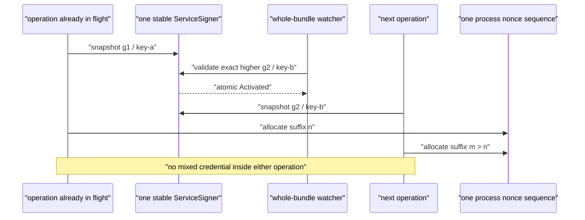

# Interview demo and hosted-showcase guide

This guide turns InferLab into a short, repeatable portfolio demonstration. It
does not replace deployment or security review. Record only from a tagged
release with green CI, and show the exact tag, commit SHA, topology, and limits.

The current engineering story is v0.29 restart-free service-signing handoff.
The browser showcase and hosted-edge rehearsal remain the v0.28 public product
surface. Say that distinction out loud: one live prompt demonstrates the
product; the retained v0.29 exact-process bundle demonstrates the new signer
lifecycle boundary.

## Recommended recording: five minutes

Use two loopback environments:

1. strict hosted-edge Compose for the live product interaction; and
2. the disposable v0.29 exact-process topology for signer-handoff evidence.

Do not expose either as an unsafe public URL. Follow the
[interview topology guide](../deploy/interview/README.md): install the hosted
environment template at a private mode-`0600` path outside the repository,
replace every placeholder, load it without echoing values, and run:

```bash
./deploy/interview/start.sh --hosted-edge
```

The Compose topology has three persistent controls, two real CPU workers, one
signed committed route, a gateway with separate public/private-operator
listeners, and pinned Prometheus. Only the loopback public showcase and
Prometheus UI are host-published; the operator listener stays inside the
private network. Stop explicitly with:

```bash
./deploy/interview/stop.sh --hosted-edge
```

Add `--purge-data` only for an intentional clean-volume reset. Prometheus
history is ephemeral.

| Time | Show | Say | Evidence visible |
|---|---|---|---|
| 0:00–0:25 | Release tag, commit SHA, and v0.29 diagram | “InferLab is one system from an HTTP request to generated CPU tokens. v0.29 changes live internal service signers without restarting them.” | Exact tag/SHA; four senders; three receipt participants |
| 0:25–1:05 | Hosted-edge startup summary and browser showcase | Explain that v0.28 separated public/operator listener capabilities and v0.29 does not broaden public exposure. | Loopback URL; operator listener private; no credentials visible |
| 1:05–1:40 | Submit one prompt and watch real streaming | Point out the real CPU decoder, incremental SSE, request headers, `[DONE]`, and EOF. | One accepted attempt; real CPU worker; terminal completion |
| 1:40–2:20 | v0.29 signer state/snapshot diagram | Explain whole mode-`0600` bundles, one stable signer/nonce domain, immutable per-operation snapshots, and exact higher-generation swap. | A in-flight remains A; next operation is B; sequence suffix `n`, then `m > n` |
| 2:20–3:05 | Four-sender rollout chart | Walk through g1 trusting A+B, follower→follower→leader→gateway bundle 1→2, no process replacement, then g2 revoking A. | All six proof processes retain PID/start token/command; quorum and route stay continuous; gateway switches last |
| 3:05–3:40 | Receipt convergence panel | Explain that signer-only handoff emits no receipt. Three controls apply g2 and post normal v1 receipts signed by B; the gateway is not a receipt participant. | Exactly three A receipts before g2 and three B receipts after g2; receipt v1 remains credential-bound |
| 3:40–4:20 | Failure/LKG panel and checker replay | Show invalid/fork/rollback/ineligible candidates retaining B; old-A request/vote and revoked-A reactivation fail before mutation. Replay only the retained checker against published bytes. | Nine startup rejections; eleven live rejections (`0 → 11`); eleven exact tests; 28/28 assertions; 28 total files / 27 hashed non-manifest files |
| 4:20–5:00 | Limits and next boundary | State local-file custody, resident A+B keys, restart-reset nonce/generation floor, sequential rather than fleet-atomic rollout, and absent TLS/HSM/HA/renewal guarantees. | RFC 0034 limits; Phase 34 failure matrix |

The tagged [v0.29 evidence](results/v0.29/README.md) passes 28/28 deterministic
assertions in 28 total files / 27 hashed non-manifest files. It retains nine
startup rejections, eleven live rejections with `rejected_reloads` moving
exactly `0 → 11`, four signing senders, three A and three B receipts, eleven
exact single-test regressions, and all six proof processes unchanged. After B
and route revision 3, retained real CPU JSON completes in 831.582 ms; retained
SSE completes in 833.124 ms with seven nonempty content pieces spanning
721.919 ms. The manifest SHA-256 is
`a21b3a8ddf5bd0f1f7e8a64fcfeb8485cd78c7d66d6247b6bbfa828bd94cc5a2`.
These are one loopback proof run's retained values, not promised timings for
the browser request recorded today.


The `$0` claim covers local execution, recording, and retained repository
evidence. This repository does not select or guarantee a free public host.
Free tiers may sleep, cap CPU/memory/bandwidth, change terms, or require billing
information. If managed HTTPS, private operator networking, secret storage,
provider abuse/cost controls, monitoring, and a quick disable path cannot all
be met at zero cost, publish the repository, evidence, and local recording—not
an unsafe endpoint.

Keep a second successful rehearsal as recovery insurance. The published live
product segment should be continuous; do not splice stored JSON into a claimed
live request. It is fine to show a retained proof chart and replay its checker
as retained evidence, provided you label it that way.

## The v0.29 diagram to explain



There are three separate claims:

- **per-operation consistency:** an operation snapshots one immutable
  credential;
- **process continuity:** activating B does not replace the OS process and does
  not reset its nonce domain; and
- **authorization readiness:** in required service-auth mode, a control
  activates only an exact candidate key eligible under its current policy.
  Explicitly disabled compatibility mode has no authorizer-policy gate. Gateway
  fleet readiness must be prepared by the operator.

Do not collapse them into “we rotated securely.” Each has different evidence
and limitations.

The sequence suffix is unique and increasing, but it need not be adjacent:
candidate eligibility can consume values between `n` and `m`. The nonce's
wall-clock prefix can regress, so the complete nonce string is not monotonic.

## The four-sender rollout to narrate

```mermaid
sequenceDiagram
    participant D as "trust distributor"
    participant F1 as "discovered follower"
    participant F2 as "other follower"
    participant L as "leader"
    participant G as "gateway"
    D-->>F1: "g1 trusts A+B"
    D-->>F2: "g1 trusts A+B"
    D-->>L: "g1 trusts A+B"
    Note over F1,L: "three g1 receipts name A"
    F1->>F1: "bundle 1→2; B active"
    F2->>F2: "bundle 1→2; B active"
    L->>L: "bundle 1→2; B active"
    G->>G: "bundle 1→2; B active"
    Note over F1,G: "no handoff receipt; same process identities"
    D-->>F1: "g2 revokes A"
    D-->>F2: "g2 revokes A"
    D-->>L: "g2 revokes A"
    F1->>D: "normal g2 receipt signed by B"
    F2->>D: "normal g2 receipt signed by B"
    L->>D: "normal g2 receipt signed by B"
    Note over D,L: "three service slots converged"
    G->>L: "authenticated config read signed by B"
```

The gateway is one of four **senders**, but only the three controls are
service-trust **receivers** that post application receipts. The distributor
counts stable control service IDs. It still verifies each receipt against the
exact credential named inside receipt v1. The first valid receipt fills one
service slot for one policy generation; a second credential receipt for that
same service/generation is a duplicate and preserves the stored receipt. A
higher policy publication clears every old slot before fresh B receipts fill
g2.

## Honest claims

Claims supported by the implementation boundary:

- InferLab runs a Rust gateway, control plane, queue, and CPU inference worker
  with a C++20 runtime and attention kernel; the browser request does not call
  a hosted LLM API.
- Gateway and control watched modes load a whole bounded signer bundle before
  listening, require mode `0600` on Unix, and reject ambiguous watched/static
  identity configuration.
- One stable `ServiceSigner` owns one process nonce sequence. Every outbound
  operation snapshots one credential; exact higher activation replaces the
  whole signer state atomically for future snapshots. Its sequence suffix is
  unique and increasing, while intervening validation and a regressing clock
  mean neither adjacency nor a monotonic complete nonce is claimed.
- Same-generation equality compares decoded signer semantics, not file bytes.
  JSON formatting and credential ordering alone may be unchanged; different
  decoded semantics are a fork. Lower generation is rollback, and invalid live
  input retains last known good.
- In required service-auth mode—including the proof topology—control activation
  checks the candidate's exact policy key and uses signer-before-authorizer lock
  order. Explicitly disabled compatibility mode has no policy gate. A silent
  watcher exit/panic/cancellation is supervised as process failure.
- Gateway trust readiness is deliberately an operator precondition, not a
  fleet-atomic protocol claim.
- Service-ID expected-receiver mode does not weaken receipt signatures: receipt
  v1 remains bound to the actual service and credential. Signer activation by
  itself creates no receipt.
- The retained v0.29 bundle passes 28/28 assertions, records all nine startup
  and eleven live rejection cases, runs eleven exact single-test regressions,
  and preserves all six process identities while four senders move A→B.
- Receipt evidence contains exactly three A receipts before g2 and three B
  receipts after g2. Its final real CPU JSON is 831.582 ms; SSE is 833.124 ms
  with seven pieces spanning 721.919 ms. Those are retained loopback timings,
  not an SLO.
- The v0.28 retained edge proof remains valid historical evidence: public
  `/internal/*` is absent in hosted mode, public/operator credentials are
  distinct, work is bounded before attempts, and its published 29/29,
  27-file/26-hash results belong specifically to v0.28.
- The v0.27 and v0.26 retained claims remain separate evidence for signed
  trust expiry and bounded observability; v0.29 does not broaden them.

Use measured v0.29 claims only from the exact recording tag after the retained
checker and SVG renderer replay byte-for-byte. The canonical bundle contains
28 total files / 27 hashed non-manifest files and its manifest SHA-256 is
`a21b3a8ddf5bd0f1f7e8a64fcfeb8485cd78c7d66d6247b6bbfa828bd94cc5a2`.

## Always qualify these statements

- The 3,232-parameter model is a deterministic educational fixture, not a
  useful general-purpose chatbot or evidence of model quality.
- Retained latency values describe one recorded machine and proof workload,
  not a capacity result, SLO, or cloud-performance guarantee.
- Private signer bundles use local filesystem custody. The application does not
  encrypt the seeds at rest or provide KMS/HSM isolation.
- A+B private keys remain in process memory while the accepted bundle contains
  them. Selecting B does not erase A. If a later bundle omits A, outstanding
  `Arc` snapshots can retain it until they drop; immediate erasure and memory
  zeroization are not claimed.
- Bundle-generation rollback is prevented only while the process retains its
  in-memory state. Restarting with an older otherwise valid file is not durably
  fenced by v0.29.
- Restart resets the nonce counter. Request timestamps, freshness/future-skew
  limits, and receiver replay caches still bound acceptance, but the nonce
  sequence is not durable.
- Atomic activation is inside one sender. Four processes switch sequentially;
  there is no fleet-atomic cutover.
- A gateway bundle may activate locally even if an operator failed to make its
  B key ready everywhere. Remote authenticated success is the proof of
  readiness.
- Receipt convergence is eventual. A missing receipt does not distinguish a
  partition, rejected policy, crashed receiver, or failed upload.
- v0.24 encrypts/authenticates only the trust-distribution channel. v0.29 adds
  no global service mTLS, leaf renewal, certificate revocation, or CA migration.
- v0.28 hosted mode is application-edge isolation, not HTTPS, reverse proxy,
  WAF/DDoS protection, identity provider, billing, or public hosting.
- Public buckets are in-memory per credential/process and do not bound sockets,
  bandwidth, botnets, authenticated slow uploads, or aggregate pre-gate memory.
- Request IDs are bounded correlation values, not authentication or global
  uniqueness. Metrics listeners remain private HTTP and create no security
  boundary.

Avoid “production-ready,” “zero downtime,” “secure rotation,” “exactly once,”
and “internet scale.” Prefer the precise claim: “restart-free, per-process,
whole-bundle service-signer handoff with immutable operation snapshots and LKG.”

## Reset and rehearsal checklist

Before each rehearsal:

- Check out the exact recording tag; require an empty `git status --short` and
  green CI for that commit.
- Download or generate the retained v0.29 proof from that same tag. Do not mix
  a chart from one commit with a browser demo from another.
- Verify Rust, C++20, Python 3, `curl`, and the proof script's documented local
  dependencies are available.
- Start from fresh disposable proof state; do not reuse Raft data, trust floors,
  bundles, or ports from an earlier take.
- Install `deploy/interview/hosted-edge.env.example` at a private mode-`0600`
  path outside the repository, replace every known fixture/placeholder, load it
  without shell tracing, and run `./deploy/interview/start.sh --hosted-edge`.
- Open the showcase in a fresh browser profile, enter the disposable public key,
  and confirm the page code does not persist it.
- Send one prompt and require incremental SSE, exact `[DONE]`, then EOF. Keep
  all credentials, seeds, bundle paths, raw environment, and private operator
  status off screen.
- Before recording, run the exact v0.29 proof once. During the short take,
  replay the retained checker/chart rather than implying a cold build and full
  process schedule completed off camera. Use only filenames and commands that
  exist in the tagged release.
- Replay `benchmarks/check_signer_handoff.py` and
  `benchmarks/render_signer_handoff_svg.py` with the exact commands in the
  [retained result](results/v0.29/README.md), require byte-equal outputs, and
  confirm the retained manifest SHA-256 is
  `a21b3a8ddf5bd0f1f7e8a64fcfeb8485cd78c7d66d6247b6bbfa828bd94cc5a2`.
- Inspect the retained process-identity evidence: all six proof-owned
  PIDs/start tokens/commands must stay unchanged. Four of those six processes
  are signing senders; leader/quorum and route revision must also match the
  proof's declared continuity contract.
- Confirm the receipt evidence has exactly the three controls as expected
  services, no gateway receipt, A receipts before g2, no signer-only receipt,
  and B receipts after g2.
- Confirm old-A gateway and peer attempts are rejected before protected
  mutation and a higher revoked-A bundle leaves B as LKG.
- Confirm proof output and retained bytes contain no known private seed, bundle
  path, absolute host path, bearer credential, or raw secret-bearing error.
- Open Prometheus only for the separate Compose observability segment. Prepare
  bounded aggregate queries, not per-request or secret-bearing labels.
- Disable notifications, enlarge terminal text, fix window placement, and
  rehearse the explanation against a timer.

After a failed take, stop hosted rehearsal with
`./deploy/interview/stop.sh --hosted-edge`, stop only the disposable proof
processes, and remove only their dedicated temporary state. Never manually edit
persistent demo volumes or signer bundles during a recording unless the exact
proof owns that action.

## Hosted-readiness checklist

Do not publish an internet URL until all applicable items are true:

- A tagged reproducible artifact is deployed, with tag and commit visible in
  private operator diagnostics.
- Public traffic uses provider-managed HTTPS and network controls; plain HTTP,
  controls, workers, storage, metrics, and operator routes remain private.
- Public inference has revocable credentials plus request, concurrency, body,
  output, and rate bounds. Provider-level abuse and cost limits also exist.
- Secrets come from a platform secret store, not the image/repository/logs or a
  world-readable mounted file. Rotation and emergency disable are rehearsed.
- Persistent Raft, route, queue, trust cache/floor, and signer paths have
  deliberate ownership, backup, restore, and reset procedures.
- Health/readiness, restart policy, CPU/memory limits, bounded queues, logging,
  availability/error/latency/saturation alerts, and cost alerts are configured.
- Proxy headers, CORS, upload limits, timeouts, and public/private route maps are
  explicit and tested from a signed-out browser and a separate network.
- The hosted topology and any reduction from the three-control proof are stated
  plainly. A low-cost single-node deployment is called single-node.
- One-command rollback or disable exists and has been tested.

The repository's hosted-edge Compose profile intentionally does not claim to
satisfy this checklist. It is a loopback rehearsal topology.

## Recording evidence bundle

Archive next to the final video:

- exact release tag, commit SHA, CI URL, and downloaded proof artifact;
- retained v0.29 manifest and checker result;
- sanitized process-continuity and A→B rollout summary;
- sanitized request/response headers and exact non-secret inference body;
- hosted topology summary;
- recording date and broad machine configuration; and
- the limitations stated verbatim in the video.

This lets an interviewer distinguish a repeatable engineering demonstration
from a one-off screen recording.
