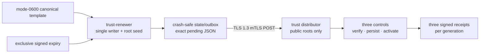
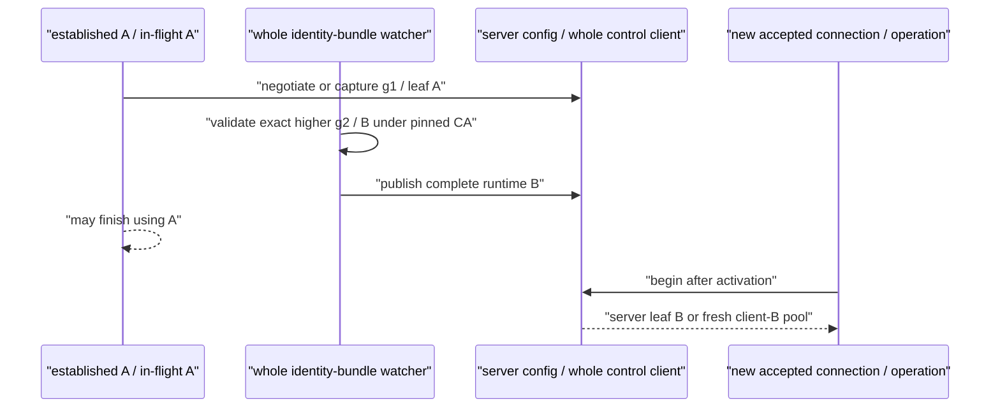

# Interview demo and hosted-showcase guide

This guide turns InferLab into a short, repeatable portfolio demonstration. It
does not replace deployment or security review. Record only from a tagged
release with green CI, and show the exact tag, commit SHA, topology, and limits.

The current engineering story is v0.31 deadline-safe automated signed-policy
renewal.
The browser showcase and hosted-edge rehearsal remain the v0.28 public product
surface. Say that distinction out loud: one live prompt demonstrates the
product; the retained v0.31 exact-process bundle demonstrates the new
authority-lifecycle boundary. Its final values come from one canonical loopback
run; they are evidence, not latency promises for the recorded browser showcase.

## Recommended recording: five minutes

Use two loopback environments:

1. strict hosted-edge Compose for the live product interaction; and
2. the disposable v0.31 exact-process topology for signed-renewal evidence.

Do not expose either as an unsafe public URL. Follow the
[interview topology guide](../deploy/interview/README.md): install the hosted
environment template at a private mode-`0600` path outside the repository,
replace every placeholder, load it without echoing values, and run:

```bash
./deploy/interview/start.sh --hosted-edge
```

The Compose topology has three persistent controls, two real CPU workers, one
signed committed route, a gateway with separate public/private-operator
listeners, and pinned Prometheus. Only the loopback public showcase and
Prometheus UI are host-published; the operator listener stays inside the
private network. Stop explicitly with:

```bash
./deploy/interview/stop.sh --hosted-edge
```

Add `--purge-data` only for an intentional clean-volume reset. Prometheus
history is ephemeral.

| Time | Show | Say | Evidence visible |
|---|---|---|---|
| 0:00–0:25 | Release tag, commit SHA, and v0.31 diagram | “InferLab is one system from an HTTP request to generated CPU tokens. v0.31 refreshes expiring signed trust without giving the distributor the root private key.” | Exact tag/SHA; separate `trust-renewer`; signer-free distributor; three controls |
| 0:25–1:05 | Hosted-edge startup summary and browser showcase | Explain that v0.28 separated public/operator listener capabilities and v0.31 does not broaden public exposure or add public HTTPS. | Loopback URL; operator listener private; no credentials visible |
| 1:05–1:40 | Submit one prompt and watch real streaming | Point out the real CPU decoder, incremental SSE, request headers, `[DONE]`, and EOF. | One accepted attempt; real CPU worker; terminal completion |
| 1:40–2:20 | Canonical-template and deadline diagram | Explain that automation may change only generation, issue time, expiry, and signature. Show the mode-`0600` template/state boundary and effective monotonic clock. | Signer-bound authority fingerprint; immutable policy meaning; exclusive expiry |
| 2:20–3:05 | Automatic generation and receipt chart | Walk through g1 and later automatic generations. Each is durably staged before TLS 1.3 mTLS publication and independently verified by all three controls. | Three signed receipts per generation; no distributor signing key; bounded deadline/margin |
| 3:05–3:40 | Ambiguous response and restart panel | Lose a POST response, restart only `trust-renewer`, then reconcile remote state against the exact durable pending bytes. | No duplicate or fork generation; other named process identities remain stable |
| 3:40–4:20 | Expiry/outage panel and checker replay | Cross the old policy's exclusive expiry, show protected 401s with no grace, then recover with a still-valid higher candidate. Replay only the retained checker against published bytes. | Late recovery `0 → 1`; 19/19 assertions; eight startup rejections; 18 exact tests; post-recovery JSON/SSE |
| 4:20–5:00 | Limits and next boundary | State online local root custody, single writer/distributor, pending-expiry operator recovery, and absent semantic rollout/cancellation/certificate automation/HSM/HA guarantees. | RFC 0036 limits; Phase 36 failure matrix |

The tagged [v0.31 evidence](results/v0.31/README.md) passes **19/19
deterministic assertions** over 22 total files / 21 manifest-hashed files
totaling 123,292 bytes. It retains four automatic generations, 12 verified
receipts, eight startup rejections, 18 exact production tests, and three
eight-entry process captures. The six other runtime services plus proof-only
gate retain identity while only `trust-renewer` is replaced once. The outage/
expiry recovery moves `late_recoveries` from zero to one. Real CPU JSON
completes in 827.528 ms; SSE completes in 828.044 ms with ten events and seven
content pieces through `[DONE]` plus EOF. Checker and SVG replay are byte-
identical. The 3,379-byte manifest SHA-256 is
`fc404a84196f36b25dd6635bd41ad960416732ed1842046bbc07e6a141c86c27`.
These are one loopback proof run's retained values, not promised timings for
the browser request recorded today.


For historical context, the tagged [v0.30 evidence](results/v0.30/README.md) passes **23/23
deterministic assertions** in 24 total files / 23 manifest-hashed files. It
retains 15 pre-listener startup rejections, 19 live server and 12 live client
rejections, 12 exact production regressions, six unchanged long-running
processes, and three verified receipts at each of policy generations 1 and 2.
Real CPU JSON completes in 819.971 ms. SSE completes in 825.317 ms with ten
events, seven nonempty content pieces, and an 817.285 ms first-to-last
event-offset span, then `[DONE]` and EOF. Checker and SVG replay are
byte-identical. The 3,710-byte manifest
SHA-256 is
`697562f9f10016bae043fa763ff752e16b89013e998c89192e4521e2c1c52506`.
These are one loopback proof run's retained values, not promised timings for
the browser request recorded today.


For historical context, the tagged [v0.29 evidence](results/v0.29/README.md) passes 28/28 deterministic
assertions in 28 total files / 27 hashed non-manifest files. It retains nine
startup rejections, eleven live rejections with `rejected_reloads` moving
exactly `0 → 11`, four signing senders, three A and three B receipts, eleven
exact single-test regressions, and all six proof processes unchanged. After B
and route revision 3, retained real CPU JSON completes in 831.582 ms; retained
SSE completes in 833.124 ms with seven nonempty content pieces spanning
721.919 ms. The manifest SHA-256 is
`a21b3a8ddf5bd0f1f7e8a64fcfeb8485cd78c7d66d6247b6bbfa828bd94cc5a2`.
These are one loopback proof run's retained values, not promised timings for
the browser request recorded today.


The `$0` claim covers local execution, recording, and retained repository
evidence. This repository does not select or guarantee a free public host.
Free tiers may sleep, cap CPU/memory/bandwidth, change terms, or require billing
information. If managed HTTPS, private operator networking, secret storage,
provider abuse/cost controls, monitoring, and a quick disable path cannot all
be met at zero cost, publish the repository, evidence, and local recording—not
an unsafe endpoint.

Keep a second successful rehearsal as recovery insurance. The published live
product segment should be continuous; do not splice stored JSON into a claimed
live request. It is fine to show a retained proof chart and replay its checker
as retained evidence, provided you label it that way.

## The v0.31 separation diagram to explain



There are five separate claims:

- **signer separation:** the root seed exists only in `trust-renewer`; the
  distributor verifies with public roots and cannot mint policy;
- **renewal-only authority:** the template and signer-bound fingerprint freeze
  cluster, schema, credentials, revocations, roles, and root identity;
- **persist-before-publish:** one complete signed candidate is made durable
  before its first POST attempt;
- **ambiguous-outcome reconciliation:** timeout or restart compares the exact
  pending snapshot with a cryptographically verified distributor GET before
  advancing; and
- **exclusive receiver authority:** expiry adds no grace, even while the
  renewer retries or the distributor is unavailable.

Do not collapse these into “automatic key rotation.” v0.31 renews timestamps
and generation around one fixed meaning. It does not rotate policy semantics,
the root, or TLS certificates.

## The v0.31 recovery sequence to narrate

```mermaid
sequenceDiagram
    participant R as "trust-renewer"
    participant S as "durable state/outbox"
    participant D as "trust distributor"
    participant C as "three controls"
    R->>D: "GET compatible current gN"
    R->>S: "fsync exact signed gN+1"
    R->>D: "POST gN+1"
    D->>D: "durably commit"
    D--xR: "response lost"
    Note over R: "renewer-only restart"
    R->>S: "load exact pending gN+1"
    R->>D: "GET current"
    D-->>R: "byte-identical gN+1"
    R->>S: "commit pending; do not sign a duplicate"
    D-->>C: "controls activate gN+1"
    C-->>D: "three signed receipts"
```

The later outage path is deliberately distinct. Once the old current policy
expires, protected requests reject; the renewer does not extend it locally.
Recovery succeeds only while the already staged higher candidate remains
inside its own signed validity window. If that pending candidate also expires,
v0.31 fails closed and requires explicit operator reconciliation rather than
publishing expired authority or guessing that an ambiguous generation can be
skipped.

## Historical v0.30 TLS diagram



There are four separate claims:

- **same-CA identity validation:** generation 1 pins the issuer CA; a candidate
  cannot redefine its own trust boundary;
- **server accept/handshake semantics:** B is captured by connections accepted
  after publication; pre-accepted handshake futures and established A
  connections may retain A;
- **client-pool semantics:** a control publishes a whole new HTTP client, so an
  operation starting after activation cannot enter the old pool; and
- **process continuity:** leaf activation does not replace the long-running
  distributor or control process.

Do not collapse them into “zero-downtime certificate rotation.” Each has
different evidence and limitations, and ordinary overlap explicitly permits
already-established/in-flight A.

## Historical v0.30 sequential TLS renewal

```mermaid
sequenceDiagram
    participant D as "trust distributor"
    participant PA as "fresh publisher-A client"
    participant C as "three running controls"
    participant PB as "fresh publisher-B client"
    PA->>D: "publish policy g1 over mTLS A"
    D-->>C: "fetch g1; control client leaf A"
    C->>D: "three g1 application receipts"
    D->>D: "server bundle 1/A → 2/B"
    Note over D,C: "pre-accepted/established A may finish; post-publication accept sees B"
    C->>C: "rotate each client bundle 1/A → 2/B"
    Note over C: "new operation snapshots whole client B + fresh pool"
    PB->>D: "new connection; publish policy g2 over mTLS B"
    D-->>C: "fetch g2 through client B"
    C->>D: "three g2 application receipts through client B"
```

The TLS leaves authorize the transport peer under the fixed CA; they do not
authorize policy contents. Root-signed policy and service-signed receipt bytes
remain independent application authority. Publisher A and publisher B are
separately constructed fresh clients. There is no persistent publisher
process, publisher watcher, process-continuity observation, or publisher
handoff.

## Honest claims

Claims supported by the implementation boundary:

- InferLab runs a Rust gateway, control plane, queue, and CPU inference worker
  with a C++20 runtime and attention kernel; the browser request does not call
  a hosted LLM API.
- One persistent, separately supervised `trust-renewer` owns the configured
  online root seed. The distributor remains signer-free and verifies with
  public roots only.
- Automatic renewal preserves one canonical policy-v2 meaning. Only generation,
  issue time, expiry, and signature change; cluster, schema, credentials,
  revocations, roles, root key ID, and signer public key are fingerprint-bound.
- The renewer loads bounded mode-`0600` regular non-symlink template/state
  sources, holds an exclusive state lock, and durably records one exact signed
  pending snapshot before the first POST.
- Every startup and ambiguous outcome reconciles against a cryptographically
  and semantically verified distributor GET over static TLS 1.3 mTLS. Exact
  equality commits pending bytes; compatible higher manual state advances the
  floor; rollback, fork, root/template drift, future issue time, or wrong
  lifetime fails closed.
- Scheduling uses a process-monotonic effective clock and bounded lifetime,
  margin, poll, retry, and request timeout. Expired current policy receives no
  hidden grace. A pending candidate is POSTed only while currently valid.
- `/health` reports resident process liveness, while `/readyz` and the finite
  redacted renewal status report whether the loop can renew safely. Status,
  metrics, and logs exclude seeds, policy bytes, signatures, credentials,
  source paths, and raw transport/TLS errors.
- The v0.31 retained bundle passes 19/19 assertions over 22 total / 21 hashed
  files (123,292 bytes), covers four automatic generations and 12 receipts,
  records eight startup rejections and 18 exact tests, replaces only the
  renewer across three eight-entry process captures, and moves late recovery
  zero to one. Post-recovery JSON is 827.528 ms; ten-event, seven-piece SSE is
  828.044 ms through `[DONE]` plus EOF. Its manifest SHA-256 is
  `fc404a84196f36b25dd6635bd41ad960416732ed1842046bbc07e6a141c86c27`.

Historical v0.30 claims remain supported separately:

- The distributor and controls can opt into one complete, bounded TLS identity
  bundle loaded before service; exact mode `0600` and a regular non-symlink
  source are required on Unix, and watched/static identity mixing fails closed.
- Generation 1 pins the local issuer CA. A higher candidate must preserve that
  decoded CA and pass exact cluster/identity/purpose/server-name binding,
  certificate/private-key matching, current validity, EKU, server SAN,
  generation, and complete runtime construction before publication.
- Same-generation identity equality uses decoded semantics rather than JSON/PEM
  formatting. An equivalent encoding of the already leaf-matched private key
  is harmless. Lower generation is rollback; a changed certificate, purpose,
  name, or CA at the same generation is a fork; invalid live observations
  retain LKG.
- Distributor activation affects connections accepted after publication.
  Pre-accepted handshake futures and established connections may keep A and
  are not falsely reported as B or forcibly terminated by ordinary renewal.
- Each control operation captures one complete HTTP client. Activation builds
  and swaps a new client with a fresh connection pool; a post-activation
  operation cannot enter the old pool, while an already-started operation may
  finish using its captured A client.
- The configured remote-verification CAs do not change. X.509 peer admission
  remains separate from root-signed trust policy and service-signed receipt
  verification.
- Publisher A/B are two fresh connections, not a persistent publisher process.
  Do not claim publisher watching, process continuity, or a publisher handoff.
- Watcher rejection status is bounded and truthful. Transient source failures
  and unchanged not-yet-valid candidates are retried; identical time-dependent
  and deterministic observations do not repeat the counter/report. Unexpected
  watcher exit/panic/cancellation is supervised rather than silently freezing
  renewal. Status may expose the active leaf's SHA-256 DER fingerprint for A/B
  observation, but not its subject, serial, PEM, CA, key, or path.
- The retained v0.30 bundle passes 23/23 assertions over 24 total / 23 hashed
  files, covers 15 startup and 31 live rejection cases plus 12 exact tests,
  keeps six long-running process identities unchanged, and authenticates the
  bundle with manifest SHA-256
  `697562f9f10016bae043fa763ff752e16b89013e998c89192e4521e2c1c52506`.

Historical v0.29 claims remain supported separately:

- Gateway and control watched modes load a whole bounded signer bundle before
  listening, require mode `0600` on Unix, and reject ambiguous watched/static
  identity configuration.
- One stable `ServiceSigner` owns one process nonce sequence. Every outbound
  operation snapshots one credential; exact higher activation replaces the
  whole signer state atomically for future snapshots. Its sequence suffix is
  unique and increasing, while intervening validation and a regressing clock
  mean neither adjacency nor a monotonic complete nonce is claimed.
- Same-generation equality compares decoded signer semantics, not file bytes.
  JSON formatting and credential ordering alone may be unchanged; different
  decoded semantics are a fork. Lower generation is rollback, and invalid live
  input retains last known good.
- In required service-auth mode—including the proof topology—control activation
  checks the candidate's exact policy key and uses signer-before-authorizer lock
  order. Explicitly disabled compatibility mode has no policy gate. A silent
  watcher exit/panic/cancellation is supervised as process failure.
- Gateway trust readiness is deliberately an operator precondition, not a
  fleet-atomic protocol claim.
- Service-ID expected-receiver mode does not weaken receipt signatures: receipt
  v1 remains bound to the actual service and credential. Signer activation by
  itself creates no receipt.
- The retained v0.29 bundle passes 28/28 assertions, records all nine startup
  and eleven live rejection cases, runs eleven exact single-test regressions,
  and preserves all six process identities while four senders move A→B.
- Receipt evidence contains exactly three A receipts before g2 and three B
  receipts after g2. Its final real CPU JSON is 831.582 ms; SSE is 833.124 ms
  with seven pieces spanning 721.919 ms. Those are retained loopback timings,
  not an SLO.
- The v0.28 retained edge proof remains valid historical evidence: public
  `/internal/*` is absent in hosted mode, public/operator credentials are
  distinct, work is bounded before attempts, and its published 29/29,
  27-file/26-hash results belong specifically to v0.28.
- The v0.27 and v0.26 retained claims remain separate evidence for signed
  trust expiry and bounded observability; v0.29 does not broaden them.

Use measured v0.31 claims only from the exact recording tag after its retained
checker and SVG renderer replay byte-for-byte. The canonical bundle contains
22 total files / 21 manifest-hashed files and its manifest SHA-256 is
`fc404a84196f36b25dd6635bd41ad960416732ed1842046bbc07e6a141c86c27`.
Historical v0.29 evidence remains 28 total files / 27 hashed non-manifest files
with manifest SHA-256
`a21b3a8ddf5bd0f1f7e8a64fcfeb8485cd78c7d66d6247b6bbfa828bd94cc5a2`.

## Always qualify these statements

- The 3,232-parameter model is a deterministic educational fixture, not a
  useful general-purpose chatbot or evidence of model quality.
- Retained latency values describe one recorded machine and proof workload,
  not a capacity result, SLO, or cloud-performance guarantee.
- v0.31 keeps the service-trust root seed online in one local `trust-renewer`.
  It is single-writer separation from the distributor, not offline/HSM/KMS
  custody, quorum signing, leader election, or HA.
- Automatic renewal preserves one configured semantic template. It does not
  automate credential/revocation/role changes, root rotation, emergency or
  in-flight cancellation, certificate issuance, CA migration, or global mTLS.
- An expired current policy has no grace. A valid higher generation may restore
  service afterward, but an expired pending candidate is never published.
  Without a burned-generation ledger, ambiguity that outlives pending validity
  requires explicit operator reconciliation.
- A semantic manual rollout cannot be enabled by changing the template and
  restarting. The operator must independently verify a strictly higher remote
  snapshot, archive the old state/lock, install the matching template, and use
  an empty new state path.
- Receipt convergence remains eventual and separate from publication. Missing
  receipts do not authorize another generation or prove a receiver's health.
- The v0.31 process claim names only the retained proof topology. Its deliberate
  renewer restart is evidence of pending recovery, not renewer continuity.
- TLS identity bundles use local filesystem custody; neither their private keys
  nor the v0.31 root seed receives KMS/HSM isolation.
- Old server configurations, established A connections, and outstanding
  client-A clones can retain old key material after B activates. Ordinary
  renewal neither forcibly closes A nor proves immediate erase/zeroization.
- TLS identity generation and issuer-CA pins are process-memory floors. Restart
  with an older otherwise valid bundle is not durably fenced by v0.30.
- The distributor and controls activate independently. “Implemented
  restart-free same-CA leaf renewal” is not a fleet-atomic or emergency-
  revocation claim.
- Publisher A/B are fresh connections only. Do not include the publisher in a
  process-continuity count or call the two clients a publisher handoff.
- Private signer bundles use local filesystem custody. The application does not
  encrypt the seeds at rest or provide KMS/HSM isolation.
- A+B private keys remain in process memory while the accepted bundle contains
  them. Selecting B does not erase A. If a later bundle omits A, outstanding
  `Arc` snapshots can retain it until they drop; immediate erasure and memory
  zeroization are not claimed.
- Bundle-generation rollback is prevented only while the process retains its
  in-memory state. Restarting with an older otherwise valid file is not durably
  fenced by v0.29.
- Restart resets the nonce counter. Request timestamps, freshness/future-skew
  limits, and receiver replay caches still bound acceptance, but the nonce
  sequence is not durable.
- Atomic activation is inside one sender. Four processes switch sequentially;
  there is no fleet-atomic cutover.
- A gateway bundle may activate locally even if an operator failed to make its
  B key ready everywhere. Remote authenticated success is the proof of
  readiness.
- Receipt convergence is eventual. A missing receipt does not distinguish a
  partition, rejected policy, crashed receiver, or failed upload.
- v0.24 encrypts/authenticates only the trust-distribution channel. v0.30 adds
  same-CA leaf replacement on that same channel, not global service mTLS,
  certificate revocation, CA migration, or automated issuance/scheduling.
- v0.28 hosted mode is application-edge isolation, not HTTPS, reverse proxy,
  WAF/DDoS protection, identity provider, billing, or public hosting.
- Public buckets are in-memory per credential/process and do not bound sockets,
  bandwidth, botnets, authenticated slow uploads, or aggregate pre-gate memory.
- Request IDs are bounded correlation values, not authentication or global
  uniqueness. Metrics listeners remain private HTTP and create no security
  boundary.

Avoid “production-ready,” “zero downtime,” “secure rotation,” “exactly once,”
and “internet scale.” Prefer the precise current claim: “deadline-safe,
single-writer renewal of one fixed signed-policy meaning, with crash-safe exact
pending bytes, reconciliation before advance, and no expiry grace.”

## Reset and rehearsal checklist

Before each rehearsal:

- Check out the exact recording tag; require an empty `git status --short` and
  green CI for that commit.
- Download or generate the retained v0.31 proof from that same tag. Do not mix
  a chart from one commit with a browser demo from another.
- Verify Rust, C++20, Python 3, `curl`, and the proof script's documented local
  dependencies are available.
- Start from fresh disposable proof state; do not reuse Raft data, trust floors,
  bundles, or ports from an earlier take.
- Install `deploy/interview/hosted-edge.env.example` at a private mode-`0600`
  path outside the repository, replace every known fixture/placeholder, load it
  without shell tracing, and run `./deploy/interview/start.sh --hosted-edge`.
- Open the showcase in a fresh browser profile, enter the disposable public key,
  and confirm the page code does not persist it.
- Send one prompt and require incremental SSE, exact `[DONE]`, then EOF. Keep
  all credentials, seeds, bundle paths, raw environment, and private operator
  status off screen.
- Before recording, run the exact v0.31 proof once. During the short take,
  replay the retained checker/chart rather than implying a cold build and full
  process schedule completed off camera. Use only filenames and commands that
  exist in the tagged release.
- Replay `benchmarks/check_trust_policy_renewal.py` and
  `benchmarks/render_trust_policy_renewal_svg.py` with the exact commands in the
  [retained result](results/v0.31/README.md), require byte-equal outputs, and
  confirm manifest SHA-256
  `fc404a84196f36b25dd6635bd41ad960416732ed1842046bbc07e6a141c86c27`.
- Inspect every retained process capture against the exact named v0.31
  topology. Confirm only `trust-renewer` is deliberately replaced for the
  ambiguity/restart path; do not broaden that observation into an HA claim.
- Confirm all four automatic generations preserve the canonical semantic
  template, advance strictly, validate under the configured root, and receive
  three verified control receipts each.
- Confirm the first publication ambiguity reloads and reconciles byte-identical
  pending JSON after renewer restart, without a duplicate generation or fork.
- Confirm the outage crosses the old current policy's exclusive expiry,
  protected signed-repeat/signed/missing requests reject with no grace, and a
  still-valid higher candidate restores service while incrementing the late-
  recovery counter.
- Confirm unsafe/corrupt source/state, lifetime/time, rollback, fork, wrong
  cluster/root/schema, semantic drift, and persistence-uncertainty cases match
  the finite failed-closed contract and exact focused-test tuples.
- Confirm proof output and retained bytes contain no known private seed, bundle
  path, absolute host path, bearer credential, or raw secret-bearing error.
- Open Prometheus only for the separate Compose observability segment. Prepare
  bounded aggregate queries, not per-request or secret-bearing labels.
- Disable notifications, enlarge terminal text, fix window placement, and
  rehearse the explanation against a timer.

After a failed take, stop hosted rehearsal with
`./deploy/interview/stop.sh --hosted-edge`, stop only the disposable proof
processes, and remove only their dedicated temporary state. Never manually edit
persistent demo volumes, signer/TLS bundles, or renewer state/outbox files
during a recording unless the exact proof owns that action.

## Hosted-readiness checklist

Do not publish an internet URL until all applicable items are true:

- A tagged reproducible artifact is deployed, with tag and commit visible in
  private operator diagnostics.
- Public traffic uses provider-managed HTTPS and network controls; plain HTTP,
  controls, workers, storage, metrics, and operator routes remain private.
- Public inference has revocable credentials plus request, concurrency, body,
  output, and rate bounds. Provider-level abuse and cost limits also exist.
- Secrets come from a platform secret store, not the image/repository/logs or a
  world-readable mounted file. Rotation and emergency disable are rehearsed.
- Persistent Raft, route, queue, trust cache/floor, signer, TLS identity, and
  renewer template/state/lock paths have deliberate ownership, backup, restore,
  and reset procedures.
- Health/readiness, restart policy, CPU/memory limits, bounded queues, logging,
  availability/error/latency/saturation alerts, and cost alerts are configured.
- Proxy headers, CORS, upload limits, timeouts, and public/private route maps are
  explicit and tested from a signed-out browser and a separate network.
- The hosted topology and any reduction from the three-control proof are stated
  plainly. A low-cost single-node deployment is called single-node.
- One-command rollback or disable exists and has been tested.

The repository's hosted-edge Compose profile intentionally does not claim to
satisfy this checklist. It is a loopback rehearsal topology.

## Recording evidence bundle

Archive next to the final video:

- exact release tag, commit SHA, CI URL, and downloaded proof artifact;
- retained v0.31 manifest and checker result;
- sanitized automatic-generation, receipt, ambiguity/restart, expiry/recovery,
  and exact process-identity summary;
- sanitized request/response headers and exact non-secret inference body;
- hosted topology summary;
- recording date and broad machine configuration; and
- the limitations stated verbatim in the video.

This lets an interviewer distinguish a repeatable engineering demonstration
from a one-off screen recording.
