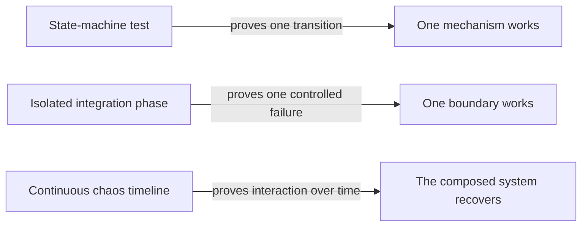
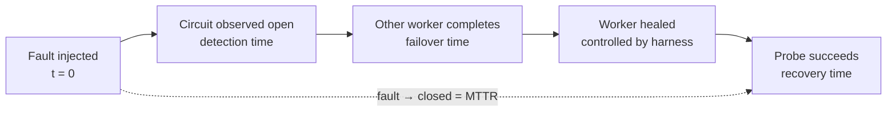
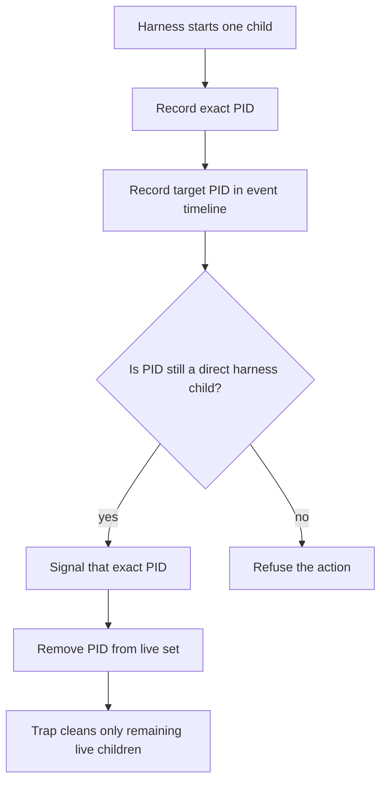

# Phase 09 learning guide: continuous resilience chaos

## The new behavior in one sentence

InferLab now keeps requests arriving while workers fail and recover, records
what clients and the gateway observe, and turns that shared timeline into a
measured recovery curve.

## What problem exists without this?

Earlier proofs ask clean, isolated questions:

- can a retry move one request to B?
- can a breaker open A?
- can one probe restore A?
- can overload counters stay bounded?

Those tests are necessary, but production incidents do not pause traffic between
steps. A worker can fail while other requests are queued, retries are sleeping,
streams are completing, and circuit samples are changing.

Without a continuous timeline, we can accidentally prove every component while
missing a broken composition.



Chaos does not replace unit or integration tests. It asks a different question.

## Mental model: fire drill plus flight recorder

A normal failure test is checking whether one smoke detector rings.

A chaos experiment is a controlled fire drill:

- people keep moving through the building;
- one known fault is injected;
- the blast radius is restricted;
- observers record alarms, rerouting, delay, and recovery; and
- the building must return to its original operating condition.

The flight recorder matters as much as the fault. If we kill a worker and later
see green output, we do not know what happened between those two moments.

## Chaos engineering terms

### Steady-state hypothesis

Before breaking anything, state what “normal enough” means.

For this experiment:

```text
healthy circuits + 100% success + low p95 latency + 1.0× attempts
```

During one-worker failure, we do not require every metric to remain identical.
We require useful work to continue and all safety bounds to hold.

### Fault injection

A deliberate action that creates a known failure:

- terminate worker A;
- restart B with response headers slower than the attempt timeout; or
- stop C while the gateway retains C's static endpoint.

The injection timestamp is part of the evidence.

### Blast radius

The maximum part of the system we intentionally risk.

This harness impairs one worker at a time. The gateway and two workers remain
healthy. Faults never target arbitrary processes or host networking.

### Recovery curve

A recovery curve shows what happened between healthy-before and healthy-after.
It includes failure detection, rerouting, latency, retry load, half-open probes,
and return to normal traffic.

## Follow the experiment timeline

```mermaid
sequenceDiagram
    participant L as Open-loop clients
    participant G as Gateway
    participant A as Worker A
    participant B as Worker B
    participant C as Worker C
    L->>G: continuous requests begin
    G->>A: ordinary traffic
    G->>B: ordinary traffic
    G->>C: ordinary traffic
    Note over A: process killed
    G-xA: connection failure
    G->>B: retry/reroute
    G->>C: circuit skips A
    Note over A: process restarts healthy
    G->>A: one half-open probe
    A-->>G: success; A closes
    Note over B: restart with 350 ms delay
    G-xB: 150 ms header timeout
    G->>A: retry/reroute
    Note over B: restore 12 ms delay
    G->>B: probe succeeds
    Note over C: process stopped; connection refused
    G-xC: connection failure
    Note over C: process reconnects
    G->>C: probe succeeds
    L->>G: final healthy traffic
```

The important observation is that the load lane never stops.

## Why open-loop offered load?

Imagine testing a bridge with a rule that another car may enter only after the
previous car leaves. When the bridge slows down, fewer cars arrive. The test
hides congestion.

Closed-loop clients do exactly that:

```text
send → wait → send → wait
```

Open-loop clients schedule against time:

```text
request 1 at 0 ms
request 2 at 55.556 ms
request 3 at 111.111 ms
...
```

The service may slow, but offered load remains 18 requests/second.
`dispatch_lag_ms` proves that the load generator itself kept the schedule.

## Detection, failover, recovery, and MTTR

These terms describe different boundaries.



- **Detection time** asks how long failure evidence took to open the circuit.
- **Failover time** asks how soon useful work completed somewhere else.
- **Recovery time** asks how long the healed worker took to prove itself and
  close.
- **MTTR** measures the complete incident from fault injection to restored
  membership. Here it includes the deliberate 2.5-second fault duration.

Do not combine them into one number too early. A system can fail over in 30 ms
while intentionally keeping the failed worker isolated for seconds.

## Goodput, error rate, and retry amplification

### Goodput

Goodput is useful work completed under the intended contract.

All 324 retained requests completed successfully under the 700 ms deadline.
That is goodput.

### Error rate

Client error rate was zero in the retained run. That does **not** mean nothing
failed. The gateway observed connection failures and response-header timeouts,
then recovered those requests.

### Retry amplification

```text
retry amplification = upstream attempts / original requests
                    = 336 / 324
                    = 1.037×
```

The circuit breakers stopped repeated discovery, and the 10% retry budget
allowed at most 32 retries. Only 12 were used.

Success rate says what clients saw. Attempt amplification says what the system
paid.

## Read the retained chart


Read it from top to bottom:

1. Vertical dashed lines are actual fault and heal timestamps.
2. Green bars are successful requests per 500 ms.
3. Red bars would show client errors; none occurred in this retained run.
4. The blue line is p95 client latency.
5. Worker lanes show circuit state:
   - green = closed;
   - red = open;
   - yellow = half-open.
6. Bottom rows report detection, recovery, retry accounting, and resource
   bounds.

Worker B is the most educational phase. Success remains 100%, but p95 latency
rises from 19.414 ms in the baseline to 175.083 ms. If we plotted only success
rate, the slow incident would disappear.

## Why do circuits open three times?

Each fault lasts about 2.5 seconds while cooldown lasts 700 ms.

```text
open → cooldown → half-open probe fails → open
     → cooldown → half-open probe fails → open
     → worker heals → half-open probe succeeds → closed
```

The first two probes correctly discover that the worker is still broken. The
third proves recovery. This is why `opened_total=3`,
`half_open_probes_total=3`, and `recoveries_total=1` for every worker.

## The safety design



Why remove a stopped PID? Operating systems eventually reuse PID numbers. If
cleanup retained an old number, it might later refer to an unrelated process.

Why not `pkill fake-worker`? It matches names, not ownership. It could terminate
another InferLab experiment that the harness did not start.

## How the code works

No new Rust serving mechanism was added. That is an important design choice:
the experiment must not change the system it claims to measure.

The harness still exercises Rust concepts introduced earlier:

- dropping a failed `WorkerLease` releases in-flight state;
- dropping `ExecutionGuard` releases semaphore capacity before backoff;
- dropping an unresolved half-open attempt releases its probe slot;
- a successful response moves permits into the response body lifetime; and
- atomic counters expose retry and admission accounting during concurrent work.

The new code is primarily Python and Bash:

- `ThreadPoolExecutor` allows scheduled requests to overlap.
- A sampler thread polls gateway state independently of request completion.
- `time.perf_counter()` supplies monotonic within-process elapsed time.
- the ready file shares a wall-clock epoch with the shell event recorder.
- JSON retains raw observations before interpretation.
- the analyzer derives phase summaries and state segments from raw clocks.
- the checker rejects an incomplete or unsafe event sequence.
- the SVG renderer reads only analysis JSON, so chart regeneration is
  deterministic.

## Why the first checker design was revised

The first experimental run required every injected fault to produce a
client-visible error. Two incidents were completely masked by retries and
rerouting, so that assertion failed even though circuits opened and recovery
worked.

The corrected claim is:

> Every injected fault must be visible either as a client error or as additional
> upstream attempts and circuit-state changes.

This is not weakening the experiment. It distinguishes **observability** from
**user impact**. A resilient system should ideally expose faults to telemetry
without exposing them to users.

The retained run went further: all three faults were internally observable and
all 324 client requests succeeded.

## What the proof establishes

| Observation | Result |
|---|---:|
| Requests scheduled | 324 |
| Requests successful | 324 |
| A detection / failover / recovery | 256.243 / 27.720 / 152.566 ms |
| B detection / failover / recovery | 559.934 / 33.163 / 747.968 ms |
| C detection / failover / recovery | 253.777 / 21.672 / 152.814 ms |
| Mean MTTR | 2,859.911 ms |
| Attempts | 336 |
| Retry amplification | 1.037× |
| Maximum latency | 178.261 ms |
| Request deadline | 700 ms |
| Queue peak / capacity | 0 / 6 |
| Execution peak / capacity | 2 / 6 |
| RSS increase | 1,056 KiB |
| Assertions | 24 / 24 |

## What this still cannot prove

- behavior across real hosts or an unreliable network;
- overlapping failures or total worker-pool loss;
- corruption after response headers or mid-stream body failure;
- long-term reliability from an 18-second sample;
- fairness across tenants, priorities, or models;
- resilience of a real C++ inference runtime;
- behavior after a gateway restart, because breaker state is process-local; or
- a universal latency or capacity claim for production hardware.

The experiment uses non-streaming completions to focus on pre-response failures.
Earlier integration tests remain responsible for streaming lifetime and
no-retry-after-streaming claims.

## Read the code and evidence in this order

1. The timeline and safety functions in `scripts/proof-v0.0.9.sh`.
2. Request scheduling in `benchmarks/chaos_probe.py`.
3. The independent gateway sampler in the same file.
4. Phase and recovery derivation in `benchmarks/analyze_chaos.py`.
5. Claims in `benchmarks/check_chaos.py`.
6. Deterministic plotting in `benchmarks/render_chaos_svg.py`.
7. `docs/results/v0.0.9/raw/events.jsonl`.
8. `docs/results/v0.0.9/raw/chaos-check.json`.
9. The raw request and state samples in `chaos-run.json`.

## Reproduce

```bash
./scripts/proof-v0.0.9.sh
```

Retain a new verified run with:

```bash
INFERLAB_RESULTS_DIR=docs/results/v0.0.9/raw \
  ./scripts/proof-v0.0.9.sh
```

## What comes next

The gateway can now preserve interactive traffic through controlled worker
incidents. The next systems topic changes the contract: durable batch inference
must remember work across process crashes using a write-ahead log, acknowledgments,
visibility timeouts, idempotency, and dead-letter handling.

## Check your understanding

Why would a chaos run showing 100% client success still be considered unhealthy
if upstream attempt amplification rose from 1.0× to 2.8×?

