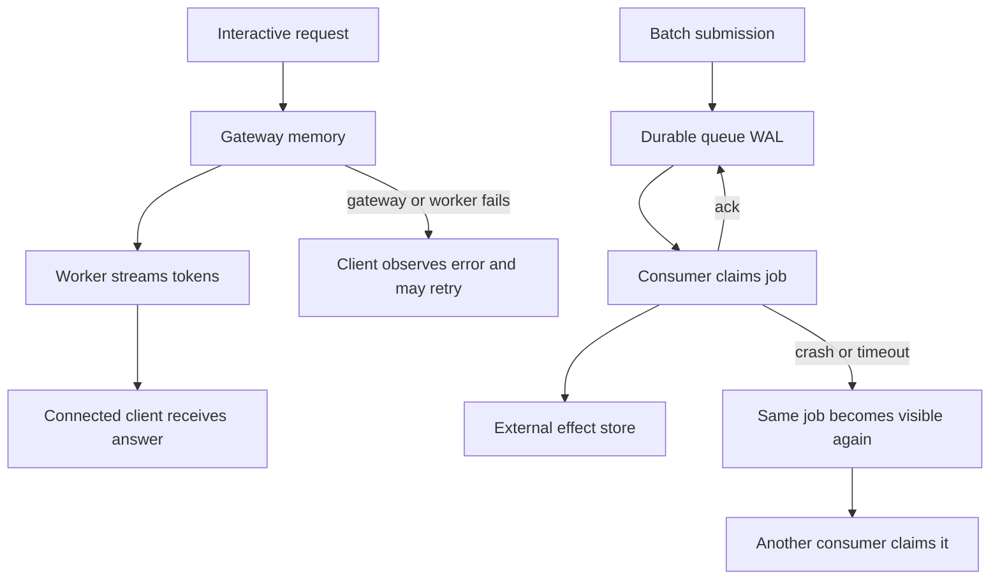
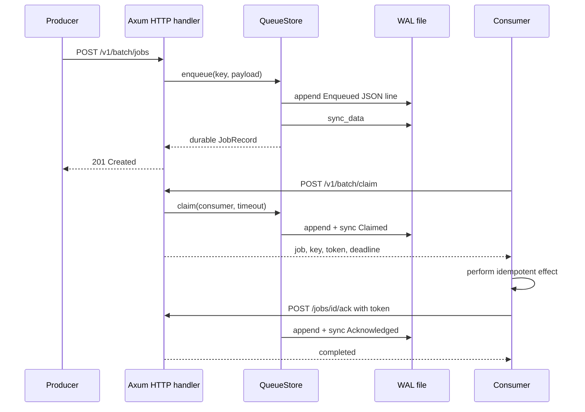
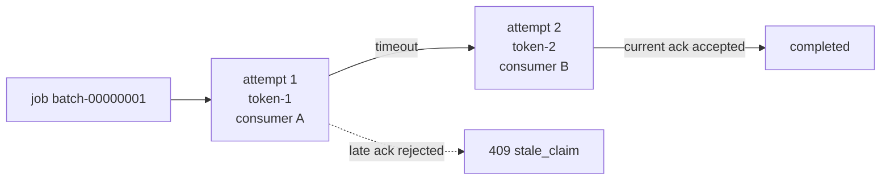
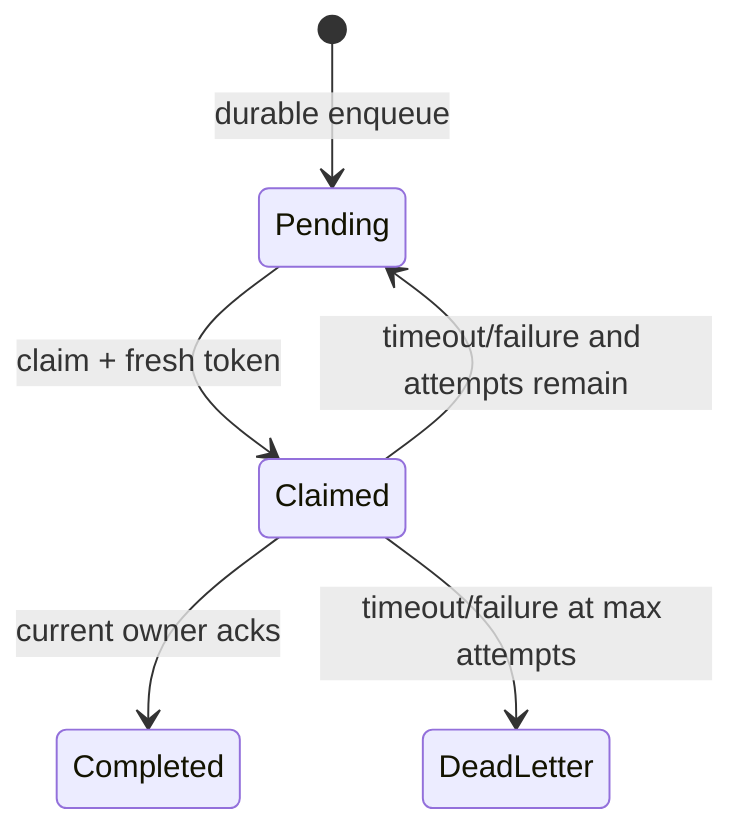
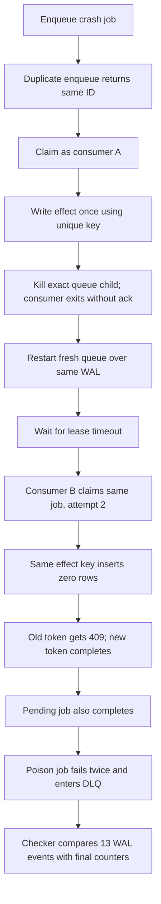

# Phase 10 learning guide: durable batch delivery

## The new behavior in one sentence

InferLab can now accept unattended batch jobs, remember them across a queue
process crash, safely redeliver unfinished work, fence stale consumers, and stop
poison jobs after a bounded number of attempts.

## Start with the picture

Interactive and batch requests solve different ownership problems:



The left side may fail visibly. The right side cannot silently forget work,
because no human connection remains to notice.

## Mental model: a courier ledger

Imagine a courier office:

1. The clerk writes a parcel in a permanent ledger **before** giving the sender
   a receipt.
2. Courier A signs the parcel out for 30 minutes.
3. The parcel is not erased merely because A took it.
4. If A returns and confirms delivery, the clerk marks it complete.
5. If A disappears, the temporary sign-out expires and courier B may take it.
6. Each sign-out has a new receipt number, so A cannot later claim B's work.
7. If delivery repeatedly fails, the parcel moves to an inspection shelf
   instead of circulating forever.

The permanent ledger is the WAL. Signing out is a claim. Thirty minutes is the
visibility timeout. The receipt number is a claim token. The inspection shelf
is the dead-letter queue.

## Vocabulary

| Term | Full form / plain meaning |
|---|---|
| RFC | **Request for Comments**: a reviewable record of a design decision and its trade-offs |
| WAL | **Write-Ahead Log**: append the intended state change to durable storage before confirming it |
| `fsync` / `sync_data` | Ask the operating system to flush file data through the filesystem's durability boundary |
| Enqueue | Add a job to the queue |
| Consumer | A worker process that claims and performs batch jobs |
| Claim | Temporarily assign one pending job to one consumer |
| Lease | Time-limited ownership; here the active claim |
| Visibility timeout | How long a claimed job stays hidden before unfinished work is made available again |
| Acknowledgement / ack | The current consumer confirms that processing completed |
| Redelivery | Deliver the same logical job again after a failure or timeout |
| Idempotency | Repeating an operation with the same key has one logical effect |
| At least once | A job is delivered one or more times; zero deliveries after acceptance are forbidden |
| Claim-token fencing | Reject messages from an older owner after a newer lease exists |
| DLQ | **Dead-Letter Queue**: terminal holding area for repeatedly failed jobs |
| Torn write | A crash leaves only part of the final record on disk |
| Replay | Rebuild current state by applying durable events in order |
| Poison job | Work that fails every consumer attempt because of its content or configuration |

## Follow one request through the code



The non-obvious line is the first `sync_data`. If the HTTP response came first,
the producer could receive “created,” the machine could crash, and the job could
vanish.

## What “at least once” really costs

Consider the dangerous boundary:

```text
1. consumer writes the summary to a database
2. consumer crashes
3. acknowledgement never reaches the queue
4. visibility timeout expires
5. queue redelivers the job
```

The queue must redeliver because it cannot know step 1 occurred. If the second
consumer blindly writes again, the effect is duplicated.

The fix is not pretending delivery is exactly once. The claim includes the
original stable idempotency key:

```sql
INSERT INTO effects (idempotency_key, result)
VALUES ('proof-crash-job', 'summary')
ON CONFLICT (idempotency_key) DO NOTHING;
```

The queue guarantees stable identity and redelivery. The effect destination
guarantees one row. Both halves are required.

## Why the claim token is separate from the job ID

The job ID says **which parcel**. The claim token says **which temporary owner**.



Without fencing, consumer A could wake up late and mark the job complete while B
is processing a newer lease. Matching only the job ID is insufficient.

## Read the state machine



Important details:

- the attempt count increases on **claim**, because an attempt starts when work
  leaves the pending pool;
- a timeout is recorded in the WAL before another consumer receives the job;
- completion and dead-letter are terminal in v0.5; and
- the service resolves timeouts lazily when another API operation accesses the
  store.

## What each source file owns

| File | Responsibility |
|---|---|
| `batch-queue/src/model.rs` | Job states, leases, HTTP request and response data |
| `batch-queue/src/wal.rs` | JSON-line encoding, append + sync, startup replay, torn-tail truncation |
| `batch-queue/src/store.rs` | State machine, idempotency index, expiration, fencing, counters |
| `batch-queue/src/lib.rs` | HTTP routes, structured errors, blocking-pool boundary |
| `batch-queue/src/main.rs` | Configuration, listener, startup replay |
| `benchmarks/batch_queue_probe.py` | Consumer behavior before and after restart plus idempotent effect ledger |
| `benchmarks/check_batch_queue.py` | Machine-readable claims over raw API and WAL evidence |
| `benchmarks/render_batch_queue_svg.py` | Deterministic lifecycle chart generated from the WAL |
| `scripts/proof-v0.5.sh` | Exact-child crash orchestration, restart, evidence retention, cleanup |

## How replay handles a damaged tail

Suppose a crash leaves:

```text
{"type":"acknowledged", ...}\n
{"type":"enqueued","job_id":"bat
```

The first line is complete and replays. The second has no newline, so v0.5
treats it as an interrupted final append and truncates it.

Now suppose the malformed line does end in a newline. Startup fails. Skipping a
complete record in the middle could turn:

```text
claimed → [corrupt acknowledgement] → claimed again
```

into a false history. Failing closed makes corruption visible.

The live store also fails closed after any write or sync error. It does not keep
accepting memory-only transitions after disk state becomes ambiguous.

## Read the retained lifecycle chart


Each dot is one synced event, ordered exactly as it appears in the WAL.

- The first lane is claimed before the process restart. Its lease expires,
  attempt 2 gets a different token, and the job completes.
- The second lane remains pending during the restart, proving that unclaimed
  work also survives.
- The third lane fails once, is redelivered, fails at its attempt bound, and
  enters the DLQ.
- The purple restart line is between the pre-crash claim and its timeout event.

The chart has two redeliveries: one caused by a visibility timeout and one
caused by an explicit first failure.

## What the proof actually did



The retained result:

| Observation | Value |
|---|---:|
| New jobs | 3 |
| Durable WAL events | 13 |
| Claims | 5 |
| Redeliveries | 2 |
| Completed jobs | 2 |
| Dead-letter jobs | 1 |
| Rows created for twice-attempted external effect | 1 |
| Stale acknowledgement | rejected with `409 stale_claim` |
| Assertions | 15 / 15 |

## What you can do with it

Start the service:

```bash
INFERLAB_BATCH_WAL=./data/tutorial.wal \
  cargo run -p batch-queue
```

Enqueue a job:

```bash
curl -sS http://127.0.0.1:8081/v1/batch/jobs \
  -H 'content-type: application/json' \
  -d '{
    "idempotency_key":"lesson-001",
    "payload":{"prompt":"explain write-ahead logs"},
    "max_attempts":3
  }'
```

Claim it:

```bash
curl -sS http://127.0.0.1:8081/v1/batch/claim \
  -H 'content-type: application/json' \
  -d '{"consumer_id":"student-worker","visibility_timeout_ms":30000}'
```

Copy the returned `job_id` and `claim_token`, then acknowledge:

```bash
curl -sS http://127.0.0.1:8081/v1/batch/jobs/JOB_ID/ack \
  -H 'content-type: application/json' \
  -d '{"consumer_id":"student-worker","claim_token":"CLAIM_TOKEN"}'
```

Experiments worth trying:

1. Enqueue the identical key and body twice; observe one WAL enqueue event.
2. Reuse the key with a different payload; observe `409`.
3. Claim with a 1,000 ms timeout, stop the consumer, wait, and claim again.
4. Try the old token after redelivery; observe fencing.
5. Set `max_attempts` to 1 and call `/fail`; inspect the DLQ.
6. Stop and restart the queue with the same WAL; compare
   `/internal/status`.
7. Append an incomplete final JSON fragment to a disposable WAL and restart.
8. Append malformed JSON ending in a newline and observe fail-closed startup.

The automated version is:

```bash
./scripts/proof-v0.5.sh
```

## Why this approach, and not the obvious alternatives?

### Why a hand-built WAL instead of SQLite?

SQLite would be a sensible product choice. It was not chosen here because it
would hide the exact lesson: where the append happens, when syncing happens, how
events replay, and what a torn final record means. The current design trades
throughput and operational maturity for inspectability.

### Why not delete a job when claimed?

A crash after delivery would erase unfinished work. Claiming must be reversible;
acknowledgement is the terminal operation.

### Why not retry forever?

A poison payload would consume capacity forever. `max_attempts` converts an
infinite loop into an inspectable DLQ record.

### Why not exactly once?

The queue WAL and a user's database are separate transaction domains. A crash
can always occur between their commits. At-least-once delivery plus a unique
effect key tells the truth and works.

### Why not put batch jobs in the gateway queue?

Gateway admission protects short connected requests and streaming latency.
Batch jobs need disk, hours-long ownership, and unattended recovery. Sharing
the queue would mix incompatible promises.

## What the result taught us

The hardest boundary is not writing a job to disk. It is the interval between
an external effect and queue acknowledgement. The proof was strengthened to
crash **after** the effect and before the ack; redelivery then attempted the same
effect and the unique key suppressed it.

The second lesson is that a visibility timeout needs fencing. Redelivery alone
creates two consumers that may both still run. A new claim token turns the newer
lease into authority and makes the old one harmless at the queue boundary.

## What this still cannot prove

- safe concurrent use by multiple queue service processes;
- replicated durability or survival of host/storage loss;
- power-loss guarantees beyond the filesystem's `sync_data` contract;
- high throughput, low latency, or WAL growth bounds;
- long-running jobs that need lease renewal;
- scheduling, priority, cancellation, tenancy, or authentication;
- WAL schema migration between future event versions;
- automated replay from the DLQ;
- exactly-once arbitrary external effects without consumer-side uniqueness; or
- compatibility with the future Raft control plane.

These are limitations of RFC 0010, not hidden bugs. They define the edge of the
next design decisions.

## Read in this order

1. `batch-queue/src/model.rs`
2. `batch-queue/src/wal.rs`
3. `batch-queue/src/store.rs`
4. the five queue unit tests at the bottom of `store.rs`
5. `benchmarks/batch_queue_probe.py`
6. `docs/results/v0.5/raw/queue-events.wal.jsonl`
7. `docs/results/v0.5/raw/batch-check.json`
8. RFC 0010 for the trade-offs and limitations

## Check your understanding

A consumer writes its result successfully and crashes before acknowledging.
Why is redelivery correct, and which component must prevent the second result
from being created?
