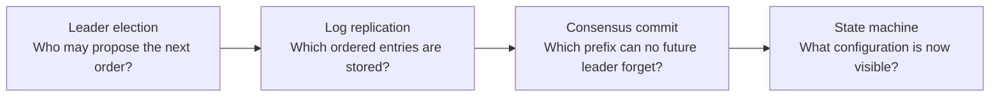
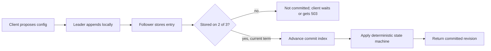
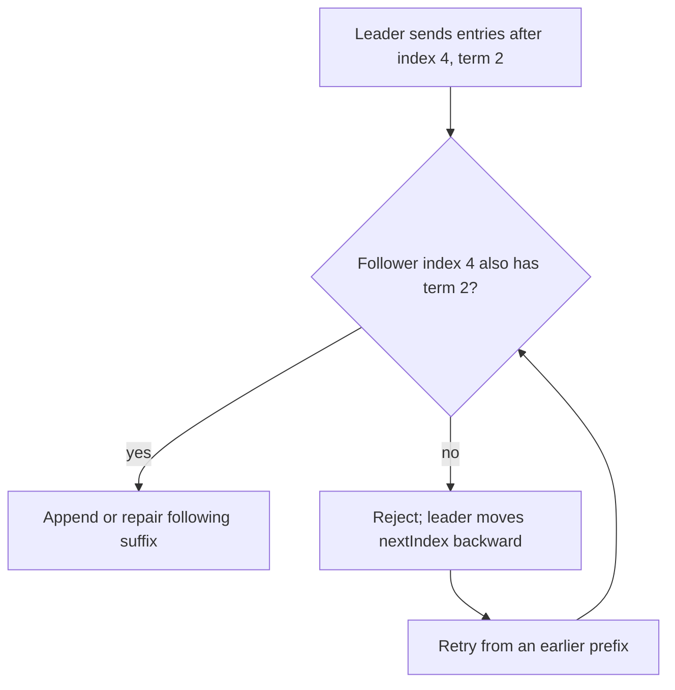
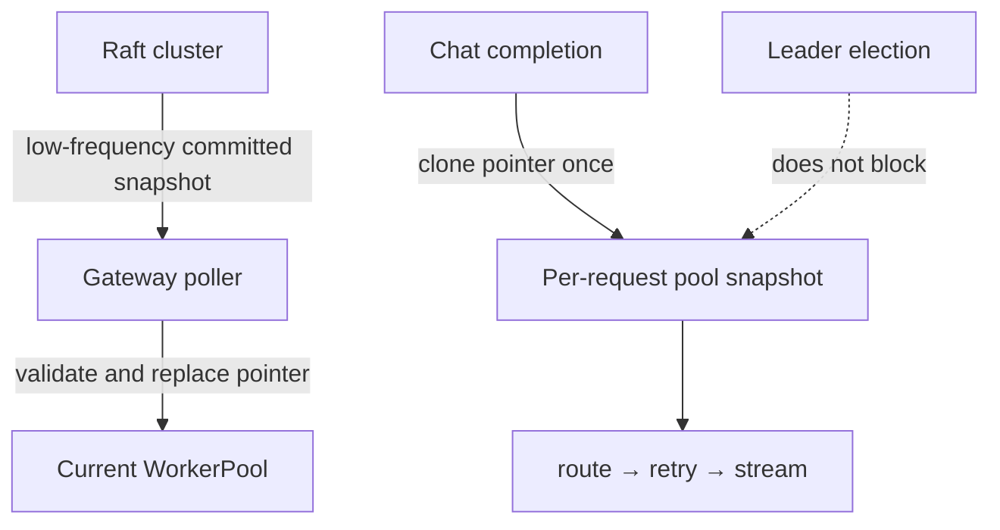
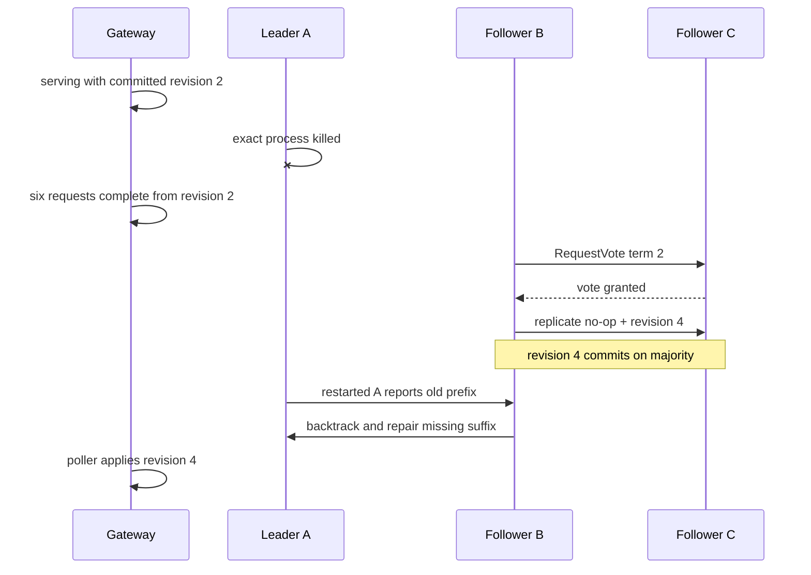

# Phase 11 learning guide: leader election and Raft consensus

## The new behavior in one sentence

Three InferLab control-plane nodes now elect one temporary leader, replicate one
ordered configuration log, replace failed leaders automatically, repair
restarted nodes, and let the gateway keep serving from its last committed
snapshot during elections.

## First separate two problems

Leader election and consensus are related but not identical:



- **Election** chooses a temporary coordinator.
- **Consensus** makes decisions survive that coordinator.

Electing a leader without replicating its decisions gives availability with data
loss. Replicating data without a single ordering authority gives conflicting
histories.

## Mental model: three clerks and numbered logbooks

Three railway clerks each keep the same numbered timetable log.

1. Normally one clerk is chairperson and proposes the next line.
2. Every chairperson era has a term number.
3. If announcements stop, clerks wait different random times before asking for
   votes.
4. A clerk becomes chairperson only with two of three votes.
5. The chairperson names the previous log line and term before sending new
   lines.
6. A clerk whose book does not match rejects the new suffix.
7. Once two books contain the current chairperson's line, the line is committed.
8. Trains keep using the last published timetable while the clerks elect a new
   chairperson.

The train system is the gateway data plane. The clerks are the control plane.

## Vocabulary

| Term | Plain meaning |
|---|---|
| Raft | The algorithm's name, not an acronym |
| Consensus | Nodes agree on one durable ordered history despite some failures |
| Node | One independent Raft process with its own disk state |
| Follower | Normal role; accepts a leader's replication and votes |
| Candidate | A follower whose election deadline expired and is requesting votes |
| Leader | The one node allowed to coordinate new log entries in a term |
| Term | Monotonically increasing election epoch |
| Election timeout | Silence duration after which a follower starts a campaign |
| Randomized timeout | Each node waits a different unpredictable duration, breaking symmetry |
| Heartbeat | Empty or ordinary `AppendEntries` proving the leader is active |
| RPC | **Remote Procedure Call**: one process sends a typed request to another |
| `RequestVote` | Candidate asks a peer for its one vote in a term |
| `AppendEntries` | Leader sends heartbeats, new log entries, and commit progress |
| Log | Ordered commands, each identified by index and term |
| Quorum / majority | More than half the cluster; two nodes in a three-node cluster |
| `prevLogIndex` / `prevLogTerm` | Fingerprint of the prefix before incoming entries |
| `nextIndex` | Leader's guess for the next entry a follower needs |
| `matchIndex` | Highest entry known stored on that follower |
| Commit index | Highest log position safe to apply |
| State machine | Deterministic function turning committed commands into current configuration |
| No-op | Log entry that changes no configuration but anchors a new leadership term |
| Split vote | Multiple candidates receive votes but nobody has a majority |
| Control plane | Slow-changing authoritative decisions |
| Data plane | High-frequency inference requests and token streams |

## How one leader is elected

```mermaid
sequenceDiagram
    participant A as Node A
    participant B as Node B
    participant C as Node C
    Note over A,B: no heartbeat arrives
    Note over A: A's random deadline expires first
    A->>A: become candidate; term 2; persist vote for A
    A->>B: RequestVote(term 2, last log term/index)
    A->>C: RequestVote(term 2, last log term/index)
    B->>B: has not voted; A's log is current
    B-->>A: yes
    C-->>A: yes
    A->>A: 3 votes ≥ majority 2
    A->>B: AppendEntries heartbeat
    A->>C: AppendEntries heartbeat
```

Why persist the vote before saying yes? If B replied yes, crashed, forgot, and
then voted C in the same term, A and C might both collect apparent majorities.

Why compare logs before voting? The winner must be able to preserve committed
history. A node missing newer entries is not eligible merely because its timer
expired first.

## Majority overlap with actual sets

For nodes A, B, C, the only two-node majorities are:

```text
{A, B}
{A, C}
{B, C}
```

Pick any two rows: at least one letter appears in both. If that node votes only
once per term, two candidates cannot both win that term.

Notice what the proof does **not** say: it does not say there is always a leader.
With only one reachable node, safety requires no leader and no committed writes.

## How a command becomes visible



The words matter:

```text
append ≠ commit ≠ apply
```

If a leader appends locally and dies before replication, a future leader may
delete that uncommitted suffix. If it returned success too early, the client
would believe a decision existed when it did not.

## Why `prevLogIndex` and `prevLogTerm` both exist

An index alone says “line 4 exists.” It does not prove both logbooks contain the
same line 4.



Term plus index fingerprints a prefix. Once a matching point is found, the
leader's suffix becomes authoritative, but only uncommitted conflicting entries
may be removed.

## The current-term rule

Suppose a new term-3 leader discovers that an old term-2 entry exists on two
nodes. Raft does not immediately count that old entry as committed. The leader
first replicates and commits a term-3 no-op or command. Because logs are ordered,
committing position 5 also commits positions 1–4.

This seemingly picky rule prevents a rare history where “stored on a majority”
is not yet enough to stop an older entry being replaced. The code isolates the
calculation in `highest_committable_index`, and a unit test proves:

```text
old-term entry on 2/3 → no direct commit
current-term entry on 2/3 → commit it and every earlier index
```

## Follow the retained six-entry log

| Index | Term | Command | Meaning |
|---:|---:|---|---|
| 1 | 1 | no-op | Node A anchors term 1 |
| 2 | 1 | round-robin config | First authoritative routing snapshot |
| 3 | 2 | no-op | Node B anchors leadership after A is killed |
| 4 | 2 | least-in-flight config | Majority progresses with A down |
| 5 | 3 | no-op | Restarted A wins after B is killed |
| 6 | 3 | weighted 3:1:1 config | Final snapshot, later repaired onto B |

All three final `state.json` files contain this identical log and
`commit_index=6`.

## Control plane versus request path



The gateway never asks “who is leader?” while serving a request. Its poller may
temporarily see no node or an older follower snapshot. The applied revision can
only increase, so stale reads cannot roll it backward.

An in-flight request owns an `Arc` to one worker pool. If revision 6 arrives
mid-stream, future requests use revision 6 while the stream safely finishes on
its earlier snapshot.

## Read the retained timeline


Read each lane left to right:

- green circles are elected leaders;
- red vertical lines are exact child-PID kills;
- blue circles are majority commits;
- purple circles are process starts or restarts;
- orange circles are repaired log suffixes; and
- cyan squares are routing revisions applied by the gateway.

The first re-election takes 364.540 ms because node B's configured randomized
range is 300–360 ms plus observation and RPC time. The second takes 243.314 ms
because restarted A uses the shorter 180–240 ms range.

## What happened during each failure



The same pattern repeats after B is killed. There is a window with no leader,
but there is never a window with no gateway configuration.

## What each source file owns

| File | Responsibility |
|---|---|
| `control-plane/src/model.rs` | Roles, commands, log entries, RPCs, API snapshots, validation |
| `control-plane/src/storage.rs` | Atomic synced persistent state and event journal |
| `control-plane/src/raft.rs` | Elections, voting, replication, repair, commit, application |
| `control-plane/src/lib.rs` | Raft RPC and control API routes with structured errors |
| `control-plane/src/main.rs` | Node identity, peer topology, timeouts, listener |
| `gateway/src/main.rs` | Fetch and poll committed snapshots; rebuild worker pools |
| `gateway/src/lib.rs` | Atomic pool replacement and per-request snapshot ownership |
| `benchmarks/raft_probe.py` | Leader observation, writes, convergence, gateway requests |
| `benchmarks/analyze_raft.py` | Merge persisted events, failures, state, and gateway evidence |
| `benchmarks/check_raft.py` | Seventeen falsifiable release assertions |
| `benchmarks/render_raft_svg.py` | Deterministic timeline from retained events |
| `scripts/proof-v0.6.sh` | Own processes, kill leaders, restart nodes, retain evidence |

## What you can do with it

Start three terminals after building the workspace.

Node A:

```bash
INFERLAB_RAFT_NODE_ID=node-a \
INFERLAB_RAFT_BIND=127.0.0.1:9811 \
INFERLAB_RAFT_PEERS='node-b=http://127.0.0.1:9812,node-c=http://127.0.0.1:9813' \
INFERLAB_RAFT_DATA_DIR=./data/node-a \
  cargo run -p control-plane
```

Start B and C with their own IDs, ports, peer lists, and data directories. Then
inspect roles:

```bash
curl -sS http://127.0.0.1:9811/v1/control/status
curl -sS http://127.0.0.1:9812/v1/control/status
curl -sS http://127.0.0.1:9813/v1/control/status
```

Send this only to the node reporting `"role":"leader"`:

```bash
curl -sS -X PUT http://127.0.0.1:LEADER_PORT/v1/control/config \
  -H 'content-type: application/json' \
  -d '{
    "routing_policy":"round-robin",
    "workers":[
      {"id":"worker-a","base_url":"http://127.0.0.1:9001","weight":1},
      {"id":"worker-b","base_url":"http://127.0.0.1:9002","weight":1},
      {"id":"worker-c","base_url":"http://127.0.0.1:9003","weight":1}
    ]
  }'
```

Experiments worth trying:

1. Send the write to a follower and inspect `409 not_leader`.
2. Stop the leader and watch terms/roles until a replacement appears.
3. Stop a follower and verify the two-node majority still commits.
4. Stop two nodes and observe write unavailability without unsafe commit.
5. Restart an old node with its original data directory and watch log repair.
6. Compare `state.json` across nodes after convergence.
7. Start a gateway with all three control URLs, kill the leader, and keep
   sending completions.
8. Give every node the same narrow timeout range and observe split votes.

The complete automated experiment is:

```bash
./scripts/proof-v0.6.sh
```

## Why not use an existing system?

For production, etcd or Consul would often be the better answer. InferLab's
purpose here is to make the hidden guarantees inspectable:

- when a vote becomes durable;
- why majority sets overlap;
- how a leader proves a log prefix;
- why copied is not committed;
- when state becomes visible; and
- why request serving should not wait for consensus.

After those are understood, choosing a mature implementation becomes an
informed engineering trade rather than magic.

## What the result taught us

The first important observation is that an election outage is not necessarily a
serving outage. All 12 requests issued across the two leaderless windows
succeeded because the gateway retained revisions 2 and 4.

The second is that recovery means **repair**, not merely process health.
Restarted nodes first replayed their older durable state, rejected a mismatching
prefix, then accepted the current leader's suffix. A green health endpoint alone
would not prove convergence.

The third is that configuration changes affected real behavior: after revision
6, ten gateway requests followed the committed 3:1:1 weights exactly as
6:2:2.

## What this still cannot prove

- safety under arbitrary asymmetric network partitions;
- linearizable reads from followers;
- availability with fewer than two nodes;
- cluster membership changes;
- snapshots, compaction, or very long logs;
- efficient repair of a follower thousands of entries behind;
- request deduplication after an ambiguous client timeout;
- authenticated operators or encrypted node traffic;
- many gateways updating concurrently;
- batch metadata consensus; or
- production performance and power-loss behavior on other filesystems.

These limitations define the boundary between this educational Raft core and a
production consensus library.

## Read in this order

1. `control-plane/src/model.rs`
2. vote and append handlers in `control-plane/src/raft.rs`
3. `highest_committable_index` and its unit test
4. `replicate_round` in the same file
5. `control-plane/src/storage.rs`
6. gateway snapshot replacement in `gateway/src/main.rs` and `gateway/src/lib.rs`
7. `docs/results/v0.6/raw/raft-check.json`
8. the three final `node-*-state.json` files
9. RFC 0011 for the full trade-offs

## Check your understanding

Why can a gateway safely keep serving revision 4 during a term-3 election, but
must not accept a new configuration until a term-3 leader reaches a majority?
