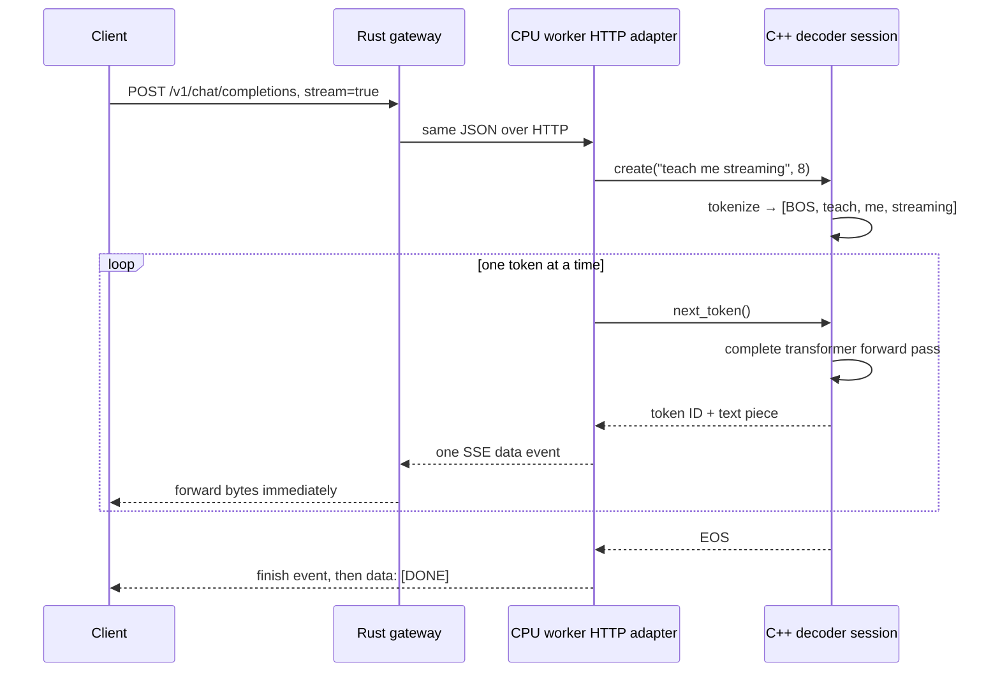
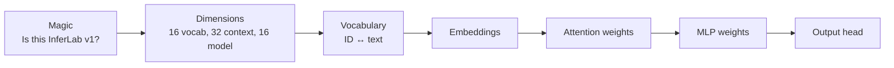
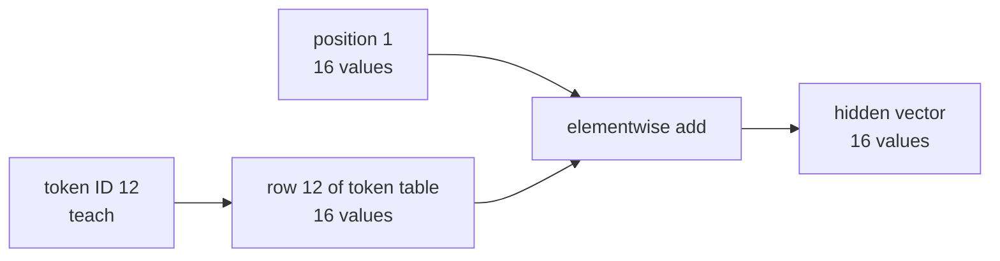
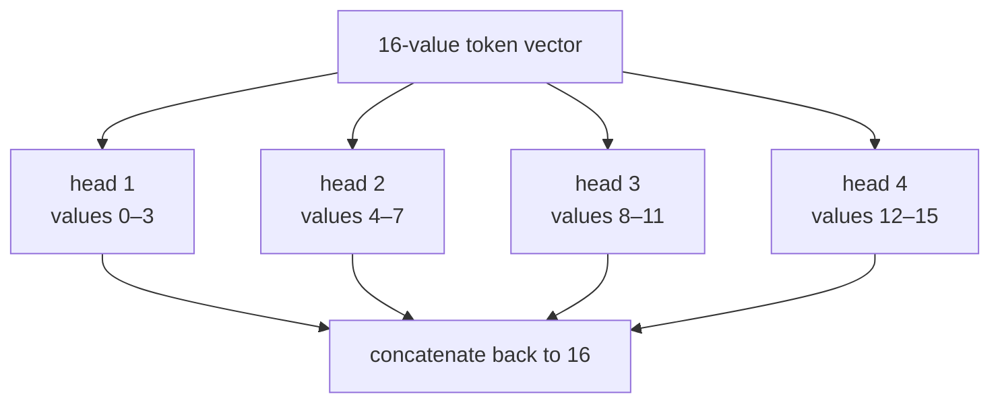
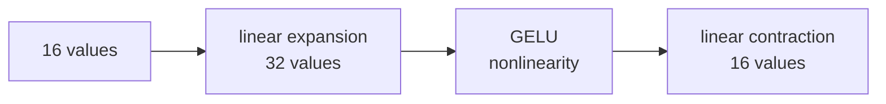
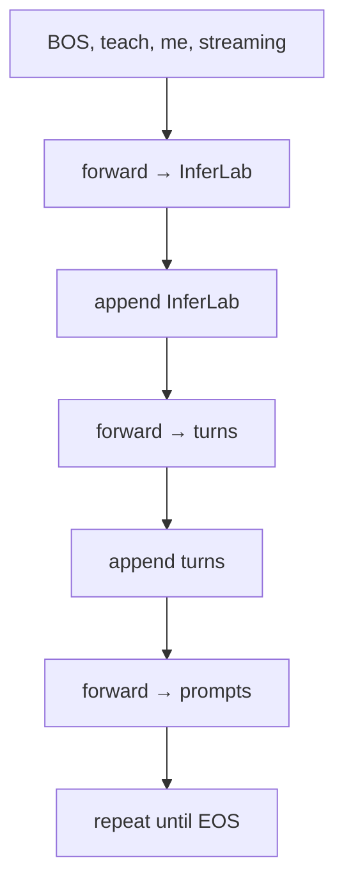
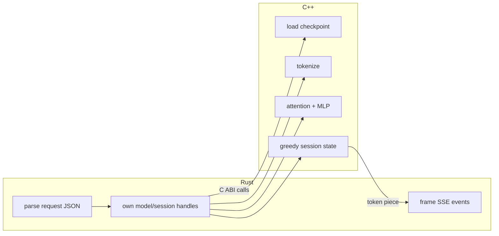
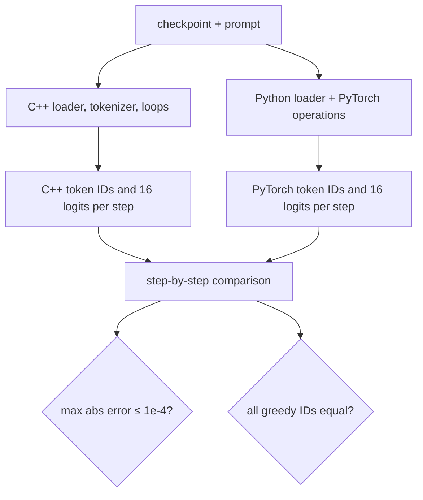

# Phase 12 learning guide: how a decoder produces one token

## The new behavior in one sentence

An InferLab request can now travel through the existing gateway into a real C++
transformer, turn prompt words into token IDs, calculate next-token logits,
choose one greedy token at a time, and stream seven model-generated pieces back
to the client.

## First imagine the entire request



Nothing in the gateway knows how attention works. Nothing in the decoder knows
how the gateway chooses workers. The HTTP boundary lets each side own one
problem.

## Mental model: a tiny next-word machine

Imagine a clerk with:

1. a dictionary assigning each known word a number;
2. a table turning each number into 16 descriptive measurements;
3. a way to compare every earlier word with the current word;
4. a small transformation that mixes those measurements; and
5. a final scoreboard containing one score for every possible next word.

The highest score wins. The winning word is added to the page, and the clerk
runs the whole calculation again:

```text
prompt
prompt + token 1
prompt + token 1 + token 2
...
```

That repeated “predict, append, predict” loop is autoregressive generation.

## Vocabulary

| Term | Plain meaning |
|---|---|
| Model | A calculation plus learned or constructed numerical parameters |
| Parameter / weight | A stored number used by the calculation |
| Checkpoint | On-disk file containing model dimensions, vocabulary, and weights |
| FP32 | 32-bit floating-point number; four bytes per value |
| Tensor | A rectangular collection of numbers with one or more dimensions |
| Shape | Size along each tensor dimension, such as `T × 16` |
| Scalar | One number |
| Vector | One-dimensional tensor |
| Matrix | Two-dimensional tensor |
| Token | One discrete model symbol, here usually a word or punctuation mark |
| Vocabulary | Complete token-to-ID table the model can emit |
| Token ID | Integer position of a token in the vocabulary |
| Tokenizer | Converts input text into token IDs |
| Detokenizer | Converts output token IDs into text pieces |
| `<bos>` | Beginning-of-sequence marker |
| `<eos>` | End-of-sequence marker; stops generation |
| `<unk>` | Unknown token used for an out-of-vocabulary word |
| Context | Token prefix visible to the current forward pass |
| Context length | Maximum number of visible tokens |
| Embedding | Dense vector representing a token or position |
| Position embedding | Vector telling the model where a token sits in the sequence |
| Forward pass | One calculation from input IDs to output logits |
| Decoder | Autoregressive transformer that predicts the next token from earlier tokens |
| Layer | One attention block plus one feed-forward block |
| Layer normalization | Rescales each token vector to a stable numerical range |
| Residual connection | Adds a block's input back to its output |
| Attention | Content-dependent weighted lookup over visible token representations |
| Query (Q) | What the current token is looking for |
| Key (K) | What each visible token advertises |
| Value (V) | Information retrieved when a key is relevant |
| Attention head | One independent Q/K/V comparison subspace |
| Causal mask | Rule preventing a position from reading future positions |
| Softmax | Turns arbitrary scores into non-negative weights summing to one |
| MLP / feed-forward network | Per-token linear expansion, nonlinearity, and contraction |
| GELU | Smooth nonlinear activation used between the two MLP projections |
| Logit | Raw score for one possible next token |
| Argmax | Index of the largest value |
| Greedy decoding | Always select argmax; no randomness |
| Autoregressive | Generated output becomes input for the next step |
| Oracle | Independent implementation treated as the correctness reference |
| Tolerance | Maximum permitted numeric difference |
| FFI | **Foreign Function Interface** between languages |
| ABI | **Application Binary Interface**: calling and memory rules across that boundary |
| C ABI | Stable function-call convention Rust and C++ can both expose |
| Opaque pointer | Handle whose internal C++ type Rust does not inspect |
| SSE | **Server-Sent Events**, the text framing used for streamed chunks |
| TTFT | **Time To First Token**, client wait until first content token |

## The tiny checkpoint

The model is intentionally small enough to draw:

```text
16 vocabulary tokens
32 maximum context tokens
16 numbers per token representation
4 attention heads × 4 numbers per head
32-number MLP middle
1 decoder layer
3,232 FP32 parameters
13,111 checkpoint bytes
```

The checkpoint begins with identity and dimensions, then its dictionary, then
tensors in a fixed order:



Why store dimensions in the file? Reading 256 floats is meaningless unless the
loader knows whether they form `16 × 16`, `8 × 32`, or another shape.

Why reject trailing bytes? Accepting an unexplained suffix could hide a format
mismatch or partially upgraded model.

## Step 1: text becomes token IDs

For this checkpoint:

```text
"teach me streaming"
        ↓ tokenizer
[1, 12, 13, 14]
 ↑
 <bos>
```

Known words have their own IDs. An unknown prompt:

```text
"explain a dragon"
        ↓
[1, 3, 3, 3]
```

This tokenizer is educational. Production tokenizers break words into reusable
subword or byte pieces so unusual words do not all collapse to `<unk>`.

The C++ and Python tokenizers are separate code. The proof compares their ID
lists before comparing model math, because different input IDs make every later
number incomparable.

## Step 2: IDs become vectors

An integer ID has no useful geometry. An embedding table maps it to 16 numbers:



Token embedding answers “which symbol is this?” Position embedding answers
“where is it?” Their sum lets two identical tokens at different positions behave
differently.

For `T` tokens, the hidden-state shape is `T × 16`.

## Step 3: layer normalization stabilizes each row

For each 16-value token vector:

1. compute its mean;
2. subtract that mean;
3. compute population variance;
4. divide by `sqrt(variance + 1e-5)`; and
5. apply stored scale and bias values.

The epsilon prevents division by zero when values are identical.

Layer normalization acts across features of one token, not across different
requests or sequence positions. That distinction matters later when batching
multiple sequences.

## Step 4: attention asks, matches, and retrieves

The normalized vector is multiplied by three different matrices:

```text
hidden × Wq = query
hidden × Wk = key
hidden × Wv = value
```

Use a library analogy:

- query: “I need a book about distributed agreement”;
- key: “this shelf contains consensus books”;
- value: the actual book contents.

Query-key similarity decides how much of each value to retrieve.

### Why four heads?

The 16-value representation is split into four groups of four. Each head can
learn a different relationship while remaining cheap:



“Four heads” does not mean four processes or four CPU threads. These are four
mathematical partitions.

### Score calculation

Each query and key pair produces:

```text
score = dot(query, key) / sqrt(head_dimension)
```

Dividing by `sqrt(4)` prevents dot products from growing too large as vector
width grows. Very large scores make softmax almost one-hot and gradients
unstable during training.

### Causal mask

Position 1 cannot use position 2:

```text
            key position
query       0   1   2   3
position 0  ✓   ×   ×   ×
position 1  ✓   ✓   ×   ×
position 2  ✓   ✓   ✓   ×
position 3  ✓   ✓   ✓   ✓
```

The `×` cells behave as negative infinity before softmax, giving them zero
weight.

### Stable softmax

For scores `[1001, 1002, 1003]`, directly calculating `exp(score)` can overflow.
Subtracting the maximum gives `[-2, -1, 0]`, which has the same softmax ratios
and safe exponentials.

Softmax weights sum to one. The attention result is their weighted sum of value
vectors.

## Step 5: residuals preserve a direct path

After attention:

```text
hidden = hidden + attention_output
```

After the MLP:

```text
hidden = hidden + mlp_output
```

A residual connection is like editing a document with tracked additions instead
of rewriting it from an empty page. A block can contribute a correction while
the original representation remains directly available.

Both operands must have the same shape. That is why attention and MLP project
back to dimension 16.

## Step 6: the MLP transforms each token independently



Attention mixes information across token positions. The MLP transforms the
features inside each position. Without a nonlinear activation, two consecutive
linear transformations would collapse into one linear transformation and add
less expressive power.

## Step 7: final hidden state becomes logits

Only the final sequence position predicts the next token. A `16 × 16`
language-model head produces 16 logits:

```text
<pad>      -1.03
<bos>      -1.01
<eos>      -1.02
<unk>      -1.04
InferLab   15.48  ← largest
turns      -0.99
...
```

These illustrative values are scores, not probabilities. Greedy decoding needs
only their ordering, so it selects the argmax ID.

v0.7 deliberately does not run softmax over final logits. Softmax is required
for sampling probabilities later, but argmax of logits equals argmax of their
softmax.

## Step 8: selected output becomes new input



The retained token IDs are:

| Step | ID | Token | Streamed piece |
|---:|---:|---|---|
| 1 | 4 | `InferLab` | `InferLab` |
| 2 | 5 | `turns` | ` turns` |
| 3 | 6 | `prompts` | ` prompts` |
| 4 | 7 | `into` | ` into` |
| 5 | 8 | `real` | ` real` |
| 6 | 9 | `tokens` | ` tokens` |
| 7 | 10 | `.` | `.` |
| 8 | 2 | `<eos>` | nothing; stop |

Leading spaces belong to detokenization pieces. Concatenating the seven visible
pieces produces exactly:

```text
InferLab turns prompts into real tokens.
```

## Why the model says the same sentence

The checkpoint is not trained. Its generator creates small deterministic
embedding, attention, and MLP weights, then gives the final output head strong
columns for the readable transition sequence.

That makes two things true:

- the complete transformer calculation still runs and affects logits; and
- the protocol demonstration produces inspectable text instead of random
  control characters.

It does **not** mean the model understands arbitrary prompts. Most unknown words
become the same `<unk>` token, and several prompts intentionally reach the same
transition.

## How Rust and C++ share responsibility



FFI is a place where compiler guarantees weaken. Rust cannot see the internal
C++ type behind `void*`, and C++ cannot enforce Rust lifetimes. The wrapper
therefore makes two narrow ownership promises:

1. a loaded model pointer is immutable, reference-counted, and freed once; and
2. a session pointer has one owner and is freed once.

C++ catches every exception before it reaches Rust and copies error text into a
bounded caller-owned buffer.

## Why use a Rust HTTP adapter?

The learning target is the decoder, not HTTP parsing. Axum already provides:

- JSON request extraction;
- status codes and headers;
- correct SSE framing;
- async socket lifecycle; and
- compatibility with the proven gateway.

Writing or vendoring another HTTP implementation would increase code without
making attention clearer. C++ still owns every operation that changes model
output.

## How the PyTorch oracle catches mistakes

The C++ and Python paths share only the checkpoint bytes and prompt:



Why compare all logits? Suppose the correct top scores are `8.0` and `7.9`.
Broken code might produce `80` and `1` and still select the same token. Final
text alone would pass while the model distribution was unusable.

Why allow `1e-4` instead of exact equality? Floating-point addition is not
associative. PyTorch and a C++ loop may add the same products in a different
order, causing tiny final-bit differences.

Why require exact token IDs? A numeric difference that changes argmax changes
user-visible generation and every later prefix.

## Read the retained chart


The top-left panel plots maximum absolute logit error for all eight generation
steps and three prompts. Every point is below `4.20e-6`; the red acceptance line
is `1e-4`.

The latency panel reports warm median generation for this 3,232-parameter
fixture: an average 50.222 µs for direct C++ loops and 438.208 µs for the
PyTorch oracle. Do not generalize that ratio. At this scale, framework dispatch
and Python overhead dominate; useful large-model kernels have very different
behavior.

The bottom lane comes from an actual streaming request through the gateway. With
12 ms deliberate pacing:

- first content arrived at 18.912 ms;
- seven content tokens spanned 83.462 ms;
- timestamps strictly increased; and
- a stop chunk and `[DONE]` followed.

The pacing proves the network path forwards increments; it is not claimed as
inference latency.

## What each file owns

| File | Responsibility |
|---|---|
| `models/tiny-inferlab-v1.bin` | Explicit committed educational checkpoint |
| `models/tiny-inferlab-v1.json` | Dimensions, tensor order, vocabulary, SHA-256 |
| `oracle/generate_tiny_model.py` | Deterministic checkpoint generator |
| `worker/cpp/inferlab_runtime.cpp` | Loader, tokenizer, tensor math, attention, MLP, generation |
| `worker/cpp/inferlab_runtime.h` | Narrow C ABI |
| `worker/build.rs` | Compile C++20 and link the static runtime into Rust |
| `worker/src/lib.rs` | Safe-ish ownership wrapper, HTTP JSON, SSE, errors |
| `worker/src/main.rs` | Model path, worker ID, bind, pacing configuration |
| `worker/src/bin/inferlab-cpu-cli.rs` | Direct C++ trace and warm timing tool |
| `worker/tests/http.rs` | Real HTTP non-stream, SSE, and unsupported sampling tests |
| `oracle/torch_reference.py` | Independent checkpoint parser and PyTorch forward pass |
| `benchmarks/compare_cpu_decoder.py` | Full-logit and token comparison |
| `benchmarks/cpu_stream_probe.py` | Timestamp gateway SSE and check non-stream response |
| `benchmarks/check_cpu_decoder.py` | Eighteen falsifiable release assertions |
| `benchmarks/render_cpu_decoder_svg.py` | Chart generated only from raw evidence |
| `scripts/proof-v0.7.sh` | Build, regenerate, compare, serve, probe, check, render |

## Follow one request in code

Read in this order:

1. `chat_completions` in `worker/src/lib.rs`;
2. `Model::session` and `Session::next_token` in that file;
3. `inferlab_session_next` in `worker/cpp/inferlab_runtime.cpp`;
4. `Model::forward` in the same C++ file;
5. `streaming_response` back in `worker/src/lib.rs`;
6. `proxy_chat_completions` in `gateway/src/lib.rs`; and
7. `TinyDecoder.forward` in `oracle/torch_reference.py` beside the C++ forward
   pass.

The useful reading question is always: “who owns this state, what is its shape,
and which invariant is checked here?”

## Run it yourself

Build and test:

```bash
cargo test -p cpu-worker
```

Start the real worker:

```bash
INFERLAB_CPU_WORKER_ID=cpu-worker-a \
INFERLAB_CPU_BIND=127.0.0.1:9101 \
INFERLAB_MODEL_PATH=models/tiny-inferlab-v1.bin \
INFERLAB_CPU_TOKEN_DELAY_MS=50 \
  cargo run -p cpu-worker
```

Start the existing gateway:

```bash
INFERLAB_WORKERS='cpu-worker-a=http://127.0.0.1:9101' \
  cargo run -p gateway
```

Stream real tokens:

```bash
curl -N http://127.0.0.1:8080/v1/chat/completions \
  -H 'content-type: application/json' \
  -d '{
    "model":"inferlab-tiny",
    "stream":true,
    "temperature":0,
    "max_tokens":8,
    "messages":[{"role":"user","content":"teach me streaming"}]
  }'
```

Inspect the C++ trace without HTTP:

```bash
cargo run -p cpu-worker --bin inferlab-cpu-cli -- \
  --model models/tiny-inferlab-v1.bin \
  --prompt "teach me streaming" \
  --max-tokens 8 \
  --repetitions 1
```

Run the complete oracle and gateway proof:

```bash
INFERLAB_ORACLE_PYTHON=.tools/v0.7-python/bin/python \
  ./scripts/proof-v0.7.sh
```

## Experiments worth trying

1. Set `max_tokens` to 3. The response should be
   `InferLab turns prompts` with finish reason `length`.
2. Send an unknown sentence. Inspect how several words become token ID 3.
3. Set `temperature` to `0.7`. The worker should reject it before SSE begins
   because sampling belongs to v0.10.
4. Change `INFERLAB_CPU_TOKEN_DELAY_MS` from 0 to 100 and watch chunk timing
   without changing token IDs.
5. Corrupt one byte in a temporary copy of the checkpoint header and inspect
   the startup error.
6. Change one output-head transition in the generator, regenerate a temporary
   model, and predict which token changes.
7. Change only the C++ GELU constant and run parity. Find the first step whose
   error increases.
8. Temporarily tighten parity tolerance from `1e-4` to `1e-7` and observe why a
   correct FP32 implementation can fail an unrealistic limit.
9. Add prompt words until the 32-token context truncates. Compare C++ and
   PyTorch token IDs.
10. Cancel a long-paced `curl` stream. Confirm the gateway releases its worker
    lease, then notice the current limitation: cancellation cannot interrupt a
    C++ forward pass already running.

Use temporary files for corruption experiments; do not overwrite the committed
checkpoint.

## What the result teaches

First, protocol replacement worked. The gateway that previously forwarded fake
text forwarded real decoder tokens without a model-specific code change.

Second, “the sentence looks right” is weaker than numeric parity. The retained
proof compares 384 logit values and found a worst difference of
`4.1975708e-06`, while all 24 greedy decisions across three prompts matched.

Third, a tiny reference makes architectural flaws visible. The current session
recomputes every previous token at every step. That waste is hard to notice in
an 84-microsecond generation and enormous in a real model. v0.8 can now measure
KV cache and continuous batching against an exact token oracle.

Fourth, benchmark interpretation matters. C++ being faster than PyTorch on a
3,232-parameter fixture does not establish a useful-model speedup. The valid
claim is correctness plus an executable latency measurement method.

## Why not jump to a real public model?

A public checkpoint will eventually be useful, but it would combine:

- tokenizer library integration;
- checkpoint conversion;
- a much larger output head;
- many repeated layers;
- memory and startup costs;
- potential unsupported operations; and
- harder debugging when the first logit diverges.

This milestone first establishes the shape ledger, ownership boundary, oracle,
and proof. Scaling those responsibilities is now a controlled next step rather
than a simultaneous mystery.

## What v0.7 still cannot do

- answer general questions or represent arbitrary language well;
- sample with temperature, top-k, or top-p;
- reuse keys and values from earlier tokens;
- batch multiple sequences into one forward schedule;
- exploit SIMD, BLAS, multiple CPU threads, or a GPU;
- load GPT-2, SafeTensors, GGUF, ONNX, or Hugging Face tokenizers;
- run more than one model or hot-reload a model;
- interrupt synchronous C++ compute after client cancellation;
- prove broad randomized-shape or Unicode correctness;
- claim production latency, throughput, memory efficiency, or quality.

These were the v0.7 boundaries, not hidden defects. v0.8 now tackles the first
performance architecture change—KV cache plus continuous batching—while using
these v0.7 tokens and logits as the correctness oracle. Continue with the
[phase 13 learning guide](phase-13-kv-cache-and-continuous-batching.md).

## Check your understanding

Why is “C++ and PyTorch generated the same sentence” insufficient evidence, and
what additional bug can full-logit comparison expose before it changes argmax?
