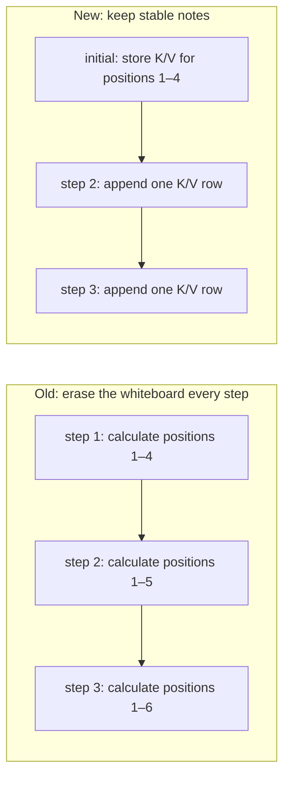
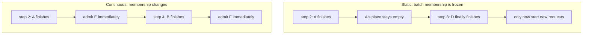
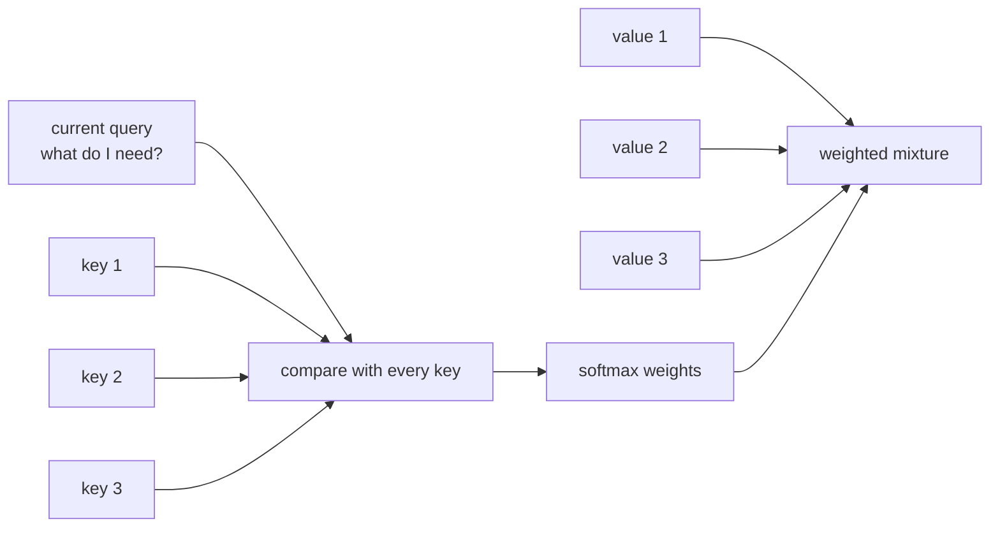
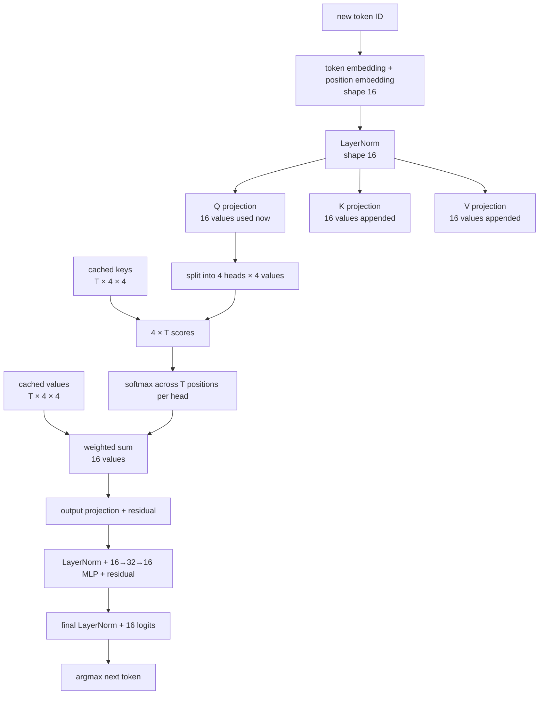
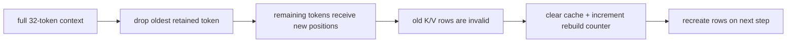
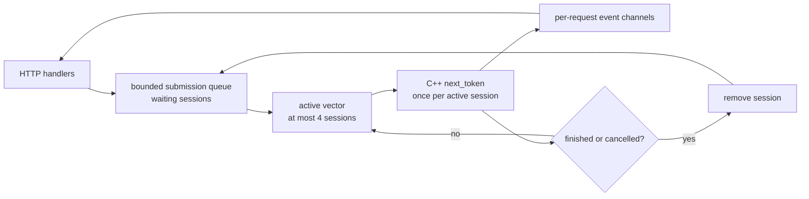
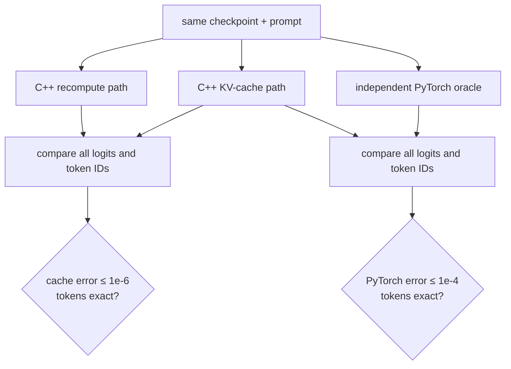
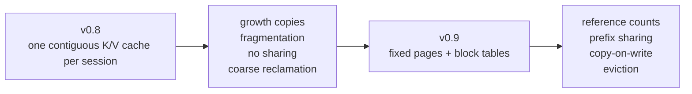

# Phase 13 learning guide: remember the past and keep every slot busy

## The new behavior in one sentence

InferLab now remembers every token's attention keys and values, advances up to
four independent requests in one central schedule, removes a request as soon as
it finishes, and immediately gives the free slot to waiting work.

## First imagine the whole request

```mermaid
sequenceDiagram
    participant C as Client
    participant G as Gateway
    participant H as Worker HTTP handler
    participant S as Scheduler
    participant D as C++ session
    C->>G: chat completion request
    G->>H: forward unchanged JSON
    H->>D: create session for this prompt
    H->>S: submit session to bounded queue
    S->>S: move session into a free active slot
    loop one scheduler batch at a time
        S->>D: calculate one next token
        D->>D: reuse old K/V + append new K/V
        D-->>S: token or finished
        S-->>H: request-specific event
        S->>S: remove finished sessions; admit waiting sessions
    end
    H-->>G: JSON or SSE token chunks
    G-->>C: response
```

There are two different kinds of remembering here:

- the **decoder session** remembers numeric K/V rows from earlier tokens; and
- the **scheduler** remembers which requests are queued, active, or finished.

The gateway still knows neither detail. It only forwards the established HTTP
contract.

## The two wastes v0.8 removes

### Waste 1: redoing old token math

Suppose the prompt contains four tokens and generation takes eight steps. The
old decoder projects:

```text
4 + 5 + 6 + 7 + 8 + 9 + 10 + 11 = 60 token positions
```

Most positions are repeats. The cached path projects K/V once for the eleven
distinct positions and creates only eight current-token queries.



### Waste 2: reserving a finished request's place

Suppose four requests need 2, 4, 6, and 8 steps. A static batch keeps all four
places until the eight-step request ends. Continuous batching reassigns each
place when its owner finishes.



The first optimization is model math. The second is resource scheduling. One
can be correct while the other is wrong, which is why the proof measures them
separately.

## Vocabulary

| Term | Plain meaning |
|---|---|
| Sequence | One ordered list of prompt and generated token IDs |
| Prefix / context | Tokens already visible when predicting the next token |
| Context length | Maximum number of visible tokens, 32 in this model |
| Position | A token's index inside the current context |
| Decode step | One next-token prediction after the prompt exists |
| Prefill | Initial work that turns prompt positions into reusable inference state |
| Query (Q) | Current token vector asking which earlier information matters |
| Key (K) | Vector describing what one visible token offers for matching |
| Value (V) | Vector containing the information retrieved from that token |
| Projection | Matrix multiplication that converts a hidden vector into Q, K, or V |
| Attention score | Dot product between one query and one key, scaled by head size |
| Attention head | One independent slice of Q/K/V comparison dimensions |
| Softmax | Converts attention scores into non-negative weights summing to one |
| KV cache | Stored K and V rows for tokens already processed |
| Cache row | One token position's `D` K values or `D` V values |
| Cache rebuild | Discard and recreate all rows because old positions are no longer valid |
| FP32 | Four-byte floating-point number used for every cached value here |
| Contiguous memory | Entries stored next to one another in one growable array |
| Session | Mutable per-request C++ state: context, limits, counters, K cache, and V cache |
| Scheduler | Component deciding which sessions advance next |
| Submission queue | Waiting sessions not yet assigned an active slot |
| Bounded queue | Queue with a fixed maximum, preventing unlimited memory growth |
| Active slot | One of the configured places allowed to advance in a scheduler batch |
| Batch | Set of active sessions selected for the current scheduling iteration |
| Scheduler iteration / tick | One pass that advances each active session at most once |
| Static batching | Freeze membership until every sequence in the batch finishes |
| Continuous batching | Re-form membership after each iteration |
| Backfill | Put waiting work into a slot just freed by completion or cancellation |
| Ragged batch | Batch whose sequences have different current lengths |
| Padding | Dummy positions sometimes added to make unequal sequences rectangular |
| Head-of-line blocking | Short work waits behind long work because of ordering or fixed grouping |
| Channel | In-process queue used to pass submissions or events between Rust tasks |
| Async task | Cooperatively scheduled Rust computation that can wait without owning a thread |
| Backpressure | Refuse or delay new work when bounded capacity is exhausted |
| Cancellation | Stop retaining work after the client no longer receives its response |
| Throughput | Completed requests or tokens per second |
| Latency | Time one request spends from submission to completion |
| p50 | Median: half the measured requests are at or below this latency |
| p95 | Tail measure: 95% are at or below this latency |
| Slot utilization | Used active slot-iterations divided by available slot-iterations |
| SSE | Server-Sent Events: text framing used for streaming response chunks |
| FFI | Foreign Function Interface connecting safe Rust wrappers to C++ functions |
| Oracle | Independent calculation used to decide whether optimized output is correct |
| Work counter | Deterministic count of operations represented by the algorithm, independent of timing |

## Part 1: understand K, V, and why they can be remembered

Use a library desk analogy. The current reader writes a query: “Which earlier
note helps me now?” Every earlier note has:

- a key on its index card describing its topic; and
- a value containing its useful content.

The query is compared with all keys. Strong matches receive larger softmax
weights, and the corresponding values contribute more to the result.



When a new token is appended, earlier token IDs, positions, normalized hidden
vectors, keys, and values have not changed. Recalculating their K/V projections
cannot improve the result. Store them once.

The current query cannot be reused because the current token is different. The
attention scores cannot be reused because they contain that changing query.

## What one cached step actually does

For this one-layer model, model dimension `D=16` and four heads:



The session's `ensure_cache` operation compares context length with cached row
count. Missing positions are appended in order. Then `forward_cached` computes
only the last position's query and output path.

### Why this is called “prefill” and “decode”

Production serving usually divides inference into:

1. **prefill**: process the complete prompt and construct every layer's cache;
2. **decode**: append one generated token and calculate one next-token result.

v0.8 has the same logical phases but a tiny implementation. It lazily appends
initial prompt K/V rows when the first `next_token` call arrives. It does not
yet have a vectorized prompt-prefill kernel.

Because this fixture has only one layer, each K/V row comes directly from the
normalized embedding. A real multi-layer decoder needs a separate K/V cache at
every layer, after the previous layers have produced that layer's input.

## Follow cache growth by hand

The prompt `teach me streaming` becomes four IDs including `<bos>`. Each decode
step predicts a token. Before predicting step `n`, the previously generated
visible token is part of the context:

| Prediction | Context positions seen | Cached K rows | Cached V rows | New query rows |
|---:|---:|---:|---:|---:|
| 1 | 4 | 4 | 4 | 1 |
| 2 | 5 | 5 | 5 | 1 |
| 3 | 6 | 6 | 6 | 1 |
| 4 | 7 | 7 | 7 | 1 |
| 5 | 8 | 8 | 8 | 1 |
| 6 | 9 | 9 | 9 | 1 |
| 7 | 10 | 10 | 10 | 1 |
| 8, predicts EOS | 11 | 11 | 11 | 1 |

`<eos>` is selected by prediction eight, so it is not appended for a ninth
prediction. The final cache contains eleven positions.

### Calculate cache memory

Each position stores 16 K floats and 16 V floats:

```text
11 positions × (16 K + 16 V) × 4 bytes = 1,408 bytes
```

This micro-model's cache is tiny. Scale the same formula across thousands of
dimensions, dozens of layers, long contexts, and many users, and KV cache
becomes a server's dominant dynamic memory cost.

## Why the work is smaller but not constant

The newest query still compares with every visible key. If context length is
`T`, cached decode evaluates `heads × T` attention scores. That is linear in
`T`, not constant.

The old path also calculated score rows for earlier queries that do not produce
the next logit. Across the retained generation:

| Counted work | Recompute | KV cache | Reduction |
|---|---:|---:|---:|
| Query token projections | 60 | 8 | 86.7% |
| K/V token projections | 60 | 11 | 81.7% |
| Attention score elements | 1,104 | 240 | 78.3% |

The cache path spends 1,408 bytes to avoid that repeated work. “Faster” always
has a resource trade: here it is memory.

## Why changing positions invalidates this cache

At the 32-token context limit, InferLab keeps `<bos>` and newer tokens. Tokens
move to different position IDs. Since position embeddings contributed to K/V,
the old rows describe the wrong positions.



Rebuilding is correct and simple, not optimal. More advanced position schemes
and page tables can avoid some movement, but reusing position-dependent rows
silently would be wrong.

## Part 2: understand the continuous scheduler

Imagine four checkout counters. A static tour group reserves all counters until
its slowest shopper finishes. Continuous operation lets the next shopper use a
counter as soon as its current shopper leaves.

The worker has three collections:



The arrow from `Remove` back toward `Queue` means “fill the freed place from
the queue,” not “requeue the finished request.”

### One scheduler iteration

In plain pseudocode:

```text
if no request is active:
    wait for one submission

fill all free active slots from the queue
pay optional batch tick delay once

for each active session:
    calculate at most one next token
    send its event to that request's HTTP handler
    remove it if finished, failed, or cancelled

fill newly freed slots from the queue
repeat
```

Every active session receives one opportunity per iteration. Different context
lengths make individual C++ calls cost slightly different amounts, but no active
session receives a second token before its peers receive their first.

### Why one central scheduler instead of one loop per request?

One async loop per request could generate concurrent responses, but it would
hide the resource decision inside the runtime. A central scheduler makes these
questions explicit:

- How many sequences may be active?
- How many may wait?
- When does a finished place become reusable?
- How do we observe slot utilization?
- Where can a future vectorized batch kernel receive the active set?

The scheduler is the control point. It is not itself a faster matrix
multiplication.

## Read the backfill timeline

The retained chart is generated from raw counters, load responses, and the live
scheduler trace:


The first panel shows exact decoder work. Orange is the old recomputation
baseline; green is the cached path. Each row is normalized separately so 60
query projections and 1,104 scores can both be compared without hiding the
smaller unit.

The middle plots show an HTTP workload with token limits 2, 4, 6, and 8. Both
workers pay the same controlled 3 ms delay once per scheduler iteration:

| Concurrency 8 | One active slot | Four continuous slots |
|---|---:|---:|
| Request throughput | 37.843 requests/s | 135.318 requests/s |
| End-to-end p95 latency | 212.439 ms | 69.003 ms |

The throughput ratio is 3.576×. At concurrency 1, four configured slots cannot
help because only one request exists. As concurrency rises, the continuous
worker can share each paid iteration across active sessions.

The bottom chart aligns eight request lanes on scheduler-batch number. Green
circles mark admission, purple ticks mark token steps, and orange diamonds mark
completion. R2 and R4 finish early; R5 and R6 begin while R1 is still active.
That is backfill made visible.

The injected 3 ms tick is not model latency and does not pretend the C++ calls
are one GPU kernel. It is a declared shared per-batch cost that makes the
scheduler's capacity effect reproducible. Actual token math remains sequential
per session in v0.8.

## How correctness was protected

Optimization is accepted only after comparing all three paths:



Across three prompts, recompute and cache logits were bit-identical in the
retained run: maximum error `0`. Cache versus PyTorch retained the v0.7 maximum
error `4.1975708e-06`, and every greedy token still matched.

Why keep both comparisons? A bug copied into both C++ paths could make their
mutual comparison pass. The separately written PyTorch calculation protects
against that shared mistake.

## Request lifecycle in code

Follow one non-streaming request:

1. `chat_completions` in `worker/src/lib.rs` validates JSON.
2. `Model::session_with_mode` creates a C++ session in `kv-cache` mode.
3. `ContinuousBatchScheduler::submit` assigns a request ID and uses `try_send`
   on the bounded queue.
4. `run_scheduler` admits the session when an active place is free.
5. `Session::next_token` crosses the C ABI.
6. `inferlab_session_next` in `worker/cpp/inferlab_runtime.cpp` calls
   `ensure_cache` then `forward_cached`.
7. The scheduler sends `Token` events followed by `Finished`.
8. `collect_scheduled` joins pieces into the OpenAI-shaped final response.

For a streaming request, step 8 is replaced by `streaming_response`, which
turns each token event into one SSE data event and then emits `[DONE]`.

## What each v0.8 file owns

| File | Responsibility |
|---|---|
| `worker/cpp/inferlab_runtime.cpp` | Recompute oracle, K/V append, cached forward pass, cache counters |
| `worker/cpp/inferlab_runtime.h` | Decoder-mode session creation and metric accessors across C ABI |
| `worker/src/lib.rs` | Safe session wrapper, decoder mode, HTTP/SSE integration, generation metadata |
| `worker/src/scheduler.rs` | Bounded queue, active slots, per-iteration advance, backfill, cancellation, trace |
| `worker/src/main.rs` | Decoder mode, batch size, queue capacity, and tick configuration |
| `worker/tests/http.rs` | HTTP contract plus concurrent two-slot backfill test |
| `benchmarks/compare_kv_cache.py` | Recompute/cache full-logit comparison and work reductions |
| `benchmarks/continuous_batch_probe.py` | Mixed-length HTTP load at concurrency 1/2/4/8 and retained trace |
| `benchmarks/check_kv_batch.py` | Sixteen falsifiable release assertions |
| `benchmarks/render_kv_batch_svg.py` | Evidence chart generated only from retained JSON |
| `scripts/proof-v0.8.sh` | Build, compare, launch, load, stream, check, and render |

## Observe the worker yourself

Build and test:

```bash
cargo test -p cpu-worker
```

Start a four-slot cached worker:

```bash
INFERLAB_CPU_BIND=127.0.0.1:9101 \
INFERLAB_CPU_DECODER_MODE=kv-cache \
INFERLAB_CPU_MAX_BATCH_SIZE=4 \
INFERLAB_CPU_SCHEDULER_QUEUE_CAPACITY=64 \
INFERLAB_CPU_BATCH_TICK_MS=20 \
  cargo run -p cpu-worker
```

Inspect live scheduler state:

```bash
curl -s http://127.0.0.1:9101/internal/scheduler | jq
```

Useful fields are:

- `queued`: accepted but not yet active;
- `active`: currently occupying slots;
- `max_active`: highest observed active count;
- `batches`: completed scheduler iterations;
- `token_steps`: total calls that attempted one next token;
- `slots_used` and `slots_available`: utilization numerator and denominator;
- `trace`: recent admissions, tokens, completions, cancellations, and failures.

Compare direct decoder modes:

```bash
cargo run -p cpu-worker --bin inferlab-cpu-cli -- \
  --mode recompute --prompt "teach me streaming" --max-tokens 8

cargo run -p cpu-worker --bin inferlab-cpu-cli -- \
  --mode kv-cache --prompt "teach me streaming" --max-tokens 8
```

Both outputs contain `generation.metrics`. Token traces should match while work
counters and cache bytes differ.

Run the complete retained proof:

```bash
INFERLAB_ORACLE_PYTHON=.tools/v0.7-python/bin/python \
  ./scripts/proof-v0.8.sh
```

## Experiments worth trying

1. Run both CLI modes and compare only `query_tokens`, `kv_tokens`,
   `attention_score_elements`, and `peak_cache_bytes`.
2. Change `max_tokens` from 2 through 8. Predict cache rows before looking.
3. Start with `INFERLAB_CPU_MAX_BATCH_SIZE=1`, send eight concurrent requests,
   and inspect `max_active`.
4. Repeat with batch size 4. Find admissions that occur between earlier and
   later completion events.
5. Use mixed limits `2,8,2,8`. Watch short requests free places while long ones
   continue.
6. Set `INFERLAB_CPU_BATCH_TICK_MS=0`. Observe that scheduling remains correct
   even though this micro-model is too small for a stable capacity claim.
7. Set a tiny queue capacity and high concurrency. Confirm excess submissions
   receive HTTP 429 instead of growing memory without bound.
8. Start a paced streaming request, disconnect the client, and inspect the next
   `cancelled` trace event.
9. Use `INFERLAB_CPU_DECODER_MODE=recompute` with the same scheduler. Notice
   that batching policy and decoder optimization are independent switches.
10. Temporarily change one cached projection formula and run the proof. The
    recompute/cache comparison should locate the first divergent logit step.

Use temporary edits or a branch for failure experiments; restore the correct
implementation before retaining evidence.

## What v0.8 does not mean

### It does not mean attention became O(1)

The newest query still scans all visible keys and values. KV caching removes
repeated projections and old query rows; context-dependent attention remains.

### It does not mean four sessions are one matrix

The Rust scheduler groups four sessions conceptually, then calls the C++
decoder once per session. No padding, ragged tensor, fused operation, SIMD
batch, or GPU kernel exists yet.

### It does not mean cache memory is efficient

Each session owns growable contiguous vectors. There is no page allocator,
sharing, eviction, or copy-on-write. The optimization creates the memory problem
that v0.9 will study.

### It does not mean all requests are fairly scheduled

Every active request gets one step per iteration, but there are no priorities,
deadlines, preemption, cost prediction, or tenant quotas. `swap_remove` can
change active-vector order without starving a session.

### It does not mean the benchmark predicts a production GPU

The retained run uses one Apple ARM64 host, loopback HTTP, a 3,232-parameter
model, deterministic lengths, and an injected batch tick. Its valid claims are
correctness, observable backfill, and the measured behavior of that declared
experiment.

## Why v0.9 comes next

Ordinary KV caching answers: “Which old numbers should one session retain?” It
does not answer: “How should a server place, share, move, and reclaim those
numbers for thousands of sequences?”



The v0.8 cache establishes correct contents and ownership. v0.9 can change
their physical placement while using the same logits and token IDs as its
oracle.

## Check your understanding

A cached decode step still compares its current query with every earlier key.
Why does KV caching nevertheless reduce work, and why does continuous batching
solve a different problem from that reduction?
