# Phase 14 learning guide: give every KV row an address and an owner

## The new behavior in one sentence

InferLab now stores K/V rows in a bounded pool of fixed-size pages, lets
sessions reach those pages through block tables, safely shares exact prompt
prefixes, copies a shared partial tail before mutation, and routes repeat keys
back to the worker most likely to own their pages.

## First imagine the whole request

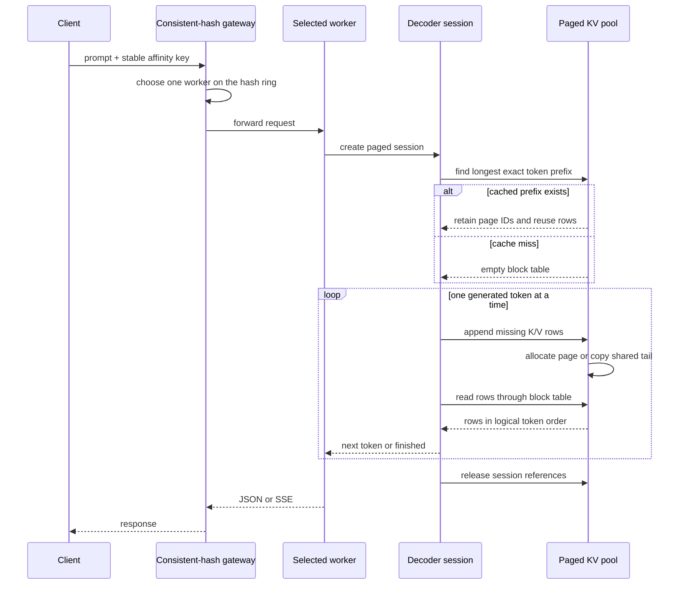

There are two ownership decisions:

- the **gateway** decides which worker owns the prefix key; and
- that worker's **page pool** decides which physical pages hold the rows and
  which sessions or cache entries retain them.

The gateway does not trust an affinity key as proof that cached numeric state
matches. The worker reuses state only after comparing exact token vectors.

## Why v0.8's correct cache was not enough

v0.8 gave every session private growable K and V vectors. That was the right
reference implementation because logical order and physical order were the
same:

```text
token position:  0    1    2    3    4    5
physical memory: 0    1    2    3    4    5
```

It could answer “what K/V rows are correct?” but not “how can a server bound,
share, and reclaim them?” There was no reusable unit smaller than a session's
whole private allocation.

Imagine a hotel that gives every guest an entire 32-room floor because 32 is
the maximum stay. Two guests using eight rooms each consume two floors. A
paged allocator instead gives out rooms in four-room groups as they are needed.
The same 64-room capacity then holds eight eight-room stays instead of two
maximum reservations.

The comparison is a declared reservation baseline. v0.8's vectors grew as
needed; they did not literally reserve 32 tokens. Their real limitation was the
lack of a global capacity and shareable ownership unit.

## Vocabulary

| Term | Plain meaning |
|---|---|
| KV row | One token's key values plus value values |
| Logical token position | Where a token appears in one sequence: 0, 1, 2, ... |
| Physical page | One fixed-size storage object inside the worker pool |
| Token slot | One row-sized place inside a physical page |
| Page size | Number of token slots in one page; four by default |
| Logical block | A page-sized region in a session's logical sequence |
| Block table | Per-session list mapping logical blocks to physical page IDs |
| Page ID | Integer naming one physical page in the pool |
| Free list | Page IDs currently owned by nobody and available for allocation |
| Allocation | Move a page from the free list into owned use |
| Reference | One declared ownership edge to a page |
| Reference count | Number of session and prefix-directory owners of a page |
| Retain | Add one reference before using a page |
| Release | Remove one reference; the final release frees the page |
| Prefix | Initial token sequence shared by one or more prompts |
| Prefix directory | Bounded worker-local map from exact token vectors to pages |
| Prefix hit | A new prompt begins with a directory entry's exact tokens |
| Longest-prefix match | Choose the matching entry with the most reusable tokens |
| Copy-on-write (COW) | Copy shared data only when one owner needs to mutate it |
| LRU | Least recently used; the directory entry reclaimed first |
| Eviction | Drop a directory reference so future requests no longer reuse it |
| Internal fragmentation | Unused tail slots inside allocated pages |
| External fragmentation | Free capacity split into unusable variable-size holes |
| Materialization / gather | Copy non-contiguous page rows into logical order |
| Capacity failure | Explicit rejection when no page can be allocated or evicted |
| Affinity key | Stable routing key intended to send repeat work to one worker |
| Consistent hash ring | Placement rule that limits key movement when workers change |
| Virtual node | Multiple hash-ring positions representing one real worker |
| C ABI / FFI | Narrow boundary connecting the Rust worker to the C++ runtime |

## Part 1: logical order is no longer physical order

With four tokens per page, position translation is:

```text
logical_block = token_position / 4
slot          = token_position % 4
page_id       = block_table[logical_block]
```

Suppose a session's block table is `[9, 2, 14]`:

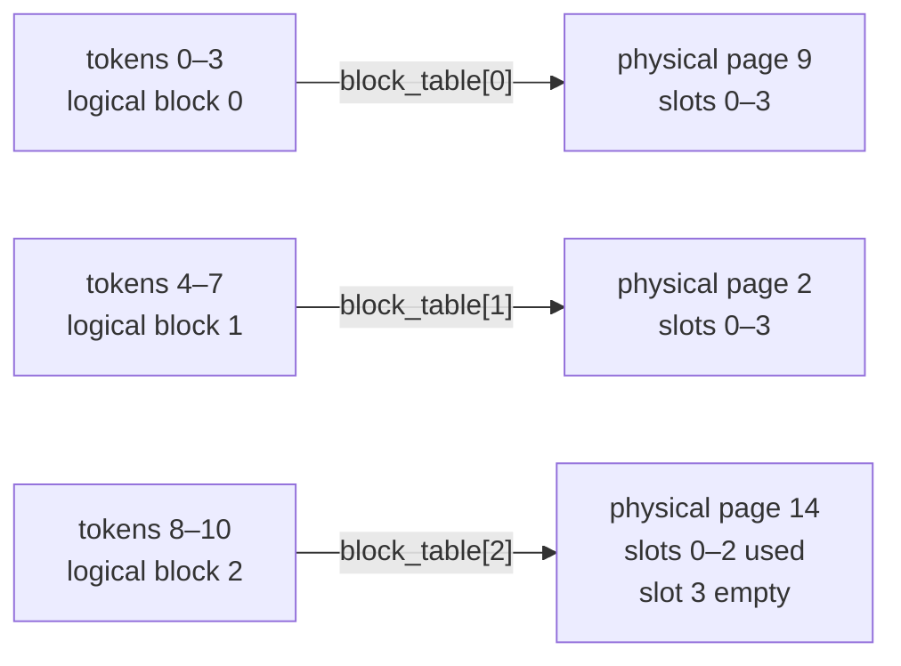

The session still sees eleven consecutive rows even though pages 9, 2, and 14
are scattered. Other sessions can release pages between them without creating
a hole in this logical sequence.

The retained eleven-token run has:

- logical data: `11 × 128 = 1,408` bytes;
- reserved pages: `3 × 512 = 1,536` bytes; and
- internal fragmentation: one empty slot, or 128 bytes.

## Part 2: fixed pages trade tail waste for simple reclamation

Every page has the same size, so any free page can satisfy any next-page
allocation. This removes external-fragmentation and coalescing decisions from
the allocator. The remaining cost is unused slots in each final partial page.

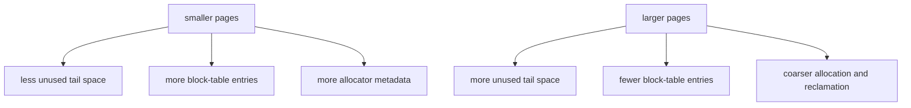

For the same six sequence lengths and the same total 64 token slots, retained
fragmentation rose as pages became larger:

| Tokens per page | Internal fragmentation |
|---:|---:|
| 1 | 0.0% |
| 2 | 9.1% |
| 4 | 23.1% |
| 8 | 37.5% |

There is no universally correct page size. Real systems choose one based on
kernel layout, allocator overhead, sequence-length distribution, and memory
hardware. InferLab exposes the choice so the trade-off is measurable.

## Part 3: the reference count is the ownership truth

A page is valid while at least one named owner retains it:

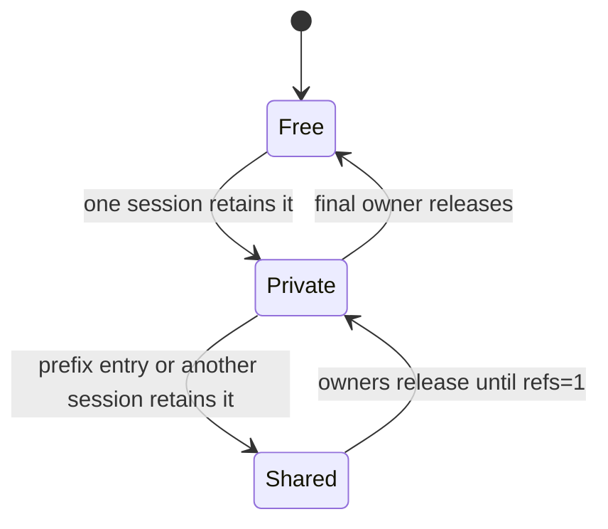

The two owner types are:

1. a live session's block-table entry; and
2. a prefix-directory entry kept for future requests.

Evicting a prefix drops only the directory's references. If a live session
still owns the page, it stays valid. This is the difference between **evicting
reusability** and **deleting live request state**.

The important invariants are:

- free page means reference count zero;
- allocated page means reference count at least one;
- a block table never names a free page;
- reference counts never underflow;
- allocated page count never exceeds configured capacity; and
- the final release returns the page exactly once.

## Part 4: a cold prompt becomes a reusable prefix

Consider the three-token prompt `BOS, hello, systems` and a four-token page.

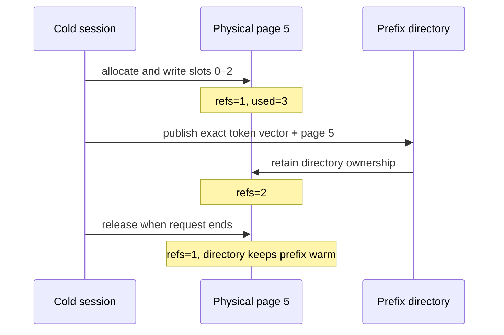

The directory key is the complete token vector, not only a hash. A hash may be
used for efficient placement, but equality of full tokens is the correctness
test.

When a longer prompt `BOS, hello, systems, teach` arrives, the worker checks all
bounded entries and selects the longest exact prefix. It reuses three rows and
projects only `teach`.

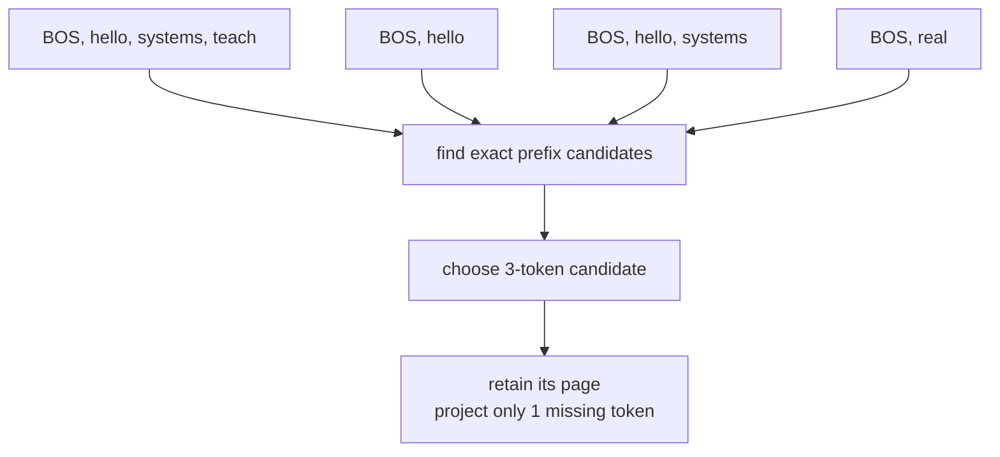

## Part 5: copy-on-write protects a shared partial tail

A partial page has unused slots. If three owners share `page 5` and session A
writes slot 3 directly, every other owner would suddenly observe A's token.
That is state corruption.

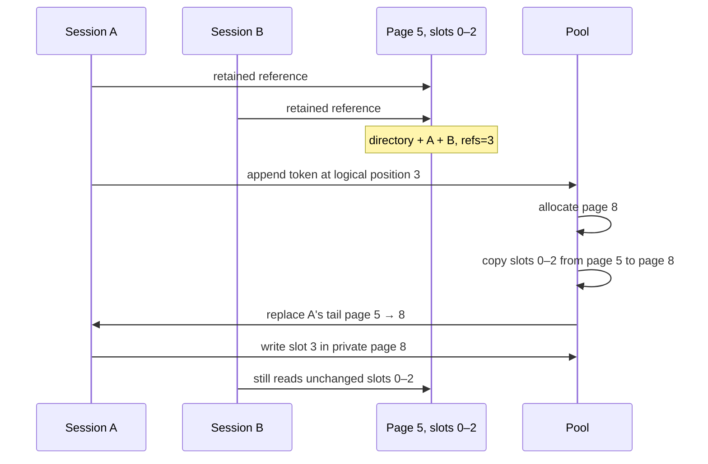

This is **copy-on-write**: sharing costs no copy while data is read-only; only
the first mutation of a shared partial page pays to copy its valid rows.

If pressure evicts the last directory owner and the requesting session becomes
the sole owner, the tail can be mutated in place. “Shared” is decided by the
current reference count, not by how the page was originally created.

## Part 6: LRU eviction reclaims cache ownership, not active state

The prefix directory is bounded. Every lookup or publication advances a
logical use clock. At the entry limit—or when allocation needs a page—the least
recently-used entry is removed first.

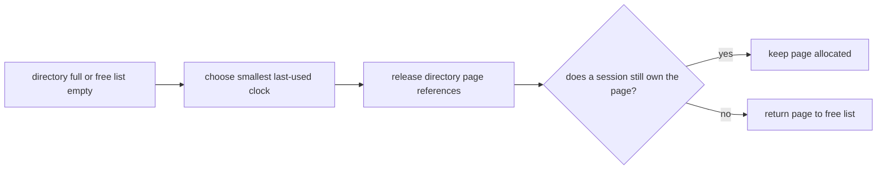

LRU is deliberately simple. It does not understand prefix size, recomputation
cost, tenant value, or access frequency. Its purpose here is to make safe,
observable reclamation concrete before introducing smarter policies.

If eviction cannot produce a free page because all pages remain session-owned,
allocation fails with `paged KV cache capacity exhausted`. The pool never grows
past its bound.

## Part 7: the gateway makes prefix ownership likely

Prefix pages live inside one worker process. A repeat prompt sent to a different
worker is a cold miss even if the first worker has it cached. The existing
consistent-hash gateway therefore becomes part of the memory design.

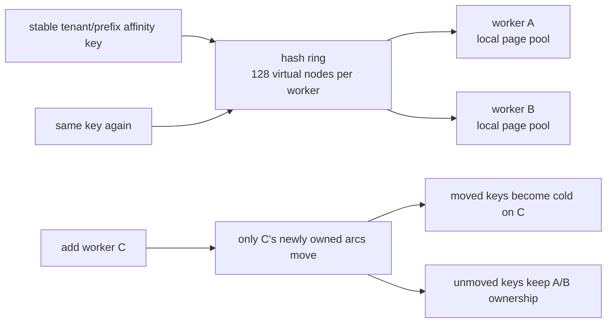

The retained 256-key topology experiment mapped every key identically when the
two-worker topology was unchanged. Adding C remapped 107 keys, and all 107
moved to C. No key moved from A to B or from B to A.

The exact 41.8% is an observation for these worker IDs and 128 virtual nodes,
not a universal promise that one-third of keys always moves. The structural
promise is bounded movement: only keys acquired by the new worker move.

## Part 8: what the attention kernel does today

The block table is a real memory manager, but the attention loop is still the
v0.8 contiguous correctness kernel. Before every step, v0.9 gathers valid rows
from physical pages into temporary logical-order vectors.

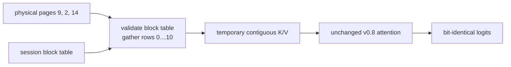

This extra copy may be slower. It deliberately separates two sources of bugs:

1. v0.9 asks whether physical placement, ownership, sharing, and reclamation
   preserve the correct rows; and
2. a later page-aware kernel can ask whether attention consumes those rows
   directly and efficiently.

Therefore the v0.9 claim is **paged KV memory management**, not a production
PagedAttention performance result.

## Reading the retained chart


Read its panels in this order:

1. **Capacity:** the same 64 token slots fit eight actual eight-token sessions
   versus two declared 32-token reservations.
2. **Fragmentation:** larger page granularity wastes more tail slots for the
   retained sequence-length mix.
3. **Sharing lifecycle:** one three-token page holds 384 physical used bytes
   while three owners reference 1,152 logical bytes; two warm sessions then
   fork through copy-on-write.
4. **Projection work:** six cold prompts project 24 K/V positions; their six
   warm repeats project only six positions.
5. **Ownership:** 149 keys keep their A/B owner and 107 move only to new worker
   C after the topology change.

## What the retained proof establishes

| Question | Retained answer |
|---|---:|
| Did layout change logits? | No; paged vs contiguous maximum error is `0` |
| Does the optimized path still match PyTorch? | Maximum error `4.1975708e-06` |
| Is the pool actually bounded? | Ninth live session fails when all 16 pages are held |
| Are pages reclaimed? | All 16 return after the final owners drop |
| Does sharing avoid duplicate physical rows? | 384 physical bytes represent 1,152 owner-referenced bytes |
| Is shared mutation isolated? | Two independent forks, one COW copy each |
| Does longest-prefix lookup work? | Three tokens reused; only one missing token projected |
| Does eviction spare live sessions? | LRU directory ownership drops without dangling session tables |
| Do repeat gateway requests reach warm owners? | 6 of 6 warm pairs hit |
| Does warm reuse reduce deterministic work? | K/V projections fall from 24 to 6 |
| Is placement stable without a topology change? | 256 of 256 keys retain ownership |
| Is topology remapping bounded? | 107 of 256 move, all only to added worker C |
| Did the release checker pass? | 22 of 22 assertions |

## Where the behavior lives in code

| Responsibility | Code |
|---|---|
| Physical pages, free list, reference counts, COW, LRU | `worker/cpp/inferlab_runtime.cpp` |
| C page/cache statistics contract | `worker/cpp/inferlab_runtime.h` |
| Safe Rust model/session wrapper and metrics | `worker/src/lib.rs` |
| Continuous scheduler | `worker/src/scheduler.rs` |
| Worker environment configuration | `worker/src/main.rs` |
| Direct decoder comparison CLI | `worker/src/bin/inferlab-cpu-cli.rs` |
| Deterministic allocator scenarios | `worker/src/bin/inferlab-page-probe.rs` |
| Gateway affinity and consistent hash ring | `gateway/src/routing.rs` |
| End-to-end release proof | `scripts/proof-v0.9.sh` |
| Machine-readable release assertions | `benchmarks/check_paged_cache.py` |
| Retained chart renderer | `benchmarks/render_paged_cache_svg.py` |

## Configuration and observation

| Environment variable | Default | What to change |
|---|---:|---|
| `INFERLAB_CPU_DECODER_MODE` | `paged-kv-cache` | Compare `recompute`, `kv-cache`, and `paged-kv-cache` |
| `INFERLAB_CPU_KV_PAGE_TOKENS` | 4 | Explore the fragmentation/metadata trade-off |
| `INFERLAB_CPU_KV_PAGE_COUNT` | 64 | Change the hard physical capacity |
| `INFERLAB_CPU_PREFIX_CACHE_CAPACITY` | 32 | Bound retained prefixes; zero disables publication |

`GET /internal/cache` reports page geometry, free/allocated pages, slots,
fragmentation, references, sharing, prefix hits/misses, copy-on-write copies,
evictions, and allocation failures. Each generation also includes request-level
page count, reserved bytes, fragmentation, prefix reuse, and COW metrics.

Compare layouts directly:

```bash
cargo run -p cpu-worker --bin inferlab-cpu-cli -- \
  --mode kv-cache --prompt "teach me streaming" --max-tokens 8

cargo run -p cpu-worker --bin inferlab-cpu-cli -- \
  --mode paged-kv-cache --page-tokens 4 --page-count 64 \
  --prefix-capacity 32 --prompt "teach me streaming" --max-tokens 8
```

Run the full proof:

```bash
INFERLAB_ORACLE_PYTHON=.tools/v0.7-python/bin/python \
  ./scripts/proof-v0.9.sh
```

## Experiments worth trying

1. Run the CLI with page sizes 1, 2, 4, 8, and 16. Predict reserved bytes and
   tail waste before reading the metrics.
2. Set prefix capacity to zero. Confirm outputs remain identical while warm
   hits disappear.
3. Repeat one prompt twice against the same worker. Compare `kv_tokens`,
   `prefix_tokens_reused`, and `copy_on_write_copies`.
4. Repeat a short prompt and then extend it by one word. Confirm the shorter
   exact prefix wins and only the missing rows are projected.
5. Configure too few pages for all active sessions. Confirm the error is local,
   pool allocation stays bounded, and pages return when requests finish.
6. Use two distinct affinity keys for the same prompt. Notice routing placement
   can differ even though the worker's token-vector check remains the final
   reuse authority.
7. Add a third worker and map many fixed keys before and after. Separate the
   invariant “moves only to the new worker” from the observed percentage.
8. Change the LRU touch order in the allocator probe and predict which prefix
   misses next.
9. Temporarily remove the COW branch on a disposable branch. Two warm forks
   should reveal cross-session corruption or parity failure.
10. Compare paged and contiguous timings, then explain why v0.9 does not promise
    a speedup while it materializes page rows every step.

## What v0.9 does not mean

### It does not mean attention is page-aware

Rows are gathered into temporary contiguous vectors before attention. No GPU
PagedAttention kernel, fused gather, or block-table traversal exists.

### It does not eliminate all fragmentation

Fixed pages eliminate variable-size external holes in this pool. Final pages
still have unused token slots, and smaller pages require more metadata.

### It does not provide distributed cache coherence

Each worker owns an independent process-local pool. Consistent hashing improves
placement affinity; it does not copy or synchronize pages across workers.

### It does not guarantee every admitted request can finish

The scheduler bounds request count, while the page pool bounds token slots. A
request can be admitted and later exhaust pages because future growth is not
reserved or predicted.

### It does not choose a production eviction policy

Synchronous LRU is deterministic and safe, but it ignores prefix size,
recompute cost, tenant fairness, and access frequency.

### It does not establish useful-model performance

The retained proof uses a one-layer, 16-dimensional, 3,232-parameter model on
one Apple ARM64 host. Its claims are correctness and memory ownership behavior.

## What v0.10 added next

The serving path can now route, schedule, remember, place, share, and reclaim a
deterministic greedy decoder's state. The next uncertainty is how token choice
changes when generation is no longer simple `argmax`.

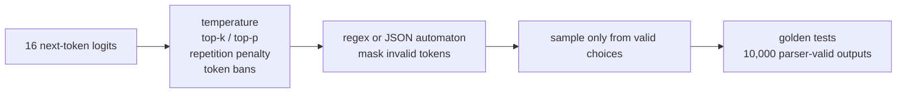

That topic belongs after memory correctness because sampling creates branching
sequences, and branching sequences rely on safe ownership and copy-on-write.
It is now implemented in [RFC 0015](../rfcs/0015-sampling-structured-decoding.md)
and explained step by step in the
[phase 15 guide](phase-15-sampling-and-structured-decoding.md). The v0.10 proof
preserves raw logits while adding deterministic seeded selection and a
seven-state JSON token DFA; 10,000/10,000 retained outputs are parser- and
schema-valid.

## Check your understanding

If a prefix directory, session A, and session B all reference the same partial
page, why is eviction alone insufficient before A appends, and which two facts
tell the allocator whether it must copy?
