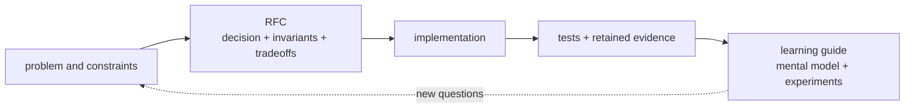
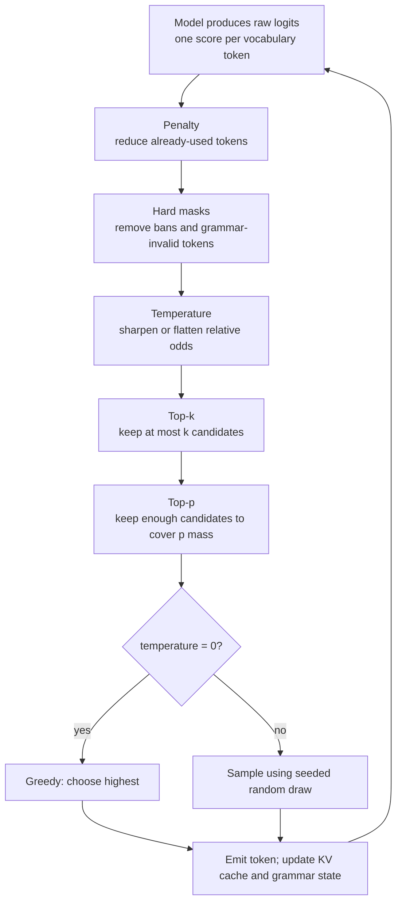
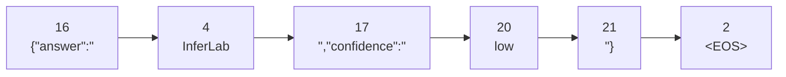
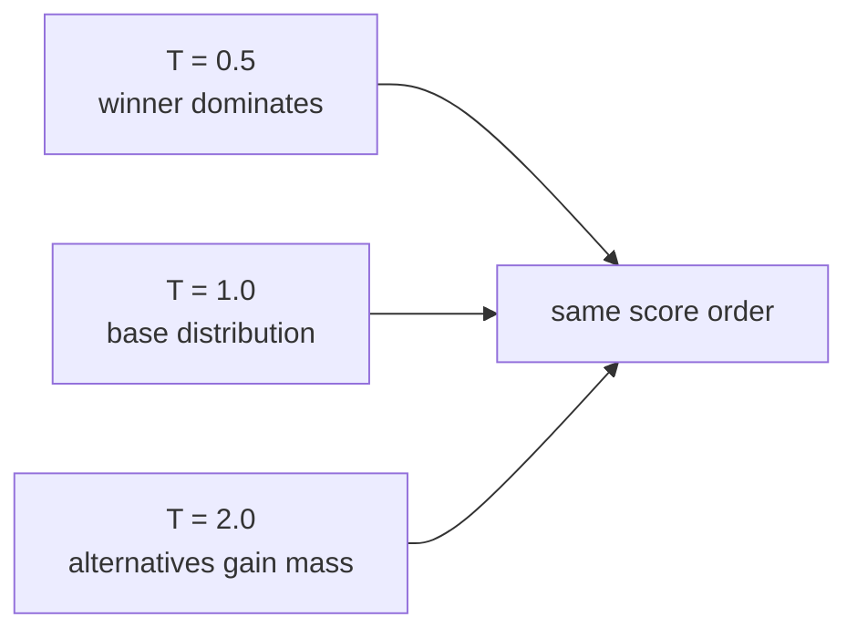
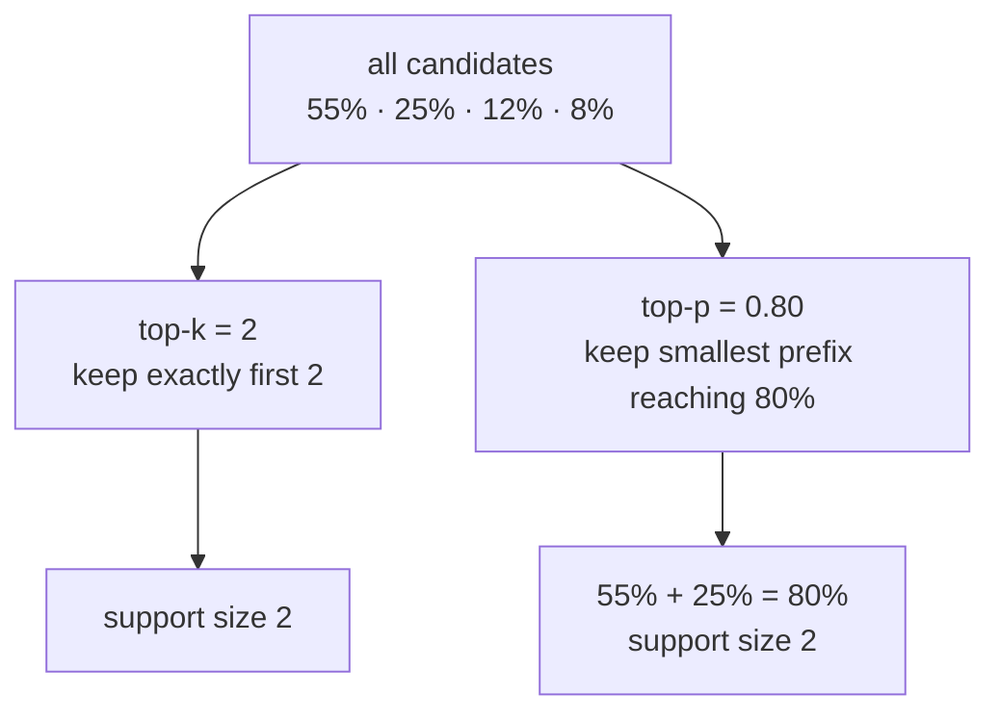
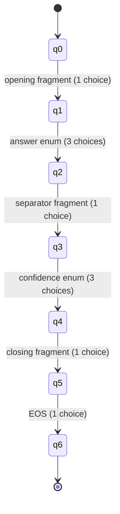
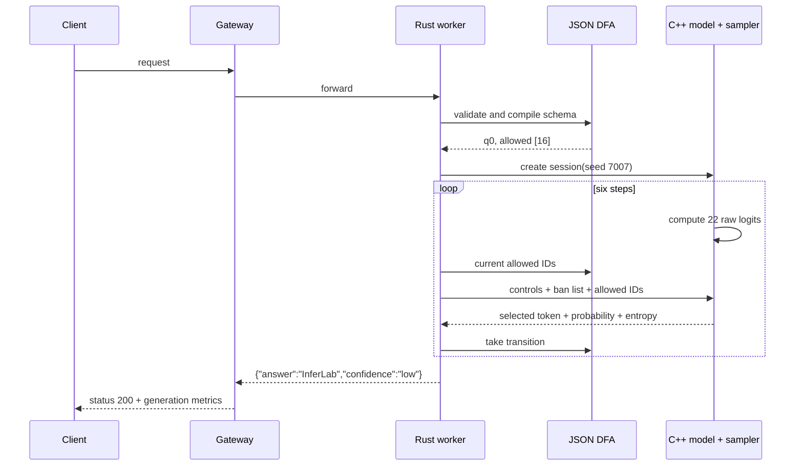
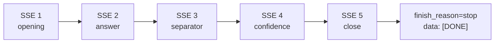
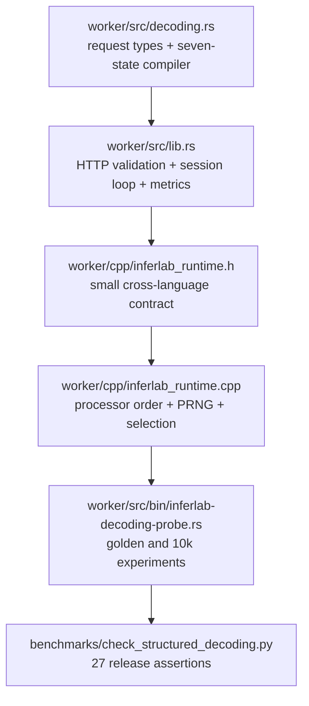
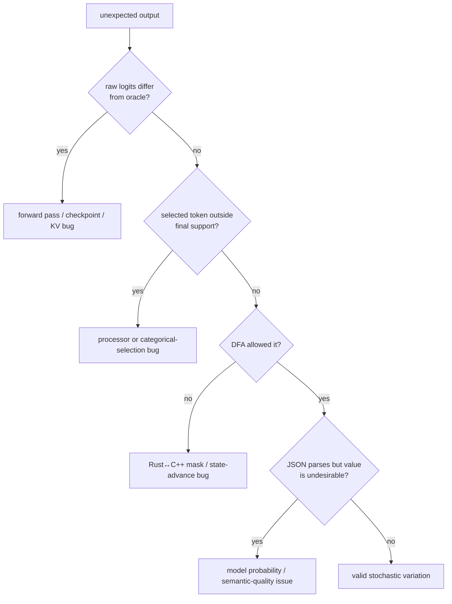

# Phase 15: Sampling and structured decoding

This phase answers one deceptively simple question: after the transformer has
scored every possible next token, **how is one token actually chosen?**

Read [RFC 0015](../rfcs/0015-sampling-structured-decoding.md) for the exact
engineering contract. This guide builds the picture you should hold in your
head, defines the terms, walks one request, and gives experiments you can run
without first reading all the code.

## RFC versus learning document

**RFC** means **Request for Comments**. Despite the name, an implemented RFC is
not an open-ended chat. It is the project's decision record: “we had these
constraints, selected this design, rejected these alternatives, and require
these invariants.” Reviewers can point to one claim and challenge it.

The learning document has a different job: “what problem should I imagine,
what do the terms mean, where should I look, and what can I change safely?”



The RFC tells you what must remain true. This page helps you understand why.

## The one-screen mental model

Imagine the model as a contestant who writes one score beside every word tile.
The decoder is the referee between those scores and the selected tile.



There are two fundamentally different controls:

- **soft controls** reshape or truncate which valid answer is likely;
- **hard constraints** make invalid answers impossible.

Temperature is soft. A JSON grammar mask is hard.

## The vocabulary is the menu

The transformer never emits a word or JSON object directly. It emits one score
for each entry in its fixed vocabulary. v2 has 22 entries:

```text
IDs 0–15: historical text and special tokens
ID 16:     {"answer":"
ID 17:     ","confidence":"
IDs 18–20: high, medium, low
ID 21:     "}
```

The older answer enums—`InferLab`, `systems`, and `tokens`—already exist at IDs
4, 15, and 9. Combining fragments yields a complete object in five visible
tokens, followed by EOS:



Rendered text:

```json
{"answer":"InferLab","confidence":"low"}
```

This is why vocabulary limitations matter. If a required enum value is not one
complete token, the v0.10 compiler refuses the schema. A future compiler could
track partial multi-token strings, but this one deliberately does not.

## Glossary: every term you meet here

| Term | Plain-language meaning | What it does in v0.10 |
|---|---|---|
| Token | One vocabulary ID, not necessarily one word | Smallest unit the decoder selects |
| Vocabulary | Complete menu of selectable tokens | v1 has 16 entries; v2 has 22 |
| Logit | Model score before normalization | Preserved raw for oracle comparison |
| Softmax | Converts finite logits into probabilities summing to 1 | Used for positive-temperature sampling |
| Candidate support | Tokens whose final probability can be nonzero | Reported as `candidate_count` |
| Greedy decoding | Always select the largest surviving score | Temperature `0` |
| Sampling | Draw a token according to probabilities | Positive temperature with SplitMix64 |
| Seed | Initial number for a deterministic pseudo-random sequence | Same seed replays the same request |
| PRNG | Pseudo-random number generator | SplitMix64, one session-local state |
| Temperature | Divisor controlling probability sharpness | `0` greedy; low sharp; high flat |
| Top-k | Keep no more than the k strongest candidates | `0` means disabled |
| Top-p / nucleus | Keep the smallest ranked set covering probability mass p | `1` means disabled |
| Repetition penalty | Lowers scores of token IDs already in the prompt or generated context | Applied once per distinct context token |
| Token ban | Explicit ID that must never be selected | Converted to negative infinity |
| Mask | Removes a token from the possible set | Used by bans and grammar |
| Negative infinity | A working score whose softmax probability is zero | Represents impossible selection |
| JSON Schema | Declarative description of allowed JSON data | A tiny exact subset is supported |
| Grammar | Rules describing legal next symbols | Compiled from the supported schema |
| Automaton | State machine that reads one token at a time | Tracks legal JSON progress |
| DFA | Deterministic finite automaton | One current state and deterministic transitions |
| State | How much of the structure has already been emitted | q0 through q6 |
| Transition | Legal move caused by one token | E.g. q1 + `InferLab` → q2 |
| EOS | End-of-sequence token | Only legal after the closing fragment |
| Entropy | Numeric measure of uncertainty in a distribution | Zero for greedy; reported for sampling |
| C ABI | Stable C calling boundary between Rust and C++ | Carries controls, masks, and result structs |
| SSE | Server-Sent Events, the streaming HTTP format | Sends each visible JSON fragment separately |

## Temperature: reshape, do not invent

Start with three synthetic logits `[0, 1, 2]`. The ranking stays the same at
every positive temperature, but the odds change:

| Temperature | Probability of token 0 | token 1 | token 2 | Picture |
|---:|---:|---:|---:|---|
| 0.5 | 1.59% | 11.73% | 86.68% | Very sharp |
| 1.0 | 9.00% | 24.47% | 66.52% | Original softmax |
| 2.0 | 18.63% | 30.72% | 50.65% | Flatter |

Temperature cannot make a masked token legal. It only changes relative odds
among the survivors.



The retained 10,000-draw observations stay within 0.581 percentage points of
these exact probabilities. Statistical tests need a tolerance because a valid
random sample is not expected to equal its theoretical proportion exactly.

## Top-k and top-p: two different gates

Suppose sorted probabilities are `[0.55, 0.25, 0.12, 0.08]`.



They happen to agree here, but they need not. If the first probability were
0.90, top-p 0.80 would keep one token while top-k 2 would keep two. If the
distribution were flat, top-p might retain many tokens. That adaptiveness is
why top-p is called **nucleus sampling**: the nucleus expands or shrinks with
the distribution.

In InferLab, top-k runs before top-p, so top-p cannot restore a candidate that
top-k removed.

## Repetition penalty: why the sign rule exists

Naively dividing every repeated-token logit by the penalty fails for negative
scores: `-2 / 2 = -1`, which is *larger* and makes that token more likely.
Instead:

```text
positive repeated logit: divide by penalty
negative repeated logit: multiply by penalty
```

Both move downward. With logits `[1, 4, 3, 2]`, history containing token 1,
and penalty 2, token 1 falls from 4 to 2. Token 2 becomes the winner at 3. That
exact scenario is a retained golden test.

## Structured decoding: a guardrail at every step

A prompt like “please output valid JSON” is advice. A grammar mask is a locked
rail: at q0, 21 of 22 vocabulary tokens are impossible. At q1, only the three
declared answer enums are possible.



The candidate counts across the six selections are `1 + 3 + 1 + 3 + 1 + 1 =
10`. Without grammar there would be `6 × 22 = 132` step-token candidates.
The trace therefore reports 122 masked token positions. This is not an
estimated metric; it follows directly from the automaton.

## One request, slowly

Consider this non-streaming request:

```json
{
  "model": "inferlab-tiny",
  "stream": false,
  "temperature": 1.0,
  "top_p": 1.0,
  "seed": 7007,
  "max_tokens": 6,
  "messages": [{"role": "user", "content": "teach me streaming"}],
  "response_format": {
    "type": "json_schema",
    "json_schema": {
      "name": "inference_summary",
      "strict": true,
      "schema": {
        "type": "object",
        "properties": {
          "answer": {"type": "string", "enum": ["InferLab", "systems", "tokens"]},
          "confidence": {"type": "string", "enum": ["high", "medium", "low"]}
        },
        "required": ["answer", "confidence"],
        "additionalProperties": false
      }
    }
  }
}
```



With seed 7007, the retained result is:

```json
{"answer":"InferLab","confidence":"low"}
```

Repeating the same request produces the exact same bytes. Changing the seed may
change a legal enum selection, but it cannot change punctuation, field order,
required fields, or the final EOS transition.

## Streaming does not weaken the guarantee

The SSE path emits five visible content pieces and then terminates. The EOS
token is not printed. Concatenating the five fragments reconstructs one valid
object. Because validation happens before submission and masking happens before
every selection, the gateway never needs to buffer the complete object to make
it valid.



An unsupported schema returns HTTP 400 **before** streaming. Once bytes have
been sent, an HTTP status cannot be changed safely; this is the same streaming
boundary that made retry-after-first-token invalid in earlier phases.

## What the retained chart says


Read it in four parts:

1. Processor golden cases show which candidates survive and which token wins.
2. Observed 10,000-draw bars closely follow exact softmax outlines.
3. The seven DFA states make the six legal choices visible.
4. All 10,000 outputs are valid, but 9,991 choose `InferLab`.

That final skew is the most important learning result. A grammar answers “is
this shape allowed?” It does not answer “is this value wise, true, diverse, or
well calibrated?” The tiny untrained model strongly prefers one answer token.

## Why we chose this narrow implementation

| Choice | What it buys us | What it cannot do yet |
|---|---|---|
| Rust schema compiler | Clear HTTP validation and inspectable state machine | No general JSON Schema |
| C++ sampler | One numeric path for CLI, HTTP, tests, and probes | No external library equivalence promise |
| One-token enums | Simple exact transitions | No arbitrary strings or subtoken prefixes |
| Append-only v2 vocabulary | Historical v1 proofs remain exact | Still not a production tokenizer |
| Fixed processor order | Reproducible semantics | Users cannot reorder processors |
| SplitMix64 | Fast deterministic replay | Not cryptographically random |
| Grammar-controlled EOS | No trailing text after valid JSON | Exactly six generated tokens required |

The limitation is part of the lesson. General grammars require reasoning about
token prefixes: one token might contain half a quote, several characters, or a
complete punctuation sequence. Starting with an explicit seven-state machine
lets us prove the ownership boundaries before introducing that complexity.

## Where the idea lives in code

You do not need to read everything. Follow this order:



Suggested reading questions:

1. In `compile_constraint`, which schema mistakes fail before scheduling?
2. In `select_token`, where can candidate support shrink but never grow?
3. In `Session::next_token`, when does the DFA advance relative to streaming?
4. In the probe, which checks are exact and which are statistical?
5. In the checker, which evidence prevents “10,000 valid strings” from hiding
   a broken gateway or checkpoint change?

## Experiments you can run

Build once:

```bash
cargo build --workspace
```

### 1. Compare greedy and sampled text

```bash
cargo run -p cpu-worker --bin inferlab-cpu-cli -- \
  --model models/tiny-inferlab-v2.bin \
  --prompt "teach me streaming" --max-tokens 8 \
  --temperature 0 --seed 1

cargo run -p cpu-worker --bin inferlab-cpu-cli -- \
  --model models/tiny-inferlab-v2.bin \
  --prompt "teach me streaming" --max-tokens 8 \
  --temperature 1 --seed 1
```

Predict whether token IDs, entropy, and candidate counts will differ.

### 2. Replay and then change a seed

Run the sampled command twice with seed 42, then once with seed 43. Same seed
must match. Different seed is allowed—but not required—to differ.

### 3. Make top-k visible

Add `--top-k 2`. Inspect each step's `candidate_count`. Then combine it with a
small top-p and observe that support can shrink further.

### 4. Ban the greedy winner

The normal first answer token is `InferLab` (ID 4). Add `--ban-token 4` in text
mode. In JSON-schema mode, it is removed from the q1 answer choices while the
other enum values remain legal.

### 5. Generate structured JSON

```bash
cargo run -p cpu-worker --bin inferlab-cpu-cli -- \
  --model models/tiny-inferlab-v2.bin \
  --prompt "teach me streaming" --max-tokens 6 \
  --response-format json-schema --temperature 1 --seed 7007
```

Read `steps[].allowed_token_ids` and `metrics.decoding` before reading the final
text. Predict the six support sizes.

### 6. Trigger boundaries intentionally

- Use `--max-tokens 5` with JSON schema: compilation must reject it.
- Use v1 with JSON schema: required enum/fragment tokens are missing.
- Ban every answer enum in structured mode: the candidate set becomes empty.
- Send `additionalProperties: true` over HTTP: receive a pre-stream 400.

An error here is a successful experiment: it proves the guardrail is not a
best-effort hint.

### 7. Run the release proof

```bash
INFERLAB_ORACLE_PYTHON=.tools/v0.7-python/bin/python \
  ./scripts/proof-v0.10.sh
```

This regenerates both checkpoints, builds the workspace, checks v1/v2 and
PyTorch parity, runs processor and 10,000-sample probes, starts a real worker
and gateway, checks non-streaming/SSE/error behavior, evaluates 27 assertions,
and renders the retained chart.

## How to reason about a failure



This diagnostic tree is why raw logits, final support, grammar state, and
selected probability are all retained. “The answer changed” is not enough to
locate a probabilistic bug.

## What v0.10 proves—and what it does not

It proves:

- fixed processor semantics through golden tests;
- statistically correct categorical behavior at three temperatures;
- deterministic replay within the declared implementation;
- token-by-token enforcement of one exact JSON object grammar;
- compatibility of the appended checkpoint vocabulary; and
- preservation of HTTP, SSE, scheduler, and paged-cache integration.

It does **not** prove:

- general JSON Schema support;
- useful answers from the tiny untrained model;
- balanced, fair, factual, or calibrated enum choices;
- compatibility with another engine's seed sequence;
- production tokenizer behavior;
- better latency or throughput; or
- security against adversarial schemas or cryptographic prediction.

## How v0.10 prepared v0.11

We now have two references for future optimizations:

1. raw model logits checked against PyTorch; and
2. a declared sampling distribution checked statistically.

Quantization can perturb logits, and speculative decoding must preserve the
target distribution even when a draft model proposes several tokens. Matching
only one greedy output would hide both kinds of error. v0.10 supplied the
stronger contract v0.11 needed.

That next phase is now implemented. Per-row INT8 and groupwise INT4 are compared
with the FP32 logits, while sampled speculation is checked against the target
distribution—including deliberately poor drafts that force rejection. Continue
with [RFC 0016](../rfcs/0016-quantization-speculative-decoding.md), the
[phase 16 learning guide](phase-16-quantization-and-speculative-decoding.md),
and the [retained v0.11 evidence](../results/v0.11/README.md).

## Check your understanding

1. Why must grammar masking happen before top-k and top-p?
2. Why does temperature zero need a separate branch?
3. Why can 10,000/10,000 valid JSON outputs coexist with a poor answer model?
4. What exact inputs are included in the same-seed replay promise?
5. Why does adding six tokens in a new checkpoint protect older proofs?
6. At q3, what is the candidate support and what cannot temperature change?

If you can draw the seven states, explain the 122 masked positions, and locate
a failure using the diagnostic tree, you understand the phase without needing
to memorize the implementation.
