# Phase 16: Quantization and speculative decoding

This phase asks two practical questions:

1. How can the model carry fewer weight bytes without changing too much?
2. How can a cheap draft do several guesses while the target model keeps final
   control over every output token?

Read [RFC 0016](../rfcs/0016-quantization-speculative-decoding.md) for the exact
engineering contract. This guide builds the picture, defines the terms, walks
one request, shows where the approaches fail, and suggests experiments.

## RFC versus learning document

**RFC** means **Request for Comments**. In InferLab, the RFC is a decision
record: “given these constraints, we selected this design, rejected these
alternatives, and require these invariants.” It is the document a reviewer can
challenge.

The learning document is your map: “what should I imagine, what does each term
mean, where is it in code, and what can I change to test my understanding?”

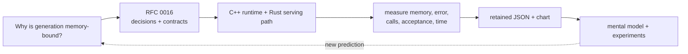

The RFC tells you what must not break. This page helps you form predictions
before looking at the answer.

## The one-screen mental model

Imagine a senior editor and a junior editor.

- **Quantization** gives an editor a compressed shorthand copy of the same
  reference book. It saves space, but a few numbers are rounded.
- **Speculation** lets the junior draft several words. The senior checks all of
  them in one pass, keeps the acceptable prefix, and fixes the first mistake.
- The senior remains the authority. The junior can save senior work only when
  it is cheaper and usually right.

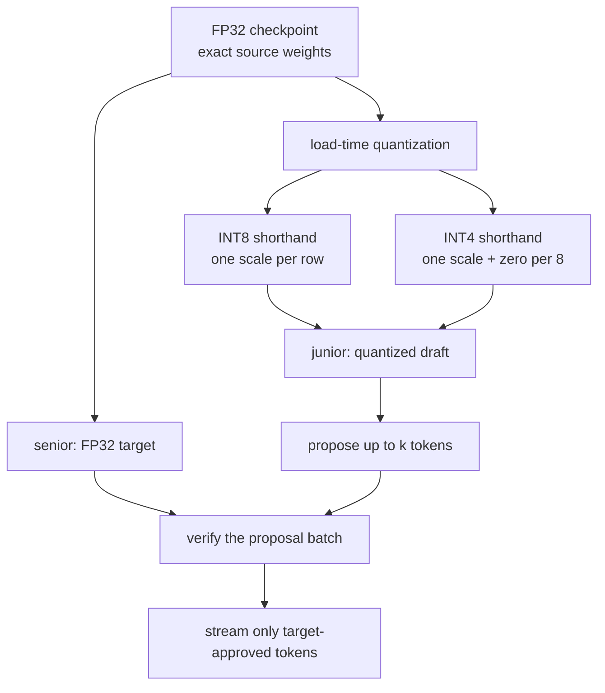

There are three separate questions. Do not collapse them into one “faster”
claim:

| Question | Metric |
|---|---|
| Did representation shrink? | active tensor and linear-weight bytes |
| Did behavior remain correct? | logit error, greedy tokens, target distribution |
| Did the request become faster? | measured wall time and tokens/second |

v0.11 answers yes, yes within declared bounds, and **no for speculation on this
prototype**. That last answer is part of the learning result.

## Glossary: every term used in this phase

| Term | Plain-language meaning | v0.11 meaning |
|---|---|---|
| Weight | Learned numeric coefficient used by the model | Loaded from the deterministic FP32 checkpoint |
| Tensor | Multi-dimensional numeric array | Model parameters, activations, or KV state |
| Linear layer | Matrix multiplication plus optional bias | Seven weight matrices can be quantized |
| FP32 | 32-bit floating-point number | Source weights, scales, accumulation, and FP32 islands |
| INT8 | Signed 8-bit integer | Quantized values from −127 to 127 |
| INT4 | Four-bit integer representation | Unsigned values 0 to 15, two per byte |
| Quantization | Map many floating-point values to fewer integer levels | Happens in memory at model load |
| Dequantization | Reconstruct an approximate float from an integer | Happens on scalar weight access during matmul |
| Scale | Step size between adjacent quantized levels | One per INT8 row; one per INT4 group |
| Zero point | Integer code representing real zero | Stored only for asymmetric INT4 |
| Symmetric | Positive and negative ranges share zero-centered codes | INT8 is symmetric |
| Asymmetric | Range may shift using a zero point | INT4 is asymmetric |
| Per-row | One metadata scale for one output matrix row | INT8 granularity |
| Groupwise | Separate metadata for small consecutive chunks | INT4 groups contain up to 8 columns |
| Nibble | Four bits, half a byte | One packed INT4 value |
| FP32 island | Tensor deliberately kept in FP32 | Embeddings, norms, biases, runtime state |
| Logit | Unnormalized next-token score | Quantized modes are compared with FP32 logits |
| Perplexity | Exponential average negative log probability | Only a greedy-path sensitivity metric here |
| Target model | Model whose distribution defines correct output | FP32 in the retained speculative proof |
| Draft model | Cheaper model that proposes tokens | Same architecture with INT8 or INT4 weights here |
| Proposal window `k` | Maximum draft tokens in one cycle | 1, 2, or 3 in evidence; API ceiling 8 |
| Verification | Target evaluates proposal positions | One `forward_all` call per cycle |
| Acceptance | Proposal may remain in target-correct output | Exact argmax match or probability-ratio test |
| Rejection | Proposal cannot be used as sampled | Emits a target correction and ends the cycle |
| Correction | Target-owned replacement after rejection | Argmax token or residual sample |
| Residual distribution | Positive probability mass target has beyond draft | Normalized `max(p − q, 0)` |
| Acceptance rate | Accepted proposals divided by all proposals | Draft-quality signal, not a speed metric |
| Target forward call | One invocation of authoritative target compute | Falls from 8 to 2 for window 3 in the retained trace |
| FIFO buffer | First-in, first-out queue | Holds verified tokens for one-at-a-time emission |
| PRNG | Deterministic pseudo-random number generator | Separate target and draft SplitMix64 states |
| SSE | Server-Sent Events | Existing one-visible-token streaming format |
| C ABI | C-compatible Rust/C++ boundary | Exposes model, sessions, metrics, and sampler probe |

## Part I: why fewer bits can save memory

An FP32 weight uses four bytes. An INT8 value uses one. An INT4 value uses half
a byte. The tempting prediction is therefore “INT8 makes the model 4× smaller,
INT4 makes it 8× smaller.” That prediction ignores metadata and tensors that
were never quantized.

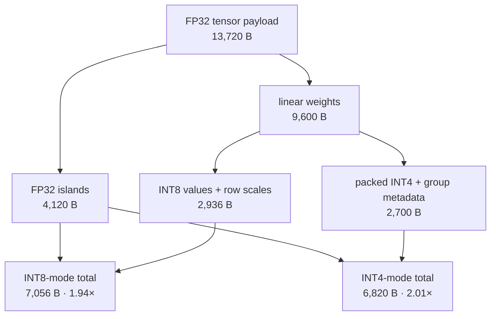

INT4 compresses the linear weights 3.56×, not 8×, because small groups need
many scales and zero points. Model-wide payload is only 2.01× smaller because
4,120 FP32 bytes remain unchanged.

### Follow one INT8 row

Suppose one row contains:

```text
[-1.00, -0.25, 0.50, 0.80]
```

The largest absolute value is 1.00, so the scale is approximately
`1 / 127 = 0.007874`. Divide by the scale and round:

```text
FP32:       -1.00    -0.25     0.50     0.80
INT8:        -127      -32       64      102
restored:   -1.00   -0.252    0.504    0.803
```

The values are close but not identical. Another row gets another scale, so a
large value in this row does not reduce resolution in every row.

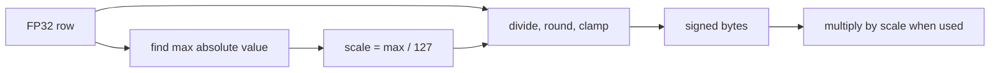

### Follow one INT4 group

INT4 has only sixteen integer codes. For each group of up to eight weights, it
finds a local minimum and maximum, stores a scale and zero point, and maps into
0…15. The zero point makes real zero exactly representable whenever the affine
mapping permits it.

Two codes fit in one byte:

```text
low nibble             high nibble
bits 0 1 2 3           bits 4 5 6 7
    q0         +           q1         = packed byte
```

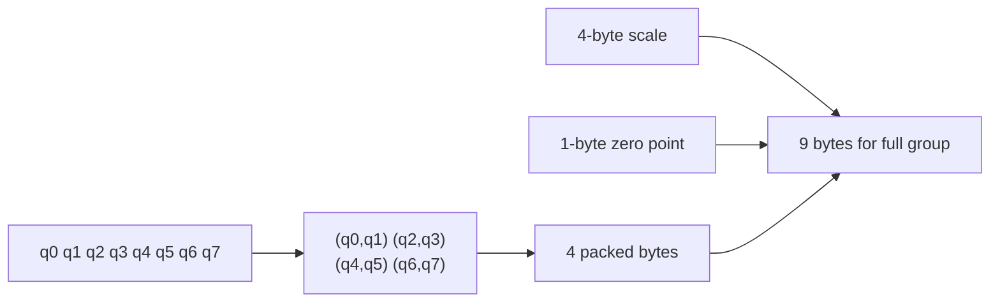

Four FP32 values would take 16 bytes; eight would take 32. This full group uses
9 bytes including metadata. Smaller groups represent ranges more precisely but
spend more metadata per value.

## What is quantized—and what is not

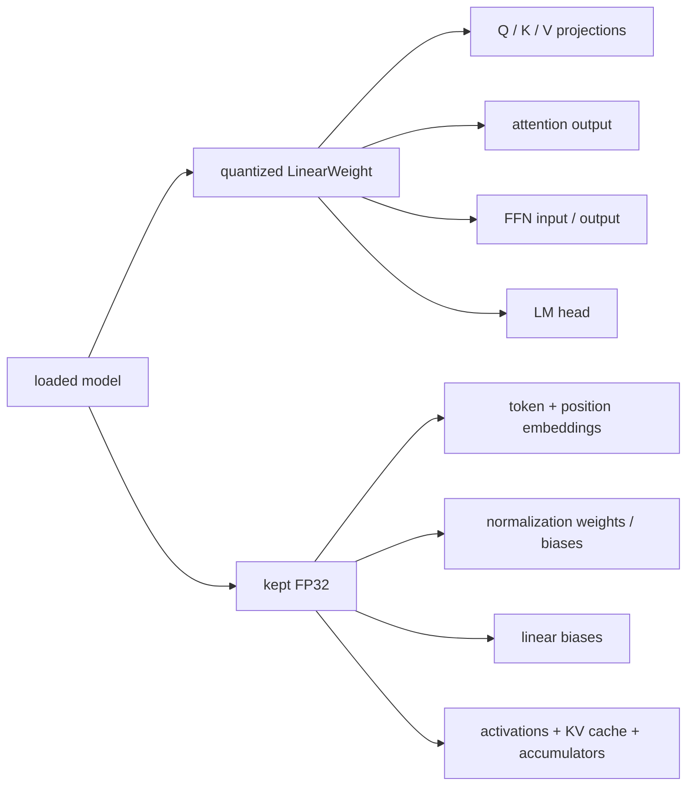

This boundary is why saying “the model is INT4” without qualification can be
misleading. The health response calls the active dtype `uint4-groupwise`, but
the RFC and byte counters state exactly which payload is represented that way.

## Correctness is more than one matching sentence

One greedy completion can match even while many other logits drift. The proof
uses three layers of evidence:

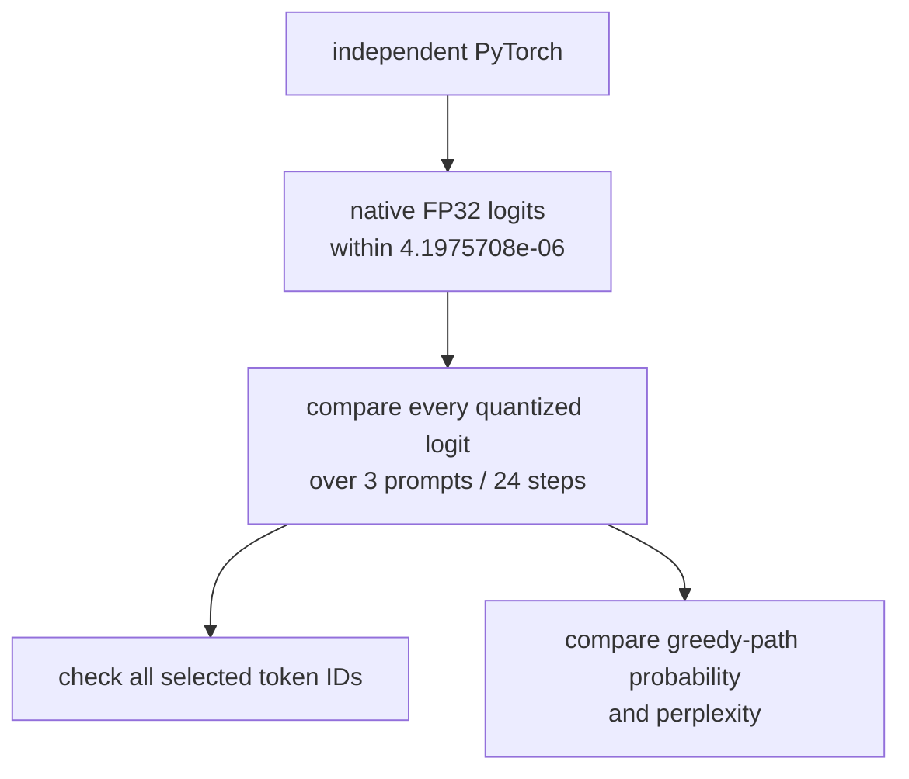

Results:

| Mode | Active tensor bytes | Max logit error | Greedy mismatches | Greedy-path perplexity |
|---|---:|---:|---:|---:|
| FP32 | 13,720 | 0 | 0 / 24 | 1.001519718 |
| INT8 | 7,056 | 0.000182867 | 0 / 24 | 1.001519785 |
| INT4 | 6,820 | 0.003354073 | 0 / 24 | 1.001519129 |

“Greedy-path” matters. The probe asks how much probability each model gives to
the FP32 greedy token along the same small trace. It is not evaluation-corpus
perplexity and cannot tell you whether a real model remains useful.

## Part II: speculative decoding step by step

Without speculation, an eight-token completion invokes the target eight times:

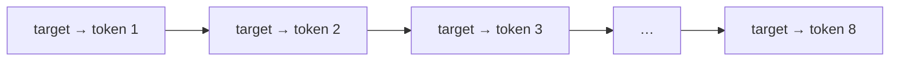

With a three-token window, the draft first runs autoregressively:

```mermaid
sequenceDiagram
    participant D as Draft
    participant T as Target
    participant B as Verified FIFO
    D->>D: propose d1
    D->>D: append d1; propose d2
    D->>D: append d2; propose d3
    D->>T: context + [d1,d2,d3]
    T-->>B: verify three positions in one call
    alt all three accepted
        T-->>B: add one target-owned bonus token
    else first rejection
        T-->>B: accepted prefix + correction
    end
    B-->>B: return one token per scheduler step
```

Why can one target call produce several verification distributions? A
transformer forward pass over a token sequence calculates an output at every
position. Causal masking prevents an earlier position from seeing later
proposals. The target output after the old final context token judges `d1`; the
next position judges `d2`; and so on.

### Greedy verification

For temperature zero, compare token IDs:

```text
draft:   [A, B, C]
target:  [A, B, X]
output:  [A, B, X]
discard: C and every later proposal
```

The longest exact prefix remains. The target's first mismatch is the
correction. If all three match, the target call also supplies one bonus token.

### Why sampled verification is different

Suppose the target assigns token `A` probability 0.30 and the draft assigns it
0.60. `A` is a legal sample from both models, but keeping every draft `A` would
double how often it appears. Exact token or argmax comparison cannot preserve a
probability distribution.

The acceptance probability is:

```text
min(1, target_probability(A) / draft_probability(A))
= min(1, 0.30 / 0.60)
= 0.50
```

Half of those over-proposed `A` tokens are rejected. A rejection samples from
the target's missing positive mass `max(p − q, 0)`. Together, accepted draft
mass and correction mass reconstruct the target distribution.

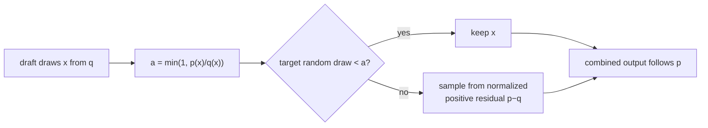

## Why the draft and target need separate random state

If draft sampling consumed the target's random numbers, changing draft window
size would shift every later target draw. It might still be statistically
correct, but replay and diagnosis would become unnecessarily tangled.

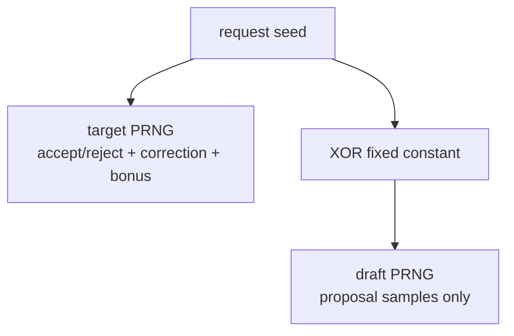

The split does not promise matching token sequences between baseline sampling
and speculation for every seed. It promises deterministic replay for the same
speculative configuration, and the distribution proof checks that the output
law remains the target's.

## One request from client to bytes

Consider this request body:

```json
{
  "model": "inferlab-tiny",
  "stream": true,
  "temperature": 0,
  "speculative_tokens": 3,
  "max_tokens": 8,
  "messages": [{"role": "user", "content": "teach me streaming"}]
}
```

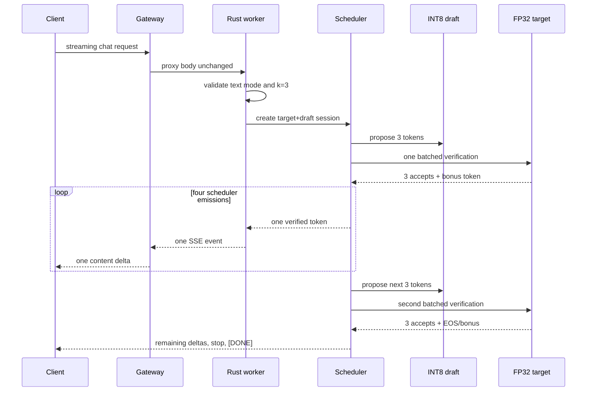

The retained completion is identical to baseline:

```text
InferLab turns prompts into real tokens.
```

Metrics report two target calls, six draft calls, six accepted proposals, two
cycles, two extra target tokens, zero rejections, and 100% acceptance.

## Read the retained chart correctly


The three panels answer different questions:

1. INT8 and INT4 really reduce active tensor and linear-weight payload, with
   metadata and FP32 islands included.
2. A three-token draft reduces target calls by 75%, but median wall time grows
   from 24.625 to 110.541 microseconds for the retained INT8 run.
3. Deliberately worsening the draft lowers acceptance from 100% to 42.05%, yet
   corrected output remains within one percentage point of the target law.

This is why a systems chart must include both mechanism and outcome. “Two
target calls instead of eight” is true. “Therefore it is faster” is false here.

## Why did speculation lose wall time?

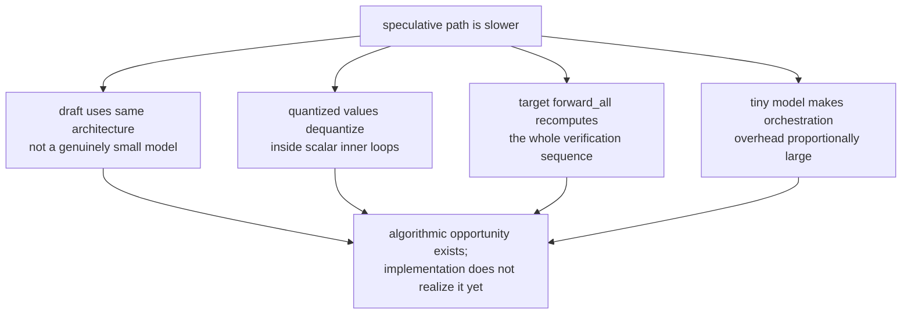

Real speculative systems win when the draft is much cheaper and the target can
verify several tokens for roughly the cost of one target step. v0.11 has the
correct acceptance algorithm but not those cost conditions.

Quantization timings also happen to be close or faster on this tiny retained
run, but the runtime has no vectorized INT8/INT4 kernels. Treat those
microseconds as observations, not evidence that scalar dequantization will
speed up a production model.

## Why the synthetic rejection experiment matters

The real INT8 and INT4 drafts accepted all 10,000 first proposals each. That is
good agreement but weak branch coverage. The synthetic probe makes the draft
progressively worse:

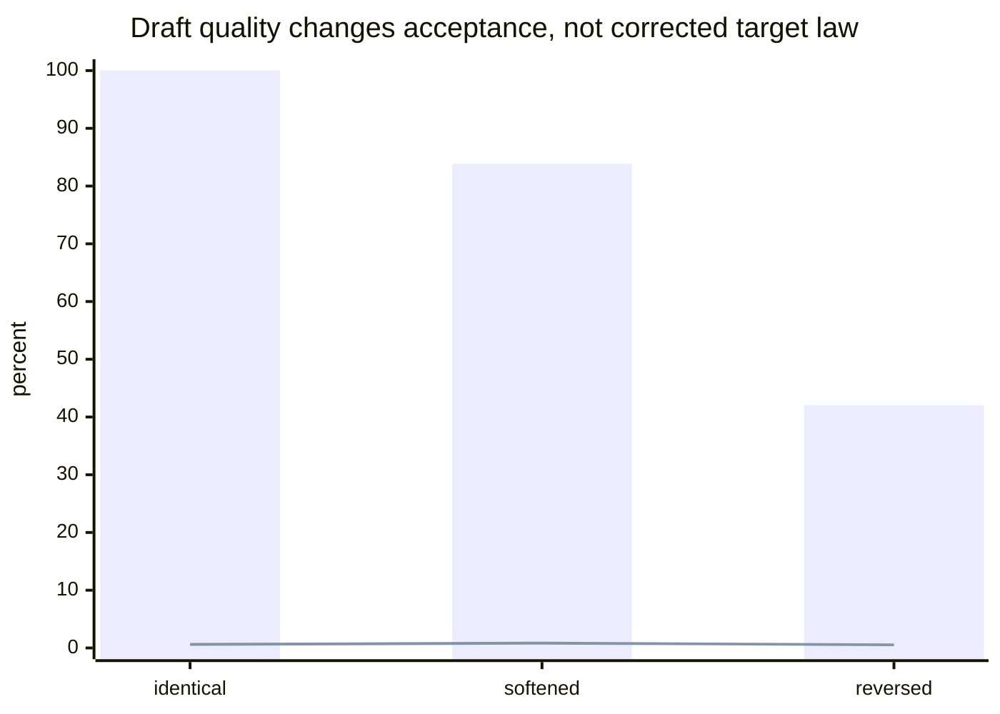

The bars are acceptance percentage. The line is maximum corrected probability
error in percentage points, not rejection rate. The reversed draft forces
5,795 corrections, yet its output error is 0.543 percentage points. A test that
never rejects cannot prove correction behavior.

## What each implementation layer owns

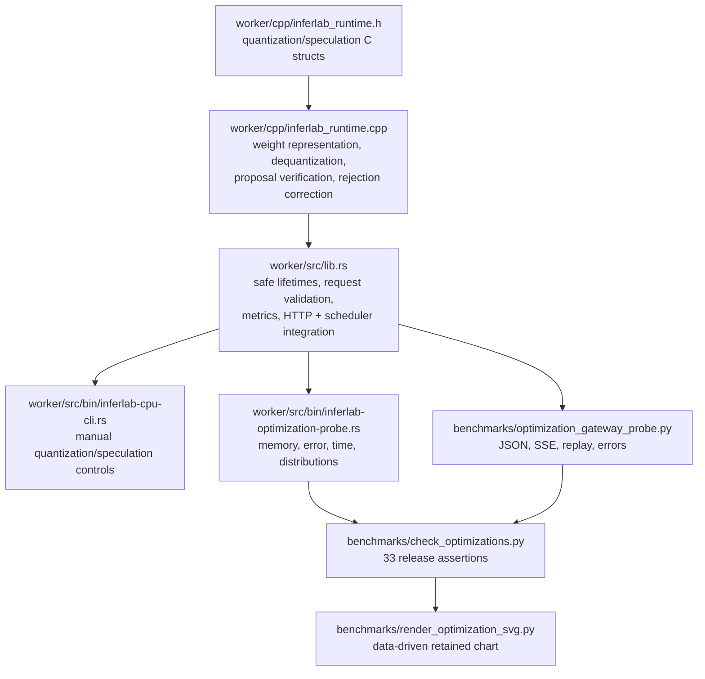

Suggested code-reading order:

1. Read `LinearWeight::from_fp32` and `LinearWeight::at`. Write down which
   vector is non-empty in each mode.
2. Read `Model::quantization_stats`. Reproduce the 2,936 and 2,700 linear-byte
   totals by hand.
3. Read `Session::plan_speculative`. Mark proposal generation, target batch,
   greedy branch, sampled branch, bonus token, and buffer append.
4. Read the Rust session constructor checks. Find the window-eight and
   text-only boundaries.
5. Read the optimization probe. Separate exact assertions from 10,000-sample
   statistical assertions.
6. Read the checker last. It is the machine-readable definition of “v0.11 is
   complete,” not the implementation.

## Experiments you can run

Build once:

```bash
cargo build --workspace
```

### 1. Compare active representations

```bash
for mode in fp32 int8 int4; do
  cargo run -p cpu-worker --bin inferlab-cpu-cli -- \
    --model models/tiny-inferlab-v2.bin \
    --prompt "teach me streaming" --max-tokens 8 \
    --quantization "$mode" --output "/tmp/$mode.json"
done
```

Inspect `model.quantization`, token IDs, and step logits. Predict the byte order
and error order before opening the files.

### 2. Change the speculative window

```bash
for window in 1 2 3; do
  cargo run -p cpu-worker --bin inferlab-cpu-cli -- \
    --model models/tiny-inferlab-v2.bin \
    --prompt "teach me streaming" --max-tokens 8 \
    --quantization fp32 --draft-quantization int8 \
    --speculative-tokens "$window" \
    --output "/tmp/spec-$window.json"
done
```

Compare `target_forward_calls`, `draft_forward_calls`, accepted tokens, and
wall time. Do not predict latency only from target calls.

### 3. Compare INT8 and INT4 drafts

Keep the target FP32 and window three, then change only
`--draft-quantization`. Ask:

- Does greedy text change?
- Does acceptance change?
- Does active draft payload change?
- Does median time move consistently over repeated runs?

This isolates representation from verification policy.

### 4. Exercise sampled replay

Add `--temperature 2 --seed 7007` and run the same speculative command twice.
The two runs should replay. Change the seed and expect a legal target-distributed
sample, not necessarily a different string.

### 5. Trigger validation boundaries

- Request `--speculative-tokens 9`: reject the window.
- Request speculation without a draft in the API: reject the pairing.
- Combine speculation with JSON schema: reject before generation.
- Set speculation to zero: use the ordinary target path.

A validation error is evidence that an unsupported combination cannot silently
weaken correctness.

### 6. Run the focused probe

```bash
cargo run -p cpu-worker --bin inferlab-optimization-probe -- \
  --model models/tiny-inferlab-v2.bin \
  --repetitions 101 --samples 10000 \
  --output /tmp/optimization-probe.json
```

Find one exact result, one numerical-tolerance result, one statistical result,
and one performance observation. They require different interpretations.

### 7. Run the complete release proof

```bash
INFERLAB_ORACLE_PYTHON=.tools/v0.7-python/bin/python \
  ./scripts/proof-v0.11.sh
```

The proof regenerates and byte-compares both checkpoints, builds the workspace,
checks FP32/PyTorch parity, profiles FP32/INT8/INT4, runs real and synthetic
speculation distributions, starts FP32 and INT4 workers plus a gateway,
reconstructs SSE, checks the structured error boundary, evaluates 33
assertions, and renders the chart from retained JSON.

## How to diagnose a surprising result

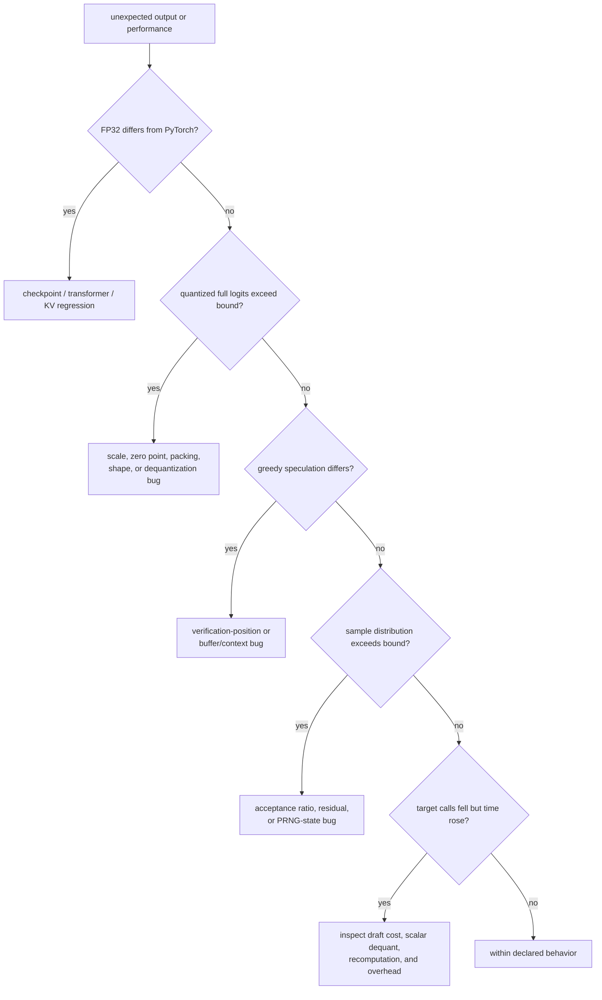

“Output changed” is not a diagnosis. First decide whether the failure belongs
to the FP32 oracle, quantized representation, verification positions, sampled
correction, or cost model.

## Limitations by approach

| Approach | What v0.11 establishes | What it does not establish |
|---|---|---|
| Per-row INT8 | Exact storage layout, bounded logit drift, greedy preservation | Production INT8 kernel speed or task quality |
| Groupwise INT4 | Packing, affine metadata, exact byte accounting, bounded drift | AWQ/GPTQ quality, optimal group size, 4-bit activations |
| Greedy speculation | Longest target-matching prefix and fewer target calls | Sampled-distribution correctness by itself |
| Rejection speculation | Target-law preservation under forced poor drafts | Cross-engine sequence identity or proof over all seeds |
| Buffered streaming | Existing one-token SSE shape | Zero compute burst or perfect scheduler fairness |
| Same-architecture draft | Integrated API and acceptance mechanics | A cheap production draft or latency win |
| `forward_all` verification | One target invocation per proposal cycle | KV-aware batched verification efficiency |

## What v0.11 proves—and what it does not

It proves:

- exact active payload and metadata accounting for all three modes;
- quantized full-logit error within declared bounds and no greedy mismatch over
  the retained trace;
- continued FP32/PyTorch parity;
- exact greedy target equivalence through worker and gateway;
- 75% fewer target calls for accepted three-token drafts;
- sampled output within one percentage point of the target distribution for
  real quantized drafts;
- rejection correction within one percentage point under thousands of forced
  rejections;
- deterministic same-configuration replay;
- preservation of non-streaming and SSE behavior; and
- pre-stream rejection of unsupported structured speculation.

It does **not** prove:

- useful-model or corpus quality;
- process-level memory reduction equal to tensor-payload reduction;
- production tokens/second improvement from INT8 or INT4;
- speculative latency or throughput improvement;
- a small trained draft model;
- efficient reuse of paged KV state during multi-token verification;
- structured speculative decoding;
- performance portability to another machine; or
- compatibility with another engine's quantization or PRNG conventions.

## What this phase changes in our learning journey

Before v0.11, “optimization” could sound like a synonym for “faster.” This
phase separates four layers:

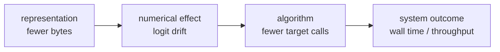

An improvement can succeed at one layer and fail at the next. INT4 uses fewer
bytes but still dequantizes through scalar float operations. Speculation uses
fewer target calls but adds an expensive same-size draft and recomputation.
That is not an embarrassing result; it is the precise answer the experiment
was designed to reveal.

## Check your understanding

1. Why is the INT4 model-wide payload only 2.01× smaller, not 8×?
2. What does an INT4 zero point represent, and why does INT8 omit one?
3. Why is a matching greedy sentence weaker evidence than full-logit error?
4. Which target output position verifies the first proposal?
5. Why does sampled speculation use a probability ratio instead of argmax?
6. What probability mass does the residual correction sample?
7. Why can 100% acceptance still be weak evidence for rejection correctness?
8. How can target calls fall 75% while latency becomes roughly four times
   worse?
9. Why is greedy-path perplexity not corpus perplexity?
10. Which implementation changes would be needed before claiming a real
    speculative speedup?

If you can draw the FP32-island memory composition, explain one rejection, and
separate target-call count from wall time, you understand this phase without
memorizing the code.
