# Phase 17: See attention without reading all the code

This phase adds exact **tiled online-softmax causal attention** to the real CPU
decoder. The long name is easier when split into four ideas:

- **causal attention** decides which earlier tokens matter to the current token;
- **tiled** means the algorithm handles bounded blocks instead of one giant
  intermediate;
- **online softmax** means it updates the correct normalized answer as each
  block arrives; and
- **CPU** names where this teaching implementation actually ran.

It is not yet a CUDA kernel and it is not honest to call it FlashAttention.
The recurrence learned here is the foundation that a later GPU kernel will map
onto shared memory and GPU threads.

## RFC versus learning document

**RFC** means **Request for Comments**. An RFC is the engineering decision:
what problem was selected, which design won, which alternatives lost, what must
always remain true, and what the proof does not establish.

A learning document is the mental simulator. It helps you imagine a request,
expands the vocabulary, gives you small experiments, and tells you where to
look when you eventually open the code.

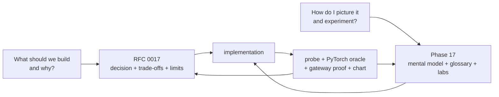

## The one-sentence mental model

For every query token, attention scores the legal earlier tokens, converts the
scores into weights that sum to one, and mixes their value vectors; the online
version produces the same result while remembering only one tile and a small
running summary.

## First imagine the complete request

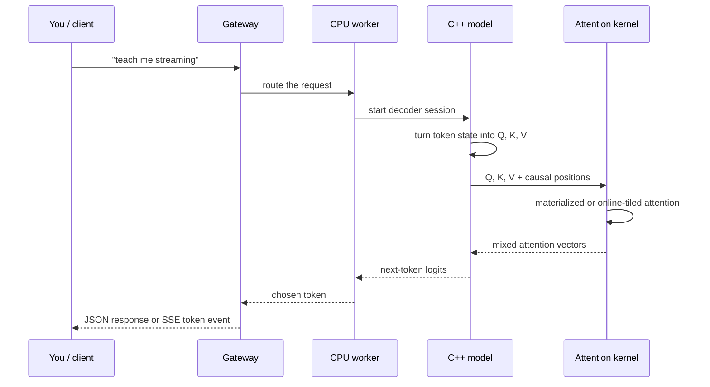

Attention is inside the model forward pass. The gateway does not calculate it;
it only chooses a worker and forwards bytes. The worker health response tells
you whether that model was loaded with `materialized` or `online-tiled`.

## Q, K, and V as a concrete story

Imagine a tiny prompt:

```text
the  animal  did  not  cross  because  it  was  tired
```

When processing `it`, one attention head may ask which earlier noun `it` refers
to.

- The **query (Q)** for `it` encodes what it wants to find.
- Each earlier token's **key (K)** encodes what it can be matched by.
- Each earlier token's **value (V)** is the information it can contribute.

The query-key dot product produces a score. Softmax turns all legal scores into
weights. The output is a weighted mixture of values.

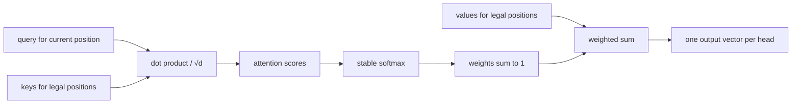

The synthetic InferLab checkpoint has not learned pronouns or useful language;
the story explains the mechanism, not this tiny model's intelligence.

## What “causal” means

During generation, a token may use itself and the past but not the future. For
four positions, the legal region is a lower triangle:

| Query \ Key | token 0 | token 1 | token 2 | token 3 |
|---|:---:|:---:|:---:|:---:|
| token 0 | read | blocked | blocked | blocked |
| token 1 | read | read | blocked | blocked |
| token 2 | read | read | read | blocked |
| token 3 | read | read | read | read |

This is the **causal mask**. Without it, training or full-sequence inference
could leak future answers into earlier positions. In the retained probe, every
future key and value is changed for query zero; both algorithms produce exactly
the same output as before the change.

## Why the simple algorithm uses a lot of temporary memory

Suppose there are `T` tokens and `H` heads. The simple path creates a score for
every query/key/head combination:

```text
score matrix elements = T × H × T
score bytes            = T × H × T × 4      (FP32)
```

The useful causal half is triangular, but the baseline still allocates the
rectangular matrix and fills blocked cells with negative infinity.

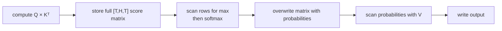

At 256 tokens and four heads, that score buffer is 1 MiB. At twice the sequence
length it becomes four times as large. This is **quadratic growth**.

## What a tile is

A tile is a bounded block. With a tile size of four, eleven key/value positions
arrive as:

```text
tile 0: positions 0–3
tile 1: positions 4–7
tile 2: positions 8–10   (edge tile: only three valid positions)
```

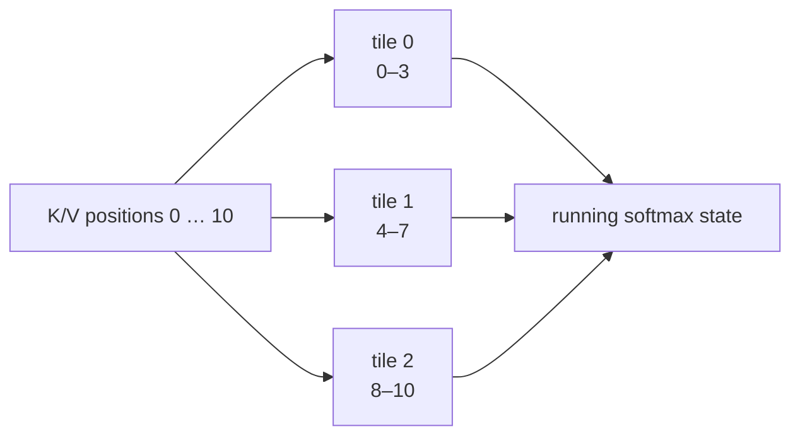

An **edge tile** is simply the final partial tile. A **causal edge tile** may be
partial for another reason: the current query is not allowed to read all of it.

## The problem online softmax must solve

Softmax normally needs the largest score from the complete row:

```text
probability[i] = exp(score[i] - maximum) / sum(exp(score[j] - maximum))
```

Subtracting the maximum prevents exponential overflow. But if scores arrive in
tiles, the final maximum is unknown when the first tile is processed.

The solution is to keep three pieces of state:

| Symbol | Name | What it remembers |
|---|---|---|
| `m` | running maximum | largest score seen so far |
| `l` | running normalizer/denominator | sum of exponentials expressed relative to `m` |
| `n` | running numerator | weighted value-vector sum expressed relative to `m` |

When a later tile has a larger maximum, the old `l` and `n` are rescaled before
the new tile is added.

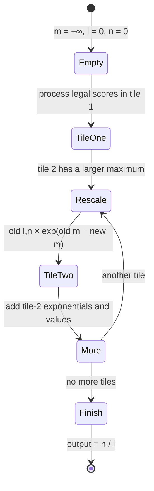

## A small numerical movie

Assume four scores arrive as two tiles: `[1, 2]`, then `[5, 4]`.

After the first tile:

```text
m = 2
l = exp(1−2) + exp(2−2)
  = 0.3679 + 1
  = 1.3679
```

The second tile contains a new maximum, 5. Old state is on the scale of 2, so
it must move to the scale of 5:

```text
old scale factor = exp(2−5) = 0.0498
rescaled old l   = 1.3679 × 0.0498 = 0.0681
new tile l       = exp(5−5) + exp(4−5) = 1.3679
combined l       = 1.4360
```

Calculating the complete row relative to 5 gives the same denominator:

```text
exp(1−5) + exp(2−5) + exp(5−5) + exp(4−5) = 1.4360
```

The vector numerator `n` is rescaled in exactly the same way. That is why the
final `n/l` is independent of the tile boundary.

## What memory disappears—and what does not

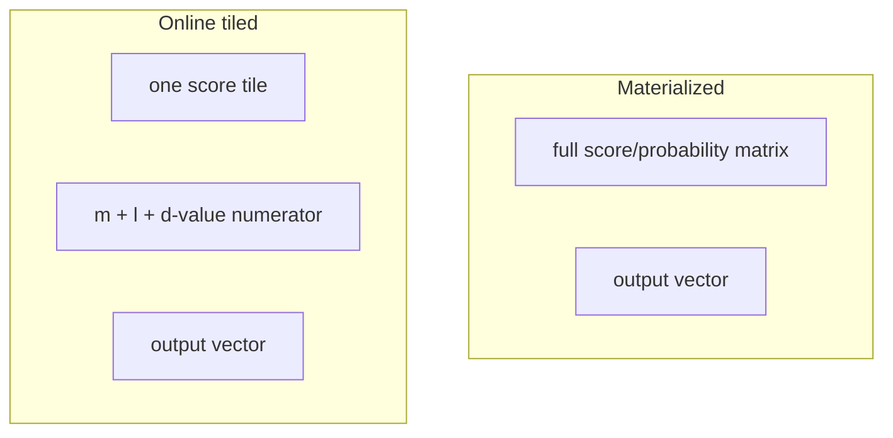

For the retained 256-token, four-head, dimension-32 experiment:

| Quantity | Materialized | Online tiled | Meaning |
|---|---:|---:|---|
| Score scratch | 1,048,576 B | 128 B | complete matrix versus 32 FP32 scores |
| Counted kernel working set | 1,048,576 B | 256 B | score scratch plus 32-value numerator |
| Modeled external traffic | 4.50 MiB | 2.25 MiB | idealized schedule-level movement |

The 8,192× figure is specifically **score scratch**, not total process memory.
Q, K, V, model weights, KV cache, output, vectors, allocator bookkeeping, Rust
state, and gateway memory still exist.

## Traffic model versus measurement

This distinction is one of the most important lessons in the phase:

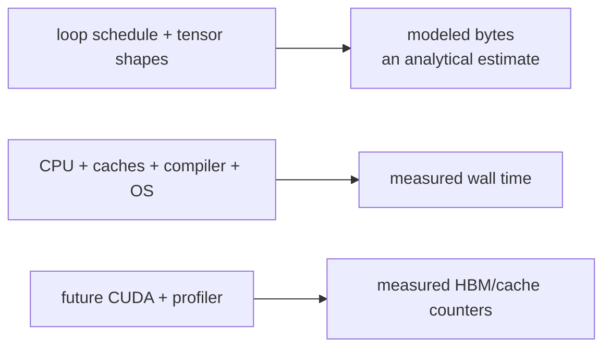

- **Modeled traffic** counts bytes implied by declared data-reuse assumptions.
- **Wall time** measures the complete host execution duration.
- **Hardware counters** ask the memory system what actually moved; v0.12 has no
  CUDA/HBM counters.

The model assumes K/V loaded for one query tile can be reused from CPU cache.
That is plausible schedule reasoning, not proof that every byte moved exactly
once. The retained wall-time result is separate: online tiled is about 2.2×
faster at 256 tokens on this Apple M4 Pro scalar experiment.

## Precision: what FP32, FP16, and BF16 mean here

**FP** means floating point. The number names refer to stored bit width.

- **FP32** has 32 total bits and is the accumulation format in every mode.
- **FP16** has a smaller exponent and more fraction bits than BF16 at the same
  16-bit width; it often preserves nearby detail but has less numeric range.
- **BF16** keeps the FP32-sized exponent field but fewer fraction bits; it has
  broad range but coarser precision.

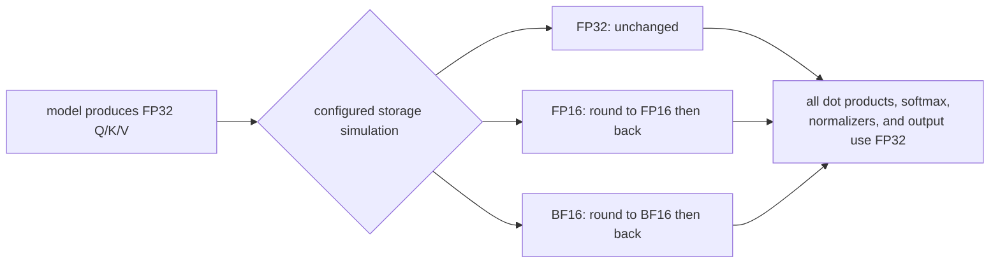

These are **storage simulations**, not packed accelerator buffers. Rounded
values are held in host `float` vectors, so numerical drift is real but actual
process allocation is still four bytes per prepared value. The nominal traffic
model counts two-byte storage for FP16/BF16; no 16-bit throughput claim is made.

Retained maximum drift from the FP32 output:

| Storage mode | Maximum output drift |
|---|---:|
| FP32 | approximately `6e-8` from evaluation order |
| FP16 | `0.000199139` |
| BF16 | `0.001946092` |

Every result is independently reconstructed by PyTorch at the matching storage
precision. The maximum C++/PyTorch difference is `1.1553e-7`.

## How to read the retained chart


Read the four panels in this order:

1. Score scratch: blue grows quadratically; green stays at one 32-score tile.
2. Modeled traffic: both grow, but the online schedule is half the model at the
   retained sizes.
3. CPU time: online is faster here, but the chart labels it host-specific.
4. Precision drift: FP16 is closer than BF16 for this fixture; both use FP32
   accumulation.

The chart does not show total model memory, GPU throughput, HBM counters, or
production model quality because the experiment did not measure them.

## Why this approach won

| Possible approach | Decision | Reason |
|---|---|---|
| Keep full matrix only | baseline retained | easiest independent native comparison, but quadratic scratch remains |
| Tile compute but store every score | rejected | tiling alone does not remove the matrix |
| Online softmax with running max | selected | exact answer, stable exponentials, bounded score scratch |
| Never rescale old online state | rejected | later larger scores make the answer tile-order dependent |
| Sliding-window/sparse attention | rejected here | changes model semantics by dropping legal keys |
| Use a library kernel immediately | deferred | hides the recurrence and ownership boundary this phase teaches |
| Write CUDA without CUDA hardware | deferred to v1.0 | cannot locally prove execution, memory safety, counters, or speed |
| Call the CPU code FlashAttention | rejected | it lacks the GPU memory hierarchy and fused CUDA realization |

## Limitations ladder

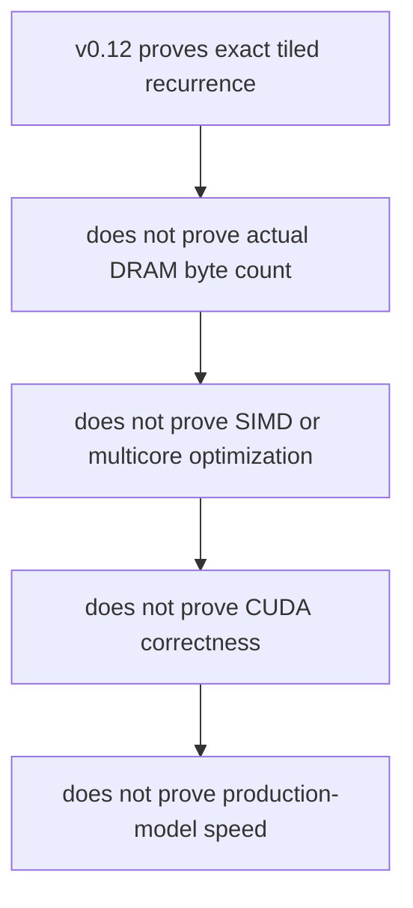

| We measured or proved | We did not prove |
|---|---|
| Causal isolation | every possible shape or attention variant |
| Six-variant PyTorch agreement | bit-identical outputs across all engines |
| Real score-scratch allocation | total process RSS reduction of 8,192× |
| Analytical traffic model | hardware DRAM/HBM counter reduction |
| Apple M4 Pro scalar timing | NVIDIA, Metal, server CPU, or production timing |
| Real worker/gateway output equality | useful language-model quality |
| Nominal FP16/BF16 storage drift | packed 16-bit memory or throughput |

## Code map: read only what answers your question

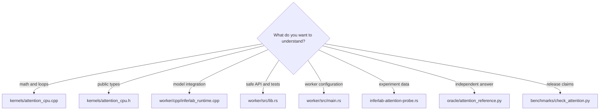

If you want the smallest useful code-reading path, use this order:

1. `AttentionConfig` and `AttentionStats` in `kernels/attention_cpu.h`;
2. `materialized_attention` in `kernels/attention_cpu.cpp`;
3. `online_tiled_attention` immediately below it;
4. the three attention tests near the end of `worker/src/lib.rs`; and
5. the assertions in `benchmarks/check_attention.py`.

You do not need to read gateway routing, Raft, the durable batch queue, or old
resilience code to understand this phase.

## What you can do without changing code

### 1. Re-run the complete proof

```bash
INFERLAB_ORACLE_PYTHON=.tools/v0.7-python/bin/python \
  ./scripts/proof-v0.12.sh
```

Predict first: all 21 assertions should pass; both workers should return the
same completion; the checker must never claim CUDA was executed.

### 2. Compare tile sizes

```bash
cargo run -p cpu-worker --bin inferlab-attention-probe -- \
  --repetitions 31 --tile-tokens 8 --output /tmp/attention-tile-8.json

cargo run -p cpu-worker --bin inferlab-attention-probe -- \
  --repetitions 31 --tile-tokens 64 --output /tmp/attention-tile-64.json

jq '.sequence_scaling[] | {
  tokens,
  online: (.profiles[] | select(.algorithm == "online-tiled") |
    {median_us, score_buffer_bytes: .stats.score_buffer_bytes,
     key_tiles: .stats.key_tiles})
}' /tmp/attention-tile-8.json
```

Prediction: score scratch grows linearly with tile size, key-tile visits fall as
tiles grow, and wall time may have a non-monotonic optimum because cache reuse
and loop overhead compete.

### 3. Run the real worker with the online kernel

```bash
INFERLAB_CPU_WORKER_ID=cpu-attention-online \
INFERLAB_CPU_BIND=127.0.0.1:9101 \
INFERLAB_MODEL_PATH=models/tiny-inferlab-v2.bin \
INFERLAB_CPU_ATTENTION_KERNEL=online-tiled \
INFERLAB_CPU_ATTENTION_PRECISION=fp32 \
INFERLAB_CPU_ATTENTION_TILE_TOKENS=32 \
  cargo run -p cpu-worker
```

In another terminal:

```bash
curl -s http://127.0.0.1:9101/health | jq '.model.attention'
```

You should see the selected algorithm, precision, tile size, and causal flag.

### 4. Inspect one retained claim

```bash
jq '{
  passed,
  maximum_oracle_error,
  score_scratch_reduction_at_256x,
  modeled_traffic_reduction_at_256x,
  observed_wall_time_speedup_at_256x
}' docs/results/v0.12/raw/attention-check.json
```

Then open the corresponding assertion list. Every headline number should be
traceable to raw JSON rather than copied only into prose.

## What you can change in code

Start with changes whose predicted effect is clear:

1. Add tile sizes 1, 2, 16, 128, and 256 to your experiment and plot scratch,
   tile visits, and median time.
2. Add a non-causal probe fixture and verify that future changes now affect the
   output by design.
3. Add random deterministic shapes, including query length one and partial edge
   tiles, and compare every result with PyTorch.
4. Count numerator bytes, score bytes, and nominal input bytes separately in the
   renderer so the “working set” composition is visible.
5. Add an actual CPU cache-counter experiment if your host tooling supports it;
   keep that result separate from the analytical byte model.
6. Add a Metal backend as a new, independently named milestone rather than
   silently treating Metal evidence as CUDA evidence.

For any change, follow the same loop:

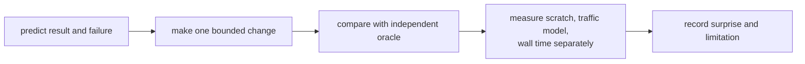

## Glossary

| Term | Plain meaning |
|---|---|
| RFC | Request for Comments; a reviewable engineering decision record. |
| Attention | Weighted retrieval from token representations. |
| Self-attention | Queries, keys, and values come from the same sequence. |
| Causal | A position cannot use future positions. |
| Q / K / V | Query asks, key matches, value contributes information. |
| Dot product | Multiply corresponding vector entries and add them. |
| Scaled dot product | Dot product divided by `sqrt(head dimension)` to control score magnitude. |
| Head | One independent attention channel. |
| Softmax | Converts scores into positive normalized weights. |
| Stable softmax | Subtracts a maximum before exponentiation. |
| Materialize | Allocate and store a complete intermediate. |
| Online algorithm | Updates a final result as input chunks arrive. It does not mean “over the internet.” |
| Tile / block | Bounded subset processed together. |
| Edge tile | Final or causal partial block. |
| Running maximum `m` | Largest score processed so far. |
| Normalizer `l` | Running sum of exponentials on the current maximum's scale. |
| Numerator `n` | Running exponential-weighted value vector. |
| Scratch buffer | Temporary memory owned while a kernel runs. |
| Working set | Data the inner algorithm wants active at one time; not total process memory. |
| Cache | Fast CPU memory that may retain recently used data. |
| DRAM | Main host memory. |
| HBM | High-bandwidth memory commonly used by GPUs. Not measured here. |
| SRAM/shared memory | Small fast on-chip GPU storage. Deferred to CUDA v1.0. |
| IO-aware | Designs execution around data movement between memory levels. |
| FP32 / FP16 / BF16 | Floating-point storage formats with 32, 16, and 16 bits. |
| Accumulator | Variable that holds a running sum. FP32 here. |
| ABI | Application Binary Interface; how compiled Rust and C++ exchange values. |
| FFI | Foreign Function Interface; Rust declarations that call the C ABI. |
| SIMD | CPU instruction style applying one operation to multiple values. Not explicitly implemented. |
| SSE streaming | Server-Sent Events over HTTP. It is unrelated to the CPU instruction-set use of “SSE.” |
| Oracle | Independent implementation used as a correctness reference; PyTorch here. |
| Tolerance | Maximum permitted numerical difference between floating-point implementations. |
| Median | Middle timing observation after sorting. |
| P95 | Timing at the 95th percentile; 95% of observations are no slower. |
| Hardware counter | Processor measurement of real cache, memory, or instruction events. |
| FlashAttention | Exact IO-aware GPU attention family; an inspiration, not the name of this CPU kernel. |

## Check your understanding

1. Why does the materialized score buffer grow with `T²`?
2. Which three values let online softmax discard an old score tile?
3. Why must old state be rescaled when a later maximum is larger?
4. Why does causal masking happen before a score enters online state?
5. What exactly is 8,192× smaller, and what is not?
6. Why is modeled external traffic not a hardware measurement?
7. Why does simulated FP16 drift numerically without reducing actual prepared
   vector allocation?
8. How can two algorithms produce the same tokens while their logits differ by
   a tiny amount?
9. Which evidence proves that the real worker uses the selected kernel?
10. What must v1.0 add before the project may claim a CUDA attention kernel?

If you can draw the causal triangle, narrate `m/l/n` across two tiles, and
separate scratch bytes, modeled traffic, measured time, and GPU claims, you
understand this phase without memorizing the code.

Next, [Phase 18](phase-18-real-worker-full-stack-integration.md) zooms back out:
the same real online-attention worker is placed behind Raft-controlled routing,
then worker and leader faults are injected while request revisions and token
responses remain observable.
