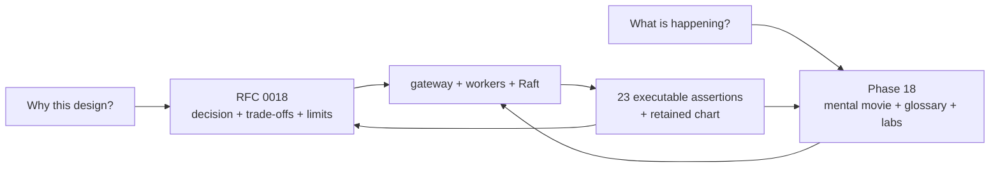
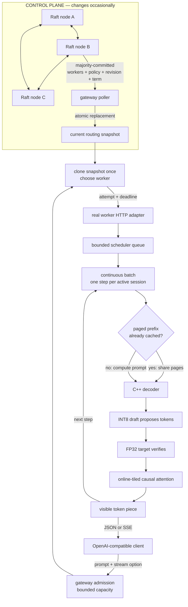
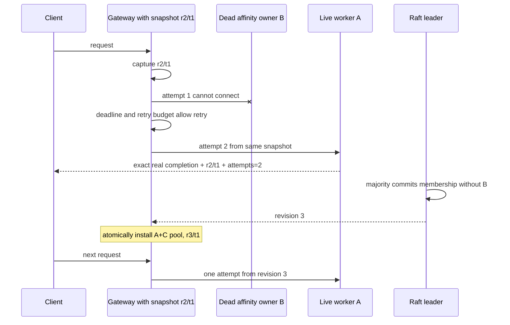
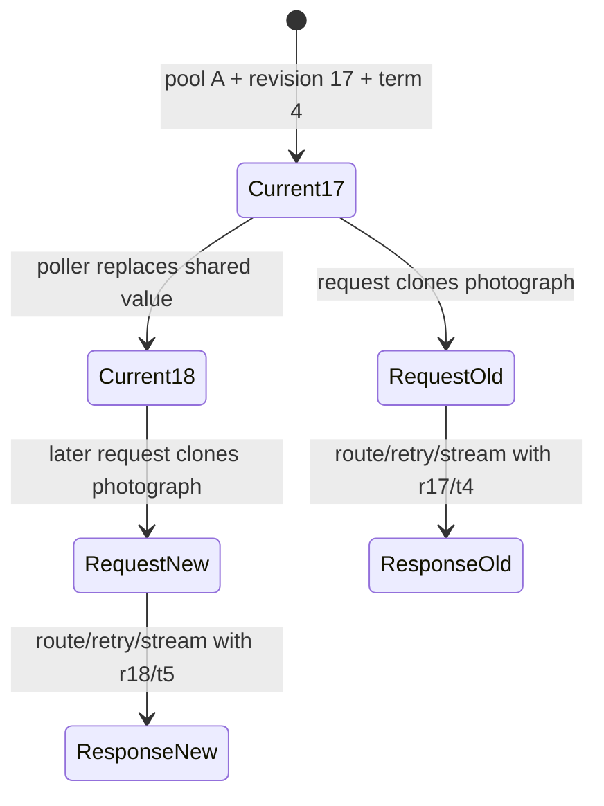
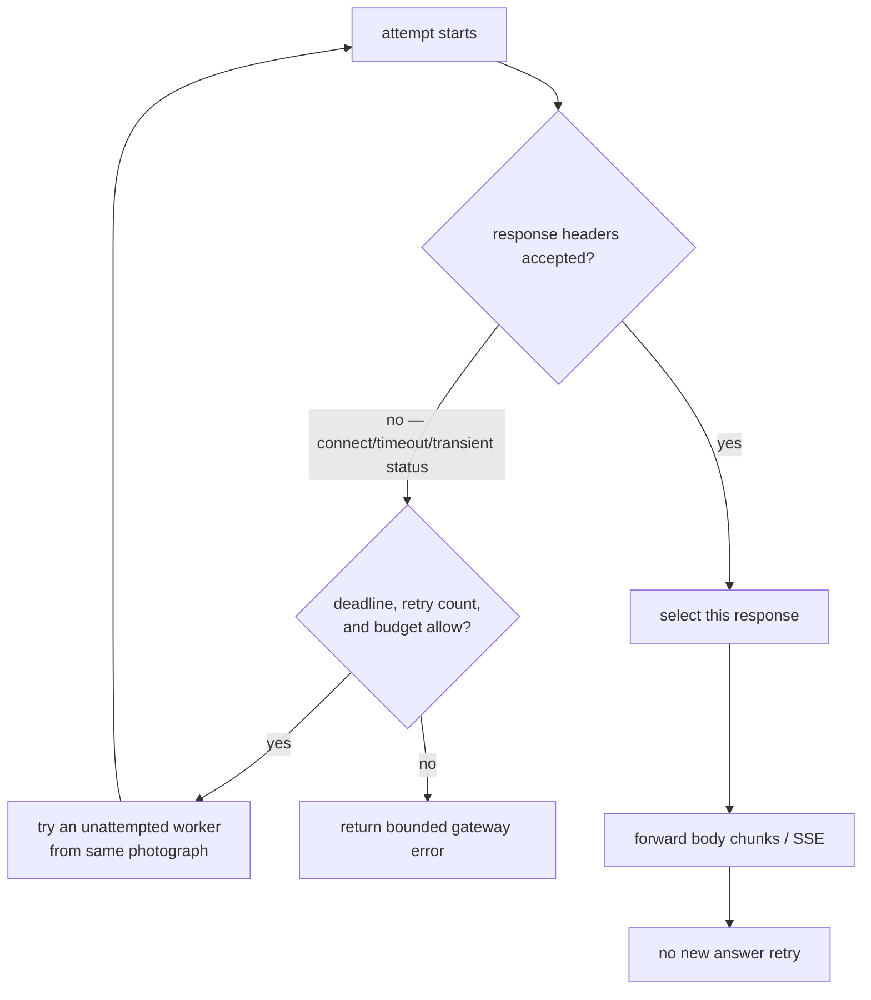
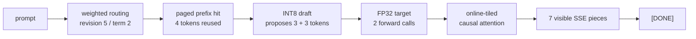

# Phase 18: See the whole InferLab request without reading all the code

This phase connects the two journeys you have already built:

- **distributed serving:** admission, routing, affinity, retries, circuits, and
  Raft configuration; and
- **inference runtime:** a real decoder, continuous scheduling, paged KV cache,
  prefix reuse, sampling, quantization, speculation, and online attention.

Nothing here asks you to memorize all of those implementations at once. The
goal is to picture who decides what, when a decision can change, and what stays
alive when a worker or leader disappears.

## RFC versus learning document

**RFC** means **Request for Comments**. RFC 0018 is the engineering contract: it
records the selected snapshot design, rejected alternatives, invariants,
evidence, and limitations.

This learning document is the movie. It names each actor, shows the request
moving between them, and gives you small controls to pull so that the concepts
become visible.



## The one-sentence mental model

**Raft publishes a route map; the gateway photographs that map once per
request; the chosen real worker turns the prompt into tokens; failures may
change the next photograph, but never rewrite the photograph already carried by
an in-flight request.**

Think of it as a railway:

- Raft is the planning office that publishes a numbered timetable.
- The gateway poller brings the newest committed timetable to the station.
- A request gets one printed copy when its journey begins.
- The gateway chooses a train/worker using that copy.
- If the train has not accepted the passenger, the gateway may try another
  listed train.
- Once the train has departed and token events reach the client, the journey is
  not restarted with a different answer.
- A new timetable affects new passengers; it does not alter paper already in a
  passenger's hand.

## The complete picture



The control plane points toward the gateway snapshot, not toward the model
loop. That is why a leader election does not pause token generation.

## What every technical term stands for

| Term | Plain-language meaning | What you can observe |
|---|---|---|
| **Control plane** | The part that agrees on slow-changing configuration. | Raft leader, term, committed revision. |
| **Data plane** | The part that serves actual user traffic. | Gateway request and token stream. |
| **Raft** | A consensus algorithm that elects one leader per term and commits log entries through a majority. | Three processes, leader kill, replacement leader. |
| **Term** | A numbered Raft leadership era. | `x-inferlab-config-term`. |
| **Revision** | The committed log position of a routing configuration. | `x-inferlab-config-revision`. |
| **Routing snapshot** | Worker pool + revision + term captured as one immutable value. | `/internal/workers.routing_snapshot`. |
| **Atomic replacement** | Readers see the complete old snapshot or complete new snapshot, never a mixture. | Integration test swaps snapshots during a slow request. |
| **Fence/header** | A label proving which snapshot the response used. | Revision and term response headers. |
| **Consistent hash** | Stable key-to-worker mapping that limits remapping when membership changes. | Same cache key reaches the same worker. |
| **Prefix affinity** | Route a repeated prompt toward the worker that may already own its prefix cache. | First request misses; second hits. |
| **KV cache** | Stored attention keys and values for tokens already processed. | Reused prefix token/page metrics. |
| **Paged cache** | KV memory split into fixed pages referenced through a block table. | Page counts, sharing, copy-on-write. |
| **Continuous batching** | Rebuild the active batch every generation step so finished slots can be refilled. | Scheduler health/trace metrics. |
| **Online attention** | Exact softmax accumulated tile by tile without the full score matrix. | Worker health says `online-tiled`. |
| **Quantized draft** | Smaller INT8 model state used to propose tokens cheaply. | Draft quantization and proposal counts. |
| **Speculative decoding** | Draft proposes; target model verifies a group of tokens. | Six accepted draft tokens, two target calls. |
| **Retry** | A new worker attempt before a response has begun. | `x-inferlab-attempts: 2`. |
| **Circuit breaker** | Per-worker memory that temporarily stops routing into repeated failure. | `/internal/workers.workers[].circuit`. |
| **SSE** | Server-Sent Events: text-framed incremental response events. | Token pieces followed by `data: [DONE]`. |

## Movie 1: a healthy repeated request

```mermaid
sequenceDiagram
    participant C as Client
    participant G as Gateway
    participant S as Snapshot r2/t1
    participant B as cpu-real-b
    participant Cache as B paged prefix cache
    participant Model as Real decoder

    C->>G: prompt + cache key
    G->>S: clone once
    G->>B: consistent-hash selection
    B->>Cache: look up prefix
    Cache-->>B: miss
    B->>Model: compute prompt + completion
    B-->>C: real completion, prefix_hit=false

    C->>G: same prompt + same cache key
    G->>S: clone once
    G->>B: same hash owner
    B->>Cache: look up prefix
    Cache-->>B: hit; share cached pages
    B->>Model: continue from reused state
    B-->>C: same completion, prefix_hit=true
```

Why both routing and cache matter: a cache entry stored on worker B cannot help
worker A. Consistent hashing does not create the cache; it makes returning to
the likely owner stable.

## Movie 2: the affinity owner dies

The proof discovers which worker actually owns the repeated key, then kills
that exact child process. It does not guess a process name or send a host-wide
signal.



The retry does not preserve the dead worker's cache. It preserves availability
and output correctness by recomputing on a survivor. The later config update
removes the wasted first attempt for new requests.

## Movie 3: the Raft leader dies

```mermaid
sequenceDiagram
    participant C as Clients
    participant G as Gateway holding r3/t1
    participant L as Old Raft leader
    participant M as Remaining majority
    participant W as Real workers A and C

    L-xL: exact leader child is killed
    par data plane
        loop six requests
            C->>G: chat completion
            G->>W: route using installed r3/t1
            W-->>C: real-model success
        end
    and control plane
        M->>M: election; term becomes 2
        M->>M: new leader commits weighted config
        M-->>G: revision 5 / term 2
    end
```

The requests do not need a current leader because they are reading a committed
snapshot already in memory. Writes wait for a leader; ordinary routing does not.

Why revision 5 follows revision 3: the revision is a Raft log position, and the
new leader's current-term establishment can occupy revision 4. Monotonic does
not mean “every visible configuration increments by exactly one.”

## The photograph rule

This is the new implementation idea in v0.13.



The lock is held only long enough to clone the photograph. It is not held while
the model runs or tokens stream. The snapshot owns an `Arc` (atomically
reference-counted pointer) to the old worker pool, so replacing the shared
pointer does not destroy state still used by an earlier request.

### What the rule guarantees

- A response cannot say “revision 18” while having selected from revision 17's
  pool.
- A retry cannot suddenly acquire a worker that did not exist in its captured
  pool.
- A streaming body can outlive a configuration update safely.
- New requests can use the update immediately after installation.

### What it does not guarantee

- Every request instantly uses the newest committed revision.
- Old requests are cancelled when membership changes.
- A dead worker is removed automatically by Raft.
- The reported revision is a security authorization or revocation token.

## Where retries stop



Once bytes can reach the client, replaying a request could generate a second,
different continuation after the client already saw the first. That is why the
fault proof kills a worker before the request establishes a response, and why
post-header behavior remains a separate streaming invariant.

## The final streaming path

The last request deliberately turns several earlier topics on at once:



The retained response is `InferLab turns prompts into real tokens.` All six
draft proposals are accepted in two cycles. That proves the wiring; it does not
prove that speculation is faster. Phase 16 already records the negative timing
result for this tiny scalar model.

## What the retained chart shows


Read it in this order:

1. The top timeline keeps control-plane events, data-plane requests, and faults
   on separate lanes.
2. The left middle panel shows every request phase succeeded.
3. The right middle panel shows which configuration revision each phase carried:
   revision 3 remains usable during leader election, then new traffic advances
   to revision 5.
4. The bottom panel shows deterministic 3:1 weighted routing as six requests to
   the heavy worker and two to the light worker.

## What you can do without reading the whole code

### Lab 1 — run the complete film

```bash
INFERLAB_ORACLE_PYTHON=.tools/v0.7-python/bin/python \
  ./scripts/proof-v0.13.sh
```

Prediction to write first: “Will killing the control-plane leader fail any real
model request?” The proof expects zero of six failures because the gateway keeps
revision 3.

### Lab 2 — inspect only the release verdict

```bash
python3 benchmarks/check_full_stack.py \
  --evidence-dir docs/results/v0.13/raw \
  --output /tmp/inferlab-v0.13-check.json
```

Open the JSON and choose one assertion. Trace only the named input artifact;
you do not need to begin with Rust or C++.

### Lab 3 — follow the revision headers

While a control-plane-configured gateway is running:

```bash
curl -i http://127.0.0.1:9820/v1/chat/completions \
  -H 'content-type: application/json' \
  -d '{"model":"inferlab-tiny","stream":false,"temperature":0,"max_tokens":8,"messages":[{"role":"user","content":"teach me streaming"}]}'
```

Find these four headers: worker, attempts, config revision, and config term.
They answer “where?”, “how many tries?”, and “under which committed map?”

### Lab 4 — change one assumption

Good experiments:

- change weights from `3:1` to `2:1`, then choose a request count divisible by
  three and predict the deterministic distribution;
- increase `INFERLAB_CONTROL_POLL_MS` and predict how long the gateway continues
  using an older but valid revision;
- kill a non-affinity worker and predict whether the warm-prefix request needs a
  retry;
- disable speculative tokens in the final request and compare target forward
  calls, not just wall time;
- send a new prompt after failover and predict `prefix_cache_hit`.

Do not start by randomly changing five settings. One changed cause and one
predicted effect teaches more.

## A low-stress way to start reading the code

Read one vertical slice, in this order:

1. `scripts/proof-v0.13.sh` — the experiment's story and process boundaries.
2. `benchmarks/check_full_stack.py` — the exact claims that must be true.
3. `benchmarks/full_stack_probe.py` — how headers, content, health, and timing
   become JSON.
4. `gateway/src/lib.rs` — search for `RoutingSnapshot`,
   `x-inferlab-config-revision`, and `proxy_chat_completions`.
5. `gateway/src/main.rs` — search for `poll_control_plane` and the atomic write.
6. Only then descend into `worker/` or `control-plane/` for the mechanism that
   interests you.

That path starts from the visible movie, then its claims, then the implementation.

## What this phase taught us

- Component correctness does not automatically prove composition correctness.
- Configuration identity must travel with the object it describes.
- Stale-but-committed data can be the correct availability choice during a
  control-plane election.
- Affinity is useful only when the selected worker owns real reusable state.
- Worker failover preserves service but may sacrifice cache locality.
- Removing a failed worker and retrying around a failed worker are different
  time scales: one handles the current request; the other improves future ones.
- A request header can turn a hidden concurrency choice into inspectable
  evidence.
- A final happy response is weak evidence unless the faults, attempts,
  revisions, and intermediate request outcomes are retained.

## Honest limitations

This is loopback integration with a tiny one-layer teaching model. It does not
measure multi-host partitions, production checkpoint quality, high-concurrency
tail latency, durable gateway restart, automatic health-to-Raft membership,
linearizable reads, Raft log compaction, or GPU performance. The retained host
has no NVIDIA CUDA runtime or compiler, so CUDA remains the v1.0 hardware
boundary.

Those are not footnotes to hide. They tell you exactly which question the next
experiment must answer.

[Phase 19](phase-19-restart-safe-routing-snapshots.md) answers the durable-
gateway-restart part: it persists the last committed route map, restarts while
all Raft nodes are unavailable, reconciles to newer control state, and rejects a
stale rollback.
