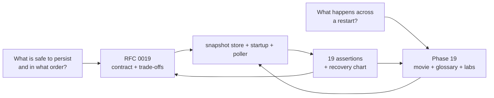
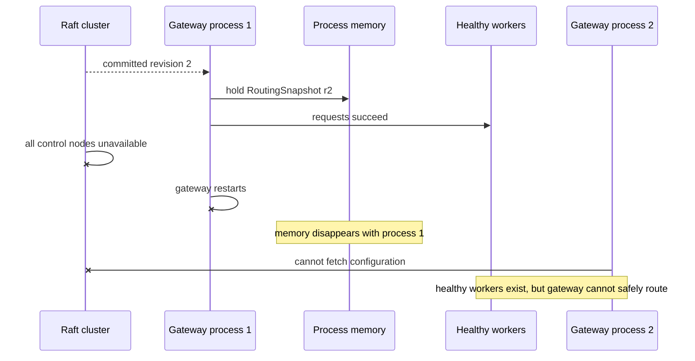
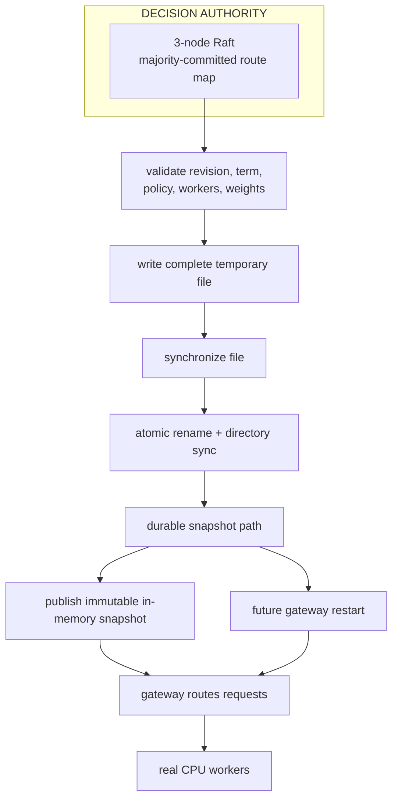
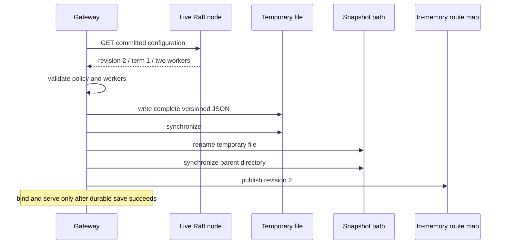
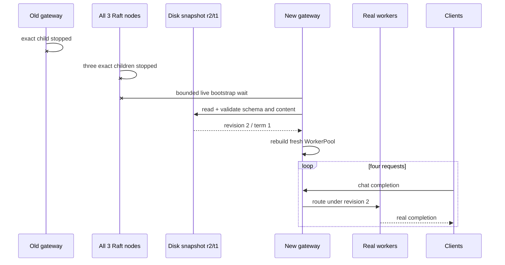
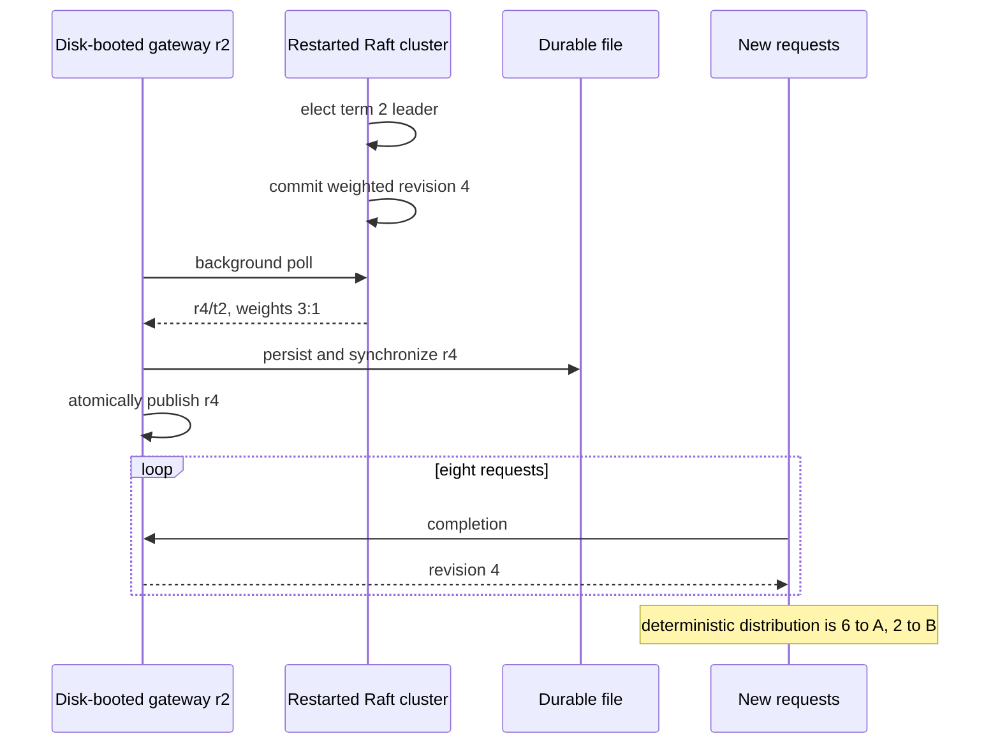
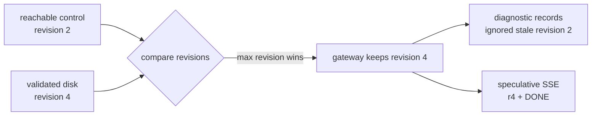
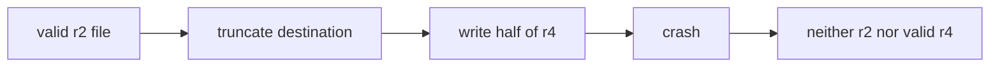
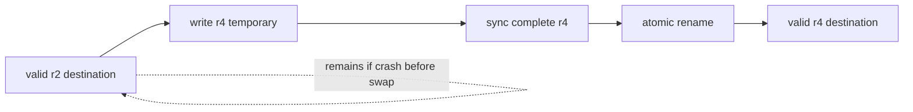

# Phase 19: See a gateway restart without losing the route map

Phase 18 kept requests alive while Raft elected a new leader. Phase 19 asks a
harder question:

> What if the gateway itself restarts while every control-plane node is down?

The workers may still be healthy, but the gateway's in-memory route map has
vanished. This phase gives it one validated, durable copy of the last committed
map, then proves that the copy can restore service without becoming a second
control plane.

## RFC versus learning document

**RFC** means **Request for Comments**. RFC 0019 is the decision contract: file
format, write ordering, bootstrap choice, invariants, rejected alternatives,
evidence, and limitations.

This learning document is the mental simulator. It lets you picture the crash,
the disk write, the restart, and the later reconciliation before opening Rust.



## The one-sentence mental model

**Raft is the office that approves a numbered route map; the gateway keeps one
sealed photocopy, so a new gateway process can temporarily reopen the station
while the office is unreachable.**

The photocopy analogy has important limits:

- it can repeat an already approved route map;
- it cannot approve a new worker or policy;
- a newer approved copy replaces an older one;
- a torn or unreadable copy is not guessed at; and
- when the office returns with an older map, the gateway does not erase its
  newer approved copy.

## What was broken before this phase



Phase 18 solved “control plane down while gateway stays alive.” Phase 19 solves
“control plane down while gateway memory is also gone.”

## The complete picture



The order is the lesson: **commit → validate → persist → publish → serve**.

## What every technical term stands for

| Term | Plain-language meaning | What you can observe |
|---|---|---|
| **Process memory / RAM** | Fast temporary state that disappears when the gateway exits. | The old process's `RoutingSnapshot` is gone after restart. |
| **Durable storage** | State written so it can be read by a later process. | `gateway-routing.json`. |
| **Snapshot** | One complete point-in-time routing document. | Schema, save time, revision, term, policy, workers. |
| **Temporary file** | A separate work file used so the valid destination is not damaged mid-write. | No temporary file remains after successful rename. |
| **`fsync` / synchronize** | Ask the operating system to flush file or directory state toward durable media. | It happens before publication; not directly a latency guarantee. |
| **Atomic rename** | Swap the destination name from complete old content to complete new content. | Readers do not consume a half-written destination. |
| **Bootstrap** | Reconstruct the initial state needed to start serving. | `bootstrap_source` is live or disk. |
| **Reconciliation** | Refresh disk-booted state when control returns. | Revision advances from 2 to 4. |
| **Monotonic revision** | The applied revision may stay equal or increase, never decrease. | Stale live revision 2 cannot replace durable revision 4. |
| **Stale-while-revalidate** | Serve from known state while checking for a newer version. | Four requests succeed while all Raft nodes are down. |
| **Fail closed** | Refuse service rather than route from ambiguous/corrupt identity. | Corrupt disk plus unavailable control exits with code 1. |
| **Authority** | The component allowed to decide new state. | Raft remains authoritative; disk cannot accept writes. |
| **Schema version** | A name describing the document layout and meaning. | `inferlab.gateway-routing-snapshot.v1`. |
| **Term** | The Raft leadership era that committed an entry. | Initial term 1; recovered term 2. |
| **Revision** | Committed log identity of the routing configuration. | Initial r2; updated r4. |

## Movie 1: healthy live startup



Why save before serve? If the gateway advertised revision 2 and crashed before
writing it, the next gateway process could know only revision 1. Publication
would have moved forward while restart state moved backward.

## Movie 2: every control node is offline



Disk restores declarative routing state. It does not restore in-flight leases,
EWMA observations, circuit history, queue positions, or streams from the dead
gateway. Those are process-local and begin fresh.

## Movie 3: control returns with something newer



The process still says `bootstrap_source: disk-snapshot` because that field is
biographical: how did this process start? `source_url`, `last_refresh_ms`, and
`persisted_revision` show what happened afterward.

## Movie 4: a live source is older than disk

The proof saves copies of the original revision-2 Raft directories. After
revision 4 is durable, it deliberately starts the old cluster state again.



Reachable does not mean newer. “Always trust the network” would allow a restored
backup or wrong endpoint to roll the gateway backward.

## How the file survives an interrupted write

Imagine replacing page 2 of a notebook.

### Unsafe: erase and rewrite the only page



### Selected: prepare a complete replacement page



The temporary name is not considered during bootstrap. A successful rename
leaves only the destination; the retained proof observes no leftover temporary
snapshot file.

## What is stored—and what is deliberately rebuilt

| Persisted from Raft | Rebuilt per gateway process |
|---|---|
| routing revision and term | HTTP client connection pool |
| routing policy name | admission permits and queue |
| worker IDs and endpoints | worker leases and in-flight counts |
| worker weights | circuit-breaker windows |
| save timestamp and schema | EWMA observations and exploration counters |
| | retry budget accounting |

Persisting runtime counters would make a restart file much harder to validate
and could resurrect stale ownership. Declarative input is the stable boundary.

## Reading the diagnostics

For an offline disk bootstrap, `/internal/workers` resembles:

```json
{
  "routing_snapshot": {
    "control_revision": 2,
    "control_term": 1
  },
  "control_plane": {
    "bootstrap_source": "disk-snapshot",
    "source_url": null,
    "persisted_revision": 2,
    "last_refresh_ms": null,
    "last_error": "no control-plane node returned a committed configuration"
  }
}
```

This is not contradictory. The routing state is known and committed; its live
freshness cannot currently be confirmed.

## What the retained chart shows


Read it in this order:

1. The top sequence follows live bootstrap, total outage, newer
   reconciliation, and stale-control rejection.
2. The boot-latency panel shows one observed run. Offline startup includes the
   deliberate 150 ms wait for a live source.
3. The revision panel separates what control reports from what disk and the
   gateway retain.
4. The bottom panel proves every real-model phase succeeded and that durable
   reconciliation preserved 3:1 weighted behavior.

## What you can do without reading all the code

### Lab 1 — run the whole restart film

```bash
./scripts/proof-v0.14.sh
```

Before running, predict: “When all Raft nodes are stopped, will the new gateway
process bind, and which revision will its response headers show?”

### Lab 2 — inspect the durable document

Run a control-configured gateway with:

```bash
INFERLAB_ROUTING_SNAPSHOT_PATH=./data/gateway-routing.json \
INFERLAB_CONTROL_PLANE_URLS=http://127.0.0.1:7001 \
  cargo run -p gateway
```

Then inspect the JSON file and `/internal/workers`. Match revision, term, policy,
workers, and `persisted_revision`.

### Lab 3 — change the bounded wait

Set `INFERLAB_CONTROL_BOOTSTRAP_WAIT_MS` to 0, 150, and 1000. Predict the
availability/freshness trade-off:

- shorter wait starts from disk sooner during a real outage;
- shorter wait also gives a merely slow live control plane less chance to
  provide newer state.

Record startup latency and selected revision, not just “it started.”

### Lab 4 — corrupt only the temporary file

Create an incomplete file next to the destination using the temporary naming
pattern, but leave the destination valid. Predict that bootstrap ignores the
temporary file and loads the destination.

Do this only in a throwaway proof directory. The release harness creates its
own temporary directory and cleans exact child processes.

### Lab 5 — make both sources invalid

With control URLs unreachable and the destination JSON truncated, startup must
exit instead of using static fallback workers. Ask yourself why returning 503
is safer than silently routing under an unversioned map.

## A low-stress code-reading path

1. `scripts/proof-v0.14.sh` — see the four phases and exact process boundaries.
2. `benchmarks/check_gateway_restart.py` — read the claims as executable prose.
3. `gateway/src/routing_snapshot_store.rs` — follow `save`, `load`, and
   validation without thinking about HTTP.
4. `gateway/src/main.rs` — search for `bootstrap_control_configuration`, then
   `watch_control_plane`.
5. `gateway/src/lib.rs` — find the diagnostic fields and request-level routing
   snapshot from Phase 18.
6. Return to RFC 0019 alternatives and decide which trade-off you would change.

## What this phase taught us

- A running-process failover proof does not imply restart availability.
- Durability is mainly about write ordering, not the existence of a file.
- Persisted declarative input is safer than serializing live runtime objects.
- “Control is reachable” and “control is newer” are different statements.
- Stale committed state can be useful for reads without becoming authority for
  writes.
- A status page must separate routing identity, durability, bootstrap origin,
  and live freshness.
- Fail-open and fail-closed are not personality choices; they depend on whether
  the fallback carries trustworthy identity.

## Honest limitations

The retained proof uses a macOS local filesystem, loopback processes, and two
tiny CPU workers. It does not simulate sudden power loss, disk-full/permission
errors, network filesystems, concurrent writers, tampering, wrong-cluster
identity, maximum snapshot age, multi-host partitions, or worker death during
offline bootstrap. The document has validation but no checksum, signature,
encryption, or cluster ID.

Disk is a restart cache, not consensus. If you can explain that sentence, draw
the temp-sync-rename-publish order, and predict why live revision 2 cannot
replace disk revision 4, you understand this phase without memorizing the code.
