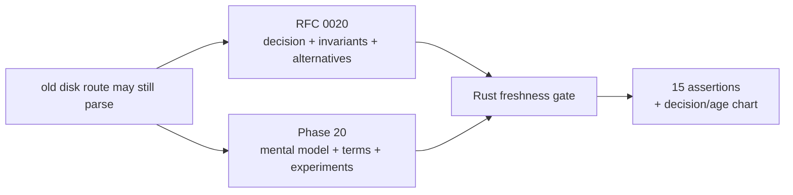
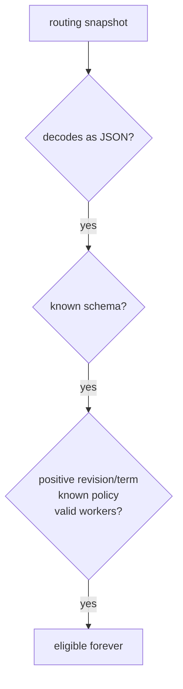
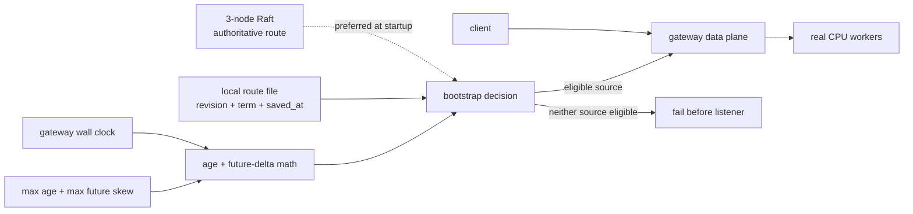
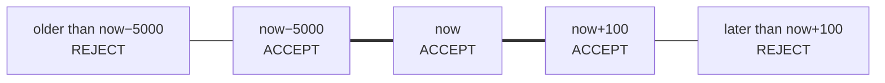
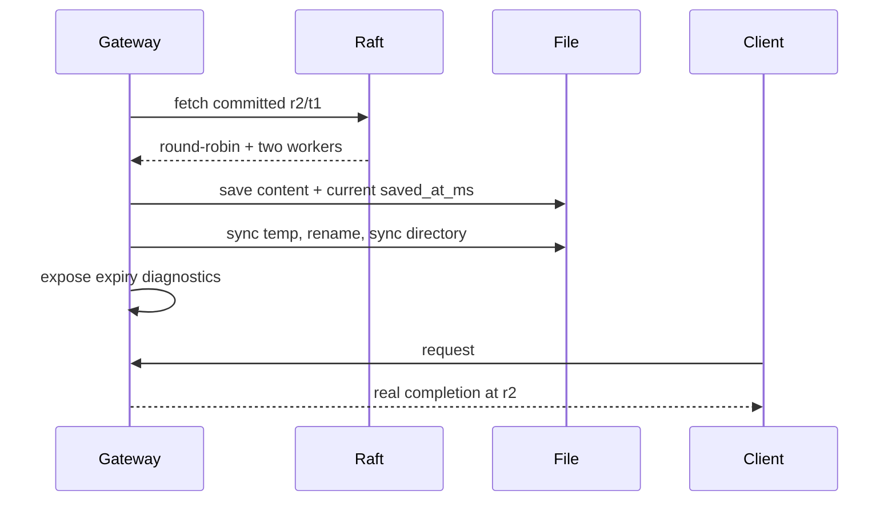
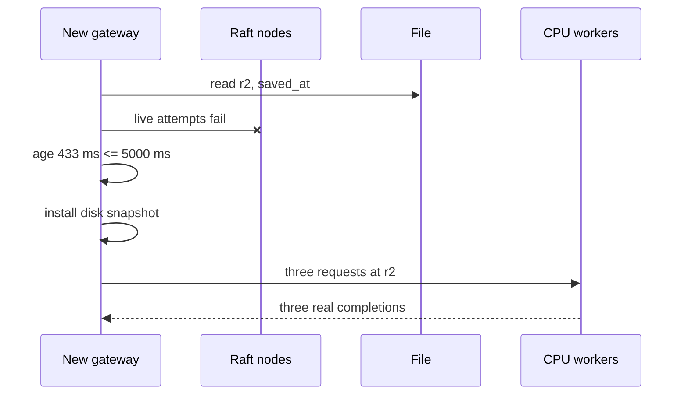
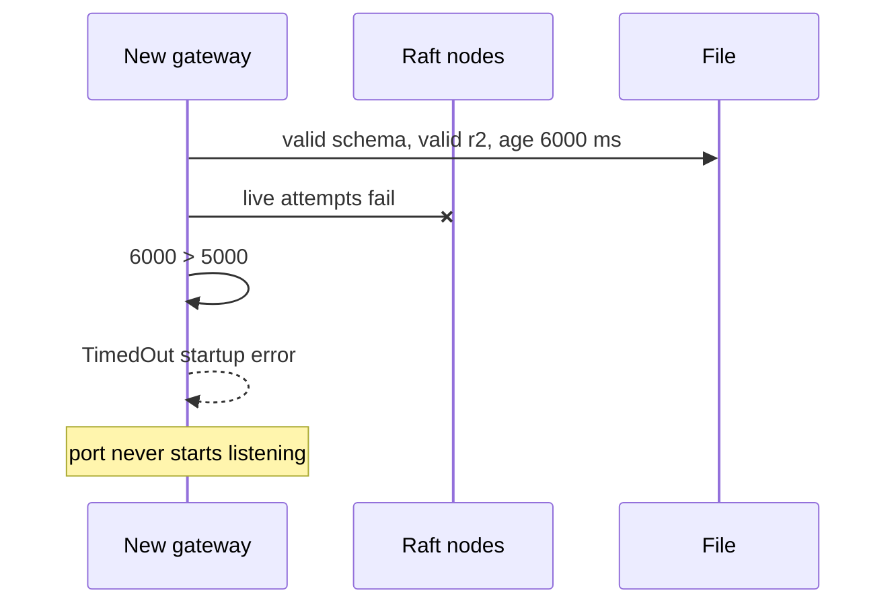
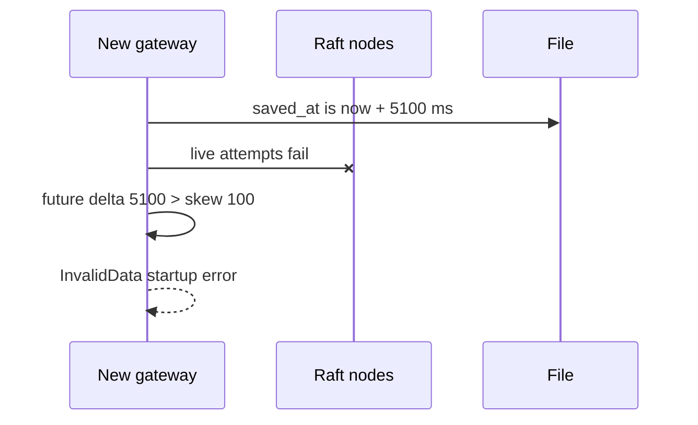
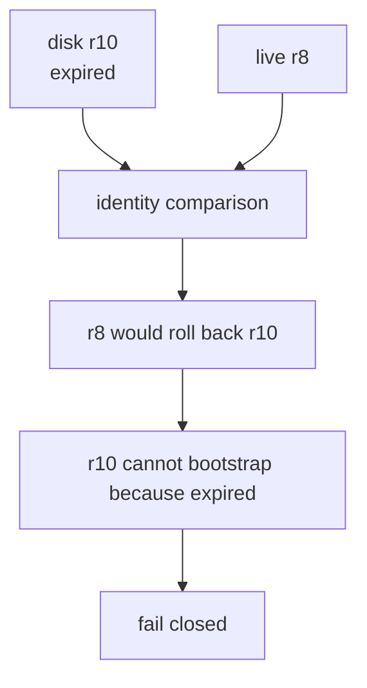
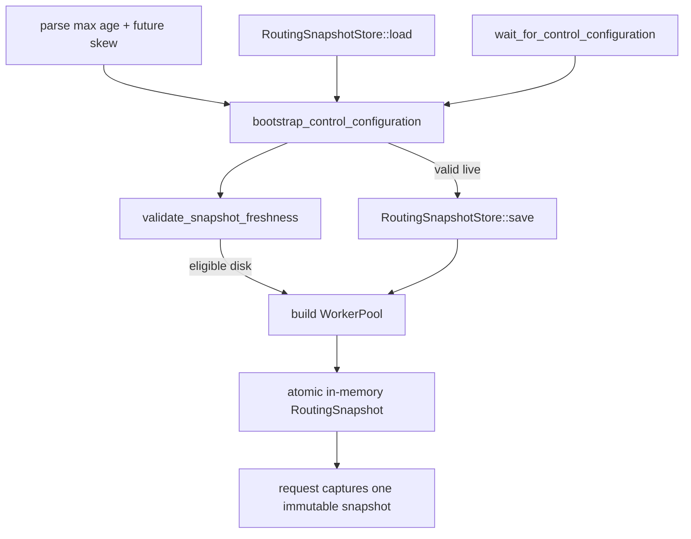

# Phase 20: Bounded-age routing fallback

Phase 19 taught the gateway to remember the last committed route map across a
process restart. Phase 20 asks the uncomfortable follow-up:

> How long should a brand-new gateway trust that disconnected memory?

The answer is not “forever” or “never” for every system. The answer is an
explicit policy whose safety and availability cost you can see.

## RFC versus learning document



**RFC** means **Request for Comments**. It is the engineering decision record.
The learning document is where you build the intuition needed to challenge that
decision.

## Mental model: an emergency pass with a use-by time

Imagine a railway signal office gives each station a printed emergency route
sheet.

- The official timetable is the live Raft control plane.
- The printed sheet is the gateway's durable snapshot.
- The revision and term identify which official timetable was printed.
- `saved_at_ms` is the print time.
- Maximum age is “do not use this sheet more than five minutes after printing.”
- Future skew is tolerance for two station clocks disagreeing slightly.

When the phone line is down, a fresh emergency sheet keeps trains moving. A
sheet from last month may point to tracks that no longer exist. A sheet claiming
it was printed tomorrow makes its age impossible to trust.

This phase adds the use-by check. It does not burn the sheet after expiry, and
it does not stop a train already moving under a previously accepted timetable.

## What failed before this phase

The v0.14 file had strong structural checks:



That final step was the limitation. “The document is well formed” does not mean
“the document is still recent enough for today's risk policy.”

A syntactically perfect file could name:

- a worker that has been decommissioned;
- an endpoint that now belongs to something else;
- a routing policy operators meant to retire; or
- a configuration that is simply too old to use without confirmation.

Phase 20 does not discover whether any of those events happened. It provides a
time bound on disconnected trust.

## The complete picture



The clock does not enter the token loop. It is consulted while selecting the
cold-start identity source.

## Vocabulary: every technical term in plain language

| Term | Plain-language meaning | Where you see it |
|---|---|---|
| Snapshot | Local versioned copy of one committed route map | `gateway-routing.json` |
| Freshness | Whether a timestamp fits the configured time window | startup validation |
| Correctness | Whether schema, revision, term, policy, and workers are valid | snapshot validation |
| Eligibility | Whether the gateway is allowed to use a source for this startup | bootstrap decision |
| Wall clock | Calendar-style Unix time shared across restarts | `saved_at_ms`, `now_ms()` |
| Monotonic clock | Clock useful for elapsed time inside one process; its origin does not survive restart | request deadlines, not file age |
| Clock skew | Difference between what two clocks say “now” is | future-skew allowance |
| Age | How far the saved time is behind current time | `max(now − saved, 0)` |
| Future delta | How far the saved time is ahead of current time | `max(saved − now, 0)` |
| Maximum age | Oldest snapshot still accepted for offline startup | optional environment value |
| Inclusive boundary | A value exactly equal to the limit is accepted | unit tests |
| Fail closed | Start no listener when identity cannot be chosen safely | expired/future proof phases |
| Cold start | A new gateway process before it accepts traffic | scope of v0.15 |
| Live repair | Valid control state overwrites an ineligible disk timestamp | final proof phase |
| Revision monotonicity | Never move from a higher committed revision to a lower one | inherited from v0.14 |
| Persist-before-publish | Synchronize new disk state before requests may observe it | inherited from v0.14 |
| Availability | Ability to keep serving despite component failure | fresh-disk phase |
| Safety | Refusal to serve when the required identity promise cannot be met | expired/future phases |
| Runtime lease | Future design that may affect an already-running gateway | explicitly not implemented |

## The two equations

Let:

- `S` = `saved_at_ms` from the file;
- `N` = current gateway wall time;
- `A` = configured maximum age; and
- `K` = configured maximum future skew.

```text
observed_age = max(N - S, 0)
future_delta = max(S - N, 0)

disk is temporally eligible when:
observed_age <= A  and  future_delta <= K
```

Why two equations? If you calculate only age with saturating subtraction, a
file dated in the year 2099 gets age zero. It could remain “fresh” for decades.
The future-delta check closes that hole.

## Draw the window on a number line

For the proof's `A = 5,000 ms` and `K = 100 ms`:



The window is asymmetric because the two sides represent different risks:

- a past timestamp may be legitimately old up to the availability budget;
- a future timestamp is normally only plausible as small clock disagreement.

## Five short movies

### Movie 1: live control prints the sheet



No age check is needed to trust the live source. The new timestamp is persisted
so a later disconnected restart has a bounded emergency option.

### Movie 2: every control node is down, but disk is fresh



This is the availability side of the trade-off.

### Movie 3: the same content is expired



Nothing is wrong with the JSON. The configured trust promise is what fails.

### Movie 4: timestamp is too far in the future



This prevents “future means age zero forever.”

### Movie 5: live authority repairs the file

```mermaid
sequenceDiagram
    participant G as New gateway
    participant R as Recovered Raft
    participant F as Future-dated file
    participant C as Client

    G->>F: decode content; timestamp is ineligible
    G->>R: fetch valid committed r2
    R-->>G: r2, exact same content
    G->>F: atomically replace with current timestamp
    G->>G: publish live r2
    C->>G: JSON and SSE requests
    G-->>C: real tokens + DONE
```

The ineligible file does not poison a valid live startup. Live authority can
repair its timestamp after ordinary revision/content validation.

## Why freshness does not override revision

Suppose disk contains revision 10 but is expired, while a reachable control
node reports revision 8.

It would be tempting to say “disk is expired, so use live revision 8.” That is
a rollback. Expiration removed disk's permission to bootstrap; it did not prove
revision 10 was never committed.



This is a powerful systems lesson: two individually valid facts can still
produce no safe action.

## What is persisted versus what is calculated

| Value | Stored in file? | Calculated when? | Why |
|---|---:|---|---|
| schema | yes | save | decode compatibility |
| revision and term | yes | Raft commit | identity monotonicity |
| policy and workers | yes | Raft commit | routing behavior |
| `saved_at_ms` | yes | synchronized save | cross-process time reference |
| maximum age | no | environment at startup | operator policy can change without rewriting committed identity |
| maximum future skew | no | environment at startup | deployment clock policy |
| observed age | no | disk bootstrap decision | depends on current time |
| expiry time | diagnostic only | `saved_at + maximum age` | makes policy inspectable |
| worker health | no | live requests/health behavior | freshness is not discovery |

## Where the code runs



Read these files in order:

1. `gateway/src/routing_snapshot_store.rs` — the time equations and boundary
   tests;
2. `gateway/src/main.rs` — source selection and environment policy;
3. `gateway/src/lib.rs` — diagnostic JSON shape;
4. `scripts/proof-v0.15.sh` — the five movies as exact processes;
5. `benchmarks/check_snapshot_freshness.py` — machine-readable claims;
6. `benchmarks/render_snapshot_freshness_svg.py` — evidence-to-chart mapping.

## How to read the retained chart

The top row is the causal story:

1. live control saves revision 2;
2. fresh disk serves while all control nodes are down;
3. expired disk fails before listening;
4. excessive future time also fails before listening; and
5. recovered live control repairs disk and serves again.

The middle number line is the important reasoning tool. The green band is the
only disk-fallback time window. Each dot comes directly from retained JSON.

The bottom row counts real-model requests only where startup was permitted.
Rejected phases intentionally have no request bars because no listener exists.

## What the experiment proves

The proof uses three Raft processes, two real online-attention CPU workers, one
gateway port, and one rejection-test port. It deliberately changes the file
timestamp while leaving revision, term, policy, and worker content unchanged.

It demonstrates:

- configured 5,000 ms age and 100 ms skew are visible in diagnostics;
- fresh disk boots during complete Raft outage;
- real model traffic continues under that bounded fallback;
- 6,000 ms age fails with an expiry reason;
- 5,100 ms future delta fails with a clock-skew reason;
- recovered live control can replace the ineligible timestamp;
- all seven permitted non-stream requests and final speculative SSE succeed;
- exact child-process scope and atomic temp-file cleanup remain intact; and
- all 15 assertions pass.

## What the experiment does not prove

- that 5,000 ms is the correct production limit;
- that wall clock cannot be changed by an operator or attacker;
- that an accepted route names healthy workers;
- that a running gateway stops when the cold-start expiry passes;
- that NTP jumps, suspend/resume, or multi-host clock drift are handled;
- that the local filesystem survives power loss;
- multi-host behavior, throughput, public-model quality, or CUDA execution.

## Alternatives you should be able to explain

| Alternative | Decision | Reason |
|---|---|---|
| trust disk forever | configurable | maximizes availability but has no stale-state bound |
| mandatory expiry | rejected | deployment risk policies differ |
| file modification time | rejected | copying/metadata can change it independently of validated content |
| delete on expiry | rejected | loses evidence and monotonic revision identity |
| monotonic clock only | rejected | cannot compare across a new process |
| write on every equal control poll | deferred | creates unnecessary I/O and needs a verification-lease design |
| stop running gateway at expiry | deferred | changes live readiness/request semantics |
| treat future time as age zero | rejected | can create effectively immortal fallback |

## Labs: things you can do yourself

### Lab 1: move across the age boundary

1. Run `scripts/proof-v0.15.sh` once.
2. Change `max_age_ms=5000` to `max_age_ms=2000` in a scratch branch.
3. Change the expired mutation from `-1000` beyond the limit to exactly the
   limit.
4. Predict accept or reject before running.
5. Move it one millisecond farther and rerun.

You should observe inclusive equality followed by deterministic rejection.

### Lab 2: remove the maximum age

Unset `INFERLAB_ROUTING_SNAPSHOT_MAX_AGE_MS` and leave control offline. Predict
which checks still apply. The snapshot may be arbitrarily old, but a timestamp
beyond future skew still fails.

### Lab 3: make live revision lower than expired disk

Create a durable revision 4, make it expired, then expose a stale live revision
2. The correct result is not “live wins.” Both choices violate one invariant,
so startup must fail.

### Lab 4: confuse freshness with health

Keep a fresh route but stop one named worker. The gateway may boot because
freshness passes. Ordinary retry/circuit behavior—not timestamp validation—owns
worker failure.

### Lab 5: design the next runtime lease

On paper, specify:

- what event renews the lease;
- how often equal-revision confirmation may write disk;
- what `/readyz` returns after lease expiry;
- whether existing streams finish;
- what new requests receive; and
- how operators choose “serve stale” versus “stop.”

Do not write code until each invariant is explicit.

## Questions to test your understanding

1. Why can a schema-valid snapshot still be unsafe for cold start?
2. Why are age and future delta separate equations?
3. What happens exactly at the maximum-age boundary?
4. Why does expiry not allow a lower live revision to replace a newer disk
   revision?
5. Why does the implementation use wall time here but monotonic time for
   request deadlines?
6. What does `persisted_expires_at_ms` mean, and what does it explicitly not
   mean?
7. Why is worker health absent from the snapshot?
8. What proof would be required before implementing runtime expiry?

## The transferable lesson

Durability answers **“can I recover this state?”**

Freshness answers **“am I still allowed to trust it without confirmation?”**

Those are independent properties. Production systems become easier to reason
about when identity, correctness, freshness, health, and availability are named
separately instead of collapsed into one vague word such as “valid.”

Phase 20 makes that separation executable. Phase 21 now applies the follow-up
decision to a running gateway; continue with
[the runtime routing lease guide](phase-21-runtime-routing-lease.md).
