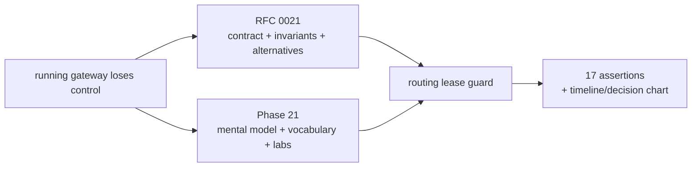
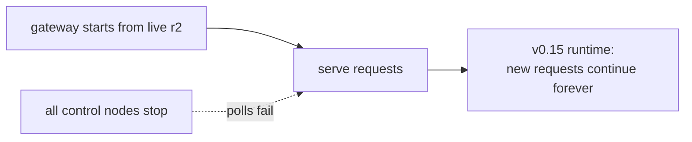
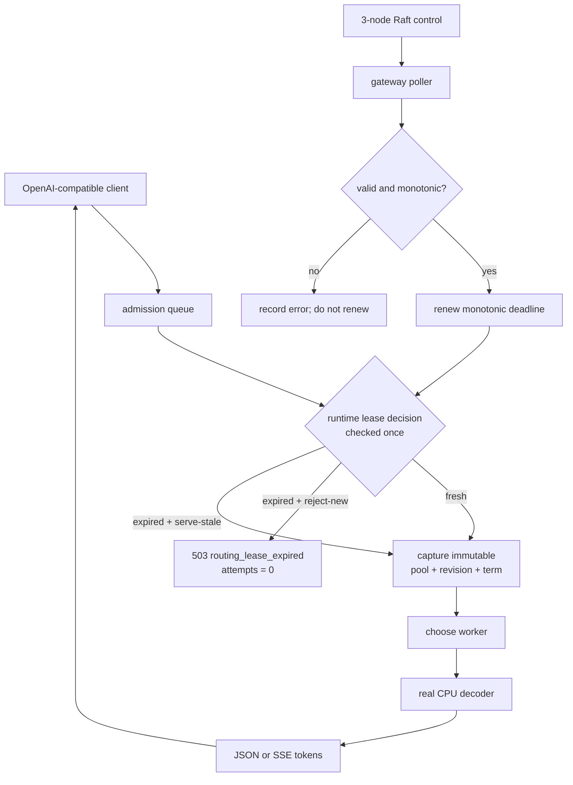
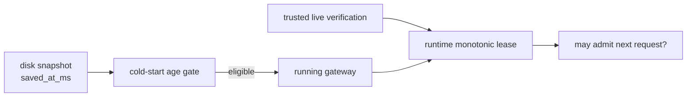
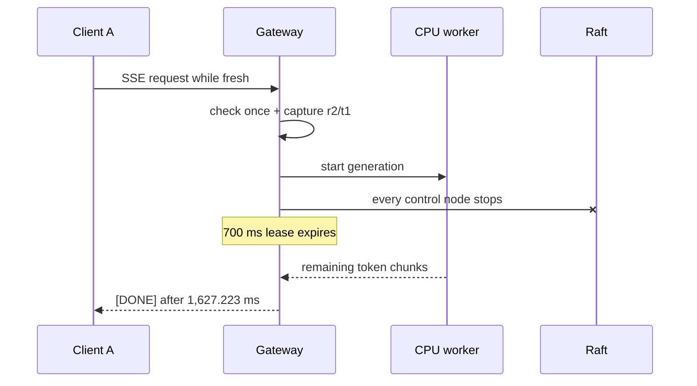
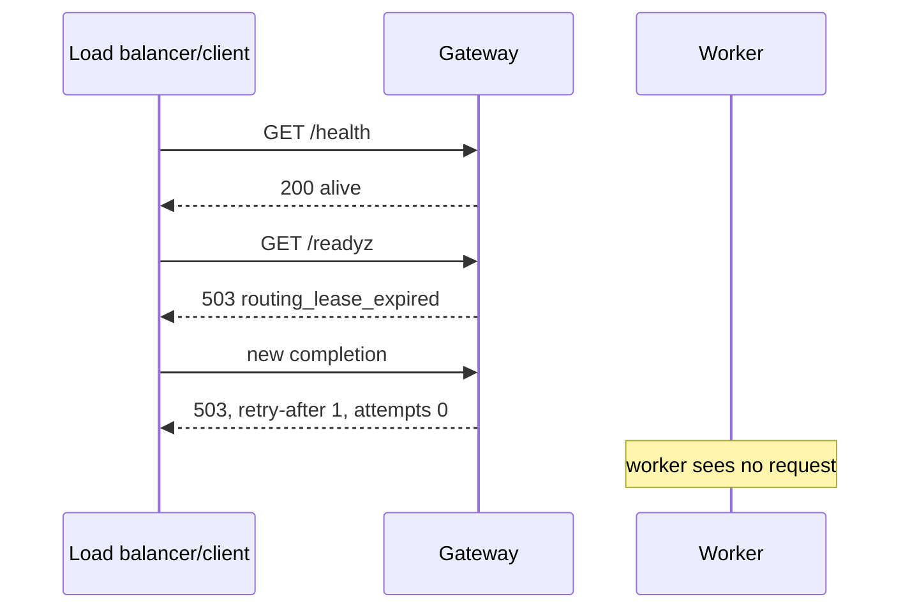
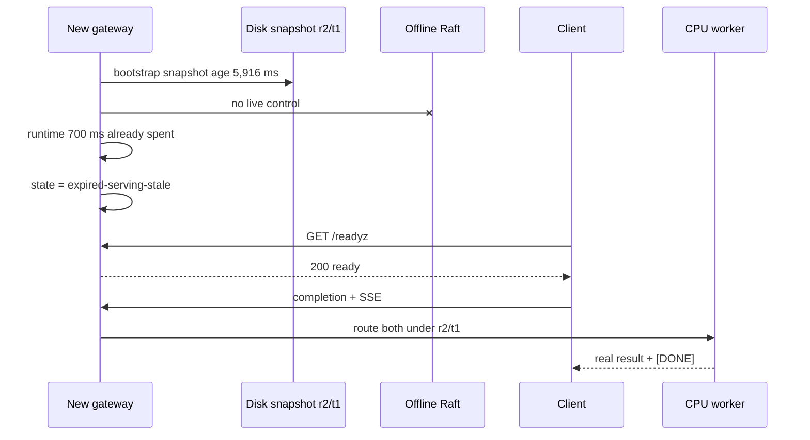
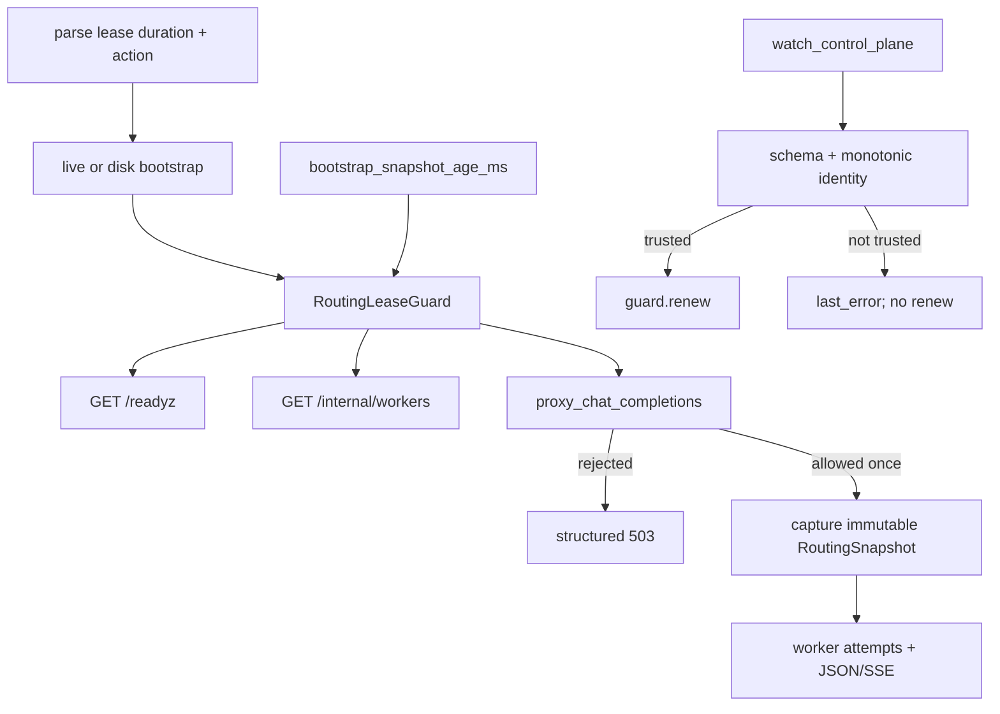
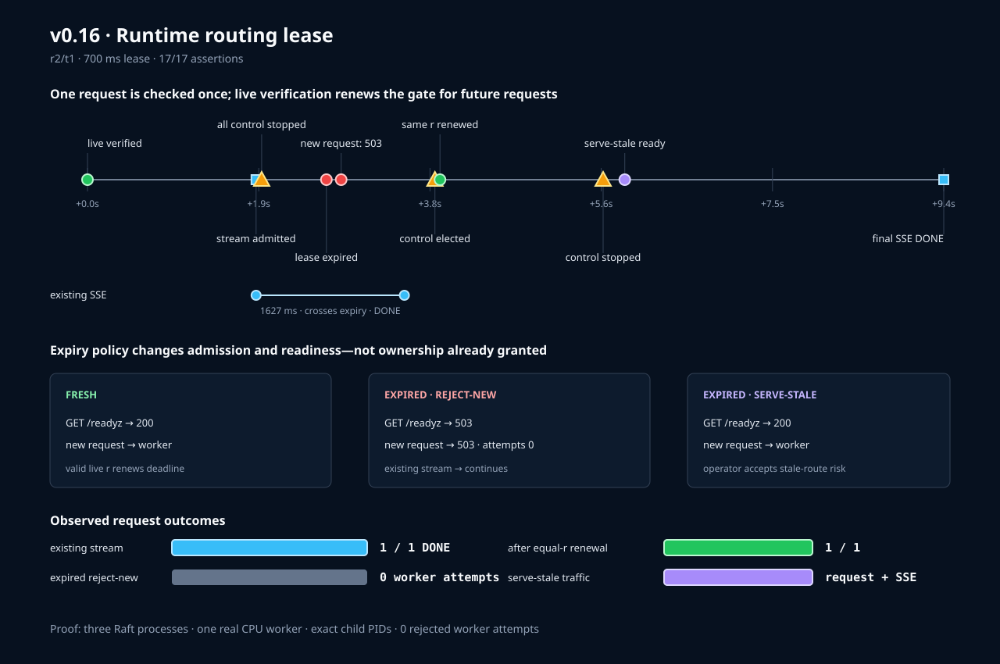

# Phase 21: Runtime routing lease

Phase 20 gave a new gateway an expiration rule for its disk snapshot. Phase 21
asks the runtime question:

> If a gateway is already running but can no longer confirm its route with the
> control plane, when should it stop admitting new work—and what happens to work
> already in progress?

The answer is an optional **runtime routing lease** plus an explicit operator
choice: reject new work after expiry or keep serving the stale route.

## RFC versus learning document



**RFC** means **Request for Comments**. It records what the team decided and
why. This learning document helps you picture the request path, predict failure
behavior, and challenge the decision.

## Mental model: an airport boarding authorization

Imagine an airport gate agent receives an official passenger/aircraft plan from
the control tower.

- The **Raft control plane** is the tower publishing the official plan.
- The **routing snapshot** is the exact plan currently on the gate agent's
  screen.
- A **runtime lease** is “the tower confirmed this plan recently enough that you
  may board another passenger.”
- **Renewal** is the tower confirming the same plan again; the plan need not
  change.
- A passenger who already boarded is an **existing request**.
- A passenger arriving after the authorization expires is a **new request**.
- `reject-new` closes boarding but does not pull already-boarded passengers off
  the aircraft.
- `serve-stale` keeps boarding because the operator explicitly values
  availability more than recent confirmation.

The lease is about permission to start new work. It is not a timer attached to
every generated token.

## What failed before this phase



v0.15 protected only a later process restart. If the current process never
restarted, its route had no runtime confirmation deadline.

This matters when routes can be retired, access boundaries can change, or an
operator would rather drain a gateway than trust disconnected state forever.

## The complete request picture



The gateway's ordinary bounded admission happens first. An expired request may
briefly own and then release one gateway admission permit, but it performs no
worker selection or network attempt.

## Vocabulary: every technical term in plain language

| Term | Plain-language meaning | Where you see it |
|---|---|---|
| Data plane | Gateway and workers handling client requests/tokens | `/v1/chat/completions` |
| Control plane | Raft nodes deciding routing configuration | `/v1/control/config` |
| Routing snapshot | One immutable worker pool + revision + term | response headers and `/internal/workers` |
| Revision | Monotonically increasing committed configuration number | `x-inferlab-config-revision` |
| Term | Raft leadership era in which the entry was committed | `x-inferlab-config-term` |
| Lease | Time-limited permission to admit new requests | `routing_lease` diagnostics |
| Lease duration | How long trusted verification permits new admission | `INFERLAB_ROUTING_LEASE_MS` |
| Deadline | Monotonic instant when the lease becomes expired | held inside `RoutingLeaseGuard` |
| Trusted verification | Live config is valid and agrees with revision/content rules | control watcher |
| Renewal | Reset the deadline after trusted verification | `renewals` counter |
| Expiry | Monotonic `now` is at or past the deadline | `state` changes |
| Admission | One-time permission for a new request to begin routing | handler entry |
| Existing stream | SSE admitted before expiry and still emitting | crossing-stream proof |
| `reject-new` | Conservative mode: readiness 503 and new request 503 | expiry action |
| `serve-stale` | Availability mode: readiness 200 and new traffic continues | expiry action |
| Stale | Not recently confirmed; not automatically invalid or unhealthy | expired lease state |
| Liveness | Process is alive and inspectable | `/health` |
| Readiness | Process is willing to accept new traffic | `/readyz` |
| Worker attempt | Actual forwarding attempt to a selected worker | `x-inferlab-attempts` |
| Zero worker attempts | Request stopped before selection/forwarding | expired rejection header |
| Monotonic clock | Measures elapsed process time without wall-clock jumps | runtime deadline |
| Wall clock | Human calendar/Unix time; crosses process restarts | diagnostic timestamps, disk age |
| Persist-before-publish | Save a newer config durably before requests can observe it | higher-revision renewal path |
| Immutable ownership | A request keeps the route identity captured at its start | retries and SSE |
| Drain | Stop taking new work while allowing admitted work to finish | `reject-new` behavior |

## Do not confuse the two time boundaries



| Question | v0.15 cold-start age | v0.16 runtime lease |
|---|---|---|
| When checked? | new process bootstrap | every new request, via current guard state |
| Main clock | wall clock, because restart crossed process boundary | monotonic clock, because process is running |
| Source event | snapshot persistence time | last trusted live verification |
| On failure | listener may never start | process stays alive; readiness/admission follow policy |
| Existing work | none yet | allowed to finish |
| Operator choice | use eligible disk or fail startup | reject-new or serve-stale |

When disk starts a process, its observed age is subtracted from the runtime
lease. Restarting cannot magically make disconnected state young again.

## Five short movies

### Movie 1: unchanged live control renews the lease

```mermaid
sequenceDiagram
    participant R as Raft control
    participant P as Gateway poller
    participant L as Lease guard
    participant C as Client

    P->>R: GET committed config
    R-->>P: exact r2/t1 content
    P->>P: validate + compare
    P->>L: renew(now, 700 ms)
    C->>L: new request
    L-->>C: fresh; continue to routing
```

Why does the revision not need to increase? The lease asks whether authority
still confirms the current identity, not whether configuration changed.

### Movie 2: an SSE stream crosses expiry



Pulling the stream back after it was admitted would mix control failure into the
token contract and could leave the client with a partial answer.

### Movie 3: reject-new drains the gateway



The process is deliberately unready, not dead. It can recover without restart.

### Movie 4: the same revision recovers the gateway

```mermaid
sequenceDiagram
    participant R as Recovered Raft term 2
    participant G as Running gateway
    participant C as Client
    participant W as CPU worker

    G->>R: poll
    R-->>G: exact committed r2/t1 content
    G->>G: renew lease; keep route identity r2/t1
    C->>G: GET /readyz
    G-->>C: 200 ready
    C->>G: completion
    G->>W: attempt 1
    W-->>C: real model result
```

The Raft **leader term** can advance while the committed configuration's stored
term remains t1. Recovery does not fabricate a new config revision.

### Movie 5: serve-stale is consciously different



This mode is not “safer.” It is a different availability choice, made visible
so an operator can own the risk.

## Why these approaches, and why not the obvious alternatives

| Idea | Decision | Why |
|---|---|---|
| check once per request | selected | keeps one ownership contract through retries/streaming |
| check every token | rejected | can cut SSE after bytes were emitted and puts a clock in the hot path |
| abort all in-flight work | rejected | wastes computation and breaks already-granted ownership |
| `reject-new` only | supported/default | conservative drain behavior, but not right for every deployment |
| `serve-stale` only | rejected as implicit behavior | hides the safety/availability choice |
| separate `/health` and `/readyz` | selected | alive and willing to receive new work are different facts |
| renew on equal exact revision | selected | authority can confirm identity without changing it |
| renew on any HTTP 200 | rejected | stale/divergent content is reachable but not trustworthy |
| persist each equal poll | rejected | unnecessary disk I/O; runtime verification and durable content have different meanings |
| full lease after disk restart | rejected | repeated restarts could make old state immortal |
| wall clock for runtime | rejected | NTP/manual jumps can change elapsed permission |
| monotonic clock for runtime | selected | stable elapsed-time behavior inside one process |

## Where the code runs



Read these files in order:

1. `gateway/src/routing_lease.rs` — the smallest state machine and clock math;
2. `gateway/src/lib.rs` — readiness, request gate, diagnostics, and 503;
3. `gateway/src/main.rs` — environment policy, bootstrap age, and renewal trust;
4. `gateway/tests/routing_lease.rs` — existing-stream, rejection, recovery, and
   serve-stale integration behavior;
5. `scripts/proof-v0.16.sh` — exact real-process movie;
6. `benchmarks/check_runtime_lease.py` — machine-readable claims;
7. `benchmarks/render_runtime_lease_svg.py` — evidence-to-chart mapping.

## How to read the retained chart



Read it in three layers:

1. **Timeline:** live verification, stream admission, total control outage,
   expiry/rejection, control recovery/renewal, then explicit serve-stale.
2. **Blue stream lane:** the stream begins before expiry and reaches `[DONE]`
   afterward. This is the ownership invariant.
3. **Decision panels:** fresh, expired-reject-new, and
   expired-serve-stale have different readiness and new-request outcomes.

Every event and value comes from retained JSON; the picture is not a hand-made
claim independent of the run.

## What the experiment proves

The proof uses three persistent Raft processes, one real paged-KV CPU worker
with tiled online attention, one restartable gateway, and exact owned-child PID
faults.

It demonstrates:

- a 700 ms lease repeatedly renews on exact live revision 2;
- all three control processes can stop while an admitted real SSE continues;
- that stream runs for 1,627.223 ms and reaches `[DONE]` after expiry;
- readiness becomes 503 under `reject-new`;
- the rejected new request has `attempts: 0`, and the worker counter is
  unchanged;
- control recovers in Raft term 2 and renews the unchanged routing revision;
- readiness and real traffic recover without restarting the gateway;
- disk bootstrap carries spent age into an immediately expired
  `serve-stale` process;
- explicit stale mode serves a new real request and speculative SSE; and
- all 17 assertions pass.

## What the experiment does not prove

- that 700 ms is the right production lease;
- that the route's worker is healthy merely because control confirmed it;
- that all gateways observe expiry or recovery at the same instant;
- load-balancer behavior when `/readyz` flips;
- authenticated cluster identity or trustworthy timestamps;
- emergency cancellation/revocation of already-admitted work;
- long partitions, host suspend, NTP changes, power loss, or hostile mutation;
- production checkpoint quality, high throughput, or CUDA.

## Labs: what you can do yourself

### Lab 1: watch the state transition

1. Run `scripts/proof-v0.16.sh` once.
2. Start the stack manually with a 5,000 ms lease and `reject-new`.
3. Poll `/internal/workers` once per second.
4. Stop all three control children.
5. Predict the first response where `remaining_ms` reaches zero.

Observe that `last_verified_ms` stops, `state` changes, and the route revision
does not.

### Lab 2: prove the zero-attempt boundary

Before and after an expired request, fetch the worker's `/health` request count.
Then compare it with `x-inferlab-attempts`. If either increases, the request gate
is in the wrong place.

### Lab 3: change only the operator policy

Repeat the same outage twice:

```bash
INFERLAB_ROUTING_LEASE_EXPIRY_ACTION=reject-new
INFERLAB_ROUTING_LEASE_EXPIRY_ACTION=serve-stale
```

Keep revision, workers, lease duration, and fault identical. Write down the
readiness and request outcome before running. This isolates policy from state.

### Lab 4: make disk older than the lease

Use a snapshot age larger than the runtime duration but smaller than the
cold-start maximum age. The process may bootstrap from disk, yet its runtime
lease should begin expired. Explain why both facts can be true.

### Lab 5: send divergent equal-revision content

Expose the same revision number with a different worker list. The control
endpoint is reachable, but the lease must not renew. This separates
**reachability** from **trusted agreement**.

### Lab 6: choose a production lease on paper

Write down:

- maximum acceptable stale-route exposure;
- control-plane detection/recovery time;
- longest legitimate request/stream duration;
- load-balancer readiness polling interval; and
- whether availability or recent authority wins during partition.

Only then pick a lease duration and expiry action. The implementation cannot
decide your risk budget for you.

## Questions to test your understanding

1. Why can an equal revision renew the lease?
2. Why does an HTTP 200 not automatically count as trusted verification?
3. Why is `/health` still 200 when `/readyz` is 503?
4. Why may an existing stream finish after expiry?
5. Why does the rejection report zero attempts?
6. Why do disk age and runtime lease use different clocks?
7. Why is a disk-bootstrapped lease allowed to start already expired?
8. What risk does `serve-stale` accept explicitly?
9. Why is lease freshness not the same as worker health?
10. What additional design would emergency route revocation require?

## The transferable lesson

A lease is not just a timer. It defines:

- **who** is allowed to renew trust;
- **what evidence** counts as agreement;
- **which operation boundary** consumes that trust;
- **what already-owned work** is protected; and
- **which safety/availability choice** happens at expiry.

Phase 21 makes all five executable. A running process can now say, precisely,
“I am alive, but I will not accept another request until authority confirms my
route”—or, just as explicitly, “I will keep serving stale because availability
wins here.”

Continue with
[Phase 22](phase-22-control-cluster-identity-fencing.md) to learn why “authority
confirmed” must first be scoped to an expected Raft cluster, and why a namespace
string is useful but is not authentication.
