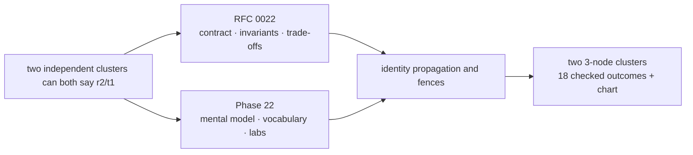
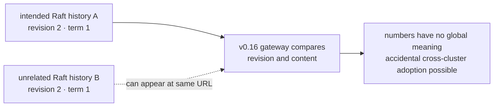
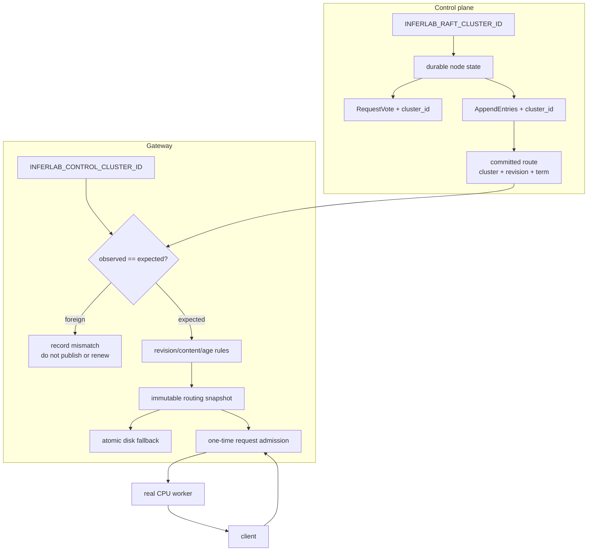
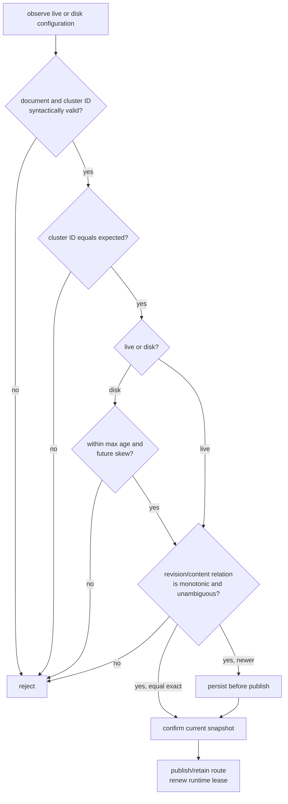
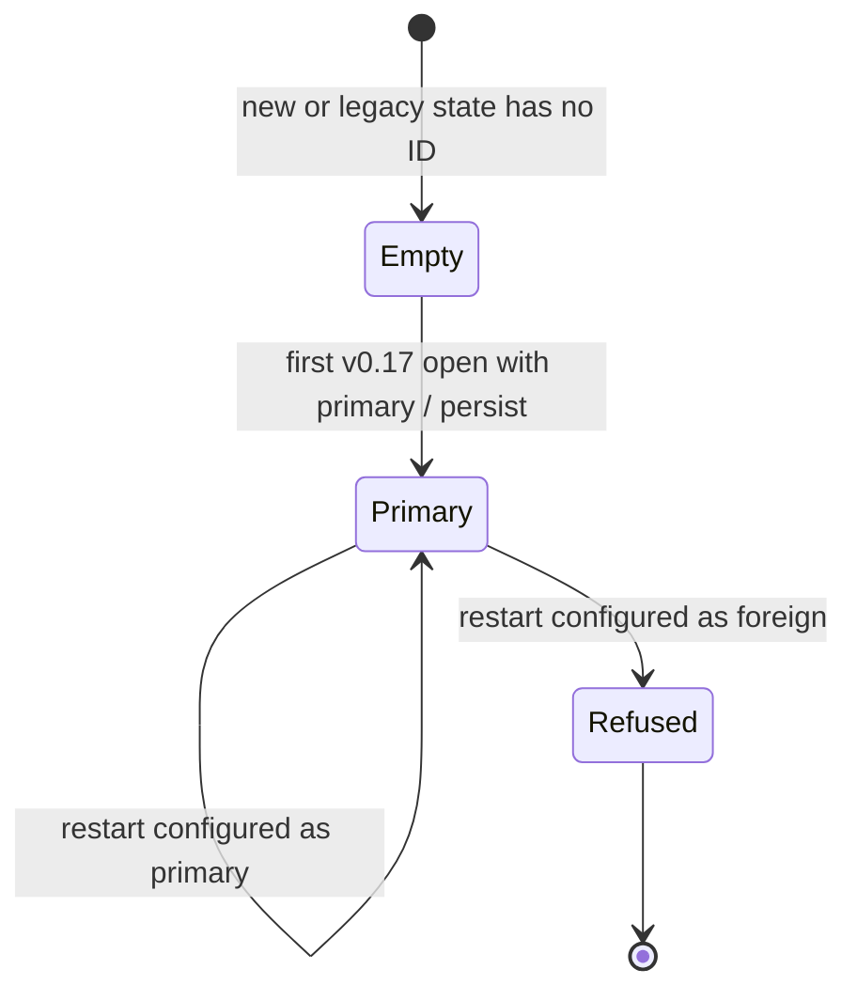
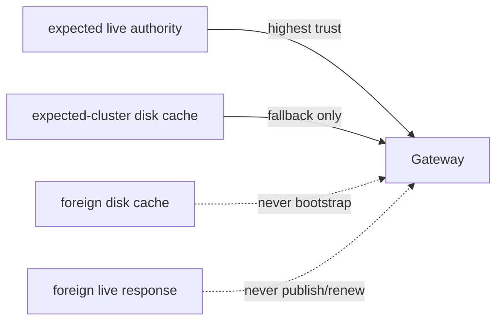
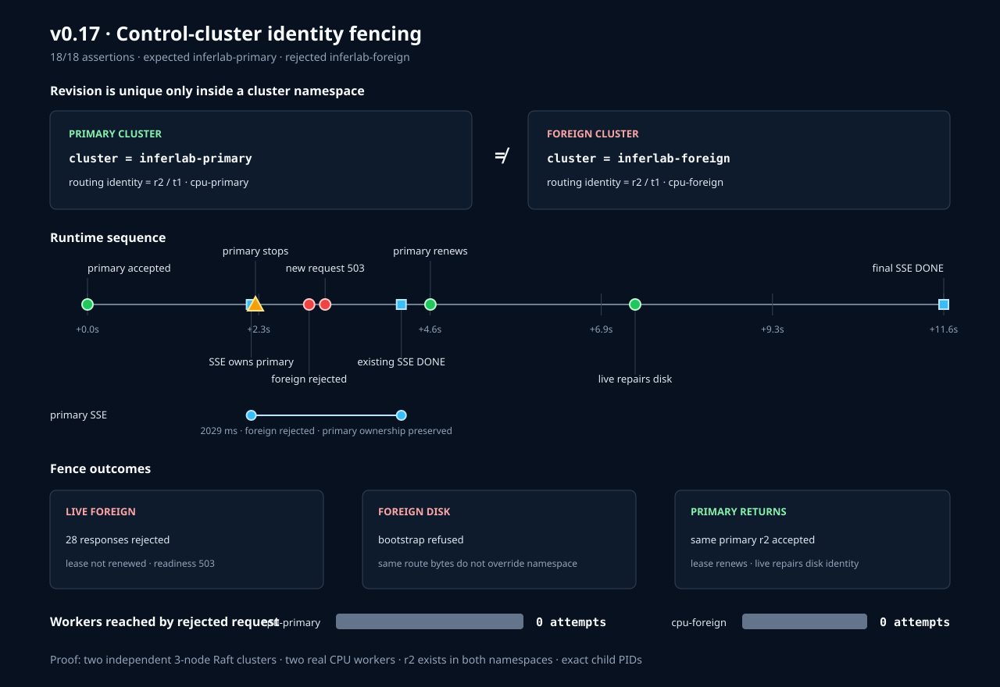

# Phase 22: Control-plane cluster identity fencing

Phase 21 answered “how recently did live control confirm this route?” Phase 22
asks a more basic question:

> How does the gateway know that the control plane answering now is the same
> control-plane history it intended to trust?

The answer is a stable cluster namespace carried from Raft storage to every
request, plus equality fences at peer RPC, live polling, and disk bootstrap.

## RFC versus learning document



**RFC** means **Request for Comments**. It records the engineering agreement and
why alternatives were rejected. This guide is for imagining the moving parts
without reading Rust first.

## Mental model: two banks with receipt number 2

Imagine two independent banks. Each prints receipt numbers starting at 1.

- Bank A issues receipt **2** for “pay Rahul.”
- Bank B issues receipt **2** for “pay someone else.”
- The number 2 is valid inside each bank, but it does not identify the bank.
- Writing `bank-a` beside the receipt gives it a namespace.
- Checking that label prevents accidentally filing Bank B's receipt in Bank A's
  account.
- A handwritten label is not a signature. A dishonest person can still write
  `bank-a`; cryptographic authentication is a later boundary.

Raft revision and term are the receipt numbers. `cluster_id` is the bank name.
The useful identity becomes:

```text
(cluster_id, revision, term)
```

The route content—the workers and policy—travels with that identity as one
immutable request snapshot.

## What failed before this phase



The runtime lease proved that *some reachable control endpoint* recently agreed
with the route. It did not prove that the endpoint belonged to the intended
cluster. A second cluster can reuse ports after a restart or deployment mix-up.

## The whole system picture



There are three different equality checks to keep separate:

1. **Peer fence:** are these Raft messages from my named cluster?
2. **Gateway live fence:** is this control response from the cluster I expect?
3. **Gateway disk fence:** was this fallback file saved for the cluster I
   expect?

Only after the identity fence passes do revision, content, age, and lease rules
have meaning.

## Request path, step by step

```mermaid
sequenceDiagram
    participant C as Client
    participant G as Gateway
    participant R as Expected Raft cluster
    participant F as Foreign Raft cluster
    participant W as Worker

    R->>G: cluster=primary, revision=2, term=1
    G->>G: identity matches; validate and publish
    C->>G: start SSE while lease fresh
    G->>G: capture primary/r2/t1 route once
    G->>W: forward stream
    F->>G: cluster=foreign, revision=2, term=1
    G-->>F: ignore for routing; record mismatch
    Note over G: foreign response does not renew lease
    W-->>G: remaining token frames
    G-->>C: frames and [DONE]
    R->>G: cluster=primary, revision=2, term=2
    G->>G: expected identity; renew lease
```

The existing SSE finishes because request ownership was established at
admission. The foreign response changes diagnostics and future readiness; it
does not rewrite the captured request snapshot.

## Vocabulary in plain language

| Term | Plain-language meaning | Why it matters |
|---|---|---|
| Control plane | Raft processes deciding the official route | Authority for worker membership and policy |
| Data plane | Gateway and workers serving requests | Where client tokens flow |
| Raft cluster | Nodes sharing one replicated log history | Revisions/terms are scoped to this history |
| Cluster ID | Stable name for the intended history | Separates otherwise equal counters |
| Namespace | Context that makes a local name/number meaningful | `primary/r2` differs from `foreign/r2` |
| Fence | Check that blocks state from crossing a boundary | Prevents accidental history mixing |
| Revision | Committed route version in one cluster | Orders route changes only within that cluster |
| Term | Raft leadership epoch in one cluster | Not globally unique across clusters |
| Committed configuration | Route accepted by a Raft majority | Carries cluster ID, revision, term, workers, policy |
| Routing snapshot | Immutable gateway view captured by a request | Retries and streaming cannot mix identities |
| Foreign response | Valid-looking state with the wrong cluster ID | Must not publish or renew trust |
| Runtime lease | Time permission to admit new work after trusted live verification | Foreign observations spend time; they do not renew it |
| Disk fallback | Last validated committed route saved atomically | Emergency cache, not a new authority |
| Live repair | Expected live state replacing a bad/foreign disk cache | Recovery without manually deleting the file |
| Relabel | Reopening durable Raft state with another configured ID | Refused because old history cannot silently become a new cluster |
| Authentication | Proof a sender is authorized to claim a name | Not provided by a plain cluster ID |
| mTLS | Both endpoints prove certificate identities during transport | Possible later authentication mechanism |
| Signature | Cryptographic proof over configuration bytes | Possible later protection for route origin/integrity |
| Fail closed | Refuse startup/traffic when required trust cannot be established | Foreign-disk-only bootstrap behavior |

## The order of questions



An easy mistake is to ask “is revision 2 newer?” before “revision 2 in which
cluster?” Phase 22 fixes that ordering.

## State and failure chart

| Observation | Cluster match? | Revision/content | Disk eligible? | Route changes? | Lease renews? | Result |
|---|---:|---|---:|---:|---:|---|
| Expected live, exact current route | yes | equal + identical | n/a | no | yes | keep serving |
| Expected live, valid higher route | yes | newer | n/a | yes, after disk save | yes | serve new route |
| Expected live, equal divergent | yes | ambiguous | n/a | no | no | record error |
| Foreign live, same r/t | no | not compared | n/a | no | no | count mismatch |
| Foreign live, much higher r/t | no | not compared | n/a | no | no | count mismatch |
| Expected disk, fresh | yes | valid | yes | bootstrap | carries spent age | serve |
| Foreign disk only | no | not compared | irrelevant | no | no | startup fails |
| Foreign disk + expected live | live wins | valid live | disk ignored | live route saved | yes | disk repaired |
| Static workers | n/a | n/a | n/a | normal static pool | n/a | unchanged |

Notice that a foreign revision 9,999 is not “newer.” It is *incomparable*.

## Raft data-directory ownership



Why not simply rewrite the ID? Because the directory contains a log, votes,
terms, and committed state belonging to the original history. Renaming the label
would hide the provenance instead of changing it.

The migration limit matters: a pre-v0.17 directory has no saved cluster ID. Its
first v0.17 open adopts the configured value. From then onward the fence is
durable, but the software cannot prove what the old operator intended.

## Live control versus disk cache



Disk remembers an authority's earlier answer; it does not become authority. So
expected live state can repair foreign disk, while foreign live state cannot
overwrite expected disk or memory.

## What you can observe without reading code

For one request, inspect response headers:

```bash
curl -i http://127.0.0.1:8080/v1/chat/completions \
  -H 'content-type: application/json' \
  -d '{"model":"inferlab-tiny","messages":[{"role":"user","content":"identity"}]}'
```

Look for:

```text
x-inferlab-control-cluster: inferlab-primary
x-inferlab-config-revision: 2
x-inferlab-config-term: 1
```

For the gateway's current and rejected identities:

```bash
curl -s http://127.0.0.1:8080/internal/workers | python3 -m json.tool
```

Read these fields together:

- `control_plane.expected_cluster_id`: configuration intent;
- `control_plane.last_rejected_cluster_id`: most recent foreign observation;
- `control_plane.cluster_mismatch_rejections`: how often it was observed;
- `control_plane.last_error`: why the observation was unusable;
- `routing_snapshot.control_cluster_id`: identity requests currently capture;
- `routing_lease.state`: whether trusted confirmation is still recent enough.

## Configuration lab

All nodes in one cluster use the same identity:

```bash
INFERLAB_RAFT_CLUSTER_ID=inferlab-primary cargo run -p control-plane
```

The consuming gateway expects that identity:

```bash
INFERLAB_CONTROL_CLUSTER_ID=inferlab-primary \
INFERLAB_CONTROL_PLANE_URLS=http://127.0.0.1:7001 \
INFERLAB_ROUTING_LEASE_MS=30000 \
INFERLAB_ROUTING_LEASE_EXPIRY_ACTION=reject-new \
  cargo run -p gateway
```

Use an explicit environment-specific value. `inferlab-default` keeps older local
commands working but cannot distinguish two deployments that both retain the
default.

## Guided experiments

### Lab 1: prove equal numbers do not mean equal identity

1. Run `./scripts/proof-v0.17.sh`.
2. Open `raw/config-primary.json` and `raw/config-foreign.json`.
3. Confirm both are revision 2, term 1.
4. Confirm their cluster IDs and workers differ.

Prediction to write first: should the gateway compare the two route bodies or
reject the foreign namespace before comparison?

### Lab 2: watch trust expire without changing the captured route

1. Compare `gateway-primary-fresh.json` with
   `gateway-foreign-rejected.json`.
2. Verify `routing_snapshot.control_cluster_id` remains `inferlab-primary`.
3. Verify `last_rejected_cluster_id` becomes `inferlab-foreign`.
4. Verify the lease reaches `expired-rejecting-new`.
5. Compare worker counters before and after the rejected request.

The expected result is zero new attempts at both workers. This separates a
gateway admission fence from a worker failure.

### Lab 3: understand request snapshot ownership

1. Inspect `stream-crossing-foreign-cluster.json`.
2. Confirm the stream began on the primary worker before the cluster swap.
3. Confirm it ends with `[DONE]` after foreign observations and lease expiry.
4. Explain why changing or aborting it would violate the phase-21 admission
   contract.

### Lab 4: prove disk is fallback, not authority

1. Inspect `foreign-snapshot-fixture.json`.
2. Read `foreign-disk-bootstrap-rejected.json` and its retained startup log.
3. Then inspect `snapshot-live-repaired.json` after primary live control returns.

Prediction: foreign disk alone fails; expected live authority repairs it.

### Lab 5: distinguish fencing from authentication

Change both a foreign sender and the gateway expectation to the same fake ID.
The string comparison succeeds. That negative experiment demonstrates the exact
limit: names prevent accidental crossing only when configuration is honest.

Do not mistake this lab for a security penetration test. There are no keys or
certificates in the contract.

## Read-the-code route, when ready

Read only one responsibility at a time:

1. `control-plane/src/model.rs` — find the cluster ID on persistent state,
   committed config, node status, and both Raft request types.
2. `control-plane/src/raft.rs` — find open-time persistence/relabel refusal and
   the pre-mutation peer-RPC check.
3. `gateway/src/routing_snapshot_store.rs` — find disk schema validation and the
   expected-cluster check.
4. `gateway/src/main.rs` — follow fetch → skip foreign → bootstrap/watch → renew.
5. `gateway/src/lib.rs` — see the immutable request snapshot, headers, and
   diagnostics.
6. `scripts/proof-v0.17.sh` — follow exact process ownership and fault injection.

After each file, draw only the input, decision, and output. You do not need to
understand every Rust type to understand the reliability contract.

## Evidence walkthrough

The retained chart puts the two equal-number histories side by side and aligns
the request/stream events on one timeline:



The run observes:

- primary and foreign clusters both at revision 2, term 1;
- at least 28 foreign observations rejected by the expiry capture;
- zero attempts at either worker for the rejected new request;
- a 2,029.448 ms already-admitted real stream completing;
- primary recovery in term 2 without gateway restart;
- explicit wrong-cluster disk bootstrap failure;
- live primary repair of the disk identity; and
- 18/18 checked outcomes passing.

These numbers describe one loopback run. The invariants—not the exact
milliseconds or poll count—are the reusable result.

## Limitations you should be able to explain

1. **Not authentication:** the ID is an asserted string, not verified origin.
2. **Default collision:** unrelated clusters using `inferlab-default` are not
   separated.
3. **Legacy adoption:** an old empty-ID directory gains its first identity at
   migration time; history before that is not proven.
4. **No worker guarantee:** the expected cluster can still name an unhealthy
   worker.
5. **No instant cancellation:** work admitted before expiry may finish.
6. **No fleet coordination:** each gateway observes and expires independently.
7. **No signed disk/time:** local mutation remains outside the trust model.
8. **No hostile-network proof:** the exact-process proof is on one machine.

## Check your understanding

Before moving on, answer without code:

1. Why can primary revision 2 and foreign revision 2 be different identities?
2. Why must cluster equality be checked before revision ordering?
3. Why does foreign live control not renew the runtime lease?
4. Why may expected live control repair a foreign disk file?
5. Why is a persisted control directory not allowed to change its cluster ID?
6. What attack remains possible because the cluster ID is not signed?
7. Why does an existing SSE finish after the gateway begins rejecting new work?

If these answers are clear, you understand the boundary even before reading the
implementation.

## Next boundary

The cluster ID supplies a namespace. The next topic should supply proof of
ownership for that namespace: signed routing configurations or mutually
authenticated control transport, including key rotation/revocation and failure
policy. Emergency route cancellation and coordinated multi-gateway draining are
separate operational contracts after authenticated authority exists.
