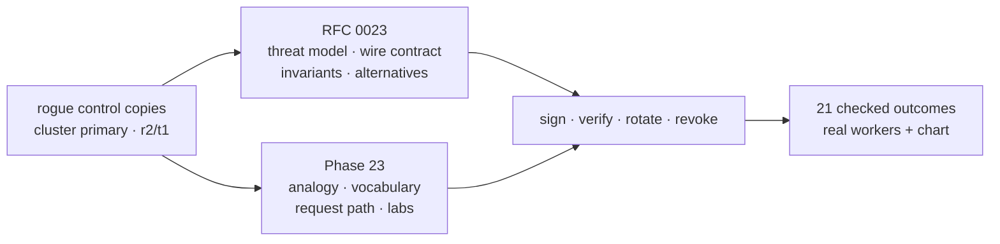
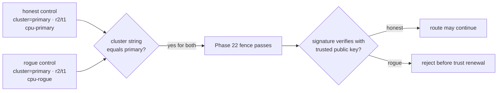
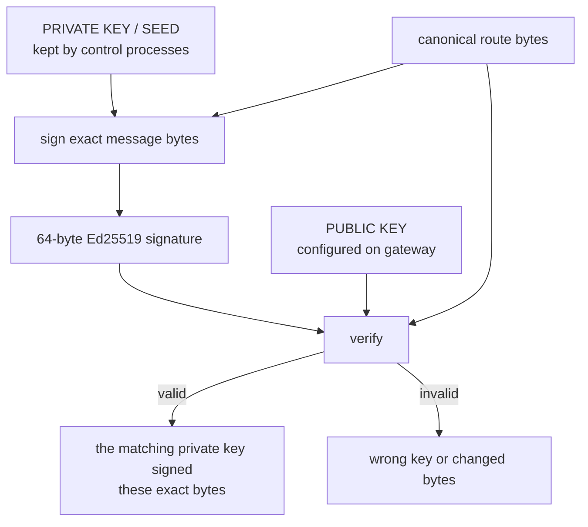
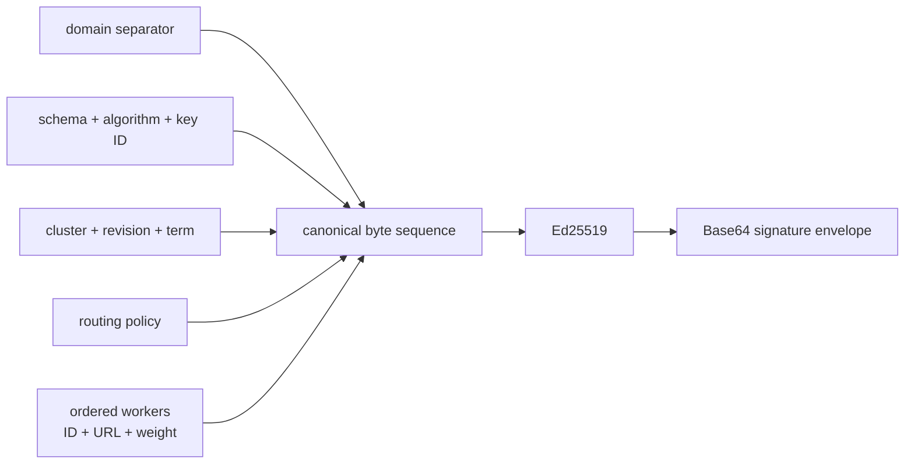
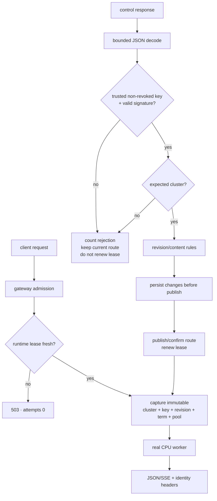
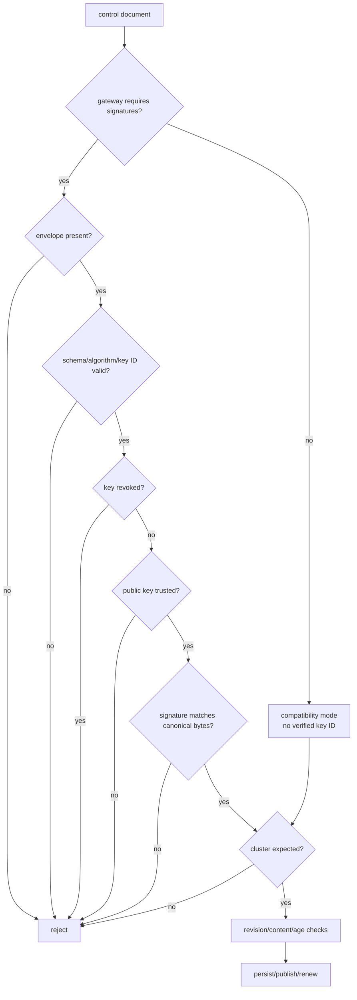
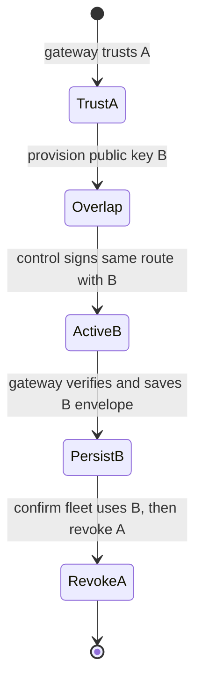
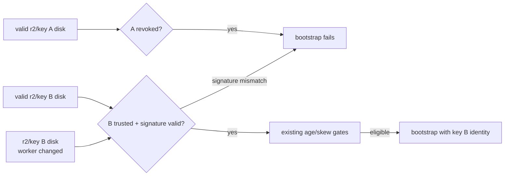
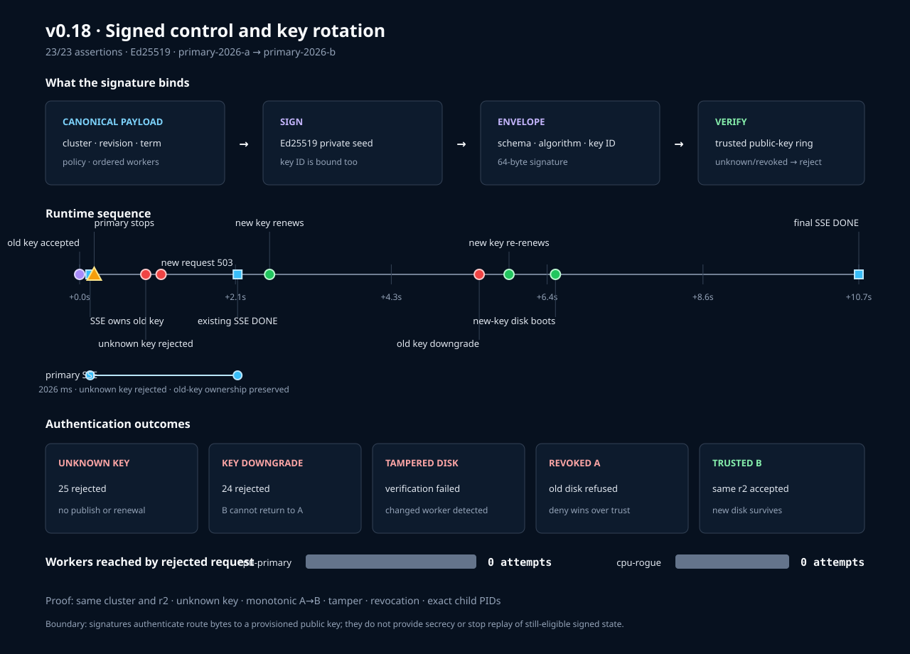

# Phase 23: Signed control configurations and key rotation

Phase 22 gave the control plane a stable name. Phase 23 asks:

> If another system copies that name, how can the gateway tell whether the
> exact route bytes came from an authority whose key it already trusts?

The answer is an Ed25519 digital signature, a gateway public-key trust ring,
explicit revocation, and a rotation protocol that does not confuse key changes
with route changes.

## RFC versus learning document



**RFC** means **Request for Comments**. The RFC is the engineering agreement.
This guide is the mental model for predicting what should happen before reading
the Rust.

## Mental model: a wax seal, not a locked box

Imagine the control plane sends a paper route manifest.

- The **cluster ID** is the organization name printed at the top.
- The **private key** is a unique seal kept by the issuing office.
- The **signature** is the wax impression over the exact manifest.
- The **public key** is a reference impression that anyone may use to check the
  seal but cannot use to create one.
- The **key ID** is the label telling the gateway which reference impression to
  select.
- The **trust ring** is the gateway's approved collection of public keys.
- The trust ring is ordered old → new, so an already-observed new seal cannot be
  silently replaced by an older one during rollout.
- **Revocation** means “never accept this seal again,” even if it was once valid.
- **Rotation** means introducing a new seal, accepting both during transition,
  then revoking the old one.

The paper is still readable. A signature is a tamper-evident/authentic seal, not
encryption and not a locked box.

## What still failed after Phase 22



The rogue does not need to guess the cluster name—it is visible in responses and
disk files. Phase 23 adds a fact that cannot be copied without the private key.

## Public-key signatures in plain language

Two different keys have different jobs:



The gateway cannot forge a control route because it receives only the public
key. This is the key difference from HMAC, where signer and verifier share the
same secret.

## What exactly is signed?



Every length is written before its UTF-8 string; numbers are fixed-width
big-endian integers. This avoids signing ordinary JSON text, where whitespace or
object-key order could differ while representing the same object.

Changing any covered field—including one character in a worker ID—changes the
message and makes the old signature invalid.

## Why the key ID is also signed

The key ID selects a public key, but selection metadata is itself security
important. If it were outside the signature, someone could relabel a signature
from `key-a` to an alias that maps differently.

```text
signature = Sign(private_key_A, schema || algorithm || "key-a" || route)
```

Changing `key-a` to `key-b` changes the verified message. The signature fails
unless key B actually signs the new envelope.

## Complete live request picture



Authentication is evaluated before the cluster string. The system does not let
unauthenticated metadata decide which history it belongs to.

## Vocabulary: every technical term

| Term | Plain-language meaning | What it does not mean |
|---|---|---|
| Cryptography | Mathematical tools for security properties | Automatically secure system design |
| Ed25519 | Standard public-key signature algorithm used here | Encryption |
| Private seed | Secret 32-byte input that constructs the signing key | Safe to expose in logs or source |
| Public key | Non-secret 32-byte verifier key | Ability to sign |
| Signature | 64-byte proof over one exact message | The message is hidden |
| Base64 | Text encoding for binary bytes | Encryption or hashing |
| Canonicalization | Creating exactly one byte representation | Compressing or encrypting data |
| Domain separation | Prefix identifying what kind of message is signed | Network/domain-name validation |
| Key ID | Human-readable selector bound into the signature | Secret key material |
| Trust ring | Allowed key-ID → public-key mapping | Proof that provisioning itself was correct |
| Key preference | Old-to-new position in the trust ring | Cryptographic strength of one key |
| Unknown key | Envelope key ID absent from the trust ring | Necessarily malformed signature |
| Revoked key | Explicitly denied key ID | Deleted historical evidence |
| Strict verification | Ed25519 verification with canonical checks from the library | Full application authorization |
| Integrity | Covered bytes cannot change unnoticed | Freshness |
| Authenticity | Matching private-key holder signed the bytes | Correct business decision |
| Confidentiality | Preventing others from reading bytes | Supplied by signatures |
| Replay | Reusing old but valid signed bytes | Forging a new signature |
| Rotation | Moving from old to new signing key | Changing the route itself |
| Overlap window | Period both old/new public keys are trusted | Both keys remain trusted forever |
| Revocation | Local policy refusing a key ID | Cancelling requests already admitted |
| Writer authorization | Who may ask Raft to commit a route | Solved by response signatures |
| mTLS | Both network endpoints prove certificate identities | Implemented in this phase |

## Decision order

The order is as important as the individual checks:



Three predictions follow:

1. A rogue response with the correct cluster and revision is rejected as
   **untrusted key**, not cluster mismatch.
2. A known but revoked key is rejected before signature acceptance.
3. A valid signature does not skip age, revision, or content rules.

## Existing stream versus new request

```mermaid
sequenceDiagram
    participant C1 as Client A
    participant G as Gateway
    participant W as Primary worker
    participant X as Rogue control
    participant C2 as Client B

    C1->>G: start SSE while key A route is trusted
    G->>G: capture key A route once
    G->>W: forward
    X->>G: same cluster/r2/t1, unknown key
    G->>G: reject observations; lease not renewed
    Note over G: lease expires
    C2->>G: new completion
    G-->>C2: 503, attempts=0
    W-->>G: remaining frames
    G-->>C1: frames and [DONE]
```

Phase 23 does not change Phase 21's ownership contract. Authentication governs
new trust and admission; it does not retroactively cancel an admitted stream.

## Key rotation: two layers of identity

A route and its signature envelope can change independently:

| Field group | Key A observation | Key B observation | Changed? |
|---|---|---|---:|
| Cluster | `inferlab-primary` | `inferlab-primary` | no |
| Revision | 2 | 2 | no |
| Term carried by route | 1 | 1 | no |
| Policy/workers | primary route | primary route | no |
| Key ID | `primary-2026-a` | `primary-2026-b` | yes |
| Signature | signature A | signature B | yes |

If the gateway compared the whole JSON object, it would call this
“equal-revision divergent content.” Instead it compares the consensus payload
without the envelope, verifies key B, saves the B envelope, then publishes B as
the request-visible key identity.



Revoking A before `ActiveB` is a self-created outage. Rotation order is a safety
property, not operational ceremony. Trust entries are listed oldest to newest;
after B becomes active, a lagging A-signed response is counted as a key downgrade
and cannot renew or republish A.

## Disk fallback after rotation



The disk file's route bytes are protected, but `saved_at_ms` is local gateway
metadata and is not signed. Phase 20/21 still own freshness.

## Configuration lab

### Control signer

```bash
INFERLAB_RAFT_CLUSTER_ID=inferlab-primary \
INFERLAB_CONTROL_SIGNING_KEY_ID=primary-2026-a \
INFERLAB_CONTROL_SIGNING_PRIVATE_KEY_B64='<base64-32-byte-seed>' \
  cargo run -p control-plane
```

Never reuse the public key value as the private seed. Base64 only turns bytes
into text; it does not make them interchangeable.

### Gateway verifier

```bash
INFERLAB_CONTROL_CLUSTER_ID=inferlab-primary \
INFERLAB_CONTROL_TRUSTED_KEYS='primary-2026-a=<public-a>,primary-2026-b=<public-b>' \
INFERLAB_CONTROL_REVOKED_KEY_IDS='' \
INFERLAB_CONTROL_PLANE_URLS='http://127.0.0.1:7001,http://127.0.0.1:7002,http://127.0.0.1:7003' \
  cargo run -p gateway
```

When the trust variable is absent, authentication is disabled for compatibility.
That mode should be visible as `authentication_required: false`; it should not
claim an envelope was verified merely because one was present.

The comma order is meaningful: old keys first, new keys last. Changing that
order changes which transitions count as upgrades versus downgrades.

## What you can observe without reading code

Inspect the gateway:

```bash
curl -s http://127.0.0.1:8080/internal/workers | python3 -m json.tool
```

Read these fields together:

- `authentication_required`: whether unsigned state is forbidden;
- `trusted_signing_key_ids`: provisioned public-key selectors;
- `revoked_signing_key_ids`: explicit deny list;
- `active_signing_key_id`: key that verified the installed route;
- `last_rejected_signing_key_id`: most recent rejected selector;
- `signature_verifications`: successful observations;
- `signature_rejections`: failed observations;
- `signing_key_downgrade_rejections`: valid signatures refused because their
  key ranks below the installed key;
- `last_authentication_error`: why the latest authentication rejection failed;
- `routing_snapshot.control_signing_key_id`: key a new request captures.

Inspect one successful request's headers:

```text
x-inferlab-control-cluster: inferlab-primary
x-inferlab-control-key-id: primary-2026-b
x-inferlab-config-revision: 2
x-inferlab-config-term: 1
```

The key ID is diagnostic evidence. The security decision came from verifying the
signature with the corresponding public key—not from trusting this header.

## Guided experiments

### Lab 1: run the complete boundary

```bash
./scripts/proof-v0.18.sh
```

Before running it, predict which counter changes when a rogue system copies the
correct cluster ID: cluster mismatches or signature rejections?

### Lab 2: inspect the exact signed fields

1. Open `docs/results/v0.18/raw/config-primary-old-key.json`.
2. Record cluster, revision, term, policy, worker order, key ID, and signature.
3. Open `snapshot-old-key.json` and confirm the envelope is identical.
4. Explain why `saved_at_ms` differs but does not invalidate the signature.

### Lab 3: one-byte tamper

1. Compare `snapshot-new-key.json` with
   `tampered-snapshot-fixture.json`.
2. Observe that only the worker identity was changed while the signature was
   retained.
3. Read `tampered-disk-bootstrap-rejected.json`.

Prediction: JSON/schema validation passes; Ed25519 verification fails.

### Lab 4: unknown key versus wrong cluster

1. Compare `config-primary-old-key.json` and `config-rogue-key.json`.
2. Confirm both say `inferlab-primary` and revision 2.
3. Inspect `gateway-rogue-rejected.json`.
4. Confirm `cluster_mismatch_rejections` is zero while
   `signature_rejections` is positive.

This experiment isolates the exact value added after Phase 22.

### Lab 5: signature-only rotation

1. Compare `snapshot-old-key.json` and `snapshot-new-key.json`.
2. Confirm route fields are identical.
3. Confirm key IDs and signatures differ.
4. Inspect `gateway-new-key-renewed.json` and `request-new-key.json`.

Prediction: no route revision change, no gateway restart, key B becomes active,
the lease renews, and disk is replaced before publication.

### Lab 6: revocation policy

1. Read `revoked-old-key-bootstrap-rejected.json`.
2. Confirm the error says key A is revoked—not that the signature is malformed.
3. Inspect `gateway-new-key-disk.json` with key A still listed as trusted but
   also revoked.
4. Confirm key B boots successfully.

This demonstrates “deny wins over allow.”

### Lab 7: discover the unsolved writer problem

The control write endpoint still accepts an unauthenticated `PUT`. A caller can
ask the legitimate cluster to commit a route, after which the legitimate signer
will sign it. Do not perform this against anything outside the local proof.

The lesson: signed delivery is not writer authorization. That is the next
boundary.

## Evidence walkthrough



The retained run shows:

- old and rogue histories both claim the same cluster, revision, and term;
- at least 25 unknown-key responses rejected by the lease-expiry capture;
- a 2,026.254 ms admitted real SSE completing under key A;
- zero worker attempts for the rejected new request;
- persistent primary recovery in Raft term 2;
- same revision-2 route rotating A → B without gateway restart;
- 24 later valid key-A observations rejected as a downgrade until key B returns;
- changed signed worker bytes failing offline verification;
- valid key-A disk failing after explicit revocation;
- key-B disk serving a real request and speculative SSE; and
- 23/23 checked outcomes passing.

Counts and milliseconds describe one loopback run. The reusable claims are the
decision boundaries.

## Read-the-code route

1. `control-auth/src/lib.rs` — read the payload fields, then `sign`, then
   `verify`; ignore the tests on the first pass.
2. `control-plane/src/lib.rs` — see how committed state becomes a detached
   authenticated envelope at the HTTP boundary.
3. `gateway/src/control_authentication.rs` — see required/disabled modes and
   payload equality without the envelope.
4. `gateway/src/main.rs` — follow verify → cluster → revision → rotation →
   persist → publish → renew.
5. `gateway/src/lib.rs` — find the captured key ID and response header.
6. `scripts/proof-v0.18.sh` — follow the exact old/rogue/new/tamper/revoke order.

After each file, draw three boxes: input, security decision, allowed state
change. That is enough to understand the boundary before understanding every
Rust detail.

## Limitations you should be able to explain

1. **No secrecy:** route JSON is still visible.
2. **No writer authorization:** the official control API can sign a route that
   an unauthorized caller asked it to commit.
3. **No peer transport authentication:** Raft RPCs still use a string namespace
   fence.
4. **Private seed handling is educational:** environment variables are not an
   HSM or secret manager.
5. **Signer compromise is decisive:** stolen trusted seed can forge routes.
6. **Replay remains:** old valid bytes may pass while revision/age/lease rules
   still allow them.
7. **Local revocation:** gateways do not receive one instant fleet-wide signed
   revocation event.
8. **No retroactive cancellation:** admitted requests retain their snapshots.
9. **No network availability guarantee:** signatures cannot stop dropped
   traffic or denial of service.
10. **Single-host proof:** no hostile multi-host partition or production secret
    lifecycle is claimed.

## Check your understanding

Answer without code:

1. Why does copying `inferlab-primary` no longer suffice?
2. Which exact fields does the signature cover?
3. Why sign a canonical byte format instead of ordinary JSON text?
4. Why is the key ID inside the signature?
5. Why can the gateway verify but not forge routes?
6. Why must verification happen before cluster/revision comparison?
7. Why is key B at revision 2 not equal-revision route divergence?
8. Why must key B be trusted before controls switch to it?
9. Why does revocation defeat a cryptographically valid old signature?
10. What can replay do that tampering cannot?
11. Why is signed route delivery different from authorized route creation?
12. Why does the existing SSE finish after unknown-key observations?

If those answers are clear, you can reason about the design without reading the
implementation.

## Next boundary

Phase 23 proves who signed route bytes. The next phase should control who may
create those bytes and authenticate the network participants: authorize the
administrative write API, authenticate Raft peers/gateway-control transport,
then define online revocation, emergency route cancellation, and coordinated
multi-gateway draining.
