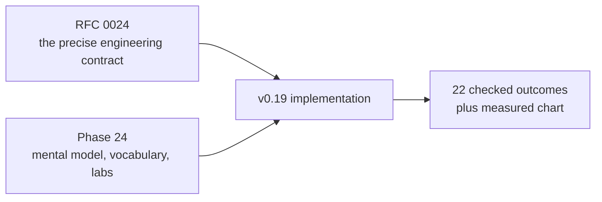
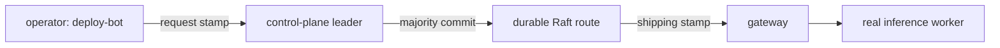
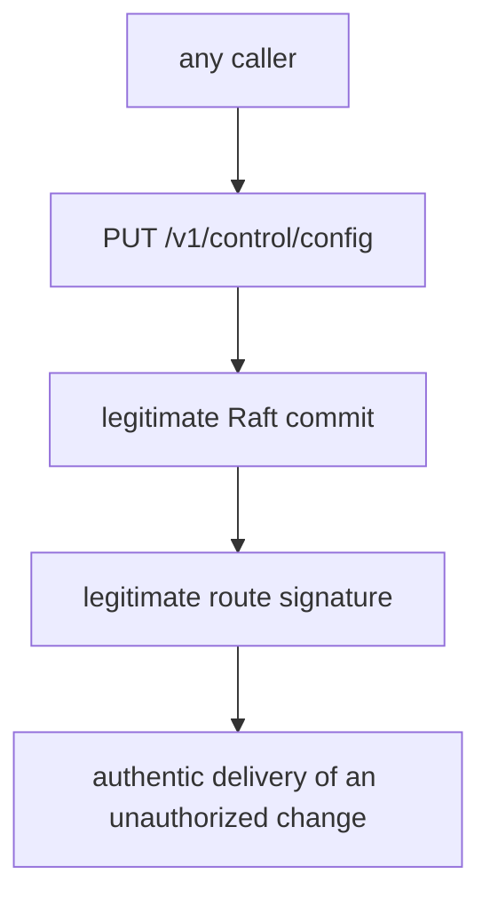
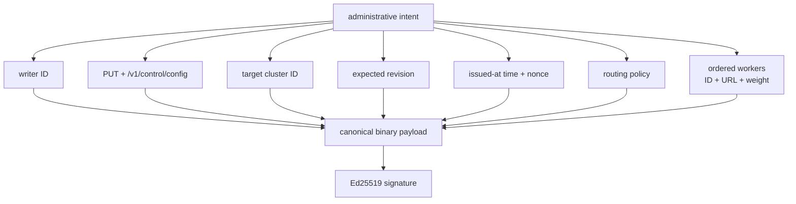
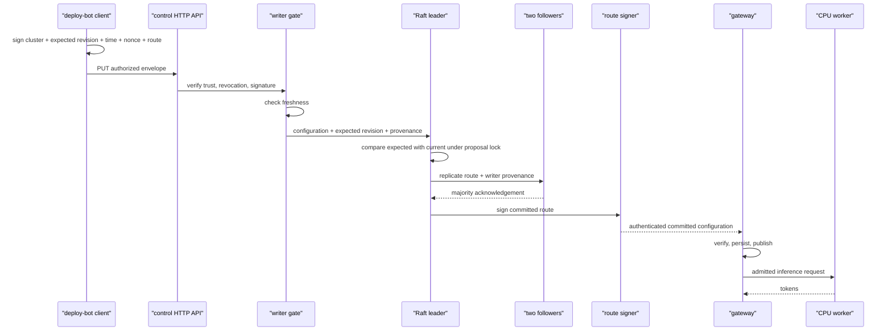
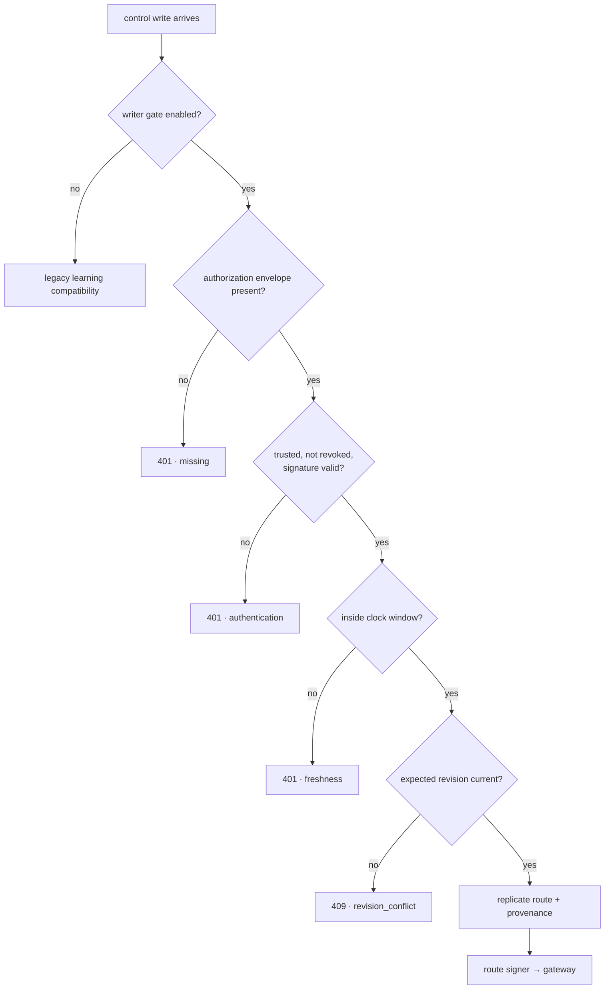
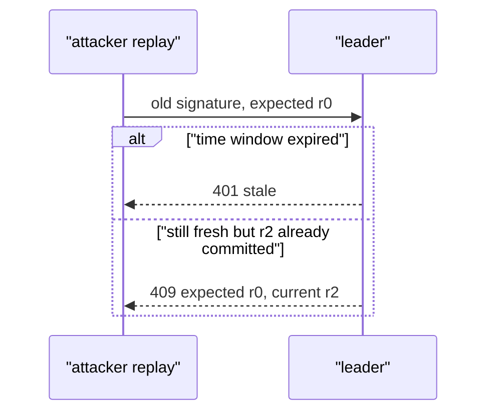

# Phase 24: Authorized administrative control writers

This phase answers a question left open by signed route delivery:

> The gateway knows the control service signed this route—but who was allowed
> to ask the control service to create it?

The implementation adds a signed administrative intent in front of the Raft
commit path. You can understand the boundary from the diagrams and retained
evidence before reading Rust.

## RFC versus learning document



Read the RFC when you need to answer “what exactly did we decide?” Read this
guide when you need to imagine the request moving through the system.

## Mental model: two different stamps

Imagine a warehouse with two controlled stamps:

1. The **request stamp** belongs to an authorized operator. It means “I approve
   changing the routing plan to these exact values.”
2. The **shipping stamp** belongs to the warehouse. It means “this is the exact
   plan our replicated system committed and is delivering.”



The stamps are intentionally different keys. Stealing the operator key should
not let someone impersonate route delivery directly, and stealing the route
delivery key should not automatically produce an authorized administrative
audit record.

## What failed before this phase

v0.18 protected the arrow from control service to gateway. The arrow into the
control service was still open:



This is why authentication at one boundary does not automatically secure every
earlier boundary.

## Authentication, authorization, and integrity

These terms are related but not interchangeable:

| Question | v0.19 answer |
|---|---|
| Who signed this write? | Authentication: verify the Ed25519 signature under `writer_id` |
| May that identity write? | Authorization: it must be trusted and not revoked |
| Were the proposed bytes changed? | Integrity: the signature binds every route field and precondition |
| Is the request recent enough? | Freshness: bounded timestamp and future skew |
| Is it based on current state? | Concurrency/replay fence: signed expected revision must match |
| Did the distributed system accept it? | Consensus: a Raft majority commits the command |
| Can a gateway trust delivery? | Separate route signature from RFC 0023 |

A request must pass all of these gates. Passing one does not imply the others.

## What exactly does the operator sign?



Changing a worker weight from 1 to 9, changing the cluster, or changing
`expected_revision` invalidates the signature. Whitespace and JSON key order do
not matter because the signature covers a deterministic binary representation,
not the transport formatting.

## The complete request journey



The important ordering is: no authorization decision, no Raft append; no Raft
majority, no route publication.

## Vocabulary: every technical term

| Term | Plain-language picture |
|---|---|
| Private key | Secret signing power held by the writer client |
| Public key | Non-secret verifier installed on every control node |
| Writer ID | Label selecting which public key and authorization entry to use |
| Trust ring | The server's configured list of allowed writer IDs and public keys |
| Revocation | A deny rule that wins even when the signature is mathematically valid |
| Signed intent | Proposed route plus target, time, nonce, and state precondition |
| Canonical encoding | One unambiguous byte layout used by signer and verifier |
| Domain separation | Prefix preventing these signatures from being reused as another protocol's signatures |
| Freshness | Evidence that the signed request is near the server's current time |
| Clock skew | Small allowed disagreement between client and server clocks |
| Nonce | Unique human/machine correlation string signed into the request |
| Expected revision | “I intend to replace exactly this version” |
| Optimistic concurrency | Reject if someone changed state after the client read it |
| Replay | Sending the same valid signed request again |
| Revision conflict | HTTP 409 because expected and current versions differ |
| Provenance | Durable record of writer ID, time, and nonce beside the committed route |
| Proposal lock | Leader-side serialization preventing two checks/appends from racing locally |
| Majority commit | At least two of three nodes durably accept the log entry |
| Route signature | Separate proof used by the gateway after commit |
| 401 | Writer identity, signature, revocation, or freshness gate failed |
| 409 | Request can be understood but cannot apply to current leader/state |

## Decision tree



## Why timestamp and revision are both needed

They solve different replay problems:

- Timestamp limits how long captured bytes remain eligible.
- Expected revision makes a successful state change consume its own
  precondition.



The nonce improves uniqueness and audit correlation. It is not yet a durable
deduplication database.

## What becomes durable

Successful entry:

```text
route configuration
writer_id = deploy-bot
issued_at_ms = ...
nonce = deploy-update-0001
```

Rejected request:

```text
no new log entry
no new committed revision
no gateway route change
```

All three nodes reconstruct the same provenance by applying the same committed
log. Process-local rejection counters help diagnose the leader, but are not the
durable audit record.

## Configuration lab

### Control-node verifier

```bash
INFERLAB_CONTROL_WRITER_KEYS='deploy-bot=<public-key>,revoked-bot=<public-key>'
INFERLAB_CONTROL_REVOKED_WRITER_IDS='revoked-bot'
INFERLAB_CONTROL_WRITE_MAX_AGE_MS=30000
INFERLAB_CONTROL_WRITE_MAX_FUTURE_SKEW_MS=5000
```

Every control node needs the same policy. The order of writer keys is not a
privilege order; unlike route-key rotation, membership plus revocation is the
authorization decision.

### Administrative signer

```bash
INFERLAB_CONTROL_WRITER_ID=deploy-bot
INFERLAB_CONTROL_WRITER_PRIVATE_KEY_B64='<private-seed>'
target/debug/sign_control_write \
  inferlab-primary 2 now deploy-update-0001 route.json
```

The helper is intentionally small and educational. Production private keys
belong in protected workload identity or signing agents, not shell history or
ordinary environment variables.

### Separate route-delivery signer

```bash
INFERLAB_CONTROL_SIGNING_KEY_ID=route-2026-b
INFERLAB_CONTROL_SIGNING_PRIVATE_KEY_B64='<different-private-seed>'
```

If the two IDs or seeds are the same, the implementation still functions, but
the security roles are no longer separated.

## What you can observe without reading code

`GET /v1/control/status` shows a `write_authorization` object. Read it in this
order:

1. `required`: can an unsigned body ever pass?
2. `trusted_writer_ids` and `revoked_writer_ids`: who is configured and denied?
3. `max_age_ms` and `max_future_skew_ms`: what clock policy applies?
4. `authentication_rejections`: missing/unknown/revoked/bad signatures.
5. `freshness_rejections`: valid signatures outside the clock window.
6. `revision_conflicts`: verified intent that did not match current state.
7. `committed_writes` and `last_authorized_writer_id`: successful local API
   observations.
8. `committed_configuration.writer`: replicated durable provenance.

The gateway status continues to show the route signing key, not the
administrative writer. This makes the two security boundaries visible.

Compatibility mode accepts only the old plain route body. It refuses a
signature-shaped envelope when no writer trust ring is configured, preventing a
client from believing an unchecked signature was enforced.

## Guided experiments

### Lab 1: run the complete proof

```bash
./scripts/proof-v0.19.sh
```

Predict first: five policy failures should append nothing; two authorized
writes should commit r2 then r3; the exact replay should remain at r2 and return
409; the real request and SSE should succeed.

### Lab 2: inspect an intent

Open `docs/results/v0.19/raw/write-update-committed.json`. Point to the writer
ID, time, nonce, expected revision, route, 200 response, committed provenance,
and separate route signature.

### Lab 3: tamper one field

Compare `write-tampered-rejected.json` with a valid request. The signature bytes
are unchanged while the worker ID differs. Explain why the result is 401 before
Raft sees a proposal.

### Lab 4: distinguish revoked from unknown

Both receive 401, but for different policy reasons. Unknown means no allowed
key exists for that ID. Revoked means a known key is explicitly denied.

### Lab 5: observe freshness

The stale request has a valid deploy-bot signature. It still fails because
cryptographic authenticity does not imply current intent.

### Lab 6: replay exact bytes

The first `deploy-write-00001` request commits r2 from expected r0. The exact
same JSON then fails because current state is r2. Nothing about the signature
became invalid; the signed precondition became false.

### Lab 7: find durable provenance

Open `final-cluster.json`. Each of the three node statuses contains revision 3
and the same `deploy-bot`/`deploy-update-0001` provenance. Compare that with the
gateway snapshot, which intentionally contains route delivery identity only.

## Evidence walkthrough


The retained run shows:

- four authentication-policy rejections: unsigned, unknown, tampered, revoked;
- one valid-but-stale signature rejection;
- unchanged Raft log and route across all five failures;
- one authorized commit from r0 to r2;
- one exact replay rejected by the revision fence;
- one authorized update from r2 to r3;
- writer provenance on all three control nodes;
- separate route-key verification and gateway persistence;
- a real revision-2 request and a 188.238 ms revision-3 SSE; and
- 22/22 checked outcomes passing.

Counts and milliseconds describe one loopback run. The reusable result is the
ordering of the decision boundaries.

## Read-the-code route

1. `control-auth/src/lib.rs` — read `ControlWritePayload`, writer sign, then
   writer verify.
2. `control-plane/src/write_authorization.rs` — follow signature → freshness →
   proposal/provenance.
3. `control-plane/src/lib.rs` — see HTTP parsing, error status, and commit call.
4. `control-plane/src/raft.rs` — find the proposal lock, expected-revision
   comparison, log append, and provenance application.
5. `control-plane/src/model.rs` — see compatibility and serialized shapes.
6. `control-auth/src/bin/sign_control_write.rs` — see how a client creates the
   exact envelope.
7. `scripts/proof-v0.19.sh` — follow the rejected/commit/replay/update sequence.

For each file, draw three boxes: untrusted input, security decision, durable
state change. If a durable change appears before the decision, you found a bug.

## Limitations you should be able to explain

1. **No transport secrecy:** signatures do not encrypt HTTP.
2. **No Raft peer authentication:** an authorized API does not authenticate
   internal peer RPCs.
3. **Coarse authorization:** every trusted non-revoked writer can submit every
   valid route.
4. **No durable idempotency ledger:** expected revision handles post-commit
   replay but not every ambiguous timeout scenario.
5. **Static revocation:** no instant fleet-wide update protocol.
6. **Educational secrets:** raw seeds in environment variables are not an HSM.
7. **Compromised writer:** a stolen trusted writer key can authorize routes.
8. **Compromised leader:** the leader process can bypass its own HTTP gate.
9. **Local counters:** diagnostics reset; replicated provenance is the durable
   fact.
10. **No signed audit export:** provenance is durable inside Raft but a remote
    status response still needs authenticated transport.
11. **No multi-person approval:** one authorized key is sufficient.
12. **No retroactive request cancellation:** previously admitted inference work
    retains its captured route.
13. **Single-host proof:** no hostile multi-host transport claim is made.

## Check your understanding

1. Why was the v0.18 route signature insufficient to authorize creation?
2. Why are writer and route-signing keys separate?
3. Which exact fields make up the signed intent?
4. Why bind HTTP method, path, and cluster ID?
5. What is the difference between an unknown and a revoked writer?
6. Why can a valid signature still be stale?
7. What does expected revision protect?
8. Why does the exact replay receive 409 instead of 401?
9. Why is the revision check under the proposal lock?
10. Which writer information becomes durable on followers?
11. Why does the gateway snapshot omit writer provenance?
12. Which replay/idempotency case remains unsolved?
13. Why do process-local counters not constitute an audit log?
14. What would mTLS add that request signatures do not?

If you can answer those without code, you can imagine the complete v0.19 path.

## Next boundary

Phase 24 proves that an allowed writer requested an exact, current route change
and that the resulting route was separately signed for delivery. Phase 25 now
authenticates the machines carrying Raft RPCs and gateway route reads with
scoped request signatures. That adds identity and integrity, but not HTTP
confidentiality, hostname authentication, or automatic credential rotation.
