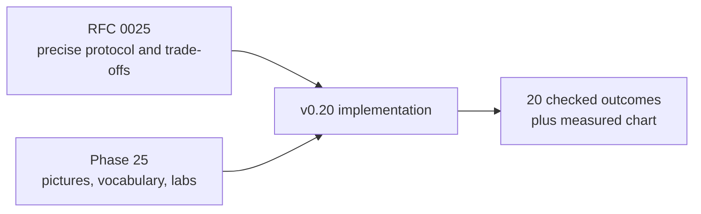
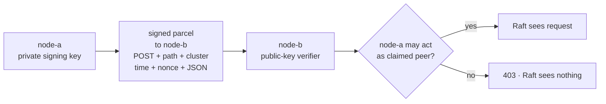
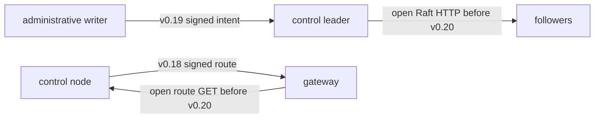
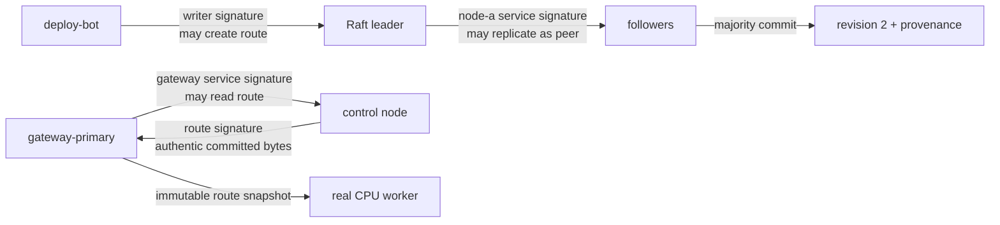
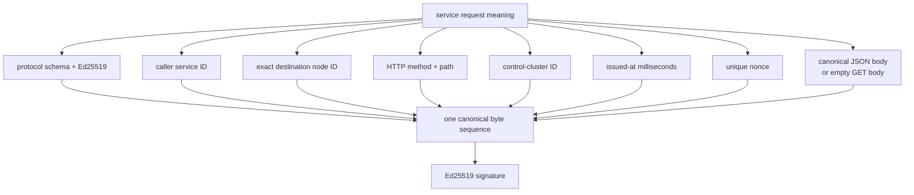
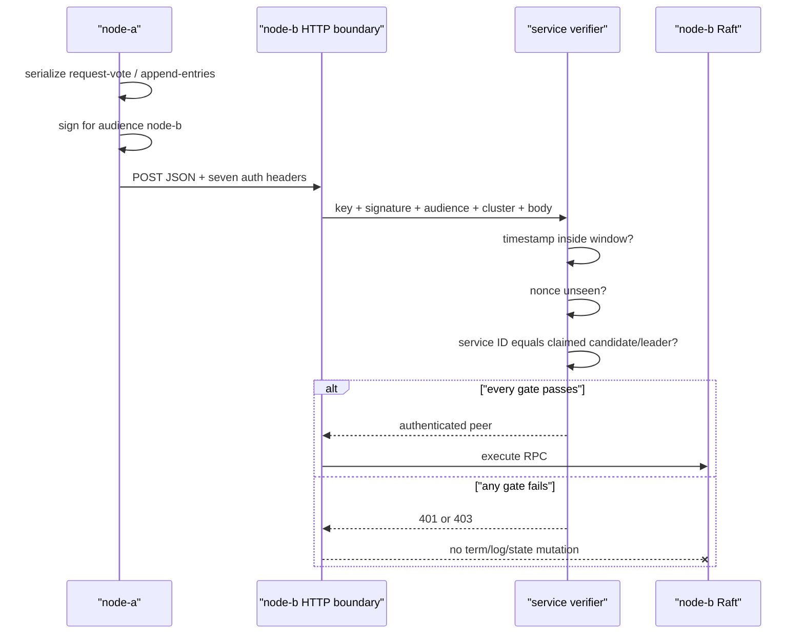
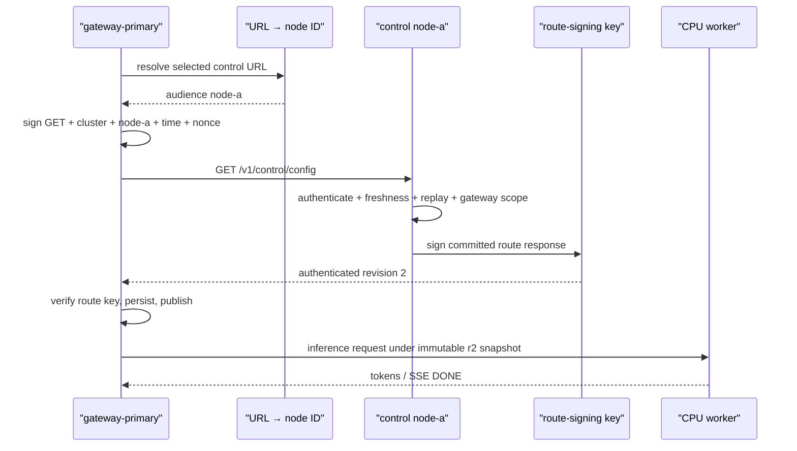
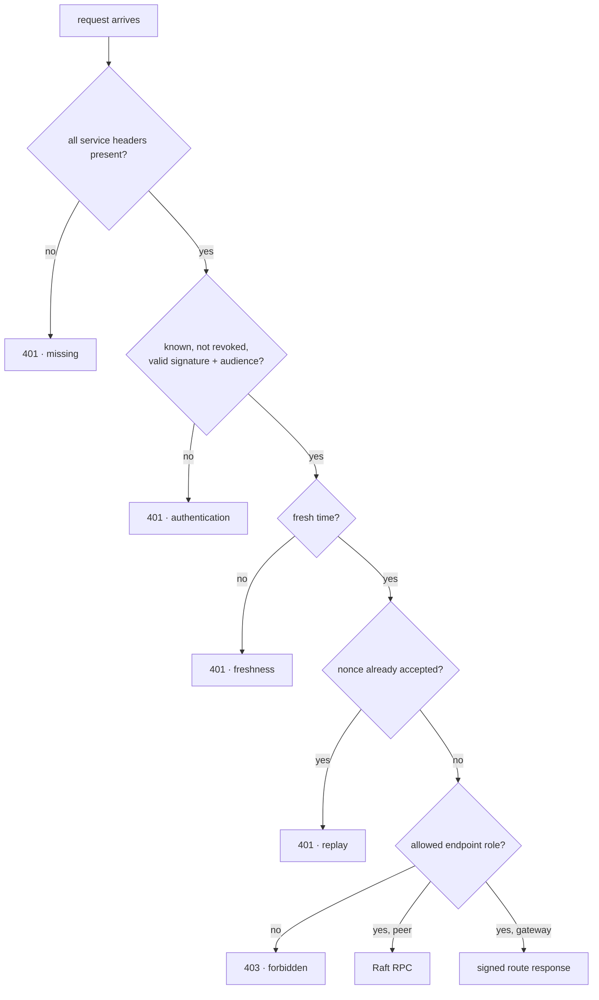
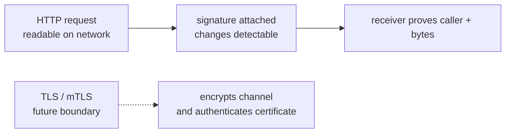

# Phase 25: Cryptographic service identities

This phase answers the machine-level question left after authorized writers and
signed route delivery:

> How does a control node know which service sent this exact Raft RPC or route
> request—and whether that service is allowed to use that endpoint?

The diagrams are the main path. Read the code only after you can narrate both
lanes without it.

## RFC versus learning document



The RFC is the contract. This guide builds intuition for why the contract has
each field and gate.

## Mental model: signed parcels with named recipients

Imagine each service has a unique seal:

- its **private key** stamps outgoing parcels;
- everyone has the matching **public key** to check the stamp;
- the parcel names one exact **recipient**;
- the stamp covers the label, timestamp, tracking number, and contents; and
- the recipient checks whether that sender may use this loading dock.



The seal does not hide the parcel. Anyone on the path can still read it. That
single distinction—**signed is not encrypted**—is the most important limit of
this phase.

## What was still open before v0.20

Three identity layers already existed, but two request arrows were open:



The cluster ID was only a namespace label. A caller could copy it. The route
signature authenticated the response, not the gateway request. The writer
signature authenticated a human/automation change intent, not Raft heartbeats.

## The complete trust chain now



Each arrow has its own identity and purpose. One valid signature never grants
every capability in the system.

## Authentication versus authorization

Use these two questions every time:

| Question | Name | v0.20 example |
|---|---|---|
| Who signed these exact request bytes? | Authentication | Ed25519 verifies `gateway-primary` |
| May that identity do this operation? | Authorization | Only a gateway ID may read the route |

An unknown service gets 401 because authentication failed. A valid gateway
trying to claim `candidate_id=node-b` gets 403 because it is known but forbidden
for the Raft-peer role.

## What exactly is signed?



If a relay changes term 51 to term 52, changes `GET` to `POST`, sends a request
for node A to node B, or changes one worker field, verification fails.

## Why every field exists

| Signed field | Attack or ambiguity it removes |
|---|---|
| Schema + algorithm | Interpreting bytes under a different protocol |
| Service ID | Not knowing which public key and policy identity to use |
| Audience ID | Replaying a valid request at another control node |
| Method + path | Moving a signature to another API operation |
| Cluster ID | Moving a request to another Raft namespace |
| Issued-at time | Keeping captured bytes eligible forever |
| Nonce | Accepting the same fresh request twice at one receiver |
| Canonical body | Changing request meaning after signing |

The signature covers meaning, not JSON whitespace.

## Raft request journey



The order matters. A high `term` is dangerous untrusted input until the service
gate finishes. In the retained proof, signed-but-tampered and valid-gateway-as-
peer requests carry a much higher term; both are rejected while the leader
stays in term 1.

## Gateway route-read journey



The request and response signatures are deliberately different:

- gateway service key: “I am allowed to ask this node for control state”; and
- route key: “these exact route bytes came from the configured authority.”

## The decision tree



## Vocabulary: every technical term

| Term | Plain-language picture |
|---|---|
| Service identity | Stable name plus signing key representing one process role |
| Private key / seed | Secret ability to create signatures |
| Public key | Non-secret ability to verify one identity's signatures |
| Ed25519 | Maintained public-key signature algorithm used here |
| Trust ring | Configured `service ID → public key` map |
| Revocation | Explicit deny decision overriding a known key |
| Authentication | Prove who signed the exact request meaning |
| Authorization / scope | Decide what that proven identity may do |
| Audience | Exact control node the caller intended to receive the request |
| Canonical JSON | Deterministic bytes for one parsed JSON meaning |
| Domain separation | Protocol prefix preventing cross-protocol signature reuse |
| Freshness window | Maximum past age and allowed future clock difference |
| Clock skew | Difference between caller and receiver clocks |
| Nonce | Unique signed request identifier |
| Replay | Sending an already accepted signed request again |
| Replay cache | Receiver memory of accepted `(service, nonce)` pairs |
| 401 Unauthorized | Identity/signature/time/replay gate did not establish an eligible caller |
| 403 Forbidden | Caller is authenticated but lacks this endpoint role |
| Request integrity | Signed fields cannot change undetected |
| Confidentiality | Hiding data from observers; signatures do not provide it |
| TLS | Encrypted channel protocol, not implemented in this phase |
| mTLS | TLS where client and server both present certificates; not implemented here |
| Hostname authentication | Proving the network name belongs to the server certificate; not provided here |
| Static trust | Configuration changes only through deployment/restart, not an online authority |
| Process-local | State exists in one process and disappears on restart |

## Signing is not encryption



v0.20 protects correctness of the received request. It does not stop an
observer reading the route, service IDs, timing, or signatures, and it does not
stop packet dropping.

## Why time and nonce are both needed

```mermaid
sequenceDiagram
    participant A as "captured request"
    participant C as "control receiver"
    A->>C: first fresh copy, nonce N
    C-->>A: accepted; remember N until expiry
    A->>C: second fresh copy, same nonce N
    C-->>A: 401 replay
    A->>C: copy after time window
    C-->>A: 401 stale, even after cache entry expires
```

Time bounds how long captured bytes matter. The nonce stops duplicates inside
that window. Because the cache is process-local, a restart forgets accepted
nonces; this is not durable exactly-once delivery.

## Why the gateway needs a URL-to-node map

The gateway chooses a URL, but the signature must name an identity. URLs and
service identities are different namespaces.

```text
node-a=http://control-a:7001
node-b=http://control-b:7002
node-c=http://control-c:7003
```

Missing mappings would force a guess. Extra mappings could hide stale
configuration. v0.20 requires the target URL set to match the configured
control URL set exactly and fails startup otherwise.

## Configuration lab

### Control node A

```bash
INFERLAB_RAFT_NODE_ID=node-a
INFERLAB_SERVICE_ID=node-a
INFERLAB_SERVICE_PRIVATE_KEY_B64='<node-a seed>'
INFERLAB_SERVICE_TRUSTED_KEYS='node-a=<pub>,node-b=<pub>,node-c=<pub>,gateway-primary=<pub>'
INFERLAB_SERVICE_REVOKED_IDS=''
INFERLAB_GATEWAY_SERVICE_IDS='gateway-primary'
INFERLAB_SERVICE_AUTH_MAX_AGE_MS=5000
INFERLAB_SERVICE_AUTH_MAX_FUTURE_SKEW_MS=1000
```

Nodes B and C use their matching IDs and private seeds but the same trust and
role policy.

### Gateway

```bash
INFERLAB_GATEWAY_SERVICE_ID=gateway-primary
INFERLAB_GATEWAY_SERVICE_PRIVATE_KEY_B64='<gateway seed>'
INFERLAB_CONTROL_SERVICE_TARGETS='node-a=http://control-a:7001,node-b=http://control-b:7002,node-c=http://control-c:7003'
```

Real systems should inject protected short-lived credentials, not paste raw
private seeds into shell history.

## What you can observe without reading code

`GET /v1/control/status` includes `service_authentication`:

1. `required`: are unsigned protected requests rejected?
2. `trusted_service_ids`, `revoked_service_ids`, `gateway_service_ids`: which
   public identities and roles exist?
3. `max_age_ms`, `max_future_skew_ms`: what clock policy applies?
4. `verifications`: how many signatures passed cryptography and time?
5. rejection counters: authentication, freshness, replay, authorization.
6. `authorized_peer_rpcs`, `authorized_gateway_reads`: which protected paths
   actually passed scope.
7. `replay_cache_entries`: current process memory, not durable history.
8. last verified/rejected service and error: the latest local observation.

Gateway status shows `service_authentication_enabled`, `service_id`, and
`control_service_targets`. Route-signature fields remain separate.

## Guided experiments

### Lab 1: run the exact proof

```bash
./scripts/proof-v0.20.sh
```

Predict first: followers cannot elect/replicate without signed peer requests;
five identity/integrity/time/replay failures should return 401; two wrong-role
requests should return 403; the high terms should change nothing; the real
request and SSE should succeed.

### Lab 2: change one body field

Compare `tampered-raft-rejected.json` with its authentication metadata. The
request was signed over term 51 but sent with term 52. Explain why the result is
401 before Raft compares terms.

### Lab 3: use the right key for the wrong job

Open `gateway-peer-forbidden.json`. The gateway signature is valid, current,
and addressed to the right node. It still receives 403 because
`gateway-primary != candidate_id node-b`.

### Lab 4: replay exact bytes

Compare `gateway-read-valid.json` and `replay-rejected.json`. The signature and
timestamp remain valid. Only the receiver's remembered nonce changed the
decision.

### Lab 5: send to another audience

Sign for node A and deliver to node B. The public key is trusted at B, but the
audience-bound signature must fail.

### Lab 6: restart the receiver

Observe that rejection counters and the replay cache reset. This experiment
disproves any claim of durable replay protection.

### Lab 7: inspect both signatures

In `gateway-read-valid.json`, find the service authentication on the request
and the route authentication in the response. Say out loud which direction and
question each signature protects.

## Evidence walkthrough


The retained run shows:

- 148 authorized Raft peer RPCs and 13 authorized gateway reads by the final
  capture;
- leader rejection classes of 3 authentication, 1 freshness, 1 replay, and 2
  authorization decisions before the real gateway starts;
- unchanged leader term 1 and committed revision 2 after two high-term attacks;
- exact `gateway-primary` service identity and three URL/audience mappings;
- separately verified `route-2026-b` response identity;
- one 185.707 ms real request and one 186.723 ms SSE reaching `[DONE]`; and
- 20/20 checked outcomes passing.

These counts and timings describe one loopback run. The transferable result is
the gate ordering and separation of identities.

## Read-the-code route

1. `service-auth/src/lib.rs` — follow canonical payload → sign → verify.
2. `control-plane/src/service_authentication.rs` — follow header identity →
   time → replay cache → counters.
3. `control-plane/src/lib.rs` — see the security gate before Raft handlers and
   the 401/403 split.
4. `control-plane/src/raft.rs` — see per-destination signing for vote and append
   RPCs.
5. `gateway/src/service_client.rs` — see the exact URL/audience map and signed
   GET.
6. `gateway/src/main.rs` — see fail-fast environment validation and polling.
7. `scripts/proof-v0.20.sh` — follow the live attack/success sequence.
8. `benchmarks/check_service_auth.py` — inspect every falsifiable assertion.

While reading, draw four columns: caller meaning, cryptographic proof, role
policy, state transition. No state transition should appear left of all three
decision columns.

## Alternatives and why this one

| Alternative | Why not this phase |
|---|---|
| mTLS immediately | Adds encryption but also certificate issuance/rotation/hostname policy; request signatures isolate the first identity lesson |
| Bearer token | Does not intrinsically bind body, destination, time, or nonce |
| Shared HMAC | Every verifier would hold forging power for every service |
| One key for writer, peers, gateway, route | Makes every compromise cross every boundary and erases signature meaning |
| Trust means all endpoints | Authentication is not authorization; gateway-as-peer would pass |
| Durable nonce in Raft | Heartbeats/polls would turn replay tracking into consensus load |
| Guess identity from URL | URL is not a cryptographic identity; mapping errors should fail startup |

## Limitations you should be able to explain

1. **No encryption:** HTTP content and metadata remain visible.
2. **No hostname proof:** audience ID is protocol data, not a TLS certificate.
3. **Static long-lived keys:** deployment owns rotation and revocation timing.
4. **Environment secrets:** educational convenience, not protected custody.
5. **Local replay cache:** restart forgets nonces; it is capped at 10,000.
   A trusted high-volume caller can fill it until entries expire because this
   phase adds no per-identity rate limit.
6. **Clock dependence:** wrong clocks can reject legitimate traffic or widen
   eligibility within configured bounds.
7. **Compromised service:** a stolen key can act within that identity's role.
8. **Compromised control process:** local code can bypass its own verifier.
9. **Unauthenticated diagnostics:** health/status remain observable.
10. **No network availability guarantee:** signatures cannot stop delay or
    packet loss.
11. **Policy drift:** static trust can differ temporarily across nodes.
12. **Single-host proof:** no hostile network, multi-host partition, or CA
    failure is modeled.

## Check your understanding

1. Why did the cluster ID not authenticate a peer?
2. What is the difference between the writer key and a node service key?
3. Why bind the exact audience node?
4. Why are HTTP method and path signed?
5. Why is canonical JSON used?
6. What does domain separation prevent?
7. Why does an unknown key get 401 but a gateway acting as a peer get 403?
8. Why must the gate run before Raft sees `term`?
9. What different problems do timestamp and nonce solve?
10. What happens to replay history on restart?
11. Why does a gateway also verify a separate response signature?
12. Why must the URL-to-node mapping be exact?
13. What does mTLS add beyond these signatures?
14. What can a network observer still learn or disrupt?
15. Which metrics are durable and which reset?

If you can answer those without code, you can imagine the complete v0.20 path.

## Next boundary

v0.20 establishes scoped machine identity at the request layer. The next
security step should manage the lifecycle of that identity and, where needed,
secure the channel: short-lived credentials/certificates, overlap-safe
rotation, protected key custody, and TLS/mTLS without breaking quorum or route
availability.
