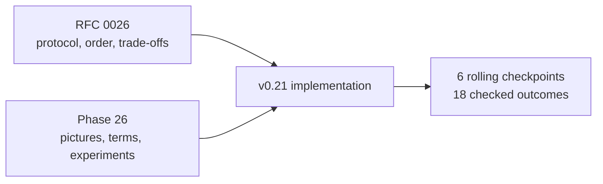
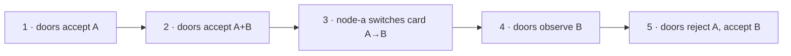
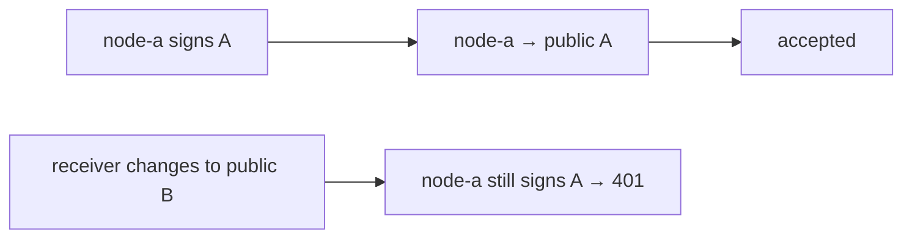
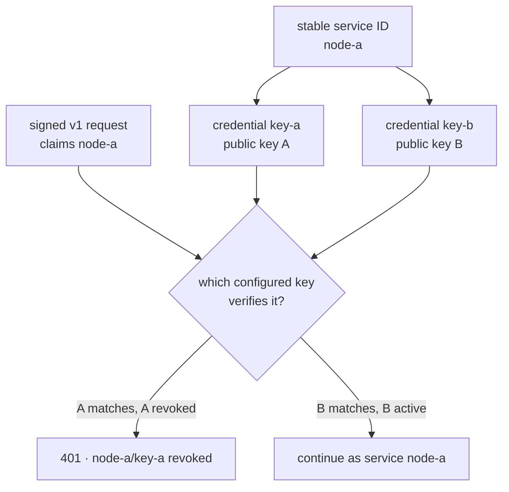
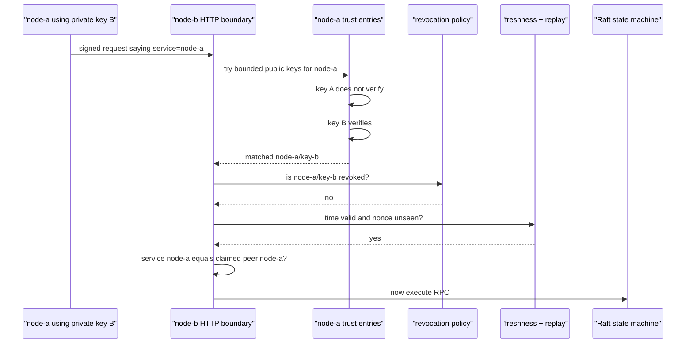
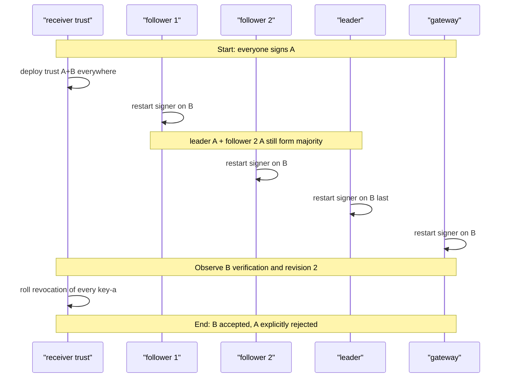
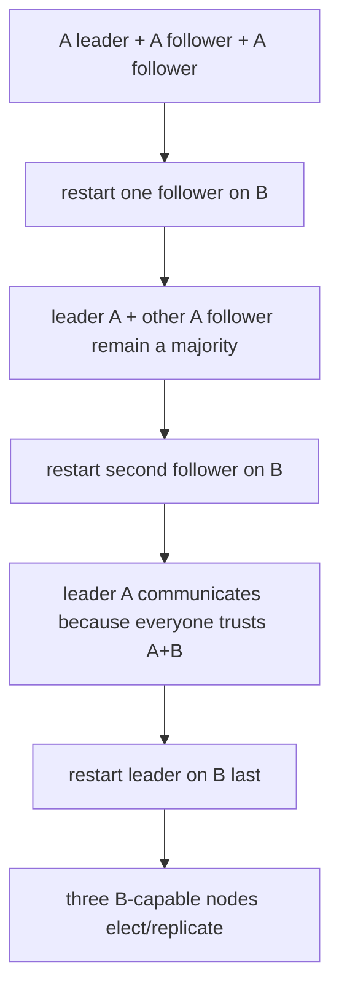
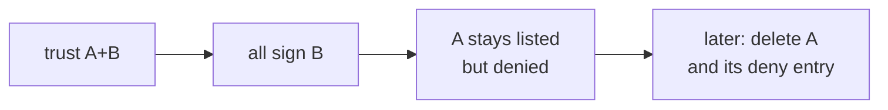
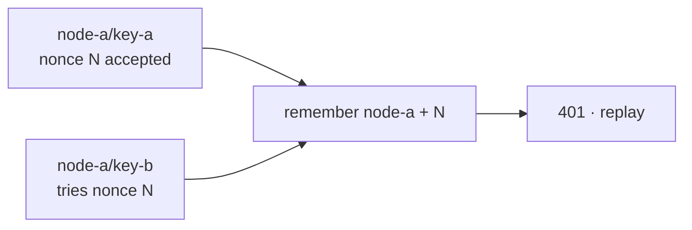
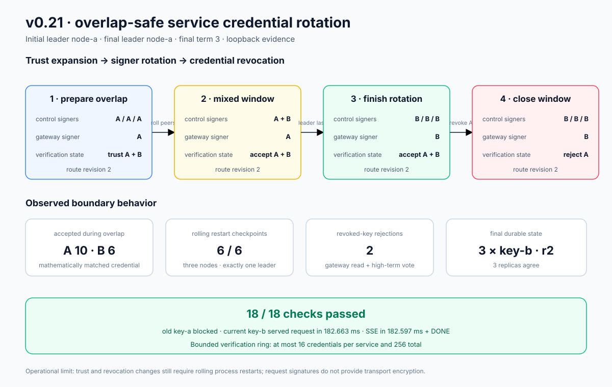

# Phase 26: Overlap-safe service credential rotation

This phase answers the practical question left by cryptographic service
identities:

> How can every control node and the gateway move to a new signing key without
> breaking Raft quorum or route reads—and how can only the old key be revoked?

Use the diagrams as the main route. You should be able to narrate the rollout
before reading Rust.

## RFC versus learning document



The RFC is the durable contract. This guide is the visual mental model and lab
manual.

## Mental model: changing locks without closing the building

Imagine `node-a` is a staff role and its signing keys are access cards:

- **key A** is the old card;
- **key B** is the replacement card;
- the **service ID** `node-a` is the person's stable role;
- the **trust ring** is each door's accepted-card list; and
- **revocation** marks one accepted card as explicitly unusable.



If the person switches to B before doors accept B, they are locked out. If the
doors remove A before the person switches, they are also locked out. The overlap
window is not accidental weakness; it is the bridge that makes rotation
available.

## The limitation in v0.20

One service ID had one public key:



There was no instant when independently restarted senders and receivers could
all change together. For Raft, two incompatible nodes can remove the majority.
For the gateway, incompatibility stops authenticated route refreshes.

## What v0.21 adds



The important split is:

| Thing | Stays stable? | Decides what? |
|---|---:|---|
| Service ID `node-a` | Yes | Authorization role: may act as peer `node-a` |
| Credential ID `key-a` / `key-b` | No | Which public key proved the service |
| Private key | Rotates | Ability to sign new requests |
| Public-key trust entry | Overlaps | Which signatures a receiver can recognize |
| Revocation entry | Added last | Which recognized credential must still fail |

## Complete request journey

The wire request still carries the seven v0.20 headers. It does not claim
`key-a` or `key-b`.



The receiver derives the credential from mathematics: whichever public key
verifies the signature. The sender cannot ask the receiver to call A “B.”

## Why no credential header?

Keeping the request schema unchanged makes v0.20-style requests compatible.
The trade-off is extra verification work:

```text
best case:  1 signature check
worst case: 16 signature checks for one service
fleet bound: 256 configured credentials per receiver
```

A future signed credential selector could make lookup constant-time, but would
need a new canonical payload and a dual-version rollout. This phase chooses a
bounded linear scan so the learning step stays focused on lifecycle ordering.

## The safe rollout, one frame at a time



### Phase-state chart

| Phase | Control signers | Gateway signer | Receiver policy for A | Receiver policy for B | Rollback available? |
|---|---|---|---|---|---:|
| Start | A / A / A | A | accept | unknown | No |
| Prepared | A / A / A | A | accept | accept | Yes |
| Mixed | A + B | A | accept | accept | Yes |
| Rotated | B / B / B | B | accept | accept | Yes |
| Closed | B / B / B | B | reject | accept | No, not to A |

The prepared and rotated rows look permissive because they are the planned
rollback window. Closing that window is a distinct, observable decision.

## Why followers first and leader last?



The exact leader may change while processes restart. The invariant is not
“node A stays leader.” It is “every checkpoint has all three reachable statuses,
exactly one leader, and route revision 2.”

## Trust, use, revoke, remove

These are four different operations:

1. **Trust B:** receivers can verify B, but nobody must use it yet.
2. **Use B:** a sender's local private seed changes to B.
3. **Revoke A:** receivers recognize A and intentionally reject it.
4. **Remove A:** a later cleanup deletes both A's trust entry and its revocation.



v0.21 proves through the revocation state. The parser requires a revoked
credential to remain present in the trust ring, so removal and revocation-entry
cleanup must happen together in a later rollout.

## Replay behavior across rotation

The replay cache uses `(service ID, nonce)`, not credential ID:



Changing a key does not create a fresh replay namespace for the same service.
The cache is still process-local and disappears on restart.

## Configuration lab

### Step 1: prepare A+B trust

```bash
INFERLAB_SERVICE_TRUSTED_KEYS='node-a/key-a=<pub-a>,node-a/key-b=<pub-b>,node-b/key-a=<pub-a>,node-b/key-b=<pub-b>,node-c/key-a=<pub-a>,node-c/key-b=<pub-b>,gateway-primary/key-a=<pub-a>,gateway-primary/key-b=<pub-b>'
INFERLAB_SERVICE_REVOKED_CREDENTIALS=''
```

### Step 2: select a local control signer

```bash
INFERLAB_SERVICE_ID=node-a
INFERLAB_SERVICE_CREDENTIAL_ID=key-b
INFERLAB_SERVICE_PRIVATE_KEY_B64='<node-a key-b seed>'
```

### Step 3: select the gateway signer

```bash
INFERLAB_GATEWAY_SERVICE_ID=gateway-primary
INFERLAB_GATEWAY_SERVICE_CREDENTIAL_ID=key-b
INFERLAB_GATEWAY_SERVICE_PRIVATE_KEY_B64='<gateway key-b seed>'
```

### Step 4: close the overlap window

```bash
INFERLAB_SERVICE_REVOKED_CREDENTIALS='node-a/key-a,node-b/key-a,node-c/key-a,gateway-primary/key-a'
```

Never deploy step 2 before every required receiver has completed step 1. Never
deploy step 4 before every required sender has completed steps 2 and 3.

## What you can observe without reading code

Control `GET /v1/control/status` now answers:

| Field | Question it answers |
|---|---|
| `local_service_credential_id` | Which key does this node use for outgoing service requests? |
| `trusted_service_credentials` | Which service/key pairs can this receiver verify? |
| `revoked_service_credentials` | Which recognized credentials are explicitly denied? |
| `verifications_by_credential` | Which credentials actually produced accepted requests here? |
| `credential_revocation_rejections` | How many matching-but-revoked signatures were blocked? |
| `last_verified_service_credential` | What was the latest accepted credential? |
| `last_rejected_service_credential` | What was the latest specifically rejected credential? |

Gateway status exposes `control_plane.service_credential_id`. These fields are
local and reset on restart. Use committed revision/term to inspect durable
cluster state, and credential fields to inspect deployment convergence.

## Vocabulary: every new term

| Term | Plain-language meaning |
|---|---|
| Credential | One public/private key pair proving a stable service identity |
| Credential ID | Local configuration label such as `key-a`; not sent on the wire |
| Qualified credential | Combined label such as `node-a/key-b` |
| Overlap window | Period when old and new credentials are both accepted |
| Trust expansion | Add B to receivers before any sender uses B |
| Signer rotation | Change the local private key used for outgoing signatures |
| Credential revocation | Explicitly deny one key without disabling its service |
| Whole-service revocation | Deny every credential belonging to a service ID |
| Rolling restart | Restart one process at a time while the rest keep serving |
| Quorum | Majority of Raft nodes; two of three here |
| Mixed-version traffic | Requests produced by old and new signer configurations during rollout |
| Convergence | Every intended process has reached the same rollout phase |
| Rollback window | Time when A still works and can be restored if B fails |
| Cleanup wave | Later removal of an obsolete key and its deny entry |
| Bounded linear verification | Try a limited number of keys until one verifies |
| Local diagnostic | Counter/state belonging to one process and reset on restart |
| Durable fact | Replicated route revision/term that survives process restart |

## Guided experiments

### Lab 1: run the exact rolling proof

```bash
./scripts/proof-v0.21.sh
```

Predict first: six restart checkpoints should retain three statuses and exactly
one leader; A should work before revocation, fail afterward, and B should keep
serving route reads and inference.

### Lab 2: inspect the overlap evidence

Open `after-control-key-b.json` and find
`verifications_by_credential`. Explain why accepted A and B traffic proves the
receiver did not merely relabel one key.

### Lab 3: inspect a precise revocation

Compare `revoked-gateway-key-a.json` and `valid-gateway-key-b.json`. Both claim
`gateway-primary`; only the verifying public key differs. Explain why the first
is 401 and the second returns revision 2.

### Lab 4: test the Raft safety boundary

Open `before-revoked-attacks.json`, `revoked-peer-key-a.json`, and
`after-revoked-attacks.json`. The rejected request carries a much higher term.
Verify that authentication stops it before Raft changes term or revision.

### Lab 5: break rollout order in a disposable environment

Configure one receiver to trust only A, then start a peer on B. Observe
signature rejection. Do not do this in a real cluster: the experiment exists to
make the trust-first invariant memorable.

### Lab 6: revoke the whole service instead

Set `INFERLAB_SERVICE_REVOKED_IDS=node-a`. Confirm both A and B fail. This shows
why whole-service revocation is an emergency disable, not a rotation primitive.

### Lab 7: duplicate a public key under two labels

Configure `node-a/key-a` and `node-a/key-b` with the same public key. Startup
must fail because the receiver could not truthfully say which credential
verified the request.

### Lab 8: exceed the bound

Configure 17 credentials for one service. Startup must fail rather than letting
untrusted traffic trigger unbounded signature work.

## Evidence walkthrough



The retained run shows:

- three key-A controls and a key-A gateway starting with A+B trust;
- route revision 2 committed before any signer change;
- six rolling checkpoints with all three statuses and exactly one leader;
- accepted A and B requests in the overlap window;
- an old A gateway read returning 200 before revocation;
- all control and gateway local signers ending on B;
- old gateway A and peer A requests returning explicit 401 revocation errors;
- a rejected high-term vote leaving term and revision unchanged;
- a current B gateway read returning revision 2;
- a 182.663 ms request and 182.597 ms SSE through `[DONE]`; and
- 18/18 machine-readable outcomes passing.

Counts and timings are one loopback run. The reusable result is the rollout
ordering and the service/credential separation.

## Read-the-code route

1. `service-auth/src/lib.rs` — read trust parsing, bounded key trial, matched
   credential, then precise revocation.
2. `control-plane/src/service_authentication.rs` — follow credential counters,
   replay identity, and rejection classification.
3. `control-plane/src/raft.rs` — see the local outgoing credential and why the
   service ID stays the peer ID.
4. `control-plane/src/main.rs` — see optional credential IDs and fail-fast
   environment validation.
5. `gateway/src/service_client.rs` and `gateway/src/main.rs` — see independent
   gateway signer selection and status.
6. `scripts/proof-v0.21.sh` — follow prepare → rotate controls → rotate gateway
   → revoke → attack → serve.
7. `benchmarks/check_service_credential_rotation.py` — read the 18 exact claims.
8. `benchmarks/render_service_credential_rotation_svg.py` — see how raw JSON
   becomes the retained evidence chart.

While reading, draw two parallel rows: **receiver policy** and **sender key in
use**. Every transition must change receiver policy before sender use, and must
change sender use before revocation.

## Alternatives and why this one

| Alternative | Why not in v0.21 |
|---|---|
| One atomic key replacement | No atomic transaction spans all processes |
| Revoke the service ID | Disables both old and new credentials |
| Unsigned credential selector header | Lets untrusted input select credential metadata |
| Signed v2 credential selector | Better lookup, but needs wire/canonicalization migration |
| Shared replacement key for all peers | Collapses identity and compromise boundaries |
| Hot reload | Needs authenticated distribution, versioning, rollback, and convergence rules |
| mTLS immediately | Adds channel security but also certificate issuance and lifecycle machinery |

## Limitations you should be able to explain

1. **Static deployment:** trust and revocation still require rolling restarts.
2. **Linear verification:** a request may require up to 16 Ed25519 checks.
3. **Configuration labels:** credential IDs are local metadata; fleet labels
   must be consistent.
4. **Temporary drift:** a key remains usable at receivers not yet revoked.
5. **Resetting diagnostics:** each restart clears the counters used to observe
   rollout traffic.
6. **No encryption:** HTTP requests and responses remain readable in transit.
7. **No hostname proof:** protocol audience is not a TLS certificate.
8. **Long-lived environment secrets:** still educational, not protected custody.
9. **Current-key compromise:** stealing B preserves the service's authorized
   power until B is revoked.
10. **Local replay memory:** restart forgets accepted nonces.
11. **Operator order matters:** the implementation cannot prove the fleet
    finished one wave before the next begins.
12. **Single-host proof:** no partition, multi-host delay, or certificate failure
    is modeled.

## Check your understanding

1. What stays stable when `node-a/key-a` becomes `node-a/key-b`?
2. Why must every receiver trust B before any sender uses B?
3. Why must every sender use B before any receiver revokes A?
4. Why is whole-service revocation wrong for routine rotation?
5. How does the receiver identify a credential without a header?
6. What is the worst-case verification work per service request?
7. Why can the same public key not have two labels under one service?
8. Why is replay memory keyed by service and nonce rather than credential?
9. Which status field proves a node's outgoing signer changed?
10. Which status field proves a receiver accepted B traffic?
11. Why are diagnostics local while route revision is durable?
12. Why rotate followers before the leader?
13. What rollback remains during the A+B window?
14. Why keep A trusted-but-revoked before later removal?
15. What would a signed credential selector improve and complicate?
16. What does TLS/mTLS still add after this phase?

If you can answer those without code, you can imagine the complete v0.21
rotation and revocation path.

## Next boundary

v0.21 makes static credential lifecycle overlap-safe. RFC 0027 and Phase 27 now
turn receiver-policy changes into root-signed, versioned local snapshots with
online per-process reload, last-known-good retention, and restart-safe rollback
floors. Built-in fleet distribution, short-lived identities, protected secret
custody, TLS/mTLS, and partial-fleet failure semantics remain later boundaries.
