# Phase 27: Signed, versioned online service trust

This phase answers the restart-heavy limitation left by credential rotation:

> How can every running control node adopt a receiver-trust change, prove who
> authorized it, reject rollback, and keep serving when a bad update appears?

Use the diagrams first. The goal is to imagine the complete update and request
journey before reading Rust.

## RFC versus learning document

RFC means **Request for Comments**. In InferLab, the RFC is the durable
engineering contract; this phase guide is the visual mental model and lab.

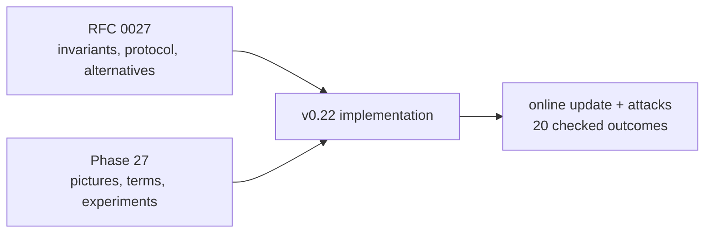

Read the RFC when asking “why this contract?” Read this guide when asking
“what moves where, and what can I observe?”

## Mental model: a signed access-list bulletin

Imagine every control node has a security desk. The desk needs the current
list of staff access cards:

- the **service-trust root** is the officer authorized to sign the bulletin;
- the **snapshot** is the complete signed access-card bulletin;
- the **generation** is its strictly increasing edition number;
- the **watcher** checks the local bulletin board for a newer edition;
- the **active policy** is the list the desk currently enforces;
- the **last known good policy** is the valid list kept when a bad bulletin
  appears; and
- the **durable floor** records the highest accepted edition so a restart
  cannot forget it.

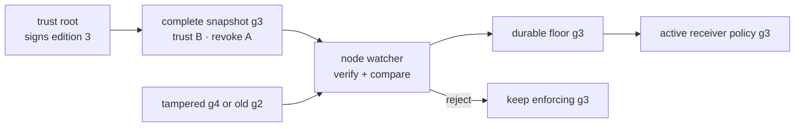

The central rule is: **authenticate, order, persist, then activate**.

## The limitation in v0.21

v0.21 safely overlapped credentials A+B, changed senders to B, then revoked A.
But every receiver policy change was static process configuration:

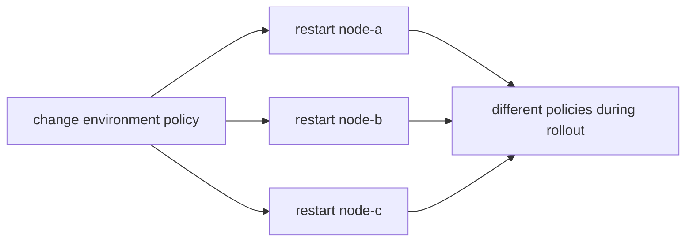

That approach had four missing properties:

1. no signature authenticated the policy artifact;
2. no generation ordered two policies;
3. no persistent memory rejected an older policy after restart; and
4. no running receiver could update without restarting its Raft process.

## What v0.22 adds

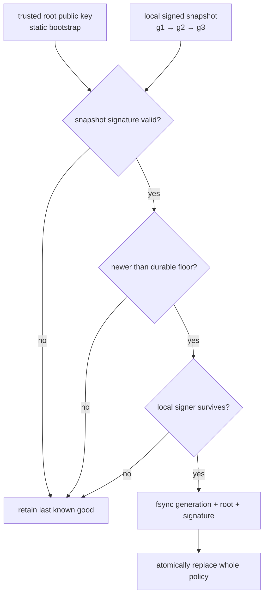

The snapshot contains the whole receiver policy, not a patch. Credentials,
credential revocations, whole-service revocations, and gateway roles therefore
change as one verified unit inside one process.

## The four different keys in the system

Do not collapse all signatures into “the key.” They guard different acts:

| Key | Signs | Proves |
|---|---|---|
| Service-trust root | Complete receiver-trust snapshot | Who may define accepted service credentials |
| Service credential | One control HTTP request | Which service sent this request |
| Administrative writer key | One requested route mutation | Who may request a route change |
| Route-delivery key | One committed route response | Which control authority delivered route bytes |

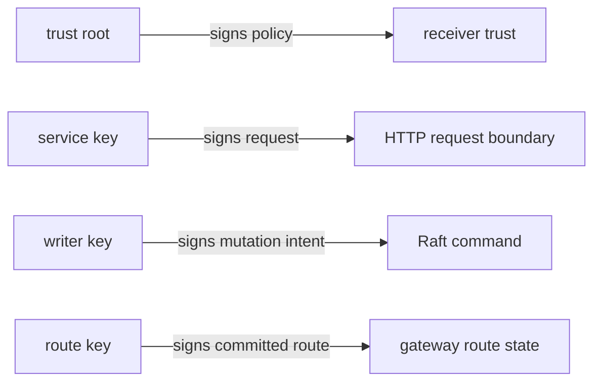

Compromise of one key has the authority of that key; it does not magically
become every other role.

## Complete policy-publication journey

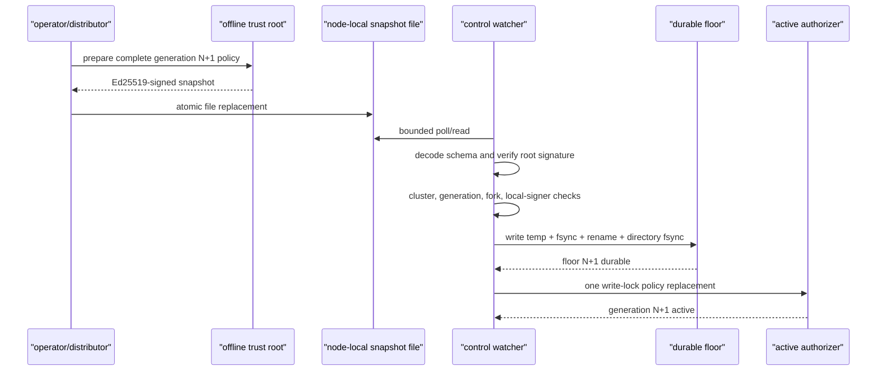

The file distributor is deliberately outside InferLab v0.22. The artifact is
authenticated even if the local copy mechanism is simple, but publishing to
all nodes and observing acknowledgements remain operational work.

## What exactly is signed?

The root signature binds:

```text
policy schema
cluster ID
positive generation
issue time
ordered trusted credentials and public keys
ordered whole-service revocations
ordered credential revocations
ordered gateway service IDs
authentication schema + algorithm + root key ID
```

It uses domain-separated, length-prefixed binary framing. JSON whitespace is
irrelevant, but changing any meaningful signed value breaks verification.

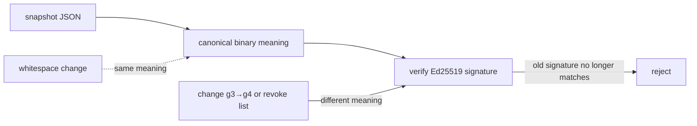

## Startup and runtime intentionally differ

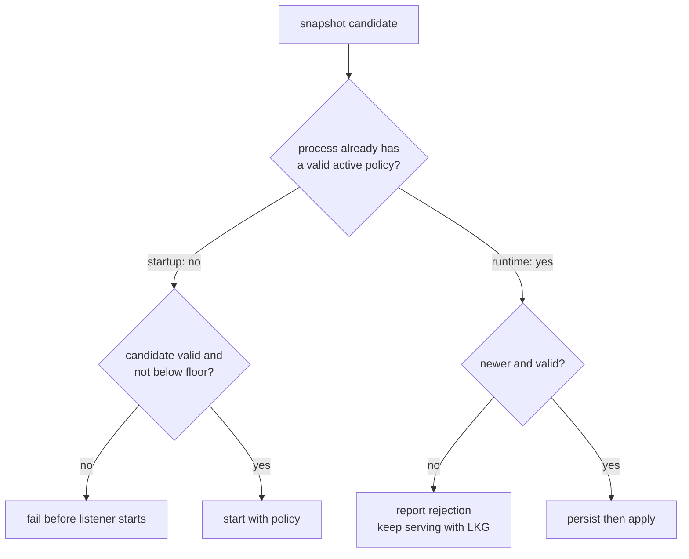

At startup there is no in-memory policy to trust, so failure closes. At
runtime there is a previously verified policy, so invalid new input must not
turn an artifact mistake into process loss.

## Generation is order; issue time is context

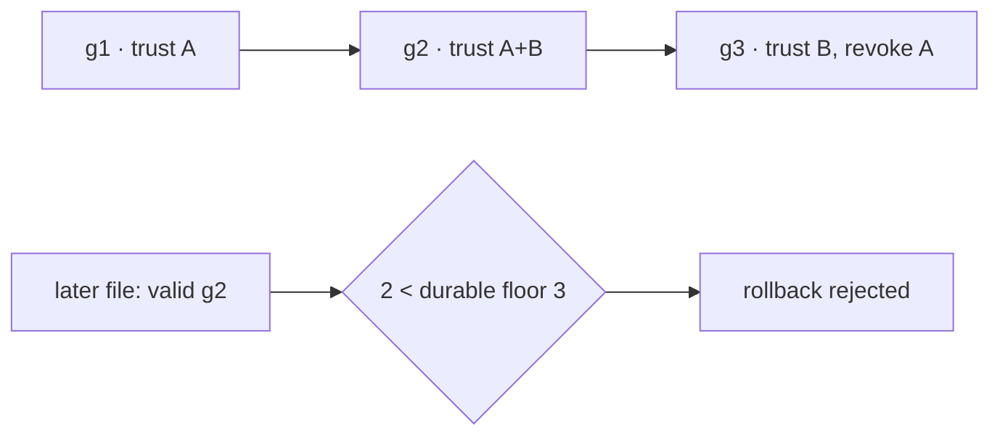

The authenticated issue time helps diagnostics. It does not expire the policy
and does not decide which edition wins. Wall clocks can move; the operator's
generation expresses the intended order.

## Why the floor stores a signature too

Generation alone cannot distinguish two different valid policies both called
g3:

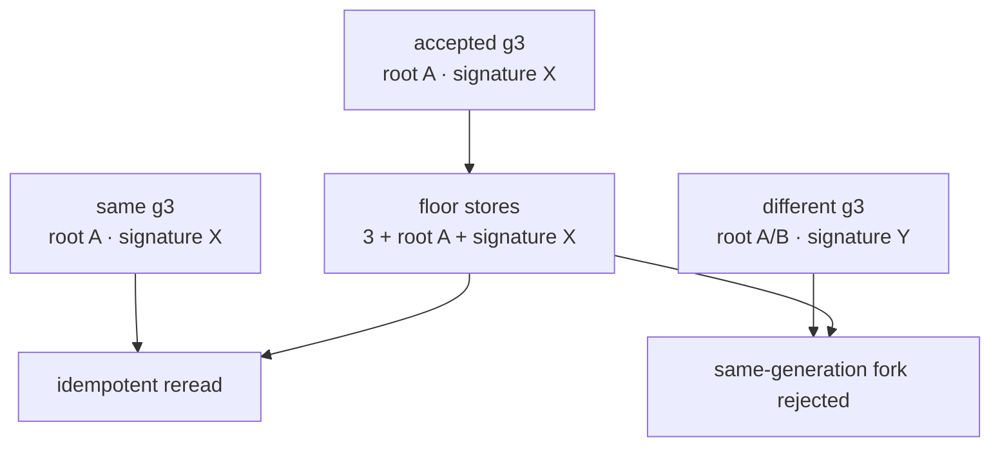

Even a root rotation must use a higher generation. This prevents ambiguity
about which complete policy was accepted first.

## Persist before activate

The order survives the most dangerous crash window:

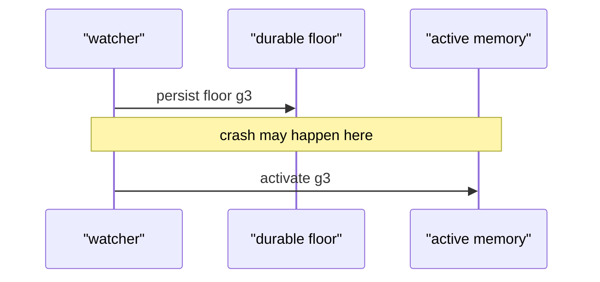

If the process crashes after disk persistence but before memory activation, it
may require g3 on restart. That is an availability inconvenience, but it cannot
silently restart with g2. Activating first would create exactly that rollback
window.

## Request handling during a swap

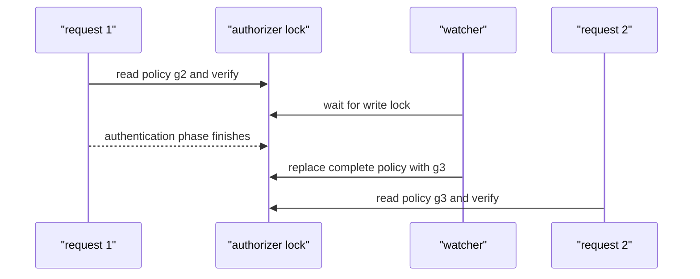

One request can finish authentication against the previous complete policy.
Later authentication sees the new complete policy. No request sees half of g2
and half of g3.

## Local-signer survival guard

A control node signs outbound Raft requests using its own local credential. It
must not adopt a policy that immediately makes that credential unacceptable:

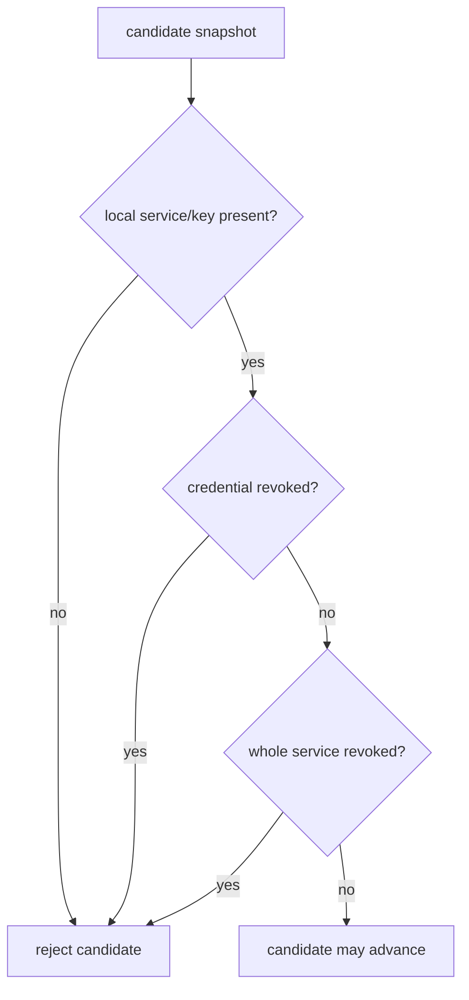

This is a per-node guard, not a fleet transaction. A B-signing node may accept
a snapshot that an A-signing node rejects. Safe sender rotation and convergence
observation are still necessary.

## The exact v0.22 learning sequence

| Step | Snapshot | Running controls | Gateway signer | Expected result |
|---|---|---|---|---|
| 1 | g1 trusts A | Start on g1 | A | Authenticated baseline |
| 2 | g2 trusts A+B | Reload online | A | B becomes usable without control restart |
| 3 | g2 unchanged | Same PIDs | B | Sender rotates inside overlap |
| 4 | g3 trusts B, revokes A | Reload online | B | A denied; B remains valid |
| 5 | old valid g2 | Same PIDs | B | Rollback rejected; g3 retained |
| 6 | tampered higher generation | Same PIDs | B | Signature rejected; g3 retained |
| 7 | restart one node with g2 | New node PID | B | Durable floor 3 blocks startup |
| 8 | restore g3 | Restarted follower rejoins | B | Cluster and real inference recover |

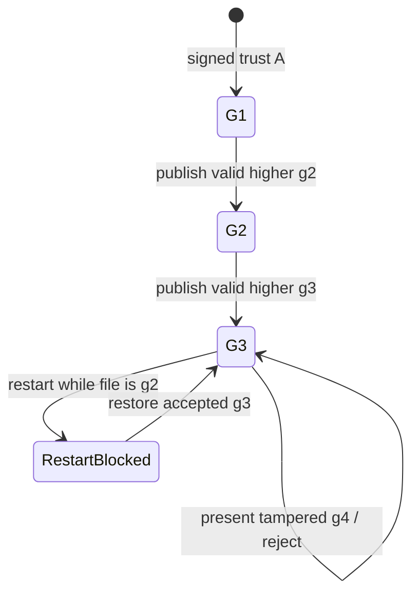

## Configuration lab

### Root: generate a deployment root public key

```bash
INFERLAB_SERVICE_TRUST_ROOT_KEY_ID=service-trust-root-a \
INFERLAB_SERVICE_TRUST_ROOT_PRIVATE_KEY_B64='<base64-ed25519-seed>' \
  cargo run -q -p service-auth --bin service_trust_public_key
```

Keep the private seed with the deployment signer. Controls receive only the
root public key.

### Sign a complete policy

```bash
INFERLAB_SERVICE_TRUST_ROOT_KEY_ID=service-trust-root-a \
INFERLAB_SERVICE_TRUST_ROOT_PRIVATE_KEY_B64='<base64-root-seed>' \
  cargo run -q -p service-auth --bin sign_service_trust -- \
  unsigned-policy.json > signed-policy.json
```

The unsigned input still includes schema, cluster, generation, issue time,
credentials, revocations, and gateway IDs. The helper validates the complete
policy before it signs.

### Start one control in signed snapshot mode

```bash
INFERLAB_SERVICE_ID=node-a
INFERLAB_SERVICE_CREDENTIAL_ID=key-a
INFERLAB_SERVICE_PRIVATE_KEY_B64='<node-a-key-a-seed>'
INFERLAB_SERVICE_TRUST_SNAPSHOT_PATH='/run/inferlab/node-a-service-trust.json'
INFERLAB_SERVICE_TRUST_STATE_PATH='/var/lib/inferlab/node-a-trust-floor.json'
INFERLAB_SERVICE_TRUST_ROOT_KEYS='service-trust-root-a=<base64-root-public-key>'
INFERLAB_SERVICE_TRUST_REVOKED_ROOT_KEY_IDS=''
INFERLAB_SERVICE_TRUST_POLL_MS=100
```

Snapshot mode cannot be mixed with static
`INFERLAB_SERVICE_TRUSTED_KEYS`, service revocations, or gateway-role lists.
There must be exactly one source of active receiver-policy meaning.

## What you can observe without reading code

Control `GET /v1/control/status` exposes:

| Field | Question it answers |
|---|---|
| `trust_policy_source` | Is trust disabled, static, or signed-snapshot? |
| `trust_policy_generation` | Which edition is active in this process? |
| `trust_policy_signing_key_id` | Which root authenticated it? |
| `trust_policy_issued_at_ms` | When did the signer say it issued the policy? |
| `trust_policy_loaded_at_ms` | When did this process activate it? |
| `trust_policy_reloads` | How many higher generations were applied online? |
| `trust_policy_rejections` | How many changed bad candidates were rejected? |
| `last_trust_policy_error` | Why was the latest candidate rejected? |
| `trusted_service_credentials` | Which service/key pairs are active now? |
| `revoked_service_credentials` | Which recognized exact credentials are denied? |

For three nodes, convergence means all three report the intended generation and
policy contents. Merely copying three files is not evidence of activation.

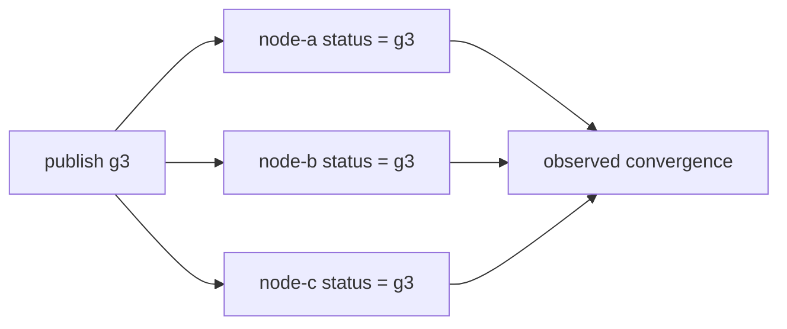

## Guided experiments

### Lab 1: reproduce the full proof

```bash
./scripts/proof-v0.22.sh
```

Follow `g1 → g2 → g3`, then the rollback, tamper, and restart-floor attacks.
Read `docs/results/v0.22/raw/assertions.json` before the SVG; the chart is a
view of those machine-readable facts.

### Lab 2: tamper with one meaningful field

After signing g3, change `generation`, a public key, or a revocation entry
without signing again. The watcher must report signature failure and keep g3.
Explain why changing JSON indentation does not have the same effect.

### Lab 3: publish a valid older snapshot

Put the original root-signed g2 back after g3 is active. The signature is valid,
but ordering is invalid. Verify generation remains 3 and the rejection count
rises.

### Lab 4: create a same-generation fork

Sign two different policies as generation 4. Let a node accept the first, then
present the second. The durable signature identity must classify the second as
a conflict, not an idempotent reread.

### Lab 5: try to remove the local signer

On an A-signing control, publish a higher snapshot that removes or revokes that
node's A credential. It must keep its previous policy. Rotate the local signer
to B only after B is trusted, then publish the final A revocation.

### Lab 6: remove the snapshot file at runtime

The process should continue using last known good policy and report the source
error once. Restart the process while the file is absent: startup must fail
because there is no in-memory policy to retain.

### Lab 7: delete the floor in a disposable directory

First prove an old snapshot is rejected after restart with the floor present.
Then, only in a throwaway lab data directory, remove the floor and observe why
local filesystem integrity is an explicit assumption. This is not a supported
recovery procedure.

### Lab 8: compare static compatibility mode

Start without `INFERLAB_SERVICE_TRUST_SNAPSHOT_PATH` and use the v0.21 static
variables. Confirm status reports `static-environment` and policy does not
reload. This proves compatibility, not online behavior.

## Evidence walkthrough

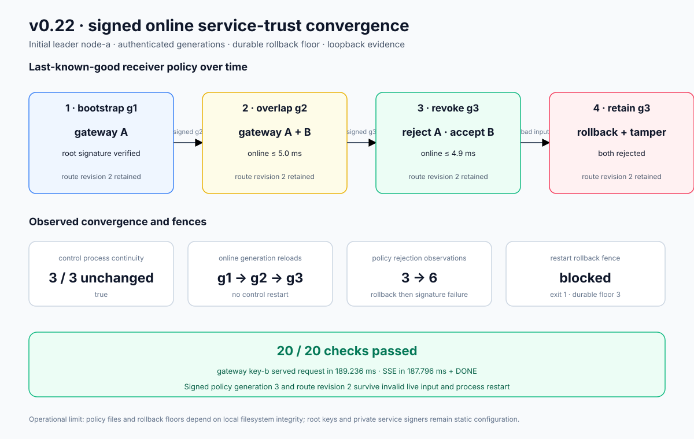

The retained exact-process run shows:

- three controls bootstrapping from root-signed g1;
- all unchanged control processes loading g2 in 5.001 ms observed proof time;
- credential B working in the A+B overlap;
- all controls loading g3 in 4.856 ms and rejecting A while B works;
- valid signed rollback g2 and signature-tampered input both retaining g3;
- a restarted follower refusing g2 because its durable floor is g3;
- that follower rejoining after g3 is restored;
- route revision 2 surviving the entire sequence;
- a 189.236 ms real request and 187.796 ms SSE through `[DONE]`; and
- all 20 machine-readable assertions passing.

These are single-host loopback observations, not a fleet convergence SLO.

## Read-the-code route

1. `service-auth/src/trust_snapshot.rs` — snapshot types, canonical framing,
   root verification, and compilation into the request trust ring.
2. `service-auth/src/bin/sign_service_trust.rs` — turn a complete unsigned
   policy into a signed artifact.
3. `control-plane/src/service_trust.rs` — bounded read, bootstrap, floor
   comparison, durable write, watcher, and local-signer guard.
4. `control-plane/src/service_authentication.rs` — atomic active policy and
   reload/rejection diagnostics.
5. `control-plane/src/main.rs` — select static versus snapshot mode and launch
   the watcher.
6. `benchmarks/service_trust_probe.py` — observe all nodes until generation
   convergence.
7. `scripts/proof-v0.22.sh` — exact process and attack sequence.
8. `benchmarks/check_online_service_trust.py` — the 20 falsifiable claims.
9. `benchmarks/render_online_service_trust_svg.py` — raw JSON to evidence
   chart.

While reading, draw two rows: **candidate file** and **active policy**. Invalid
candidate changes must never move the active-policy row.

## Alternatives and why this one

| Alternative | Why not in v0.22 |
|---|---|
| Keep rolling static environment | No artifact authentication, ordering, rollback fence, or online receiver update |
| Put policy directly in Raft | Request trust is needed before Raft peer traffic can safely replicate it; bootstrap/recovery need a larger design |
| Fetch from HTTP | Adds endpoint authentication, cache, availability, retry, and source-order questions at once |
| Compare file modification times | Timestamps can move backward and cannot detect same-version forks |
| Sign individual credential entries | Receivers could combine entries that were never authorized as one policy |
| Activate before persisting floor | Crash can restart into an older policy |
| Exit on any bad runtime file | One publication mistake would kill healthy control processes |
| Store only generation in the floor | Cannot distinguish idempotent reread from a different same-generation policy |

## Limitations you should be able to explain

1. **No built-in distribution:** every node polls its own local file.
2. **No fleet atomicity:** policy swaps are atomic per process only.
3. **Last known good delays failed revocation:** a rejected g3 leaves g2 keys
   usable until a valid g3 arrives.
4. **Static roots and private keys:** online snapshot policy does not rotate
   the bootstrap root environment or local signing seed.
5. **Floor integrity assumption:** deletion or hostile rewrite can weaken
   rollback protection.
6. **Floor is not a full cache:** restart still needs the accepted snapshot.
7. **No expiry:** authenticated issue time is diagnostic only.
8. **Local guard is not fleet proof:** nodes using different signers can make
   different decisions.
9. **Process-local replay memory:** request nonces are forgotten on restart.
10. **No channel security:** HTTP still lacks encryption and hostname proof.
11. **Single-host evidence:** partitions, delayed publishers, and Byzantine
    distributors are not modeled.
12. **Bounded-linear request verification:** up to 16 credentials for a
    service may still be tested.

## Check your understanding

1. What does RFC stand for, and how is it different from this phase guide?
2. Which key signs a service-trust snapshot?
3. Why is that root distinct from a service request key?
4. Why must the snapshot contain a complete policy instead of a patch?
5. Which field orders two valid snapshots?
6. Why does the authenticated issue time not order them?
7. Why does the floor store generation, root key ID, and signature?
8. Why is the floor persisted before policy activation?
9. What happens to a request authenticating while a policy swap waits?
10. Why does invalid input fail startup but retain last known good at runtime?
11. What availability cost comes with last-known-good revocation behavior?
12. What does the local-signer survival rule prevent?
13. Why is that rule not a fleet-wide rollout barrier?
14. Which status facts prove all nodes converged?
15. Why is file publication alone not convergence evidence?
16. What still requires TLS/mTLS after request and policy signatures exist?

If you can narrate g1 → g2 → g3 → rollback/tamper → restart-floor recovery
without code, you can imagine the complete v0.22 trust path.

## Next boundary

v0.22 authenticates and orders a locally published policy artifact. The next
step should make distribution and transport explicit: convergence
acknowledgements, authenticated remote delivery or replicated policy, expiry
and emergency semantics, protected root/private-key custody, and TLS/mTLS for
channel confidentiality and hostname identity.
