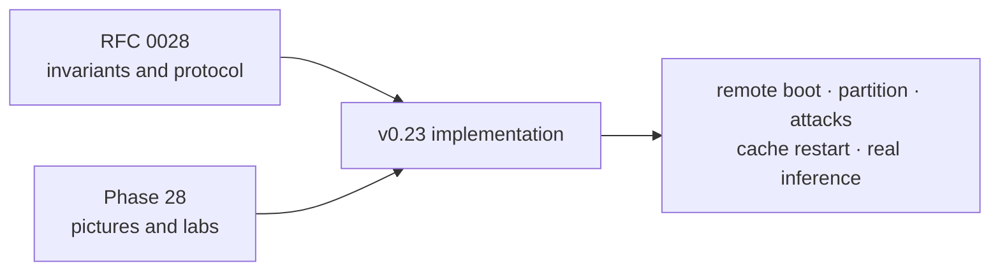
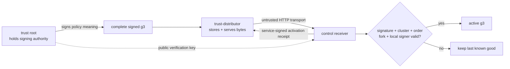
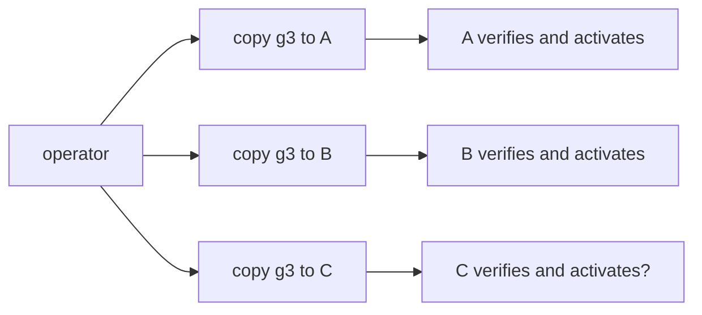
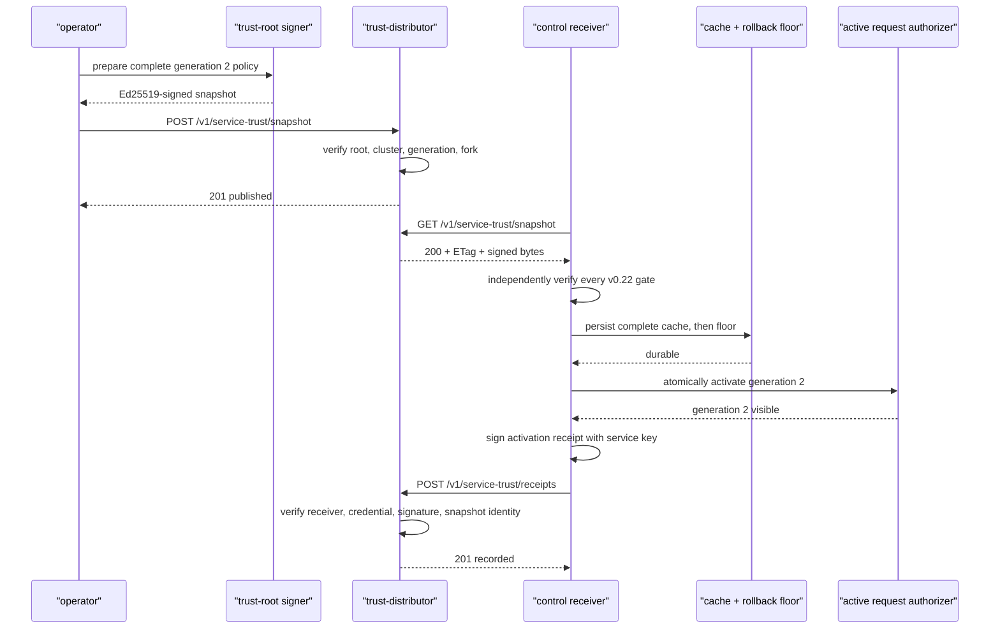
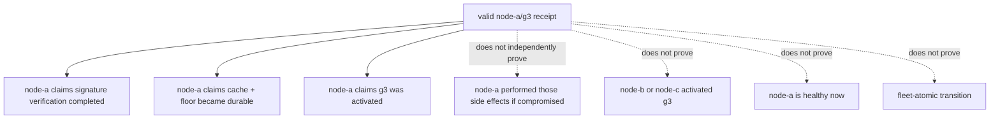
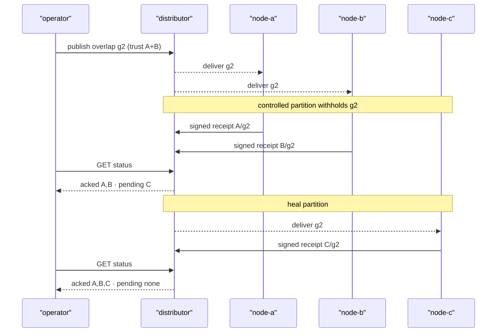

# Phase 28: Distributed signed trust and convergence receipts

This phase closes the biggest operational gap left by v0.22:

> How does one signed trust policy reach several running receivers, how can an
> operator tell which receivers actually activated it, and how can a receiver
> restart when the distribution service is down?

Start with the pictures. The point is to imagine the movement of authority,
bytes, durable state, and acknowledgements before reading Rust.

## RFC versus learning document

RFC means **Request for Comments**. RFC 0028 is the durable engineering
contract. This guide is the mental model, vocabulary, and experiment route.



Use the RFC to answer “why did we choose this contract?” Use this guide to
answer “what is moving, and what can I inspect?”

## Mental model: signed bulletin, courier, and delivery cards

Imagine a company changes who may enter a secure building:

- the **trust root** is the officer who signs the complete access bulletin;
- the **snapshot** is one complete signed edition of that bulletin;
- the **distributor** is a courier depot that stores and hands out copies;
- each **receiver** is a security desk that independently checks the officer's
  signature;
- the **cache** is the desk's durable copy of the last accepted bulletin;
- the **rollback floor** is the highest edition the desk remembers accepting;
- the **active policy** is the bulletin the desk enforces now; and
- a **receipt** is a desk-signed card sent only after the new bulletin is
  verified, stored, and put into use.

```text
POLICY AUTHORITY                           TRANSPORT + OBSERVATION
----------------                           -----------------------
trust-root private key                     distributor
        |                                     |       ^
        | signs complete g3                   | bytes | signed receipt
        v                                     v       |
root-signed snapshot  ------------------>  control receiver
                                                  |
                                      cache -> floor -> active
```

The courier can lose or delay an envelope. It cannot alter the officer's signed
meaning without detection. Likewise, the distributor improves delivery and
visibility but does not become a policy authority.

## Authority versus transport

This is the most important diagram in the phase:



| Question | Answer |
|---|---|
| Who may define trusted service credentials? | The configured trust root |
| Who carries snapshot bytes? | The distributor |
| Who decides whether a snapshot is locally acceptable? | Each control receiver |
| What attests that node A reports activation? | Node A's service-signed receipt; live status separately corroborates the exact-process run |
| Can the distributor mint g4? | No; it lacks the trust-root private key |
| Can it hurt availability? | Yes; it can delay, withhold, replay, or disappear |

Application signatures still do not encrypt HTTP or prove a hostname. A public
deployment also needs TLS or mTLS for channel confidentiality and endpoint
identity.

## What was missing in v0.22?

v0.22 used one local file per receiver:



The question mark matters. “File copied” was not “policy active.” Also, only a
small rollback identity was durable; if the current local snapshot disappeared,
a restart had no full last-known-good policy to load.

v0.23 adds:

1. one remote publication point;
2. bounded conditional polling with deterministic backoff;
3. a complete crash-safe accepted-snapshot cache;
4. cache bootstrap during distributor outage; and
5. signed post-activation receipts and pending-receiver diagnostics.

## Complete publish-to-receipt journey



As an ASCII memory aid:

```text
publish -> verify -> persist -> activate -> receipt
   D          C          C          C          C -> D

receipt is last because it claims every earlier step completed
```

If the process crashes after persistence but before activation, no receipt was
sent. If activation succeeds but receipt delivery fails, the node keeps the
new safe policy and retries the receipt; it never rolls back just to make the
observation path look tidy.

## Receiver state machine

```mermaid
stateDiagram-v2
    [*] --> FetchRemote
    FetchRemote --> VerifyRemote: HTTP 200 candidate
    FetchRemote --> VerifyCache: startup timeout / outage
    VerifyRemote --> Persist: valid higher snapshot
    VerifyRemote --> Active: same accepted snapshot / 304
    VerifyRemote --> KeepLKG: invalid, old, or forked at runtime
    VerifyCache --> Active: cache signature and floor agree
    VerifyCache --> FailClosed: no acceptable cache
    Persist --> Active: cache + floor durable
    Active --> ReceiptPending: activation completed
    ReceiptPending --> Polling: POST accepted
    ReceiptPending --> Polling: POST failed; retry remains pending
    Polling --> VerifyRemote: changed ETag
    KeepLKG --> Polling: back off, keep serving
    FailClosed --> [*]
```



The three startup cases are:

| Remote | Valid cache | Outcome |
|---|---|---|
| Valid snapshot | absent or older | Verify, persist, activate remote |
| Unavailable | present and floor-compatible | Activate cache; keep polling |
| Invalid/unavailable | missing, invalid, rollback, or forked | Fail before listener |

At runtime, a valid active policy already exists. Bad remote input therefore
records a rejection and retains last known good instead of killing the control
process.

If a cache or floor write itself becomes ambiguous, the watcher keeps the
already active policy but stops applying later remote mutations until restart.
That is stricter than an ordinary network error: the receiver can no longer
prove what durable generation a crash would recover.

## Conditional fetch, bounds, and backoff

After accepting a snapshot, the receiver stores its ETag. Later polls send
`If-None-Match`:

```text
receiver                             distributor
   |--- GET snapshot, If-None-Match: "g3..." --->|
   |<------------------- 304 Not Modified --------|
```

No body means no repeated JSON parse, signature verification, or disk write.
A changed artifact returns `200` and goes through every verification gate.

Remote reads are streamed with a 256 KiB accepted snapshot cap and bounded
request timeout. Consecutive failures use deterministic capped exponential
backoff:

```text
poll -> fail -> 2x -> fail -> 4x -> fail -> ... -> configured maximum
success -----------------------------------------------------> base poll
```

Backoff protects the distributor and receiver during an outage. It also means
convergence latency is not zero after a long partition; status exposes the
failure count and last fetch outcome so the delay is explainable.

## What is in an activation receipt?

```json
{
  "schema": "inferlab.service-trust-receipt.v1",
  "cluster_id": "inferlab-primary",
  "generation": 3,
  "root_key_id": "service-trust-root-a",
  "snapshot_signature": "<exact accepted signature>",
  "receiver_service_id": "node-a",
  "receiver_credential_id": "key-a",
  "applied_at_ms": 1700000000000,
  "authentication": {
    "schema": "inferlab.service-trust-receipt-authentication.v1",
    "algorithm": "ed25519",
    "signature": "<node-a key-a signature>"
  }
}
```

The signature domain is `inferlab.service-trust-receipt.v1\0`. It binds the
cluster, generation, root and snapshot identity, receiver service/credential,
and applied time. The distributor verifies it with the receiver credential
from the current trust snapshot.

An attacker cannot relabel node A's receipt as node C or move a g2 receipt to
g3 without invalidating the signature.

## Receipt does and does not mean



Receipt absence is deliberately ambiguous. The node may be partitioned,
stopped, rejecting the candidate, active but unable to upload its receipt, or
backing off. Check receiver status before deciding why.

The signature authenticates which service credential made the statement and
what snapshot it named; it does not independently prove the statement's
underlying persistence or activation side effects if the receiver process or
private key is compromised. In the retained non-compromised exact-process run,
live receiver status and owned-process continuity corroborate the receipt
attestations. This milestone does not provide hardware or remote process
attestation.

## Partition and convergence timeline

The proof makes node C temporarily unable to fetch g2:



```text
time --->

publish g2       A receipt       B receipt       heal C       C receipt
    |----------------|---------------|---------------|-------------|
active A: g1 -> g2
active B: g1 -> g2
active C: g1 ---------------------------------------> g2
fleet:    mixed and safe because g2 overlaps A+B     converged g2
```

This is why g2 must add B while retaining A. A mixed g1/g2 fleet still accepts
old A senders. After all required g2 receipts and live status agree, the
gateway may move to B. Only then should g3 revoke A.

## The exact v0.23 learning sequence

| Step | Distributor | Receivers | Gateway | Expected result |
|---|---|---|---|---|
| 1 | publish signed g1 | remote bootstrap A/B/C | A | three signed activation attestations observed; one Raft leader |
| 2 | publish signed g2 | A/B fetch; C withheld | A | A/B receipts, C pending; mixed-safe overlap |
| 3 | g2 unchanged | C reconnects | A | live status converges; all three receipt attestations are observed |
| 4 | g2 unchanged | all A+B | restart gateway on B | route revision retained |
| 5 | publish signed g3 | all trust B, revoke A | B | live status plus all receipt attestations; old A rejected |
| 6 | submit signed old g2 | all retain g3 | B | distributor/receivers reject rollback |
| 7 | submit different valid g3 | all retain accepted g3 | B | same-generation fork rejected |
| 8 | submit tampered higher generation | all retain g3 | B | root signature failure |
| 9 | stop distributor; restart follower | follower loads cached g3 | B | cluster reforms from durable cache |
| 10 | distributor still down | controls keep g3 | B | real JSON and SSE `[DONE]` succeed |

## HTTP API you can inspect

The distributor binary is `trust-distributor` and defaults to loopback port
8090.

| Method/path | What it tells or does |
|---|---|
| `GET /health` | Process is alive |
| `GET /readyz` | `503` before first snapshot or after durability uncertainty, otherwise `200` |
| `POST /v1/service-trust/snapshot` | Verify and publish a root-signed snapshot |
| `GET /v1/service-trust/snapshot` | Fetch raw current snapshot; supports ETag/304 |
| `POST /v1/service-trust/receipts` | Verify and record a receiver activation receipt |
| `GET /v1/service-trust/status` | Current generation, full signed receipts, acknowledged/pending receivers, and storage fail-stop state |

Important status shape:

```json
{
  "schema": "...",
  "cluster_id": "inferlab-primary",
  "snapshot": {
    "generation": 2,
    "issued_at_ms": 1700000000002,
    "root_key_id": "service-trust-root-a",
    "etag": "..."
  },
  "expected_receivers": ["node-a/key-a", "node-b/key-a", "node-c/key-a"],
  "acked_receivers": ["node-a/key-a", "node-b/key-a"],
  "pending_receivers": ["node-c/key-a"],
  "receipt_count": 2,
  "receipts": ["<two complete service-signed receipt objects>"],
  "storage": {"mutation_poisoned": false, "error_code": null}
}
```

Publication responses distinguish new (`201`), identical (`200`), invalid
(`400`), and rollback/fork (`409`). Receipt responses distinguish new (`201`),
duplicate (`200`), invalid signature (`400`), unexpected receiver (`403`),
wrong current snapshot (`409`), and no current snapshot (`404`).

Publication also rejects `400 untrusted_expected_receiver` if the candidate
omits or revokes any configured expected receiver credential. Otherwise the
distributor could advertise a convergence target that the same policy makes
cryptographically unable to acknowledge.

Status exposes the complete signed receipts, not only their receiver names, so
an operator can fetch the snapshot plus receipts and independently verify the
exact generation/root/snapshot/receiver signatures and bindings. `acked` and
`pending` are convenient distributor projections, not Byzantine-proof facts;
a compromised distributor can still omit a valid receipt. Status
also exposes bounded storage health. If a post-rename durability result is
uncertain, `/readyz` and later POST mutations return
`503 storage_mutation_poisoned` until restart; reads remain available for
diagnosis.

## Start a distributor

```bash
INFERLAB_TRUST_DISTRIBUTOR_BIND='127.0.0.1:8090' \
INFERLAB_TRUST_DISTRIBUTOR_CLUSTER_ID='inferlab-primary' \
INFERLAB_SERVICE_TRUST_ROOT_KEYS='service-trust-root-a=<base64-root-public-key>' \
INFERLAB_SERVICE_TRUST_REVOKED_ROOT_KEY_IDS='' \
INFERLAB_TRUST_DISTRIBUTOR_STATE_PATH='/tmp/inferlab-distributor.json' \
INFERLAB_TRUST_DISTRIBUTOR_EXPECTED_RECEIVERS='node-a/key-a,node-b/key-a,node-c/key-a' \
  cargo run -p trust-distributor
```

The distributor needs only public verification material. Keep the root private
seed outside this online process.

## Start a control in remote mode

```bash
INFERLAB_SERVICE_ID='node-a'
INFERLAB_SERVICE_CREDENTIAL_ID='key-a'
INFERLAB_SERVICE_PRIVATE_KEY_B64='<node-a-private-seed>'
INFERLAB_SERVICE_TRUST_DISTRIBUTOR_URL='http://127.0.0.1:8090'
INFERLAB_SERVICE_TRUST_CACHE_PATH='/tmp/node-a-service-trust-cache.json'
INFERLAB_SERVICE_TRUST_STATE_PATH='/tmp/node-a-service-trust-floor.json'
INFERLAB_SERVICE_TRUST_ROOT_KEYS='service-trust-root-a=<base64-root-public-key>'
INFERLAB_SERVICE_TRUST_REVOKED_ROOT_KEY_IDS=''
INFERLAB_SERVICE_TRUST_POLL_MS=100
INFERLAB_SERVICE_TRUST_REQUEST_TIMEOUT_MS=2000
INFERLAB_SERVICE_TRUST_MAX_BACKOFF_MS=10000
```

`INFERLAB_SERVICE_TRUST_SNAPSHOT_PATH` and
`INFERLAB_SERVICE_TRUST_DISTRIBUTOR_URL` are mutually exclusive. Static policy,
local-file snapshot, and remote distributor are three explicit modes, not
fallback precedence rules.

The remote URL must be a credential-free `http://` origin: no username,
password, path, query, or fragment. This workspace has no reqwest TLS backend,
so `https://` is rejected instead of pretending the connection is protected.
TLS/mTLS remains an explicit next boundary.

The cache path defaults under the Raft data directory. The timeout defaults to
2,000 ms, and maximum backoff defaults to 10,000 ms and must be at least the
poll interval. Cache and rollback-floor paths must resolve to different files,
including through lexical and existing symlink aliases.

## Receiver status fields

Control `GET /v1/control/status` keeps v0.22 policy fields and adds these
non-secret facts under the response's `service_authentication` object. For
example, the full JSON field path is
`service_authentication.trust_policy_distribution_mode`.

| Field | Question it answers |
|---|---|
| `trust_policy_distribution_mode` | Is this `local-file` or `remote-http` mode? |
| `trust_policy_bootstrap_source` | Did startup activate `remote` or `cache` bytes? |
| `trust_policy_remote_configured` | Is a distributor configured? |
| `trust_policy_cache_configured` | Is a durable full-snapshot cache configured? |
| `trust_policy_etag_present` | Can the next poll use conditional fetch? |
| `trust_policy_last_fetch_outcome` / `trust_policy_last_fetch_at_ms` | What happened on the latest remote attempt? |
| `trust_policy_consecutive_fetch_failures` | Is backoff growing? |
| `trust_policy_receipts_posted` / `trust_policy_receipt_failures` | Is post-activation acknowledgement working? |
| `trust_policy_last_receipt_generation` / `trust_policy_last_receipt_at_ms` | Which activation was acknowledged last? |
| `trust_policy_last_receipt_error` | Why is a receipt pending? |

The URL, cache path, ETag value, and all private keys are redacted. Presence and
outcome are enough for operations without leaking deployment details.

## Evidence walkthrough


The retained exact-process run shows:

- remote root-signed g1 bootstrap and three activation receipts, with maximum
  observed control convergence latency of 8.974 ms;
- A and B at overlap g2 while the stopped node-C relay leaves C at g1 and the
  distributor reports exactly one pending receiver;
- all controls observed at g2 in a 12.547 ms control-status probe after the
  relay heals, followed by a separate observation of all three g2 receipts;
- gateway A→B rotation, all controls observed at A-revoking g3 in a 22.872 ms
  control-status probe, and all three g3 receipts subsequently observed;
- HTTP 409 for valid rollback and same-generation fork plus HTTP 400 for
  signature-tampered higher bytes at the distributor publication boundary,
  while every control retains g3;
- follower node B restarting from its complete g3 cache while the distributor
  is down, rejoining revision-2 Raft, and recording the pending receipt error;
- old gateway A receiving 401 while B remains valid;
- a real 186.075 ms JSON request and 187.935 ms SSE through `[DONE]`; and
- all 25 machine-readable assertions passing.

Before assertion checking and SVG rendering, the proof recursively sanitizes
the JSON captures. The retained report records 31 inspected inputs, three
absolute path-value replacements, and zero remaining proof-root strings. The
keys, schemas, and proof-relevant values remain machine-readable.

These are single-host loopback observations, not fleet convergence or latency
service-level objectives.

The exact-process attack posts stop at the distributor because its validation
rejects them before delivery. Separate Rust tests feed rollback, fork, and
tampered candidates through the receiver's independent remote-watcher gates.
Both layers matter; the exact run does not claim that rejected publication
bytes reached the controls.

## Guided experiments

### Lab 1: run the complete proof

```bash
./scripts/proof-v0.23.sh
```

Read `assertions.json` before the SVG. The chart is generated only from the raw
machine-readable observations.

### Lab 2: distinguish ready from alive

Start an empty distributor. `/health` should succeed while `/readyz` returns
503. Publish valid g1 and observe readiness become 200. The process can be alive
without being ready to serve trust.

### Lab 3: observe an incomplete receipt set

Withhold delivery to node C, publish overlap g2, and inspect status. Explain why
`pending_receivers=[node-c/key-a]` is not enough to classify C as failed.
Inspect C's live status, then heal delivery and watch the pending list empty.

### Lab 4: submit valid old bytes

After g3, POST the original root-signed g2. Its cryptography is valid but its
order is not. Expect 409 and no active-generation change.

### Lab 5: submit a same-generation fork

Sign different policy contents as generation 3 and POST them after the original
g3. The distributor and receiver identities must distinguish this from an
idempotent retry.

### Lab 6: tamper after signing

Change generation, credential, or revocation meaning without resigning. Expect
400/signature failure and continued g3 service.

### Lab 7: restart from cache during outage

After g3 is durable, stop the distributor and restart one follower. Confirm its
status reports cached bootstrap, active g3, and a pending receipt retry while it
rejoins Raft. This proves cache availability, not remote convergence.

### Lab 8: corrupt the cache in a disposable directory

With the distributor down, change or truncate the cached snapshot and restart.
Startup must fail closed. Never run this against real state.

### Lab 9: forge a receipt

Change the receiver ID or generation in a valid receipt without resigning. The
distributor must reject it. Then submit the unchanged receipt again and observe
idempotent success.

## Alternatives and why this design

| Alternative | Why it was not chosen for v0.23 |
|---|---|
| Keep operator file copies | No shared publication/receipt view or complete remote-cache contract |
| Give distributor root private key | Turns transport compromise into policy-authority compromise |
| Push into every receiver | Adds inbound management/authentication and retry ownership; pull is easier to bound and recover |
| Put trust in the Raft log | Bootstrapping peer authentication from policy inside that same authenticated log is circular |
| Declare convergence on publish | Says nothing about receiver verification, persistence, or activation |
| Receipt immediately after download | Can acknowledge invalid or non-durable bytes |
| Block A/B until C activates | Sacrifices safe availability; overlap g2 is intentionally safe during skew |
| Roll back when receipt POST fails | Reintroduces older trust because an observation path failed |
| Stop polling after cache boot | Turns an outage bridge into silent static drift |
| Make receipts exactly once | Unnecessary; idempotent at-least-once retries are simpler and safe |

## Limitations you should be able to explain

1. **One distributor:** this milestone has a single transport availability
   point.
2. **Eventual convergence:** receivers activate independently, not atomically.
3. **Ambiguous missing receipts:** partition, failure, rejection, and upload
   failure require receiver diagnostics to distinguish.
4. **Withholding remains possible:** signatures preserve safety, not delivery.
5. **Distributor equivocation remains possible:** floors/fork checks reject
   unsafe order but cannot make the distributor available or honest; even full
   signed-receipt exposure cannot prove the distributor did not omit a receipt.
6. **Local disk is trusted:** hostile deletion or rewrite of cache and floor is
   outside the model.
7. **Persistence ambiguity fail-stops updates:** the current last known good can
   serve, but later remote mutations wait for process restart and durable-state
   validation.
8. **No automatic rollout:** operators still gate B rotation and A revocation.
9. **No expiry:** signed issue time remains diagnostic metadata.
10. **No TLS/mTLS:** HTTP is not confidential and hostnames are not proven;
    this build rejects `https://` because it has no TLS backend.
11. **Development key custody:** static seeds are not a production secret
    manager or HSM.
12. **Process-local replay cache:** service request replay memory resets.
13. **Single-host partition proof:** controlled loopback withholding is not a
    multi-region or hostile-network test.

## Read-the-code route

1. `service-auth/src/trust_snapshot.rs` — complete policy/root signature and
   rollback identity.
2. `service-auth/src/trust_receipt.rs` — receipt payload, canonical domain,
   signing, and verification.
3. `trust-distributor/src/lib.rs` — publication, conditional
   fetch, receipt verification, persistence, readiness, and status.
4. `control-plane/src/service_trust.rs` — remote fetch, cache bootstrap,
   cache/floor/activation ordering, backoff, and receipt retry.
5. `control-plane/src/service_authentication.rs` — active policy and redacted
   distribution diagnostics.
6. `benchmarks/trust_distribution_probe.py` — observe publication, receipts,
   receiver generations, and cache bootstrap.
7. `scripts/proof-v0.23.sh` — exact topology, partition, attacks, restart, and
   inference sequence.
8. `benchmarks/check_distributed_service_trust.py` — falsifiable claims.
9. `benchmarks/render_distributed_service_trust_svg.py` — raw JSON to evidence
   chart.

While reading, draw four rows: **published**, **cached**, **active**, and
**receipted**. In the honest implementation, a generation enters each later
row only after the row above completes. The receipted row means a signed
activation attestation was recorded, not that an external verifier proved the
receiver's internal side effects under compromise.

## Check your understanding

1. What does RFC stand for, and why is it different from this guide?
2. Which private key authorizes policy meaning?
3. Why is the distributor still useful if receivers do not trust it as an
   authority?
4. What can a compromised distributor do, and what can it not do?
5. Why does every receiver verify the root signature again?
6. Why must the complete cache be durable before activation?
7. Why is a rollback floor still needed when a full cache exists?
8. What does ETag/304 save?
9. Why is backoff bounded and deterministic?
10. Why is receipt last in the five-step ordering?
11. Which fields prevent relabeling A's receipt as C's?
12. Why is a missing C receipt ambiguous?
13. Why is g1/g2 skew safe during the proof?
14. When is it safe to rotate the gateway sender to B?
15. Why does a valid signature not make old g2 acceptable after g3?
16. How does the floor distinguish identical g3 from a different valid g3?
17. What happens if receipt upload fails after g3 activation?
18. How can a follower restart while the distributor is down?
19. Why does cache bootstrap continue polling later?
20. What properties still require TLS/mTLS and protected secret custody?

If you can narrate remote g1 boot → partial g2 receipts → convergence → B
rotation → g3 revocation → rollback/fork/tamper rejection → cached restart →
real JSON/SSE without reading code, you can imagine the whole v0.23 path.

## Next boundary

v0.23 makes distribution, durable cache, and convergence observation explicit.
The next step is not “more signatures everywhere.” It is choosing which
production boundary matters: TLS/mTLS and secret custody, policy expiry and
emergency revocation, or replicated distributor availability. Each solves a
different problem and should receive its own RFC and failure proof.
