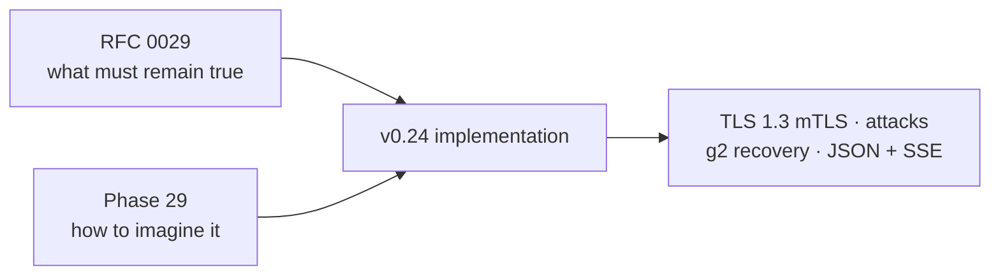
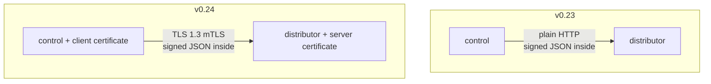
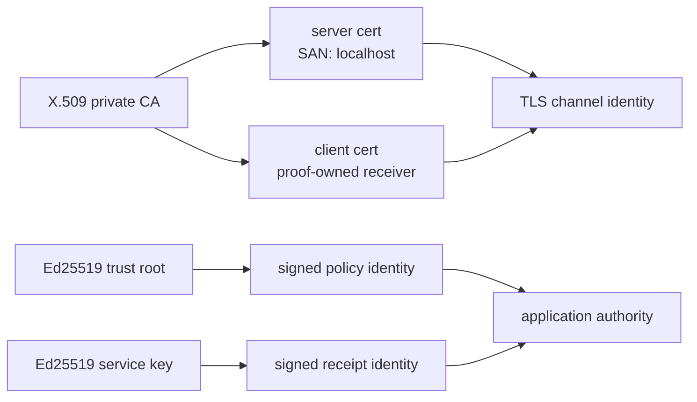
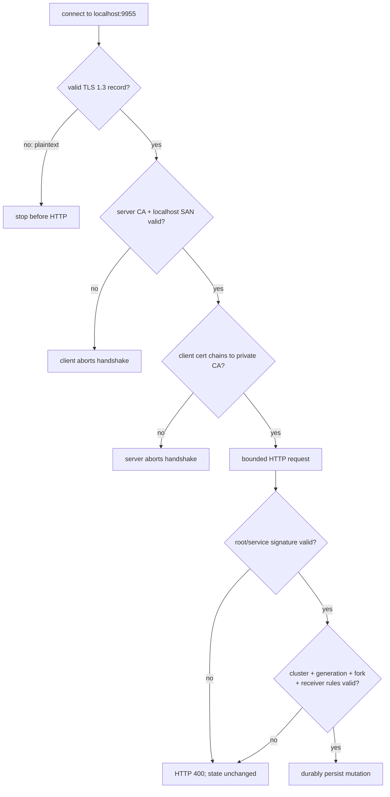
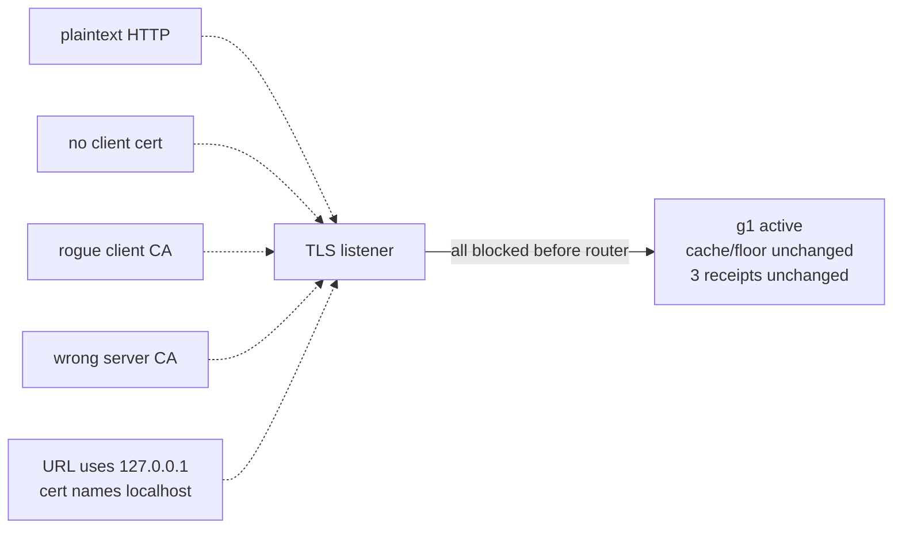

# Phase 29: Mutual TLS for the trust-distribution channel

This phase answers the next visual question after distributed signed trust:

> How can a control know it reached the intended distributor, and how can the
> distributor reject network clients before they reach an HTTP handler?

The short answer is **mutual TLS**, usually written **mTLS**. Both sides present
certificates, both sides prove possession of the corresponding private keys,
and all application bytes travel inside an encrypted TLS 1.3 channel.

## RFC versus learning document

RFC means **Request for Comments**. [RFC 0029](../rfcs/0029-mutual-tls-trust-distribution.md)
is the engineering contract: exact configuration, invariants, failure modes,
and limits. This guide gives you the pictures, vocabulary, analogies, and labs.



Read the RFC when you ask “why did we choose this exact contract?” Read this
guide when you ask “what is each object doing, and what can I try?”

## Mental model: secured courier entrance plus sealed documents

Imagine the distributor is a records office:

- the **private CA** is the organization that issues building badges;
- the distributor's **server certificate** is its building badge;
- a control's **client certificate** is its visitor badge;
- the **TLS handshake** is the guarded entrance where both badges are checked;
- the encrypted **TLS channel** is a private meeting room;
- the trust root's **Ed25519 signature** is the officer's seal on the policy;
- the receiver's **service signature** is its seal on an activation receipt.

The guard admitting someone to the room does not make every document they
carry authoritative. The officer's seal still decides whether policy bytes are
valid.

```text
CHANNEL QUESTION                         APPLICATION QUESTION
----------------                         --------------------
Is this really localhost?                Did the trust root sign this snapshot?
Does the client have a CA badge?         Is generation/cluster/order valid?
Is the conversation encrypted?           Did node A sign this exact receipt?

          mTLS                                        Ed25519
             \                                         /
              +---- both gates must accept -----------+
```

## What v0.23 had and what v0.24 adds



| Property | v0.23 | v0.24 mTLS mode |
|---|---|---|
| Snapshot meaning protected | Root signature | Root signature |
| Receipt statement protected | Service signature | Service signature |
| Traffic encrypted | No | Yes |
| Distributor hostname authenticated | No | Yes |
| Client certificate required before HTTP | No | Yes |
| Fleet-atomic activation | No | No |
| Global service-to-service mTLS | No | No |

The last two rows are important. TLS improves this channel; it does not solve
distributed rollout atomicity or every other network hop.

## The two identity systems

InferLab now intentionally uses two different identity systems on this path:



Why not use one key system for everything?

- TLS libraries already know how to negotiate encryption, verify certificate
  chains, and authenticate hostnames.
- The root-signed JSON policy is portable, inspectable, and independently
  verifiable even after it leaves the transport channel.
- A receipt names exact InferLab service/credential and snapshot identity;
  v0.24 does not pretend an X.509 subject is that application identity.

## Complete TLS 1.3 handshake picture

```mermaid
sequenceDiagram
    participant C as "control"
    participant D as "trust-distributor"

    C->>D: ClientHello (TLS 1.3, server name localhost)
    D-->>C: server certificate chain + key proof
    C->>C: CA valid? time valid? SAN contains localhost?
    D-->>C: request a client certificate
    C->>D: client certificate chain + key proof
    D->>D: chain reaches configured client CA?
    D-->>C: handshake complete; encrypted channel
    C->>D: GET /v1/service-trust/snapshot
    D-->>C: root-signed snapshot
```

Three checks are easy to confuse:

1. **CA verification:** does the certificate chain end at a configured root?
2. **hostname verification:** does the server certificate's SAN name the host
   in the URL?
3. **private-key proof:** can the peer complete the handshake using the key
   matching its certificate?

In the proof, the listener binds `127.0.0.1`, but the URL is
`https://localhost:9955`. The certificate contains only `DNS:localhost`. A
connection to `https://127.0.0.1:9955` therefore reaches the same socket but
fails hostname authentication. IP reachability and cryptographic identity are
different facts.

## Request journey: every gate in order



An mTLS failure has no HTTP status because HTTP was never reached. A tampered
snapshot sent by a valid certificate holder does reach HTTP and receives an
application rejection. That difference tells you which security layer acted.

## The five transport attacks



| Attack | What is wrong | Who rejects it |
|---|---|---|
| Plaintext downgrade | First bytes are HTTP, not TLS | TLS listener |
| No client certificate | Client cannot satisfy certificate request | Distributor TLS verifier |
| Rogue client CA | Client chain ends at an untrusted CA | Distributor TLS verifier |
| Wrong server CA | Client trusts only a different private CA | Control/client TLS verifier |
| Wrong hostname | URL host is absent from server SAN | Control/client hostname verifier |

The proof records both durable SHA-256 hashes and all three live control
statuses before moving to another generation. This distinguishes “the attack
did not change disk” from the stronger statement “the attack did not change
the active policy either.”

## Why valid mTLS is still insufficient

Now imagine a client has a perfectly valid organization badge but edits a
signed document:

```mermaid
sequenceDiagram
    participant P as "CA-valid publisher"
    participant D as "distributor"
    participant V as "application verifier"

    P->>D: valid TLS 1.3 mTLS handshake
    P->>D: POST snapshot with changed generation, old signature
    D->>V: verify trust-root signature
    V-->>D: signature mismatch
    D-->>P: HTTP 400; current generation unchanged

    P->>D: POST modified receiver receipt, old signature
    D->>V: verify service signature
    V-->>D: signature mismatch
    D-->>P: HTTP 400; receipt set unchanged
```

This is intentional **defense in depth**. Compromising one channel certificate
does not grant the distinct trust-root or receiver-service signing key.

## Configuration map

```text
trust-distributor (server)                 control (client)
--------------------------                 ----------------
TLS_CERT_PATH       server chain           TLS_CA_CERT_PATH     trusted server CA
TLS_KEY_PATH        server private key     TLS_CLIENT_CERT_PATH receiver chain
TLS_CLIENT_CA_PATH  accepted client CA     TLS_CLIENT_KEY_PATH  receiver private key

all three or none                           https requires all three
```

Exact environment variables:

```text
INFERLAB_TRUST_DISTRIBUTOR_TLS_CERT_PATH
INFERLAB_TRUST_DISTRIBUTOR_TLS_KEY_PATH
INFERLAB_TRUST_DISTRIBUTOR_TLS_CLIENT_CA_PATH

INFERLAB_SERVICE_TRUST_TLS_CA_CERT_PATH
INFERLAB_SERVICE_TRUST_TLS_CLIENT_CERT_PATH
INFERLAB_SERVICE_TRUST_TLS_CLIENT_KEY_PATH
```

Partial configuration fails at startup. An `http://` URL plus TLS client paths
also fails; otherwise an operator might believe authentication is active while
the process silently uses plaintext.

## Status fields you can read without reading Rust

Distributor `/v1/service-trust/status`:

```json
{
  "transport_security": {
    "mode": "mutual-tls",
    "client_certificate_required": true,
    "minimum_protocol": "TLSv1.3"
  }
}
```

Control `/v1/control/status` under `service_authentication`:

```json
{
  "trust_policy_distribution_mode": "remote-http",
  "trust_policy_transport_mode": "mutual-tls",
  "trust_policy_server_authentication": true,
  "trust_policy_client_authentication": true,
  "trust_policy_generation": 2,
  "trust_policy_bootstrap_source": "remote"
}
```

`remote-http` remains the name of the polling distribution mode. The transport
field tells you whether that remote channel is insecure HTTP or mutual TLS.
After cache startup during an outage, `bootstrap_source` becomes `cache`; the
configured transport mode remains `mutual-tls` because remote reconciliation
will use those credentials when the distributor returns.

## Generation recovery and outage picture

```mermaid
sequenceDiagram
    participant O as "operator"
    participant D as "mTLS distributor"
    participant A as "node A"
    participant B as "node B"
    participant C as "node C"

    O->>D: valid mTLS + root-signed g2
    D-->>A: encrypted g2
    D-->>B: encrypted g2
    D-->>C: encrypted g2
    A->>D: mTLS + signed A/g2 receipt
    B->>D: mTLS + signed B/g2 receipt
    C->>D: mTLS + signed C/g2 receipt
    Note over D: exact distributor PID stops
    Note over B: exact follower PID stops and restarts
    B->>B: validate complete g2 cache against rollback floor
    B-->>B: activate g2; rejoin Raft
    B--xD: receipt retry fails; retain safe g2
```

TLS does not make the distributor more available. The complete accepted cache
from v0.23 is still what lets a receiver restart safely during outage.

## Exact lab: what you can do

Run:

```bash
./scripts/proof-v0.24.sh
```

Then follow the evidence in this order:

| Step | Open | What to look for |
|---|---|---|
| 1 | `tls-handshake.json` | `TLSv1.3`, localhost SAN, client certificate presented |
| 2 | `initial-controls.json` | three controls at g1, remote bootstrap, all mTLS booleans true |
| 3 | `generation-1-receipts.json` | three acknowledged receivers, none pending |
| 4 | five negative transport JSON files | `failed_before_http_response: true` |
| 5 | before/after durable-state JSON | identical cache/floor hashes |
| 6 | `after-transport-controls.json` | all live controls still active on g1 |
| 7 | tampered snapshot + forged receipt JSON | HTTP 400 despite valid mTLS |
| 8 | g2 convergence + receipt JSON | all controls and all receipts reach g2 |
| 9 | `cache-restart.json` | different PID, g2, bootstrap source `cache` |
| 10 | `request.json` and `stream.json` | real CPU response and SSE `[DONE]` |
| 11 | `assertions.json` | every machine-readable claim passes |

Retained evidence lives under `docs/results/v0.24/raw/`. The proof creates all
CA/certificate/private-key files inside a guarded `inferlab-v024.*` temporary
directory with `umask 077`. Cleanup removes that entire exact directory. Only
sanitized JSON and deterministic SVG are retained. Before retention, the proof
also normalizes escaped newlines/base64 and scans the complete bundle against
all known Ed25519 proof seeds plus every generated PKI `.key` payload; no PEM,
key path, or matching private payload belongs in the evidence bundle.

## What you may safely claim in an interview

- “I added optional TLS 1.3 mutual authentication to the trust-distribution
  hop and kept application authorization independent.”
- “I proved plaintext, missing/rogue client identity, wrong server CA, and
  wrong hostname fail before HTTP.”
- “A valid channel certificate cannot authorize a tampered root-signed policy
  or forged service-signed receipt.”
- “A control restarts from its accepted cache during distributor outage, and
  real JSON/SSE inference continues.”

Do not claim:

- every InferLab hop uses mTLS;
- certificate subject maps to an InferLab role or service ID;
- certificate rotation/revocation is automated;
- private keys are hardware protected;
- the distributor is highly available; or
- this single-host proof is hostile multi-host production evidence.

## Term glossary

| Term | Plain meaning in this phase |
|---|---|
| **TLS** | Transport Layer Security: protocol that encrypts a connection and authenticates at least the server |
| **mTLS** | Mutual TLS: TLS where the client also presents a certificate |
| **TLS 1.3** | The only TLS protocol version accepted by this milestone's mTLS configuration |
| **X.509 certificate** | Signed statement binding a public key to certificate metadata such as a DNS name |
| **CA** | Certificate Authority: trust root that signs certificates |
| **Private CA** | Project-controlled CA used here instead of public Internet PKI |
| **Certificate chain** | Leaf certificate plus issuer path leading to a trusted CA |
| **Leaf certificate** | End-entity server or client certificate, not a CA certificate |
| **SAN** | Subject Alternative Name: certificate field used for hostname matching; the proof uses `DNS:localhost` |
| **Hostname authentication** | Checking that the URL hostname appears in the server certificate SAN |
| **Handshake** | TLS negotiation where protocol, certificates, and key possession are verified before HTTP |
| **Private-key proof** | Cryptographic evidence that a peer holds the key matching its certificate without sending the key |
| **Cipher suite** | TLS-selected algorithms for authenticated encryption and hashing |
| **PEM** | Text encoding with `BEGIN/END` blocks used for certificates and keys |
| **Trust store** | Set of CA certificates a verifier accepts |
| **Client authentication** | Distributor verifies a presented client certificate under its configured client CA |
| **Server authentication** | Control verifies the distributor certificate chain and URL hostname |
| **Plaintext downgrade** | Attempt to speak unencrypted HTTP to a port that is supposed to require TLS |
| **Application signature** | Ed25519 signature over InferLab snapshot or receipt fields, independent of TLS |
| **Authorization** | Decision that an authenticated object is permitted to change/read application state |
| **Authentication** | Evidence of identity/key possession; it does not automatically grant authorization |
| **Defense in depth** | Independent security gates so one compromised layer does not imply total authority |
| **Last known good (LKG)** | Most recent policy that passed every check and was durably activated |
| **Rollback floor** | Durable highest accepted generation/snapshot identity that blocks older or forked policy |
| **Activation receipt** | Service-signed statement that a receiver reports activating one exact signed snapshot |
| **Ephemeral credential** | Proof-only certificate/key created in a temporary directory and deleted after the run |
| **Certificate rotation** | Replacing certificates/keys with overlap and no outage; explicitly deferred |
| **Revocation** | Invalidating a certificate before normal expiry; explicitly deferred |
| **ACME** | Automated public certificate issuance protocol; not needed for the loopback proof |
| **HSM** | Hardware Security Module for protected key operations; not part of v0.24 |

## Limitations and next milestones

v0.24 protects only one channel and keeps an explicit plaintext compatibility
mode. Its proof CA is ephemeral, local filesystem key custody is trusted,
certificate files load only at startup, certificate-to-role authorization is
absent, and the single distributor remains an availability dependency.

Next in the engineering journey:

- **v0.25:** Raft partition and Figure-8 safety evidence;
- **v0.26:** Prometheus observability;
- later: global service mTLS, certificate rotation/revocation, ACME/HSM,
  policy expiry/emergency cancellation, and distributor HA.
