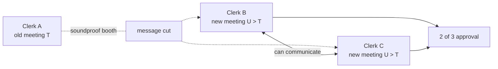
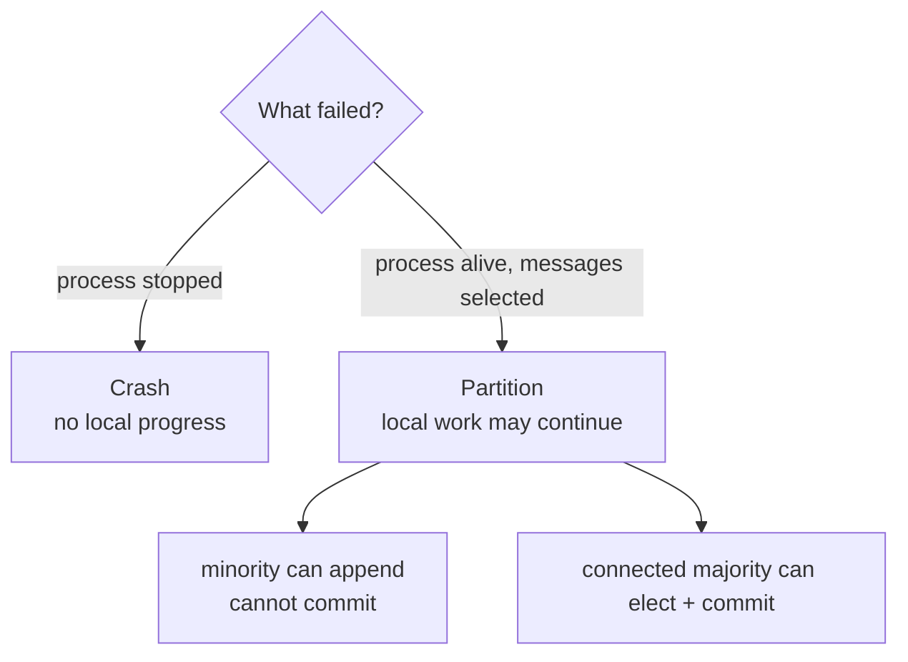
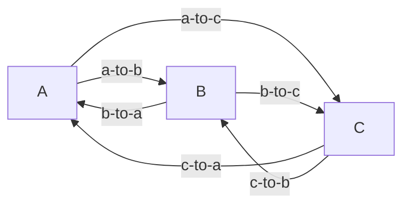
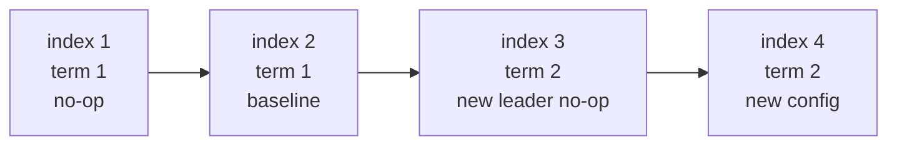
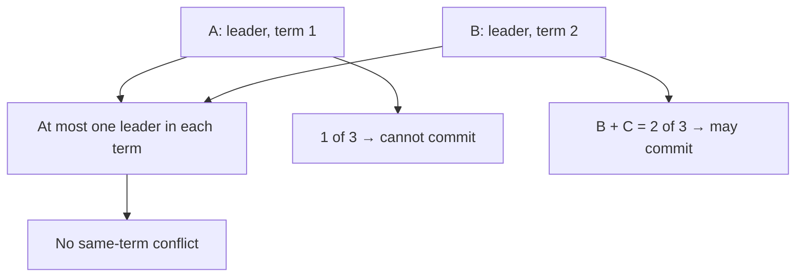
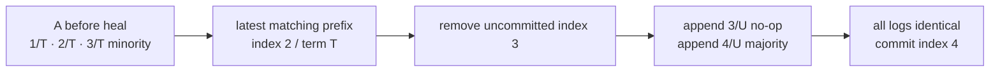
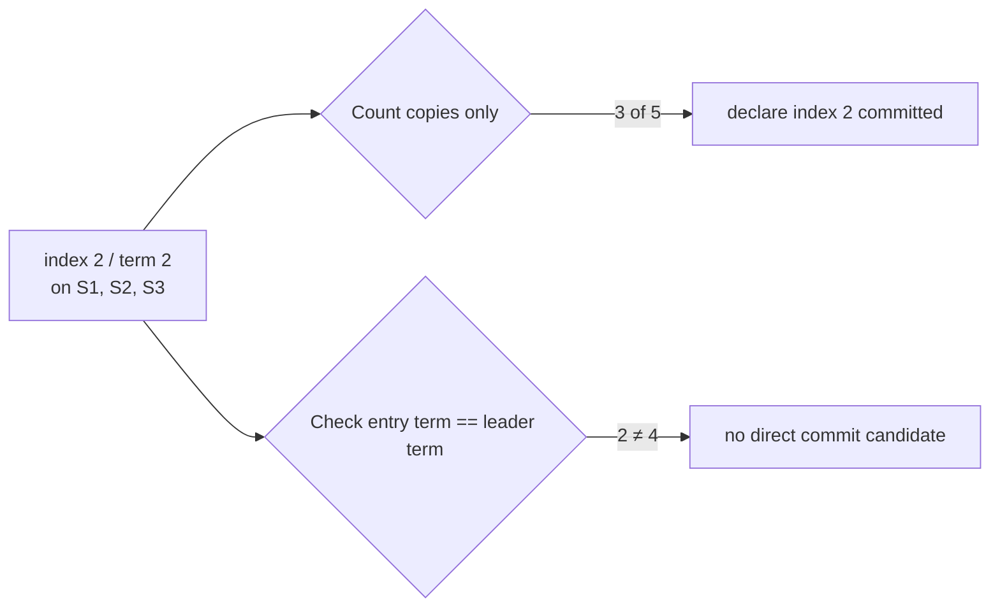
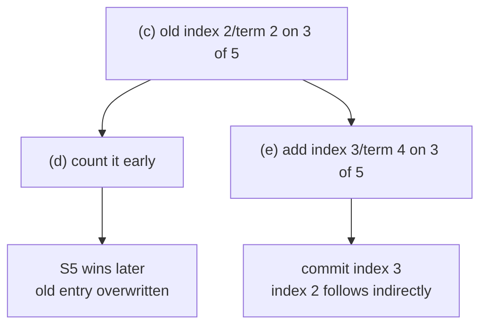
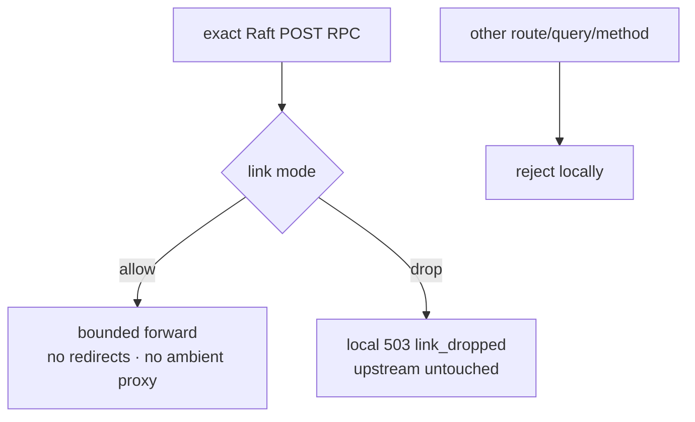

# Phase 30 learning guide: Raft partitions, log repair, and Figure 8

## The new behavior in one sentence

InferLab can now keep all three Raft nodes alive, suppress selected directed
Raft messages, show a two-node majority committing while the isolated old
leader cannot, heal the links, replace the old leader's uncommitted suffix, and
demonstrate why an old-term entry on a majority is still not directly
committable.

## Start with the picture you should hold in your head

Imagine three clerks—A, B, and C—each with a numbered logbook. A chairperson
announces new timetable entries. Normally everyone hears the announcements.
Now put A in a soundproof booth without stopping any clerk:

- A keeps writing in A's own book and still believes it is chairperson of the
  old meeting.
- B and C can hear each other, so they begin a new meeting, choose a new
  chairperson, and approve a different timetable.
- A cannot approve its new line alone because approval requires two books.
- When the booth opens, A learns the newer meeting number, stops claiming the
  chair, and replaces its unapproved line with the majority's lines.



The **clerks** are control-plane processes. The **meeting number** is a Raft
term. A **logbook line number** is a Raft index. “Approved” means committed.
Architecturally, the train system can continue using the last approved
timetable; that is the gateway's last-committed-route behavior. This retained
v0.25 schedule starts its gateway only after healing, then proves real serving
from the converged revision.

## First separate crash from partition

These failures feel similar to a client but create different internal states.

| Failure | Process running? | Disk writable? | Answers local HTTP? | Can selected peers reach it? |
|---|---:|---:|---:|---:|
| Crash | no | no | no | no |
| Symmetric partition cut | yes | yes | yes | no in either direction across the cut |
| One-way link drop | yes | yes | yes | only one chosen direction is suppressed |
| Slow network | yes | yes | maybe late | eventually, unless timeouts win |



v0.6 already demonstrated process death and restart. v0.25 demonstrates one
controlled partition schedule because it produces the important state “alive,
locally appended, but not committed.”

## What “directed” means

Communication has a direction. A→B and B→A are different links. Six ordered
pairs exist for three nodes:



The proof places one OS process on every arrow. For the demonstrated cut it
drops A→B, A→C, B→A, and C→A, while B→C and C→B remain allowed. Four directed
drops therefore build one symmetric A-vs-{B,C} partition.

The production `RaftNode` peer client disables ambient proxies and redirect
following, so its six configured proxy URLs are the actual signed-RPC paths and
a redirect cannot leak a custom authentication header/body. Each link proxy's
separate upstream client also disables ambient proxies and redirects.

Why not say “we proved asymmetric partitions”? The mechanism can switch one
arrow independently, but the retained schedule deliberately switches four.
Evidence should describe what was run, not everything the mechanism might run.

## Follow one Raft write from request to visibility

```mermaid
sequenceDiagram
    participant Client
    participant L as Leader
    participant Disk as Leader state.json
    participant P as Follower through link proxy
    participant SM as Routing state machine

    Client->>L: signed PUT configuration
    L->>Disk: append entry at next index
    L->>P: AppendEntries over directed proxy
    alt follower stores it and quorum exists
        P-->>L: success + match index
        L->>Disk: advance commit index
        L->>SM: apply entry
        L-->>Client: 200 + committed revision
    else link returns 503 or times out
        P--xL: no successful replication
        L-->>Client: 503 unavailable
        Note over L,Disk: entry may exist locally; result is ambiguous
    end
```

The words are intentionally separate:

| Word | Exact meaning | Can it later disappear? |
|---|---|---:|
| Appended | An entry exists in one node's durable log | yes, if uncommitted and a newer leader repairs it |
| Replicated | More than one node stores the entry | possibly; replica count alone is not the full commit rule |
| Committed | Raft makes the log prefix authoritative across future leaders | no, under the Raft fault model |
| Applied | The deterministic state machine has made it visible | only committed entries may be applied |

```text
append ≠ replicate ≠ commit ≠ apply
```

## Terms and indexes are two different coordinates

An index answers “where in the log?” A term answers “during which leadership
epoch was this entry created?”



- Indexes increase within the ordered log.
- Terms increase when a node starts a new election.
- Several adjacent indexes can have the same term.
- The same index can temporarily contain different terms on different nodes
  when one suffix is uncommitted.
- A term number by itself is not a wall-clock timestamp or a configuration
  revision.

The retained run happened to use baseline term 1 and majority term 2. The
checker derives those values and requires only `majority_term > baseline_term`;
hard-coding timing-derived term numbers would make the wrong property the test.

## Why two leaders can appear without breaking election safety

During the cut, the status snapshot is:

| Node | Role it reports | Term it knows | Can reach a quorum? |
|---|---|---:|---:|
| A | leader | 1 | no; only itself |
| B | leader | 2 | yes; B + C |
| C | follower | 2 | follows B |



Raft does not require an old leader to magically know it is isolated. It learns
about the newer term only when a higher-term RequestVote/AppendEntries request
or response reaches it. Until healing, it can report its old role. Safety comes
from quorum intersection and term rules, not from perfect failure detection.

## Walk the retained live schedule

### 1. Full-mesh baseline

A is elected. Its election no-op is index 1. A signed round-robin configuration
commits at index/revision 2 on all three nodes.

```text
A: [1/T noop] [2/T baseline]       commit=2 apply=2
B: [1/T noop] [2/T baseline]       commit=2 apply=2
C: [1/T noop] [2/T baseline]       commit=2 apply=2
```

### 2. Close four links

The proof drops B→A and C→A before dropping A→B and A→C. This ordering prevents
a newly campaigning majority from raising A's term during the transition
window. B↔C remains allowed.

### 3. Submit to isolated A

A accepts a valid signed least-in-flight proposal at expected revision 2,
appends index 3 in term T, and cannot replicate it. After the bounded commit
wait, the API returns structured `503 unavailable`.

Do not conclude “therefore it failed.” In distributed systems, a timeout or
unavailable response can happen after some durable work. The safe client action
is to read authoritative state before retrying with a new nonce.

### 4. Let B and C progress

B starts a later term `U > T` and wins with B+C. It appends a current-term no-op at index 3,
commits that no-op on two nodes, then commits a different weighted configuration
at index 4.

```text
A: [1/T noop] [2/T baseline] [3/T minority]                 commit=2 apply=2
B: [1/T noop] [2/T baseline] [3/U noop] [4/U majority] commit=4 apply=4
C: [1/T noop] [2/T baseline] [3/U noop] [4/U majority] commit=4 apply=4
```

Notice that index 3 means different things on A and B. That is permitted only
because A's index 3 was never committed.

### 5. Heal and repair

Once links allow again, A sees the higher term and becomes a follower. The
term/index consistency check finds that index 2 is the latest common prefix.
The leader removes A's uncommitted suffix and sends indexes 3 and 4.



The baseline prefix remains byte-for-byte identical. The minority command is
absent from every healed log. This durable before/after observation—not the
`503` alone—establishes that this exact minority proposal never committed.

## Why the new leader first appends a no-op

A **no-op** is a log entry that changes no routing configuration. It still has
an index and term. The new leader uses it to establish a committed entry from
its own term.


This is where the everyday three-node repair and Figure 8 connect. “It is on a
majority” is sufficient only for a current-term entry being considered by the
current leader. Older entries become committed through the committed prefix.

## Figure 8: build the counterexample slowly

The live InferLab runtime has three nodes. The following five-server replay is
a separate algorithmic teaching fixture matching the
[extended Raft paper's Figure 8](https://raft.github.io/raft.pdf).

### Stage (a): partial term-2 replication

S1 is term-2 leader. Index 2/term 2 reaches only S1 and S2.

| Server | Entry terms by index |
|---|---|
| S1 | `[1, 2]` |
| S2 | `[1, 2]` |
| S3 | `[1]` |
| S4 | `[1]` |
| S5 | `[1]` |

### Stage (b): a conflicting term-3 entry

S1 crashes in the paper sequence. S5 can win term 3 with S3, S4, and itself,
then append a different index 2/term 3 locally.

| Server | Entry terms by index |
|---|---|
| S1 | `[1, 2]` |
| S2 | `[1, 2]` |
| S3 | `[1]` |
| S4 | `[1]` |
| S5 | `[1, 3]` |

### Stage (c): the trap

S1 returns and wins term 4, then copies its index 2/term 2 to S3. The term-2
entry now appears on S1, S2, and S3: three of five.



### Branch (d): prove the naive decision was unsafe

If S1 now crashes, S5's last entry has term 3. Vote freshness compares last
term before last index, so S5 is eligible for S2, S3, S4, and its own vote. It
can win and replace their index 2 with term 3. The supposedly committed term-2
entry survives only on S1.

### Branch (e): show the Raft rule

Instead, S1 appends index 3/term 4 and copies it to S2 and S3. Three replicas of
this **current-term** entry let the production rule commit index 3. The prefix
means index 2 commits indirectly. S5 can then receive only S4+self: two votes,
not a majority.



The replay is deterministic and machine-readable. It calls the same production
commit-index and vote-freshness helpers, but it does not start five HTTP nodes
or reproduce arbitrary timing.

## The two rules that cooperate

### Vote freshness

A voter considers a candidate at least as current when:

```text
candidate_last_term > voter_last_term
or
candidate_last_term == voter_last_term and candidate_last_index >= voter_last_index
```

### Current-term commit

A leader searches for the highest index `N` such that:

```text
N > current commit index
entry[N].term == current leader term
at least a quorum has matchIndex >= N
```

Vote freshness prevents a future leader from missing a committed current-term
entry. Log Matching means that leader also carries the entry's prior prefix.
The commit rule and election rule are therefore one safety argument, not two
unrelated tricks.

## Glossary: every term used in this phase

| Term | Plain-language meaning |
|---|---|
| Raft | The consensus algorithm's name; it is not an acronym |
| Consensus | Agreement on one durable ordered history despite supported failures |
| Node / server | One Raft participant with independent process and disk state |
| Follower | Normal role that receives replication and may vote |
| Candidate | Node requesting votes after its election timer expires |
| Leader | Node coordinating new log entries for one term |
| Term | Monotonically increasing logical election epoch |
| Index | One-based position in the replicated log |
| Log entry | One indexed command plus the term that created it |
| Log prefix | Entries from index 1 through some chosen index |
| Log suffix | Entries after a chosen prefix |
| Committed prefix | Highest authoritative contiguous range safe to apply |
| Conflicting suffix | Same index but different term/command after the common prefix |
| Truncate | Delete a conflicting uncommitted suffix before appending the leader's suffix |
| Repair | Backtrack to a matching prefix, truncate conflict, and append authoritative entries |
| Election timeout | Silence duration after which a follower campaigns |
| Heartbeat | An `AppendEntries` RPC, often with no new entries, showing leader activity |
| `RequestVote` | Candidate RPC asking a peer for its vote |
| `AppendEntries` | Leader RPC carrying heartbeat, prefix fingerprint, entries, and commit progress |
| RPC | Remote Procedure Call: a typed operation sent between processes |
| Quorum / majority | More than half; two of three or three of five |
| Quorum intersection | Any two majorities overlap in at least one node |
| `prev_log_index` | Index immediately before entries sent in `AppendEntries` |
| `prev_log_term` | Term at that preceding index; together they fingerprint the prefix |
| `match_index` | Highest index a leader knows a follower has stored |
| `next_index` | Next log position a leader will try sending to a follower |
| Commit index | Highest index currently considered committed |
| Last applied | Highest committed index already executed by the state machine |
| State machine | Deterministic function turning committed commands into visible route state |
| No-op | Entry that changes no configuration but anchors the leader's current term |
| Leader completeness | Every future leader contains all committed entries |
| Log Matching Property | Same index+term implies identical preceding log prefix |
| Election safety | At most one leader can be elected in a given term |
| State-machine safety | No two nodes apply different commands at the same index |
| Vote freshness | Last-term-then-last-index comparison restricting who may win |
| Partition | Communication failure while processes may remain alive |
| Directed link | One sender→receiver communication path |
| Symmetric cut | Both directions across a chosen group boundary are suppressed |
| Asymmetric / one-way cut | Only one direction is suppressed |
| Ambiguous result | Client cannot infer commit outcome from timeout/`503` alone |
| Loopback | Host-local network interface such as `127.0.0.1` |
| Proxy | Intermediary process controlling one Raft HTTP direction in this proof |
| JSONL | One JSON object per text line; used for the proxy event journal |
| Monotonic sequence | Counter that only increases inside one journal |
| `fsync` | OS request to make written data durable to stable storage |
| SSE | Server-Sent Events streaming response; InferLab terminates with `[DONE]` |
| Jepsen | A framework/style for adversarial distributed-systems correctness testing; not claimed here |
| Formal verification | Mathematical/model proof over all modeled executions; not claimed here |

## How the proxy behaves—and what it does not model



The control affects requests admitted after a mode transition. It cannot cancel
an RPC already in flight. It drops a whole HTTP RPC and immediately tells the
sender; it does not silently discard packets, delay or reorder traffic, create
TCP half-open connections, model kernel queues, or create independent machine
failure domains.

Management endpoints are unauthenticated. The binary is acceptable only as a
proof injector because it enforces explicit loopback bind/upstream addresses.
The JSONL journal flushes each row so the proof can read it, but does not
`fsync`, so it is not promised crash-durable. Transition `reason` text is
retained; request bodies and signatures are not. Each start requires a fresh
proof-owned event path: an existing file fails with `AlreadyExists` rather than
silently appending a duplicate sequence. A harness must allocate a new path.

## Read the actual retained chart


The chart is generated only after the checker passes. It derives counts and
terms from retained JSON and refuses to render malformed or failed evidence.
The run records:

- 45 of 45 semantic assertions passing;
- 9 partition-participant OS processes retaining the same PID and process start
  token, owned by the proof shell and non-zombie;
- A at commit 2 while B+C reach commit 4 during the cut;
- all three healed logs identical with commit index 4;
- all 11 Figure-8 model assertions true;
- a real CPU JSON request in 182.498 ms; and
- a real CPU SSE response in 182.886 ms ending in `[DONE]`.

Those times describe one recorded loopback run. They are not throughput,
cross-host latency, or election-SLO measurements.

## What each file owns

| File | What to look for |
|---|---|
| `control-plane/src/link_proxy.rs` | Allowed routes, allow/drop behavior, counters, journal, bounded forwarding |
| `control-plane/src/bin/raft-link-proxy.rs` | Required environment and loopback-only listener |
| `control-plane/src/raft.rs` | campaign, vote freshness, AppendEntries repair, commit calculation |
| `control-plane/src/figure_eight.rs` | exact a–e logs and calls into production predicates |
| `control-plane/src/bin/raft-figure-eight-proof.rs` | JSON report and nonzero failure exit |
| `benchmarks/raft_partition_probe.py` | no-proxy HTTP observation, state capture, sanitization |
| `benchmarks/check_raft_partition.py` | semantic claims that must match the evidence |
| `benchmarks/render_raft_partition_svg.py` | evidence-derived visual summary |
| `scripts/proof-v0.25.sh` | process topology, ordered cut/heal, cleanup, leak scan, manifest |
| `docs/results/v0.25/raw/` | retained machine-readable observations |

## What you can do without reading all the Rust

Start at the boundary and move inward:

1. Open `partition-state.json` and compare A's index 3 with B's index 3.
2. Open `partition-cluster.json` and notice that A and B both say `leader`, but
   their terms differ.
3. Open `healed-state.json` and verify all log arrays match while `voted_for`
   may legitimately differ between nodes.
4. Open `figure-eight.json`; follow `stages`, then compare `unsafe_branch` with
   `safe_branch`.
5. Open `assertions.json` and choose one claim. Trace its input file and then
   the matching checker code.
6. Run `./scripts/proof-v0.25.sh` on free ports. To retain a separate clean
   bundle, point `INFERLAB_V25_OUTPUT_DIR` at an empty directory.

Useful experiments to try in a disposable branch:

- change the four-link transition order and explain the race you introduced;
- drop only A→C briefly, then decide whether your result truly proves a
  one-way-partition invariant;
- increase B's election timeout and predict which observed duration changes;
- remove the current-term check in a local experiment and confirm the Figure-8
  binary exits nonzero;
- tamper with one retained state file and verify the checker or renderer fails;
- add latency/reorder support only after writing down the new fault model and
  deterministic acceptance conditions.

Do not experiment by treating a single `503` as non-commit proof. Always inspect
commit index, applied state, and the later authoritative log.

## Alternatives and why this phase chose differently

| Alternative | Benefit | Why not the v0.25 choice |
|---|---|---|
| Kill A | simple and deterministic | proves crash recovery, not a live minority suffix |
| OS firewall / network namespace | packet-level realism | privileged and platform-specific for a `$0` proof |
| Docker network fault | closer to multi-container topology | adds daemon/platform dependency and still needs precise evidence |
| In-process Boolean in Raft | easy to test | contaminates production consensus logic and skips real HTTP/auth paths |
| Only Figure-8 unit test | precise rare-state regression | no live OS-process partition, disk repair, gateway, or CPU inference |
| Only live three-node proof | interviewable product path | cannot reconstruct the five-server Figure-8 counterexample exactly |

The chosen combination makes two different claims with two fitting tools:
live three-process evidence for the product schedule, and deterministic
five-server algorithmic evidence for the rare commit-rule counterexample.

## Invariants the experiment tries to falsify

The proof should fail if any of these become false:

1. all six proxy identities and directions match the intended topology;
2. full-mesh A commits the baseline on all nodes;
3. the four-link cut leaves only B↔C allowed;
4. A's isolated proposal is appended but its commit/applied indexes do not move;
5. B+C elect exactly one same-term leader and commit a current-term no-op;
6. B+C commit a different revision while A remains at the baseline;
7. leaders observed during the cut have different terms;
8. healing makes A a follower at the higher term;
9. A's conflicting suffix is replaced while the committed prefix survives;
10. all final logs and commit indexes converge;
11. Figure 8(a–e) exactly matches the paper sequence and all production-helper
    predicates give the safe answers;
12. exact proof-owned processes keep the same PID and start token;
13. healed revision 4 serves real JSON and SSE `[DONE]`; and
14. no known private seed or host path survives in the exact manifest bundle.

## What the result taught us

The key lesson is not “Raft keeps working when a link fails.” It is more
specific:

- failure detection can be imperfect while safety remains exact;
- one old leader and one new leader can coexist only in different terms;
- a local durable append is not an authoritative decision;
- majority count must be interpreted with the entry's term;
- vote freshness and the current-term commit rule jointly protect future
  leaders;
- conflict repair is safe because it removes only an uncommitted suffix after a
  shared committed prefix; and
- a useful proof retains state that could disprove the story, not just a green
  HTTP response.

## Honest limits and the next question

This phase demonstrates one single-host symmetric cut of whole Raft HTTP RPCs.
It is not Jepsen, formal verification, packet loss/delay/reorder, independent
hosts, arbitrary asymmetric schedules, dynamic membership, Byzantine safety,
or a five-node runtime. The proxy management API is proof-local and
unauthenticated; its journal is flushed but not crash-durable.

The next queued phase is v0.26 Prometheus observability: export stable metrics
for the serving and control paths without putting high-cardinality labels or
consensus work in the token loop.
