# Phase 31 learning guide: bounded-cardinality Prometheus observability

## The new behavior in one sentence

Every InferLab service can now expose a small, opt-in OpenMetrics document on
a separate listener, while one bounded request ID connects client, gateway,
retries, worker, and JSON logs without becoming a Prometheus label.

Phase 31 follows Phase 30. RFC numbers and learning-phase numbers both happen
to be 31 here, but they are different indexes: the RFC records a design
decision; this guide teaches the mental model.

## Start with a physical analogy

Imagine a railway station with two operator tools:

- a **station logbook** names the train, platform, driver, route, and last
  incident in detail;
- a **wall of instruments** shows totals, current occupancy, and distributions
  that can be read every few seconds.

Putting every train number on the instrument panel would require a new dial
for every train. That is what happens when a request ID becomes a Prometheus
label.

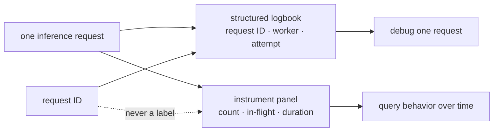

The JSON status endpoints and logs are the logbook. `/metrics` is the
instrument panel. Both are useful because they deliberately retain different
amounts of detail.

## What problem appears without this phase?

Before v0.26, an operator could inspect one process but could not safely ask:

- how fast are 5xx responses increasing across all services?
- how many requests are executing now?
- did a controlled retry increment exactly one transient-failure counter?
- is the current Raft commit index visible to a collector?
- did twenty-four distinct prompts create new time series?

A naive exporter creates a worse problem:

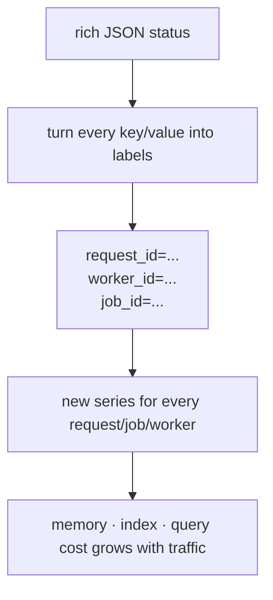

The goal is therefore not “export everything.” It is “choose the smallest
bounded numeric projection that answers operational questions.”

## First understand a time series

A time series is one sample name plus one exact set of labels.

```text
inferlab_http_requests_total{
  service="gateway",
  route="/v1/chat/completions",
  method="POST",
  status_class="2xx"
}
```

Changing the value does not create a new series. Changing any label value
does.

OpenMetrics also describes each family with exact `HELP` and `TYPE` lines.
Duration/timestamp families declare `UNIT ... seconds`, queue WAL size declares
`UNIT ... bytes`, and unitless families must not invent a unit. Across the
nine proof targets this is 14 required `UNIT` records per checkpoint: nine
common HTTP-duration records, two gateway-completion records, and one each for
worker generation, queue WAL bytes, and link transition time.

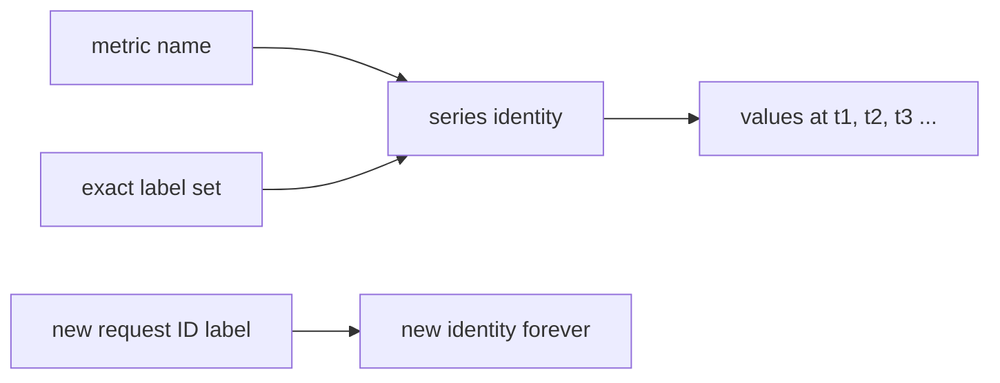

This is why cardinality is a design question rather than only a storage
setting. If labels are selected from finite enums, a maximum can be calculated
before traffic exists.

## Counter, gauge, and histogram

### Counter: “how many transitions have happened?”

A counter only rises while one process is alive. A restart begins a new
process-local sequence.

Examples:

- completion requests;
- queue claims;
- Raft elections;
- retry decisions;
- trust snapshots rejected.

Use a rate over time for questions such as “how many 5xx responses per
second?” Do not use a counter for current queue depth.

### Gauge: “what is true now?”

A gauge may rise or fall.

Examples:

- requests in flight;
- queue jobs by state;
- current control term and commit index;
- one-hot leader/follower/candidate role;
- routing lease ready or not ready.

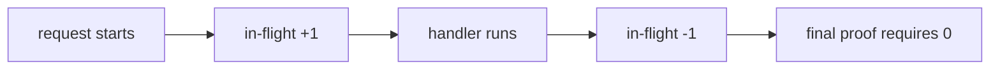

### Histogram: “how is a duration distributed?”

A histogram does not retain every duration. It increments cumulative buckets,
a total count, and a sum.

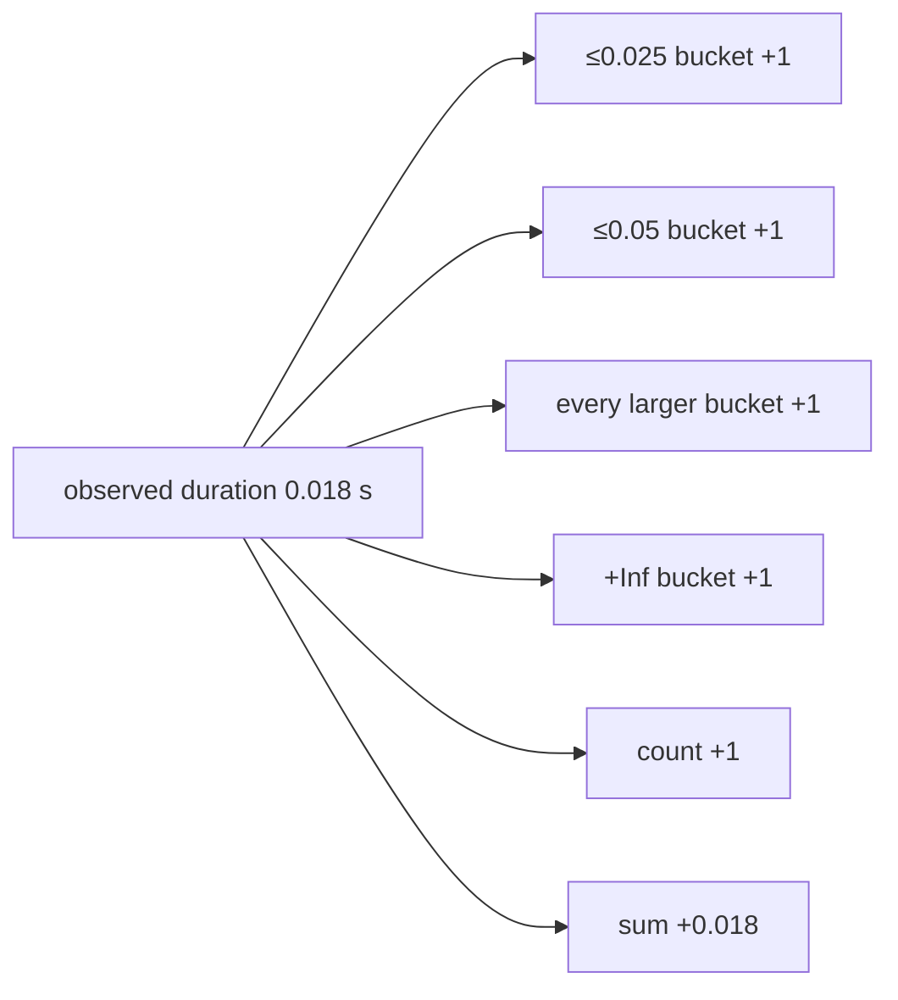

InferLab fixes 14 finite boundaries from 1 ms through 30 s, plus `+Inf`.
Therefore each histogram label set has 17 samples:

```text
15 buckets + sum + count = 17
```

The checker first requires the bucket, sum, and count components to have the
exact same label-set identities, so an orphan sum/count cannot hide a missing
bucket set. It then proves that bucket values never decrease as the boundary
grows, that `+Inf == count`, and that the exact boundaries did not drift.

## Why `/metrics` is a different listener

The application listener owns user and peer traffic. The metrics listener owns
only collector traffic.

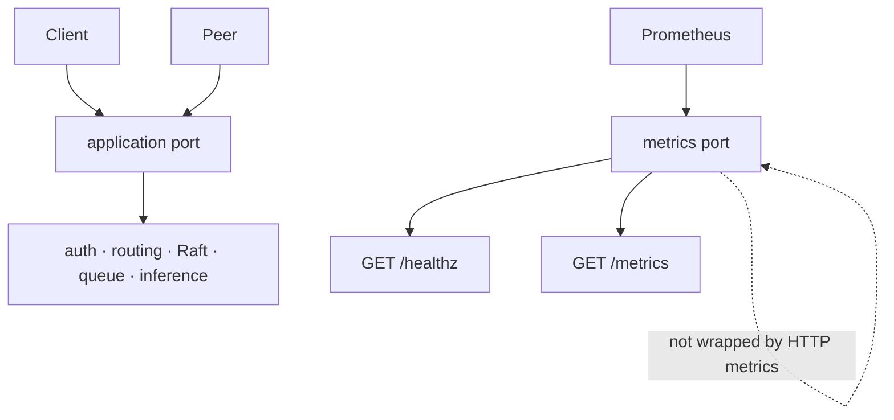

If `/metrics` counted itself, every scrape would change the document it was
reading. More importantly, a separate bind makes exposure deliberate:

| Environment | Result |
|---|---|
| metrics bind unset | no metrics listener |
| loopback bind | allowed |
| non-loopback bind without override | startup rejects it |
| non-loopback bind + explicit override | allowed for a private network |

The local exact-process proof uses loopback. Docker Compose uses `0.0.0.0`
inside the private container network and therefore sets the override; those
ports are not published to the host.

## How raw request paths stay bounded

Suppose clients request these paths:

```text
/v1/batch/jobs/7
/v1/batch/jobs/8
/v1/batch/jobs/very-long-user-value
```

All three become the same route label:

```text
/v1/batch/jobs/{job_id}
```

Unknown paths collapse to `unmatched`. An unsupported method on a known path
also collapses to `unmatched` with method `other`.

The checker validates the exact route/method pair, not just each label in
isolation. `/health` and `POST` are separately familiar values but are not a
valid pair; the middleware records them as `unmatched` + `other`.

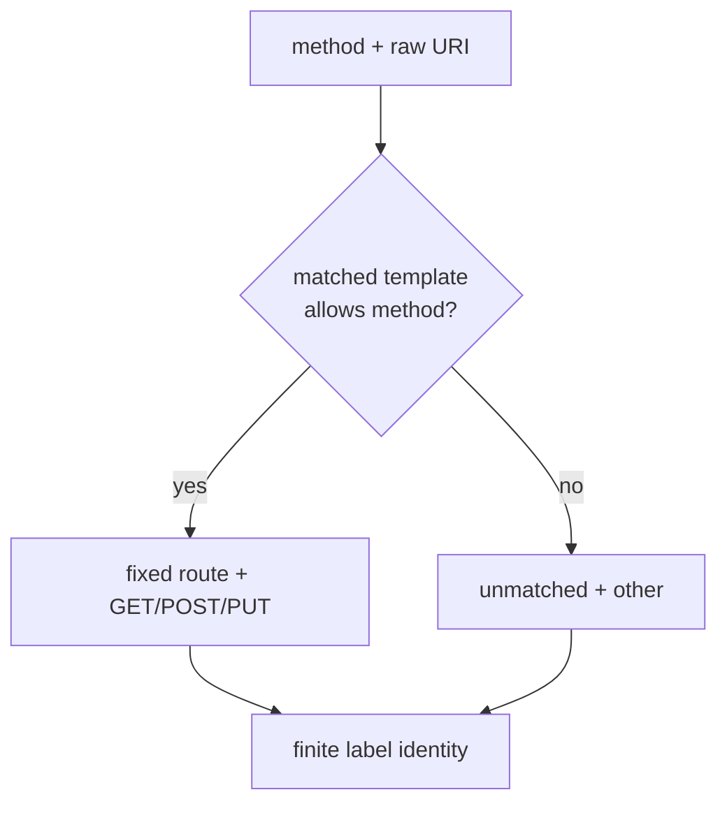

Raw paths, queries, job IDs, and prompts therefore cannot multiply series.

## Calculate the bound before looking at a scrape

For `P` allowed route/method pairs, common HTTP metrics can create at most:

```text
P × (4 status-class counters + 17 duration samples) + 1 in-flight gauge
```

The largest domain is the gateway:

```text
8 × 21 + 1 = 169 common HTTP series
18 scalar/counter/circuit series
4 outcomes × 17 completion histogram samples = 68
169 + 18 + 68 = 255
```

The completion histogram intentionally has only `outcome`. JSON versus stream
mode remains in structured logs. Adding a mode label would multiply the
histogram and break the target budget.

| Service | Hard target maximum |
|---|---:|
| gateway | 255 |
| cpu-worker | 168 |
| batch-queue | 202 |
| control-plane | 181 |
| trust-distributor | 164 |
| raft-link-proxy | 134 |

The retained topology has two gateways, one worker, one queue, three controls,
one trust distributor, and one link proxy. Its theoretical maximum is 1,721,
below the 2,500 topology cap.

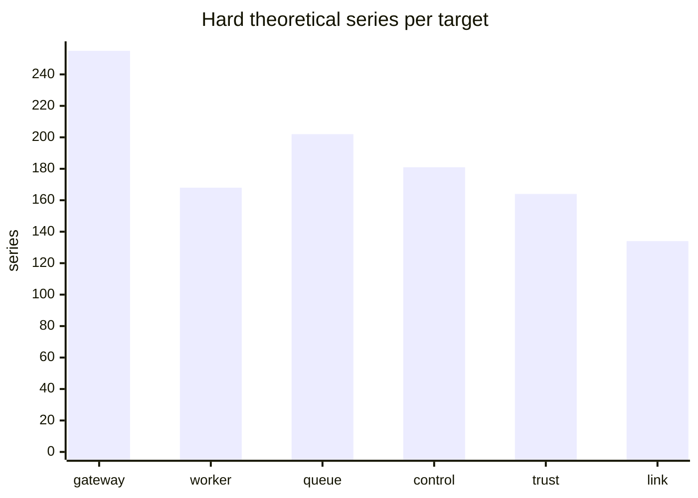

The formula proves the contract is bounded. Counting raw scrape samples proves
the implementation stayed inside it during this run. Both checks matter.

## Follow one valid request ID

The allowed alphabet is `[A-Za-z0-9._:-]`, with length 1–64. The gateway
chooses the canonical ID before authentication and admission.

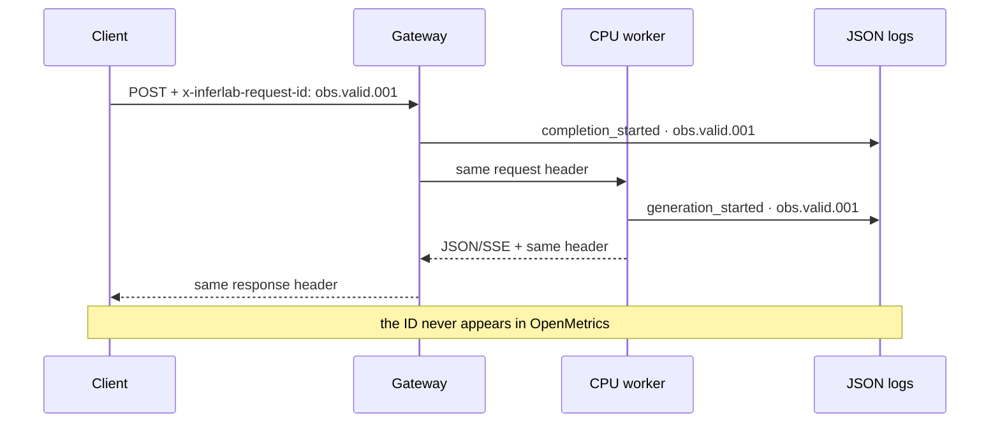

The retained proof checks that `obs.valid.001` is echoed by the gateway and
appears in the CPU worker's structured logs.

## Follow invalid input

The proof supplies `obs/invalid/request`. Slash is a valid HTTP header
character but outside InferLab's request-ID alphabet.

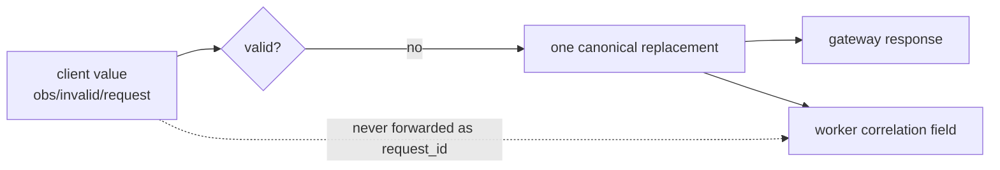

The retained replacement is valid and consistent. The bad value is absent
from the response, every raw `.prom` document, and every retained canonical CPU
worker `request_id` field; it was never forwarded as the worker correlation
ID. The proof does not retain or claim a whole-file scan of every raw process
log field.

Request ID is correlation, not authentication, authorization, idempotency, or
a promise of global uniqueness.

## Why retries must keep one ID

The proof starts two controlled upstreams. The first returns 503; the second
returns 200. Both record the request header they received.

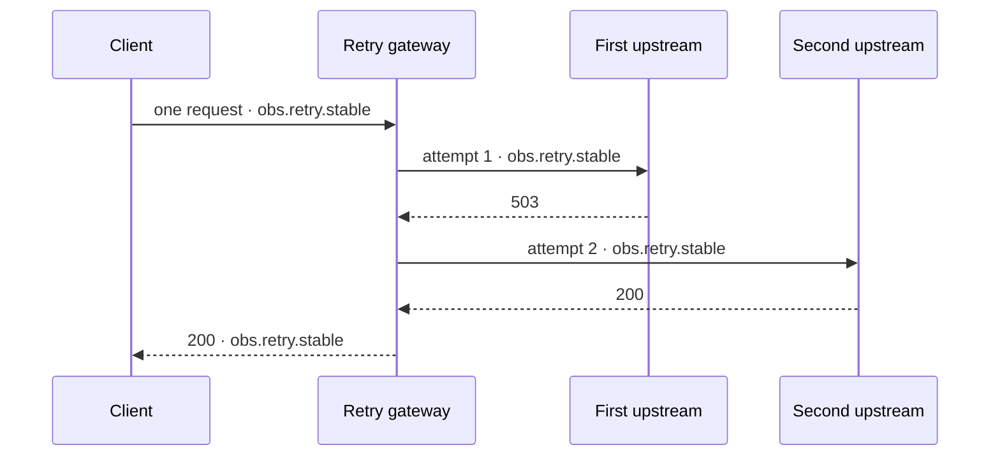

The exact metric deltas are:

| Signal | Delta |
|---|---:|
| original gateway requests | 1 |
| worker attempts | 2 |
| transient failures | 1 |
| granted retries | 1 |
| successful completion histogram count | 1 |

This is stronger than checking only the final success: it binds the intended
failure to each operational counter.

## How service snapshots become metrics

Each service owns a bounded scalar snapshot. Encoding happens after expensive
or mutable work has already produced those scalars.

### Gateway

Admission counts, resilience totals, worker count/in-flight sum, circuit-state
counts, routing lease readiness, and control revision are cross-checked against
`/internal/workers`. Worker IDs and URLs stay in JSON only.

### CPU worker

Request, scheduler, batch, token, and generation metrics come from scheduler
counters and gauges. Paged-cache metrics are deferred because the existing
native stats path locks the allocator and scans pages. An automatic scrape must
not make token/cache work wait for observability.

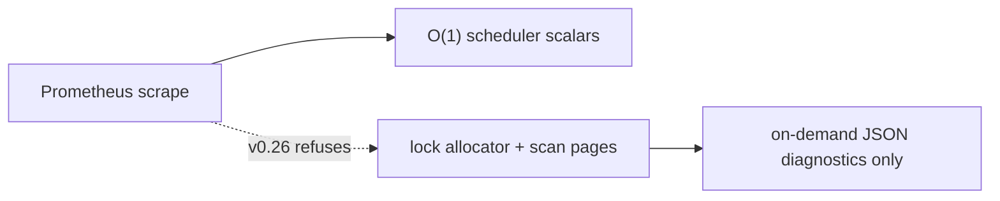

### Batch queue

Queue gauges mirror durable pending/claimed/completed/dead-letter counts.
Critically, a scrape does not call the time-aware status path to expire a
visibility lease. It reports transitions already made durable; observation
does not mutate the queue.

### Control plane

One-hot role and log/commit/applied gauges mirror live Raft status. Counters
cover bounded election, replication, write-auth, service-auth, and trust
outcomes. Peer/writer/credential identity remains in JSON diagnostics.

### Trust distributor and link proxy

The trust exporter counts fixed snapshot/receipt outcomes and receiver totals.
The link exporter counts allow/drop transitions and fixed forward/drop/failure
outcomes. Neither exports signed bytes, receivers, link identities, upstream
URLs, paths, or reason text as labels.

## Walk the retained exact-process proof

The proof uses nine metric targets and nine continuity-checked service
processes:

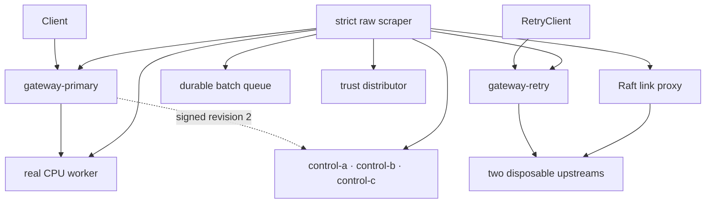

The disposable retry fixture is deliberately stopped after the retry evidence
so the link proxy sees one connection failure. It is not called a service
target and is not included in process-continuity claims.

The four scrape checkpoints are:

1. **baseline** after all nine service targets are healthy;
2. **before-cardinality** after exact retry/queue/trust/link scenarios;
3. **after-cardinality** after 24 unique real-CPU prompts; and
4. **final** after status capture and process-continuity observation.

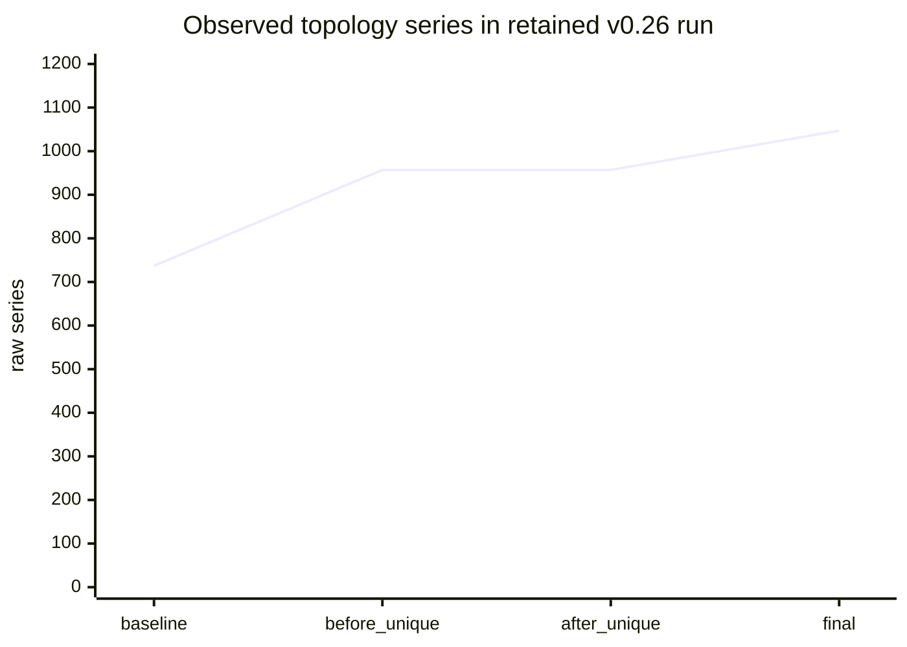

Before and after unique prompts are both 957. More requests changed values,
but created no new gateway or worker identities. The peak individual target
was 159, below 256. The final topology was 1,047, below 2,500 and below its
1,721 design-time ceiling.

## What the retained result proves

The fresh controlled loopback run retained:

- **36/36 assertions passed**, independently replayed byte-for-byte;
- **36 raw scrapes**: four checkpoints × nine targets;
- **62 exact files**, with 61 hashes and `manifest.json` published last;
- **165 histogram label sets** with exact component parity and bucket algebra;
- **14 exact `UNIT` records per checkpoint** across the nine targets;
- **nine stable proof-owned service PIDs** with parent/start/command/executable
  checks;
- **24 unique prompts** with zero new gateway/worker series;
- one real CPU JSON response in **156.298 ms**;
- one real CPU SSE in **175.969 ms**, 10 events, ending in `[DONE]`;
- exact queue deltas: two claims, one acknowledgment, one explicit failure,
  and one dead-letter transition;
- each trust outcome exactly once: unavailable, published, unchanged,
  rejected, served, not-modified, and rejected receipt; and
- one link forward, one controlled drop, and one upstream failure.

These timings are observations from one local teaching workload, not latency
objectives, percentiles, throughput, or cross-host claims.

## How to read the generated chart

The SVG at `docs/results/v0.26/raw/observability-proof.svg` is generated only
after the checker passes. Its counts and accessibility description are derived
from retained JSON. The renderer refuses malformed, incomplete, or failed
evidence instead of drawing a reassuring but false picture.

The evidence directory is transactional:

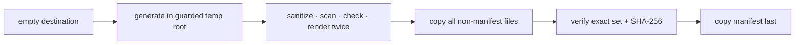

If the run fails before the last step, no complete-looking manifest is
published.

## Use the local Prometheus demo

The interview Compose topology adds pinned `prom/prometheus:v3.13.1`.

```bash
./deploy/interview/start.sh
```

It prints the showcase and Prometheus loopback URLs. The metrics listeners stay
inside the Docker network. Prometheus has a 24-hour retention setting and a
128 MiB ephemeral `tmpfs`; stopping the topology discards history.

Three bounded starter queries:

```promql
sum by (service) (rate(inferlab_http_requests_total[1m]))
```

```promql
sum by (service, status_class) (rate(inferlab_http_requests_total[1m]))
```

```promql
histogram_quantile(0.95,
  sum by (service, le) (rate(inferlab_http_handler_duration_seconds_bucket[5m])))
```

The third query estimates a percentile from bucketed data; it does not recover
the original individual durations.

## What you can change safely as a learning exercise

1. Add a request to an unknown raw path and confirm it increments only
   `route="unmatched",method="other"`.
2. Add 1,000 distinct prompt strings and predict which counters change while
   the series identities remain fixed.
3. Lower Prometheus `sample_limit` below the gateway's actual count and observe
   the target fail as a collector-side guard.
4. Add a new finite outcome to one enum, calculate the new theoretical series
   count first, and refuse the change if the budget breaks.
5. Compare a counter rate with a gauge value and explain why applying `rate()`
   to the gauge would answer the wrong question.
6. Query the JSON worker status, identify fields that would be dangerous
   labels, and explain where that detail belongs instead.

Do not add request IDs, prompts, job IDs, worker IDs, URLs, or raw errors as a
shortcut. The exercise is to preserve the boundary.

## Limitations to say out loud

- Metrics transport is loopback/private-network HTTP, not global mTLS or an
  authenticated operator API.
- The Compose collector is one ephemeral Prometheus, not HA or long-term
  storage.
- There are no checked-in Grafana dashboards, alert rules, recording rules,
  SLOs, OpenTelemetry traces, exemplars, remote write, or cloud backend.
- One local proof does not establish production performance, capacity, or
  availability.
- Native paged-cache metrics remain deferred until scrape-time access is
  constant-time and does not lock/scan allocator pages.
- Request ID is bounded correlation, not authority or global uniqueness.
- Exact failure deltas prove this controlled schedule, not every failure
  interleaving.

After v0.26, the next engineering boundary will be selected from the explicit
backlog: broader channel security/certificate operations, trust expiry/HA, or
checkpoint integration. No v0.27 is promised. CUDA stays v1.0 and requires
appropriate hardware.

## Glossary

| Term | Plain meaning |
|---|---|
| RFC | Request for Comments; the design/decision record |
| Observability | Inferring system behavior from outputs such as metrics and logs |
| Metric family | One named counter, gauge, or histogram contract |
| Sample | One numeric value for one series at one scrape |
| Time series | Metric name plus exact labels, observed over time |
| Cardinality | Count of distinct time series |
| Counter | Monotonic process-local total |
| Gauge | Current value that can rise or fall |
| Histogram | Cumulative duration buckets plus sum and count |
| Bucket | Count of observations at or below one boundary |
| Label | Finite dimension that distinguishes series |
| Route template | Stable path shape with variables replaced, such as `{job_id}` |
| OpenMetrics | The text format returned by InferLab `/metrics` |
| Prometheus | The local collector and query engine |
| Scrape | One read of a target's OpenMetrics document |
| PromQL | Prometheus query language |
| Request ID | Bounded header/log correlation value |
| High cardinality | Label space that can grow with user traffic or runtime IDs |
| Hot path | Work performed per request/token where added cost affects serving |
| One-hot gauge | Several finite state series where exactly one is 1 |
| Structured log | Machine-readable JSON event with named fields |
| `# EOF` | Required terminal marker for the retained OpenMetrics document |
| Manifest-last | Evidence publication where the completion marker is copied last |

## The transferable lesson

Good observability is a data-model design problem. The safest metric is not the
one with the most context; it is the smallest finite signal that answers a
specific operational question, with high-detail correlation kept in a medium
designed for it.
