# Phase 32 learning guide: signed service-trust validity and expiry

## The new behavior in one sentence

A root-signed service-trust policy now carries an absolute use-by time, and a
control receiver refuses every **new service-authenticated request** once its
effective clock reaches that signed deadline—even if the distributor keeps
returning the same authentic bytes.

Phase 32 follows Phase 31. [RFC 0032](../rfcs/0032-signed-service-trust-validity-expiry.md)
is the engineering decision record; this guide builds the mental model.

## Start with a building-access analogy

Imagine three documents at a secure building:

- a signed employee directory says which badge keys belong to which people;
- a version number prevents replacing today's directory with last month's;
- a printed “valid until 18:00” time prevents using today's directory forever.

At 18:00 the paper does not become unsigned. The signature is still genuine.
The guard simply stops using that genuine but expired directory to admit new
people.

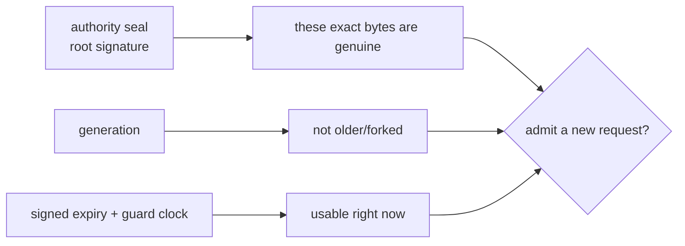

This is the core distinction:

```text
authentic does not imply currently valid
```

## Why generation was not enough

Generation answers ordering:

```text
g3 is newer than g2
```

It does not answer time:

```text
is g3 still acceptable next week?
```

Before v0.27, a receiver could restart from an authentic cached generation
during distributor outage. That was useful availability behavior, but there
was no root-authorized time at which the receiver had to stop accepting new
peer or gateway requests.

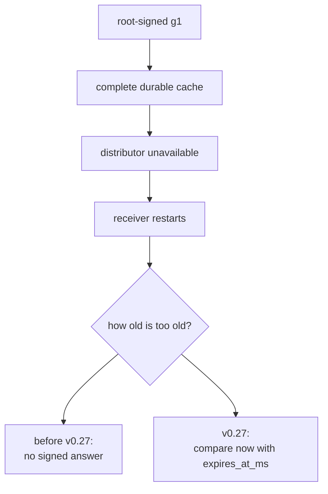

## Four different times that are easy to confuse

| Time | Meaning | Does it move the policy deadline? |
|---|---|---:|
| `issued_at_ms` | Authenticated issue timestamp used for skew/lifetime bounds; not an exact `not_before` | No |
| `expires_at_ms` | Exclusive root-signed end of policy use | It is the deadline |
| download time | When one receiver fetched the bytes | No |
| activation time | When one receiver persisted and swapped policy | No |

If two receivers download the same policy ten seconds apart, both retain the
same absolute expiry. The later download does not buy ten more seconds.

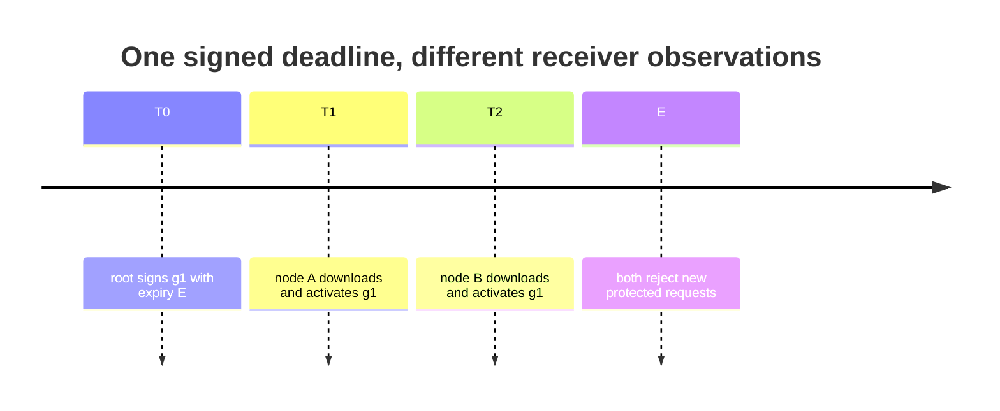

## The exact inequality

Policy v2 is usable only when:

```text
effective_now_ms < expires_at_ms
```

That means:

| Receiver time | Result |
|---:|---|
| `expires_at_ms - 1` | valid |
| `expires_at_ms` | expired |
| `expires_at_ms + 1` | expired |

The boundary is exclusive so every receiver and test has one unambiguous
answer at equality.

Two other bounds stop a signer or configuration error from creating an
unreasonably future policy:

```text
issued_at_ms <= effective_now_ms + max_future_skew_ms
expires_at_ms - issued_at_ms <= max_policy_lifetime_ms
```

Default receiver bounds are:

```text
maximum lifetime: 86,400,000 ms (24 hours)
maximum future skew: 5,000 ms
```

The lifetime can be configured only from 250 ms through seven days. Future
skew can be configured only from zero through five minutes.

Policy v2 has no `not_before` field. The receiver allows the configured future
skew around issue time, while expiry remains the one exact exclusive edge.

## Why policy v2 has a different signature domain

The old v1 shape had no expiry. Adding a field without changing the signature
domain would make version interpretation harder to audit.

```text
v1 policy schema: inferlab.service-trust-policy.v1
v1 auth schema:   inferlab.service-trust-authentication.v1
v1 domain:        inferlab.service-trust-policy.v1\0

v2 policy schema: inferlab.service-trust-policy.v2
v2 auth schema:   inferlab.service-trust-authentication.v2
v2 domain:        inferlab.service-trust-policy.v2\0
```

The canonical v2 signature message includes the eight-byte expiry immediately
after the issue time.

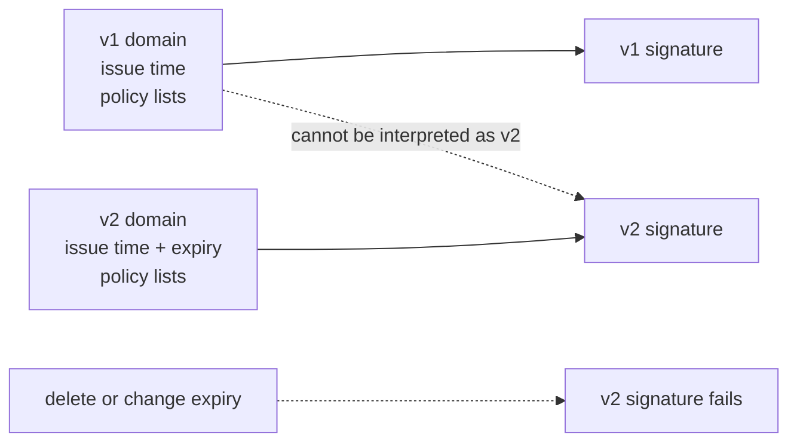

A v1 snapshot must omit `expires_at_ms`. A v2 snapshot must include a positive
value later than `issued_at_ms`. JSON `null` is rejected; it is not treated as
an omitted field.

## The complete acceptance pipeline

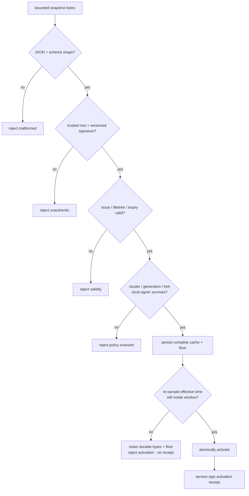

The ordering matters:

```text
verify → pre-persist validity check → persist → re-sample and revalidate
inside the atomic authorizer transition → activate → receipt
```

- Validating after activation would briefly expose an expired policy.
- Activating before persistence could make a crash reopen an older generation.
- Checking only before persistence leaves a race in which a slow durable write
  lets the candidate expire before the in-memory swap.
- Sending a receipt before activation would make the receipt claim false.

If that second check observes expiry, persistence is not undone: the complete
candidate and rollback floor remain durable, and the receiver's accepted floor
advances. The active generation, policy, and `loaded_at` remain unchanged, the
watcher records a trust-policy rejection, and no receipt is emitted. Think of
this as learning the durable ordering of a candidate without ever granting it
request-authorizing power.

## Distributor time is not receiver time

The distributor checks structure and the root signature. It does **not** decide
whether the snapshot is currently usable for a receiver.


Why split the job?

- different receivers can have bounded clock skew;
- the distributor is transport, not policy authority;
- a distributor status page must not pretend it knows every receiver's clock;
- retaining a future/excessive authentic artifact is not the same as a
  receiver activating it.

Distributor status may show the schema and signed expiry. Only receiver status
can say `valid` or `expired` for that process.

The reusable code API is intentionally verification-first:

```rust
verified_snapshot.validate_receiver_validity(now_ms, &config)
```

There is no public “validate this raw policy payload” shortcut. That type
boundary makes it harder to accidentally treat unsigned timing fields as
authority.

## What happens on each new protected request

Protected requests are the signed Raft peer RPCs and signed gateway route
reads. They use the RFC 0025 service-authentication headers.

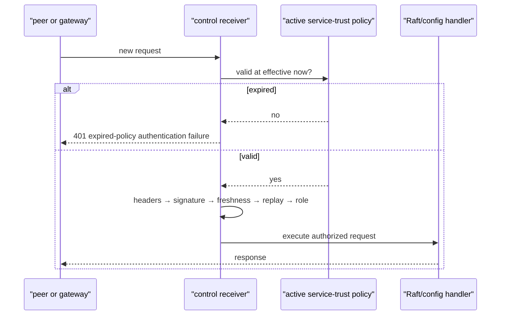

Validity is checked before header parsing. Therefore, after expiry:

- a correctly signed request receives 401;
- a request missing all service-authentication headers also receives the same
  bounded expired-policy reason; and
- neither reaches cryptographic credential selection, replay insertion,
  authorization, or Raft state mutation.

This ordering avoids using an expired trust policy even to explain which key a
caller presented.

## “New request” is the important phrase

Expiry does not travel backward in time and cancel work already admitted.

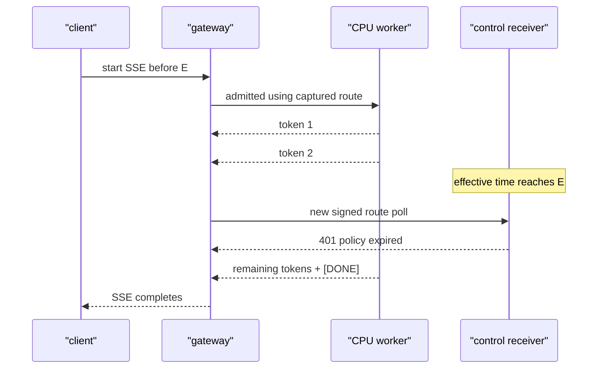

The stream is not repeatedly re-admitted through the control plane for every
token. It already holds its routing/admission state. Its ordinary client
cancellation, request deadline, gateway lease, and worker behavior still
apply.

Also note the inverse: a new public inference request is not itself an RFC
0025 service-authenticated control request. If the gateway still has a valid
routing lease, service-trust expiry alone does not promise instantaneous public
data-plane shutdown.

## Why 304 cannot renew trust

An HTTP 304 means:

> The distributor's current bytes match the ETag you already have.

It does not mean:

> The root signer extended the deadline.

```mermaid
sequenceDiagram
    participant R as "receiver with cached g1"
    participant D as "distributor"
    participant Root as "offline/deployment root"

    R->>D: GET If-None-Match: g1-etag
    D-->>R: 304 Not Modified
    Note over R: expires_at remains E1
    R->>D: GET If-None-Match: g1-etag
    D-->>R: 304 Not Modified
    Note over R: now reaches E1; g1 expires
    Root->>D: later publish separately signed g2 with E2
    D-->>R: 200 g2 bytes
    R->>R: verify + precheck + persist + activation recheck
```

Only a new root-signed snapshot can carry a different deadline. A same-
generation snapshot with a different deadline is a fork, not a renewal.

## Same generation, different deadline is a fork

Suppose these are both correctly root-signed:

```text
g1 expires at 18:00
g1 expires at 19:00
```

The second is not “the same policy with more time.” Expiry is part of the
signed policy identity. The distributor and receiver floor must reject two
different valid snapshots occupying one generation.

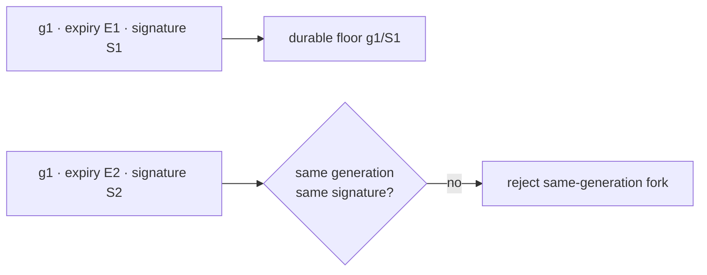

A legitimate renewal needs a higher generation even if every credential list
entry stays the same.

## Backward clocks and effective time

Wall-clock time is required because a deadline is portable across restarts and
machines. But NTP or an operator can move a wall clock backward.

Without a guard:

```text
observe 18:00 → policy expired
clock moves to 17:59 → policy appears valid again
```

InferLab clamps the effective time inside one process:

```text
effective_now = max(highest_time_already_observed, current_wall_clock)
```

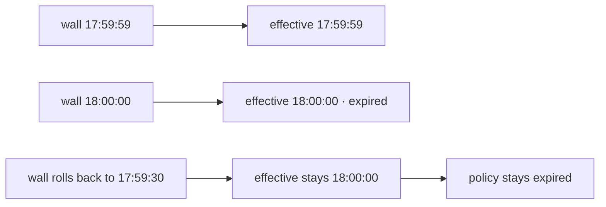

This is not a trusted hardware clock. A restart evaluates the current wall
clock again; InferLab does not write a durable timestamp on every request.
Correct host time remains an operational dependency.

## Startup, runtime, and recovery are deliberately different

| Situation | Has an active policy in memory? | Invalid/expired candidate result |
|---|---:|---|
| First startup | No | Fail before listener |
| Runtime reload | Yes | Retain current identity/diagnostics |
| Runtime after current expiry | Yes, but expired | Keep polling; reject new protected requests |
| Restart with only expired cache | No | Fail closed |
| Expired runtime then valid g2 | Expired g1 | Persist, activation-time recheck, then activate g2; recover |

An expired running process is useful: status remains inspectable and the
watcher can fetch recovery. It is not useful as an authority for new peer or
gateway requests.

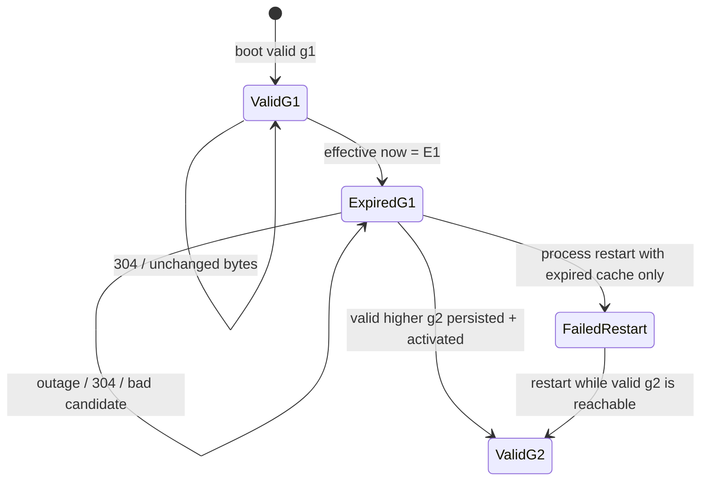

## v1 compatibility is an explicit downgrade

Policy v1 has no signed expiry. Signed receiver modes default to rejecting it.

The only compatibility switch is:

```bash
INFERLAB_SERVICE_TRUST_ALLOW_LEGACY_V1=1
```

Only literal `1` enables it. Status reports both that the override is enabled
and that an active v1 policy is `legacy-unbounded`.

Historical v0.22–v0.24 proof scripts may set this switch specifically to replay
their original v1 artifacts. They do not become v2 evidence, and their old
claims are not rewritten.

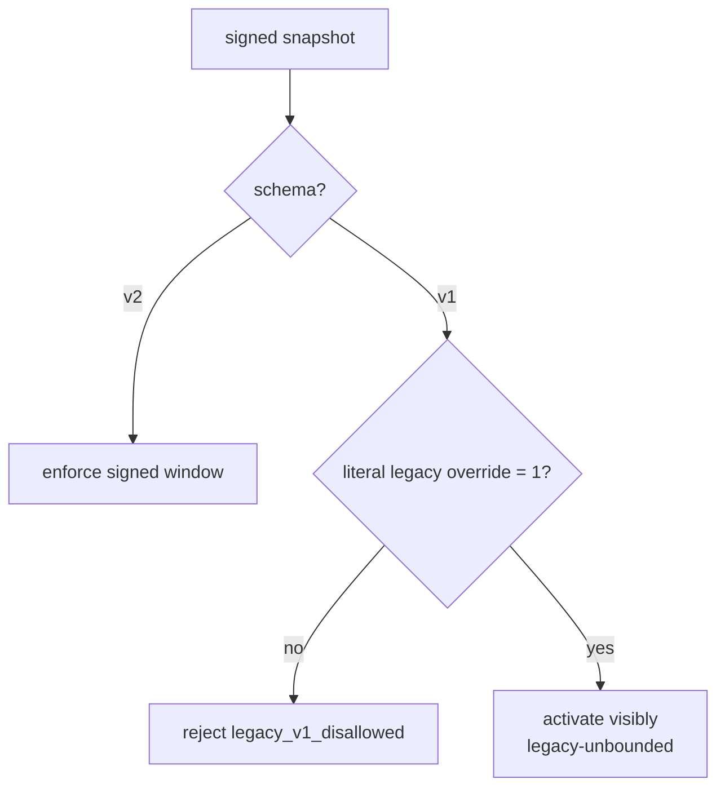

## Failure experiments to run by hand

### 1. Change only the expiry

Take a signed v2 JSON file, increment `expires_at_ms`, and do not re-sign.
Prediction: the root signature fails because expiry is canonical signed data.

### 2. Submit an impossible window

Set `expires_at_ms <= issued_at_ms` in the submitted snapshot. The retained
fixture edits an already-signed g1 without re-signing specifically to prove
shape validation runs first. Prediction: structural validation rejects the
impossible window before signature verification or receiver timing.

### 3. Sign an excessive lifetime

Set expiry more than the configured maximum after issue time.
Prediction: the distributor may retain authentic bytes, but a receiver rejects
`lifetime_exceeded` and keeps its prior active policy.

### 4. Sign too far in the future

Set issue time beyond `now + configured skew`.
Prediction: receiver rejects `issued_in_future`.

### 5. Reuse a generation with a new deadline

Create a valid second g1 with different expiry.
Prediction: `snapshot_fork`; renewal requires g2.

### 6. Return 304 until expiry

Prediction: fetch success continues, deadline never moves, and validity becomes
`expired` at E.

### 7. Restart from expired cache during outage

Prediction: startup fails because no acceptable initial policy exists.

### 8. Publish valid g2 after expiry

Prediction: each receiver validates, persists, activates, emits a g2 receipt,
and accepts new protected traffic again.

## Reading the status without fooling yourself

Receiver status exposes:

```json
{
  "trust_policy_generation": 1,
  "trust_policy_expires_at_ms": 1700000060000,
  "trust_policy_validity": "expired",
  "trust_policy_remaining_ms": 0,
  "trust_policy_max_lifetime_ms": 86400000,
  "trust_policy_max_future_skew_ms": 5000,
  "trust_policy_allow_legacy_v1": false,
  "trust_policy_expiration_rejections": 4
}
```

Interpretation rules:

- `remaining_ms` is a local observation and is saturated at zero;
- different nodes may cross expiry a bounded skew apart;
- an unchanged generation can move from `valid` to `expired` without a reload;
- a receipt proves activation at its signed `applied_at_ms`, not perpetual
  validity afterward;
- distributor schema/expiry fields do not prove any receiver is currently
  valid; and
- counters reset on process restart.

## Proof journey

The retained v0.27 proof is designed as this story:

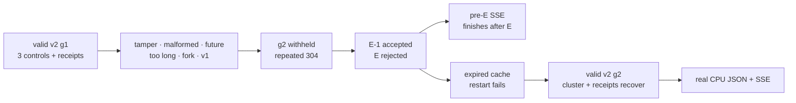

The checker must not accept vague HTTP outcomes. It binds exact schemas,
generations, deadlines, response codes/reasons, cache/floor hashes, status
fields, request timestamps, process identity, receipt identities, and real
response structure. Seven hard-coded production regressions supply exact
`E-1`/`E` and backward-clock behavior, the post-persistence activation race,
future-issued local-file retry, same-ETag 304 clock observation, and unchanged
local-file polling that latches expiry before a backward-clock step—scheduler
interleavings and exact millisecond boundaries that a live shell cannot
schedule deterministically. Two remote-path
regressions additionally prove an expiry during persistence produces no
activation receipt and a same-generation 200 preserves only a genuinely
pending receipt instead of fabricating a fresh one after delivery.

## What you can say in an interview

- “I separated policy authenticity, rollback ordering, and wall-clock validity;
  all three must pass.”
- “The root signs an absolute expiry. A 304 or late download cannot renew it.”
- “The end is exclusive: `now == expires_at` is rejected.”
- “Validity is checked before service-auth headers, so an expired policy is not
  used even to classify the caller.”
- “An expired control stays alive for diagnostics and recovery but refuses new
  protected peer/gateway requests.”
- “I clamp time monotonically inside a process so a backward wall-clock step
  cannot reopen expired trust.”
- “The boundary is admission, not instant cancellation: an SSE admitted before
  expiry may reach `[DONE]`.”
- “Legacy v1 is default-denied and, when deliberately enabled, is visibly
  unbounded.”

Avoid saying:

- every public inference request stops exactly at policy expiry;
- an already-running stream is revoked;
- the distributor decides fleet validity;
- receipts continuously attest that a policy is unexpired;
- policy expiry revokes TLS certificates;
- wall-clock rollback is durably impossible; or
- a one-host proof is a hostile distributed-clock proof.

## Glossary

| Term | Meaning in this phase |
|---|---|
| **RFC** | Request for Comments; the durable design decision record |
| **Service-trust policy** | Complete root-signed mapping of service credentials, revocations, and gateway roles |
| **Policy v1** | Historical schema with authenticated issue time but no signed expiry |
| **Policy v2** | New schema with a required signed `expires_at_ms` |
| **Trust root** | Ed25519 authority whose public key verifies complete policy snapshots |
| **Signature domain** | Version-specific prefix preventing one protocol/version signature from being reused as another |
| **Generation** | Positive monotonic policy order; renewal needs a higher generation |
| **Issue time** | Root-signed metadata used for future-skew and lifetime checks; not a `not_before` edge |
| **Expiry** | Exclusive absolute end of receiver policy use |
| **Exclusive end** | Valid while `now < expiry`; invalid at equality |
| **Maximum lifetime** | Receiver bound on `expiry - issue` |
| **Future skew** | Bounded allowance for issuer/receiver clock disagreement |
| **Effective time** | Maximum wall-clock value observed so far by one running receiver |
| **Last known good** | Most recent authentic, ordered policy retained after a bad runtime candidate; it may itself later expire |
| **Rollback floor** | Durable generation/root/signature identity preventing older or forked restart input |
| **304 Not Modified** | HTTP statement that remote bytes match an ETag; never a trust renewal |
| **Activation-time recheck** | Second validity decision after persistence, using a newly sampled process-monotonic effective time inside the atomic authorizer transition |
| **Activation receipt** | Receiver-signed report that a snapshot was verified, persisted, revalidated, and activated at its exact signed `applied_at_ms` |
| **Protected request** | RFC 0025 signed Raft RPC or gateway route read checked by the control receiver |
| **Admission boundary** | Moment a new request is allowed to execute; later expiry does not retroactively undo it |
| **Legacy-unbounded** | Explicit compatibility state for accepted v1 with no signed deadline |
| **Withholding** | Distributor or network fails to provide a newer policy; it cannot extend the old deadline |

## Limits to remember

1. Host wall clocks must be sufficiently correct.
2. The monotonic clamp is process-local, not persisted secure time.
3. Receiver expiry is not fleet-atomic; bounded skew creates a mixed edge.
4. A compromised receiver may bypass its own gate.
5. Existing TLS sessions and certificates are unaffected.
6. Already-admitted inference is not cancelled.
7. A gateway's separate routing lease can keep its data plane available.
8. v1 compatibility has no deadline and weakens the property.
9. Cache/floor integrity still trusts local storage.
10. There is no emergency cancellation, HSM, transparency log, distributor HA,
    global mTLS, or hostile multi-host clock evidence.

The next identity-lifecycle work can use this bounded policy lifetime while
rotating local service keys or TLS leaves. Loading a new CA-valid certificate
still does not revoke the old certificate; that requires a separate
certificate authorization/revocation design.
