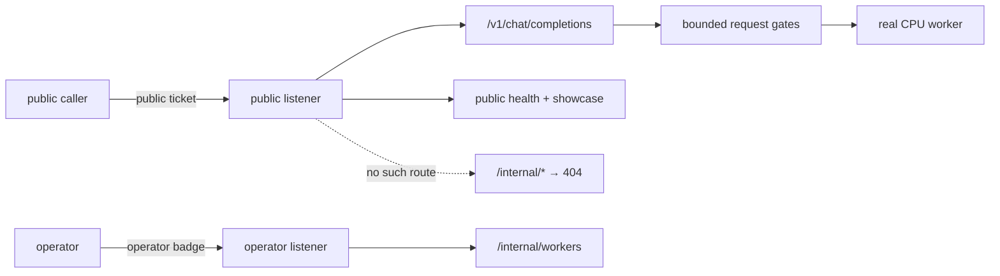
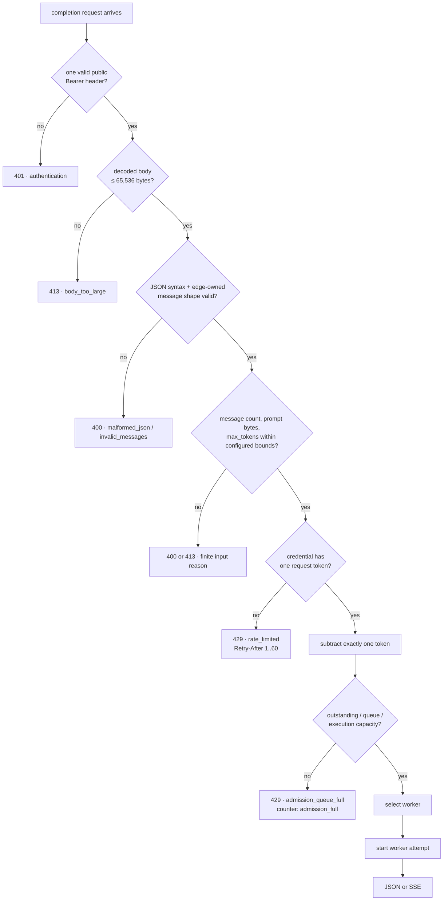
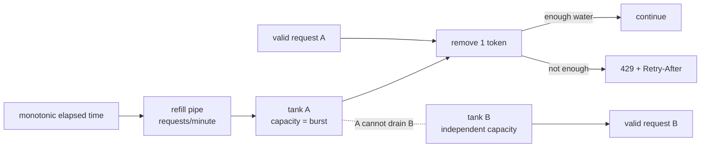
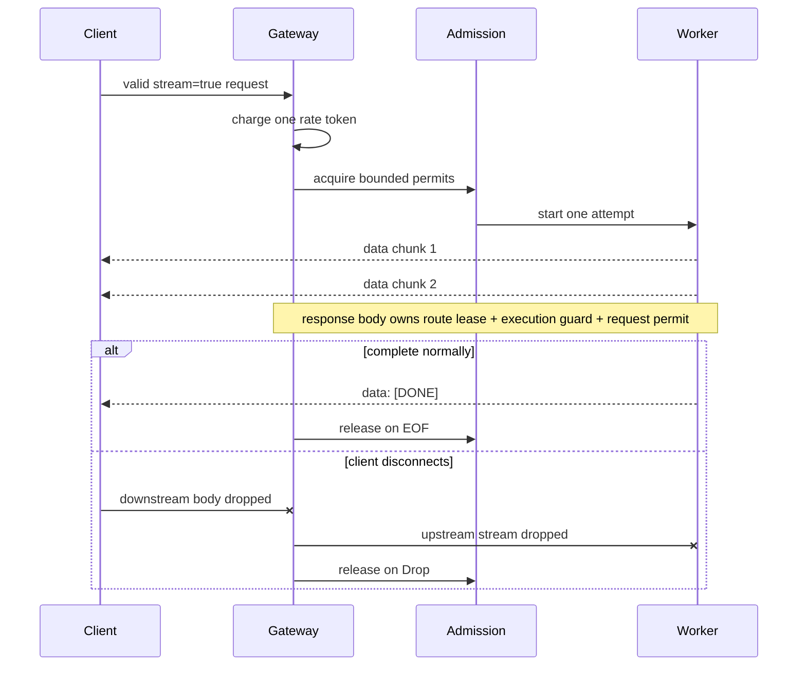
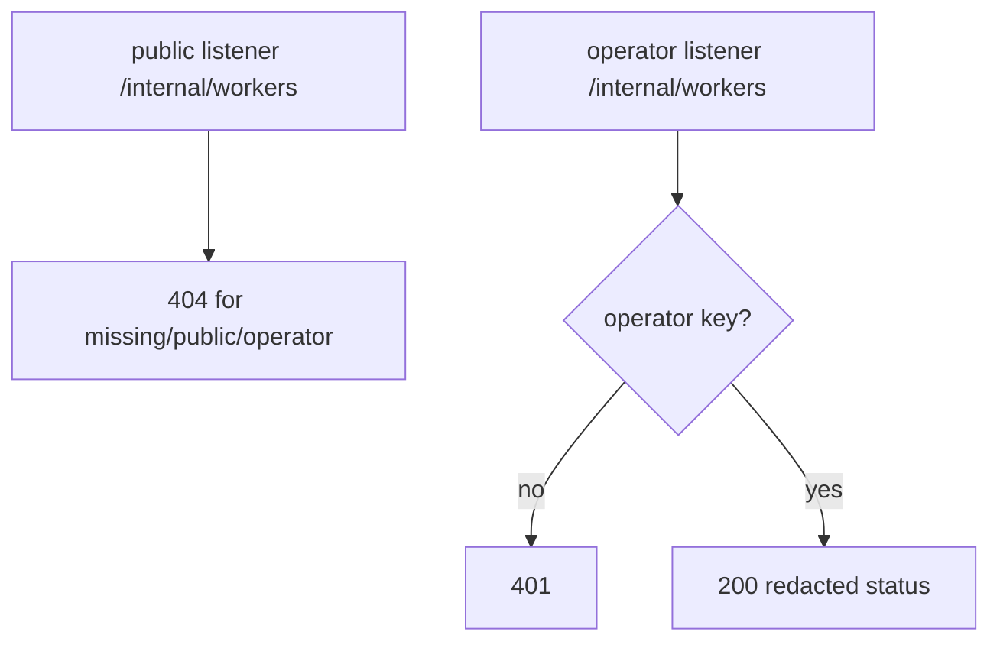
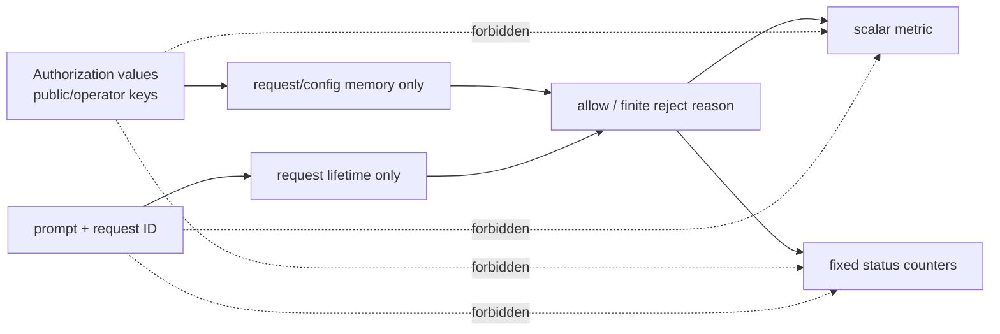

# Phase 33: Public edge isolation and bounded abuse budgets

## What we are learning

This phase answers a deceptively simple production question:

> If I expose the inference gateway, what can an untrusted caller reach and how
> much work can one credential ask the system to do?

The answer cannot be “the route has an API key.” Authentication is one gate,
but a public service also needs:

- a smaller public route surface than its operator surface;
- hard input bounds before expensive work;
- a per-credential request budget;
- bounded concurrency while a long stream is open; and
- telemetry that describes rejection classes without copying user or secret
  data into metrics.

v0.28 adds those ideas without pretending that one local gateway is an
internet-scale DDoS system.

## The mental model: a theatre with two doors

Imagine a theatre:

- the **front door** accepts ticket holders and leads only to the auditorium;
- the **staff door** accepts a different staff badge and leads to the control
  room; and
- the control room does not appear on the front-door floor plan.

That last detail matters. If the front door had a control-room route guarded by
a second badge, anyone could still discover that the room exists. InferLab's
hosted public router does not register `/internal/*` at all.



Both doors are served by one gateway process. They share the same routing and
admission state, but they do not share route tables or credential classes.

## Public, operator, and internal do not mean the same thing

| Word | Meaning here |
|---|---|
| Public listener | Socket intended for untrusted completion callers |
| Operator listener | Separately bound socket for operational inspection |
| Public credential | Bearer secret accepted for public completion work |
| Operator credential | Different bearer secret accepted only by the operator route |
| Internal route | Diagnostic route that is absent from the hosted public router |
| Metrics listener | Existing private OpenMetrics socket; it is not public-routed |

“Internal” is a network and route-placement statement, not a magical property
of the path string. A route named `/internal/workers` would still be public if
we registered it on the public router.

## Local mode versus hosted mode

`INFERLAB_PUBLIC_EDGE_MODE` defaults to `local` so old development builders and
historical proofs remain compatible. `hosted` is intentionally stricter. It
requires:

- explicit `INFERLAB_PUBLIC_API_KEYS`;
- an explicit `INFERLAB_OPERATOR_API_KEY`;
- an explicit `INFERLAB_OPERATOR_BIND`; and
- a public `INFERLAB_BIND` that is distinct when supplied (otherwise it safely
  defaults to `127.0.0.1:8080`).

Hosted startup refuses overlapping public/operator keys and conservatively
refuses public/operator bind combinations that could resolve to the same port.
Failing before either listener serves is safer than discovering a partial
configuration after traffic arrives.

## The exact request journey

Read this diagram from top to bottom. The order is a security property.



### Why authentication is first

Suppose body buffering happened first. An unauthenticated caller could send a
large body and make the application read it before learning the caller has no
key. Authentication first short-circuits that application work.

The network and HTTP server still receive some bytes, so this is not bandwidth
or connection-flood protection. It is an application-work boundary.

The authenticated body is read and parsed before bucket charging, admission,
and the gateway request deadline. The 65,536-byte ceiling bounds one body; it
does not bound slow authenticated uploads, total concurrent pre-gate buffers or
JSON parsing, or the rate of malformed traffic.

### Why the body limit counts decoded bytes

`Content-Length` is only a claim. A caller can omit it and use chunked transfer
encoding. InferLab limits the bytes it actually collects, so both a fixed-length
65,537-byte body and a chunked body that crosses 65,536 bytes receive the same
finite rejection.

### Why validation happens before rate charging

Malformed JSON and impossible inputs should not drain the request budget of a
valid credential. The gateway first proves the request is structurally usable
and within the public limits, then charges it.

### Why charging happens before admission

A valid request consumes edge work even if the execution queue is currently
full. Charging after success would let callers hammer an overloaded gateway for
free. v0.28 does not refund a token after admission, timeout, or disconnect.

## Four different input limits

One “maximum body size” is not enough.

| Limit | Default | Maximum | What it bounds |
|---|---:|---:|---|
| Request bytes | 65,536 | 65,536 | HTTP body collected by the gateway |
| Messages | 32 | 256 | Number of message objects traversed |
| Prompt bytes | 16,384 | 65,536 | Aggregate UTF-8 message-content bytes |
| Output tokens | 256 | 4,096 | Requested `max_tokens` work |

A tiny JSON request can still ask for 4,096 tokens, and a large JSON envelope
can contain many tiny messages. Separate limits make the expensive dimensions
visible.

The corresponding environment variables are:

```text
INFERLAB_PUBLIC_MAX_MESSAGES
INFERLAB_PUBLIC_MAX_PROMPT_BYTES
INFERLAB_PUBLIC_MAX_OUTPUT_TOKENS
```

Every configured value must be positive and no larger than its implementation
cap.

## Token bucket: imagine a water tank

Each public credential gets its own tank.



Two settings control the tank:

```text
INFERLAB_PUBLIC_RATE_REQUESTS_PER_MINUTE   default 60, maximum 60000
INFERLAB_PUBLIC_RATE_BURST                 default 4, maximum 1000
```

With rate `60` and burst `2`, a full bucket permits two immediate valid
requests. The third is rejected. Because `60/minute = 1/second`, about one
second later one new token is available.

The gateway computes refill from a monotonic clock, not the calendar clock. A
wall-clock correction therefore cannot mint extra tokens or freeze refill.

### How `Retry-After` is calculated

If `x` tokens remain and the refill rate is `r` tokens per second, the time to
the next full token is:

```text
(1 - x) / r
```

The response rounds that value upward to whole seconds and clamps it into
`1..=60`. Upward rounding avoids telling a caller to retry before one token is
actually expected.

## Credential isolation

The authenticator may compare up to 16 configured public keys. After a match,
the request carries only an opaque in-process handle to that key's bucket.

InferLab does not export:

- the raw key;
- a key hash;
- a key label;
- an individual slot number; or
- a per-key metric label.

The redacted status reports only the aggregate `credential_count`, which
lets an operator confirm that two credentials were configured without learning
which request used either credential.

## SSE is where ownership becomes visible

A normal JSON response can finish quickly, so it is easy to miss which resource
guards remain alive. SSE makes the lifetime obvious.



There is no new “SSE slot” configuration in v0.28. The existing bounded
outstanding, queue, worker-execution, and routing leases already own the body.
Their Rust guards are captured by the response stream and release at EOF,
error, timeout, or client disconnect.

The proof checks two distinct cases:

1. a stream is read incrementally and reaches `[DONE]`; and
2. another stream is closed after its first real data event, after which every
   live admission/in-flight gauge returns to idle without restarting a process.

## Zero worker attempts is stronger than a status code

A gateway could incorrectly call the worker and still replace the response
with a local `400` or `429`. Looking only at HTTP status would miss that bug.

The proof therefore takes gateway and real CPU worker counter checkpoints around
the authentication/body/input rejection suite:

```text
gateway attempts after - gateway attempts before = 0
worker requests after  - worker requests before  = 0
```

It also requires every hosted completion-gate rejection to carry
`x-inferlab-attempts: 0`. Public route absence and operator/showcase
authentication sit outside that completion pipeline. The header is immediate
evidence. Rate/admission are additionally reconciled by the final exact equality
of nine gateway attempts and nine CPU-worker accepts, alongside their finite
rejection counters.

## Public 404 versus operator 401

These statuses answer different questions:

- Public `/internal/workers` returns `404` because the route is absent.
- Operator `/internal/workers` returns `401` when the operator credential is
  absent or wrong because the route exists on that listener.

The proof sends missing, public, and operator credentials to the public path;
all three must have the same `404` body and retained security-relevant header
surface. Then it sends missing and
public credentials to the operator listener and finally the operator key.



## Bounded observability

v0.26 established a strict metric lesson: useful telemetry does not require
unbounded labels. v0.28 keeps it.

One new scalar counter is exported:

```text
inferlab_gateway_public_edge_rejections_total
```

It is registered only in hosted public-edge mode. The v0.26 gateway ceiling was
255 series, so this one scalar consumes the last allowed slot and produces an
exact hosted ceiling of 256. Local compatibility mode keeps the historical
family catalog unchanged.

The counter has no credential, reason, prompt, path, or request label. It counts
only completion-pipeline authentication/body/input/rate/admission rejections;
public route absence, showcase authentication, and operator authentication are
outside it. The operator status carries this fixed, redacted `public_edge`
object:

```text
mode
enforced
max_request_bytes
max_messages
max_prompt_bytes
max_output_tokens
rate_requests_per_minute
rate_burst
credential_count
rejections.authentication
rejections.body_too_large
rejections.prompt_too_large
rejections.malformed_json
rejections.invalid_messages
rejections.too_many_messages
rejections.invalid_max_tokens
rejections.max_output_tokens_exceeded
rejections.rate_limited
rejections.admission_full
```

The reason set is finite in code. The aggregate metric must equal the sum of
those finite counters at the same observation checkpoint. Public
`/showcase/status` intentionally exposes only `public_edge.mode`; it does not
publish operational bounds or counters. Local mode reports `enforced=false`
with hosted-only bounds and `credential_count` set to `null`, so status never
pretends the compatibility path enforces hosted gates.

## What must never cross the leak boundary



The proof tool deliberately stores summaries instead of raw completions:

- JSON evidence keeps model/object/usage and measured duration but removes a
  generated completion ID;
- SSE evidence keeps content pieces and observation times but removes event
  IDs and request IDs;
- every full response-header surface is checked for secret/value/hash leaks
  before a small safe allowlist is retained; the canonical request-ID echo is
  permitted on the wire but omitted;
- non-completion error and route bodies remain unsanitized for exact checking;
  only explicitly allowlisted completion fields are projected: top-level
  `id`/`created`/`system_fingerprint` and nested `inferlab.request_id`;
- the raw operator status has an exact top-level schema plus a recursive
  forbidden field/value scan; showcase status has an exact nested schema;
  only their bounded redacted projections are retained; and
- final scans search for all three exact proof credentials, prompt markers,
  private-key markers, absolute host paths, and request-ID markers.

## Failure matrix

| What goes wrong | Where it stops | Result | Charged? | Worker attempt? |
|---|---|---|---:|---:|
| Hosted config omitted | startup | no listener | N/A | N/A |
| Public/operator bind collision | startup | no listener | N/A | N/A |
| Public/operator key overlap | startup | no listener | N/A | N/A |
| Public asks for `/internal/workers` | public routing | `404` | no | 0 |
| Missing/wrong/duplicate bearer header | authentication | `401 invalid_api_key` | no | 0 |
| Body crosses 65,536 bytes | body collection | `413 body_too_large` | no | 0 |
| JSON is malformed | parse | `400 malformed_json` | no | 0 |
| Messages are invalid | parse | `400 invalid_messages` | no | 0 |
| Too many messages | semantic bounds | `400 too_many_messages` | no | 0 |
| Prompt bytes too large | semantic bounds | `413 prompt_too_large` | no | 0 |
| `max_tokens` invalid | semantic bounds | `400 invalid_max_tokens` | no | 0 |
| `max_tokens` too large | semantic bounds | `400 max_output_tokens_exceeded` | no | 0 |
| Bucket empty | rate budget | `429 rate_limited` | no | 0 |
| Admission full | admission | `429 admission_queue_full` | yes | 0 |
| Client disconnects from SSE | response body drop | connection closes | yes | already started; permit releases |

The disconnect probe leak-scans every header and response byte it observes, but
truthfully marks the deliberately abandoned body as incomplete. Only the normal
SSE path, which drains through `[DONE]` and EOF, claims a complete-body scan.

The empty-bucket branch increments the finite `rate_limited` detailed counter
and scalar. Admission-full increments `admission_full`, and its already-spent
rate token is deliberately not refunded.

## Rejected designs and why

### One listener with two authentication checks

That leaves internal route existence public and makes one routing mistake enough
to expose it. Two route tables make the capability boundary visible in code.

### Rate limit by client IP

An address can represent a company NAT, a reverse proxy, or one rotating IPv6
client. Forwarded headers are not trustworthy without a proxy trust contract.
Credential-local buckets are the narrow invariant we can actually prove.

### Put a credential label in Prometheus

That creates one series per configured or attacker-controlled identity and
leaks a correlation handle. Aggregate metrics plus fixed operator counters are
enough for this milestone.

### Refund failed or disconnected requests

The gateway already spent authentication, parsing, bucket synchronization,
admission, and possibly worker resources. Refund rules add races and abuse
opportunities. One valid request is one charge.

### Create a separate rate limit for SSE

SSE consumes concurrency, not repeated request starts. Existing permits bound
its lifetime; the per-request bucket bounds its start rate. A second overlapping
limit would combine two policies before either is independently understood.

### Claim hosted mode is production internet security

Application bounds cannot stop connection floods, TLS floods, bandwidth
exhaustion, stolen keys, or many-key attacks. An actual deployment still needs
HTTPS and provider-level rate/cost controls.

## The exact local experiment

`scripts/proof-v0.28.sh` uses only loopback resources:

```text
1 real CPU worker process
1 gateway process
1 public listener
1 operator listener
1 private gateway metrics listener
1 private worker metrics listener
2 public bearer credentials
1 operator bearer credential
```

No control stack is needed because static routing to one real worker is enough
to isolate the public edge from the compute boundary.

The experiment proceeds in this order:

1. Run isolated startup failures for missing hosted config, bind collision, and
   key overlap; none may listen.
2. Start the exact worker and gateway children and capture PID/start/command
   identity.
3. Prove the public/operator route-and-credential matrix.
4. Capture private metrics, run every authentication/body/input rejection, and
   capture metrics again; both attempt deltas must be zero. In the same body-
   boundary sequence, accept one authenticated request of exactly 65,536
   decoded bytes and reject both fixed and chunked 65,537-byte bodies.
5. Configure a small burst, consume it exactly with public credential A, prove
   the next request returns `429` with the calculated `Retry-After`, and prove
   credential B still succeeds.
6. Wait the measured refill interval and prove A succeeds again.
7. Serve one real JSON request and one incrementally observed real SSE through
   `[DONE]` and EOF.
8. Disconnect a separate SSE after its first content event and poll until all
   permits and worker in-flight state are idle. While it is open, prove one
   valid request receives admission-full, consumes its bucket token, and is
   not refunded after the stream releases.
9. Capture final operator status and private metrics. Reconcile 18 finite
   rejection counts with the one unlabeled scalar, nine gateway attempts with
   nine CPU-worker accepts, and eight successful completion bodies with one
   deliberate cancellation.
10. Run five hard-coded production regressions exactly once each, then verify
    the same exact PIDs are still alive and non-zombie.
11. Sanitize and scan the retained evidence, run the checker and renderer twice,
    compare bytes, then write the exact manifest last.

The retained run passes **29/29 assertions** in exactly **27 files / 26
non-manifest hashes**. Its real JSON takes **824.449 ms**; its normal SSE takes
**825.350 ms**, contains seven nonempty content pieces over **616.046 ms**, and
ends with `[DONE]` plus EOF. These are one-machine observations, not latency
SLOs or load-test results.

## How to explore it yourself

After the implementation is running in hosted mode, try these in order:

1. Request `/internal/workers` on the public port with no key. Predict the
   status before running it.
2. Repeat with the operator key on the public port. Notice that a more powerful
   credential still does not create the absent route.
3. Use the public key on the operator port. Explain why `401` is more accurate
   there than `404`.
4. Send `burst + 1` tiny valid requests. Record which one first gets `429`.
5. Send one request with the second public key immediately. It should have its
   own full bucket.
6. Open an SSE, read one event, and close the connection. Watch the operator
   admission gauges return to zero.
7. Scrape metrics before and after sending many unique prompts. Confirm the
   public-edge metric family does not gain series.

Do not paste real credentials into shell history or retain raw Authorization
headers in screenshots.

## Glossary

| Term | Plain-language meaning |
|---|---|
| Listener | One bound network socket accepting HTTP connections |
| Router | Table mapping method/path pairs to handlers |
| Route isolation | Keeping a route completely off a listener, not merely rejecting it later |
| Bearer key | Secret string sent in the HTTP `Authorization` header |
| Opaque handle | Internal match result with no printable credential identity |
| Body bound | Maximum decoded bytes the application will collect |
| Semantic bound | Limit on meaning after JSON parses, such as message count |
| UTF-8 byte | Encoded byte; non-ASCII characters may use more than one |
| Token bucket | Refillable request allowance with burst capacity |
| Burst | Number of immediately spendable request tokens |
| Monotonic clock | Elapsed-time source that does not move backward with wall-clock corrections |
| `Retry-After` | HTTP header telling a caller when one token should next be available |
| Admission | Existing finite outstanding/queue/execution capacity |
| Worker attempt | Gateway crossing the compute boundary to call a worker |
| RAII guard | Rust value whose `Drop` releases a resource automatically |
| SSE | Long-lived HTTP response made of incrementally delivered `data:` events |
| Cardinality | Count of distinct metric label combinations/series |
| Scalar counter | One monotonically increasing metric with no labels |
| Sanitizer | Tool that rejects forbidden strings/fields before evidence is retained |
| Manifest-last | Writing the exact file inventory and hashes only after every evidence file is final |

## What this phase does not solve

The edge deliberately validates JSON syntax, the message
list/role/string-content shape, aggregate prompt bytes, and `max_tokens`. Other
worker-owned fields such as sampling or response-format details remain
downstream and may start an attempt before the worker rejects them.

The gateway still speaks plaintext HTTP unless a real deployment puts HTTPS in
front. Buckets reset on restart and do not coordinate between replicas. One key
may represent many humans. The operator bearer credential is not mTLS identity.
The proof is one machine and does not model a botnet or hostile reverse proxy.

Service-signing key handoff, mTLS leaf renewal, CA migration, emergency trust
cancellation, and trust-distributor HA remain separate security milestones. A
public checkpoint/tokenizer integration is also a valid next non-security
boundary. CUDA work still requires actual NVIDIA hardware.

## Source map

| What to inspect | Where |
|---|---|
| Normative decisions and failure contract | `docs/rfcs/0033-public-edge-isolation-bounded-abuse-budgets.md` |
| Listener startup and hosted configuration | `gateway/src/main.rs` |
| Public/operator routers and gate order | `gateway/src/lib.rs` |
| Credential parsing/comparison | `gateway/src/public_authentication.rs` |
| Abuse budget implementation | `gateway/src/public_edge.rs` |
| Admission and stream ownership | `gateway/src/admission.rs`, `gateway/src/metrics.rs` |
| Raw HTTP/SSE experiment | `benchmarks/public_edge_probe.py` |
| Falsifiable retained assertions | `benchmarks/check_public_edge.py` |
| Evidence chart | `benchmarks/render_public_edge_svg.py` |
| Exact processes and retention | `scripts/proof-v0.28.sh` |
| Retained result | `docs/results/v0.28/raw/` |
