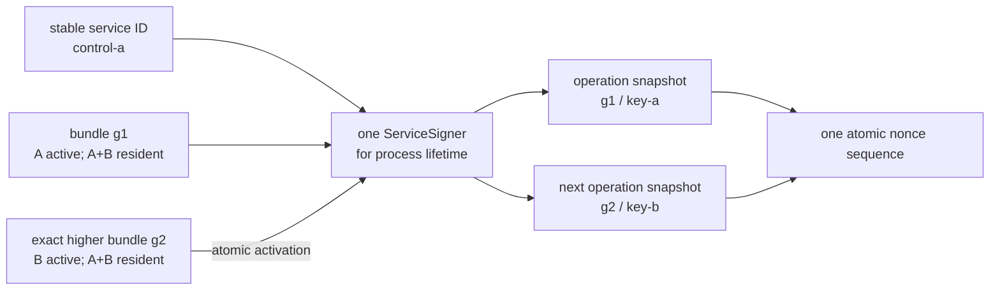
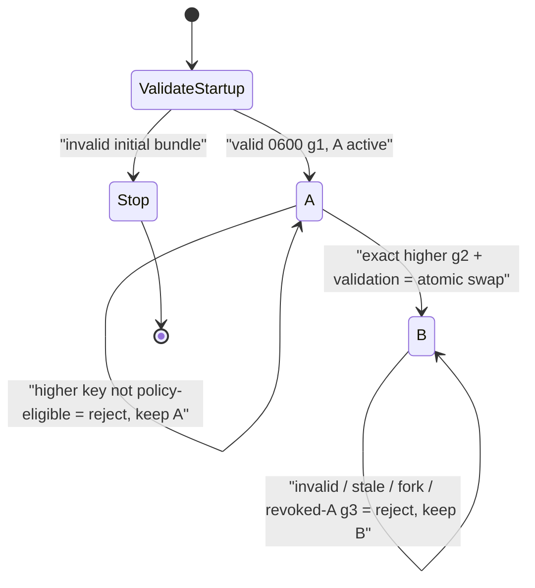
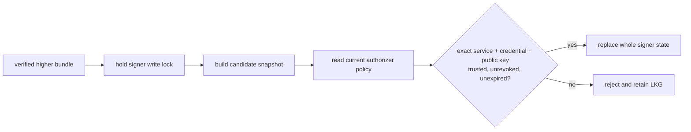

# Phase 34: Restart-free service-signing handoff

## What we are learning

This phase asks one narrow question:

> How can a running service change the private Ed25519 key it uses without
> mixing two keys inside one request, reusing a process nonce, or restarting?

Earlier InferLab releases already let receivers trust A and B together, move
senders to B through restarts, and finally revoke A. That is safe credential
rotation, but it does not teach the runtime handoff itself. v0.29 makes the
signer live state explicit.

The gateway and three controls each keep one stable `ServiceSigner`. A watcher
loads a complete generation-numbered local bundle. Only a valid, exact higher
generation becomes current. Every outbound operation takes one immutable
snapshot, so an operation is all-A or all-B. Every snapshot shares one nonce
counter for that running process.

## Mental model: four couriers change pens

Imagine four couriers: three work in the records office and one works at the
front desk. Each courier has a stable employee name, two approved pens, and a
sealed instruction card saying which pen is current.

- The employee name is the **service ID**.
- Pen A and pen B are **credentials**.
- The sealed card plus both pens is the **whole signer bundle**.
- The card's version is the **bundle generation**.
- A photocopy made when one parcel starts is the request's **signer snapshot**.
- The courier's never-resetting ticket dispenser is the process **nonce
  domain**.

When the card changes from generation 1/A to generation 2/B, new parcels use B.
A parcel that already copied A finishes with A. Both parcels still pull
different numbers from the same ticket dispenser.



“Restart-free” means the application process stays alive while its current
credential changes. It does not mean fleet-atomic, durable across restart, or
zero downtime under every unrelated failure.

## Vocabulary

| Term | Plain-language meaning | What it is not |
|---|---|---|
| Service ID | Stable name for a sender | A private key |
| Credential ID | Name of one key version | A new service process |
| Private seed | Secret Ed25519 signing material | Safe to log or retain in status |
| Bundle | Complete generation, selector, and private credential set | A selector-only file |
| Generation | Ordering inside one running signer's configuration | A durable global epoch |
| Snapshot | Immutable signer view for one operation | A mutable pointer to “current” |
| Nonce | Per-request replay value | Durable sequence across restarts |
| LKG | Last-known-good accepted signer state | Last file merely observed |
| Fork | Same generation with different semantic contents | A harmless rewrite |
| Eligibility | Exact candidate public key is trusted, unrevoked, and currently valid | Matching only service/credential text |
| Receipt | Signed proof of applying one trust-policy generation | Proof that a signer selector changed |
| Service-scoped convergence | Count one stable receiver slot per service | Verification that ignores credential IDs |

## Why a whole bundle is watched

A tempting design puts A and B in environment variables and watches a tiny file
containing only `key-b`. That creates an awkward question: what exact state did
generation 2 describe? The selector might change while the key source changes
separately, or the process might observe two unrelated updates in different
orders.

v0.29 watches one bounded JSON object containing:

- schema and cluster identity;
- stable service identity;
- monotonically ordered generation;
- active credential ID; and
- the complete bounded credential list and private seeds.

The file is at most 16 KiB, contains at most 16 credentials, and must be an
exact mode-`0600` regular file on Unix. The active credential must exist, IDs
and keys must be valid and unique, and cluster/service binding must match the
process configuration. The startup copy is validated before a listener opens.

The operator writes a complete replacement beside the current file, sets its
mode, then atomically renames it into place. A watcher may briefly lose an open
race while that happens; it retries a transient unavailable source. A stable
malformed candidate is deterministic and is not allowed to flood logs or
counters on every poll.

## Configuration modes

| Process | Watched bundle path | Optional poll interval |
|---|---|---|
| Control | `INFERLAB_SERVICE_SIGNING_BUNDLE_PATH` | `INFERLAB_SERVICE_SIGNING_BUNDLE_POLL_MS` |
| Gateway | `INFERLAB_GATEWAY_SERVICE_SIGNING_BUNDLE_PATH` | `INFERLAB_GATEWAY_SERVICE_SIGNING_BUNDLE_POLL_MS` |

The interval defaults to 100 ms and must be within 25–60,000 ms. Stable service
IDs and the gateway's control targets remain required. Legacy static
credential/private-key variables still work, but watched and static sources
cannot be combined. Security and identity variables that are non-Unicode do
not silently become “absent”; startup fails.

This compatibility split matters during a migration: an old deployment keeps
its static behavior until an operator deliberately selects watched mode.

## State machine: observation is not activation



There are three important distinctions:

1. **Observed:** the watcher noticed file metadata or source availability.
2. **Verified candidate:** the file decoded, passed bounds, and matched the
   expected cluster/service.
3. **Activated:** it was a higher generation, passed the process validator, and
   replaced the complete state under one write lock.

Only the third changes future request signing.

### Same generation has two meanings

If the current bundle is written again with exactly the same semantics, the
outcome is `Unchanged`. This is useful recovery after a transient or bad file:
semantically equivalent decoded state can be republished and clear the bounded
last reload error. JSON whitespace, object formatting, and credential ordering
do not create a fork by themselves.

If the generation number is reused with different decoded signer semantics, it
is a fork. The process cannot know which “generation 2” was intended, so it
rejects the candidate and keeps LKG.

## Per-operation snapshots prevent mixed signatures

Consider an outbound request whose body is being assembled while B activates.
If every signing step reread a mutable global identity, the request might name
credential A but sign with B. Instead, the operation snapshots once.

```mermaid
sequenceDiagram
    participant Req1 as "request already starting"
    participant Signer as "stable ServiceSigner"
    participant Watcher as "watcher"
    participant Req2 as "next request"
    participant Seq as "shared nonce counter"

    Req1->>Signer: snapshot once
    Signer-->>Req1: g1 / key-a
    Watcher->>Signer: validate + activate g2 / key-b
    Signer-->>Watcher: Activated
    Req2->>Signer: snapshot once
    Signer-->>Req2: g2 / key-b
    Req1->>Seq: allocate sequence suffix
    Seq-->>Req1: n
    Req2->>Seq: allocate sequence suffix
    Seq-->>Req2: m, where m > n
    Note over Req1,Req2: "immutable credentials; one process nonce domain"
```

The snapshot owns a reference to its selected credential. Removing or replacing
the signer's current state cannot invalidate a request already holding A.
Gateway control reads, Raft outbound RPCs, and trust receipts all take the
current snapshot at their operation boundary.

### Why the nonce counter belongs to the signer, not the key

Suppose A signs at millisecond `t` with counter 0. If activating B created a new
counter, B could sign in the same millisecond with counter 0 too. Even though
the key changed, the stable service is still one running sender and replay
reasoning becomes needlessly ambiguous.

The stable `ServiceSigner` owns one atomic counter, and snapshots share it.
Activation never resets the counter. A later allocation gets an increasing,
unique suffix `m > n`, not necessarily `n + 1`: candidate eligibility can
consume intervening suffixes. The complete nonce also starts with a wall-clock
value that can regress, so the full string is not monotonic. Process restart
does reset the counter. Receiver freshness/future-skew windows and replay caches
still constrain acceptance, but the release makes no durable cross-restart
nonce claim.

## Required-service-auth controls need exact-key policy eligibility

A valid local bundle is not necessarily authorized by the current receiver
policy. In required service-auth mode—including the proof topology—
`control-a/key-b` could carry unexpected public key bytes, be revoked, or appear
in an expired policy. Before such a control activates a higher bundle, it tests
the candidate snapshot against the exact current trust-policy key. Explicitly
disabled compatibility mode has no authorizer-policy gate; strict bundle
binding and generation checks still apply.

The order of locks is deliberate:



The global rule is **signer before authorizer**. Code holding the authorizer
must not call back into signer acquisition. Besides avoiding deadlock, the
single direction stops policy reload and signer activation from each approving
an inconsistent pair of states.

If the exact candidate is rejected only because the policy has not advanced,
the watcher may reconsider it when the trust-policy generation changes. It
does not need the file metadata to change again.

## Why the gateway has an operator precondition

The gateway signs requests for several control targets. It cannot acquire all
remote control authorizer locks or atomically ask the fleet “will B work?” as
part of a local file swap. Pretending otherwise would hide a distributed
transaction inside a file watcher.

Therefore the operator must make the gateway's B public key eligible on every
intended receiver before activating gateway B. The gateway still validates the
bundle structure, cluster/service binding, and generation locally. Successful
local activation means only that its signer changed; remote success must be
proved by authenticated control requests.

## Four senders, three receipt participants

The release proof uses:

- `control-a`, `control-b`, `control-c`; and
- `gateway-primary`.

All four are senders. Only the three controls apply service-trust policy and
post convergence receipts. The gateway is not a fourth expected receipt.

```mermaid
sequenceDiagram
    participant D as "distributor"
    participant F1 as "first follower"
    participant F2 as "second follower"
    participant L as "leader"
    participant G as "gateway"

    D-->>F1: "g1 trusts A+B"
    D-->>F2: "g1 trusts A+B"
    D-->>L: "g1 trusts A+B"
    Note over F1,L: "g1 receipts: exactly the three controls on A"
    F1->>F1: "bundle generation 1→2; B active"
    F2->>F2: "bundle generation 1→2; B active"
    L->>L: "bundle generation 1→2; B active"
    G->>G: "bundle generation 1→2; B active"
    Note over F1,G: "same PIDs; mixed A/B overlap is allowed; no handoff receipt"
    D-->>F1: "policy g2 revokes A"
    D-->>F2: "policy g2 revokes A"
    D-->>L: "policy g2 revokes A"
    F1->>D: "g2 receipt signed by B"
    F2->>D: "g2 receipt signed by B"
    L->>D: "g2 receipt signed by B"
    Note over D,L: "3 service IDs converged; each receipt still names key-b"
    G->>L: "authenticated control read signed by B"
```

Followers switch before the leader so the current majority and serving route
stay available throughout the demonstration. Gateway switches last because
its B readiness is operator-coordinated across the controls.

## Service-based convergence does not weaken receipts

The receipt v1 payload still says which service and which credential applied
which signed trust policy. Its signature is verified using that exact public
key. A forged B receipt signed by A remains invalid.

What changes is the distributor's expected receiver *slot*. In service-ID mode,
`control-a/key-a` and `control-a/key-b` are two eligible ways for the one
`control-a` receiver to acknowledge a policy. The published policy must retain
at least one trusted, unrevoked credential for every expected service. A valid
receipt is verified as credential-bound and then counted under the stable
service ID.

One service has one slot per published policy generation. Its first valid
receipt fills that slot. A later valid receipt from another credential for the
same service and generation is a duplicate and preserves the receipt already
stored. Publishing a higher policy generation clears every old slot; fresh B
receipts then fill the three g2 service slots.

This solves a lifecycle mismatch:

| Question | Credential-qualified mode | Service-ID mode |
|---|---|---|
| Expected receiver slot | `control-a/key-a` | `control-a` |
| Receipt signature verification | Exact named credential | Exact named credential |
| Does A→B change receiver membership? | Yes | No |
| Can revoked A acknowledge g2? | No | No |
| Can valid B acknowledge g2? | Only if configured as a new slot | Yes, for the same service slot |

The signer handoff itself does not apply a policy, so it produces no receipt.
Only applying g2 produces the next three normal receipts, now signed by B.

## What g2 proves and what the rejected g3 bundle proves

Trust policy g1 contains A and B for all four service identities. This overlap
makes a sequential handoff possible.

After all senders use B, trust policy g2 keeps the wire keys but explicitly
revokes every `*/key-a`. The proof then checks two old-A requests:

- an old-A gateway control read; and
- an old-A high-term peer vote.

Both must be rejected before protected state mutation. A later signer bundle
generation 3 that tries to select revoked A must also be rejected on a control,
leaving B as LKG. These are separate claims: receivers reject old-A traffic,
and the local watcher refuses to reactivate old A.

## Failure matrix

| What goes wrong | What you should imagine | Required behavior |
|---|---|---|
| Startup path is missing | Courier has no sealed card | Exit before listener |
| File is group/world readable | Anyone can copy the pens | Exit before listener |
| File is too large or malformed | Card is not bounded/parseable | Exit or live reject; never partial apply |
| Cluster/service differs | Card belongs to another office/courier | Reject |
| Generation goes backward | Old instruction card reappears | Keep LKG |
| Same generation changes | Two incompatible cards claim one version | Reject fork; keep LKG |
| Higher control key is not exact-policy eligible in required mode | Pen name matches but ink signature does not | Reject; retry after policy changes |
| Higher control key in explicitly disabled compatibility mode | No receiver policy is configured | Skip the authorizer-policy gate; keep strict bundle/generation checks |
| File briefly disappears during rename | Clerk sees the replacement gap | Retry, bounded report, keep LKG |
| Known-good current bytes return | Correct card is republished | `Unchanged`; clear prior error |
| Watcher panics or exits | Nobody is checking cards anymore | Supervised process failure |
| Request began on A during activation | Parcel already copied A | Finish entirely with A |
| Request begins after activation | New parcel copies B | Use B entirely |
| Revoked-A generation 3 appears | Operator tries to reactivate banned pen | Reject; keep B |
| Process restarts with older valid file | New courier shift forgets in-memory floor | Accepted unless external custody prevents it; no durable anti-rollback claim |

## Where the responsibility lives

| Area | Ownership |
|---|---|
| Bundle schema, strict load, snapshots, nonce domain, atomic activation/status | `service-auth/src/signing_bundle.rs` |
| Credential-bound receipt v1 signing/verification | `service-auth/src/trust_receipt.rs` |
| Control startup, watcher, supervision, exact-key validator | `control-plane/src/main.rs` |
| Control authorizer eligibility and lock-order contract | `control-plane/src/service_authentication.rs` |
| Raft outbound snapshot use | `control-plane/src/raft.rs` |
| Dynamic trust receipt snapshot use | `control-plane/src/service_trust.rs` |
| Gateway startup, watcher, supervision, bounded status | `gateway/src/main.rs` and `gateway/src/lib.rs` |
| Gateway per-control-operation snapshot | `gateway/src/service_client.rs` |
| Service-ID expected receivers, duplicate preservation, and generation-scoped slots | `trust-distributor/src/lib.rs` |
| Exact-process proof/checker/chart | `scripts/proof-v0.29.sh`, `benchmarks/check_signer_handoff.py`, `benchmarks/render_signer_handoff_svg.py`, and the [retained result](../results/v0.29/README.md) |

## Experiments reproduced by the retained proof

### 1. Happy-path A→B

Start all four services on generation 1/A, ensure g1 trusts A+B, then atomically
replace bundles in follower→follower→leader→gateway order. Observe unchanged
process identities, unique increasing shared sequence suffixes, and new
operations signed by B. Do not require adjacent suffixes or monotonic complete
nonce strings.

### 2. In-flight snapshot

Pause one operation after it captures A, activate B, then release it and start a
second operation. Verify the first is wholly A, the second wholly B, and their
nonces do not collide.

### 3. Invalid LKG retention

Try malformed bytes, unsafe permissions, lower generation, same-generation
semantic fork, wrong service, and wrong key bytes. The active
generation/credential must not move. Reinstall a semantically equivalent
current bundle—even with different JSON formatting or credential order—and
verify the bounded last error clears without a fake activation count.

### 4. Policy race

In required service-auth mode, place a structurally valid higher control bundle
selecting B before B is eligible. It must stay rejected. Advance the trust
policy without touching the bundle again; the watcher can then retry and
activate the same candidate. Contrast this with explicitly disabled
compatibility mode, which has no authorizer-policy gate.

### 5. Receipt truth

Switch only the local signer and verify no new receipt appears. Then apply g2
and verify exactly the three controls post normal v1 receipts naming B, while
the distributor reports the three stable control service slots converged.

### 6. Revocation fence

After g2 revokes A, send an old-A gateway read and old-A high-term peer vote,
then install a higher bundle selecting A. Remote requests and local activation
must all fail before protected mutation; B must remain LKG.

## Interview explanation

A concise explanation is:

> “v0.21 proved overlap-safe service-key rotation, but senders still restarted.
> v0.29 gives each gateway/control process one stable `ServiceSigner` watching
> a complete mode-0600 bundle. Higher generations swap atomically; each
> operation snapshots one credential, and all snapshots share one process
> nonce counter. In required service-auth mode, controls activate only an exact
> key eligible under current trust, using signer-before-authorizer lock order;
> explicitly disabled compatibility mode has no policy gate. The distributor counts
> convergence by stable service ID, but receipt v1 still verifies the exact
> credential. We intentionally add no handoff receipt and make gateway fleet
> readiness an operator precondition.”

If asked why this is not “zero-downtime key rotation,” say that each process
changes without restart and the proof checks process/quorum continuity. The
fleet changes sequentially, private A+B remain in memory, and there is no
durable signer floor across restart, so the broader phrase would overclaim.

## What the retained proof shows

The [v0.29 evidence](../results/v0.29/README.md) retains startup fail-closed
cases, live invalid/fork/rollback LKG cases, same-millisecond nonce continuity,
exact process identities across four sequential handoffs, three A receipts
before g2, no signer-only receipt, three B receipts after g2, A revocation
fences, rejected revoked-A reactivation, route revision 3, and real CPU
JSON/SSE through `[DONE]` plus EOF.

It passes **28/28 deterministic assertions** in **28 total files / 27 hashed
non-manifest files**. Nine startup sources fail before an observed listener;
eleven live rejections move `rejected_reloads` exactly `0 → 11`. Four signing
senders change A→B while all six proof processes retain their PID, parent,
start token, command, liveness, and non-zombie identity. Eleven exact
single-test regressions run once each. After B and route revision 3, real CPU
JSON completes in **831.582 ms**; SSE completes in **833.124 ms**, emitting
seven nonempty content pieces over **721.919 ms**, one `[DONE]`, and EOF.
Checker JSON and the SVG replay byte-for-byte. The manifest SHA-256 is
`a21b3a8ddf5bd0f1f7e8a64fcfeb8485cd78c7d66d6247b6bbfa828bd94cc5a2`.


## Explicit limitations

- Bundle custody is a local filesystem/operator responsibility, not a secret
  manager.
- A and B private keys remain in current signer state while the accepted whole
  bundle contains them; selecting B does not wipe A. If a later accepted bundle
  omits A, outstanding `Arc`-backed snapshots can retain it until they drop;
  immediate erasure and memory zeroization are not claimed.
- Restart resets the nonce counter. Existing freshness and replay windows still
  constrain requests, but the counter is not durable.
- The accepted bundle-generation floor is in memory. Restart does not prevent
  loading an older otherwise valid bundle.
- Atomic means one sender swaps its state as a unit, not that four processes
  switch simultaneously.
- The gateway relies on operator-provisioned receiver readiness.
- Receipt convergence is service-scoped, but each receipt remains
  credential-bound; there is no handoff receipt.
- v0.29 does not add fleet-wide TLS, HSM/KMS custody, HA, automated renewal,
  same-CA leaf rotation, CA migration, or formal verification.

## Review questions

1. Why is a selector-only watcher weaker than a whole-bundle watcher?
2. What happens to a request that snapshots A just before B activates?
3. Why must the nonce domain belong to the stable signer instead of each key?
4. How does exact-key eligibility differ from matching service and credential
   IDs?
5. Why is signer-before-authorizer lock order a correctness property?
6. Why is gateway readiness an operator precondition?
7. How can convergence be service-scoped while receipts remain
   credential-bound?
8. Why is there no receipt for signer activation alone?
9. What does g2 revoking A prove that bundle generation 2 selecting B does not?
10. Which guarantees disappear when a process restarts?
