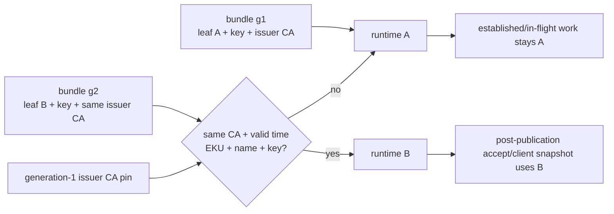

# Phase 35: Restart-free same-CA mTLS leaf renewal

**Status:** Implemented and proved in v0.30 (23/23 retained assertions).

## What we are learning

This phase asks one narrow question:

> How can the trust distributor and its clients replace their TLS leaf
> identities without restarting, changing CA trust, or pretending existing
> connections were re-handshaken?

v0.24 established TLS 1.3 mutual authentication for the trust-distribution
channel. v0.29 then established a whole-object, last-known-good handoff pattern
for Ed25519 service signers. v0.30 applies that lifecycle discipline to X.509
leaf identities while preserving the important difference between a server
handshake configuration and a client connection pool.

## Mental model: badges at a guarded archive

Imagine an archive with one guarded entrance and several couriers:

- the archive's wall plaque is the **server leaf**;
- each courier badge is a **client leaf**;
- the badge office seal is the **issuer CA**;
- the guard's trusted seal list is the **verification CA**;
- the sealed badge packet is an **identity bundle**; and
- the packet number is the **bundle generation**.

The archive can hang plaque B for people who arrive next. Someone already
inside saw plaque A when entering; replacing the plaque does not replay their
entrance check. Likewise, a courier already on a trip may finish with badge A.
A new courier trip after the handoff takes badge B and a fresh vehicle rather
than joining an old vehicle pool.



## The problem without renewal

A leaf certificate has a finite validity window. If every process reads its
certificate only at startup, ordinary renewal becomes a process-replacement
event. For InferLab that means replacing the distributor or control for a
channel credential even though its Raft state, caches, queues, and application
keys are still valid.

Blindly rereading PEM files is not enough:

- separate certificate/key files can be observed between writes;
- a valid certificate can be for the wrong hostname or TLS purpose;
- a candidate can silently move to a different CA;
- an old generation can roll a process backward;
- a client can keep using an old pooled TLS connection after its files change;
- and status can claim renewal merely because new bytes appeared on disk.

The design needs a precise transition from one complete usable runtime identity
to another.

## Vocabulary

| Term | Plain-language meaning | What it is not |
|---|---|---|
| Leaf | One end-entity certificate and matching private key | A CA |
| Chain | Leaf followed by any intermediate certificates | An unordered bag |
| Issuer CA | Root set that validates this local leaf | Permission to publish policy |
| Verification CA | Root set used to authenticate the remote peer | Automatically rotated here |
| Purpose | Server-auth or client-auth certificate use | An InferLab endpoint role |
| SAN | DNS name carried by a server certificate | A service credential ID |
| Bundle generation | Ordering for one running identity | Durable global PKI epoch |
| LKG | Last successfully published runtime identity | Last file observed |
| Pool | Reusable outbound connections owned by one HTTP client | Safe to retain across identity change |

## Why one whole bundle

Certificate, private key, issuer CA, identity metadata, and generation describe
one candidate. Watching them separately creates combinations that the operator
never intended. The complete JSON bundle is written beside the live path,
given mode `0600`, and atomically renamed into place.

The loader rejects symlinks and verifies that the file inspected before open is
the same file read. It bounds the entire JSON and each PEM section. This is not
a secrets manager—the private key still resides on local disk and in process
memory—but it gives the local handoff one coherent source.

The issuer CA is included so the initial leaf can be validated before service
and then pinned. A candidate carrying a different CA cannot redefine its own
trust boundary merely by being internally consistent. Each embedded issuer
must also be an actual CA: Basic Constraints says `CA=true`, and Key Usage must
allow `keyCertSign` when the extension exists.

## The four validation questions

### 1. Is this the intended object?

Schema, cluster, stable identity ID, purpose, and server name must match the
process configuration exactly. A perfectly valid `client` certificate is not
a valid distributor `server` candidate.

### 2. Is the X.509 identity usable now?

The chain must parse, the private key must match, and the leaf must validate at
the current time under its embedded issuer CA. Server leaves require
server-auth usage and the configured DNS SAN. Client leaves require
client-auth usage. An embedded issuer that is an ordinary leaf—or explicitly
cannot sign certificates—is invalid even if its PEM parses.

### 3. Is it an allowed transition?

Generation must be positive. A lower generation is rollback. Equal generation
with equal decoded semantics is unchanged; equal generation with different
certificate, purpose, name, or CA semantics is a fork. An equivalently encoded
private key remains unchanged because each candidate first proves that its key
matches the same leaf. A higher generation must retain the original issuer-CA
set.

### 4. Can the complete runtime replacement be built?

The distributor builds a full TLS 1.3 mTLS server configuration. A control
builds a full HTTPS client including its identity, server roots, redirect
policy, and a new empty pool. Only a successfully built object can be
published.

## Why server and client handoffs differ

The server adapter captures a configuration when it accepts a TCP connection,
before the TLS handshake future completes. Swapping the configuration pointer
does not alter a pre-accepted handshake future or a connection whose handshake
already completed. Those A-capturing connections can remain safe for ordinary
overlap renewal because A and B are both CA-valid during the handoff.

The control side has an extra trap: its HTTP client owns a connection pool. If
code changed only the certificate source but reused that client, a later fetch
could reuse an A-authenticated connection. The control therefore swaps the
whole client. Each operation clones the current client once; the clone keeps
its old pool alive only for that operation, while operations starting after
publication can see only the new client and pool.

```mermaid
sequenceDiagram
    participant F1 as "fetch already started"
    participant C as "reloadable client slot"
    participant W as "bundle watcher"
    participant F2 as "next receipt/fetch"

    F1->>C: "snapshot client A"
    W->>W: "validate and build client B"
    W->>C: "publish client B"
    F1-->>F1: "finish entirely through client A"
    F2->>C: "snapshot client B"
    F2-->>F2: "new pool; present leaf B"
```

## Invariants

1. The configured verification CAs never change during a v0.30 handoff.
2. Generation 1 pins the local leaf issuer CA for the process lifetime.
3. No candidate is published before binding, key, chain, time, EKU, SAN, CA,
   ordering, and runtime-construction checks pass.
4. A failed observation changes neither the current server config nor the
   current control client.
5. Same-generation formatting and equivalent matching-key encodings do not
   count as activation; a changed certificate, purpose, name, or CA at the same
   generation is a fork.
6. A new control operation snapshots one client and uses it through completion.
7. A control activation creates a new pool; new work cannot fall back to the
   old pool.
8. Existing server connections and in-flight control operations may retain A;
   no status or proof calls that a failure.
9. Watcher counters and last error describe distinct processed observations,
   not poll frequency.
10. Status may expose the active leaf's SHA-256 DER fingerprint for A/B
    observation, but not its subject, serial, PEM, CA, key, or source path.
11. Watcher failure is process-supervised rather than silently freezing the
    credential.
12. X.509 channel authentication never replaces root-signed policy or
    service-signed receipt verification.

## State machine in plain language

At startup, only a valid generation-1 bundle opens service. The process records
its decoded issuer CA and runtime identity as LKG.

While serving:

- the same valid object is a no-op;
- unreadable sources are retried;
- an unchanged not-yet-valid leaf is re-evaluated as time advances without
  repeating its counter/report for the same bytes;
- stable invalid bytes are reported once;
- rollback and fork candidates are rejected;
- a higher leaf under another CA is rejected;
- a higher valid same-CA leaf builds a complete replacement; and
- publication changes TLS connections accepted afterward or future client
  snapshots; pre-accepted handshake futures may retain A.

Restart creates a new in-memory generation floor and CA pin from the startup
bundle. Durable TLS anti-rollback is not claimed.

## Failure experiment

A useful design must survive more than a happy-path A→B rename. The v0.30
experiment tries to disprove it with:

- malformed JSON and PEM;
- a bundle larger than its bound;
- unsafe permissions and a symlink;
- wrong cluster, identity, purpose, and server name;
- a mismatched private key;
- expired and not-yet-valid certificates;
- wrong server/client EKU;
- wrong server SAN;
- a valid leaf under another CA;
- generation rollback and same-generation fork; and
- a valid higher bundle after all preceding failures.

Every live rejection must leave A or B usable as appropriate, advance only a
bounded diagnostic counter, and preserve process identity. Recovery must clear
the last error without resetting the historical rejection count.

The handoff experiment also holds one server connection across rotation. If
that connection suddenly claims B, the proof model is wrong; TLS did not
re-handshake. A separately opened connection must see B. Controls then rotate
one at a time and must continue fetching policy and posting receipts with new
client pools.

Publisher A and publisher B are two independently constructed, fresh client
connections used to publish the before/after policies. The publisher is not a
persistent watched process, so this experiment makes no publisher-process
identity, continuity, or handoff claim.

## Where the implemented responsibility lives

| Area | Ownership |
|---|---|
| Whole-bundle source safety, strict decoding, X.509/key/CA validation, semantic comparison, activation state, LKG, counters, and bounded errors | `transport-security/src/identity_bundle.rs` |
| mTLS server/client runtime construction | `transport-security/src/lib.rs` |
| Distributor configuration, startup load, live server-config reload, status, and watcher supervision | `trust-distributor/src/main.rs` and `trust-distributor/src/lib.rs` |
| Control configuration, whole-client snapshots, fresh-pool rebuild/swap, fetch/receipt observations, bounded status, and watcher supervision | `control-plane/src/service_trust.rs`, `control-plane/src/service_authentication.rs`, `control-plane/src/lib.rs`, and `control-plane/src/main.rs` |
| Exact-process evidence | `scripts/proof-v0.30.sh`, `benchmarks/check_tls_identity_handoff.py`, `benchmarks/render_tls_identity_handoff_svg.py`, and the [retained v0.30 result](../results/v0.30/README.md) |

## Retained result

The retained proof passes 23/23 assertions over 24 total / 23 manifest-hashed
files. It retains 15 pre-listener startup rejections, 19 live server and 12
live client rejections, 12 exact production tests, six unchanged long-running
processes, and three verified receipts at each policy generation. Real CPU
JSON completes in 819.971 ms; SSE completes in 825.317 ms with ten events,
seven content pieces, and an 817.285 ms first-to-last event-offset span through
`[DONE]` plus EOF. Checker and SVG replay are byte-identical. The 3,710-byte
manifest SHA-256 is
`697562f9f10016bae043fa763ff752e16b89013e998c89192e4521e2c1c52506`.

## What the result can teach us

The passing experiment demonstrates three reusable lessons:

- credential rotation is a state-machine problem, not a file-copy problem;
- “new work” needs an explicit snapshot boundary, especially when pools cache
  authenticated connections; and
- truthful overlap semantics are safer than claiming instantaneous global
  replacement.

It does not prove automated issuance, emergency revocation, or CA migration.
Those require distinct authority and failure models and should remain separate
milestones.

## Alternatives and why they lose

| Alternative | Why it loses for this phase |
|---|---|
| Restart each process | Couples leaf lifetime to unrelated runtime availability/state |
| Watch cert and key separately | Allows mixed observations and partial updates |
| Trust the CA named by every candidate | Lets a candidate redefine the trust boundary |
| Keep the old client pool | Makes “new operation uses B” unverifiable |
| Kill all A connections | Adds emergency-cancellation behavior to ordinary renewal |
| Rotate CA and leaf together | Combines two major uncertainties and obscures failures |

## Boundaries to remember

- Private keys remain local files and process memory.
- Old configurations and client clones may retain old key material until their
  references drop; immediate erasure is not claimed.
- Pre-accepted handshake futures and established TLS connections retain the
  config captured at accept and the identity negotiated at handshake.
- The generation floor and issuer-CA pin are process-local and reset on restart.
- Renewal is sequential, not fleet-atomic.
- Certificate expiry can still cause failure if operators do not activate a
  valid successor in time.
- CRL/OCSP, ACME, HSM/KMS, CA migration, global mTLS, HA, and emergency
  cancellation remain future work.
