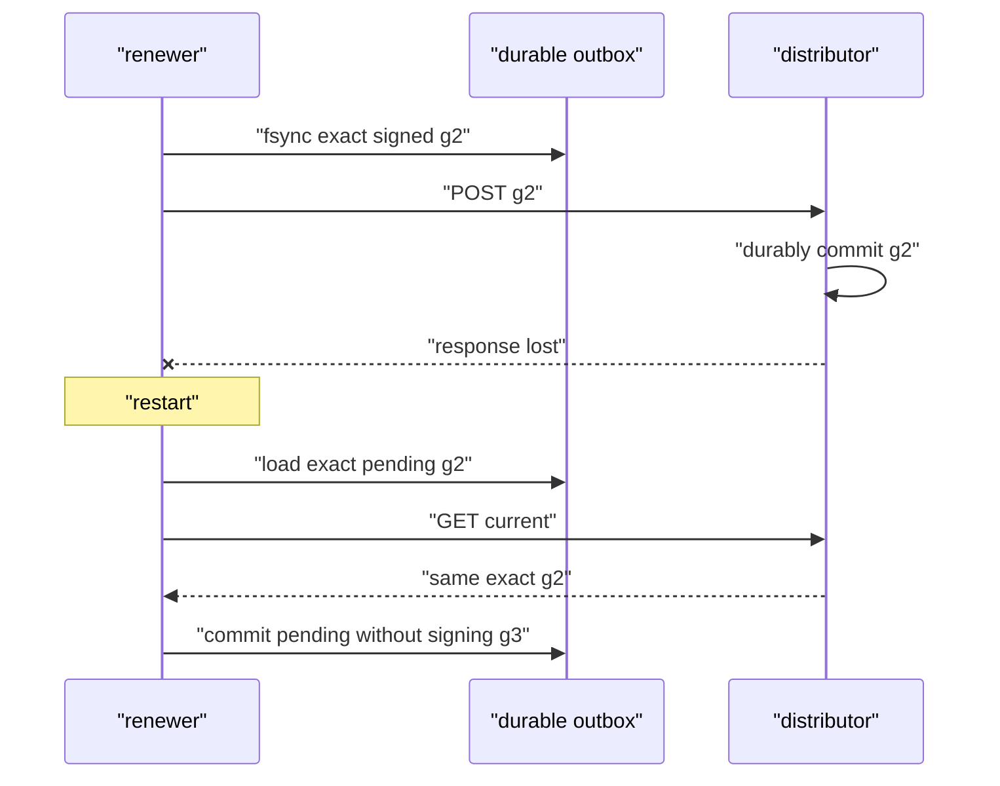

# Phase 36: Deadline-safe automated signed service-trust renewal

## The question

RFC 0032 gave every signed trust policy an exclusive deadline. That prevents an
old policy from being authoritative forever, but it also creates an operational
obligation: **who creates the next signed generation before time runs out?**

v0.31 answers with one narrow component, the policy renewer.

## Three jobs that must remain separate

```text
policy renewer       chooses time/generation and signs one fixed meaning
trust distributor   verifies, durably stores, serves, and records receipts
control receiver    independently verifies, persists, activates, and enforces expiry
```

The separation matters. If the distributor had the private root key, a storage
service compromise could change who is trusted. If controls generated their
own policy, receivers would also become authorities. The renewer alone has
online signing power, and v0.31 restricts that power to refreshing time around
one immutable semantic template.

## Renewal is not policy change

Imagine a building access list. Reprinting the same list with tomorrow's expiry
is renewal. Adding a new person or removing a revoked badge changes policy.

The automatic loop may change generation, issue time, expiry, and signature.
Everything else contributes to a canonical template fingerprint. A mismatch
stops the loop instead of silently blessing new meaning.

## Why an outbox is required

An HTTP timeout is ambiguous. The distributor may have committed the POST and
lost the response. If the renewer immediately signs a different generation or
different timestamps, it can create a fork or skip durable intent.

The safe sequence is:

1. construct and sign one complete higher-generation snapshot;
2. persist those exact bytes in a pending outbox;
3. POST them;
4. if the outcome is uncertain, GET distributor state;
5. commit locally when bytes match, or retry the same bytes when it is behind.



## Scheduling against an exclusive edge

For a policy issued at `I`, expiring at `E`, and a configured margin `M`:

```text
renewal_deadline = E - M
usable            = effective_now < E
effective_now     = max(previous_effective_now, wall_now)
```

The margin must cover bounded request and retry time. A backward wall-clock
step cannot postpone work because effective time never decreases within the
process. A forward jump can make renewal immediately due or late.

There is no grace after `E`. During a distributor outage, controls keep using
the current policy only until its signed deadline. Recovery is possible because
fetching and activating a valid higher generation remains allowed after expiry.
The renewer retries one durable pending snapshot only during that snapshot's
own validity window. If even the pending snapshot expires, it fails closed
rather than publishing expired authority or guessing whether an ambiguous
generation may be skipped.

## What status can honestly say

The renewer can report its committed and pending generation, signed expiry,
renewal deadline, counters, finite outcome, and a template fingerprint. The
distributor can report current generation and receipt convergence. A control
can report its own active generation and validity.

None of those observations alone proves fleet-wide atomic renewal. Receipts can
be delayed or lost, clocks can differ within configured bounds, and already
admitted work keeps its captured state.

## Failure predictions

| Break | Expected result |
|---|---|
| response disappears after distributor commit | restart reconciles identical pending bytes |
| template adds one credential | deterministic rejection; no automatic publish |
| state is mode 0644 or a symlink | startup fails before service |
| wall clock moves backward | due time does not move backward in process |
| distributor stays down past expiry | protected requests reject; no hidden extension |
| distributor returns while pending is still valid | the exact higher signed generation restores service |
| pending candidate also expires | renewer fails closed for operator reconciliation |
| manual compatible higher generation appears | renewer adopts its floor and continues |
| same generation has different valid bytes | fork; fail closed |

A semantic manual rollout is deliberately more explicit. Stop the renewer,
independently verify that the distributor holds the intended strictly higher
snapshot, archive the old durable state and lock, install the matching
mode-`0600` template, and restart with an empty state path. Replacing only the
template is rejected because the stored authority fingerprint still describes
the previous meaning.

## Implementation map

| Responsibility | Expected location |
|---|---|
| template decoding, fingerprint and scheduler math | `service-auth` renewal module |
| durable state, persistent process, mTLS HTTP, status and supervision | `trust-renewer` crate/binary |
| distributor verification and receipts | existing `trust-distributor` code |
| receiver validity and activation | existing `control-plane` code |
| exact evidence | `scripts/proof-v0.31.sh` plus benchmark checker/renderer |

## Limits to remember

The root seed remains a local online secret. There is one renewer and one
distributor, no leader election or quorum signing. This phase does not automate
certificate issuance, root rotation, semantic policy rollouts, revocation,
emergency cancellation, secure time, HA, HSM/KMS custody, or global mTLS.
It also does not keep a burned-generation ledger, so an outage that outlives a
pending candidate requires explicit operator recovery.

Those are separate failure domains and deserve separate milestones.
