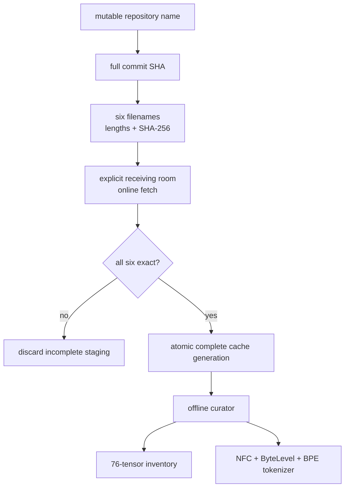
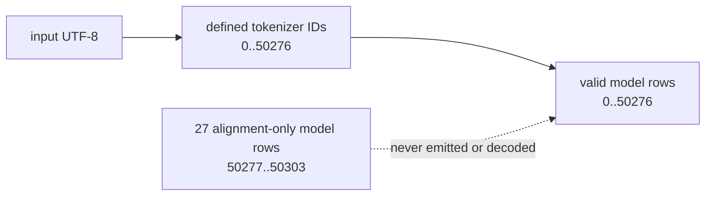
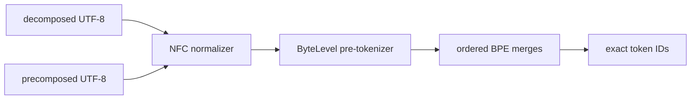

# Phase 37: Pinned public checkpoint and production tokenizer

**Status:** Planned | **Milestone:** v0.32 | **Date:** 2026-08-14

This phase is the bridge between InferLab's generated 16/22-token teaching
checkpoints and one real public model artifact. It deliberately stops before
model execution.

## The new behavior in one sentence

An explicit support script will fetch one immutable Pythia-14M revision and
publish only a complete hash-verified local cache. A separate
`inferlab-model-inspect` Rust binary will then inspect its exact safetensors
inventory and reproduce its maintained production tokenizer entirely offline.

There is no new model response in this phase. “The tokenizer matches” and “the
model generates correct logits” are different claims. v0.32 proves only the
first claim plus checkpoint identity and shape.

## 1. What problem appears without this feature?

The tiny InferLab checkpoint is excellent for learning tensor mechanics because
every byte and expected transition is generated in the repository. That same
strength hides several problems that appear with public artifacts:

- a repository name or `main` branch is not immutable identity;
- a partial or silently changed download can still look like a model file;
- “the shapes seem plausible” does not prove that all expected tensors exist;
- model row count and tokenizer vocabulary size need not be equal;
- production tokenizers normalize Unicode, apply ordered merges, and recognize
  special/added tokens rather than split ASCII words; and
- a tokenizer can be correct even though no forward pass exists yet.

RFC 0012 intentionally deferred these problems. Its tiny tokenizer maps most
unknown language to `<unk>`, uses fixed special IDs, and stores one fixed-order
layer. Phase 37 replaces none of that serving behavior. It builds the separate
artifact and tokenizer foundation needed before a public forward pass can be
reasoned about honestly.

## 2. Mental model: a sealed museum crate

Imagine borrowing a historical instrument from another museum.

The label “Pythia-14M” is not enough. You need a shipping manifest naming the
exact edition, every box, every weight, and every seal. The receiving room may
download the boxes, but the curator who studies the instrument works offline
and opens only the already verified set.



The fetcher is the loading dock. The verifier is the curator. Combining them
would let “I cannot find the expected local bytes” silently become “I fetched
some current bytes from the internet,” which destroys reproducibility.

## The exact borrowed object

Phase 37 pins:

```text
repository  EleutherAI/pythia-14m
revision    cf967c0a9a04383db6f7b1108d86b2962634b4ac
family      GPT-NeoX
card SPDX   Apache-2.0
```

Six upstream files form one 30,274,495-byte set:

| File | Bytes | SHA-256 |
|---|---:|---|
| `README.md` | 10,560 | `d1f2cf1d5181daedeaa70208ddd5cc5251867bde9acf6db7bb45a2265e25e163` |
| `config.json` | 698 | `f97f966a66c444890ed461fff2a51eefb15d74303df05b948124719f199b0b17` |
| `model.safetensors` | 28,143,920 | `116a02532db461f91386a5b20f942ff2c8d4de7341e21b55caafc3d7b25f49a1` |
| `special_tokens_map.json` | 441 | `10b8c8852c1e1f70b54d9aff61728408c28971c0e97a6c5a7b2debbd1d3e9c0c` |
| `tokenizer.json` | 2,114,042 | `870f4e2baa6b683221fa52004d5d6f40ab8c9d31961617304b78c910c2c3caf2` |
| `tokenizer_config.json` | 4,834 | `eee017c5bd133137f45907bd0a6e781e2ccd1a533734b7ed2a2f2f4446659809` |

The model card will be part of the locked evidence because it contains the
reviewed upstream identity, intended research use, change note, and license declaration.
That is provenance, not a promise that every possible use has been legally or
safety reviewed.

## Why safetensors helps but does not finish verification

Safetensors separates a JSON description from raw tensor bytes and does not
need Python pickle execution. That removes one dangerous ambiguity, but a parser
still must reject bad dimensions, duplicate names, offsets outside the file,
overlaps, gaps, unknown dtypes, and a valid-looking but wrong inventory.

For this exact artifact:

```text
file bytes       28,143,920
header length         8,488
prefix length             8
tensor bytes      28,135,424
dtype                    F16
parameters        14,067,712
tensors                   76
```

The arithmetic cross-check matters:

```text
14,067,712 F16 values × 2 bytes = 28,135,424 tensor bytes
8-byte prefix + 8,488-byte header + tensor bytes = 28,143,920 file bytes
```

There are two `50304 × 128` matrices: input embeddings and the untied output
head. Six layers each contain twelve exact attention, normalization, and MLP
tensors. Final normalization contributes two more tensors. The inventory is:

```text
2 embedding/head tensors
+ 6 layers × 12 tensors
+ 2 final-normalization tensors
= 76 tensors
```

The verifier will check exact names and shapes, not merely the total.

## 3. What invariants must always remain true?

### Artifact invariants

1. The full 40-character commit identifies the upstream revision.
2. Exactly six filenames, sizes, and SHA-256 digests define the cache generation.
3. Online fetch stages every file before atomic publication.
4. Atomic directory rename is the publication commit point. Failure before it
   leaves no final generation; timeout, parent synchronization, or final
   verification failure after it reports an indeterminate confirmation result,
   leaves the complete published generation untouched, and requires explicit
   warm-cache or offline reconciliation.
5. A partial generation never looks complete or replaces a valid one.
6. Offline verification never downloads, searches an ambient home cache, or
   accepts a mutable revision.
7. Parsing consumes the same opened bytes that were hashed.
8. Reports omit absolute host/cache paths and nondeterministic timestamps.

### Tensor invariants

1. Exactly 76 tensors exist and every tensor is F16.
2. Layer indices are exactly zero through five.
3. Every tensor has the RFC 0037 name and shape.
4. Offsets are in range, non-overlapping, complete, and leave no unexplained
   tensor-data suffix.
5. The inventory sums to exactly 14,067,712 parameters.
6. `config.json`, the safetensors inventory, and file arithmetic agree.

### Tokenizer invariants

1. The verified pipeline is NFC normalization followed by the configured
   ByteLevel and BPE behavior, including special and added tokens.
2. The maintained implementation and pinned upstream reference return the same
   IDs and decoded strings for every proof input.
3. Text is length-aware valid UTF-8; embedded U+0000 is data, not termination.
4. No lossy replacement or silent fixed-buffer truncation is permitted.
5. Tokenizer IDs and model rows are reported as different domains.

## The 27 rows that are not tokens

This checkpoint has 50,304 embedding and output rows, while its configured
tokenizer defines and can decode 50,277 contiguous IDs. This does not claim
that every defined ID is reachable from ordinary encoder input, and
`tokenizer_config.json` explicitly has `pad_token=null`:



The difference is exactly 27. Those final rows exist to align the model matrix;
they are not unnamed text. Treating `vocab_size=50304` as the tokenizer size
would let a future sampler produce IDs that no decoder can interpret.

Phase 37 therefore makes the boundary executable now:

- encode may emit only `0..=50276`;
- decode rejects `50277..=50303`; and
- inspection reports both counts and the exact alignment-only interval.

No logits or sampler exist in this phase, but proving the domain now prevents a
future serving implementation from inheriting an ambiguous vocabulary.

## NFC: equality of text meaning is not equality of input bytes

Unicode often provides two spellings for the same displayed text. For example,
an accented character may be one precomposed code point or a base character
followed by a combining mark. NFC chooses a canonical composed form before the
rest of this tokenizer pipeline.



Consequences:

- decomposed and precomposed input may produce the same IDs;
- decoding may return the NFC spelling, not the original decomposed bytes;
- this is declared behavior, not silent corruption; and
- the proof compares InferLab with the pinned upstream result rather than
  asserting a false universal byte-round-trip law.

For NFC-stable ordinary strings, exact round-trip remains expected when the
upstream tokenizer provides it. Special-token matching and configured sequences
of repeated spaces are tested separately because they are pipeline behavior,
not ordinary BPE coincidence.

Literal-special handling is explicit: `recognize_configured` maps literal
`<|endoftext|>` to ID 0, while `encode_as_text` enables the maintained
library's text treatment and must not accidentally produce EOS.
`add_special_tokens` remains a separate explicit post-processor choice.
Decode likewise requires `preserve_configured` or `skip_configured`.

The raw Rust `tokenizers` runtime does not apply Transformers' cleanup layer,
even though the upstream configuration records
`clean_up_tokenization_spaces=true`. Its ByteLevel decoder also uses a lossy
UTF-8 constructor internally, so InferLab first reconstructs the official byte
mapping and validates the complete byte sequence strictly. `[127]` is an
error, `[127,104]` is `é`, and literal U+FFFD is still valid text.

## Fetch once, prove offline twice

The planned experiment separates acquisition from use:

```mermaid
sequenceDiagram
    participant L as "six-file lock"
    participant F as "online fetch"
    participant C as "complete cache generation"
    participant V as "offline verifier/tokenizer"
    L->>F: "repo + full commit + exact files"
    F->>F: "stream, length-check, SHA-256"
    F->>C: "atomic publish after all six pass"
    C->>V: "opened verified bytes"
    V-->>V: "inventory + tokenizer report A"
    C->>V: "same local generation; no network"
    V-->>V: "byte-identical report B"
```

The second run demonstrates more than a warm cache. The offline subcommands do
not own network code or a fallback path, so cache absence is a finite error, not
an implicit download.

## Failure predictions

Before implementation, these are predictions rather than results:

| Injected condition | Predicted observation |
|---|---|
| one response byte changes | SHA-256 rejection before parsing |
| one file is truncated | exact-length rejection; no published generation |
| fetch dies after five files | temporary directory remains incomplete and unusable |
| offline cache omits model card | exact-set verification fails |
| a locked file becomes a symlink/FIFO | source-type verification fails |
| config says seven layers | hash or semantic configuration rejection |
| one tensor is renamed | exact inventory rejection |
| one tensor becomes F32 | dtype and byte-accounting rejection |
| two tensor offsets overlap | safetensors structure rejection |
| tokenizer loses NFC normalizer | pipeline-contract rejection |
| encode produces ID 50277 | internal tokenizer-domain failure |
| decode receives ID 50303 | finite alignment-only-row rejection |
| input includes U+0000 | length-aware upstream-parity result, not truncation |
| decomposed accent becomes composed | accepted only when exact upstream NFC behavior matches |

No row in this table has passed merely because it is written down.

## 4. What alternatives were considered?

### OpenAI GPT-2

It is recognizable, MIT-declared, and matches the original plan's GPT-2
language. Its minimal public safetensors/tokenizer artifact set is roughly
549 MB, however. Downloading and hashing that set on clean CI runs adds a large
portability cost without teaching anything additional in a no-forward phase.

### `sshleifer/tiny-gpt2`

It is very small and useful for tests, but exposes a PyTorch pickle rather than
safetensors, lacks an explicit repository model-card license, and has a
two-dimensional toy hidden state. That is weaker provenance than this milestone
is meant to demonstrate.

### Put the feature in `worker`

That would make a stable serving process depend on cache and acquisition
questions while inviting an unsupported model to look servable. The standalone
`model-artifacts` crate gives one responsibility a narrow offline owner and
makes “no forward pass” mechanically visible. Network acquisition remains in
the external proof/support script rather than the Rust crate.

### Write our own normalizer and BPE format

That would turn artifact integration into Unicode-library development. Phase 37
uses a maintained pinned tokenizer implementation and proves its behavior
against pinned upstream outputs.

### Add forward generation now

That would combine GPT-NeoX tensor semantics, rotary positions, parallel
residuals, six-layer KV state, 50K logits, sampling, token-to-stream decoding,
and HTTP behavior. Day 15 deserves a separate RFC, oracle, and performance
budget.

## 5. What experiment could disprove the design claim?

The design is disproved if any of the following occurs in the canonical run:

- a mutable revision or hash-mismatched file reaches parsing;
- a failed fetch leaves a generation that offline verification accepts;
- offline verification performs a network request or consults an ambient cache;
- a tensor name, shape, dtype, offset, or parameter count differs from the
  pinned reference without rejection;
- InferLab token IDs or decoded strings differ from the pinned maintained
  upstream reference;
- any encoded token enters `50277..=50303`;
- embedded U+0000 truncates input, invalid UTF-8 is replaced silently, or NFC
  behavior is misreported as a universal byte-exact round trip;
- a historical tiny-model test changes because the standalone crate exists; or
- retained evidence includes public weight bytes, an absolute host path, or a
  generation claim.

The planned proof will use clean-fetch and offline-replay paths, exact inventory
reports, a multilingual and whitespace-heavy tokenizer corpus, proof-owned
corruptions for each failure class, historical regressions, deterministic
checker/SVG replay, sanitizer scans, and a manifest written last.

## 6. What did the result teach us?

**TBD after the canonical v0.32 proof runs.**

There are currently no measured assertion counts, tokenizer case counts,
timings, retained bundle size, manifest hash, CI result, release commit, or tag.
This phase predicts the failure surface and acceptance contract; the results
section must later record observed values, surprises, and any contract revision
without rewriting planned work as if it had already passed.

Questions the result must answer include:

- Was a 30,274,495-byte pinned set portable enough for clean CI?
- Which upstream tokenizer cases exposed assumptions in InferLab's text
  boundaries?
- Did exact safetensors accounting catch corruptions that whole-file hashing
  alone would not localize?
- Can the offline path be demonstrated without relying on process-global Hub
  cache state?
- Does Pythia/GPT-NeoX remain the best next forward-pass target, or should a
  later phase choose canonical GPT-2 and accept its artifact cost?

## Planned file ownership

| Planned file | Learning responsibility |
|---|---|
| `docs/rfcs/0037-pinned-public-checkpoint-production-tokenizer.md` | complete engineering contract and failure matrix |
| `model-artifacts/src/lock.rs` | immutable six-file identity |
| `model-artifacts/src/lib.rs` | exact `load_pinned_pythia` API, deterministic report, and verified byte accessors |
| `model-artifacts/src/verify.rs` | offline verified opens and exact 76-tensor inventory accounting |
| `model-artifacts/src/tokenizer.rs` | maintained NFC/ByteLevel/BPE integration and ID-domain checks |
| `model-artifacts/src/bin/inferlab-model-inspect.rs` | exact offline `inspect` plus bounded one-request JSON-stdin `tokenize` interface |
| `benchmarks/fetch_public_model_assets.py` | bounded online acquisition and atomic cache publication |
| `scripts/fetch-v0.32-assets.sh` | stable explicit acquisition entry point |
| `models/public/pythia-14m-v0.32.lock.json` | machine-readable upstream lock |
| `scripts/proof-v0.32.sh` | clean fetch, offline replay, corruptions, and manifest-last retention |
| `docs/results/v0.32/` | measured conclusion only after the proof exists |

## Limits to remember

Phase 37 can say, “these exact public bytes were verified, their tensor anatomy
is exactly known, and this maintained tokenizer matches its pinned reference.”
It cannot say:

- the model computes correct logits;
- the model can generate or stream text;
- the model is safe, accurate, useful, instruction-following, or deployable;
- the public artifacts belong in Git or Docker;
- arbitrary Hub repositories are safe;
- every Unicode input round-trips to its original bytes;
- the 27 alignment-only model rows are tokens; or
- CUDA, quantization, model serving, hot reload, or fleet distribution exists.

Keeping those statements separate is the lesson: artifact identity,
tokenization, model mathematics, and serving are four different proof
obligations.
