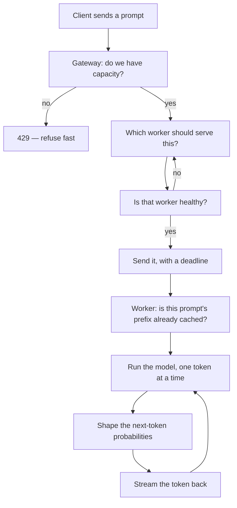

# Why each concept exists

A problem-first companion to [the 30-day plan](../plan-30-days.md). The plan says *what* to build on each day. This says *what breaks if you don't* — because a concept you can only define is a concept you haven't learned.

Read this once now, then re-read the relevant section on the morning of each day.

---

## 1. What are we building?

**One sentence:** a server that takes `POST /v1/chat/completions` from many clients at once and streams back tokens from a language model running across several machines, without falling over.

That sentence hides about twenty problems. The whole project is discovering them one at a time.

Here is the journey of a single request through the finished system. Every box is something we build, and every box exists because of a specific failure:

Two halves, and they meet in the middle:

- **The gateway half (Rust, Days 1–12)** is about *many requests*. Nothing here knows what a token is. It knows about queues, failures, and choosing.
- **The runtime half (C++, Days 13–30)** is about *one request*, made fast. Nothing here knows what a cluster is. It knows about matrices, memory, and probability.

---

## 2. What problem are we actually solving?

The honest version: **a language model is slow, huge, and stateful, and you have more users than you have machines.**

Unpack those four words and you get the entire syllabus.

| The awkward fact | What it forces you to build |
|---|---|
| **Slow** — a response takes seconds, not milliseconds | Streaming, so users see progress. Queues, because requests pile up while others are running. |
| **Huge** — weights don't fit comfortably, KV cache grows per token | Paged memory, quantization, cache eviction |
| **Stateful** — each token depends on all previous ones | KV caching, prefix reuse, and the reason you *can't* casually retry a half-streamed response |
| **More users than machines** | Load balancing, backpressure, batching, and a control plane to agree on who's alive |

Compare with a normal web service: requests are milliseconds long, stateless, and cheap. You can add a load balancer and stop thinking. **LLM serving breaks every one of those assumptions**, which is exactly why it's a good vehicle for learning distributed systems — the failure modes are large enough to see.

---

## 3. What exists today (v0.1) — and where it's already broken

You have ~250 lines of Rust that work. Here they are honestly:

**[gateway/src/lib.rs](../../gateway/src/lib.rs)** — accepts `POST /v1/chat/completions`, picks a worker, forwards the request, and pipes the response bytes straight back without buffering. That last part is the one genuinely good thing here: [lib.rs:80](../../gateway/src/lib.rs#L80) streams chunks as they arrive, so time-to-first-token stays low.

**[gateway/src/routing.rs](../../gateway/src/routing.rs)** — a `WorkerPool` that hands out workers round-robin, with a lease that counts in-flight requests and decrements on `Drop`.

**[fake-worker/src/lib.rs](../../fake-worker/src/lib.rs)** — a pretend model. It sleeps for `initial_delay`, then emits words one at a time with `token_delay` between them, and fails deterministically every `fail_every` requests. It's a wind tunnel: not an airplane, but it makes latency and failure controllable.

### Six things that are wrong with it

This list *is* the first half of the plan. Each one is a real defect you can trigger today.

**1. The pool counts in-flight requests and then ignores them.**
[routing.rs:70](../../gateway/src/routing.rs#L70) increments `in_flight`; [routing.rs:100](../../gateway/src/routing.rs#L100) decrements it. But `choose_round_robin` at [routing.rs:67](../../gateway/src/routing.rs#L67) never reads it — it just does `next % len`. The data is sitting right there, unused.
*Break it:* start one worker with `token_delay=500ms` and two that are fast. Round-robin still sends it exactly one third of traffic. Requests queue up behind the slow one while fast workers sit idle. → **Day 1**

**2. A request can hang forever.**
[lib.rs:30](../../gateway/src/lib.rs#L30) builds `Client::new()` with no timeout. If a worker accepts the TCP connection and then never responds, that request waits indefinitely.
*Break it:* `kill -STOP` a worker process mid-request. It doesn't crash — it just stops answering. Your request never returns. → **Day 5**

**3. One failure reaches the client even when two healthy workers were available.**
[lib.rs:65-72](../../gateway/src/lib.rs#L65-L72) turns a connection failure into a `503` and gives up. It doesn't try a different worker.
*Break it:* set `fail_every=3` on one worker. A third of your traffic fails, despite two perfectly good workers standing by. → **Days 5–6**

**4. There's no limit on how much work it accepts.**
Nothing bounds concurrent requests. Ten thousand clients arrive, the gateway cheerfully accepts ten thousand.
*Break it:* point a load generator at it with high concurrency. Memory climbs, every request slows down together, and *everyone* times out — instead of some succeeding and the rest being told "no" immediately. → **Day 4**

**5. A dead worker stays in the rotation forever.**
Nothing checks health. Round-robin will keep dealing requests to a corpse.
*Break it:* kill worker B. Every third request fails, permanently. → **Day 6**

**6. Configuration lives in an environment variable.**
[main.rs:13](../../gateway/src/main.rs#L13) reads `INFERLAB_WORKERS` at startup. Adding a worker means restarting. Run two gateways and they can silently disagree about who exists.
→ **Day 12**

And of course: **the workers are fake.** There is no model. → **Days 13–30**

---

## 4. The concept ledger

For each concept: the symptom, why it happens, what the concept does about it, and where it lands.

### Load balancing — Days 1–2

> **Symptom:** one slow worker drags down p99 for the whole system while other workers idle.

Round-robin assumes every request costs the same and every worker is equally fast. In LLM serving both assumptions are false: a 2000-token generation costs 100× a 20-token one, and workers hold different amounts of KV cache.

**The idea:** stop counting requests, start measuring load. *Least-in-flight* routes to whoever has the fewest open requests — a slow worker accumulates requests and is naturally skipped. *EWMA latency* goes further and tracks a decaying average of response time.

**The tension worth feeling:** if you stop sending traffic to a worker, you stop learning whether it recovered. That's explore-vs-exploit, and it's why EWMA decays instead of remembering forever.

### Consistent hashing — Day 3

> **Symptom:** you cache prompt prefixes on workers, then add a fourth worker, and `hash(key) % 4` invalidates nearly every cache entry at once.

Modulo hashing binds every key to the *number* of workers. Change the count, and almost everything moves.

**The idea:** put workers and keys on a circle. A key belongs to the first worker clockwise from it. Adding a worker only steals the arc directly behind it — roughly 1/N of keys move instead of nearly all. Virtual nodes (many points per worker) fix the resulting lumpiness.

**Where it earns its place:** Day 21. Once workers cache KV blocks for prompt prefixes, "which worker should serve this prompt" stops being arbitrary — you want the one that already has the prefix in memory. Consistent hashing makes that ownership stable as the cluster changes.

### Backpressure — Day 4

> **Symptom:** under overload, *everything* fails instead of *some things* succeeding.

This is the most counter-intuitive idea in the plan, so sit with it. A system that accepts all work degrades until every single request misses its deadline. Total useful output: zero. A system that accepts only what it can finish and immediately refuses the rest keeps most requests fast — and the refused clients learn instantly instead of waiting 30 seconds to fail.

**Rejecting work is how you protect the work you accepted.**

**The idea:** a bounded queue plus per-worker concurrency limits. When the queue is full, return `429` with `Retry-After` right away.

**The tool:** Little's Law, `L = λW`. Queue length equals arrival rate × wait time. Rearranged: if you know your arrival rate and the wait time you're willing to promise, that *dictates* your queue size. Queue depth isn't a tuning knob — it's a latency promise.

**The metric that matters:** goodput (requests completed *within deadline*), not throughput. Shedding 20% of load can raise goodput.

### Retry strategies — Day 5

> **Symptom:** a worker hiccups, all clients retry simultaneously, and the retry traffic keeps the system down after the original fault is gone.

A retry is more load applied at the exact moment a system is least able to handle it. Naive retries convert a blip into an outage.

**Three ideas that must appear together:**
- **Deadlines** — a request carries "give up at time T" through every hop. Without this, a timeout at one layer just moves the hang one layer down.
- **Full jitter** — everyone retrying at exactly 1s, 2s, 4s creates synchronized waves. Randomizing the delay spreads them out. The randomness *is* the mechanism.
- **A retry budget** — cap retries at ~10% of total requests, globally. Per-request limits still let a whole fleet triple its own load.

**The LLM-specific rule:** never retry after the first token has been sent. The client already has half an answer; a retry would produce a different continuation. This is what "stateful" costs you.

### Circuit breakers — Day 6

> **Symptom:** a worker is dead, and you discover it one failed request at a time, forever.

Retries handle *transient* failures. A broken worker isn't transient, and retrying into it wastes both the client's deadline and the worker's chance to recover.

**The idea:** a three-state machine per worker. **Closed** = send traffic. Too many failures in a sliding window → **Open** = send nothing, fail instantly. After a cooldown → **Half-open** = let one probe through. Success closes it, failure re-opens it.

Half-open is the clever part: it's how the system re-learns that a worker recovered, without a flood.

**Why Envoy's docs pair breakers with retry budgets:** breakers stop you hammering a dead worker; budgets stop the retries themselves becoming the outage. Either alone leaves a hole.

### Fault tolerance and chaos — Day 7

> **Symptom:** every isolated resilience test passes, but nobody knows what
> happens when traffic, retries, circuit transitions, and recovery overlap.

A final healthy response proves only the final instant. It can hide minutes of
errors, a retry storm, or a temporary capacity violation.

**The idea:** define a healthy steady state, keep offered load independent of
completions, inject one bounded fault, and align request outcomes with state and
event clocks. Detection, failover, recovery, MTTR, goodput, latency, and retry
amplification turn “it recovered” into a falsifiable curve.

**The safety rule:** chaos actions target exact child PIDs started by the
harness. Process-name matching and host-wide network changes are outside the
blast radius.

### Distributed queues — Days 8–9

> **Symptom:** a worker crashes mid-job and the job vanishes. Nobody knows it existed.

Interactive requests can just fail — the user retries. Batch jobs ("summarize these 10,000 documents") can't: nobody is watching, and losing job 7,431 silently is unacceptable.

**Four ideas, in order:**
- **Write-ahead log** — the job is on disk *before* you acknowledge it. Where you place the `fsync` is your entire durability story.
- **Acknowledgement** — a job is done when the consumer says so, not when it's delivered. "Delivered" and "processed" are different words for a reason.
- **Visibility timeout** — a claimed job becomes visible again if the consumer goes quiet. This is what makes crashes survivable.
- **Idempotency keys** — because visibility timeouts make duplicate delivery *inevitable*, not accidental.

**The honest contract:** at-least-once delivery plus idempotent effects. Anyone selling "exactly once" is hiding one of those two halves.

**The second trap — stale ownership:** consumer A can wake after its visibility
timeout while consumer B holds a newer claim. A monotonically increasing claim
token fences A's late acknowledgement. The job ID identifies the work; the
claim token identifies the current temporary owner.

**Where it now lives:** RFC 0010 implements a separate Rust batch service with
an append-only WAL, startup replay, claim/ack/fail APIs, lazy visibility
expiration, bounded attempts, and a DLQ. The retained proof crashes after an
external effect but before acknowledgement, then shows that the stable
idempotency key prevents a second effect during redelivery.

### Leader election — Days 10–11

> **Symptom:** you run three gateways for redundancy; now they disagree about which workers exist, and two of them try to reconfigure the cluster at once.

Some decisions must have exactly one decider. Not "usually one" — *exactly* one, provably, even during network trouble.

**The idea (Raft):** every node is a follower, candidate, or leader. Time is divided into numbered *terms*. A candidate wins a term by getting votes from a majority — and since two majorities of the same group must overlap in at least one node, and each node votes once per term, **two leaders in one term is arithmetically impossible.**

**The part that surprises people:** the algorithm's core trick is a random timeout. If all followers timed out simultaneously they'd all become candidates and split the vote forever. Randomization breaks the symmetry. The randomness isn't an implementation detail — it's the algorithm.

### Consensus — Day 12

> **Symptom:** the leader accepts a config change and immediately dies. Did that change happen or not?

Election picks who decides. Consensus makes the decisions *survive* the decider.

**The idea:** the leader appends to a log and replicates to followers. An entry is *committed* once a majority has it — and only then applied. Because any future leader must be elected by a majority, and any majority overlaps the one that stored the entry, **a committed entry can never be forgotten.**

That's the real definition worth memorizing: consensus isn't "everyone agrees." It's *a majority wrote it down, so no future majority can forget it.*

**The design discipline (PRD §4, G4):** Raft holds routing configuration — which workers exist, which policy is active. It is **never** in the per-token path. Consensus costs a network round trip to a majority; paying that per token would be absurd. Control plane decides *slowly and correctly*; data plane runs *fast*.

---

### Days 13–30 shift the question

Everything above asks *"how do we handle many requests across many machines?"* Everything below asks *"how do we make one request fast on one machine?"*

### The forward pass and KV cache — Days 13–16

> **Symptom:** generating token 100 re-reads all 99 previous tokens. Generation is O(n²) and crawls.

Attention needs the keys and values of every previous token. Recomputing them each step is enormous waste — they never change.

**The idea:** cache K and V per token. Each step then processes exactly one new token. Generation becomes O(n).

**The cost, which defines everything after this:** that cache is *big* — grows with every token, every sequence, every layer. **The KV cache is the entire memory story of LLM serving.** Days 19–21 exist only to manage it.

**Why golden tests come first:** every op gets checked against PyTorch within 1e-5 *before* anything gets optimized. A fast wrong kernel is worthless, and quantization/speculation later are only trustworthy if you have an oracle.

### Continuous batching — Day 18

> **Symptom:** you batch 8 requests for GPU efficiency; seven finish at 20 tokens, one runs to 500. Seven slots sit idle for 480 steps.

Static batching moves at the speed of its slowest member.

**The idea:** re-form the batch *every step*. Finished sequences leave, waiting ones join immediately. This is the single largest throughput win in LLM serving, and it's pure scheduling — no math changes.

### Paged KV cache — Days 19–21

> **Symptom:** you reserve max-length KV space per sequence. Most sequences are short. You waste 60–80% of memory and serve far fewer users than your hardware allows.

Contiguous allocation forces you to reserve for the worst case, and leaves unusable gaps between sequences.

**The idea — and it's a borrowed one:** this is virtual memory. Fixed-size blocks, a block table mapping logical positions to physical blocks, refcounts for sharing. A sequence's KV cache no longer needs to be contiguous, so you allocate blocks *as tokens arrive*.

**What sharing unlocks:** two sequences with the same prompt prefix point at the same physical blocks. Copy-on-write when they diverge. That's Day 21's prefix caching — and it's where the hash ring from Day 3 finally does real work, routing same-prefix requests to the worker holding those blocks.

**Build order matters:** allocator first, kernel second. vLLM's design works the same way, and for the same reason — the memory manager is where the ideas live.

### Logit processors and structured decoding — Days 17, 22–23

> **Symptom:** you ask for JSON. The model returns JSON with a trailing comma. Your parser dies. Retrying is a coin flip.

**The idea:** the model outputs a probability for every token in the vocabulary. Before sampling, you can edit that vector. Temperature scales it; top-k/top-p truncate it; repetition penalty discounts what's already appeared.

Structured decoding is the same trick pushed to its conclusion: compile a regex or JSON grammar into a state machine, and at each step set the probability of every token that would violate the grammar to **negative infinity**.

**Why this is stronger than prompting:** invalid output isn't discouraged, it's *unreachable*. Not "usually valid JSON" — 10,000 out of 10,000, by construction.

### Quantization — Days 24–25

> **Symptom:** the model doesn't fit, or memory bandwidth caps your throughput.

Generation is memory-bound, not compute-bound: each token requires reading *every weight*. Halve the bytes, roughly halve the time.

**The idea:** store weights in INT8 or INT4 instead of FP32. Per-row scales for INT8; per-group scales for INT4 (finer groups, better accuracy, more overhead).

**The discipline:** this trades accuracy for speed, so *measure both*. Perplexity delta and tokens/sec, side by side. An unmeasured quantization claim is worthless.

### Speculative decoding — Days 26–27

> **Symptom:** generation is memory-bound — you read all the weights to produce one token. Reading them to produce four wouldn't cost much more.

**The idea:** a small fast model drafts k tokens. The big model verifies all k **in a single batched forward pass**, then keeps the longest correct prefix. Easy tokens ("the", " of") get drafted correctly and come nearly free; hard tokens get rejected and cost what they'd have cost anyway.

**The beautiful part:** with the right rejection-sampling rule, the output distribution is *mathematically identical* to running the big model alone. Not an approximation — the same distribution. That's why Day 26 does greedy first (trivially checkable) and Day 27 adds the sampling rule with a statistical test.

### Attention optimization — Days 28–29

> **Symptom:** attention builds an n×n matrix. At n=4096 that's 16M values written to memory and read back — and you only needed the final result.

**The idea:** the bottleneck isn't arithmetic, it's *memory traffic*. Process attention in tiles that fit in fast cache, and use online softmax — a running max and sum updated incrementally — so you never materialize the full matrix at all.

**The transferable lesson:** FlashAttention is famous as a CUDA kernel, but the insight is architectural — *know which memory you're touching and how often*. That's why these days work on CPU: same algorithm, same win, no GPU needed. The CUDA port is mechanical afterward.

---

## 5. How to use this document

Each morning, before the agent writes a line:

1. **Read that day's entry above.** Say the symptom out loud in your own words.
2. **Write down what you expect.** Pick a number if you can — "least-in-flight should cut p99 by half." Being wrong is the most valuable outcome available.
3. **Build it**, then **break it**, then **measure it**.
4. **Write the comparison** in `docs/learning/`. Where was your prediction wrong? That gap is the learning; everything else is typing.

The PRD (§6) asks six questions of every milestone. The first one is the one that matters most here, and it's the question this whole document is built around:

> **What problem appears without this feature?**

If you can answer that from memory a week later, you learned the concept. If you can only describe what the code does — you watched.
