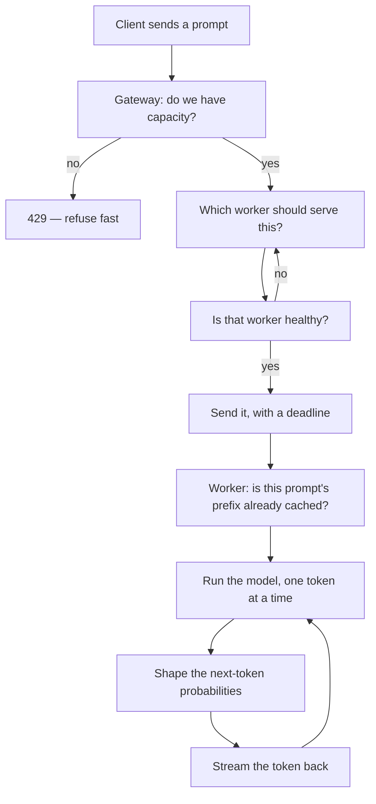
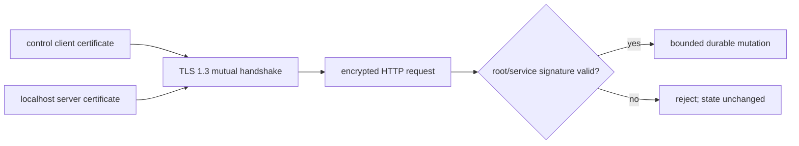
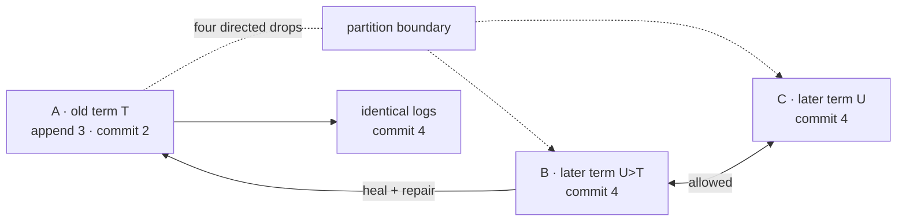

# Why each concept exists

A problem-first companion to [the 30-day plan](../plan-30-days.md). The plan says *what* to build on each day. This says *what breaks if you don't* — because a concept you can only define is a concept you haven't learned.

Read this once now, then re-read the relevant section on the morning of each day.

---

## 1. What are we building?

**One sentence:** a server that takes `POST /v1/chat/completions` from many clients at once and streams back tokens from a language model running across several machines, without falling over.

That sentence hides about twenty problems. The whole project is discovering them one at a time.

Here is the journey of a single request through the finished system. Every box is something we build, and every box exists because of a specific failure:

Two halves, and they meet in the middle:

- **The gateway half (Rust, Days 1–12)** is about *many requests*. Nothing here knows what a token is. It knows about queues, failures, and choosing.
- **The runtime half (C++, Days 13–30)** is about *one request*, made fast. Nothing here knows what a cluster is. It knows about matrices, memory, and probability.

---

## 2. What problem are we actually solving?

The honest version: **a language model is slow, huge, and stateful, and you have more users than you have machines.**

Unpack those four words and you get the entire syllabus.

| The awkward fact | What it forces you to build |
|---|---|
| **Slow** — a response takes seconds, not milliseconds | Streaming, so users see progress. Queues, because requests pile up while others are running. |
| **Huge** — weights don't fit comfortably, KV cache grows per token | Paged memory, quantization, cache eviction |
| **Stateful** — each token depends on all previous ones | KV caching, prefix reuse, and the reason you *can't* casually retry a half-streamed response |
| **More users than machines** | Load balancing, backpressure, batching, and a control plane to agree on who's alive |

Compare with a normal web service: requests are milliseconds long, stateless, and cheap. You can add a load balancer and stop thinking. **LLM serving breaks every one of those assumptions**, which is exactly why it's a good vehicle for learning distributed systems — the failure modes are large enough to see.

---

## 3. What exists today (v0.1) — and where it's already broken

You have ~250 lines of Rust that work. Here they are honestly:

**[gateway/src/lib.rs](../../gateway/src/lib.rs)** — accepts `POST /v1/chat/completions`, picks a worker, forwards the request, and pipes the response bytes straight back without buffering. That last part is the one genuinely good thing here: [lib.rs:80](../../gateway/src/lib.rs#L80) streams chunks as they arrive, so time-to-first-token stays low.

**[gateway/src/routing.rs](../../gateway/src/routing.rs)** — a `WorkerPool` that hands out workers round-robin, with a lease that counts in-flight requests and decrements on `Drop`.

**[fake-worker/src/lib.rs](../../fake-worker/src/lib.rs)** — a pretend model. It sleeps for `initial_delay`, then emits words one at a time with `token_delay` between them, and fails deterministically every `fail_every` requests. It's a wind tunnel: not an airplane, but it makes latency and failure controllable.

### Six things that are wrong with it

This list *is* the first half of the plan. Each one is a real defect you can trigger today.

**1. The pool counts in-flight requests and then ignores them.**
[routing.rs:70](../../gateway/src/routing.rs#L70) increments `in_flight`; [routing.rs:100](../../gateway/src/routing.rs#L100) decrements it. But `choose_round_robin` at [routing.rs:67](../../gateway/src/routing.rs#L67) never reads it — it just does `next % len`. The data is sitting right there, unused.
*Break it:* start one worker with `token_delay=500ms` and two that are fast. Round-robin still sends it exactly one third of traffic. Requests queue up behind the slow one while fast workers sit idle. → **Day 1**

**2. A request can hang forever.**
[lib.rs:30](../../gateway/src/lib.rs#L30) builds `Client::new()` with no timeout. If a worker accepts the TCP connection and then never responds, that request waits indefinitely.
*Break it:* `kill -STOP` a worker process mid-request. It doesn't crash — it just stops answering. Your request never returns. → **Day 5**

**3. One failure reaches the client even when two healthy workers were available.**
[lib.rs:65-72](../../gateway/src/lib.rs#L65-L72) turns a connection failure into a `503` and gives up. It doesn't try a different worker.
*Break it:* set `fail_every=3` on one worker. A third of your traffic fails, despite two perfectly good workers standing by. → **Days 5–6**

**4. There's no limit on how much work it accepts.**
Nothing bounds concurrent requests. Ten thousand clients arrive, the gateway cheerfully accepts ten thousand.
*Break it:* point a load generator at it with high concurrency. Memory climbs, every request slows down together, and *everyone* times out — instead of some succeeding and the rest being told "no" immediately. → **Day 4**

**5. A dead worker stays in the rotation forever.**
Nothing checks health. Round-robin will keep dealing requests to a corpse.
*Break it:* kill worker B. Every third request fails, permanently. → **Day 6**

**6. Configuration lives in an environment variable.**
[main.rs:13](../../gateway/src/main.rs#L13) reads `INFERLAB_WORKERS` at startup. Adding a worker means restarting. Run two gateways and they can silently disagree about who exists.
→ **Day 12**

And of course: **the workers are fake.** There is no model. → **Days 13–30**

---

## 4. The concept ledger

For each concept: the symptom, why it happens, what the concept does about it, and where it lands.

### Load balancing — Days 1–2

> **Symptom:** one slow worker drags down p99 for the whole system while other workers idle.

Round-robin assumes every request costs the same and every worker is equally fast. In LLM serving both assumptions are false: a 2000-token generation costs 100× a 20-token one, and workers hold different amounts of KV cache.

**The idea:** stop counting requests, start measuring load. *Least-in-flight* routes to whoever has the fewest open requests — a slow worker accumulates requests and is naturally skipped. *EWMA latency* goes further and tracks a decaying average of response time.

**The tension worth feeling:** if you stop sending traffic to a worker, you stop learning whether it recovered. That's explore-vs-exploit, and it's why EWMA decays instead of remembering forever.

### Consistent hashing — Day 3

> **Symptom:** you cache prompt prefixes on workers, then add a fourth worker, and `hash(key) % 4` invalidates nearly every cache entry at once.

Modulo hashing binds every key to the *number* of workers. Change the count, and almost everything moves.

**The idea:** put workers and keys on a circle. A key belongs to the first worker clockwise from it. Adding a worker only steals the arc directly behind it — roughly 1/N of keys move instead of nearly all. Virtual nodes (many points per worker) fix the resulting lumpiness.

**Where it earns its place:** Day 21. Once workers cache KV blocks for prompt prefixes, "which worker should serve this prompt" stops being arbitrary — you want the one that already has the prefix in memory. Consistent hashing makes that ownership stable as the cluster changes.

### Backpressure — Day 4

> **Symptom:** under overload, *everything* fails instead of *some things* succeeding.

This is the most counter-intuitive idea in the plan, so sit with it. A system that accepts all work degrades until every single request misses its deadline. Total useful output: zero. A system that accepts only what it can finish and immediately refuses the rest keeps most requests fast — and the refused clients learn instantly instead of waiting 30 seconds to fail.

**Rejecting work is how you protect the work you accepted.**

**The idea:** a bounded queue plus per-worker concurrency limits. When the queue is full, return `429` with `Retry-After` right away.

**The tool:** Little's Law, `L = λW`. Queue length equals arrival rate × wait time. Rearranged: if you know your arrival rate and the wait time you're willing to promise, that *dictates* your queue size. Queue depth isn't a tuning knob — it's a latency promise.

**The metric that matters:** goodput (requests completed *within deadline*), not throughput. Shedding 20% of load can raise goodput.

### Retry strategies — Day 5

> **Symptom:** a worker hiccups, all clients retry simultaneously, and the retry traffic keeps the system down after the original fault is gone.

A retry is more load applied at the exact moment a system is least able to handle it. Naive retries convert a blip into an outage.

**Three ideas that must appear together:**
- **Deadlines** — a request carries "give up at time T" through every hop. Without this, a timeout at one layer just moves the hang one layer down.
- **Full jitter** — everyone retrying at exactly 1s, 2s, 4s creates synchronized waves. Randomizing the delay spreads them out. The randomness *is* the mechanism.
- **A retry budget** — cap retries at ~10% of total requests, globally. Per-request limits still let a whole fleet triple its own load.

**The LLM-specific rule:** never retry after the first token has been sent. The client already has half an answer; a retry would produce a different continuation. This is what "stateful" costs you.

### Circuit breakers — Day 6

> **Symptom:** a worker is dead, and you discover it one failed request at a time, forever.

Retries handle *transient* failures. A broken worker isn't transient, and retrying into it wastes both the client's deadline and the worker's chance to recover.

**The idea:** a three-state machine per worker. **Closed** = send traffic. Too many failures in a sliding window → **Open** = send nothing, fail instantly. After a cooldown → **Half-open** = let one probe through. Success closes it, failure re-opens it.

Half-open is the clever part: it's how the system re-learns that a worker recovered, without a flood.

**Why Envoy's docs pair breakers with retry budgets:** breakers stop you hammering a dead worker; budgets stop the retries themselves becoming the outage. Either alone leaves a hole.

### Fault tolerance and chaos — Day 7

> **Symptom:** every isolated resilience test passes, but nobody knows what
> happens when traffic, retries, circuit transitions, and recovery overlap.

A final healthy response proves only the final instant. It can hide minutes of
errors, a retry storm, or a temporary capacity violation.

**The idea:** define a healthy steady state, keep offered load independent of
completions, inject one bounded fault, and align request outcomes with state and
event clocks. Detection, failover, recovery, MTTR, goodput, latency, and retry
amplification turn “it recovered” into a falsifiable curve.

**The safety rule:** chaos actions target exact child PIDs started by the
harness. Process-name matching and host-wide network changes are outside the
blast radius.

### Distributed queues — Days 8–9

> **Symptom:** a worker crashes mid-job and the job vanishes. Nobody knows it existed.

Interactive requests can just fail — the user retries. Batch jobs ("summarize these 10,000 documents") can't: nobody is watching, and losing job 7,431 silently is unacceptable.

**Four ideas, in order:**
- **Write-ahead log** — the job is on disk *before* you acknowledge it. Where you place the `fsync` is your entire durability story.
- **Acknowledgement** — a job is done when the consumer says so, not when it's delivered. "Delivered" and "processed" are different words for a reason.
- **Visibility timeout** — a claimed job becomes visible again if the consumer goes quiet. This is what makes crashes survivable.
- **Idempotency keys** — because visibility timeouts make duplicate delivery *inevitable*, not accidental.

**The honest contract:** at-least-once delivery plus idempotent effects. Anyone selling "exactly once" is hiding one of those two halves.

**The second trap — stale ownership:** consumer A can wake after its visibility
timeout while consumer B holds a newer claim. A monotonically increasing claim
token fences A's late acknowledgement. The job ID identifies the work; the
claim token identifies the current temporary owner.

**Where it now lives:** RFC 0010 implements a separate Rust batch service with
an append-only WAL, startup replay, claim/ack/fail APIs, lazy visibility
expiration, bounded attempts, and a DLQ. The retained proof crashes after an
external effect but before acknowledgement, then shows that the stable
idempotency key prevents a second effect during redelivery.

### Leader election — Days 10–11

> **Symptom:** you run three gateways for redundancy; now they disagree about which workers exist, and two of them try to reconfigure the cluster at once.

Some decisions must have exactly one decider. Not "usually one" — *exactly* one, provably, even during network trouble.

**The idea (Raft):** every node is a follower, candidate, or leader. Time is divided into numbered *terms*. A candidate wins a term by getting votes from a majority — and since two majorities of the same group must overlap in at least one node, and each node votes once per term, **two leaders in one term is arithmetically impossible.**

**The part that surprises people:** the algorithm's core trick is a random timeout. If all followers timed out simultaneously they'd all become candidates and split the vote forever. Randomization breaks the symmetry. The randomness isn't an implementation detail — it's the algorithm.

**Where it now lives:** RFC 0011 runs three real persistent Rust processes.
Terms and votes are durable before RPC replies; candidates must have an
up-to-date log; two exact leader kills elect replacements while gateway traffic
continues from its last committed snapshot.

### Consensus — Day 12

> **Symptom:** the leader accepts a config change and immediately dies. Did that change happen or not?

Election picks who decides. Consensus makes the decisions *survive* the decider.

**The idea:** the leader appends to a log and replicates to followers. An entry is *committed* once a majority has it — and only then applied. Because any future leader must be elected by a majority, and any majority overlaps the one that stored the entry, **a committed entry can never be forgotten.**

That's the real definition worth memorizing: consensus isn't "everyone agrees." It's *a majority wrote it down, so no future majority can forget it.*

**Replication details that carry the guarantee:** `prevLogIndex` plus
`prevLogTerm` proves a common prefix, `nextIndex` walks a stale follower
backward, `matchIndex` counts replicated positions, and the leader directly
commits only entries from its current term. Restarted nodes repair only
uncommitted suffixes and deterministically apply the committed prefix.

**The design discipline (PRD §4, G4):** Raft holds routing configuration — which workers exist, which policy is active. It is **never** in the per-token path. Consensus costs a network round trip to a majority; paying that per token would be absurd. Control plane decides *slowly and correctly*; data plane runs *fast*.

---

### Days 13–30 shift the question

Everything above asks *"how do we handle many requests across many machines?"* Everything below asks *"how do we make one request fast on one machine?"*

### The forward pass and KV cache — Days 13–16

> **Symptom:** generating token 100 re-reads all 99 previous tokens. Generation is O(n²) and crawls.

Attention needs the keys and values of every previous token. Recomputing them each step is enormous waste — they never change.

**The idea:** cache K and V per token. Each step then processes exactly one new token. Generation becomes O(n).

**The cost, which defines everything after this:** that cache is *big* — grows with every token, every sequence, every layer. **The KV cache is the entire memory story of LLM serving.** Days 19–21 exist only to manage it.

**Why golden tests come first:** every op gets checked against PyTorch within 1e-5 *before* anything gets optimized. A fast wrong kernel is worthless, and quantization/speculation later are only trustworthy if you have an oracle.

**Where the reference now lives (v0.7):** `worker/cpp/inferlab_runtime.cpp`
loads a 3,232-parameter FP32 checkpoint and implements tokenization, embeddings,
layer normalization, four-head causal attention, GELU MLP, logits, and greedy
generation with direct C++ loops. `oracle/torch_reference.py` independently
implements the same shape journey. Across three prompts, all greedy token IDs
match and the largest logit difference is `4.1975708e-06`. The real worker
streams those tokens through the existing gateway, so the runtime half now owns
a production-shaped responsibility rather than an isolated math demo.

**Where the optimization now lives (v0.8):** the same C++ session retains one
contiguous K vector and V vector per token position. `append_key_value` creates
each stable row once and `forward_cached` calculates only the current query and
output path. The old full-prefix forward remains selectable as the oracle.
Across the retained eight-step request, query projections fall from 60 token
positions to 8, K/V projections from 60 to 11, and attention-score elements
from 1,104 to 240, while all recompute/cache logits are bit-identical. The cost
is 1,408 bytes of session cache, making the next memory-management problem
concrete.

### Continuous batching — Day 18

> **Symptom:** you batch 8 requests for GPU efficiency; seven finish at 20 tokens, one runs to 500. Seven slots sit idle for 480 steps.

Static batching moves at the speed of its slowest member.

**The idea:** re-form the batch *every step*. Finished sequences leave, waiting ones join immediately. This is the single largest throughput win in LLM serving, and it's pure scheduling — no math changes.

**Where it now lives (v0.8):** `worker/src/scheduler.rs` owns a bounded waiting
channel and at most four active sessions. Every scheduler batch advances each
active session once, removes EOS, length-limited, failed, or cancelled work,
then backfills all free slots. A retained mixed 2/4/6/8-token HTTP load reaches
135.318 requests/s and 69.003 ms p95 at concurrency 8 versus 37.843 requests/s
and 212.439 ms with one active slot under the same declared 3 ms batch tick.
This is a scheduling batch, not yet one vectorized tensor kernel; C++ is still
called separately for each session.

### Paged KV cache — Days 19–21

> **Symptom:** you reserve max-length KV space per sequence. Most sequences are short. You waste 60–80% of memory and serve far fewer users than your hardware allows.

Contiguous allocation forces you to reserve for the worst case, and leaves unusable gaps between sequences.

**The idea — and it's a borrowed one:** this is virtual memory. Fixed-size blocks, a block table mapping logical positions to physical blocks, refcounts for sharing. A sequence's KV cache no longer needs to be contiguous, so you allocate blocks *as tokens arrive*.

**What sharing unlocks:** two sequences with the same prompt prefix point at the same physical blocks. Copy-on-write when they diverge. That's Day 21's prefix caching — and it's where the hash ring from Day 3 finally does real work, routing same-prefix requests to the worker holding those blocks.

**Build order matters:** allocator first, kernel second. vLLM's design works the same way, and for the same reason — the memory manager is where the ideas live.

**Where it now lives (v0.9):** `worker/cpp/inferlab_runtime.cpp` owns a fixed
physical page pool, per-session logical block tables, a free list, reference
counts, exact-token prefix entries, copy-on-write for shared partial tails, and
LRU eviction. Rust exposes configuration and `/internal/cache` metrics, while
the gateway's existing consistent hash ring keeps repeat affinity keys on a
stable worker. Paged and contiguous logits are bit-identical; six warm gateway
pairs reduce K/V projections from 24 to 6; and all 107 of 256 keys that remap
after adding worker C move only to C. The attention loop still gathers rows into
temporary contiguous vectors, so this proves memory ownership—not a
PagedAttention speedup.

### Logit processors and structured decoding — Days 17, 22–23

> **Symptom:** you ask for JSON. The model returns JSON with a trailing comma. Your parser dies. Retrying is a coin flip.

**The idea:** the model outputs a probability for every token in the vocabulary. Before sampling, you can edit that vector. Temperature scales it; top-k/top-p truncate it; repetition penalty discounts what's already appeared.

Structured decoding is the same trick pushed to its conclusion: compile a regex or JSON grammar into a state machine, and at each step set the probability of every token that would violate the grammar to **negative infinity**.

**Why this is stronger than prompting:** invalid output isn't discouraged, it's *unreachable*. Not "usually valid JSON" — 10,000 out of 10,000, by construction.

**Where it now lives (v0.10):** `worker/cpp/inferlab_runtime.cpp` applies one
fixed selection pipeline—repetition penalty, token bans, grammar mask,
temperature, top-k, top-p, then greedy or SplitMix64 categorical choice. Rust
compiles one strict `answer`/`confidence` JSON-schema shape into a seven-state
token DFA in `worker/src/decoding.rs` and supplies each state's allowed IDs to
C++. A v2 checkpoint appends six JSON fragments without changing any v1 token
or old logit. The retained proof matches three 10,000-draw distributions within
0.581 percentage points of exact softmax and produces 10,000/10,000 parser- and
schema-valid generations. The 9,991/10,000 `InferLab` answer skew is equally
important: grammar guarantees legal structure, not semantic quality or balanced
model probabilities.

### Quantization — Days 24–25

> **Symptom:** the model doesn't fit, or memory bandwidth caps your throughput.

Production generation is often memory-bandwidth-bound: each token may require
reading most model weights. Fewer bytes create an opportunity to reduce traffic,
but metadata, dequantization, kernel shape, cache behavior, and overhead decide
whether wall time actually falls.

**The idea:** store weights in INT8 or INT4 instead of FP32. Per-row scales for INT8; per-group scales for INT4 (finer groups, better accuracy, more overhead).

**The discipline:** this trades accuracy for speed, so *measure both*. Perplexity delta and tokens/sec, side by side. An unmeasured quantization claim is worthless.

**Where it now lives (v0.11):** `LinearWeight` in
`worker/cpp/inferlab_runtime.cpp` converts seven FP32 linear matrices at load.
INT8 stores 2,400 signed bytes plus 134 FP32 row scales; INT4 packs two values
per byte and adds 300 group-of-eight scales and zero points. FP32 islands make
active model tensor payload 13,720→7,056/6,820 bytes, not a theoretical 4×/8×.
Across three prompts and 24 steps, maximum logit error is 0.000182867/0.003354073
with no greedy mismatch. The tiny scalar timing is an observation, not a
production speed claim; no vectorized integer matmul exists yet.

### Speculative decoding — Days 26–27

> **Symptom:** generation is memory-bound — you read all the weights to produce one token. Reading them to produce four wouldn't cost much more.

**The idea:** a small fast model drafts k tokens. The big model verifies all k **in a single batched forward pass**, then keeps the longest correct prefix. Easy tokens ("the", " of") get drafted correctly and come nearly free; hard tokens get rejected and cost what they'd have cost anyway.

**The beautiful part:** with the right rejection-sampling rule, the output distribution is *mathematically identical* to running the big model alone. Not an approximation — the same distribution. That's why Day 26 does greedy first (trivially checkable) and Day 27 adds the sampling rule with a statistical test.

**Where it now lives (v0.11):** the C++ session lets an INT8 or INT4 draft
propose up to `k` tokens, calls the FP32 target's `forward_all` once, retains the
exact greedy prefix or uses `min(1, p(x)/q(x))` plus residual correction, then
drains verified tokens one at a time through the existing scheduler and SSE
path. Window three reduces target calls from eight to two. A deliberately
reversed synthetic draft forces 5,795 rejections while corrected output stays
within 0.543 percentage points of the target law.

The negative result is essential: the best retained speculative profile is
only `0.261x` baseline speed. This draft has the same architecture, scalar
dequantization, and full-sequence target recomputation. Fewer target calls are
an algorithmic result; they are not automatically a systems speedup.

### Attention optimization — Days 28–29

> **Symptom:** attention builds an n×n matrix. At n=4096 that's 16M values written to memory and read back — and you only needed the final result.

**The idea:** the bottleneck isn't arithmetic, it's *memory traffic*. Process attention in tiles that fit in fast cache, and use online softmax — a running max and sum updated incrementally — so you never materialize the full matrix at all.

**The transferable lesson:** FlashAttention is famous as a CUDA kernel, but the
starting insight is architectural — *know which memory you're touching and how
often*. The online recurrence can be proved on CPU, but a CUDA realization is
not mechanical: thread ownership, shared memory, synchronization, edge tiles,
occupancy, and measured HBM traffic remain separate work.

**Where it now lives (v0.12):** `kernels/attention_cpu.cpp` retains a full-score
baseline and adds query/KV tiling with a running maximum, normalizer, and value
numerator. The real model, CLI, worker configuration, and `/health` expose the
selection. Six algorithm/storage variants match a precision-aligned PyTorch
oracle within `1.1553e-7`; at 256 tokens, score scratch falls from 1 MiB to 128
bytes and the declared traffic model halves. The 16-bit modes simulate storage
rounding with FP32 accumulation, modeled bytes are not hardware counters, and
CUDA remains v1.0.

### Full-stack composition — Day 30

> **Symptom:** every subsystem passes alone, but there is no proof that a real
> decoder request survives worker and control-plane faults without mixing
> configuration identities.

**The idea:** the gateway applies worker pool, committed revision, and Raft term
as one immutable routing snapshot, then clones it once per request. Control-plane
polling stays asynchronous; retries and streaming retain the request-start
snapshot; response headers make that hidden choice observable.

**Where it now lives (v0.13):** three real online-attention CPU workers sit
behind the three-node Raft-configured gateway. The retained run turns a repeated
affinity key into a real prefix hit, kills that exact worker, retries through a
survivor under the original revision, removes the failed member in a newer
commit, serves six requests during leader election from the last committed
snapshot, applies 3:1 weights in the new term, and ends with speculative SSE.
This proves composition and fault continuity on loopback, not production-model
quality, high-load performance, or CUDA execution.

### Restart-safe routing snapshots — post-plan reliability extension

> **Symptom:** the running gateway serves through a leader election, but if the
> gateway also restarts, its last committed route map disappears with process
> memory and healthy workers become unreachable.

**The idea:** retain one versioned disk copy of the Raft-owned declarative
configuration. Validate, synchronize, and atomically rename it before publishing
a newer in-memory revision. A restarted gateway prefers live control, may use
validated disk after a bounded wait, keeps polling, and never accepts a lower
revision.

**Where it now lives (v0.14):** `gateway/src/routing_snapshot_store.rs` owns the
format and crash-safe replacement; gateway startup and polling own selection and
reconciliation. The retained proof serves four real requests while all Raft
nodes are offline, advances disk/gateway revision 2→4 after recovery, rejects a
reachable stale revision 2, fails closed on corrupt-only state, and ends with
revision-4 speculative SSE. The file remembers consensus output; it does not
become consensus.

### Bounded-age routing fallback — post-plan safety extension

> **Symptom:** a route file can be perfectly valid JSON and still be far older
> than an operator is willing to trust during a disconnected cold start—or can
> claim a timestamp so far in the future that ordinary age arithmetic calls it
> fresh indefinitely.

**The idea:** make time eligibility a separate startup gate. Optionally bound
past age, always bound accepted future-clock skew, and keep both independent of
schema validation, revision monotonicity, and worker health. Fresh disk buys
bounded emergency availability; expired or implausibly future disk fails before
the listener starts.

**Where it now lives (v0.15):** `validate_snapshot_freshness` in
`gateway/src/routing_snapshot_store.rs` pins inclusive limit behavior and uses
separate age/future-delta calculations. Gateway startup exposes maximum age,
future skew, observed disk-bootstrap age, and calculated persistence expiry.
The retained proof serves three real requests from a 433 ms-old revision while
all control nodes are down, rejects synthetic 6,000 ms age and 5,100 ms future
delta, then lets recovered live control repair the file and complete final SSE.
This is a cold-start rule, not yet a runtime revocation lease.

### Runtime routing lease — post-plan runtime extension

> **Symptom:** cold-start disk age is bounded, but a gateway that never restarts
> can keep admitting new requests forever after losing all live control
> verification.

**The idea:** give trusted live routing agreement a monotonic in-process lease.
Check it once when a request begins, allow admitted work to retain its immutable
route, and make expiry policy explicit: drain new work with readiness 503 or
continue serving stale for availability. Equal exact revisions renew because
authority can confirm identity without changing it.

**Where it now lives (v0.16):** `gateway/src/routing_lease.rs` owns the guard,
clock boundary, state, and counters; request/readiness behavior lives in
`gateway/src/lib.rs`; trusted renewal and disk-age carry-over live in
`gateway/src/main.rs`. The retained proof lets a 1,627.223 ms real SSE cross a
700 ms lease expiry, rejects a new request with zero worker attempts, renews the
same revision after Raft recovers in a newer leadership term, then proves
explicit expired `serve-stale` real traffic. This confirms recent routing
agreement, not worker health, authenticated time, or coordinated fleet drain.

### Control-cluster identity fencing — post-plan identity extension

> **Symptom:** two independent Raft histories can both report revision 2 and
> term 1. If a foreign cluster appears at the expected addresses, numeric
> equality alone cannot tell the gateway that its authority changed.

**The idea:** put every revision and term inside a stable cluster namespace.
Persist the cluster ID in each control data directory, carry it on peer RPCs and
committed configurations, and make the gateway compare identity before it
compares revision, content, or time. Foreign live state cannot publish or renew
the runtime lease; foreign disk cannot bootstrap; valid expected live authority
can repair the fallback cache.

**Where it now lives (v0.17):** `control-plane/src/model.rs` and
`control-plane/src/raft.rs` own identity propagation, durable ownership, and
pre-mutation peer fencing. `gateway/src/routing_snapshot_store.rs` owns the disk
identity, while `gateway/src/main.rs` and `gateway/src/lib.rs` own expected-live
selection, diagnostics, immutable request identity, and headers. The retained
proof runs primary and foreign three-node clusters at the same revision/term,
rejects at least 28 foreign observations by the expiry capture, lets a 2,029.448
ms admitted real SSE finish, causes zero worker attempts for a new rejected
request, recovers primary term 2,
and demonstrates offline disk rejection plus live repair; 18/18 assertions pass.
The cluster ID prevents accidental namespace mixing. It is an asserted string,
not TLS, a signature, or protection against a sender that deliberately spoofs
the expected name.

### Signed control and key rotation — post-plan authentication extension

> **Symptom:** a rogue control history can copy the expected cluster string and
> independently claim the same revision and term. A namespace comparison cannot
> prove ownership of that name or detect changed route bytes on disk.

**The idea:** sign one deterministic representation of cluster, key ID,
revision, term, policy, and ordered workers with an Ed25519 private key. Give the
gateway only trusted public keys, verify before any cluster/revision/time rule,
and explicitly deny revoked key IDs. Treat the same consensus payload under a
new trusted key as rotation: persist the new envelope before publishing its key
identity and renewing the lease.

**Where it now lives (v0.18):** `control-auth/src/lib.rs` owns canonical binary
framing, maintained Ed25519 primitives, key selection, trust, and revocation.
`control-plane/src/lib.rs` signs committed HTTP responses;
`gateway/src/control_authentication.rs` adapts verification to route types; and
`gateway/src/main.rs` owns live/disk ordering and signature-only rotation. The
retained proof gives honest and rogue three-node histories the same
cluster/r2/t1 identity, rejects at least 25 unknown-key observations by expiry,
lets a 2,026.254 ms admitted real SSE finish, rotates trusted A→B without route
revision or gateway restart, rejects 24 later valid A observations as a
downgrade until B returns, detects a changed disk worker, refuses revoked A,
and serves from B-signed disk; 23/23 assertions pass. This authenticates route
bytes, not secrecy, administrative writer intent, Raft peer transport, protected
secret storage, or replay-proof freshness.

### Authorized administrative writers — post-plan creation boundary

> **Symptom:** the gateway can verify that a legitimate control service signed
> a route, while the control service can still be tricked into committing and
> signing a route requested by an unauthorized caller.

**The idea:** give administrative writers a separate Ed25519 identity. Sign the
exact cluster, method/path, expected revision, issue time, nonce, policy, and
ordered workers. At the leader, verify trust/revocation/signature, then
freshness, then the revision precondition under the serialized proposal lock.
Append nothing on failure; replicate writer provenance on success; use the
separate route key for gateway delivery.

**Where it now lives (v0.19):** `control-auth/src/lib.rs` owns canonical writer
intent and Ed25519 primitives; `control-plane/src/write_authorization.rs` owns
trust, freshness, counters, and diagnostic state; `control-plane/src/raft.rs`
owns the atomic revision fence and durable provenance; and
`control-plane/src/lib.rs` orders the HTTP boundary. The retained proof rejects
four authentication failures and one stale valid signature without a log
change, commits r2 from `deploy-bot`, rejects exact replay with 409, commits a
new r3 intent, replicates provenance on all three nodes, and serves a real
request plus 188.238 ms SSE through the separately signed route; 22/22
assertions pass. This is coarse request-level writer authorization, not mTLS,
peer identity, RBAC, durable idempotency, online revocation, or protected
production key storage.

### Cryptographic service identities — post-plan request boundary

> **Symptom:** writer intent and route delivery are signed, but Raft peers and
> gateway route readers still arrive as ordinary HTTP callers that can merely
> claim a node or cluster string.

**The idea:** give each machine role its own Ed25519 identity and sign the whole
request meaning: caller, exact audience node, method/path, cluster, timestamp,
nonce, and canonical body. Verify cryptography, time, and a bounded replay cache
before checking endpoint scope, and run no Raft state transition before every
gate passes. A node identity must match the claimed candidate/leader; a gateway
identity may read routes but cannot act as a peer.

**Where it now lives (v0.20):** `service-auth/src/lib.rs` owns the canonical
service-request protocol and trust ring;
`control-plane/src/service_authentication.rs` owns headers, freshness, replay,
scope diagnostics, and counters; `control-plane/src/raft.rs` signs vote/append
traffic for each exact peer; and `gateway/src/service_client.rs` signs route
reads using an exact URL-to-node map. The retained proof elects three required-
mode nodes, rejects five 401 classes and two 403 role violations without
letting high terms reach Raft, publishes the separately signed r2 route, serves
a 185.707 ms real request and 186.723 ms SSE, and passes 20/20 assertions.
Request signatures prove identity and integrity; they do not encrypt HTTP,
authenticate hostnames, persist replay history across restart, rotate
credentials automatically, or protect a compromised process.

### Overlap-safe service credential rotation — post-plan lifecycle boundary

> **Symptom:** each service has cryptographic identity, but replacing its only
> trusted public key creates a mixed-deployment window where old senders and new
> receivers—or new senders and old receivers—reject each other and can break
> quorum or route reads.

**The idea:** keep the stable service ID while trusting bounded old/new
credentials at the same time. Derive the credential label from whichever
public key verifies the unchanged v1 signature, keep replay identity at service
scope, and revoke one exact `service/key` only after every sender uses the new
key. Deploy in separate trust, signer, observation, and revocation waves; rotate
followers before the leader.

**Where it now lives (v0.21):** `service-auth/src/lib.rs` owns multi-credential
parsing, bounded verification, and precise revocation;
`control-plane/src/service_authentication.rs` owns per-credential diagnostics;
control and gateway startup select independent local credential IDs; and
`scripts/proof-v0.21.sh` performs the six rolling checkpoints. The retained
proof keeps three statuses, one leader, and r2 throughout; observes both A and
B during overlap; accepts A before revocation and rejects old gateway/peer A
afterward without changing a high term; serves a 182.663 ms request and 182.597
ms SSE through B; and passes 18/18 assertions. The lifecycle remains static and
restart-driven, verification is bounded-linear, HTTP is unencrypted, and key
custody is still educational.

### Signed online service trust — post-plan distribution boundary

> **Symptom:** overlap makes key rotation safe, but each receiver's accepted
> credentials still live in restart-only environment configuration. A copied
> file has no authenticated author, two versions have no durable order, and a
> restarted node can forget that it already accepted a newer revocation.

**The idea:** let a separate trust root sign the complete cluster-bound receiver
policy. Give each edition a positive generation, persist the accepted
generation/root/signature before atomically swapping memory, and retain last
known good when a changed runtime file is invalid. The stored signature detects
a different valid policy reusing the same generation; the local-signer guard
prevents a node from adopting a policy that disables its current outbound
credential.

**Where it now lives (v0.22):** `service-auth/src/trust_snapshot.rs` owns the
snapshot schema, canonical signature, root ring, and policy compilation;
`control-plane/src/service_trust.rs` owns bounded polling, durable floors,
bootstrap, rollback/fork checks, and last-known-good reload;
`control-plane/src/service_authentication.rs` owns the atomic active policy and
diagnostics; and `scripts/proof-v0.22.sh` drives g1→g2→g3 plus rollback, tamper,
and restart-floor attacks. The retained proof loads g2/g3 into three unchanged
controls, keeps g3 under both live attacks, blocks a follower restart on g2,
restores the cluster on g3, serves a 189.236 ms request and 187.796 ms SSE, and
passes 20/20 assertions. Publication remains an external per-node local-file
operation; the design does not provide fleet atomicity, expiry, protected key
custody, filesystem integrity, TLS/mTLS, or multi-host partition evidence.

### Distributed trust delivery — post-plan convergence boundary

> **Symptom:** a receiver can safely verify and reload a local signed snapshot,
> but the operator must still copy it to each node, cannot distinguish
> publication from activation in one place, and cannot restart from the last
> accepted policy if the current source is unavailable.

**The idea:** keep the trust root as policy authority and make the distributor
only a bounded transport. Every receiver independently verifies the complete
root-signed artifact, persists a full cache and rollback identity, activates
the policy, and only then signs a receipt with its service credential. The
distributor groups receipts into expected, acknowledged, and pending sets;
partial sets show observation gaps rather than pretending there is a
fleet-atomic transaction. ETag/304, request bounds, and deterministic capped
backoff keep polling controlled, while the durable complete cache bridges a
distributor outage during restart.

**Where it now lives (v0.23):** `trust-distributor/src/lib.rs`
owns signed-snapshot publication, conditional fetch, receipt verification,
durable distributor state, readiness, and convergence status;
`service-auth/src/trust_receipt.rs` owns canonical receipt signing and
verification;
`control-plane/src/service_trust.rs` owns remote fetch, cache-before-floor-
before-activation ordering, cache bootstrap, backoff, and receipt retry; and
`scripts/proof-v0.23.sh` drives remote g1 boot, withheld-C partial g2 receipts,
healing, g2/g3 gateway rotation, rollback/fork/tamper attacks, distributor-
outage cache restart, and real JSON/SSE service. In the retained run,
control-status probes observe all controls at g2 after healing in 12.547 ms and
at g3 in 22.872 ms; complete receipt sets are subsequently observed. It serves
a 186.075 ms request and 187.935 ms SSE and passes 25/25 assertions. Transport
is still one
availability point, receipt absence is ambiguous, convergence is not atomic,
and TLS/mTLS, expiry, protected key custody, hostile disk, and multi-host
evidence remain outside the boundary.

### Mutual TLS for trust distribution — post-plan channel boundary

> **Symptom:** root and service signatures detect changed application meaning,
> but v0.23 still sends metadata over plaintext HTTP, cannot authenticate the
> distributor hostname, and lets clients reach HTTP handlers without a channel
> identity.

**The idea:** add a TLS 1.3-only listener with a server certificate and required
client-certificate verification. Have each control trust a private server CA,
verify the URL hostname, and present its own CA-issued client certificate.
Keep this channel identity separate from application authority: after a valid
mTLS handshake, the distributor/receiver must still verify every trust-root
snapshot and service receipt signature. Make TLS path groups all-or-none and
scheme-coupled so partial configuration cannot silently downgrade.

**Where it now lives (v0.24):** `transport-security/src/lib.rs` owns bounded
PEM loading and TLS 1.3 rustls client/server configuration;
`trust-distributor/src/main.rs` owns all-or-none server TLS startup;
`control-plane/src/service_trust.rs` owns scheme-coupled receiver mTLS and the
existing bounded polling/cache state machine; and `scripts/proof-v0.24.sh`
creates an ephemeral private CA and exercises both transport and application
failure layers. The retained proof boots three g1 receivers with three
receipts, rejects plaintext/missing/rogue/wrong-CA/wrong-hostname transport
before HTTP with live/durable g1 unchanged, rejects a tampered snapshot and
forged receipt over valid mTLS, converges g2, restarts a follower from cache
during distributor outage, serves real JSON/SSE, and passes 31/31 assertions.
It protects only the
trust-distribution hop; global service mTLS, certificate-role binding,
rotation/revocation, ACME/HSM, policy expiry, and distributor HA remain later
work.

### Directed Raft partitions and Figure 8 — post-plan safety boundary

> **Symptom:** killing a leader proves crash recovery but cannot show a healthy
> minority leader appending locally while a connected majority elects and
> commits. A client `503` is ambiguous, and “an entry appears on a majority” is
> still not a complete Raft commit rule for entries from older terms.

**The idea:** put one rootless Raft-only loopback proxy on each ordered node
pair so message delivery can change without killing a process. Cut both
directions between A and B+C while keeping B↔C open. Observe append, commit,
apply, term, and disk independently; then heal and require A's uncommitted
suffix to be replaced while the committed prefix survives. Pair that live
three-process schedule with the exact five-server Figure 8(a–e) replay using
the production current-term commit and vote-freshness predicates.

**Where it now lives (v0.25):** `control-plane/src/link_proxy.rs` owns the
explicit-loopback, exact-Raft-route, bounded allow/drop boundary and monotonic
event journal; `control-plane/src/figure_eight.rs` owns the exact paper replay;
the production vote/commit/repair behavior remains in
`control-plane/src/raft.rs`; and `scripts/proof-v0.25.sh` owns six proxy plus
three control OS processes, ordered cut/heal, real gateway/CPU serving,
process-start identity, sanitization, and exact manifest publication. The
retained run keeps A's commit/applied revision at 2 despite an ambiguous `503`,
lets B+C commit different revision 4, repairs and converges all logs, passes all
11 Figure-8 model predicates, serves a 182.498 ms JSON request and 182.886 ms
SSE through `[DONE]`, and passes 45/45 checks.

**Boundary:** this is one controlled single-host symmetric A-vs-{B,C} cut of
whole Raft HTTP RPCs. It is not silent packet loss, latency/reorder, TCP
half-open behavior, arbitrary asymmetric partitions, independent hosts,
Jepsen, formal verification, dynamic membership, or a live five-node cluster.
The injector's management API is unauthenticated and proof-local; mode change
does not cancel an in-flight forward; each start requires a fresh journal path;
and journal flush is evidence visibility rather than `fsync` crash durability.

---

## 5. How to use this document

Each morning, before the agent writes a line:

1. **Read that day's entry above.** Say the symptom out loud in your own words.
2. **Write down what you expect.** Pick a number if you can — "least-in-flight should cut p99 by half." Being wrong is the most valuable outcome available.
3. **Build it**, then **break it**, then **measure it**.
4. **Write the comparison** in `docs/learning/`. Where was your prediction wrong? That gap is the learning; everything else is typing.

The PRD (§6) asks six questions of every milestone. The first one is the one that matters most here, and it's the question this whole document is built around:

> **What problem appears without this feature?**

If you can answer that from memory a week later, you learned the concept. If you can only describe what the code does — you watched.
