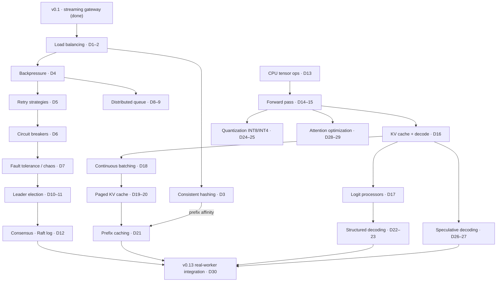

# InferLab — 30-Day Learning Plan

One evolving system, thirty days, two tracks: **distributed systems (Days 1–12)** and **inference engineering (Days 13–30)**. Every day adds one production behavior to the same codebase, teaches the concept behind it, and produces a piece of evidence.

Starting point: **v0.1 is shipped** — streaming gateway, round-robin pool, three fake workers, smoke benchmark.

> **Honest cadence note:** fitting both tracks into one month means **~4–6 focused hours per day**. If a day overruns, slip the schedule — never skip the proof. A concept without its evidence doesn't count as covered.

## The concept graph

## Releases

| Day | Tag | What it proves |
|---|---|---|
| 7 | `v0.2-gateway` | Resilient routing: four strategies, backpressure, retries, breakers, chaos-tested |
| 12 | `v0.3-control-plane` | Durable queue + 3-node Raft election and replication surviving leader death |
| 20 | `v0.4-runtime` | C++ runtime matching PyTorch, continuous batching, paged KV cache |
| 27 | `v0.5-optimizations` | Prefix cache, structured decoding, INT8/INT4, speculative decoding — each with before/after numbers |
| 30 | `v0.13` | Real decoder tokens remain available through worker and Raft-leader faults in the consensus-configured platform |

---

## Track A — Distributed systems (Days 1–12)

Intuition to build: a load balancer is a bet about the future; systems fail because they accept work they can't finish; durability is a contract about crashes; consensus means "a majority wrote it down, so no future majority can forget it."

### Day 1 — Least-in-flight + EWMA routing `load balancing`
Track open requests per worker; route to the emptiest. Then use an exponentially weighted moving average of latency as the signal. Learn why round-robin collapses under unequal worker speeds, and the explore/exploit tension: a worker you stop sending to can never look fast again.
**Proof:** with one slow worker, least-in-flight keeps p99 flat where round-robin doesn't; EWMA adapts within seconds when a worker is slowed mid-run.

### Day 2 — Load generator, metrics, routing shoot-out `load balancing`
Open-loop load generator (fixed arrival rate — closed-loop tests hide overload), Prometheus `/metrics` with latency histograms. Benchmark RR vs least-in-flight vs EWMA against skewed workers. Write your prediction before running.
**Proof:** one chart, three strategies, and a paragraph on where your prediction was wrong. Raw JSON in `docs/results/`.

### Day 3 — Consistent hash ring + virtual nodes `consistent hashing`
Hash workers and keys onto a ring; route by clockwise successor; add 100–200 vnodes per worker to fix lumpy distribution. Its real job arrives on Day 21: prompt-prefix affinity.
**Proof:** property test that removing 1 of N workers remaps ≈1/N of keys; key-distribution histogram at 1/10/100 vnodes.

### Day 4 — Backpressure `backpressure`
Bounded admission queue in front of the pool; 429/503 + `Retry-After` when full; per-worker concurrency semaphores. Learn Little's Law (L = λW) — queue depth is a promise about wait time — and goodput vs throughput.
**Proof:** 5× overload test: memory flat, latency plateaus instead of collapsing, rejected requests get clean 429s.

### Day 5 — Deadlines, backoff with jitter, retry budget `retry strategies`
Per-request deadline propagates gateway→worker; exponential backoff with full jitter; a global retry budget (retries ≤ 10% of requests); retry only idempotent, not-yet-streamed calls. Learn how synchronized retries create thundering herds and amplify outages.
**Proof:** simulation with vs without jitter — the retry-storm spike disappears; no request ever outlives its deadline.

### Day 6 — Circuit breaker `circuit breakers`
Closed → open → half-open per worker, driven by error rate over a sliding window. Learn why breakers and retry budgets must cooperate (Envoy's circuit-breaking docs are the reference).
**Proof:** state-machine unit tests + integration test showing half-open probes automatically recover a healed worker.

### Day 7 — Chaos harness → ship `v0.2-gateway` `fault tolerance`
Scripted failure injection — kill, slow, drop connections, corrupt responses — while the load generator runs. Learn to read a recovery curve. Write RFC + demo + tag.
**Proof:** kill 1 of 3 workers mid-load; graph shows detection, rerouting, recovery time.

### Day 8 — Durable queue: WAL, ack, crash recovery `distributed queues`
Append-only log for batch-inference jobs; enqueue survives restart; consumers ack on completion. Learn why fsync placement decides the durability story, and the difference between "delivered" and "processed."
**Proof:** kill the queue process mid-stream; every unacked job survives restart. Crash matrix documented in the RFC.

### Day 9 — Visibility timeout, idempotency, DLQ `distributed queues`
In-flight jobs reappear if the consumer goes silent; dedupe on client-supplied idempotency keys; poison jobs go to a dead-letter queue after N attempts. At-least-once + idempotency is the honest contract — "exactly once" is marketing.
**Proof:** kill a consumer mid-job → another picks it up; duplicate submissions execute once; a poison job lands in the DLQ with its history.

### Day 10 — Raft on paper + node state machine `leader election`
Read the Raft paper §5; play the raft.github.io visualization. Implement follower/candidate/leader states, terms, and RPC types — no networking yet. Learn why randomized timeouts *are* the algorithm: they break symmetry.
**Proof:** a one-page explanation of terms and split votes, in your own words, in `docs/learning/`.

### Day 11 — Leader election over the wire `leader election`
RequestVote RPCs, randomized election timeouts, heartbeats across three real processes.
**Proof:** three nodes elect exactly one leader; kill the leader repeatedly and measure re-election latency distribution.

### Day 12 — Log replication + commit → ship `v0.3-control-plane` `consensus`
AppendEntries with the consistency check (prevLogIndex/prevLogTerm), follower log repair, majority commit, apply to a key-value state machine holding worker membership and routing policy. The gateway reads config from it.
**Proof:** change routing policy via the leader → all gateways converge; kill the leader → writes resume after re-election; no committed entry lost across restarts.
**Scoped down (backlog):** §5.4.2 Figure-8 edge case as a test, Jepsen-style partition tests, membership changes.

---

## Track B — Inference engineering (Days 13–30)

Intuition to build: every kernel gets a golden test before it gets fast; the KV cache is the entire memory story of LLM serving; sampling and structured output are just editing a logit vector; quantization and speculation are accuracy-for-speed trades you must measure, never assume.

Scope: GPT-2-small class model, CPU first, correctness against PyTorch from the first line. A tiny Python reference script pins expected values for everything.

### Day 13 — C++ tensor ops + golden tests `inference server`
Matmul, layernorm, GELU, softmax in plain C++.
**Proof:** every op matches PyTorch within 1e-5 on randomized shapes.

### Day 14 — Weights + tokenizer `inference server`
Load real GPT-2 checkpoint weights and the BPE tokenizer.
**Proof:** tokenizer round-trips a test corpus exactly; weight tensors match shape/checksum against the reference.

### Day 15 — Transformer forward pass `inference server`
Full forward pass for one token batch. Attention is four matmuls and a softmax if your shapes are honest.
**Proof:** logits for a fixed prompt match PyTorch's.

### Day 16 — Autoregressive decode + naive KV cache `kv cache`
Greedy generation loop, then cache K/V so each step processes one token instead of the whole prefix.
**Proof:** generated tokens match PyTorch greedy decode; tokens/sec before vs after caching.

### Day 17 — Logit processors `logit processors`
Temperature, top-k, top-p, repetition penalty, token bans — as a composable pipeline over the logit vector.
**Proof:** golden tests for every processor, including order-of-application cases.

### Day 18 — Continuous batching `scheduling`
Waiting/running queues; sequences join and leave the batch every step instead of waiting for the slowest.
**Proof:** throughput vs static batching under mixed-length requests; per-request TTFT distribution.

### Day 19 — Paged KV cache: allocator `paged kv cache`
Fixed-size blocks, logical→physical block tables, refcounts — the memory manager before any kernel work (this is vLLM's design order too).
**Proof:** allocator unit tests: alloc/free/refcount invariants hold under randomized workloads.

### Day 20 — Copy-on-write + fragmentation → ship `v0.4-runtime` `paged kv cache`
COW on block fork (parallel sampling), eviction, and the payoff benchmark.
**Proof:** concurrent-sequence benchmark: paged cache fits N× more sequences in the same memory than contiguous allocation.

### Day 21 — Prefix caching + hash-ring affinity `prompt caching`
Reuse KV blocks for shared prompt prefixes; the gateway's consistent-hash ring (Day 3) now routes same-prefix requests to the same worker.
**Proof:** TTFT before/after for a shared-system-prompt workload; cache hit rate exported as a metric.

### Day 22 — Structured decoding I: regex → DFA `structured output`
Compile a regex to a DFA over the token vocabulary; mask invalid tokens each step.
**Proof:** generated outputs match the regex 100% of the time, with per-step masking overhead measured.

### Day 23 — Structured decoding II: JSON grammar FSM `structured output`
Grammar-driven masking for JSON with schema constraints.
**Proof:** 10,000 generations, 100% parser success rate.

### Day 24 — INT8 quantization `quantization`
Symmetric per-row INT8 for the linear layers.
**Proof:** perplexity delta vs FP32 on a fixed eval set; tokens/sec and memory before/after.

### Day 25 — INT4 groupwise quantization `quantization`
Groupwise INT4 with scales/zero-points. Read AWQ and GPTQ papers as study (implementing them is backlog).
**Proof:** quality/memory/speed trade-off table across FP32 / INT8 / INT4.

### Day 26 — Speculative decoding I: greedy verify `speculative decoding`
Small draft model proposes k tokens; target model verifies in one batched pass. Greedy first, where correctness is trivially checkable.
**Proof:** output identical to target-only greedy decode; acceptance rate and speedup measured.

### Day 27 — Speculative decoding II: rejection sampling → ship `v0.5-optimizations` `speculative decoding`
The rejection-sampling rule from the speculative sampling paper, preserving the target distribution exactly.
**Proof:** statistical test — token distribution with speculation matches target-only sampling; acceptance rate vs draft-model quality.

### Day 28 — Attention optimization I: tiling `flashattention principles`
Naive attention vs cache-tiled attention (blocked over the sequence). The core FlashAttention idea is IO-awareness — reducing memory traffic — not fusion for its own sake.
**Proof:** benchmark naive vs tiled across sequence lengths; identical outputs.

> **Platform note:** this machine is Apple Silicon — no CUDA. Days 28–29 first
> prove tiling and online softmax in a portable scalar CPU implementation. SIMD,
> Accelerate/Metal, and CUDA are separate realization and measurement steps;
> the recurrence transfers, but the memory hierarchy and optimization work are
> not mechanical.

### Day 29 — Attention optimization II: online softmax `flashattention principles`
Numerically stable online softmax → exact tiled attention that never materializes
the full attention matrix. Retain score scratch, a labeled traffic model, and
measured host time as separate evidence.
**Proof:** matches reference within tolerance at long sequence lengths where naive overflows or thrashes; memory high-water mark before/after.

### Day 30 — Integration, retro → ship `v0.13`
The C++ runtime speaks the worker HTTP contract and sits behind everything Track
A built: routing, backpressure, retries, breakers, Raft-served configuration,
and prefix-affinity routing. The gateway captures one atomic worker-pool,
revision, and term snapshot per request so configuration cannot change halfway
through a retry or stream.
**Implemented proof:** three Raft nodes configure three real tiny-decoder workers;
the run proves a real prefix hit, exact worker kill and pre-header failover,
committed worker removal, 6/6 real-model requests during exact leader failure,
a newer 3:1 weighted policy with 6:2 routing, and final speculative SSE. All
23 assertions pass. The teaching checkpoint is intentionally not GPT-2; public
model/tokenizer integration remains separate from this composition proof.

### Post-plan reliability extension — restart-safe gateway routing `v0.14`

Persist the last validated Raft-committed route map before publishing it, then
allow a new gateway process to bootstrap from that versioned file when every
control node is unavailable. Reconcile monotonically when control returns and
refuse stale rollback or ambiguous/corrupt identity.
**Implemented proof:** exact gateway and three-node control shutdown, four of
four real requests after disk bootstrap, revision 2→4 durable reconciliation,
3:1 weights producing 6:2 routing, a live stale-revision rollback attempt,
corrupt-state failure, and final speculative SSE; 19/19 assertions pass.

### Post-plan safety extension — bounded-age routing fallback `v0.15`

Optionally limit how old a durable route may be when a new gateway cannot reach
control, and independently reject timestamps beyond configured future-clock
skew. Keep temporal eligibility separate from revision monotonicity and allow
valid live control to repair an ineligible file.
**Implemented proof:** revision 2 is persisted under a 5,000 ms maximum age and
100 ms skew allowance; a 433 ms-old file serves 3/3 real requests during total
control outage; synthetic 6,000 ms age and 5,100 ms future delta fail before a
listener starts; recovered live control repairs the file; all seven permitted
non-stream requests plus final speculative SSE succeed; 15/15 assertions pass.

### Post-plan runtime extension — live routing lease `v0.16`

Optionally bound how long a running gateway may admit new work after its last
trusted live control verification. Renew on exact equal-revision or safely
published newer control state, preserve already-admitted streams, expose
readiness, and make `reject-new` versus `serve-stale` an explicit operator
policy.
**Implemented proof:** a 700 ms lease renews under live revision 2; an admitted
1,627.223 ms real SSE crosses total three-node control outage and expiry; a new
request receives structured 503 with zero worker attempts; persistent control
recovers in term 2 and renews the same revision without a gateway restart;
expired disk-bootstrapped `serve-stale` remains ready and completes a new real
request plus final SSE; 17/17 assertions pass.

### Post-plan identity extension — control-cluster fencing `v0.17`

Namespace every Raft history before comparing its revisions or terms. Persist
the identity in control-node state, carry it through peer RPCs, committed routes,
gateway disk, immutable request snapshots, headers, and diagnostics, and reject
foreign live/disk state before it can publish or renew trust.
**Implemented proof:** two independent persistent three-node clusters both
commit revision 2 in term 1 but name different clusters and real workers; at
least 28 foreign observations by the expiry capture fail to replace the primary
route or renew its 700 ms lease; an admitted 2,029.448 ms real SSE finishes while
a new request produces
zero worker attempts; primary term-2 recovery renews in place; foreign disk
fails offline and is repaired by expected live authority; 18/18 assertions
pass. This is namespace fencing, not cryptographic authentication.

---

## Explicit backlog (cut to fit 30 days)

- Raft: Figure-8 commit-rule test, partition/Jepsen-style tests, membership changes
- AWQ / GPTQ implementations (papers read on Day 25)
- CUDA ports of the attention kernels (requires GPU access)
- Public production checkpoint/tokenizer integration beyond the deterministic
  tiny teaching format
- Guardrails (input/output filtering) and full AI-gateway policy layer
- Grafana dashboards beyond raw Prometheus
- Signed or mutually authenticated control identity/time, key rotation and
  revocation, emergency route cancellation, and coordinated multi-gateway drain
  behavior

## How to run the month (since agents write the code)

1. **You write the RFC and the prediction; the agent writes the implementation.** If you can't state the invariant before the code exists, you've watched the concept, not learned it.
2. **Daily loop:** predict → build → break → measure → explain. The "explain" note in `docs/learning/` is the real learning artifact; code is a byproduct.
3. **You write the failure tests and golden tests yourself.** Deciding what should break is where intuition forms. Let the agent make them pass.
4. **One rewrite per week by hand:** the ring lookup, the breaker state machine, the Raft commit rule, the block allocator, the online-softmax loop — ~50 core lines from memory before reading the agent's version.
5. **Slip days, not scope.** Push the schedule rather than skipping proofs.
6. **Ship on days 7, 12, 20, 27, 30.** Tag + write-up + demo turns the month into a portfolio.

## References

- [Raft paper & visualization](https://raft.github.io/)
- [Envoy circuit breaking](https://www.envoyproxy.io/docs/envoy/latest/intro/arch_overview/upstream/circuit_breaking)
- [Tokio bounded channels](https://tokio.rs/tokio/tutorial/channels)
- [vLLM PagedAttention design](https://docs.vllm.ai/en/latest/design/paged_attention/)
- [TGI architecture](https://huggingface.co/docs/text-generation-inference/en/architecture)
- [Speculative sampling paper](https://arxiv.org/abs/2302.01318)
- [FlashAttention paper](https://arxiv.org/abs/2205.14135)
- [AWQ](https://github.com/mit-han-lab/llm-awq) · [GPTQ](https://arxiv.org/abs/2210.17323)
