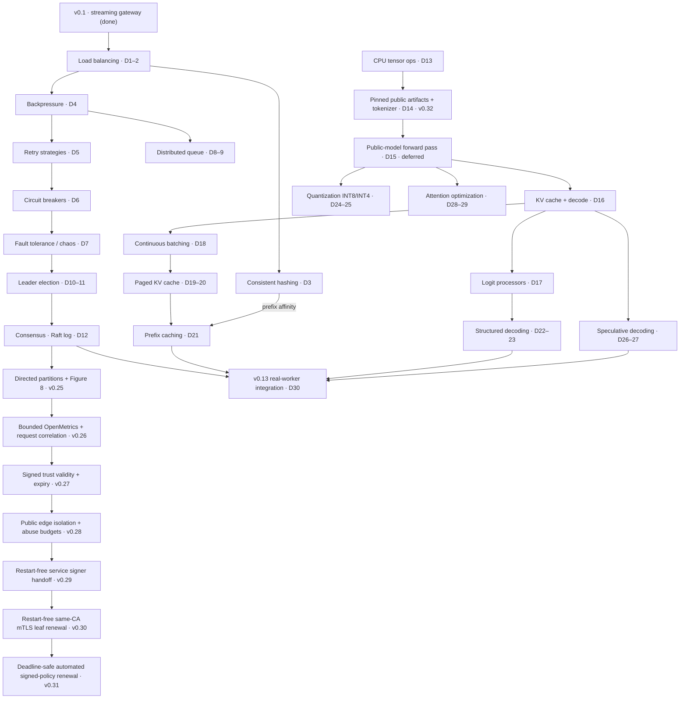
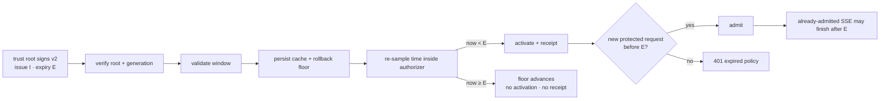
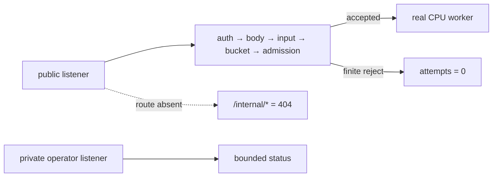
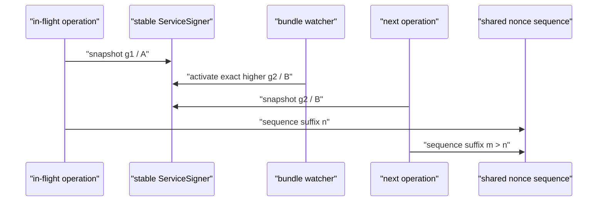
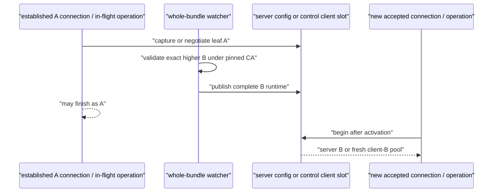
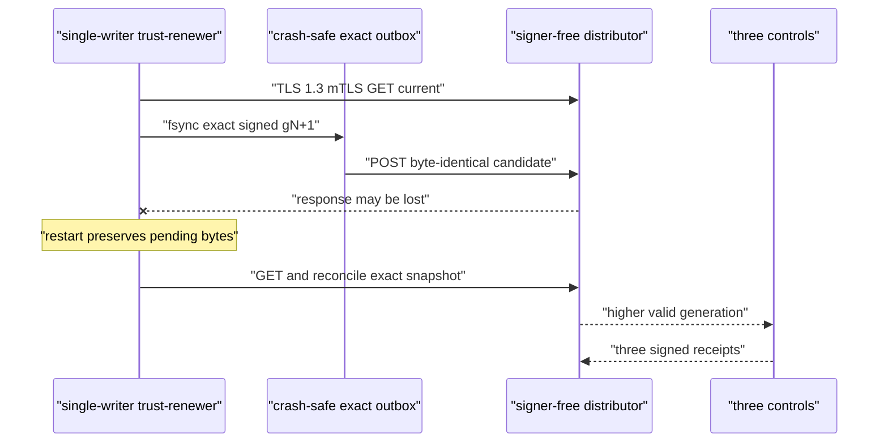
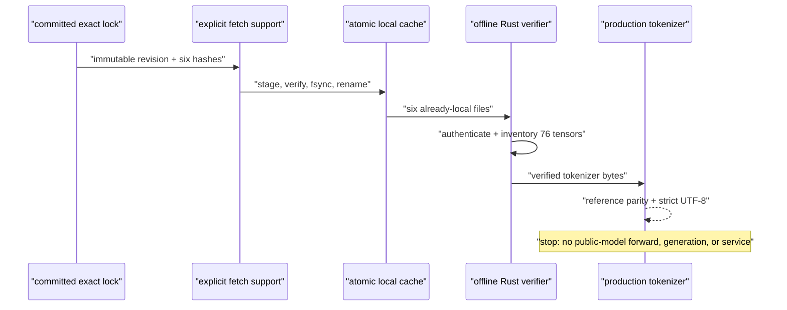

# InferLab — 30-Day Learning Plan

One evolving system, thirty days, two tracks: **distributed systems (Days 1–12)** and **inference engineering (Days 13–30)**. Every day adds one production behavior to the same codebase, teaches the concept behind it, and produces a piece of evidence.

Starting point: **v0.1 is shipped** — streaming gateway, round-robin pool, three fake workers, smoke benchmark.

> **Honest cadence note:** fitting both tracks into one month means **~4–6 focused hours per day**. If a day overruns, slip the schedule — never skip the proof. A concept without its evidence doesn't count as covered.

## The concept graph

## Releases

| Day | Tag | What it proves |
|---|---|---|
| 7 | `v0.2-gateway` | Resilient routing: four strategies, backpressure, retries, breakers, chaos-tested |
| 12 | `v0.3-control-plane` | Durable queue + 3-node Raft election and replication surviving leader death |
| 14 | `v0.32` | One exact public checkpoint is authenticated and inventoried; its maintained production tokenizer matches a pinned independent reference, with no public-model execution or retained weights |
| 20 | `v0.4-runtime` | C++ runtime matching PyTorch, continuous batching, paged KV cache |
| 27 | `v0.5-optimizations` | Prefix cache, structured decoding, INT8/INT4, speculative decoding — each with before/after numbers |
| 30 | `v0.13` | Real decoder tokens remain available through worker and Raft-leader faults in the consensus-configured platform |

---

## Track A — Distributed systems (Days 1–12)

Intuition to build: a load balancer is a bet about the future; systems fail because they accept work they can't finish; durability is a contract about crashes; consensus means "a majority wrote it down, so no future majority can forget it."

### Day 1 — Least-in-flight + EWMA routing `load balancing`
Track open requests per worker; route to the emptiest. Then use an exponentially weighted moving average of latency as the signal. Learn why round-robin collapses under unequal worker speeds, and the explore/exploit tension: a worker you stop sending to can never look fast again.
**Proof:** with one slow worker, least-in-flight keeps p99 flat where round-robin doesn't; EWMA adapts within seconds when a worker is slowed mid-run.

### Day 2 — Load generator, metrics, routing shoot-out `load balancing`
Open-loop load generator (fixed arrival rate — closed-loop tests hide overload), Prometheus `/metrics` with latency histograms. Benchmark RR vs least-in-flight vs EWMA against skewed workers. Write your prediction before running.
**Proof:** one chart, three strategies, and a paragraph on where your prediction was wrong. Raw JSON in `docs/results/`.

### Day 3 — Consistent hash ring + virtual nodes `consistent hashing`
Hash workers and keys onto a ring; route by clockwise successor; add 100–200 vnodes per worker to fix lumpy distribution. Its real job arrives on Day 21: prompt-prefix affinity.
**Proof:** property test that removing 1 of N workers remaps ≈1/N of keys; key-distribution histogram at 1/10/100 vnodes.

### Day 4 — Backpressure `backpressure`
Bounded admission queue in front of the pool; 429/503 + `Retry-After` when full; per-worker concurrency semaphores. Learn Little's Law (L = λW) — queue depth is a promise about wait time — and goodput vs throughput.
**Proof:** 5× overload test: memory flat, latency plateaus instead of collapsing, rejected requests get clean 429s.

### Day 5 — Deadlines, backoff with jitter, retry budget `retry strategies`
Per-request deadline propagates gateway→worker; exponential backoff with full jitter; a global retry budget (retries ≤ 10% of requests); retry only idempotent, not-yet-streamed calls. Learn how synchronized retries create thundering herds and amplify outages.
**Proof:** simulation with vs without jitter — the retry-storm spike disappears; no request ever outlives its deadline.

### Day 6 — Circuit breaker `circuit breakers`
Closed → open → half-open per worker, driven by error rate over a sliding window. Learn why breakers and retry budgets must cooperate (Envoy's circuit-breaking docs are the reference).
**Proof:** state-machine unit tests + integration test showing half-open probes automatically recover a healed worker.

### Day 7 — Chaos harness → ship `v0.2-gateway` `fault tolerance`
Scripted failure injection — kill, slow, drop connections, corrupt responses — while the load generator runs. Learn to read a recovery curve. Write RFC + demo + tag.
**Proof:** kill 1 of 3 workers mid-load; graph shows detection, rerouting, recovery time.

### Day 8 — Durable queue: WAL, ack, crash recovery `distributed queues`
Append-only log for batch-inference jobs; enqueue survives restart; consumers ack on completion. Learn why fsync placement decides the durability story, and the difference between "delivered" and "processed."
**Proof:** kill the queue process mid-stream; every unacked job survives restart. Crash matrix documented in the RFC.

### Day 9 — Visibility timeout, idempotency, DLQ `distributed queues`
In-flight jobs reappear if the consumer goes silent; dedupe on client-supplied idempotency keys; poison jobs go to a dead-letter queue after N attempts. At-least-once + idempotency is the honest contract — "exactly once" is marketing.
**Proof:** kill a consumer mid-job → another picks it up; duplicate submissions execute once; a poison job lands in the DLQ with its history.

### Day 10 — Raft on paper + node state machine `leader election`
Read the Raft paper §5; play the raft.github.io visualization. Implement follower/candidate/leader states, terms, and RPC types — no networking yet. Learn why randomized timeouts *are* the algorithm: they break symmetry.
**Proof:** a one-page explanation of terms and split votes, in your own words, in `docs/learning/`.

### Day 11 — Leader election over the wire `leader election`
RequestVote RPCs, randomized election timeouts, heartbeats across three real processes.
**Proof:** three nodes elect exactly one leader; kill the leader repeatedly and measure re-election latency distribution.

### Day 12 — Log replication + commit → ship `v0.3-control-plane` `consensus`
AppendEntries with the consistency check (prevLogIndex/prevLogTerm), follower log repair, majority commit, apply to a key-value state machine holding worker membership and routing policy. The gateway reads config from it.
**Proof:** change routing policy via the leader → all gateways converge; kill the leader → writes resume after re-election; no committed entry lost across restarts.
**Post-plan follow-up:** v0.25 now covers the §5.4.2 Figure-8 edge case and
one controlled single-host directed-link partition schedule. Jepsen-style
adversarial schedules and membership changes remain backlog.
v0.26 now gives every service class bounded OpenMetrics plus structured
request-ID correlation without putting consensus or scrape-time cache scans in
the token loop.
v0.27 now bounds root-signed service trust with one absolute exclusive
deadline, a process-monotonic runtime guard, fail-closed cache restart, and a
recovery path through a valid higher generation.
v0.28 now separates public/operator listener capabilities in hosted mode and
bounds public authentication, body/input, per-credential start rate, and
admission before a worker attempt, while keeping the deployment/network limits
explicit.
v0.29 now keeps one stable signer and nonce domain in every gateway/control
process, snapshots one credential per operation, and activates whole
generation-numbered bundles without process replacement; service-based
receipt convergence remains credential-verifiable.
v0.30 now watches whole TLS identity bundles for the trust distributor and its
three control clients, pins one issuer CA per process lifetime, reloads future
server handshakes, and gives post-activation control operations a completely
new client connection pool. Existing connections and in-flight operations
truthfully retain their negotiated/captured identity.
v0.31 completes automated service-trust policy-v2 renewal as the next bounded
identity-lifecycle answer. A separate single-writer renewer preserves one exact
semantic template, persists each complete signed higher generation before mTLS
publication, and reconciles ambiguous outcomes without giving the trust
distributor the root private key. Certificate automation, semantic policy
rollout, emergency cancellation, and HA remain separate boundaries.

---

## Track B — Inference engineering (Days 13–30)

Intuition to build: every kernel gets a golden test before it gets fast; the KV cache is the entire memory story of LLM serving; sampling and structured output are just editing a logit vector; quantization and speculation are accuracy-for-speed trades you must measure, never assume.

Scope: CPU first, correctness against independent references from the first
line. The existing tiny model remains the executable teaching runtime. v0.32
adds a pinned GPT-NeoX-family public checkpoint and production tokenizer as the
Day-14 artifact boundary, then stops before public-model mathematics.

### Day 13 — C++ tensor ops + golden tests `inference server`
Matmul, layernorm, GELU, softmax in plain C++.
**Proof:** every op matches PyTorch within 1e-5 on randomized shapes.

### Day 14 — Weights + tokenizer `inference server`
Pin one complete public revision, acquire its exact files explicitly, and load
only a fully authenticated local generation. Inspect every safetensors entry
and reproduce its maintained NFC/ByteLevel/BPE tokenizer with explicit special-
token and strict UTF-8 behavior.
**Implemented proof (v0.32):** the six-file `EleutherAI/pythia-14m` revision is
verified by length/SHA-256; all 76 finite F16 tensors match independent shape
and offset accounting; production encode/decode matches a pinned multilingual,
whitespace, configured-special, context-boundary, and malformed-input oracle.
Public-model forward passes, generations, runtime services added/started, and
retained weight bytes are all exactly zero. Ordinary ephemeral workspace test
fixtures are not public-model services or topology/continuity evidence.

### Day 15 — Transformer forward pass `inference server`
Full forward pass for one token batch. Attention is four matmuls and a softmax if your shapes are honest.
**Proof:** logits for a fixed prompt match PyTorch's.
**Current boundary:** v0.32 does not implement this for Pythia. The already
proved tiny v0.7 forward path is unchanged; public GPT-NeoX logit parity remains
a separate later milestone.

### Day 16 — Autoregressive decode + naive KV cache `kv cache`
Greedy generation loop, then cache K/V so each step processes one token instead of the whole prefix.
**Proof:** generated tokens match PyTorch greedy decode; tokens/sec before vs after caching.

### Day 17 — Logit processors `logit processors`
Temperature, top-k, top-p, repetition penalty, token bans — as a composable pipeline over the logit vector.
**Proof:** golden tests for every processor, including order-of-application cases.

### Day 18 — Continuous batching `scheduling`
Waiting/running queues; sequences join and leave the batch every step instead of waiting for the slowest.
**Proof:** throughput vs static batching under mixed-length requests; per-request TTFT distribution.

### Day 19 — Paged KV cache: allocator `paged kv cache`
Fixed-size blocks, logical→physical block tables, refcounts — the memory manager before any kernel work (this is vLLM's design order too).
**Proof:** allocator unit tests: alloc/free/refcount invariants hold under randomized workloads.

### Day 20 — Copy-on-write + fragmentation → ship `v0.4-runtime` `paged kv cache`
COW on block fork (parallel sampling), eviction, and the payoff benchmark.
**Proof:** concurrent-sequence benchmark: paged cache fits N× more sequences in the same memory than contiguous allocation.

### Day 21 — Prefix caching + hash-ring affinity `prompt caching`
Reuse KV blocks for shared prompt prefixes; the gateway's consistent-hash ring (Day 3) now routes same-prefix requests to the same worker.
**Proof:** TTFT before/after for a shared-system-prompt workload; cache hit rate exported as a metric.

### Day 22 — Structured decoding I: regex → DFA `structured output`
Compile a regex to a DFA over the token vocabulary; mask invalid tokens each step.
**Proof:** generated outputs match the regex 100% of the time, with per-step masking overhead measured.

### Day 23 — Structured decoding II: JSON grammar FSM `structured output`
Grammar-driven masking for JSON with schema constraints.
**Proof:** 10,000 generations, 100% parser success rate.

### Day 24 — INT8 quantization `quantization`
Symmetric per-row INT8 for the linear layers.
**Proof:** perplexity delta vs FP32 on a fixed eval set; tokens/sec and memory before/after.

### Day 25 — INT4 groupwise quantization `quantization`
Groupwise INT4 with scales/zero-points. Read AWQ and GPTQ papers as study (implementing them is backlog).
**Proof:** quality/memory/speed trade-off table across FP32 / INT8 / INT4.

### Day 26 — Speculative decoding I: greedy verify `speculative decoding`
Small draft model proposes k tokens; target model verifies in one batched pass. Greedy first, where correctness is trivially checkable.
**Proof:** output identical to target-only greedy decode; acceptance rate and speedup measured.

### Day 27 — Speculative decoding II: rejection sampling → ship `v0.5-optimizations` `speculative decoding`
The rejection-sampling rule from the speculative sampling paper, preserving the target distribution exactly.
**Proof:** statistical test — token distribution with speculation matches target-only sampling; acceptance rate vs draft-model quality.

### Day 28 — Attention optimization I: tiling `flashattention principles`
Naive attention vs cache-tiled attention (blocked over the sequence). The core FlashAttention idea is IO-awareness — reducing memory traffic — not fusion for its own sake.
**Proof:** benchmark naive vs tiled across sequence lengths; identical outputs.

> **Platform note:** this machine is Apple Silicon — no CUDA. Days 28–29 first
> prove tiling and online softmax in a portable scalar CPU implementation. SIMD,
> Accelerate/Metal, and CUDA are separate realization and measurement steps;
> the recurrence transfers, but the memory hierarchy and optimization work are
> not mechanical.

### Day 29 — Attention optimization II: online softmax `flashattention principles`
Numerically stable online softmax → exact tiled attention that never materializes
the full attention matrix. Retain score scratch, a labeled traffic model, and
measured host time as separate evidence.
**Proof:** matches reference within tolerance at long sequence lengths where naive overflows or thrashes; memory high-water mark before/after.

### Day 30 — Integration, retro → ship `v0.13`
The C++ runtime speaks the worker HTTP contract and sits behind everything Track
A built: routing, backpressure, retries, breakers, Raft-served configuration,
and prefix-affinity routing. The gateway captures one atomic worker-pool,
revision, and term snapshot per request so configuration cannot change halfway
through a retry or stream.
**Implemented proof:** three Raft nodes configure three real tiny-decoder workers;
the run proves a real prefix hit, exact worker kill and pre-header failover,
committed worker removal, 6/6 real-model requests during exact leader failure,
a newer 3:1 weighted policy with 6:2 routing, and final speculative SSE. All
23 assertions pass. The teaching checkpoint is intentionally not GPT-2; public
model/tokenizer integration remains separate from this composition proof.

### Post-plan reliability extension — restart-safe gateway routing `v0.14`

Persist the last validated Raft-committed route map before publishing it, then
allow a new gateway process to bootstrap from that versioned file when every
control node is unavailable. Reconcile monotonically when control returns and
refuse stale rollback or ambiguous/corrupt identity.
**Implemented proof:** exact gateway and three-node control shutdown, four of
four real requests after disk bootstrap, revision 2→4 durable reconciliation,
3:1 weights producing 6:2 routing, a live stale-revision rollback attempt,
corrupt-state failure, and final speculative SSE; 19/19 assertions pass.

### Post-plan safety extension — bounded-age routing fallback `v0.15`

Optionally limit how old a durable route may be when a new gateway cannot reach
control, and independently reject timestamps beyond configured future-clock
skew. Keep temporal eligibility separate from revision monotonicity and allow
valid live control to repair an ineligible file.
**Implemented proof:** revision 2 is persisted under a 5,000 ms maximum age and
100 ms skew allowance; a 433 ms-old file serves 3/3 real requests during total
control outage; synthetic 6,000 ms age and 5,100 ms future delta fail before a
listener starts; recovered live control repairs the file; all seven permitted
non-stream requests plus final speculative SSE succeed; 15/15 assertions pass.

### Post-plan runtime extension — live routing lease `v0.16`

Optionally bound how long a running gateway may admit new work after its last
trusted live control verification. Renew on exact equal-revision or safely
published newer control state, preserve already-admitted streams, expose
readiness, and make `reject-new` versus `serve-stale` an explicit operator
policy.
**Implemented proof:** a 700 ms lease renews under live revision 2; an admitted
1,627.223 ms real SSE crosses total three-node control outage and expiry; a new
request receives structured 503 with zero worker attempts; persistent control
recovers in term 2 and renews the same revision without a gateway restart;
expired disk-bootstrapped `serve-stale` remains ready and completes a new real
request plus final SSE; 17/17 assertions pass.

### Post-plan identity extension — control-cluster fencing `v0.17`

Namespace every Raft history before comparing its revisions or terms. Persist
the identity in control-node state, carry it through peer RPCs, committed routes,
gateway disk, immutable request snapshots, headers, and diagnostics, and reject
foreign live/disk state before it can publish or renew trust.
**Implemented proof:** two independent persistent three-node clusters both
commit revision 2 in term 1 but name different clusters and real workers; at
least 28 foreign observations by the expiry capture fail to replace the primary
route or renew its 700 ms lease; an admitted 2,029.448 ms real SSE finishes while
a new request produces zero worker attempts; primary term-2 recovery renews in
place; foreign disk
fails offline and is repaired by expected live authority; 18/18 assertions
pass. This is namespace fencing, not cryptographic authentication.

### Post-plan authentication extension — signed control and rotation `v0.18`

Sign a deterministic route payload with Ed25519, verify it against a gateway
public-key trust ring before any namespace/revision/time decision, bind the key
ID into immutable request identity, and distinguish signature-only rotation from
equal-revision route divergence. Persist the new envelope before publication and
make explicit revocation override prior trust.
**Implemented proof:** expected and rogue three-node histories both claim the
same cluster/r2/t1, but at least 25 unknown-key responses by the expiry capture
cannot replace or renew the key-A route; an admitted 2,026.254 ms real SSE
finishes while a new request causes zero worker attempts; persistent primary
term-2 recovery rotates the unchanged r2 route A→B without gateway restart;
24 later valid key-A observations cannot downgrade B or renew, and restored B
renews again; tampered disk and revoked key A fail, while key-B disk serves real
request/SSE traffic; 23/23 assertions pass. Writer authorization, peer transport, secret
storage, and replay remain outside this boundary.

### Post-plan authorization extension — administrative control writers `v0.19`

Require a separately signed Ed25519 administrative intent before the leader may
append a route mutation. Bind writer, cluster, method/path, expected revision,
time, nonce, policy, and ordered workers; apply trust, revocation, freshness,
and revision gates; replicate successful writer provenance with the Raft
command; then retain the separate route-delivery signature.
**Implemented proof:** unsigned, unknown-writer, tampered, stale, and revoked
writes leave log and route unchanged; a fresh `deploy-bot` intent commits r2,
exact replay receives revision-conflict 409, and a new r2-based intent commits
r3. All three nodes retain writer provenance, the gateway persists the route
under separate key `route-2026-b`, a real request and 188.238 ms SSE succeed,
and 22/22 assertions pass. mTLS, peer identity, fine-grained RBAC, durable
idempotency, protected secrets, and online revocation remain outside this
boundary.

### Post-plan service-identity extension — authenticated control requests `v0.20`

Give every Raft node and gateway deployment a separate Ed25519 service
identity. Bind caller, exact destination audience, method/path, cluster, time,
nonce, and canonical body; verify signature, freshness, and bounded local
replay memory before role authorization. Require the authenticated peer ID to
equal the claimed candidate/leader and require gateway reads to use an explicit
gateway allow list plus exact URL-to-node map. Preserve the separate writer and
route-delivery keys.
**Implemented proof:** three required-mode nodes elect and retain revision 2
through signed peer RPCs; missing, unknown, stale, replayed, and body-tampered
requests receive 401; valid peer-as-gateway and gateway-as-peer requests receive
403; rejected term-51/52 requests leave term 1 and revision 2 unchanged. The
real `gateway-primary` uses exact audiences, verifies the separate route key,
serves one 185.707 ms request and a 186.723 ms SSE through `[DONE]`, and 20/20
assertions pass. HTTP remains unencrypted; hostname proof, durable replay
history, automatic rotation, protected secret custody, and hostile-network
evidence remain outside this boundary.

### Post-plan credential-lifecycle extension — overlap-safe rotation `v0.21`

Let one stable service ID trust a bounded old/new credential set. Preserve the
v1 request wire format by testing at most 16 public keys for the claimed service
and deriving the credential ID from the key that verifies. Keep replay identity
at service scope, add exact `service/credential` revocation, and expose local
signer, trusted/revoked credentials, verification counts, and precise rejection
diagnostics. Use a trust-first, followers-first/leader-last rollout, rotate the
gateway, observe B traffic, then revoke A.
**Implemented proof:** three key-A controls and a key-A gateway begin with A+B
trust and committed r2; three signer restarts and three revocation restarts each
retain all statuses and exactly one leader. Receivers observe both credentials,
A works before revocation, then old gateway/peer A requests receive explicit
401 while a high term changes no state. All processes end on B, a 182.663 ms
request and 182.597 ms SSE succeed, and 18/18 assertions pass. Online trust
distribution, short-lived credentials, protected custody, TLS/mTLS, durable
replay, and partitioned multi-host evidence remain outside this boundary.

### Post-plan trust-distribution extension — signed online snapshots `v0.22`

Give a distinct Ed25519 root authority over a complete, cluster-bound receiver
policy. Order snapshots by positive generation, poll a bounded local file,
verify root/cluster/signature/policy/local-signer invariants, persist the
generation/root/signature rollback floor before activation, and atomically
replace the active policy without restarting the control process. At runtime,
retain last known good on malformed, forked, rollback, tampered, or
local-signer-breaking input; at startup, fail closed when no acceptable policy
exists. Keep v0.21 static mode compatible and mutually exclusive.
**Implemented proof:** three controls boot from signed g1, load A+B g2 and
A-revoked g3 online in 5.001 ms and 4.856 ms observed proof time, and retain g3
when presented with valid signed rollback g2 and tampered higher-generation
input. A follower restart on g2 fails against durable floor 3, then rejoins
after g3 is restored. Route revision 2 survives, B serves a 189.236 ms request
and 187.796 ms SSE, and 20/20 assertions pass. Built-in distribution, fleet
atomicity, policy expiry, protected root/private-key custody, filesystem
hardening, TLS/mTLS, and partitioned multi-host evidence remain outside this
boundary.

### Post-plan distributed-delivery extension — receipts and durable cache `v0.23`

Keep the distinct trust root as the only authority over complete receiver
policy, and add an online distributor that verifies and serves already signed
artifacts without holding the root private key. Let controls pull with bounded
timeouts, ETag/304, and capped deterministic backoff; persist the full accepted
snapshot and rollback floor before activation; and permit cache-backed restart
when the distributor is unavailable. After activation, sign a
receiver/generation/snapshot receipt with the control's service credential and
let the distributor expose expected, acknowledged, and pending receiver sets.
Never treat publish success as convergence or receipt absence as a failure
classification.
**Implemented proof:** three controls remotely bootstrap from g1, A and B
acknowledge overlap g2 while delivery to C is intentionally withheld, and all
three converge after healing. The gateway moves A→B before g3 revokes A;
rollback, same-generation fork, and tampered candidates retain g3. With the
distributor stopped, a restarted follower loads its durable complete g3 cache
and rejoins; old gateway A is rejected while B serves real JSON and SSE through
`[DONE]`. The retained run observes all controls at g2 after healing in a
12.547 ms control-status probe and at g3 in 22.872 ms, then separately observes
the complete receipt sets. It serves a 186.075 ms request and 187.935 ms SSE
and passes 25/25 assertions. The
distributor remains a single transport availability point,
activation remains per receiver, and TLS/mTLS, protected keys, hostile local
storage, expiry, and multi-host partition evidence remain outside this
boundary.

### Post-plan channel-security extension — mTLS trust distribution `v0.24`

Protect the one remote trust-distribution hop with optional TLS 1.3 mutual
authentication. Give the distributor a server chain/private key and configured
client CA; give each receiver a server CA plus its own client chain/private
key. Require both path groups to be all-or-none and require `https://` exactly
when receiver TLS is configured. Keep the trust-root snapshot signature and
service receipt signature as independent application authority: certificate
admission must never bless tampered JSON.

**Implemented proof:** a guarded zero-cost loopback run generates an ephemeral
private CA, localhost server identity, publisher/receiver client identities,
and a rogue CA/client. Three controls boot signed g1 and emit three receipts
over TLS 1.3. Plaintext, absent client identity, rogue client CA, wrong server
CA, and wrong hostname fail before HTTP while every live control remains on g1
and all cache/floor hashes stay unchanged. A CA-valid publisher still cannot
submit a tampered snapshot or forged receipt. Valid g2 reaches all controls and
three receipts; during distributor outage, a follower restarts from its full g2
cache while real CPU JSON and SSE continue through `[DONE]`. Retained evidence
contains no PEM or known Ed25519/PKI private-key payload; the 194.266 ms JSON
request, 190.227 ms SSE,
and all 31/31 assertions pass. This does not provide global service mTLS,
certificate-role binding, automated certificate rotation/revocation,
ACME/HSM, policy expiry, distributor HA, or multi-host evidence.

### Post-plan Raft-safety extension — directed partitions and Figure 8 `v0.25`

Place one rootless Raft-only loopback proxy on every ordered pair in the fixed
three-node topology. Use explicit allow/drop transitions to keep old leader A
alive while isolating it from B+C; retain local append, commit, applied-state,
term, link, process, and durable-log observations before and after healing.
Separately replay the exact five-server Figure 8(a–e) sequence through the
production current-term commit and vote-freshness predicates.

**Implemented proof:** full mesh commits baseline revision 2; an inbound-first
then outbound four-link cut makes A append a valid old-term minority proposal
and return an ambiguous structured `503` while its commit/applied state stays at
2; B+C elect in a higher term, commit their no-op at index 3 and a different
weighted revision 4 at index 4; outbound-first then inbound healing makes A
step down, removes its conflicting suffix, preserves the baseline prefix, and
converges all three log arrays/commit indexes. The Figure-8 report retains exact
a–e logs and all 11 named safety predicates. Eleven proof-owned OS processes
keep PID/start identity, one real CPU JSON request takes 182.498 ms, a 182.886
ms SSE reaches `[DONE]`, and all 45/45 assertions pass. This is one controlled
single-host whole-Raft-HTTP-RPC schedule, not Jepsen, packet-level faults,
arbitrary asymmetric partitions, formal verification, membership changes, or
a live five-node runtime.

### Post-plan operability extension — bounded observability `v0.26`

Add a separate opt-in OpenMetrics listener to gateway, CPU worker, batch queue,
control plane, trust distributor, and Raft-link proxy. Keep route/method/status
labels finite, retain request-level detail in JSON logs, and propagate one
validated/generated `x-inferlab-request-id` from client through every gateway
retry to the worker without ever using it as a metric label. Compute the full
series budget before shipping the catalog.

**Implemented proof:** nine real metrics targets retain four strict
OpenMetrics scrapes each. Theoretical ceilings are gateway 255, worker 168,
queue 202, control 181, trust 164, and link 134; the exact proof topology is
1,721≤2,500. Observed topology cardinality is 737→957→957→1,047, and 24 unique
prompts add zero series. All 165 histogram label sets satisfy exact component
parity and cumulative bucket/count/sum algebra; all 14 required `UNIT` records
appear per checkpoint. Exact retry, queue, trust, and link failure deltas
agree with status; request IDs remain stable or are safely replaced and are
absent from metrics. Nine service OS processes keep PID/start/command identity;
a real CPU JSON request takes 156.298 ms, a 175.969 ms SSE reaches `[DONE]`, and all
36/36 assertions pass in an exact 62-file manifest-last bundle.

**Boundary:** local Compose pins one Prometheus v3.13.1 collector with a
24-hour, 128 MiB ephemeral `tmpfs` and a loopback-only UI. This is not
persistent/HA monitoring, Grafana, alerting/SLOs, OpenTelemetry, remote write,
or authenticated metrics transport. Worker cache families are deferred because
the current native stats path would lock and scan allocator pages during a
scrape; queue gauges mirror durable transitions and scraping does not advance
lease expiry.

### Post-plan trust-validity extension — signed expiry `v0.27`

Add one absolute, exclusive `expires_at_ms` to root-signed policy v2. Keep
policy authenticity, generation ordering, and current wall-clock validity as
three separate decisions. Each receiver bounds issue skew and lifetime,
rejects expiry-less v1 by default, and remembers the maximum wall-clock value
observed by the running process so a backward observation cannot resurrect an
expired policy.

**Implemented proof:** all three controls activate g1 and produce timestamp-
bound receipts. Three live tamper/malformed/same-generation candidates leave
every g1 cache/floor byte-equal; future/lifetime/v1 inputs fail in isolated
startup before listener or floor creation. A conditional `304` preserves the
exact deadline. A signed read begins 394 ms before expiry, while signed and
missing-authentication reads begin 36 ms and 46 ms after it and receive the
same exact redacted 401. One real CPU SSE begins 1,498 ms before expiry and
reaches `[DONE]` 2,538 ms after it. An expired-cache restart fails closed;
valid g2 restores all controls and receipts; seven named production regressions
each execute exactly one test; and 40/40 assertions pass in an exact 38-file/
37-hash retained bundle.

**Boundary:** the cutoff governs new service-authenticated control requests,
not cancellation of already-admitted inference or instantaneous public-data-
plane shutdown. The clock clamp is process-local rather than a persisted
secure clock; receiver deadlines are not fleet-atomic; and automated renewal,
global service mTLS, certificate operations, distributor HA, hostile-clock/
multi-host evidence, and formal verification remain outside v0.27.

### Post-plan hosted-edge extension — isolated routes and finite budgets `v0.28`

Separate public reachability from operator authority without creating a second
gateway process. In hosted mode, build two route tables: the public listener
never registers `/internal/*`, while the private operator listener exposes only
`GET /internal/workers` behind a distinct credential. Put one exact completion
pipeline ahead of compute: authenticate, bound the decoded body, validate the
edge-owned JSON fields, charge one per-credential token bucket, acquire bounded
admission, then start a worker attempt.

**Implemented proof:** three credential conditions see the same public 404;
the operator listener accepts only its own key. A 65,536-byte authenticated
body succeeds while fixed and chunked 65,537-byte bodies fail. Public
credential A spends exactly a two-request burst, B remains independent, and A
recovers after an observed 1,317.514 ms refill. An admission-full request is
charged and not refunded. Real CPU JSON completes in 824.449 ms; normal SSE
completes in 825.350 ms with seven content pieces over 616.046 ms, `[DONE]`,
and EOF; a separate disconnect returns local ownership to idle. Eighteen finite
rejections equal the hosted scalar, nine gateway attempts equal nine CPU
accepts, five named regressions each execute exactly once, and 29/29 assertions
pass in an exact 27-file/26-hash manifest-last bundle.

**Boundary:** these fixture limits demonstrate enforcement, not recommended
capacity. Buckets are in-memory per credential/process, reset on restart, and
do not represent users or cross-replica fairness. Authenticated slow uploads,
aggregate pre-gate parsing/buffering, sockets, bandwidth, TLS handshakes,
botnets, downstream worker-schema errors, and arbitrary remote side effects
remain outside the budget. Hosted internet exposure still needs managed HTTPS,
network controls, a WAF/DDoS plan, secret and cost controls, monitoring, and an
emergency-disable procedure.

### Post-plan signer-lifecycle extension — restart-free whole-bundle handoff `v0.29`

Keep one stable `ServiceSigner` and one atomic nonce domain for the lifetime of
each gateway/control process. Load and watch one complete mode-`0600` bundle;
an immutable snapshot makes each outbound operation entirely A or entirely B,
and only an exact higher validated generation atomically replaces the complete
credential state. Same-generation comparison uses decoded signer semantics, so
formatting and credential-order rewrites can be unchanged while different
semantics fork. Invalid, forked, stale, or ineligible input retains LKG.

The suffix is unique and increasing, not necessarily adjacent because
eligibility validation can consume values between the two requests. The nonce's
wall-clock prefix can regress, so the complete nonce string is not claimed to
be monotonic.

Controls in required service-auth mode—as in the proof topology—validate a
candidate's exact key against current trust while holding
signer-before-authorizer lock order. Explicitly disabled compatibility mode has
no authorizer-policy gate. Gateway remote trust readiness is an operator
precondition because its local watcher cannot make all remote authorizers one
atomic transaction. Trust-distributor service-ID mode keeps three stable
control receiver slots while each normal receipt v1 remains signed and verified
by its actual credential; changing a signer alone creates no receipt. A second
same-generation receipt for one service is a duplicate and preserves the stored
receipt; publishing a higher policy clears every slot before fresh receipts
fill that generation.

The retained schedule is g1 trust A+B, then discovered follower → other
follower → leader → gateway bundle generation 1/A to 2/B, followed by trust
policy g2 revoking all four A credentials. The three controls—not the
gateway—post normal g2 receipts signed by B. The
[manifest-bound evidence](results/v0.29/README.md) passes 28/28 deterministic
assertions in 28 total files / 27 hashed non-manifest files. It records nine
startup rejections, eleven live rejections with `rejected_reloads` moving
exactly `0 → 11`, four signing senders, three A and three B receipts, eleven
exact single-test regressions, and all six proof processes unchanged. Real CPU
JSON completes in 831.582 ms; SSE completes in 833.124 ms with seven nonempty
pieces spanning 721.919 ms. The manifest SHA-256 is
`a21b3a8ddf5bd0f1f7e8a64fcfeb8485cd78c7d66d6247b6bbfa828bd94cc5a2`.

**Boundary:** bundles and private keys remain local custody. A+B stay resident
while the accepted bundle contains them. A later bundle can omit A from current
state, but outstanding `Arc` snapshots may retain A until they drop; no
immediate erase or zeroization is claimed. Restart resets the nonce counter and
in-memory signer-generation floor; freshness still bounds replay, but durable
signer anti-rollback is not claimed. Atomicity is per process, not fleet-wide.
This release adds no TLS expansion, HSM/KMS, HA, automated renewal, same-CA leaf
renewal, or CA migration.

### Post-plan TLS-lifecycle extension — restart-free same-CA leaf renewal `v0.30`

Keep the trust-distribution channel's configured verification CAs unchanged,
but let the running distributor and each running control replace their local
leaf and matching private key. Watch one complete generation-numbered,
mode-`0600` TLS identity bundle. Generation 1 pins the issuer CA; a later
candidate must preserve that CA and pass exact cluster/identity/purpose/name,
chain, key, time, EKU, SAN, ordering, and runtime-construction checks before
publication. Every failure retains LKG.

The server config is captured at TCP accept: connections accepted after
publication capture B, while pre-accepted handshake futures and established A
connections may retain A. TLS 1.3 does not renegotiate an established
connection. The control swap replaces the whole
`reqwest::Client`, because keeping its old pool would make a purportedly new
operation able to reuse an A-authenticated connection. A fetch or receipt
captures one client for its complete operation. Static PEM-path mode remains
compatible when watched mode is absent.

The proof uses fresh publisher client connection A and a separately constructed
fresh publisher client connection B. There is no persistent publisher process,
watcher, continuity check, or publisher-process handoff. The long-running
process claim covers only the explicitly proof-owned distributor, controls,
and serving processes.

**Implemented and proved:** shared validation/runtime building,
distributor server reload, control-client/fresh-pool handoff, bounded status,
including only the active leaf's SHA-256 DER fingerprint for A/B observation,
LKG, time-dependent retry for unchanged not-yet-valid leaves, and watcher
supervision are implemented. The manifest-bound proof lives
at `scripts/proof-v0.30.sh` with
`benchmarks/check_tls_identity_handoff.py` and
`benchmarks/render_tls_identity_handoff_svg.py`; retained bytes belong in
[`results/v0.30/`](results/v0.30/). It passes 23/23 assertions over 24 total /
23 manifest-hashed files, with 15 startup rejections, 19 live server plus 12
live client rejections, 12 exact production tests, six unchanged long-running
processes, and three verified receipts at each policy generation. Real CPU
JSON completes in 819.971 ms; ten-event, seven-piece SSE completes in 825.317
ms with an 817.285 ms first-to-last event-offset span through `[DONE]` and EOF. The checker
and chart replay byte-identically, and the manifest SHA-256 is
`697562f9f10016bae043fa763ff752e16b89013e998c89192e4521e2c1c52506`.

**Boundary:** identity bundles and private keys remain local custody. Old
server configs, established connections, and client clones may retain A after
B activates; immediate erase/zeroization is not claimed. The generation and CA
floors reset on restart, and activation is sequential rather than fleet-
atomic. This release adds no CA migration, CRL/OCSP, ACME, automated
issuance/scheduling, emergency cancellation, HSM/KMS, distributor HA, or
global service mTLS.

### Post-plan authority-lifecycle extension — deadline-safe signed renewal `v0.31`

Keep the trust distributor signer-free while ensuring that an expiring signed
policy has a valid higher-generation successor. One persistent, separately
supervised `trust-renewer` holds the online root seed and is restricted to
refreshing generation, issue time, expiry, and signature around one canonical
policy-v2 template. Its authority fingerprint binds both the root key ID and
public key. Any credential, revocation, role, cluster, schema, or root change
is a manual policy rollout rather than automatic renewal.

The renewer uses a process-monotonic effective clock and bounded lifetime,
margin, poll, retry, and request-timeout configuration. It persists exact
pending bytes before the first POST, reconciles before advancing, adopts only
a cryptographically verified compatible higher manual floor, and fails closed
on rollback, fork, unsafe/corrupt state, root/template drift, future issue time,
or lifetime mismatch. Status and metrics report only finite redacted fields.
Health remains liveness; readiness reports whether the loop is currently able
to renew safely.

**Implemented proof:** the manifest-bound schedule in
[`results/v0.31/`](results/v0.31/) passes 19/19 assertions over 22 total / 21
manifest-hashed files totaling 123,292 bytes. It exercises four automatic
generations and 12 verified receipts, response-loss ambiguity followed by a
renewer-only restart and exact-pending reconciliation, an outage through the
old policy's exclusive expiry, valid higher-generation recovery without hidden
grace, eight startup failures, 18 exact production tests, and three eight-entry
process captures in which the six other runtime services plus proof gate remain
stable. The late-recovery counter moves from zero to one. Post-recovery real
CPU JSON completes in 827.528 ms; ten-event, seven-piece SSE completes in
828.044 ms through `[DONE]` plus EOF. The 3,379-byte manifest SHA-256 is
`fc404a84196f36b25dd6635bd41ad960416732ed1842046bbc07e6a141c86c27`.

**Boundary:** the root seed remains an online local secret in one renewer, and
there is one renewer and one distributor rather than HA or quorum signing. An
expired pending candidate is never POSTed. Because v0.31 has no durable
burned-generation ledger, a pending candidate that outlives its own signed
window requires operator reconciliation. A semantic manual rollout requires
an independently verified strictly higher remote snapshot, archived old
state/lock, a matching mode-`0600` template, and an empty new state path; a
template-only restart is rejected. Automated certificate renewal, CA
migration, emergency cancellation, secure time, HSM/KMS custody, global mTLS,
and public checkpoint/tokenizer integration remain independent boundaries.
CUDA remains the hardware-gated v1.0 arc rather than an implied immediate
release.

### Day-14 artifact completion — pinned checkpoint and tokenizer `v0.32`

Turn “use real weights and a production BPE tokenizer” into an exact provenance
and offline-consumption contract before attempting public-model mathematics.
The committed lock fixes `EleutherAI/pythia-14m` at revision
`cf967c0a9a04383db6f7b1108d86b2962634b4ac`, its Apache-2.0 model-card
declaration, and the size/SHA-256 of six files totaling 30,274,495 bytes.

The fetcher owns the only network boundary and never repairs an invalid cache
in place. It publishes only after exact verification; the warm/offline path and
all Rust code perform no network operation. `model-artifacts` validates the
complete GPT-NeoX configuration and 76-tensor F16 anatomy, then constructs Rust
`tokenizers` 0.23.1 directly from the authenticated bytes. The production API
requires explicit special-token policies, rejects context overflow instead of
truncating, and reconstructs byte-level output strictly rather than accepting
the upstream lossy fallback.

The tokenizer and model domains remain intentionally separate: 50,277
contiguous decodable IDs versus 50,304 embedding/output rows. The final 27 rows
are alignment-only, not padding or unnamed tokens. Proof cases cover ASCII,
Unicode normalization, combining marks, emoji, CJK, Arabic, whitespace,
newlines, NUL, literal U+FFFD, configured specials, 2,048/2,049-token
boundaries, incomplete/multi-token UTF-8, repeated and concurrent calls, and
bounded malformed CLI requests.

<!-- V0.32_CANONICAL_PROOF: replace after commit 4 lands. -->
**Implemented proof, measured fields pending:** the canonical manifest-last
run will fill in its assertion/corpus counts, retained file/byte totals,
acquisition and offline-replay timings, and manifest SHA-256. Regardless of
those measurements, retained public weight bytes, public forward passes,
public generations, and public-model runtime services added/started are all
exactly zero. Ordinary regression fixtures remain outside topology/continuity
scope. The runtime
image builds `inferlab-model-inspect` but copies neither the public cache nor
its weights, and the interview Compose path remains on the tiny checkpoint.

**Boundary:** v0.32 proves byte identity, safetensors anatomy, and tokenizer
behavior. It does not prove Pythia logits, generation quality, worker loading,
HTTP/SSE behavior, KV caching, sampling, batching, quantization, GPU execution,
or deployability. [RFC 0037](rfcs/0037-pinned-public-checkpoint-production-tokenizer.md)
and [Phase 37](learning/phase-37-pinned-public-checkpoint-production-tokenizer.md)
define the exact distinction.

---

## Explicit backlog (cut to fit 30 days)

- Raft: Jepsen-style arbitrary partition/timing tests, packet-level faults,
  multi-host evidence, and membership changes
- AWQ / GPTQ implementations (papers read on Day 25)
- CUDA ports of the attention kernels (requires GPU access)
- Public GPT-NeoX forward/logit parity, generation, worker integration, and
  service-path evidence beyond the completed v0.32 artifact/tokenizer boundary
- Guardrails (input/output filtering) and full AI-gateway policy layer
- Hosted-edge deployment: managed HTTPS/reverse proxy and network isolation,
  WAF/DDoS and socket/bandwidth controls, secret/cost/monitoring/emergency-
  disable operations, distributed rate budgets, and aggregate pre-gate
  buffering/slow-upload bounds
- Trust-distributor/renewer HA, burned-generation recovery, and emergency
  trust cancellation through an independently reachable authority path
- Grafana dashboards beyond raw Prometheus
- Global service mTLS beyond trust distribution, automated certificate
  issuance/scheduling, CA migration, certificate revocation, ACME/HSM-backed
  key custody, durable replay/idempotency, emergency route cancellation, and
  coordinated multi-gateway drain behavior

## How to run the month (since agents write the code)

1. **You write the RFC and the prediction; the agent writes the implementation.** If you can't state the invariant before the code exists, you've watched the concept, not learned it.
2. **Daily loop:** predict → build → break → measure → explain. The "explain" note in `docs/learning/` is the real learning artifact; code is a byproduct.
3. **You write the failure tests and golden tests yourself.** Deciding what should break is where intuition forms. Let the agent make them pass.
4. **One rewrite per week by hand:** the ring lookup, the breaker state machine, the Raft commit rule, the block allocator, the online-softmax loop — ~50 core lines from memory before reading the agent's version.
5. **Slip days, not scope.** Push the schedule rather than skipping proofs.
6. **Ship on days 7, 12, 20, 27, 30.** Tag + write-up + demo turns the month into a portfolio.

## References

- [Raft paper & visualization](https://raft.github.io/)
- [Envoy circuit breaking](https://www.envoyproxy.io/docs/envoy/latest/intro/arch_overview/upstream/circuit_breaking)
- [Tokio bounded channels](https://tokio.rs/tokio/tutorial/channels)
- [vLLM PagedAttention design](https://docs.vllm.ai/en/latest/design/paged_attention/)
- [TGI architecture](https://huggingface.co/docs/text-generation-inference/en/architecture)
- [Speculative sampling paper](https://arxiv.org/abs/2302.01318)
- [FlashAttention paper](https://arxiv.org/abs/2205.14135)
- [AWQ](https://github.com/mit-han-lab/llm-awq) · [GPTQ](https://arxiv.org/abs/2210.17323)
