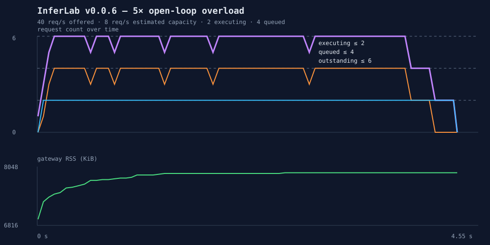

# v0.0.6 bounded-overload experiment

## Hypothesis

With execution limited to 2 and the admission queue limited to 4, a sustained 5× offered load should never produce more than 2 executing, 4 queued, or 6 outstanding requests. Excess work should receive fast, explicit 429 responses while admitted work continues completing.

## Reproduce

```bash
INFERLAB_RESULTS_DIR=docs/results/v0.0.6/raw ./scripts/proof-v0.0.6.sh
```

## Environment and workload

- Date: 2026-07-28
- Host: Apple arm64
- Rust: 1.97.1
- Topology: one gateway and one deterministic fake worker over loopback
- Worker initial response delay: 250 ms
- Worker concurrency: 2
- Global admission queue: 4
- Estimated capacity: 8 requests/second
- Offered traffic: 160 requests at a fixed 40 requests/second
- Offered load: 5× estimated capacity
- Gateway RSS sampling interval: 50 ms

The load client is open-loop: arrival times do not wait for earlier completions.

## Recorded result



| Outcome | Count |
|---|---:|
| HTTP 200 completed | 34 |
| HTTP 429 intentionally rejected | 126 |
| Transport failures | 0 |
| Unexpected HTTP statuses | 0 |

| Bound | Configured maximum | Observed peak |
|---|---:|---:|
| Worker executions | 2 | 2 |
| Queued requests | 4 | 4 |
| Outstanding requests | 6 | 6 |

| Latency | p50 | p90 | p95 | p99 | max |
|---|---:|---:|---:|---:|---:|
| Accepted | 780.547 ms | 795.342 ms | 795.926 ms | 797.827 ms | 797.827 ms |
| Rejected | 1.541 ms | 2.021 ms | 2.167 ms | 5.697 ms | 6.152 ms |

Gateway RSS moved from 6,944 KiB to a measured maximum of 7,920 KiB, an increase of 976 KiB. Open-loop dispatch lag was 7.290 ms p99 against a 25 ms arrival interval. After the load ended, executing, queued, outstanding, and worker in-flight counts all returned to zero.

Every rejection contained:

- HTTP `429 Too Many Requests`;
- `Retry-After: 1`; and
- JSON `error.type=gateway_overloaded`.

## Conclusion

The hypothesis was supported for this workload. The gateway hit every configured bound without exceeding one. It continued producing useful completions while shedding 78.75% of attempts quickly and intentionally.

The most important comparison is temporal: accepted requests waited through a controlled queue and remained below 800 ms p99, while rejected requests learned within about 6.4 ms p99 that the system could not responsibly admit them. An unbounded queue would convert those 126 honest rejections into growing latency and retained memory without increasing the worker's service rate.

The 976 KiB RSS increase supports bounded memory behavior on this host, but is not a universal heap guarantee. The experiment also uses a responsive worker. A hung worker would retain its permits indefinitely because deadlines are deliberately deferred to the next resilience milestone.

Raw evidence:

- [`overload-analysis.json`](raw/overload-analysis.json)
- [`overload-check.json`](raw/overload-check.json)
- [`backpressure-timeseries.svg`](raw/backpressure-timeseries.svg)
