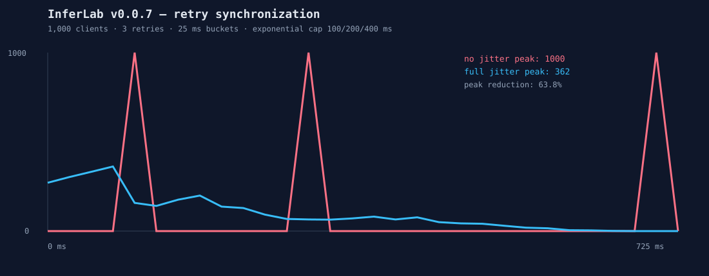

# v0.0.7 proof: deadline-aware, budgeted retries

This retained run demonstrates that retries improve availability without
giving every failure permission to multiply load.

## Result

| Claim | Measured evidence |
|---|---:|
| Original admitted requests | 20 |
| Total upstream attempts | 22 |
| Retries granted by the 10% budget | 2 |
| Requests recovered on alternate worker B | 2 |
| Retry opportunities denied by the budget | 4 |
| Deadline configuration | 180 ms |
| Observed deadline response | 504 in 187.447 ms |
| Retries after deadline response | 0 |
| Worker-observed remaining timeout | 179 ms |
| Synchronized retry peak | 1,000 per 25 ms bucket |
| Full-jitter retry peak | 362 per 25 ms bucket |
| Peak reduction | 63.8% |
| Full-jitter occupied buckets | 27 |
| Automated assertions | 16 of 16 passed |

The retry-budget probe first sent 10 healthy warmup requests. It then made
worker A fail every request and sent 10 more. Six requests reached A and saw a
transient 503. The budget allowed two of those requests to retry on B and
recover; the remaining four 503 responses were returned without amplification.
The final identity was:

```text
22 attempts = 20 original requests + 2 committed retries
```

The slow-worker probe separately proved that the deadline covers the whole
request. A configured 180 ms deadline returned a machine-readable
`request_deadline_exceeded` 504 in 187.447 ms, without starting a second
attempt. The worker received the remaining budget as a 179 ms header.

## Retry timing



In the deterministic simulation, 1,000 clients each scheduled three retries.
Without jitter they reconvened in three spikes of 1,000. Full jitter spread the
same 3,000 retry events across 27 buckets and cut the largest bucket to 362.

## Reproduce

```bash
./scripts/proof-v0.0.7.sh
```

To replace these retained artifacts with a new verified run:

```bash
INFERLAB_RESULTS_DIR=docs/results/v0.0.7/raw ./scripts/proof-v0.0.7.sh
```

## Raw artifacts

- [`resilience-check.json`](raw/resilience-check.json) — the 16 machine-readable assertions
- [`retry-budget.json`](raw/retry-budget.json) — per-request outcomes, counters, and worker-observed headers
- [`deadline.json`](raw/deadline.json) — the end-to-end deadline probe
- [`jitter-simulation.json`](raw/jitter-simulation.json) — both retry timelines
- [`retry-jitter.svg`](raw/retry-jitter.svg) — deterministic rendering of the simulation
