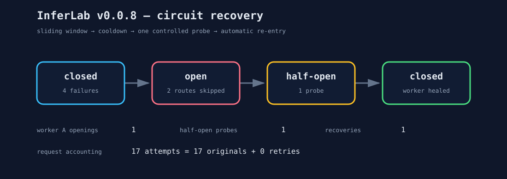

# v0.0.8 proof: circuit isolation and automatic recovery

This retained run demonstrates that InferLab stops spending requests on a
repeatedly failing worker and restores it through one controlled probe after it
heals.

## Result

| Claim | Measured evidence |
|---|---:|
| Worker A failures needed to trip | 4 |
| Worker A circuit openings | 1 |
| Requests sent to A while open | 0 |
| Open-A routing choices skipped | 2 |
| Healthy-B successes during open phase | 4 of 4 |
| Configured cooldown | 300 ms |
| State after cooldown | half-open |
| Half-open probes | 1 |
| Successful recoveries | 1 |
| Post-recovery distribution | A: 2, B: 2 |
| Original requests | 17 |
| Upstream attempts | 17 |
| Retries granted | 0 |
| Automated assertions | 15 of 15 passed |

The gateway began with A failing every request and B healthy. Round-robin sent
four of the first eight requests to each worker. A's four 503 responses filled
its four-outcome window at a 100% failure rate and opened only A's circuit.

The next four requests all succeeded on B. Two would ordinarily have selected
A, but circuit permits rejected those choices before queueing or making a
network attempt. A's process-level request count remained exactly four.

Worker A was then restarted healthy. After the 300 ms cooldown,
`/internal/workers` reported `half-open` with no probe in flight. The next
A-position request became the single probe, succeeded, cleared the old window,
and closed the circuit. The following four requests split evenly across A and
B.

## State transition



One retry per request was enabled. The 10% global budget denied the four early
failure-phase retries, and the open circuit prevented later repeated failures.
The final accounting identity therefore proves that the two controls cooperated
without amplification:

```text
17 upstream attempts = 17 original requests + 0 retries
```

## Reproduce

```bash
./scripts/proof-v0.0.8.sh
```

To replace these retained artifacts with a new verified run:

```bash
INFERLAB_RESULTS_DIR=docs/results/v0.0.8/raw ./scripts/proof-v0.0.8.sh
```

## Raw artifacts

- [`circuit-check.json`](raw/circuit-check.json) — the 15 machine-readable assertions
- [`trip.json`](raw/trip.json) — the four failures that opened worker A
- [`open.json`](raw/open.json) — traffic routed only to B while A was open
- [`half-open-status.json`](raw/half-open-status.json) — state after cooldown and before traffic
- [`probe.json`](raw/probe.json) — the single successful recovery probe
- [`recovered.json`](raw/recovered.json) — A and B sharing traffic after recovery
- [`circuit-recovery.svg`](raw/circuit-recovery.svg) — deterministic state-transition rendering
