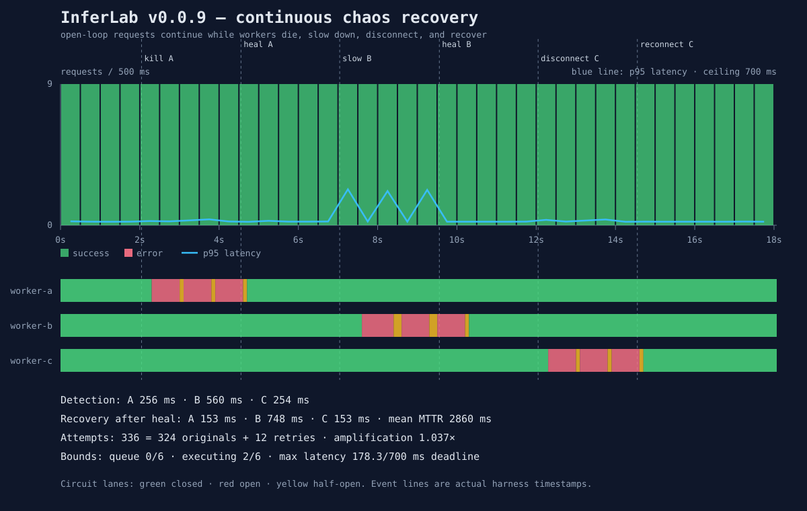

# v0.0.9 proof: continuous resilience chaos

This retained run keeps open-loop traffic flowing while three distinct worker
incidents occur, then aligns client results, gateway status, and exact fault
timestamps into one recovery curve.

## Hypothesis

With one of three workers impaired at a time, InferLab should:

- continue completing useful requests on the healthy workers;
- open the affected worker's circuit within 1.5 seconds;
- fail over within 500 ms;
- recover a healed worker through half-open probes within 1.8 seconds;
- keep retry amplification within the 10% cumulative budget;
- preserve admission, execution, deadline, and memory bounds; and
- restore 100% healthy traffic on all three workers.

## Timeline

| Approximate time | Event |
|---:|---|
| 0.0 s | Start continuous traffic |
| 2.0 s | Kill worker A |
| 4.5 s | Restart A healthy |
| 7.0 s | Restart B with 350 ms response delay |
| 9.5 s | Restore B to 12 ms |
| 12.0 s | Disconnect C by stopping its owned process |
| 14.5 s | Reconnect C healthy |
| 18.0 s | Stop continuous traffic |

The event file retains actual millisecond timestamps and exact target PIDs.

## Recovery curve



## Result

| Claim | Measured evidence |
|---|---:|
| Open-loop requests | 324 at 18 requests/second |
| Successful / failed | 324 / 0 |
| Baseline p95 latency | 19.414 ms |
| Slow-B p95 latency | 175.083 ms |
| Final p95 latency | 17.598 ms |
| A detection / failover / recovery | 256.243 / 27.720 / 152.566 ms |
| B detection / failover / recovery | 559.934 / 33.163 / 747.968 ms |
| C detection / failover / recovery | 253.777 / 21.672 / 152.814 ms |
| Mean MTTR, including injected fault duration | 2,859.911 ms |
| Upstream attempts | 336 |
| Committed retries / allowed | 12 / 32 |
| Retry amplification | 1.037× |
| Maximum client latency / deadline | 178.261 / 700 ms |
| Queue peak / configured | 0 / 6 |
| Execution peak / configured | 2 / 6 |
| Outstanding peak / configured | 2 / 12 |
| Gateway RSS increase | 1,056 KiB |
| Gateway status sample errors | 0 |
| Machine-readable assertions | 24 of 24 passed |

## Phase behavior

| Phase | Requests | Success | Attempts | Amplification | p95 latency |
|---|---:|---:|---:|---:|---:|
| Healthy baseline | 37 | 100% | 37 | 1.000× | 19.414 ms |
| A down | 45 | 100% | 49 | 1.089× | 20.664 ms |
| A recovery | 45 | 100% | 45 | 1.000× | 18.549 ms |
| B slow | 46 | 100% | 50 | 1.087× | 175.083 ms |
| B recovery | 44 | 100% | 44 | 1.000× | 17.855 ms |
| C disconnected | 45 | 100% | 49 | 1.089× | 25.788 ms |
| Final healthy | 62 | 100% | 62 | 1.000× | 17.598 ms |

Healthy workers carried every incident:

- while A was down, B completed 29 and C completed 16;
- while B was slow, A completed 17 and C completed 29; and
- while C was disconnected, A completed 29 and B completed 16.

All three workers returned in the final phase with distribution A=20, B=21,
C=21.

## Interpretation

The strongest result is not merely zero client errors. Every fault remained
visible in circuit and attempt telemetry:

```text
336 attempts = 324 originals + 12 retries
```

Each worker opened three times, ran three half-open probes, and recorded one
recovery. The first two probes occurred while the injected fault remained
active and correctly reopened the circuit. The probe after healing succeeded.
Each breaker rejected 12 route candidates while open or already probing.

The slow-B phase demonstrates why recovery analysis needs more than success
rate. All 46 requests succeeded, but p95 latency increased about 9×. Retries and
rerouting hid client errors without making the incident free.

## Safety evidence

- All services bound to `127.0.0.1`.
- Ports were checked before starting.
- Every fault event named an exact positive child PID.
- The harness verified parent PID ownership before every signal.
- Stopped PIDs were removed from the live cleanup set.
- No process-name matching, firewall changes, privileged actions, or external
  hosts were used.
- The final cleanup left all four test ports without listeners.

## Reproduce

```bash
./scripts/proof-v0.0.9.sh
```

To replace these retained artifacts:

```bash
INFERLAB_RESULTS_DIR=docs/results/v0.0.9/raw \
  ./scripts/proof-v0.0.9.sh
```

## Raw artifacts

- [`chaos-run.json`](raw/chaos-run.json) — every request plus 100 ms gateway,
  circuit, admission, resilience, and RSS samples
- [`events.jsonl`](raw/events.jsonl) — actual fault/heal times, modes, scopes,
  and target PIDs
- [`chaos-analysis.json`](raw/chaos-analysis.json) — phases, recovery metrics,
  chart bins, and circuit-state segments
- [`chaos-check.json`](raw/chaos-check.json) — 24 machine-readable assertions
- [`chaos-recovery.svg`](raw/chaos-recovery.svg) — deterministic rendering of
  the analysis

## Limitations

This is an 18-second, single-host, loopback experiment with deterministic fake
workers and sequential single-worker faults. It does not establish production
availability, real-network behavior, overlapping-fault tolerance, or real-model
performance. Status polling gives detection and recovery measurements roughly
100 ms observational resolution.

